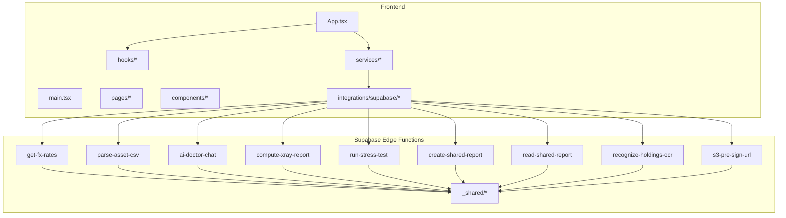
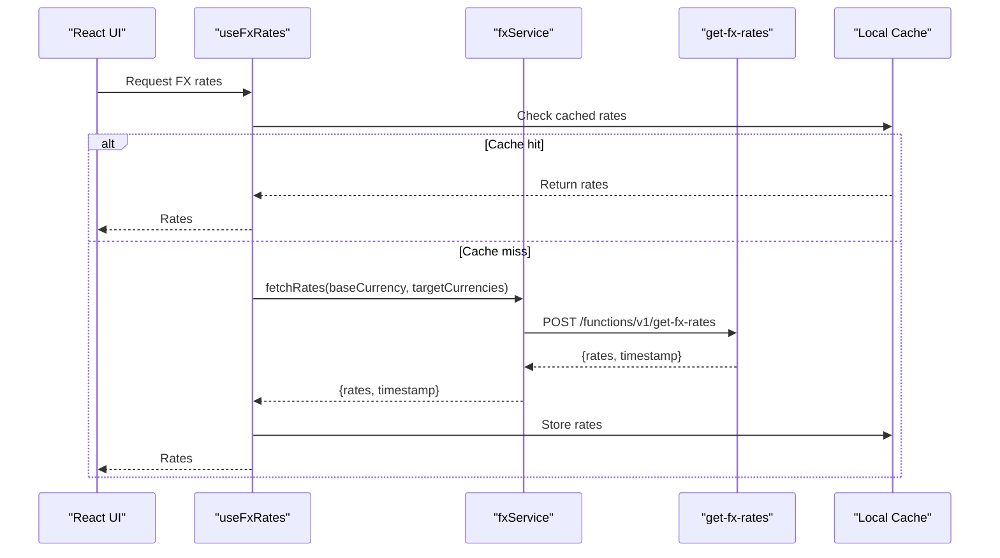
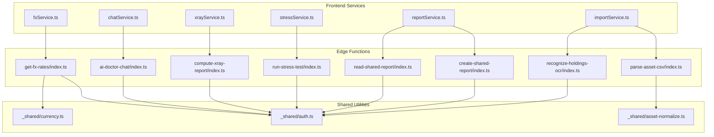

# API Reference

<cite>
**Referenced Files in This Document**
- [package.json](file://package.json)
- [vite.config.ts](file://vite.config.ts)
- [src/main.tsx](file://src/main.tsx)
- [src/App.tsx](file://src/App.tsx)
- [src/integrations/supabase/client.ts](file://src/integrations/supabase/client.ts)
- [src/integrations/supabase/types.ts](file://src/integrations/supabase/types.ts)
- [src/hooks/useFxRates.ts](file://src/hooks/useFxRates.ts)
- [src/hooks/useChat.ts](file://src/hooks/useChat.ts)
- [src/hooks/useXray.ts](file://src/hooks/useXray.ts)
- [src/hooks/useStress.ts](file://src/hooks/useStress.ts)
- [src/hooks/useShareReports.ts](file://src/hooks/useShareReports.ts)
- [src/services/fxService.ts](file://src/services/fxService.ts)
- [src/services/chatService.ts](file://src/services/chatService.ts)
- [src/services/xrayService.ts](file://src/services/xrayService.ts)
- [src/services/stressService.ts](file://src/services/stressService.ts)
- [src/services/reportService.ts](file://src/services/reportService.ts)
- [src/services/importService.ts](file://src/services/importService.ts)
- [src/services/assetService.ts](file://src/services/assetService.ts)
- [supabase/functions/get-fx-rates/index.ts](file://supabase/functions/get-fx-rates/index.ts)
- [supabase/functions/parse-asset-csv/index.ts](file://supabase/functions/parse-asset-csv/index.ts)
- [supabase/functions/ai-doctor-chat/index.ts](file://supabase/functions/ai-doctor-chat/index.ts)
- [supabase/functions/compute-xray-report/index.ts](file://supabase/functions/compute-xray-report/index.ts)
- [supabase/functions/run-stress-test/index.ts](file://supabase/functions/run-stress-test/index.ts)
- [supabase/functions/create-shared-report/index.ts](file://supabase/functions/create-shared-report/index.ts)
- [supabase/functions/read-shared-report/index.ts](file://supabase/functions/read-shared-report/index.ts)
- [supabase/functions/recognize-holdings-ocr/index.ts](file://supabase/functions/recognize-holdings-ocr/index.ts)
- [supabase/functions/s3-pre-sign-url/index.ts](file://supabase/functions/s3-pre-sign-url/index.ts)
- [supabase/functions/_shared/auth.ts](file://supabase/functions/_shared/auth.ts)
- [supabase/functions/_shared/currency.ts](file://supabase/functions/_shared/currency.ts)
- [supabase/functions/_shared/asset-normalize.ts](file://supabase/functions/_shared/asset-normalize.ts)
</cite>

## Table of Contents
1. [Introduction](#introduction)
2. [Project Structure](#project-structure)
3. [Core Components](#core-components)
4. [Architecture Overview](#architecture-overview)
5. [Detailed Component Analysis](#detailed-component-analysis)
6. [Dependency Analysis](#dependency-analysis)
7. [Performance Considerations](#performance-considerations)
8. [Troubleshooting Guide](#troubleshooting-guide)
9. [Conclusion](#conclusion)
10. [Appendices](#appendices)

## Introduction
This document provides comprehensive API documentation for FinSight’s Edge Functions and internal APIs. It covers serverless function endpoints, request/response schemas, authentication requirements, and client integration patterns using the Supabase JavaScript client. Topics include currency exchange rate retrieval, CSV asset parsing, AI chat interface, X-Ray report generation, stress testing execution, shared report management, WebSocket connections for real-time features, file upload protocols for OCR processing, and data transformation pipelines. Security considerations, input validation, and performance optimization strategies are also addressed.

## Project Structure
FinSight is a modern web application built with React and Vite, integrated with Supabase for backend services. The project organizes functionality into:
- Frontend pages and components under src/pages and src/components
- Client-side hooks and services under src/hooks and src/services
- Supabase Edge Functions under supabase/functions
- Shared utilities and types under src/lib and src/types
- Database migrations under supabase/migrations

**Diagram sources**
- [src/App.tsx](file://src/App.tsx)
- [src/main.tsx](file://src/main.tsx)
- [src/integrations/supabase/client.ts](file://src/integrations/supabase/client.ts)
- [supabase/functions/get-fx-rates/index.ts](file://supabase/functions/get-fx-rates/index.ts)
- [supabase/functions/parse-asset-csv/index.ts](file://supabase/functions/parse-asset-csv/index.ts)
- [supabase/functions/ai-doctor-chat/index.ts](file://supabase/functions/ai-doctor-chat/index.ts)
- [supabase/functions/compute-xray-report/index.ts](file://supabase/functions/compute-xray-report/index.ts)
- [supabase/functions/run-stress-test/index.ts](file://supabase/functions/run-stress-test/index.ts)
- [supabase/functions/create-shared-report/index.ts](file://supabase/functions/create-shared-report/index.ts)
- [supabase/functions/read-shared-report/index.ts](file://supabase/functions/read-shared-report/index.ts)
- [supabase/functions/recognize-holdings-ocr/index.ts](file://supabase/functions/recognize-holdings-ocr/index.ts)
- [supabase/functions/s3-pre-sign-url/index.ts](file://supabase/functions/s3-pre-sign-url/index.ts)
- [supabase/functions/_shared/auth.ts](file://supabase/functions/_shared/auth.ts)
- [supabase/functions/_shared/currency.ts](file://supabase/functions/_shared/currency.ts)
- [supabase/functions/_shared/asset-normalize.ts](file://supabase/functions/_shared/asset-normalize.ts)

**Section sources**
- [package.json](file://package.json)
- [vite.config.ts](file://vite.config.ts)
- [src/main.tsx](file://src/main.tsx)
- [src/App.tsx](file://src/App.tsx)

## Core Components
FinSight’s core components include:
- Supabase client initialization and typed helpers
- Service modules encapsulating HTTP calls to Edge Functions
- Hooks providing reactive state and side effects
- Shared utilities for authentication, currency conversion, and asset normalization

Key responsibilities:
- Authentication and session handling via Supabase
- Currency exchange rate retrieval and caching
- CSV parsing and asset normalization
- AI chat streaming responses
- X-Ray report computation
- Stress test execution and progress tracking
- Shared report creation and reading
- OCR recognition and S3 pre-signed URL generation

**Section sources**
- [src/integrations/supabase/client.ts](file://src/integrations/supabase/client.ts)
- [src/integrations/supabase/types.ts](file://src/integrations/supabase/types.ts)
- [src/services/fxService.ts](file://src/services/fxService.ts)
- [src/services/chatService.ts](file://src/services/chatService.ts)
- [src/services/xrayService.ts](file://src/services/xrayService.ts)
- [src/services/stressService.ts](file://src/services/stressService.ts)
- [src/services/reportService.ts](file://src/services/reportService.ts)
- [src/services/importService.ts](file://src/services/importService.ts)
- [src/services/assetService.ts](file://src/services/assetService.ts)
- [src/hooks/useFxRates.ts](file://src/hooks/useFxRates.ts)
- [src/hooks/useChat.ts](file://src/hooks/useChat.ts)
- [src/hooks/useXray.ts](file://src/hooks/useXray.ts)
- [src/hooks/useStress.ts](file://src/hooks/useStress.ts)
- [src/hooks/useShareReports.ts](file://src/hooks/useShareReports.ts)

## Architecture Overview
The system follows a layered architecture:
- Frontend layers (pages, components, hooks, services) interact with Supabase Edge Functions via RESTful HTTP calls
- Edge Functions handle business logic, external API calls, and database operations
- Shared modules provide reusable utilities for auth, currency, and asset normalization
- Real-time features use Supabase channels and events

**Diagram sources**
- [src/hooks/useFxRates.ts](file://src/hooks/useFxRates.ts)
- [src/services/fxService.ts](file://src/services/fxService.ts)
- [supabase/functions/get-fx-rates/index.ts](file://supabase/functions/get-fx-rates/index.ts)

## Detailed Component Analysis

### Currency Exchange Rate Retrieval
- Endpoint: GET or POST to /functions/v1/get-fx-rates
- Purpose: Retrieve current exchange rates for specified currencies
- Authentication: Requires valid Supabase session token
- Request parameters:
  - baseCurrency: string (ISO 4217 code)
  - targetCurrencies: string[] (array of ISO 4217 codes)
- Response schema:
  - rates: object mapping currency codes to exchange rates
  - timestamp: number (Unix timestamp of last update)
  - source: string (external API provider)
- Error codes:
  - 401: Unauthorized (invalid or missing token)
  - 400: Bad request (invalid currency codes)
  - 500: Internal server error (external API failure)
- Rate limiting: Applied at Edge Function level; typical limits enforced by provider

Client implementation example using Supabase JS client:
- Use fxService.fetchRates(baseCurrency, targetCurrencies)
- Handle errors with try/catch and display user-friendly messages
- Implement local caching to reduce API calls

**Section sources**
- [src/services/fxService.ts](file://src/services/fxService.ts)
- [src/hooks/useFxRates.ts](file://src/hooks/useFxRates.ts)
- [supabase/functions/get-fx-rates/index.ts](file://supabase/functions/get-fx-rates/index.ts)
- [supabase/functions/_shared/currency.ts](file://supabase/functions/_shared/currency.ts)

### CSV Asset Parsing
- Endpoint: POST to /functions/v1/parse-asset-csv
- Purpose: Parse uploaded CSV files containing asset holdings
- Authentication: Required
- Request body:
  - file: File object (CSV format)
  - options: object with parsing options (e.g., delimiter, header row)
- Response schema:
  - assets: array of normalized asset objects
  - errors: array of parsing error descriptions
  - summary: object with counts and statistics
- Error codes:
  - 401: Unauthorized
  - 400: Invalid CSV format or missing required columns
  - 500: Server error during parsing
- Data transformation pipeline:
  - CSV parsing → Validation → Normalization → Output

Client implementation example:
- Use importService.parseCsv(file, options)
- Display progress and errors to users
- Allow manual correction of parsed assets

**Section sources**
- [src/services/importService.ts](file://src/services/importService.ts)
- [supabase/functions/parse-asset-csv/index.ts](file://supabase/functions/parse-asset-csv/index.ts)
- [supabase/functions/_shared/asset-normalize.ts](file://supabase/functions/_shared/asset-normalize.ts)

### AI Chat Interface
- Endpoint: POST to /functions/v1/ai-doctor-chat
- Purpose: Provide AI-powered financial advice through chat interface
- Authentication: Required
- Request schema:
  - messages: array of message objects with role and content
  - model: string (AI model identifier)
  - temperature: number (creativity parameter)
- Response schema:
  - message: object with AI response content
  - usage: object with token usage statistics
  - metadata: object with additional context
- Streaming support: Uses SSE or WebSocket for real-time responses
- Error codes:
  - 401: Unauthorized
  - 400: Invalid message format
  - 429: Rate limit exceeded
  - 500: AI service error

Client implementation example:
- Use chatService.sendMessage(messages, options)
- Handle streaming responses with event listeners
- Implement retry logic for failed requests

**Section sources**
- [src/services/chatService.ts](file://src/services/chatService.ts)
- [src/hooks/useChat.ts](file://src/hooks/useChat.ts)
- [supabase/functions/ai-doctor-chat/index.ts](file://supabase/functions/ai-doctor-chat/index.ts)

### X-Ray Report Generation
- Endpoint: POST to /functions/v1/compute-xray-report
- Purpose: Generate comprehensive portfolio analysis reports
- Authentication: Required
- Request schema:
  - portfolioId: string (portfolio identifier)
  - dateRange: object with start and end dates
  - metrics: array of metric identifiers
  - options: object with report customization options
- Response schema:
  - reportId: string (unique report identifier)
  - status: string (processing status)
  - data: object with computed metrics and visualizations
  - downloadUrl: string (PDF download link when ready)
- Processing time: May take several minutes for large portfolios
- Error codes:
  - 401: Unauthorized
  - 400: Invalid portfolio ID or date range
  - 500: Computation error

Client implementation example:
- Use xrayService.generateReport(portfolioId, dateRange, metrics)
- Poll for completion status
- Download completed reports

**Section sources**
- [src/services/xrayService.ts](file://src/services/xrayService.ts)
- [src/hooks/useXray.ts](file://src/hooks/useXray.ts)
- [supabase/functions/compute-xray-report/index.ts](file://supabase/functions/compute-xray-report/index.ts)

### Stress Testing Execution
- Endpoint: POST to /functions/v1/run-stress-test
- Purpose: Execute portfolio stress tests under various market scenarios
- Authentication: Required
- Request schema:
  - portfolioId: string
  - scenarios: array of stress scenario definitions
  - parameters: object with test configuration
- Response schema:
  - testId: string (test execution identifier)
  - status: string (running/completed/failed)
  - results: object with stress test outcomes
- Real-time updates: Supports WebSocket for live progress
- Error codes:
  - 401: Unauthorized
  - 400: Invalid scenario definition
  - 500: Test execution error

Client implementation example:
- Use stressService.runTest(portfolioId, scenarios, parameters)
- Subscribe to progress updates
- Display results and recommendations

**Section sources**
- [src/services/stressService.ts](file://src/services/stressService.ts)
- [src/hooks/useStress.ts](file://src/hooks/useStress.ts)
- [supabase/functions/run-stress-test/index.ts](file://supabase/functions/run-stress-test/index.ts)

### Shared Report Management
- Endpoints:
  - POST /functions/v1/create-shared-report
  - GET /functions/v1/read-shared-report
- Purpose: Create and access shared portfolio reports
- Authentication: Required for creation; optional for reading based on permissions
- Create request schema:
  - portfolioId: string
  - visibility: string (public/private)
  - password: string (optional for private reports)
  - expirationDate: string (ISO date format)
- Read request schema:
  - reportId: string
  - password: string (for protected reports)
- Response schema:
  - reportId: string
  - url: string (shareable link)
  - status: string (active/expired/deleted)
  - metadata: object with sharing settings
- Error codes:
  - 401: Unauthorized
  - 400: Invalid report ID or permissions
  - 404: Report not found
  - 410: Report expired

Client implementation example:
- Use reportService.createSharedReport(portfolioId, settings)
- Use reportService.readSharedReport(reportId, password)
- Handle expiration and permission checks

**Section sources**
- [src/services/reportService.ts](file://src/services/reportService.ts)
- [src/hooks/useShareReports.ts](file://src/hooks/useShareReports.ts)
- [supabase/functions/create-shared-report/index.ts](file://supabase/functions/create-shared-report/index.ts)
- [supabase/functions/read-shared-report/index.ts](file://supabase/functions/read-shared-report/index.ts)

### OCR Holdings Recognition
- Endpoint: POST to /functions/v1/recognize-holdings-ocr
- Purpose: Extract portfolio holdings from images using OCR
- Authentication: Required
- Request schema:
  - image: File object (JPEG/PNG format)
  - language: string (OCR language code)
  - options: object with OCR processing options
- Response schema:
  - holdings: array of extracted holding objects
  - confidence: number (overall confidence score)
  - errors: array of extraction errors
- File upload protocol:
  - Direct file upload to S3 using pre-signed URLs
  - Edge function returns pre-signed URL for upload
- Error codes:
  - 401: Unauthorized
  - 400: Invalid image format or size
  - 500: OCR processing error

Client implementation example:
- Use importService.uploadImageForOcr(imageFile)
- Process OCR results and allow user verification
- Handle image validation and compression

**Section sources**
- [supabase/functions/recognize-holdings-ocr/index.ts](file://supabase/functions/recognize-holdings-ocr/index.ts)
- [supabase/functions/s3-pre-sign-url/index.ts](file://supabase/functions/s3-pre-sign-url/index.ts)
- [src/services/importService.ts](file://src/services/importService.ts)

### WebSocket Connections for Real-Time Features
- Connection endpoint: wss://[supabase-url]/realtime/v1
- Purpose: Real-time updates for chat, stress tests, and notifications
- Authentication: Uses Supabase session token in connection URL
- Channels:
  - chat_messages: Real-time chat message updates
  - stress_tests: Live stress test progress
  - notifications: System notifications and alerts
- Message format: JSON with type, payload, and metadata
- Reconnection logic: Automatic reconnection with exponential backoff

Client implementation example:
- Initialize Supabase client with realtime options
- Subscribe to relevant channels
- Handle connection events and errors

**Section sources**
- [src/integrations/supabase/client.ts](file://src/integrations/supabase/client.ts)
- [src/hooks/useChat.ts](file://src/hooks/useChat.ts)
- [src/hooks/useStress.ts](file://src/hooks/useStress.ts)

## Dependency Analysis
The system has clear dependency relationships between frontend services and Edge Functions:

**Diagram sources**
- [src/services/fxService.ts](file://src/services/fxService.ts)
- [src/services/chatService.ts](file://src/services/chatService.ts)
- [src/services/xrayService.ts](file://src/services/xrayService.ts)
- [src/services/stressService.ts](file://src/services/stressService.ts)
- [src/services/reportService.ts](file://src/services/reportService.ts)
- [src/services/importService.ts](file://src/services/importService.ts)
- [supabase/functions/get-fx-rates/index.ts](file://supabase/functions/get-fx-rates/index.ts)
- [supabase/functions/ai-doctor-chat/index.ts](file://supabase/functions/ai-doctor-chat/index.ts)
- [supabase/functions/compute-xray-report/index.ts](file://supabase/functions/compute-xray-report/index.ts)
- [supabase/functions/run-stress-test/index.ts](file://supabase/functions/run-stress-test/index.ts)
- [supabase/functions/create-shared-report/index.ts](file://supabase/functions/create-shared-report/index.ts)
- [supabase/functions/read-shared-report/index.ts](file://supabase/functions/read-shared-report/index.ts)
- [supabase/functions/parse-asset-csv/index.ts](file://supabase/functions/parse-asset-csv/index.ts)
- [supabase/functions/recognize-holdings-ocr/index.ts](file://supabase/functions/recognize-holdings-ocr/index.ts)
- [supabase/functions/_shared/auth.ts](file://supabase/functions/_shared/auth.ts)
- [supabase/functions/_shared/currency.ts](file://supabase/functions/_shared/currency.ts)
- [supabase/functions/_shared/asset-normalize.ts](file://supabase/functions/_shared/asset-normalize.ts)

**Section sources**
- [src/services/fxService.ts](file://src/services/fxService.ts)
- [src/services/chatService.ts](file://src/services/chatService.ts)
- [src/services/xrayService.ts](file://src/services/xrayService.ts)
- [src/services/stressService.ts](file://src/services/stressService.ts)
- [src/services/reportService.ts](file://src/services/reportService.ts)
- [src/services/importService.ts](file://src/services/importService.ts)

## Performance Considerations
- **Caching Strategy**: Implement local caching for frequently accessed data like exchange rates
- **Request Optimization**: Batch multiple API calls when possible to reduce network overhead
- **Streaming Responses**: Use streaming for long-running operations like AI chat and stress tests
- **Image Optimization**: Compress images before OCR processing to reduce upload times
- **Database Queries**: Optimize queries with proper indexing and pagination
- **Error Handling**: Implement retry logic with exponential backoff for transient failures
- **Memory Management**: Clean up unused resources and cancel pending requests on component unmount

## Troubleshooting Guide
Common issues and solutions:
- **Authentication Errors**: Verify Supabase session token validity and expiration
- **Rate Limiting**: Implement request queuing and retry logic
- **Network Timeouts**: Configure appropriate timeout values and implement fallback mechanisms
- **Data Validation**: Validate all inputs on both client and server sides
- **CORS Issues**: Ensure proper CORS configuration for cross-origin requests
- **WebSocket Disconnections**: Implement automatic reconnection with backoff strategy

**Section sources**
- [supabase/functions/_shared/auth.ts](file://supabase/functions/_shared/auth.ts)
- [src/integrations/supabase/client.ts](file://src/integrations/supabase/client.ts)

## Conclusion
FinSight’s API architecture provides a robust foundation for financial portfolio management features. The separation of concerns between frontend services and Edge Functions ensures scalability and maintainability. The comprehensive error handling, authentication, and security measures protect against common vulnerabilities while providing a smooth user experience. Future enhancements should focus on performance optimization, additional caching strategies, and expanded feature sets.

## Appendices

### Authentication Flow
All Edge Functions require authentication using Supabase JWT tokens. The authentication flow includes:
- Client-side session management
- Token refresh on expiration
- Permission-based access control
- Audit logging for security compliance

### Error Code Reference
- 400: Bad Request - Invalid input parameters
- 401: Unauthorized - Missing or invalid authentication
- 403: Forbidden - Insufficient permissions
- 404: Not Found - Resource does not exist
- 429: Too Many Requests - Rate limit exceeded
- 500: Internal Server Error - Server-side processing error
- 503: Service Unavailable - Temporary service outage

### Data Transformation Pipeline
The asset data transformation pipeline includes:
- Input validation and sanitization
- Format standardization
- Currency conversion
- Duplicate detection and resolution
- Quality scoring and validation