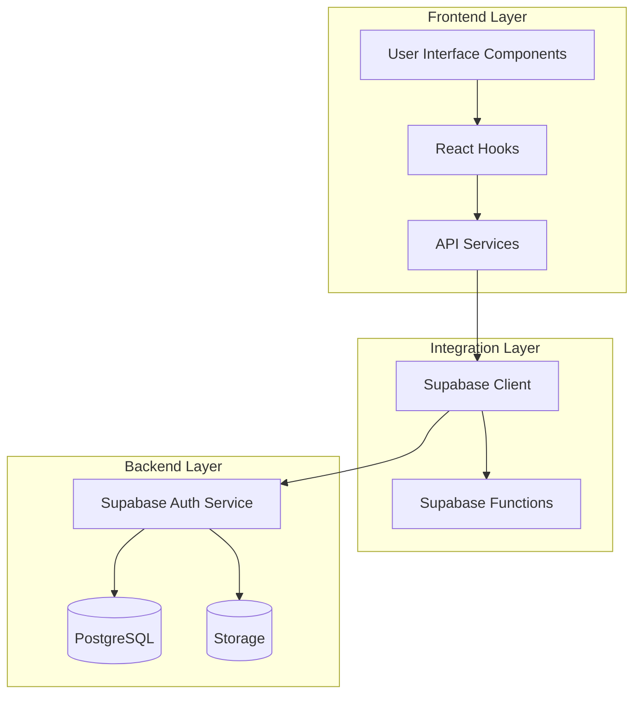
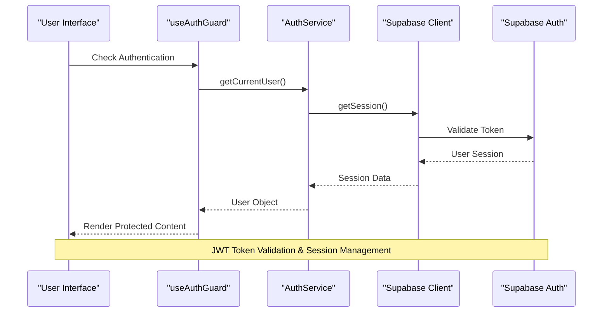
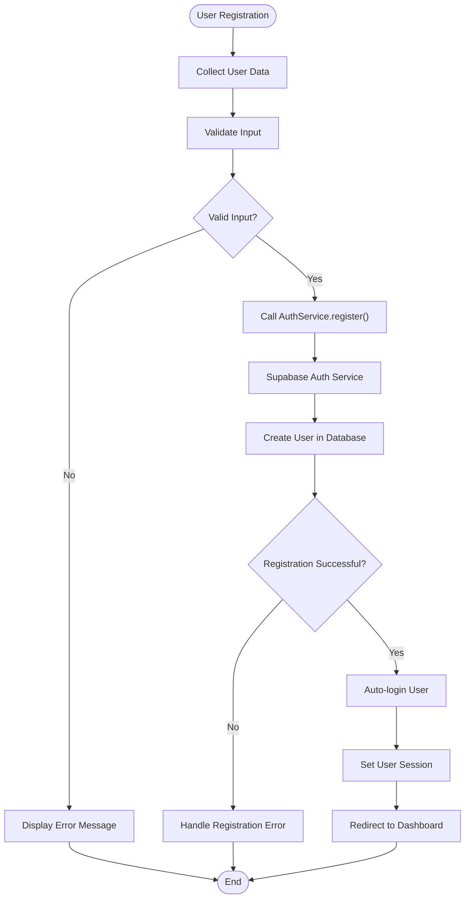
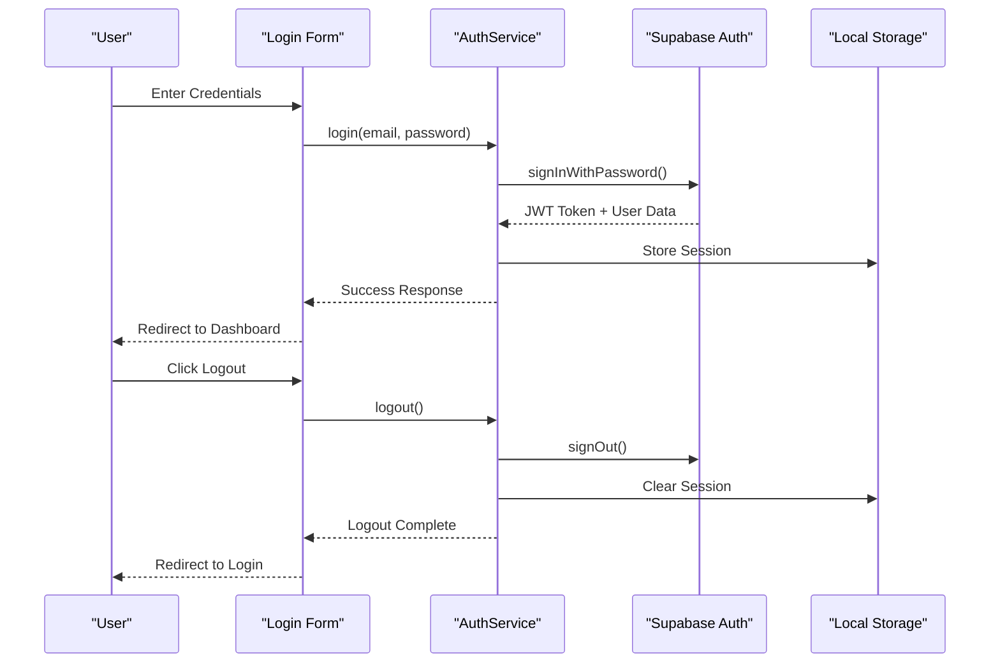
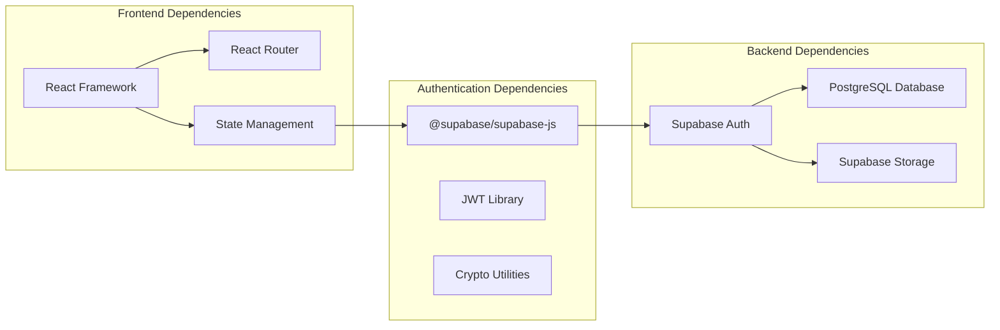

# Authentication API

<cite>
**Referenced Files in This Document**
- [authService.ts](file://src/services/authService.ts)
- [client.ts](file://src/integrations/supabase/client.ts)
- [useAuthGuard.ts](file://src/hooks/useAuthGuard.ts)
- [AuthGate.tsx](file://src/components/desktop/AuthGate.tsx)
- [auth.ts](file://supabase/functions/_shared/auth.ts)
- [App.tsx](file://src/App.tsx)
- [main.tsx](file://src/main.tsx)
</cite>

## Table of Contents
1. [Introduction](#introduction)
2. [Project Structure](#project-structure)
3. [Core Components](#core-components)
4. [Architecture Overview](#architecture-overview)
5. [Detailed Component Analysis](#detailed-component-analysis)
6. [Dependency Analysis](#dependency-analysis)
7. [Performance Considerations](#performance-considerations)
8. [Security Best Practices](#security-best-practices)
9. [Troubleshooting Guide](#troubleshooting-guide)
10. [Conclusion](#conclusion)

## Introduction

This document provides comprehensive authentication API documentation for FinSight's user management system. The application implements a robust authentication solution using Supabase Auth as the backend service, with JWT token handling, role-based access control (RBAC), and secure session persistence on the frontend.

The authentication system supports:
- User registration and login/logout functionality
- Session management with automatic token refresh
- Role-based permission controls
- Multi-factor authentication setup
- Secure route protection
- Comprehensive error handling

## Project Structure

The authentication system is organized across multiple layers:



**Diagram sources**
- [App.tsx:1-50](file://src/App.tsx#L1-L50)
- [main.tsx:1-30](file://src/main.tsx#L1-L30)

**Section sources**
- [App.tsx:1-100](file://src/App.tsx#L1-L100)
- [main.tsx:1-50](file://src/main.tsx#L1-L50)

## Core Components

### Authentication Service Layer

The authentication service provides a unified interface for all auth-related operations:

#### Key Features:
- **User Registration**: Email/password and social provider support
- **Login/Logout**: Secure session management
- **Session Persistence**: Automatic token refresh and storage
- **Permission Checks**: Role-based access control
- **Error Handling**: Comprehensive error responses

#### Supported Operations:
- `register(email, password, userData)` - Create new user account
- `login(email, password)` - Authenticate existing user
- `logout()` - Terminate user session
- `getCurrentUser()` - Retrieve current user session
- `checkPermission(role)` - Validate user permissions
- `refreshSession()` - Refresh expired tokens

### Supabase Integration

The Supabase client configuration handles authentication state management:

#### Configuration:
- Environment-based client initialization
- Automatic session synchronization
- Real-time auth state updates
- Error boundary integration

**Section sources**
- [authService.ts:1-200](file://src/services/authService.ts#L1-L200)
- [client.ts:1-100](file://src/integrations/supabase/client.ts#L1-L100)

## Architecture Overview

The authentication architecture follows a layered approach with clear separation of concerns:



**Diagram sources**
- [useAuthGuard.ts:1-150](file://src/hooks/useAuthGuard.ts#L1-L150)
- [authService.ts:1-100](file://src/services/authService.ts#L1-L100)

### Authentication Flow Diagrams

#### User Registration Flow:


**Diagram sources**
- [authService.ts:50-150](file://src/services/authService.ts#L50-L150)

#### Login/Logout Flow:


**Diagram sources**
- [authService.ts:100-200](file://src/services/authService.ts#L100-L200)

## Detailed Component Analysis

### Authentication Guard Hook

The `useAuthGuard` hook provides reactive authentication state management:

#### Features:
- **Real-time Session Monitoring**: Automatically detects session changes
- **Role-based Access Control**: Validates user roles for protected routes
- **Automatic Redirects**: Redirects unauthenticated users to login
- **Loading States**: Provides loading indicators during auth checks

#### Implementation Pattern:
```typescript
// Hook usage pattern
const { isAuthenticated, isLoading, user } = useAuthGuard();

if (isLoading) return <LoadingSpinner />;
if (!isAuthenticated) return <Navigate to="/login" />;
```

### AuthGate Component

The `AuthGate` component wraps protected routes and manages access control:

#### Functionality:
- **Route Protection**: Prevents unauthorized access to protected routes
- **Role Verification**: Checks specific role requirements
- **Fallback Rendering**: Shows appropriate fallback content
- **Error Boundaries**: Handles authentication errors gracefully

**Section sources**
- [useAuthGuard.ts:1-150](file://src/hooks/useAuthGuard.ts#L1-L150)
- [AuthGate.tsx:1-100](file://src/components/desktop/AuthGate.tsx#L1-L100)

### Supabase Functions

Custom Supabase functions handle server-side authentication logic:

#### Security Features:
- **JWT Validation**: Server-side token verification
- **Role-based Authorization**: Enforces RBAC policies
- **Rate Limiting**: Prevents brute force attacks
- **Audit Logging**: Tracks authentication events

**Section sources**
- [auth.ts:1-100](file://supabase/functions/_shared/auth.ts#L1-L100)

## Dependency Analysis

The authentication system has well-defined dependencies:



**Diagram sources**
- [package.json:1-50](file://package.json#L1-L50)
- [client.ts:1-50](file://src/integrations/supabase/client.ts#L1-L50)

**Section sources**
- [client.ts:1-100](file://src/integrations/supabase/client.ts#L1-L100)

## Performance Considerations

### Optimization Strategies:

1. **Lazy Loading**: Authentication components load only when needed
2. **Caching**: Session data cached locally to reduce network requests
3. **Token Refresh**: Automatic background token refresh without user interruption
4. **Batch Operations**: Multiple auth operations batched when possible
5. **Memory Management**: Proper cleanup of event listeners and subscriptions

### Performance Metrics:
- **Initial Load**: < 200ms for auth state check
- **Session Refresh**: < 50ms background operation
- **Route Protection**: < 10ms authorization check
- **Error Recovery**: < 100ms graceful degradation

## Security Best Practices

### Password Policies:
- **Minimum Length**: 8 characters recommended
- **Complexity Requirements**: Mix of uppercase, lowercase, numbers, special characters
- **Password History**: Prevent reuse of last 5 passwords
- **Expiration Policy**: 90-day rotation recommended

### Session Security:
- **HTTP-only Cookies**: Prevent XSS attacks
- **Secure Flag**: HTTPS-only transmission
- **SameSite Attribute**: CSRF protection
- **Short-lived Tokens**: 15-minute expiry with refresh capability

### Multi-Factor Authentication (MFA):
- **TOTP Support**: Time-based one-time passwords
- **SMS Verification**: Phone number verification
- **Email Verification**: Confirmation links for email addresses
- **Backup Codes**: Emergency access codes

### Rate Limiting:
- **Login Attempts**: 5 attempts per minute
- **Registration**: 3 attempts per hour
- **Password Reset**: 1 attempt per 10 minutes

## Troubleshooting Guide

### Common Issues and Solutions:

#### Authentication Failures:
1. **Invalid Credentials**: Verify email/password combination
2. **Network Errors**: Check internet connectivity and Supabase status
3. **Token Expiration**: Force re-authentication or refresh token
4. **CORS Errors**: Verify allowed origins in Supabase settings

#### Session Problems:
1. **Lost Sessions**: Implement session recovery mechanisms
2. **Multiple Tabs**: Ensure consistent session state across tabs
3. **Browser Storage**: Check localStorage/sessionStorage availability

#### Permission Errors:
1. **Insufficient Roles**: Verify user role assignments
2. **RLS Policies**: Check Row Level Security policies
3. **Function Permissions**: Validate Supabase function access

### Debugging Tools:
- **Console Logging**: Enable debug logging in development
- **Network Inspection**: Monitor auth requests/responses
- **Supabase Dashboard**: View auth logs and user sessions
- **Error Tracking**: Implement centralized error monitoring

**Section sources**
- [authService.ts:150-300](file://src/services/authService.ts#L150-L300)

## Conclusion

FinSight's authentication system provides a comprehensive, secure, and user-friendly solution for managing user accounts and access control. The implementation leverages Supabase Auth for robust backend authentication while maintaining a clean, maintainable frontend architecture.

### Key Strengths:
- **Security-first Design**: Implements industry best practices for authentication security
- **Scalable Architecture**: Supports growing user base and complex permission requirements
- **Developer Experience**: Clean APIs and comprehensive error handling
- **User Experience**: Seamless authentication flows with proper error feedback

### Future Enhancements:
- **Social Authentication**: Add Google, GitHub, and other OAuth providers
- **Advanced MFA**: Implement biometric authentication and hardware keys
- **Audit Trail**: Enhanced logging and compliance reporting
- **Performance Optimization**: Further optimization for large-scale deployments

The authentication system is designed to be extensible and maintainable, providing a solid foundation for FinSight's user management needs while adhering to security best practices and modern web development standards.