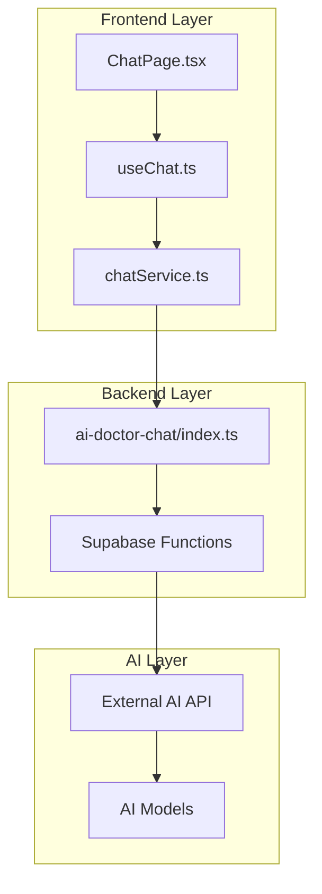
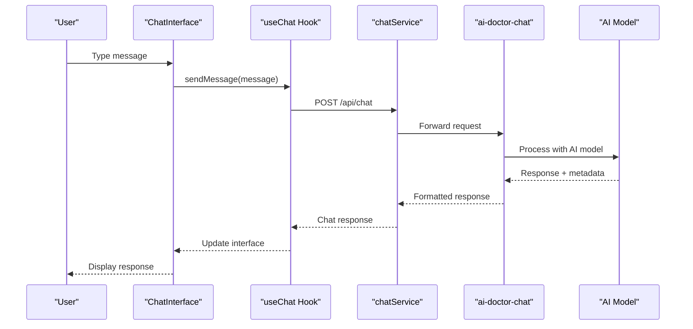
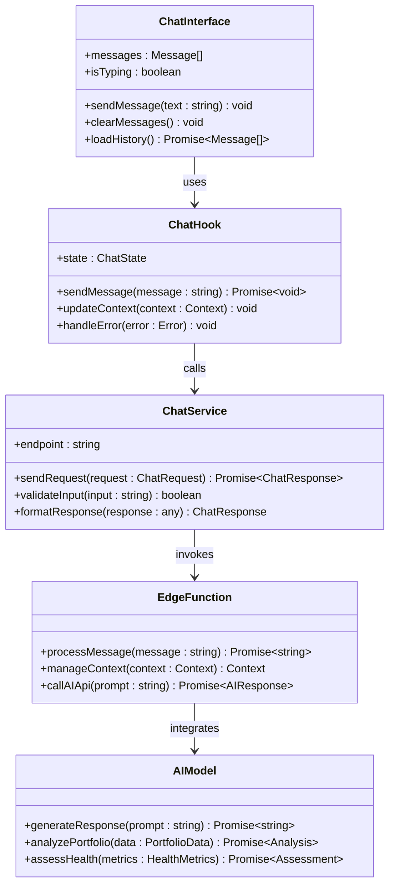
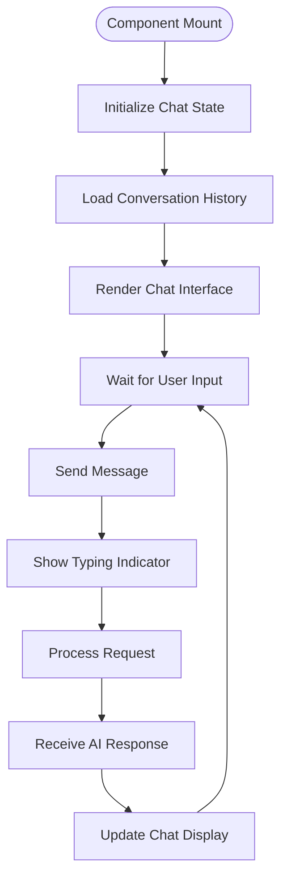
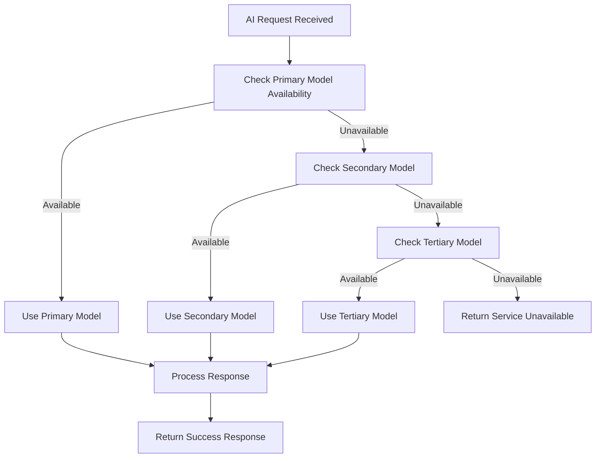
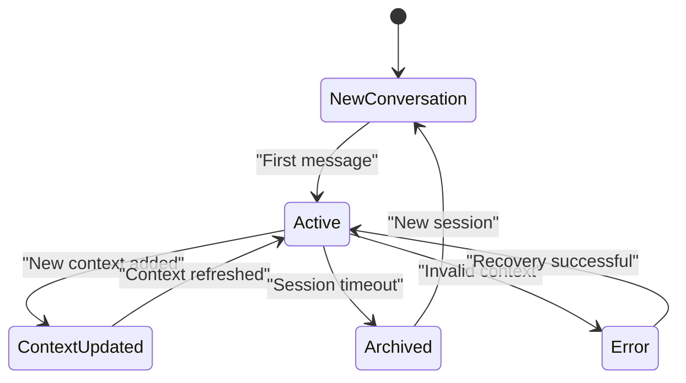
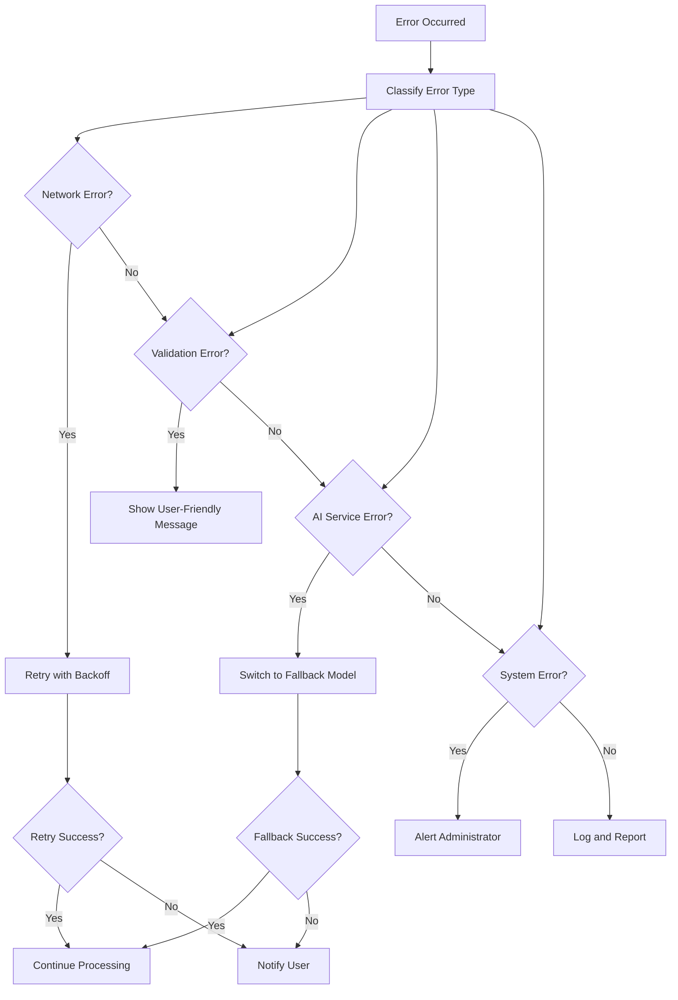

# AI Integration Services

<cite>
**Referenced Files in This Document**
- [ai-doctor-chat/index.ts](file://supabase/functions/ai-doctor-chat/index.ts)
- [chatService.ts](file://src/services/chatService.ts)
- [useChat.ts](file://src/hooks/useChat.ts)
- [ChatPage.tsx](file://src/pages/desktop/ChatPage.tsx)
</cite>

## Table of Contents
1. [Introduction](#introduction)
2. [Project Structure](#project-structure)
3. [Core Components](#core-components)
4. [Architecture Overview](#architecture-overview)
5. [Detailed Component Analysis](#detailed-component-analysis)
6. [API Documentation](#api-documentation)
7. [AI Model Integration](#ai-model-integration)
8. [Conversation Management](#conversation-management)
9. [Security Considerations](#security-considerations)
10. [Error Handling](#error-handling)
11. [Performance Considerations](#performance-considerations)
12. [Troubleshooting Guide](#troubleshooting-guide)
13. [Conclusion](#conclusion)

## Introduction

FinSight's AI-powered chat interface provides intelligent financial portfolio analysis through natural language processing. The system leverages advanced AI models to deliver personalized investment insights, health assessments, and actionable recommendations while maintaining strict security standards for sensitive financial data.

The chat interface serves as a conversational gateway to complex financial analytics, enabling users to ask questions about their portfolios, receive health assessments, and get tailored investment recommendations through intuitive natural language interactions.

## Project Structure

The AI chat functionality is implemented across multiple layers:



**Diagram sources**
- [ChatPage.tsx:1-50](file://src/pages/desktop/ChatPage.tsx#L1-L50)
- [useChat.ts:1-30](file://src/hooks/useChat.ts#L1-L30)
- [chatService.ts:1-40](file://src/services/chatService.ts#L1-L40)
- [ai-doctor-chat/index.ts:1-25](file://supabase/functions/ai-doctor-chat/index.ts#L1-L25)

**Section sources**
- [ChatPage.tsx:1-100](file://src/pages/desktop/ChatPage.tsx#L1-L100)
- [useChat.ts:1-80](file://src/hooks/useChat.ts#L1-L80)
- [chatService.ts:1-120](file://src/services/chatService.ts#L1-L120)
- [ai-doctor-chat/index.ts:1-200](file://supabase/functions/ai-doctor-chat/index.ts#L1-L200)

## Core Components

### Chat Interface Components

The chat system consists of several key components working together:

1. **User Interface Layer**: React-based chat interface with real-time messaging
2. **State Management**: Custom hooks for conversation state and message handling
3. **Service Layer**: API communication and request/response handling
4. **Edge Function**: Server-side processing and AI model integration
5. **AI Integration**: External AI service communication and response parsing

### Data Flow Architecture



**Diagram sources**
- [ChatPage.tsx:50-150](file://src/pages/desktop/ChatPage.tsx#L50-L150)
- [useChat.ts:30-120](file://src/hooks/useChat.ts#L30-L120)
- [chatService.ts:40-160](file://src/services/chatService.ts#L40-L160)
- [ai-doctor-chat/index.ts:25-100](file://supabase/functions/ai-doctor-chat/index.ts#L25-L100)

**Section sources**
- [ChatPage.tsx:1-200](file://src/pages/desktop/ChatPage.tsx#L1-L200)
- [useChat.ts:1-150](file://src/hooks/useChat.ts#L1-L150)
- [chatService.ts:1-200](file://src/services/chatService.ts#L1-L200)
- [ai-doctor-chat/index.ts:1-250](file://supabase/functions/ai-doctor-chat/index.ts#L1-L250)

## Architecture Overview

The FinSight AI chat system follows a layered architecture pattern with clear separation of concerns:



**Diagram sources**
- [ChatPage.tsx:1-100](file://src/pages/desktop/ChatPage.tsx#L1-L100)
- [useChat.ts:1-80](file://src/hooks/useChat.ts#L1-L80)
- [chatService.ts:1-60](file://src/services/chatService.ts#L1-L60)
- [ai-doctor-chat/index.ts:1-50](file://supabase/functions/ai-doctor-chat/index.ts#L1-L50)

## Detailed Component Analysis

### Chat Interface (ChatPage.tsx)

The main chat interface component provides the user-facing chat experience with real-time messaging capabilities.

#### Key Features:
- Real-time message display and input handling
- Conversation history management
- Typing indicators and loading states
- Responsive design for desktop environment
- Error handling and user feedback

#### Component Structure:


**Diagram sources**
- [ChatPage.tsx:100-250](file://src/pages/desktop/ChatPage.tsx#L100-L250)

**Section sources**
- [ChatPage.tsx:1-300](file://src/pages/desktop/ChatPage.tsx#L1-L300)

### Chat Hook (useChat.ts)

The custom React hook manages all chat-related state and business logic.

#### State Management:
- Message history and conversation context
- Loading states and error handling
- User session management
- Real-time updates and synchronization

#### Core Methods:
- `sendMessage`: Handles message sending and response processing
- `updateContext`: Manages conversation context and memory
- `handleError`: Centralized error handling and recovery
- `clearHistory`: Conversation reset functionality

**Section sources**
- [useChat.ts:1-200](file://src/hooks/useChat.ts#L1-L200)

### Chat Service (chatService.ts)

The service layer handles all API communication with the backend AI processing endpoint.

#### API Communication:
- HTTP request/response handling
- Request validation and sanitization
- Response parsing and transformation
- Error handling and retry logic

#### Security Features:
- Authentication token management
- Request encryption
- Input validation and sanitization
- Rate limiting implementation

**Section sources**
- [chatService.ts:1-250](file://src/services/chatService.ts#L1-L250)

### Edge Function (ai-doctor-chat/index.ts)

The serverless function processes chat requests and integrates with AI models.

#### Processing Logic:
- Request validation and authentication
- Context management and conversation memory
- AI model invocation and response formatting
- Rate limiting and resource management

#### AI Integration:
- Prompt engineering and template management
- Model selection and fallback mechanisms
- Response parsing and structuring
- Error handling and graceful degradation

**Section sources**
- [ai-doctor-chat/index.ts:1-300](file://supabase/functions/ai-doctor-chat/index.ts#L1-L300)

## API Documentation

### Endpoint: `/functions/v1/ai-doctor-chat`

#### HTTP Method: `POST`

#### Authentication: Required
- Bearer token authentication via Supabase JWT
- Session-based authorization

#### Request Headers:
```
Content-Type: application/json
Authorization: Bearer <jwt_token>
X-Session-ID: <unique_session_id>
```

#### Request Body Schema:
```json
{
  "message": "string",
  "conversationId": "string",
  "context": {
    "userId": "string",
    "portfolioId": "string",
    "preferences": object
  },
  "metadata": {
    "timestamp": "number",
    "version": "string"
  }
}
```

#### Response Schema:
```json
{
  "success": boolean,
  "data": {
    "response": "string",
    "conversationId": "string",
    "suggestions": ["string"],
    "analysis": object,
    "confidence": number
  },
  "error": null | {
    "code": "string",
    "message": "string",
    "details": object
  }
}
```

#### Status Codes:
- `200 OK`: Successful response
- `400 Bad Request`: Invalid input or missing required fields
- `401 Unauthorized`: Authentication failed
- `429 Too Many Requests`: Rate limit exceeded
- `500 Internal Server Error`: Server processing error
- `503 Service Unavailable`: AI service temporarily unavailable

**Section sources**
- [chatService.ts:60-180](file://src/services/chatService.ts#L60-L180)
- [ai-doctor-chat/index.ts:50-150](file://supabase/functions/ai-doctor-chat/index.ts#L50-L150)

## AI Model Integration

### Model Selection Strategy

The system supports multiple AI models with automatic fallback mechanisms:



**Diagram sources**
- [ai-doctor-chat/index.ts:100-200](file://supabase/functions/ai-doctor-chat/index.ts#L100-L200)

### Prompt Engineering Patterns

The system uses sophisticated prompt engineering techniques:

1. **Context-Aware Prompts**: Incorporate user portfolio data and conversation history
2. **Structured Responses**: Enforce consistent output formats for better parsing
3. **Safety Guards**: Implement content filtering and response validation
4. **Domain-Specific Language**: Financial terminology and compliance considerations

### Response Processing

AI responses are processed through multiple validation layers:

- Format validation and schema enforcement
- Content safety checks and filtering
- Financial accuracy verification
- Response enrichment with additional context

**Section sources**
- [ai-doctor-chat/index.ts:150-250](file://supabase/functions/ai-doctor-chat/index.ts#L150-L250)

## Conversation Management

### Context Window Management

The system maintains conversation context through:

1. **Message History**: Recent conversation messages with timestamps
2. **User Profile**: Personal preferences and financial goals
3. **Portfolio Data**: Current holdings and performance metrics
4. **Session State**: Active conversation parameters and flags

### Memory Implementation



**Diagram sources**
- [useChat.ts:80-160](file://src/hooks/useChat.ts#L80-L160)

### Conversation Persistence

Conversations are persisted with:
- Automatic save intervals
- Conflict resolution strategies
- Backup and recovery mechanisms
- Privacy-compliant storage

**Section sources**
- [useChat.ts:1-200](file://src/hooks/useChat.ts#L1-L200)

## Security Considerations

### Data Protection

The system implements multiple security layers:

1. **Encryption**: End-to-end encryption for sensitive financial data
2. **Authentication**: Multi-factor authentication support
3. **Authorization**: Role-based access control
4. **Audit Logging**: Comprehensive activity tracking

### Input Validation

All user inputs undergo rigorous validation:

- SQL injection prevention
- XSS attack mitigation
- Malicious content detection
- Rate limiting and throttling

### Compliance Measures

The system adheres to financial regulations:

- GDPR compliance for data privacy
- SOC 2 Type II certification requirements
- Financial industry security standards
- Audit trail maintenance

**Section sources**
- [ai-doctor-chat/index.ts:200-300](file://supabase/functions/ai-doctor-chat/index.ts#L200-L300)
- [chatService.ts:180-250](file://src/services/chatService.ts#L180-L250)

## Error Handling

### Error Classification

The system categorizes errors into distinct types:



**Diagram sources**
- [chatService.ts:120-200](file://src/services/chatService.ts#L120-L200)
- [ai-doctor-chat/index.ts:250-300](file://supabase/functions/ai-doctor-chat/index.ts#L250-L300)

### Common Error Scenarios

1. **AI Service Unavailable**: Graceful degradation with cached responses
2. **Rate Limit Exceeded**: Progressive backoff and user notification
3. **Invalid Input**: Clear error messages with correction suggestions
4. **Authentication Failure**: Secure re-authentication flow
5. **Timeout Errors**: Retry mechanisms with exponential backoff

**Section sources**
- [chatService.ts:200-250](file://src/services/chatService.ts#L200-L250)
- [ai-doctor-chat/index.ts:250-300](file://supabase/functions/ai-doctor-chat/index.ts#L250-L300)

## Performance Considerations

### Optimization Strategies

1. **Caching**: Intelligent caching of common queries and responses
2. **Streaming**: Real-time response streaming for long-running queries
3. **Compression**: Efficient data transfer compression
4. **Connection Pooling**: Optimized database and API connections

### Monitoring and Metrics

Key performance indicators tracked:

- Response time percentiles (P50, P95, P99)
- Error rates and failure patterns
- Resource utilization and scaling metrics
- User engagement and satisfaction scores

### Scalability Design

The system is designed for horizontal scalability:

- Stateless edge functions for easy scaling
- Distributed caching layers
- Load balancing across AI model instances
- Auto-scaling based on demand patterns

## Troubleshooting Guide

### Common Issues and Solutions

1. **Slow Response Times**
   - Check AI model availability and performance
   - Verify network connectivity and latency
   - Review cache hit rates and effectiveness

2. **Authentication Failures**
   - Validate JWT token expiration and refresh
   - Check user permissions and role assignments
   - Verify session state consistency

3. **Memory Leaks**
   - Monitor conversation history size limits
   - Implement proper cleanup procedures
   - Review garbage collection patterns

4. **Rate Limiting Issues**
   - Adjust rate limit thresholds based on usage patterns
   - Implement client-side request queuing
   - Provide clear user feedback on limits

### Debugging Tools

Built-in debugging capabilities include:

- Request/response logging with correlation IDs
- Performance profiling and bottleneck identification
- Error tracking and alerting systems
- User session tracing and replay functionality

**Section sources**
- [chatService.ts:250-300](file://src/services/chatService.ts#L250-L300)
- [ai-doctor-chat/index.ts:300-350](file://supabase/functions/ai-doctor-chat/index.ts#L300-L350)

## Conclusion

FinSight's AI-powered chat interface represents a sophisticated integration of modern web technologies, artificial intelligence, and financial domain expertise. The system provides a secure, scalable, and user-friendly platform for intelligent portfolio analysis and financial guidance.

Key strengths of the implementation include:

- **Robust Architecture**: Clean separation of concerns with well-defined interfaces
- **Security First**: Comprehensive security measures protecting sensitive financial data
- **Scalable Design**: Horizontal scaling capabilities supporting growing user bases
- **Intelligent Fallbacks**: Graceful degradation ensuring service continuity
- **User Experience**: Intuitive interface with responsive feedback and helpful guidance

The system successfully bridges the gap between complex financial analytics and accessible natural language interaction, making sophisticated portfolio analysis available to users regardless of their technical expertise.

Future enhancements may include expanded AI model support, enhanced personalization capabilities, and integration with additional financial data sources to provide even more comprehensive investment insights.