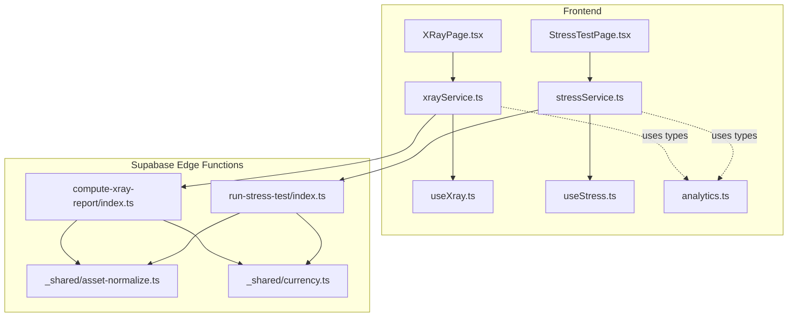
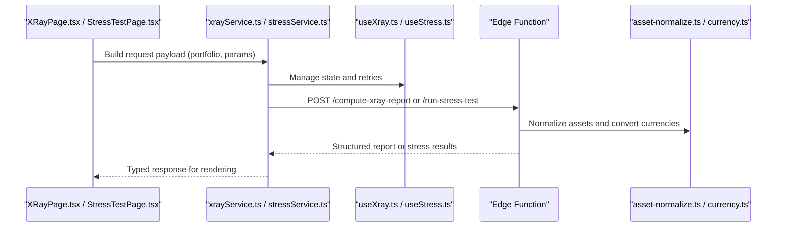
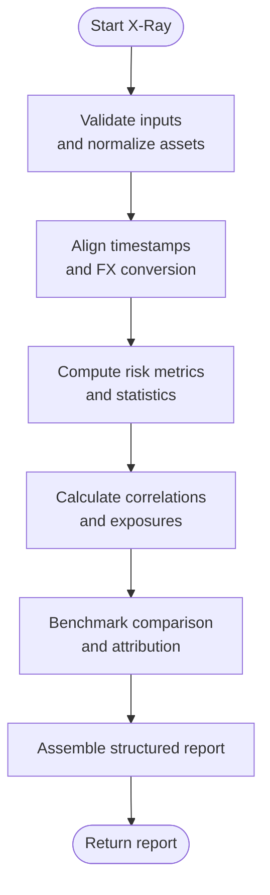
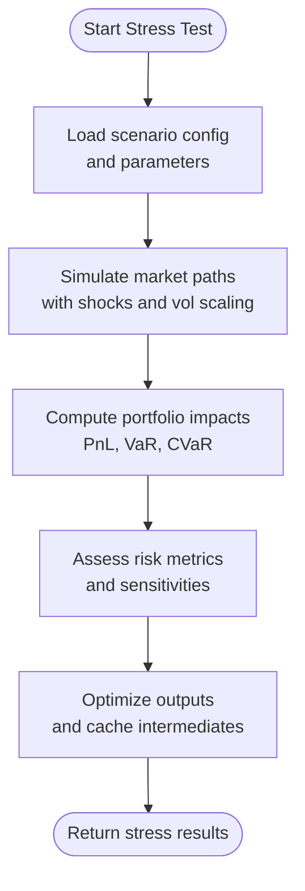
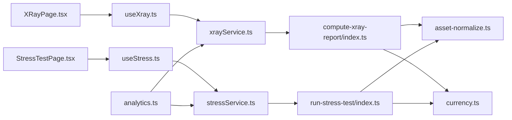

# Analytics & Reporting Functions

<cite>
**Referenced Files in This Document**
- [compute-xray-report/index.ts](file://supabase/functions/compute-xray-report/index.ts)
- [run-stress-test/index.ts](file://supabase/functions/run-stress-test/index.ts)
- [xrayService.ts](file://src/services/xrayService.ts)
- [stressService.ts](file://src/services/stressService.ts)
- [useXray.ts](file://src/hooks/useXray.ts)
- [useStress.ts](file://src/hooks/useStress.ts)
- [XRayPage.tsx](file://src/pages/desktop/XRayPage.tsx)
- [StressTestPage.tsx](file://src/pages/desktop/StressTestPage.tsx)
- [analytics.ts](file://src/types/app/analytics.ts)
- [asset-normalize.ts](file://supabase/functions/_shared/asset-normalize.ts)
- [currency.ts](file://supabase/functions/_shared/currency.ts)
</cite>

## Table of Contents
1. [Introduction](#introduction)
2. [Project Structure](#project-structure)
3. [Core Components](#core-components)
4. [Architecture Overview](#architecture-overview)
5. [Detailed Component Analysis](#detailed-component-analysis)
6. [Dependency Analysis](#dependency-analysis)
7. [Performance Considerations](#performance-considerations)
8. [Troubleshooting Guide](#troubleshooting-guide)
9. [Conclusion](#conclusion)
10. [Appendices](#appendices)

## Introduction
This document provides comprehensive API documentation for FinSight’s analytics and reporting edge functions, focusing on:
- X-Ray report generation (compute-xray-report): portfolio analysis parameters, risk metrics calculation, correlation analysis, benchmark comparisons, and structured report output formats.
- Stress testing engine (run-stress-test): scenario configuration, market simulation parameters, portfolio impact calculations, risk assessment results, and performance optimization techniques.

It also includes parameter specifications, calculation methodologies, result interpretation guidelines, and integration patterns with the frontend analytics dashboard.

## Project Structure
The analytics and reporting features are implemented as Supabase Edge Functions and integrated by the React frontend via services and hooks. The key files include:
- Edge functions: compute-xray-report and run-stress-test
- Frontend services: xrayService.ts and stressService.ts
- Hooks: useXray.ts and useStress.ts
- Pages: XRayPage.tsx and StressTestPage.tsx
- Shared utilities: asset-normalize.ts and currency.ts
- Types: analytics.ts

**Diagram sources**
- [XRayPage.tsx](file://src/pages/desktop/XRayPage.tsx)
- [StressTestPage.tsx](file://src/pages/desktop/StressTestPage.tsx)
- [xrayService.ts](file://src/services/xrayService.ts)
- [stressService.ts](file://src/services/stressService.ts)
- [useXray.ts](file://src/hooks/useXray.ts)
- [useStress.ts](file://src/hooks/useStress.ts)
- [compute-xray-report/index.ts](file://supabase/functions/compute-xray-report/index.ts)
- [run-stress-test/index.ts](file://supabase/functions/run-stress-test/index.ts)
- [asset-normalize.ts](file://supabase/functions/_shared/asset-normalize.ts)
- [currency.ts](file://supabase/functions/_shared/currency.ts)
- [analytics.ts](file://src/types/app/analytics.ts)

**Section sources**
- [compute-xray-report/index.ts](file://supabase/functions/compute-xray-report/index.ts)
- [run-stress-test/index.ts](file://supabase/functions/run-stress-test/index.ts)
- [xrayService.ts](file://src/services/xrayService.ts)
- [stressService.ts](file://src/services/stressService.ts)
- [useXray.ts](file://src/hooks/useXray.ts)
- [useStress.ts](file://src/hooks/useStress.ts)
- [XRayPage.tsx](file://src/pages/desktop/XRayPage.tsx)
- [StressTestPage.tsx](file://src/pages/desktop/StressTestPage.tsx)
- [analytics.ts](file://src/types/app/analytics.ts)
- [asset-normalize.ts](file://supabase/functions/_shared/asset-normalize.ts)
- [currency.ts](file://supabase/functions/_shared/currency.ts)

## Core Components
- compute-xray-report: Generates a comprehensive X-Ray report including portfolio composition, risk metrics, correlations, and benchmark comparisons. It normalizes assets, converts currencies, computes statistics, and returns a structured report payload.
- run-stress-test: Executes stress scenarios against the portfolio using configurable market shocks, simulates impacts, and returns risk assessment results with performance insights.

Key responsibilities:
- Input validation and normalization
- Risk metric computation (volatility, drawdowns, Sharpe-like ratios)
- Correlation matrix calculation across holdings or factors
- Benchmark comparison logic
- Scenario definition and market simulation
- Structured output schemas for consistent consumption by the frontend

**Section sources**
- [compute-xray-report/index.ts](file://supabase/functions/compute-xray-report/index.ts)
- [run-stress-test/index.ts](file://supabase/functions/run-stress-test/index.ts)

## Architecture Overview
The analytics pipeline integrates frontend UI components with backend edge functions through typed services and hooks. Data flows from user inputs to normalized assets, then into analytical computations, returning structured reports and stress test outcomes.

**Diagram sources**
- [XRayPage.tsx](file://src/pages/desktop/XRayPage.tsx)
- [StressTestPage.tsx](file://src/pages/desktop/StressTestPage.tsx)
- [xrayService.ts](file://src/services/xrayService.ts)
- [stressService.ts](file://src/services/stressService.ts)
- [useXray.ts](file://src/hooks/useXray.ts)
- [useStress.ts](file://src/hooks/useStress.ts)
- [compute-xray-report/index.ts](file://supabase/functions/compute-xray-report/index.ts)
- [run-stress-test/index.ts](file://supabase/functions/run-stress-test/index.ts)
- [asset-normalize.ts](file://supabase/functions/_shared/asset-normalize.ts)
- [currency.ts](file://supabase/functions/_shared/currency.ts)

## Detailed Component Analysis

### X-Ray Report Generation (compute-xray-report)
Purpose:
- Produce a detailed portfolio X-Ray report including composition, risk metrics, correlations, and benchmark comparisons.

Input parameters:
- Portfolio data: list of holdings with identifiers, quantities, prices, and currencies
- Time window: start date, end date, frequency (daily/weekly/monthly)
- Benchmark selection: index or custom series
- Risk-free rate: annualized percentage
- Correlation method: Pearson/Spearman
- Output options: include raw time series, aggregated stats, or summary only

Processing logic:
- Normalize assets and align timestamps
- Convert all values to base currency using FX rates
- Compute per-asset and portfolio-level metrics:
  - Returns, volatility, skewness, kurtosis
  - Drawdowns (max, average), recovery periods
  - Risk-adjusted ratios (e.g., Sharpe, Sortino)
- Correlation analysis:
  - Pairwise correlation matrix across assets or factors
  - Aggregated exposure by sector/geography if available
- Benchmark comparison:
  - Relative returns, tracking error, information ratio
  - Attribution breakdown (allocation vs. selection effects)

Output format:
- Summary: total value, allocation, top contributors, risk highlights
- Metrics: time-series aligned returns and derived statistics
- Correlations: matrix and heatmap-ready data
- Benchmarks: comparative metrics and attribution
- Metadata: computation timestamp, version, assumptions

Result interpretation guidelines:
- High volatility with low risk-adjusted ratios indicates elevated risk without compensation
- Large negative drawdowns require attention to liquidity and concentration risks
- Low correlation with benchmarks suggests diversification benefits
- Information ratio above threshold implies active management adds value

Integration pattern:
- Frontend calls service with validated inputs
- Service manages loading states and errors
- Edge function returns structured JSON consumed by charts and tables

**Diagram sources**
- [compute-xray-report/index.ts](file://supabase/functions/compute-xray-report/index.ts)
- [asset-normalize.ts](file://supabase/functions/_shared/asset-normalize.ts)
- [currency.ts](file://supabase/functions/_shared/currency.ts)

**Section sources**
- [compute-xray-report/index.ts](file://supabase/functions/compute-xray-report/index.ts)
- [xrayService.ts](file://src/services/xrayService.ts)
- [useXray.ts](file://src/hooks/useXray.ts)
- [XRayPage.tsx](file://src/pages/desktop/XRayPage.tsx)
- [analytics.ts](file://src/types/app/analytics.ts)
- [asset-normalize.ts](file://supabase/functions/_shared/asset-normalize.ts)
- [currency.ts](file://supabase/functions/_shared/currency.ts)

### Stress Testing Engine (run-stress-test)
Purpose:
- Simulate market shocks and evaluate portfolio impact under defined scenarios.

Scenario configuration:
- Shock definitions: asset class or factor-based changes (e.g., equity -20%, rates +150bps)
- Duration: short-term (1-day), medium-term (1-month), long-term (1-year)
- Correlation adjustments: preserve or alter historical correlations during shock
- Path simulation: Monte Carlo or deterministic paths with variance bounds

Market simulation parameters:
- Volatility scaling: apply multipliers to historical volatilities
- Mean reversion: optional drift adjustments
- Liquidity constraints: slippage and transaction cost modeling
- Rebalancing rules: static vs. dynamic rebalance during stress

Portfolio impact calculations:
- PnL distribution under scenarios
- Value-at-Risk (VaR) and Conditional VaR (CVaR)
- Sector/factor exposure shifts
- Liquidity and funding gap estimates

Risk assessment results:
- Tail risk indicators and breach probabilities
- Sensitivity heatmaps by asset class and region
- Recovery timelines and mitigation suggestions

Performance optimization techniques:
- Vectorized computations for large portfolios
- Caching of FX rates and correlation matrices
- Parallel processing of independent scenarios
- Early termination for negligible impacts

**Diagram sources**
- [run-stress-test/index.ts](file://supabase/functions/run-stress-test/index.ts)
- [asset-normalize.ts](file://supabase/functions/_shared/asset-normalize.ts)
- [currency.ts](file://supabase/functions/_shared/currency.ts)

**Section sources**
- [run-stress-test/index.ts](file://supabase/functions/run-stress-test/index.ts)
- [stressService.ts](file://src/services/stressService.ts)
- [useStress.ts](file://src/hooks/useStress.ts)
- [StressTestPage.tsx](file://src/pages/desktop/StressTestPage.tsx)
- [analytics.ts](file://src/types/app/analytics.ts)
- [asset-normalize.ts](file://supabase/functions/_shared/asset-normalize.ts)
- [currency.ts](file://supabase/functions/_shared/currency.ts)

## Dependency Analysis
The analytics modules depend on shared utilities for asset normalization and currency conversion. Frontend services and hooks encapsulate API calls and state management, while pages orchestrate user interactions.

**Diagram sources**
- [compute-xray-report/index.ts](file://supabase/functions/compute-xray-report/index.ts)
- [run-stress-test/index.ts](file://supabase/functions/run-stress-test/index.ts)
- [asset-normalize.ts](file://supabase/functions/_shared/asset-normalize.ts)
- [currency.ts](file://supabase/functions/_shared/currency.ts)
- [xrayService.ts](file://src/services/xrayService.ts)
- [stressService.ts](file://src/services/stressService.ts)
- [useXray.ts](file://src/hooks/useXray.ts)
- [useStress.ts](file://src/hooks/useStress.ts)
- [XRayPage.tsx](file://src/pages/desktop/XRayPage.tsx)
- [StressTestPage.tsx](file://src/pages/desktop/StressTestPage.tsx)
- [analytics.ts](file://src/types/app/analytics.ts)

**Section sources**
- [compute-xray-report/index.ts](file://supabase/functions/compute-xray-report/index.ts)
- [run-stress-test/index.ts](file://supabase/functions/run-stress-test/index.ts)
- [xrayService.ts](file://src/services/xrayService.ts)
- [stressService.ts](file://src/services/stressService.ts)
- [useXray.ts](file://src/hooks/useXray.ts)
- [useStress.ts](file://src/hooks/useStress.ts)
- [XRayPage.tsx](file://src/pages/desktop/XRayPage.tsx)
- [StressTestPage.tsx](file://src/pages/desktop/StressTestPage.tsx)
- [analytics.ts](file://src/types/app/analytics.ts)
- [asset-normalize.ts](file://supabase/functions/_shared/asset-normalize.ts)
- [currency.ts](file://supabase/functions/_shared/currency.ts)

## Performance Considerations
- Batch operations: aggregate multiple assets and scenarios to reduce overhead
- Caching: store FX rates and correlation matrices to avoid recomputation
- Vectorization: prefer array operations over loops for numerical stability and speed
- Concurrency: process independent scenarios in parallel where supported
- Memory management: stream large datasets and avoid holding entire histories in memory
- Early exits: skip heavy computations when inputs are insufficient or invalid

[No sources needed since this section provides general guidance]

## Troubleshooting Guide
Common issues and resolutions:
- Missing or malformed asset data: ensure identifiers, quantities, and prices are present; validate units and dates
- FX rate failures: handle missing rates gracefully with fallbacks or warnings
- Correlation matrix singularities: regularize near-zero variances or drop collinear assets
- Benchmark mismatches: verify alignment of timestamps and tickers
- Stress scenario misconfiguration: confirm shock magnitudes and durations are within reasonable bounds
- Timeout errors: reduce portfolio size or scenario complexity; enable caching

Operational checks:
- Inspect logs at edge function entry points for input validation errors
- Verify type contracts between services and functions
- Confirm currency conversions are applied consistently across metrics

**Section sources**
- [compute-xray-report/index.ts](file://supabase/functions/compute-xray-report/index.ts)
- [run-stress-test/index.ts](file://supabase/functions/run-stress-test/index.ts)
- [xrayService.ts](file://src/services/xrayService.ts)
- [stressService.ts](file://src/services/stressService.ts)

## Conclusion
FinSight’s analytics and reporting edge functions provide robust capabilities for portfolio analysis and stress testing. By standardizing inputs, computing rigorous risk metrics, and delivering structured outputs, these functions integrate seamlessly with the frontend dashboard. Adhering to the parameter specifications, methodologies, and optimization techniques outlined here ensures accurate, performant, and maintainable analytics workflows.

[No sources needed since this section summarizes without analyzing specific files]

## Appendices

### Parameter Specifications Summary
- compute-xray-report
  - Inputs: portfolio holdings, time window, benchmark, risk-free rate, correlation method, output options
  - Outputs: summary, metrics, correlations, benchmark comparisons, metadata
- run-stress-test
  - Inputs: scenario definitions, market simulation parameters, rebalancing rules
  - Outputs: PnL distributions, VaR/CVaR, sensitivities, recovery timelines

### Integration Patterns
- Services encapsulate API calls and error handling
- Hooks manage state, retries, and loading indicators
- Pages render results and allow interactive parameter tuning

**Section sources**
- [xrayService.ts](file://src/services/xrayService.ts)
- [stressService.ts](file://src/services/stressService.ts)
- [useXray.ts](file://src/hooks/useXray.ts)
- [useStress.ts](file://src/hooks/useStress.ts)
- [XRayPage.tsx](file://src/pages/desktop/XRayPage.tsx)
- [StressTestPage.tsx](file://src/pages/desktop/StressTestPage.tsx)
- [analytics.ts](file://src/types/app/analytics.ts)