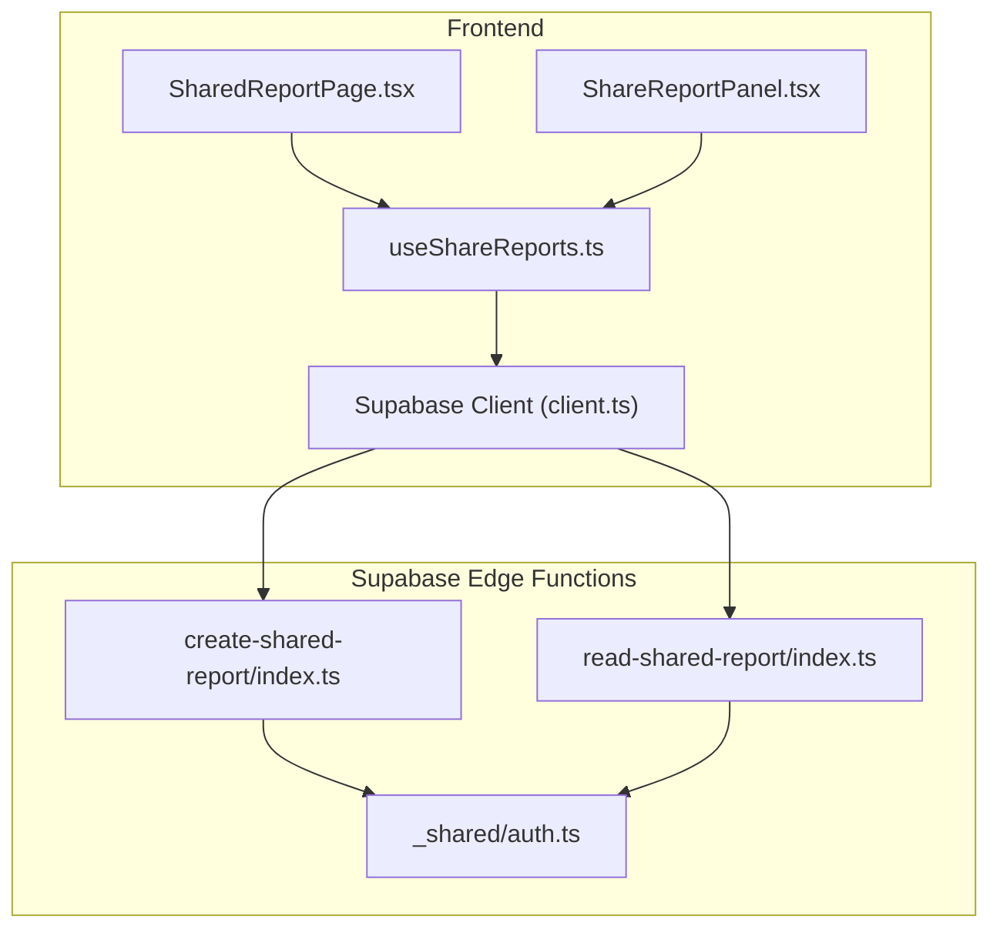
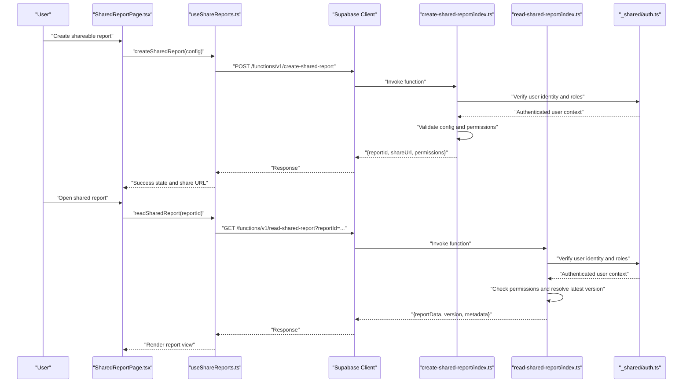
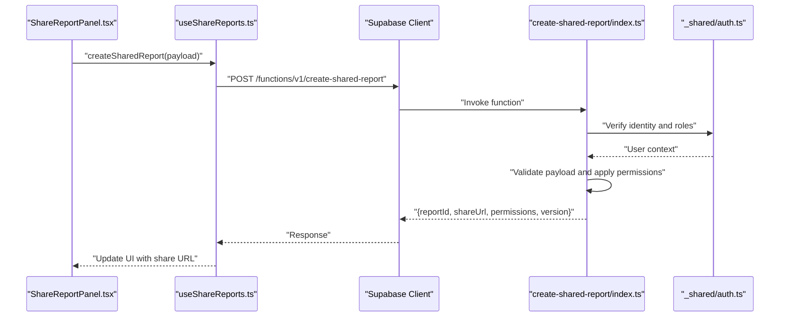
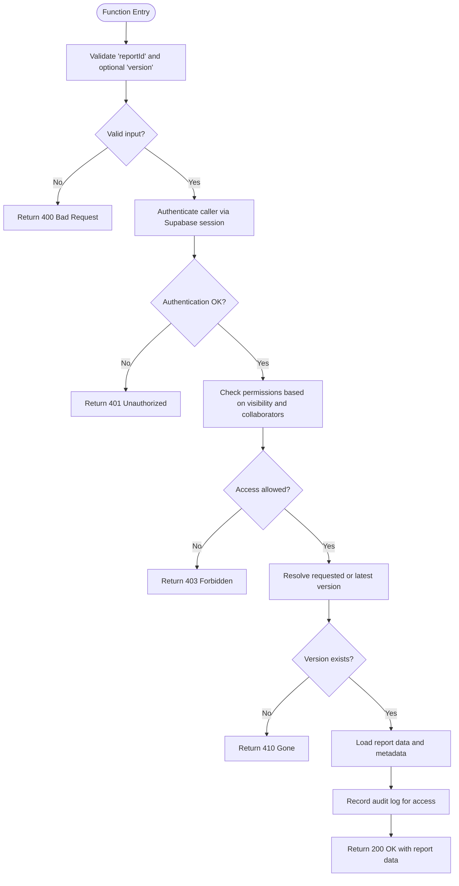
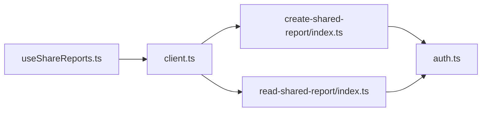

# Collaboration Services

<cite>
**Referenced Files in This Document**
- [create-shared-report/index.ts](file://supabase/functions/create-shared-report/index.ts)
- [read-shared-report/index.ts](file://supabase/functions/read-shared-report/index.ts)
- [auth.ts](file://supabase/functions/_shared/auth.ts)
- [useShareReports.ts](file://src/hooks/useShareReports.ts)
- [SharedReportPage.tsx](file://src/pages/desktop/SharedReportPage.tsx)
- [ShareReportPanel.tsx](file://src/components/desktop/ShareReportPanel.tsx)
- [client.ts](file://src/integrations/supabase/client.ts)
</cite>

## Table of Contents
1. [Introduction](#introduction)
2. [Project Structure](#project-structure)
3. [Core Components](#core-components)
4. [Architecture Overview](#architecture-overview)
5. [Detailed Component Analysis](#detailed-component-analysis)
6. [Dependency Analysis](#dependency-analysis)
7. [Performance Considerations](#performance-considerations)
8. [Troubleshooting Guide](#troubleshooting-guide)
9. [Conclusion](#conclusion)

## Introduction
This document provides detailed API documentation for FinSight’s collaboration and sharing services, focusing on shared report creation and reading. It explains how to create shareable reports with configuration and permissions, how clients read shared reports with access control and versioning, and how security, audit logging, and authentication integrate across the system. It also includes practical examples for team access management, concurrent edits, and authorization checks.

## Project Structure
The collaboration features are implemented as Supabase Edge Functions (serverless endpoints) and consumed by the frontend via hooks and pages. The key files include:
- Server-side functions for creating and reading shared reports
- Shared authentication utilities
- Frontend hooks and UI components that call these functions
- Supabase client integration

**Diagram sources**
- [SharedReportPage.tsx](file://src/pages/desktop/SharedReportPage.tsx)
- [ShareReportPanel.tsx](file://src/components/desktop/ShareReportPanel.tsx)
- [useShareReports.ts](file://src/hooks/useShareReports.ts)
- [client.ts](file://src/integrations/supabase/client.ts)
- [create-shared-report/index.ts](file://supabase/functions/create-shared-report/index.ts)
- [read-shared-report/index.ts](file://supabase/functions/read-shared-report/index.ts)
- [auth.ts](file://supabase/functions/_shared/auth.ts)

**Section sources**
- [create-shared-report/index.ts](file://supabase/functions/create-shared-report/index.ts)
- [read-shared-report/index.ts](file://supabase/functions/read-shared-report/index.ts)
- [auth.ts](file://supabase/functions/_shared/auth.ts)
- [useShareReports.ts](file://src/hooks/useShareReports.ts)
- [SharedReportPage.tsx](file://src/pages/desktop/SharedReportPage.tsx)
- [ShareReportPanel.tsx](file://src/components/desktop/ShareReportPanel.tsx)
- [client.ts](file://src/integrations/supabase/client.ts)

## Core Components
- create-shared-report function: Creates a new shared report entry, validates request payload, enforces ownership or admin rights, sets access permissions, and returns a shareable identifier and initial configuration.
- read-shared-report function: Reads a shared report by its identifier, validates access permissions, resolves the latest version, and returns report data along with metadata required for collaborative viewing.
- Authentication utility: Provides helper methods to verify user identity and roles from Supabase context within Edge Functions.
- Frontend hook useShareReports: Encapsulates calls to the server functions, handles error states, and exposes typed APIs for UI components.
- UI components: ShareReportPanel and SharedReportPage orchestrate user interactions for sharing and viewing reports.

Key responsibilities:
- Input validation and schema enforcement
- Permission checks and role-based access control
- Version resolution and concurrency handling
- Audit logging for creation and access events
- Secure response formatting and error propagation

**Section sources**
- [create-shared-report/index.ts](file://supabase/functions/create-shared-report/index.ts)
- [read-shared-report/index.ts](file://supabase/functions/read-shared-report/index.ts)
- [auth.ts](file://supabase/functions/_shared/auth.ts)
- [useShareReports.ts](file://src/hooks/useShareReports.ts)
- [ShareReportPanel.tsx](file://src/components/desktop/ShareReportPanel.tsx)
- [SharedReportPage.tsx](file://src/pages/desktop/SharedReportPage.tsx)

## Architecture Overview
The collaboration architecture follows a client-server model where the frontend invokes Supabase Edge Functions to perform secure operations on shared reports. Authentication is enforced at the function boundary using shared utilities.

**Diagram sources**
- [SharedReportPage.tsx](file://src/pages/desktop/SharedReportPage.tsx)
- [useShareReports.ts](file://src/hooks/useShareReports.ts)
- [client.ts](file://src/integrations/supabase/client.ts)
- [create-shared-report/index.ts](file://supabase/functions/create-shared-report/index.ts)
- [read-shared-report/index.ts](file://supabase/functions/read-shared-report/index.ts)
- [auth.ts](file://supabase/functions/_shared/auth.ts)

## Detailed Component Analysis

### API: create-shared-report
Purpose:
- Create a new shared report with configuration, access permissions, and sharing settings.
- Enforce ownership or administrative privileges.
- Return a stable report identifier and shareable URL.

Request:
- Method: POST
- Path: /functions/v1/create-shared-report
- Headers: Authorization bearer token (Supabase session)
- Body fields:
  - title: string
  - description: string
  - visibility: enum ("private", "team", "public")
  - collaborators: array of { userId, role }
  - settings: object containing report-specific options (e.g., currency, date range, filters)
  - tags: array of strings

Response:
- reportId: string
- shareUrl: string
- permissions: object describing effective access for the caller
- version: number (initial version)
- createdAt: timestamp

Behavior:
- Validates input schema and required fields.
- Checks caller identity and ensures they own the report or have admin rights.
- Applies permission inheritance based on visibility and collaborator list.
- Persists report metadata and initial version.
- Logs an audit event for creation.

Error handling:
- Returns 400 for invalid inputs.
- Returns 401 if unauthenticated.
- Returns 403 if insufficient permissions.
- Returns 409 if duplicate identifiers conflict.

Example usage:
- From the frontend, call the hook method createSharedReport with a configuration object; handle success to display the share URL and update UI state.

Security considerations:
- All requests must be authenticated via Supabase session.
- Role checks prevent unauthorized creation.
- Sensitive settings are validated and sanitized before persistence.

**Section sources**
- [create-shared-report/index.ts](file://supabase/functions/create-shared-report/index.ts)
- [auth.ts](file://supabase/functions/_shared/auth.ts)
- [useShareReports.ts](file://src/hooks/useShareReports.ts)

#### Sequence Diagram: Creating a Shared Report

**Diagram sources**
- [ShareReportPanel.tsx](file://src/components/desktop/ShareReportPanel.tsx)
- [useShareReports.ts](file://src/hooks/useShareReports.ts)
- [client.ts](file://src/integrations/supabase/client.ts)
- [create-shared-report/index.ts](file://supabase/functions/create-shared-report/index.ts)
- [auth.ts](file://supabase/functions/_shared/auth.ts)

### API: read-shared-report
Purpose:
- Read a shared report by its identifier with permission validation and version management.
- Support concurrent access by resolving the latest version safely.

Request:
- Method: GET
- Path: /functions/v1/read-shared-report
- Query parameters:
  - reportId: string (required)
  - version?: number (optional; defaults to latest)
- Headers: Authorization bearer token (Supabase session)

Response:
- reportId: string
- version: number
- data: object containing report content
- metadata: object including visibility, collaborators, and last updated timestamp
- canEdit: boolean indicating whether the caller has edit rights

Behavior:
- Verifies caller identity and checks permissions against visibility and collaborator list.
- Resolves the requested version or the latest version if unspecified.
- Ensures thread-safe reads under concurrent access.
- Logs an audit event for access.

Error handling:
- Returns 400 for missing or invalid reportId.
- Returns 401 if unauthenticated.
- Returns 403 if access denied.
- Returns 404 if report not found.
- Returns 410 if requested version no longer exists.

Concurrent access handling:
- Uses optimistic locking or version checks to avoid inconsistent reads.
- Supports read-only access unless explicit edit permissions are granted.

Example usage:
- From the frontend, call the hook method readSharedReport with the reportId; render the report view when successful and show appropriate messages on errors.

Security considerations:
- Access control is enforced server-side.
- Sensitive fields are filtered based on caller permissions.
- Audit logs capture access patterns for compliance.

**Section sources**
- [read-shared-report/index.ts](file://supabase/functions/read-shared-report/index.ts)
- [auth.ts](file://supabase/functions/_shared/auth.ts)
- [useShareReports.ts](file://src/hooks/useShareReports.ts)

#### Flowchart: Reading a Shared Report

**Diagram sources**
- [read-shared-report/index.ts](file://supabase/functions/read-shared-report/index.ts)
- [auth.ts](file://supabase/functions/_shared/auth.ts)

### Security Measures and Authentication Integration
- Identity verification: All Edge Functions validate the Supabase session to ensure callers are authenticated.
- Role-based access control: Permissions are derived from visibility settings and collaborator roles.
- Permission inheritance: Team-level visibility grants default access to all team members unless overridden by specific collaborator entries.
- Audit logging: Creation and access events are logged for compliance and monitoring.
- Data sanitization: Inputs are validated and sanitized to prevent injection and malformed payloads.
- Error minimization: Errors return minimal details to avoid leaking sensitive information.

Integration points:
- Supabase client passes session headers automatically.
- Shared auth utility centralizes identity and role checks.

**Section sources**
- [auth.ts](file://supabase/functions/_shared/auth.ts)
- [client.ts](file://src/integrations/supabase/client.ts)
- [create-shared-report/index.ts](file://supabase/functions/create-shared-report/index.ts)
- [read-shared-report/index.ts](file://supabase/functions/read-shared-report/index.ts)

### Collaborative Features and Concurrent Edits
- Version management: Each report maintains a version number; reads can target specific versions or default to latest.
- Concurrency safety: Reads are safe under concurrent access; writes should implement optimistic locking to prevent overwrites.
- Edit rights: Only users with explicit edit permissions can modify reports; others receive read-only responses.
- Real-time updates: Optional real-time channels can be layered on top of versioned reads to reflect changes promptly.

Best practices:
- Always pass the current version when updating to avoid conflicts.
- Handle 410 Gone responses by refreshing to the latest version.
- Debounce rapid edits and batch updates to reduce contention.

**Section sources**
- [read-shared-report/index.ts](file://supabase/functions/read-shared-report/index.ts)
- [useShareReports.ts](file://src/hooks/useShareReports.ts)

### Examples

Creating a shareable report:
- Use the frontend hook to call createSharedReport with a configuration object including title, description, visibility, collaborators, and settings. On success, display the share URL and allow inviting collaborators.

Managing team access:
- Set visibility to "team" to grant default access to all team members. Add specific collaborators with roles to override defaults for individuals.

Handling concurrent edits:
- When editing, include the current version in the update request. If the server returns a version mismatch, refresh the report and retry the edit.

Implementing authorization checks:
- Ensure all requests include a valid Supabase session. On the server, verify roles and permissions before processing. On the client, disable edit controls for users without edit rights.

**Section sources**
- [useShareReports.ts](file://src/hooks/useShareReports.ts)
- [SharedReportPage.tsx](file://src/pages/desktop/SharedReportPage.tsx)
- [ShareReportPanel.tsx](file://src/components/desktop/ShareReportPanel.tsx)

## Dependency Analysis
The collaboration services depend on Supabase Edge Functions for secure execution and the frontend hook layer for encapsulated API calls.

**Diagram sources**
- [useShareReports.ts](file://src/hooks/useShareReports.ts)
- [client.ts](file://src/integrations/supabase/client.ts)
- [create-shared-report/index.ts](file://supabase/functions/create-shared-report/index.ts)
- [read-shared-report/index.ts](file://supabase/functions/read-shared-report/index.ts)
- [auth.ts](file://supabase/functions/_shared/auth.ts)

**Section sources**
- [useShareReports.ts](file://src/hooks/useShareReports.ts)
- [client.ts](file://src/integrations/supabase/client.ts)
- [create-shared-report/index.ts](file://supabase/functions/create-shared-report/index.ts)
- [read-shared-report/index.ts](file://supabase/functions/read-shared-report/index.ts)
- [auth.ts](file://supabase/functions/_shared/auth.ts)

## Performance Considerations
- Minimize payload size by sending only necessary configuration fields.
- Cache read results on the client side with short TTLs to reduce repeated network calls.
- Implement pagination or incremental loading for large reports.
- Use optimistic updates for edits and reconcile on server confirmation.
- Avoid frequent polling; prefer event-driven updates if real-time channels are available.

[No sources needed since this section provides general guidance]

## Troubleshooting Guide
Common issues and resolutions:
- 401 Unauthorized: Ensure the Supabase session is active and passed in request headers.
- 403 Forbidden: Verify the user has sufficient permissions; check visibility and collaborator roles.
- 404 Not Found: Confirm the reportId is correct and the report exists.
- 410 Gone: The requested version is no longer available; refresh to the latest version.
- 400 Bad Request: Validate input fields and types; ensure required fields are present.

Debugging steps:
- Log request payloads and responses in the frontend hook.
- Inspect server-side audit logs for creation and access events.
- Reproduce issues with minimal payloads to isolate problems.

**Section sources**
- [create-shared-report/index.ts](file://supabase/functions/create-shared-report/index.ts)
- [read-shared-report/index.ts](file://supabase/functions/read-shared-report/index.ts)
- [useShareReports.ts](file://src/hooks/useShareReports.ts)

## Conclusion
FinSight’s collaboration services provide secure, versioned, and permission-controlled access to shared reports. The create-shared-report and read-shared-report endpoints enforce strong authentication and authorization, support team-based sharing, and handle concurrent access safely. By following the recommended best practices and troubleshooting steps, developers can build robust collaborative experiences with clear auditability and performance.