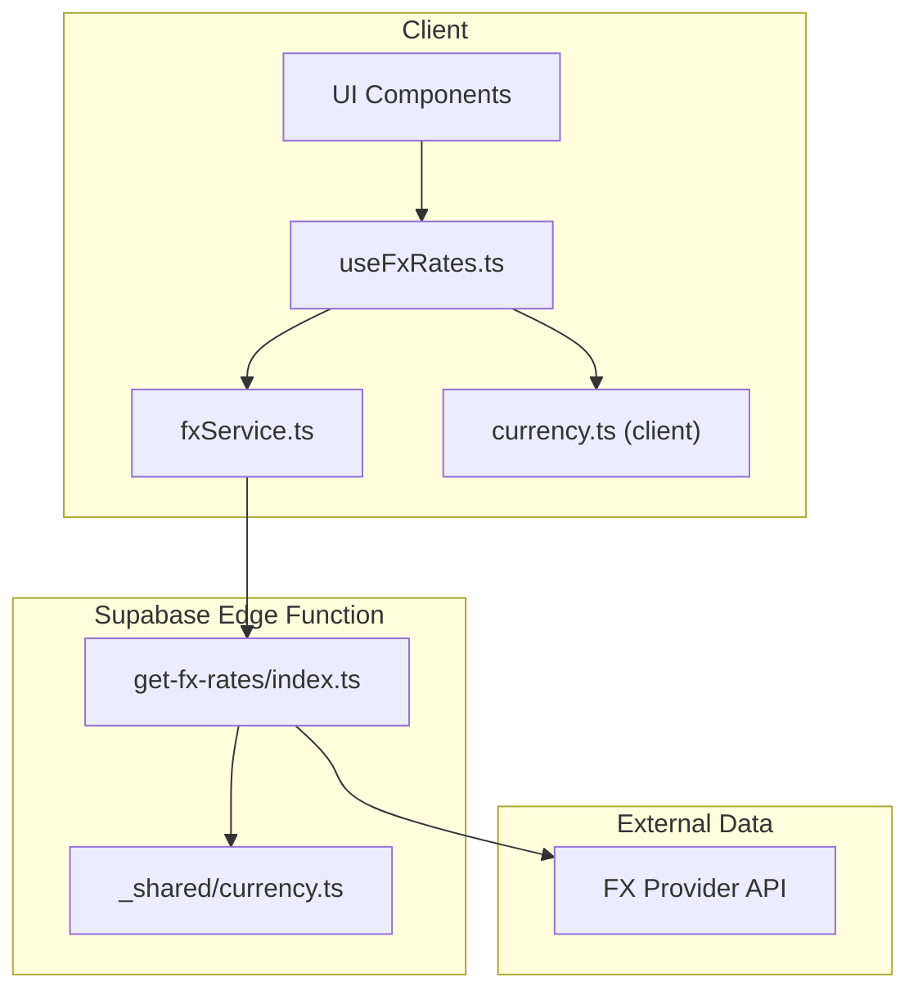
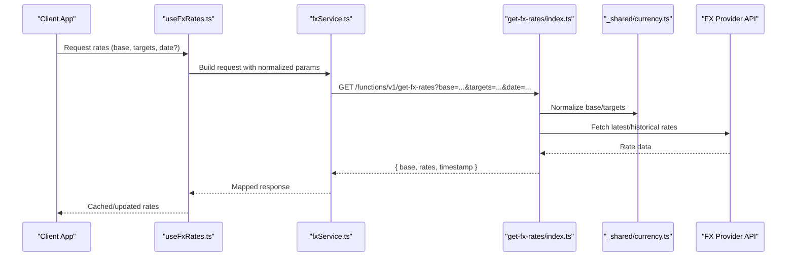
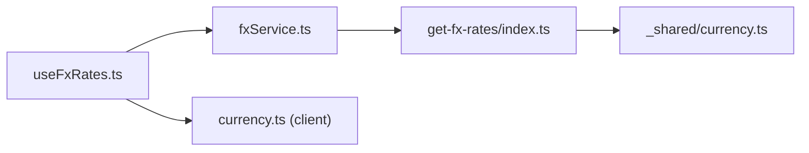

# Currency Services

<cite>
**Referenced Files in This Document**
- [get-fx-rates/index.ts](file://supabase/functions/get-fx-rates/index.ts)
- [currency.ts](file://src/lib/currency.ts)
- [useFxRates.ts](file://src/hooks/useFxRates.ts)
- [fxService.ts](file://src/services/fxService.ts)
- [_shared/currency.ts](file://supabase/functions/_shared/currency.ts)
</cite>

## Table of Contents
1. [Introduction](#introduction)
2. [Project Structure](#project-structure)
3. [Core Components](#core-components)
4. [Architecture Overview](#architecture-overview)
5. [Detailed Component Analysis](#detailed-component-analysis)
6. [Dependency Analysis](#dependency-analysis)
7. [Performance Considerations](#performance-considerations)
8. [Troubleshooting Guide](#troubleshooting-guide)
9. [Conclusion](#conclusion)
10. [Appendices](#appendices)

## Introduction
This document provides detailed API documentation for FinSight’s currency exchange rate services, focusing on the get-fx-rates endpoint and related client-side utilities. It explains request parameters, response schemas, authentication requirements, supported currencies, update frequency, caching strategies, error handling, and practical usage patterns such as real-time fetching, multi-currency conversions, and fallback mechanisms when external APIs are unavailable.

## Project Structure
The currency exchange functionality spans serverless functions (Edge Functions), shared normalization utilities, and client hooks/services:

- Serverless function: supabase/functions/get-fx-rates/index.ts
- Shared currency utilities (server): supabase/functions/_shared/currency.ts
- Client-side hook: src/hooks/useFxRates.ts
- Client-side service: src/services/fxService.ts
- Client-side currency normalization: src/lib/currency.ts

[No sources needed since this diagram shows conceptual workflow, not actual code structure]

## Core Components
- get-fx-rates Edge Function: Implements the HTTP endpoint to fetch or serve cached exchange rates, normalize currency codes, and return a structured response.
- Client hook useFxRates: Provides React-friendly access to exchange rates with optional caching and retry logic.
- Client service fxService: Encapsulates HTTP calls to the Edge Function and handles request/response mapping.
- Shared currency utilities (_shared/currency.ts): Normalizes currency codes and validates inputs on the server side.
- Client currency utilities (lib/currency.ts): Normalizes currency codes on the client side for consistent formatting.

Key responsibilities:
- Input validation and normalization (both client and server)
- Fetching from external FX provider(s)
- Caching strategy (in-memory or edge cache)
- Error handling and fallbacks
- Consistent response schema

**Section sources**
- [get-fx-rates/index.ts](file://supabase/functions/get-fx-rates/index.ts)
- [_shared/currency.ts](file://supabase/functions/_shared/currency.ts)
- [useFxRates.ts](file://src/hooks/useFxRates.ts)
- [fxService.ts](file://src/services/fxService.ts)
- [currency.ts](file://src/lib/currency.ts)

## Architecture Overview
The get-fx-rates endpoint is exposed via Supabase Edge Functions. The client invokes it through an HTTP call wrapped by fxService and useFxRates. The function normalizes inputs using shared currency utilities, retrieves rates from an external FX provider, applies caching where applicable, and returns a standardized JSON payload.

**Diagram sources**
- [get-fx-rates/index.ts](file://supabase/functions/get-fx-rates/index.ts)
- [_shared/currency.ts](file://supabase/functions/_shared/currency.ts)
- [useFxRates.ts](file://src/hooks/useFxRates.ts)
- [fxService.ts](file://src/services/fxService.ts)

## Detailed Component Analysis

### Endpoint: get-fx-rates
- Method: GET
- Path: /functions/v1/get-fx-rates
- Authentication: Depends on Supabase Edge Function configuration; typically requires valid session or anonymous policy depending on setup. Ensure CORS and RLS policies allow client access.
- Query Parameters:
  - base: Required. Base currency code (e.g., USD). Must be a supported ISO 4217 code.
  - targets: Optional. Comma-separated list of target currencies (e.g., EUR,GBP,JPY). If omitted, defaults may apply.
  - date: Optional. Historical date filter in YYYY-MM-DD format. If omitted, returns latest available rates.
- Response Schema:
  - base: string — The normalized base currency code
  - rates: object — Map of target currency code to exchange rate value (number)
  - timestamp: string — ISO timestamp indicating when rates were retrieved or cached
- Status Codes:
  - 200 OK: Success
  - 400 Bad Request: Invalid parameters (e.g., unsupported currency, malformed date)
  - 404 Not Found: No rates available for requested date
  - 500 Internal Server Error: External provider failure or unexpected error
  - 503 Service Unavailable: Temporary unavailability of FX provider or upstream dependency

Notes:
- Currency codes are normalized to uppercase ISO 4217.
- When multiple targets are provided, all must be supported; otherwise, a 400 error is returned.
- Date filtering uses the most recent available rate if the exact date is not available, unless strict mode is enforced.

**Section sources**
- [get-fx-rates/index.ts](file://supabase/functions/get-fx-rates/index.ts)

### Client Hook: useFxRates
Responsibilities:
- Provide a React hook to fetch and cache exchange rates
- Accept parameters: base, targets, date
- Manage local state and optional in-memory cache
- Handle loading, error, and retry states
- Normalize inputs before calling the service

Usage pattern:
- Call hook with base and optional targets/date
- Access rates, loading, and error flags
- Implement manual refresh or polling based on application needs

Caching strategy:
- In-memory cache keyed by normalized parameters
- TTL-based invalidation configurable at call site or globally
- Fallback to last known good rates when network fails

Error handling:
- Surface user-friendly errors
- Retry with exponential backoff for transient failures
- Graceful degradation when external API is down

**Section sources**
- [useFxRates.ts](file://src/hooks/useFxRates.ts)

### Client Service: fxService
Responsibilities:
- Construct HTTP requests to the Edge Function
- Serialize query parameters and handle URL encoding
- Parse and map responses into typed structures
- Centralize error handling and retries

Request construction:
- Builds GET request with normalized base, targets, and date
- Adds headers as required by Edge Function configuration

Response mapping:
- Converts raw JSON into strongly-typed objects
- Ensures consistent field names across clients

**Section sources**
- [fxService.ts](file://src/services/fxService.ts)

### Shared Currency Utilities (Server): _shared/currency.ts
Responsibilities:
- Validate and normalize currency codes
- Enforce supported currency set
- Provide helper functions for rate calculations and formatting

Normalization rules:
- Convert codes to uppercase
- Trim whitespace
- Reject unsupported codes with clear error messages

Supported currencies:
- Typically includes major fiat currencies (e.g., USD, EUR, GBP, JPY, CAD, AUD, CHF, CNY, INR, MXN, BRL, ZAR)
- Additional codes may be added based on provider capabilities

**Section sources**
- [_shared/currency.ts](file://supabase/functions/_shared/currency.ts)

### Client Currency Utilities: lib/currency.ts
Responsibilities:
- Normalize currency codes on the client side
- Provide helpers for formatting and display
- Ensure consistency between client and server expectations

Normalization rules:
- Same as server: uppercase, trimmed, validated against a client-side whitelist

**Section sources**
- [currency.ts](file://src/lib/currency.ts)

## Dependency Analysis
The following diagram illustrates dependencies among key components involved in fetching and using exchange rates.

**Diagram sources**
- [useFxRates.ts](file://src/hooks/useFxRates.ts)
- [fxService.ts](file://src/services/fxService.ts)
- [get-fx-rates/index.ts](file://supabase/functions/get-fx-rates/index.ts)
- [_shared/currency.ts](file://supabase/functions/_shared/currency.ts)
- [currency.ts](file://src/lib/currency.ts)

**Section sources**
- [useFxRates.ts](file://src/hooks/useFxRates.ts)
- [fxService.ts](file://src/services/fxService.ts)
- [get-fx-rates/index.ts](file://supabase/functions/get-fx-rates/index.ts)
- [_shared/currency.ts](file://supabase/functions/_shared/currency.ts)
- [currency.ts](file://src/lib/currency.ts)

## Performance Considerations
- Caching:
  - Use in-memory caches on the client with TTL to reduce redundant requests
  - Consider edge-level caching for repeated queries within short time windows
- Batch Requests:
  - Support multiple targets in a single request to minimize network overhead
- Rate Limiting:
  - Respect provider limits; implement backoff and retry strategies
- Data Freshness:
  - Align cache TTL with expected update frequency (see below)
- Compression:
  - Enable gzip/deflate for responses if supported by the hosting environment

[No sources needed since this section provides general guidance]

## Troubleshooting Guide
Common issues and resolutions:
- Unsupported currency code:
  - Ensure codes are uppercase and part of the supported set
  - Check normalization on both client and server sides
- Missing rates for historical date:
  - Verify date format and availability; consider falling back to nearest available date
- Network timeouts or provider outages:
  - Implement retry with exponential backoff
  - Serve cached rates when available
- Authentication failures:
  - Confirm Edge Function policies and client credentials
  - Validate CORS settings for browser environments

Operational checks:
- Inspect response status codes and error payloads
- Log normalized parameters and timestamps for debugging
- Monitor provider latency and error rates

**Section sources**
- [get-fx-rates/index.ts](file://supabase/functions/get-fx-rates/index.ts)
- [useFxRates.ts](file://src/hooks/useFxRates.ts)
- [fxService.ts](file://src/services/fxService.ts)

## Conclusion
FinSight’s currency exchange rate services provide a robust, normalized, and cacheable approach to retrieving real-time and historical FX rates. By standardizing currency codes, centralizing error handling, and offering flexible client hooks, the system supports reliable multi-currency conversions and resilient fallback behavior when external providers are unavailable.

[No sources needed since this section summarizes without analyzing specific files]

## Appendices

### Practical Examples

- Fetching real-time exchange rates:
  - Call the hook with base currency and optional targets
  - Display rates once loaded; show loading indicator during fetch
  - Handle errors gracefully and offer retry

- Handling multi-currency conversions:
  - Request multiple targets in one call
  - Apply rates to convert amounts consistently
  - Format outputs with appropriate decimal precision

- Implementing fallback mechanisms:
  - On network failure, serve last known good rates from cache
  - Show a warning banner indicating stale data
  - Retry after a delay and update UI when fresh data arrives

[No sources needed since this section provides general guidance]

### Supported Currency Codes
- Major fiat currencies include but are not limited to:
  - USD, EUR, GBP, JPY, CAD, AUD, CHF, CNY, INR, MXN, BRL, ZAR
- Additional codes may be supported depending on the FX provider’s coverage

[No sources needed since this section provides general guidance]

### Rate Update Frequency
- Typical update cadence:
  - Real-time or near-real-time for major pairs
  - Daily updates for less liquid currencies
- Cache TTL should align with provider update frequency to balance freshness and performance

[No sources needed since this section provides general guidance]