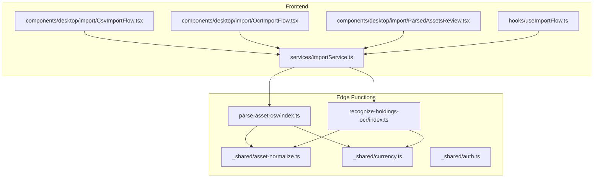
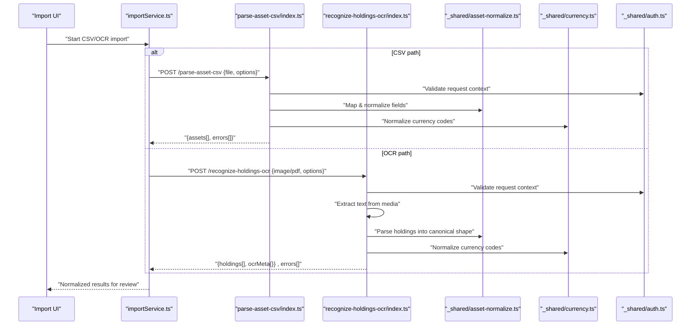
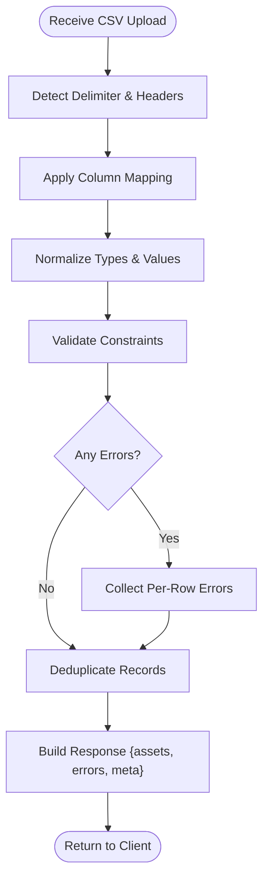
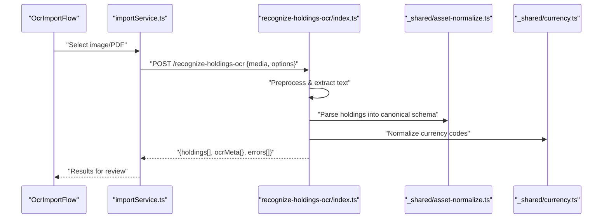
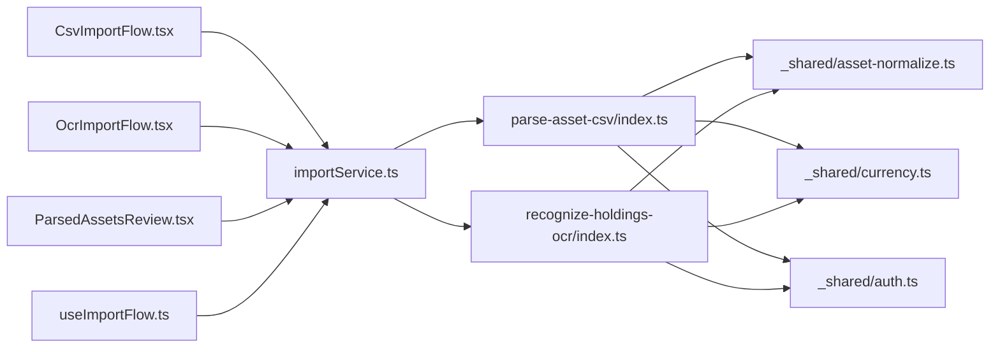

# Data Processing Functions

<cite>
**Referenced Files in This Document**
- [parse-asset-csv/index.ts](file://supabase/functions/parse-asset-csv/index.ts)
- [recognize-holdings-ocr/index.ts](file://supabase/functions/recognize-holdings-ocr/index.ts)
- [asset-normalize.ts](file://supabase/functions/_shared/asset-normalize.ts)
- [currency.ts](file://supabase/functions/_shared/currency.ts)
- [auth.ts](file://supabase/functions/_shared/auth.ts)
- [importService.ts](file://src/services/importService.ts)
- [CsvImportFlow.tsx](file://src/components/desktop/import/CsvImportFlow.tsx)
- [OcrImportFlow.tsx](file://src/components/desktop/import/OcrImportFlow.tsx)
- [ParsedAssetsReview.tsx](file://src/components/desktop/import/ParsedAssetsReview.tsx)
- [useImportFlow.ts](file://src/hooks/useImportFlow.ts)
</cite>

## Table of Contents
1. [Introduction](#introduction)
2. [Project Structure](#project-structure)
3. [Core Components](#core-components)
4. [Architecture Overview](#architecture-overview)
5. [Detailed Component Analysis](#detailed-component-analysis)
6. [Dependency Analysis](#dependency-analysis)
7. [Performance Considerations](#performance-considerations)
8. [Troubleshooting Guide](#troubleshooting-guide)
9. [Conclusion](#conclusion)
10. [Appendices](#appendices)

## Introduction
This document provides comprehensive API documentation for FinSight’s data processing edge functions, focusing on:
- CSV parsing endpoint (parse-asset-csv): file upload formats, column mapping specifications, validation rules, and normalized asset output.
- OCR recognition service (recognize-holdings-ocr): supported image formats, text extraction behavior, structured holdings output, and error handling for unrecognizable content.

It also covers parameter specifications, batch processing capabilities, data transformation pipelines, and integration patterns with the asset management system.

## Project Structure
The relevant code is organized under Supabase Edge Functions and the frontend import flows:
- supabase/functions/parse-asset-csv/index.ts: CSV parsing entry point.
- supabase/functions/recognize-holdings-ocr/index.ts: OCR processing entry point.
- supabase/functions/_shared/*: Shared utilities for normalization, currency, and authentication.
- src/services/importService.ts: Client-side orchestration for import flows.
- src/components/desktop/import/*: UI flows for CSV and OCR imports and review.
- src/hooks/useImportFlow.ts: Import flow state and helpers.

**Diagram sources**
- [parse-asset-csv/index.ts](file://supabase/functions/parse-asset-csv/index.ts)
- [recognize-holdings-ocr/index.ts](file://supabase/functions/recognize-holdings-ocr/index.ts)
- [asset-normalize.ts](file://supabase/functions/_shared/asset-normalize.ts)
- [currency.ts](file://supabase/functions/_shared/currency.ts)
- [auth.ts](file://supabase/functions/_shared/auth.ts)
- [importService.ts](file://src/services/importService.ts)
- [CsvImportFlow.tsx](file://src/components/desktop/import/CsvImportFlow.tsx)
- [OcrImportFlow.tsx](file://src/components/desktop/import/OcrImportFlow.tsx)
- [ParsedAssetsReview.tsx](file://src/components/desktop/import/ParsedAssetsReview.tsx)
- [useImportFlow.ts](file://src/hooks/useImportFlow.ts)

**Section sources**
- [parse-asset-csv/index.ts](file://supabase/functions/parse-asset-csv/index.ts)
- [recognize-holdings-ocr/index.ts](file://supabase/functions/recognize-holdings-ocr/index.ts)
- [asset-normalize.ts](file://supabase/functions/_shared/asset-normalize.ts)
- [currency.ts](file://supabase/functions/_shared/currency.ts)
- [auth.ts](file://supabase/functions/_shared/auth.ts)
- [importService.ts](file://src/services/importService.ts)
- [CsvImportFlow.tsx](file://src/components/desktop/import/CsvImportFlow.tsx)
- [OcrImportFlow.tsx](file://src/components/desktop/import/OcrImportFlow.tsx)
- [ParsedAssetsReview.tsx](file://src/components/desktop/import/ParsedAssetsReview.tsx)
- [useImportFlow.ts](file://src/hooks/useImportFlow.ts)

## Core Components
- parse-asset-csv: Accepts CSV uploads, maps columns to a canonical schema, validates rows, normalizes values, and returns standardized assets.
- recognize-holdings-ocr: Accepts images or PDFs, extracts text via OCR, parses holdings into structured records, and returns normalized results with confidence metadata.
- Shared utilities:
  - asset-normalize: Canonical field mapping, type coercion, and validation.
  - currency: Currency code normalization and formatting.
  - auth: Request authentication context for secure operations.

Key responsibilities:
- Input validation and sanitization.
- Robust error reporting with actionable messages.
- Normalized output compatible with the asset management system.

**Section sources**
- [parse-asset-csv/index.ts](file://supabase/functions/parse-asset-csv/index.ts)
- [recognize-holdings-ocr/index.ts](file://supabase/functions/recognize-holdings-ocr/index.ts)
- [asset-normalize.ts](file://supabase/functions/_shared/asset-normalize.ts)
- [currency.ts](file://supabase/functions/_shared/currency.ts)
- [auth.ts](file://supabase/functions/_shared/auth.ts)

## Architecture Overview
The data processing pipeline integrates client flows with serverless functions and shared normalization logic.

**Diagram sources**
- [importService.ts](file://src/services/importService.ts)
- [parse-asset-csv/index.ts](file://supabase/functions/parse-asset-csv/index.ts)
- [recognize-holdings-ocr/index.ts](file://supabase/functions/recognize-holdings-ocr/index.ts)
- [asset-normalize.ts](file://supabase/functions/_shared/asset-normalize.ts)
- [currency.ts](file://supabase/functions/_shared/currency.ts)
- [auth.ts](file://supabase/functions/_shared/auth.ts)

## Detailed Component Analysis

### CSV Parsing Endpoint: parse-asset-csv
Purpose:
- Parse uploaded CSV files into normalized asset records.
- Support flexible column mappings and robust validation.
- Return both successful records and per-row errors for user correction.

Request format:
- Content-Type: multipart/form-data
- Fields:
  - file: CSV file (UTF-8 recommended; delimiter auto-detected if possible).
  - options: JSON object with optional parameters such as:
    - delimiter: override default delimiter detection.
    - skipHeaderRows: number of header rows to skip before mapping.
    - locale: locale hints for date/number parsing.
    - strictMode: boolean to enforce stricter validation.
    - batchSize: integer for chunked processing when applicable.

Column mapping specification:
- The function accepts either:
  - Standardized headers (preferred), or
  - A mapping configuration that maps arbitrary source columns to canonical fields.
- Canonical fields include identifiers, ticker/symbol, name, quantity, price, currency, account, category, notes, and timestamps where applicable.
- Mapping can be provided via:
  - Header names matching canonical keys, or
  - A mapping object specifying source-to-target column associations.

Validation rules:
- Required fields: at least one of identifier/ticker/symbol must be present.
- Numeric fields: quantity and price must be numeric and non-negative where applicable.
- Currency: must be a valid ISO 4217 code after normalization.
- Dates: parsed according to locale settings; invalid dates are flagged.
- Duplicate handling: configurable deduplication by identifier or symbol within a batch.
- Row-level errors: each row includes an error list for missing/invalid fields.

Data transformation pipeline:
- Read and tokenize CSV.
- Detect delimiter and header row(s).
- Apply column mapping to canonical schema.
- Normalize types (numbers, dates, enums).
- Validate constraints and collect errors.
- Deduplicate based on configured strategy.
- Return normalized assets and per-row diagnostics.

Output schema (normalized assets):
- Each asset includes canonical fields such as:
  - id: stable identifier (generated if not provided).
  - symbol: ticker or instrument code.
  - name: human-readable name.
  - quantity: decimal number.
  - price: decimal number.
  - currency: ISO 4217 code.
  - account: account reference.
  - category: asset category.
  - notes: free-form text.
  - createdAt/updatedAt: timestamps.
- Response structure:
  - assets: array of normalized objects.
  - errors: array of per-row error objects with row index and messages.
  - meta: processing metadata (e.g., rows processed, warnings).

Batch processing:
- Supports large files via chunked processing controlled by batchSize.
- Streaming-friendly design to avoid memory spikes.
- Partial success: even if some rows fail, valid rows are returned.

Integration patterns:
- Frontend calls importService which invokes the edge function.
- ParsedAssetsReview displays results and allows corrections before committing.

Error handling:
- Malformed CSV: returns descriptive error with line/column details.
- Missing required fields: per-row errors with guidance.
- Invalid currency/date: suggestions for correction.
- Authentication failures: clear HTTP error with status.

Security considerations:
- File size limits enforced.
- Allowed MIME types restricted to text/csv.
- Input sanitized to prevent injection.

Usage examples:
- See the CSV import flow components and hooks for typical usage patterns.

**Section sources**
- [parse-asset-csv/index.ts](file://supabase/functions/parse-asset-csv/index.ts)
- [asset-normalize.ts](file://supabase/functions/_shared/asset-normalize.ts)
- [currency.ts](file://supabase/functions/_shared/currency.ts)
- [auth.ts](file://supabase/functions/_shared/auth.ts)
- [importService.ts](file://src/services/importService.ts)
- [CsvImportFlow.tsx](file://src/components/desktop/import/CsvImportFlow.tsx)
- [ParsedAssetsReview.tsx](file://src/components/desktop/import/ParsedAssetsReview.tsx)
- [useImportFlow.ts](file://src/hooks/useImportFlow.ts)

#### CSV Parsing Flowchart

**Diagram sources**
- [parse-asset-csv/index.ts](file://supabase/functions/parse-asset-csv/index.ts)
- [asset-normalize.ts](file://supabase/functions/_shared/asset-normalize.ts)
- [currency.ts](file://supabase/functions/_shared/currency.ts)

### OCR Recognition Service: recognize-holdings-ocr
Purpose:
- Extract holdings information from financial documents (images or PDFs).
- Convert extracted text into structured holdings records.
- Provide confidence metrics and error diagnostics for low-quality inputs.

Supported input formats:
- Images: JPEG, PNG, WebP, TIFF.
- Documents: PDF (single-page or multi-page).
- Max file size: enforced by server policy.

Text extraction accuracy:
- Accuracy depends on image quality, resolution, and document layout.
- Preprocessing steps may include deskewing, noise reduction, and contrast enhancement.
- Confidence scores are included per record to indicate reliability.

Structured holdings output:
- Each holding includes:
  - issuer/name: entity name.
  - symbol/ticker: instrument code.
  - shares/units: quantity.
  - price/value: unit price or total value.
  - currency: ISO 4217 code.
  - date: transaction or statement date.
  - account: account reference if available.
  - category: classification (e.g., equity, fund).
  - notes: additional context.
- Response structure:
  - holdings: array of normalized records.
  - ocrMeta: processing metadata including page count, language hints, and overall confidence.
  - errors: array of errors for pages or regions that could not be parsed.

Error handling for unrecognizable content:
- Low-confidence pages: flagged with warnings and suggestions (e.g., re-scan, improve lighting).
- Unreadable text: returns empty holdings for affected pages with detailed errors.
- Unsupported formats: immediate error response with guidance.

Batch processing:
- Multi-page PDFs are processed page-by-page.
- Results aggregated across pages with per-page diagnostics.
- Large batches can be split using batchSize option.

Integration patterns:
- OcrImportFlow orchestrates file selection, preview, and submission.
- ParsedAssetsReview presents OCR results for confirmation and edits.

Security considerations:
- File type validation and size limits.
- Temporary storage cleanup after processing.

**Section sources**
- [recognize-holdings-ocr/index.ts](file://supabase/functions/recognize-holdings-ocr/index.ts)
- [asset-normalize.ts](file://supabase/functions/_shared/asset-normalize.ts)
- [currency.ts](file://supabase/functions/_shared/currency.ts)
- [auth.ts](file://supabase/functions/_shared/auth.ts)
- [importService.ts](file://src/services/importService.ts)
- [OcrImportFlow.tsx](file://src/components/desktop/import/OcrImportFlow.tsx)
- [ParsedAssetsReview.tsx](file://src/components/desktop/import/ParsedAssetsReview.tsx)
- [useImportFlow.ts](file://src/hooks/useImportFlow.ts)

#### OCR Processing Sequence

**Diagram sources**
- [OcrImportFlow.tsx](file://src/components/desktop/import/OcrImportFlow.tsx)
- [importService.ts](file://src/services/importService.ts)
- [recognize-holdings-ocr/index.ts](file://supabase/functions/recognize-holdings-ocr/index.ts)
- [asset-normalize.ts](file://supabase/functions/_shared/asset-normalize.ts)
- [currency.ts](file://supabase/functions/_shared/currency.ts)

## Dependency Analysis
The following diagram shows how the frontend import flows depend on services and how services call edge functions and shared utilities.

**Diagram sources**
- [CsvImportFlow.tsx](file://src/components/desktop/import/CsvImportFlow.tsx)
- [OcrImportFlow.tsx](file://src/components/desktop/import/OcrImportFlow.tsx)
- [ParsedAssetsReview.tsx](file://src/components/desktop/import/ParsedAssetsReview.tsx)
- [useImportFlow.ts](file://src/hooks/useImportFlow.ts)
- [importService.ts](file://src/services/importService.ts)
- [parse-asset-csv/index.ts](file://supabase/functions/parse-asset-csv/index.ts)
- [recognize-holdings-ocr/index.ts](file://supabase/functions/recognize-holdings-ocr/index.ts)
- [asset-normalize.ts](file://supabase/functions/_shared/asset-normalize.ts)
- [currency.ts](file://supabase/functions/_shared/currency.ts)
- [auth.ts](file://supabase/functions/_shared/auth.ts)

**Section sources**
- [CsvImportFlow.tsx](file://src/components/desktop/import/CsvImportFlow.tsx)
- [OcrImportFlow.tsx](file://src/components/desktop/import/OcrImportFlow.tsx)
- [ParsedAssetsReview.tsx](file://src/components/desktop/import/ParsedAssetsReview.tsx)
- [useImportFlow.ts](file://src/hooks/useImportFlow.ts)
- [importService.ts](file://src/services/importService.ts)
- [parse-asset-csv/index.ts](file://supabase/functions/parse-asset-csv/index.ts)
- [recognize-holdings-ocr/index.ts](file://supabase/functions/recognize-holdings-ocr/index.ts)
- [asset-normalize.ts](file://supabase/functions/_shared/asset-normalize.ts)
- [currency.ts](file://supabase/functions/_shared/currency.ts)
- [auth.ts](file://supabase/functions/_shared/auth.ts)

## Performance Considerations
- CSV parsing:
  - Use batchSize to control memory usage for large files.
  - Prefer UTF-8 encoding and consistent delimiters to reduce preprocessing overhead.
- OCR processing:
  - Ensure high-resolution images (minimum 300 DPI) for better accuracy.
  - Avoid overly large PDFs; consider splitting into smaller files.
- Shared normalization:
  - Minimize redundant computations by caching currency mappings where appropriate.
- Network:
  - Enable retries with exponential backoff for transient network errors.
  - Compress payloads only if necessary; prefer multipart for binary uploads.

[No sources needed since this section provides general guidance]

## Troubleshooting Guide
Common issues and resolutions:
- CSV parsing failures:
  - Symptom: “Malformed CSV” or “Invalid delimiter.”
  - Action: Verify delimiter settings and ensure consistent column counts.
- Missing required fields:
  - Symptom: Per-row errors indicating missing identifiers or quantities.
  - Action: Add required columns or provide mapping configuration.
- Invalid currency codes:
  - Symptom: Currency normalization errors.
  - Action: Use ISO 4217 codes or enable automatic currency detection.
- OCR low confidence:
  - Symptom: Warnings about unreadable pages or low confidence scores.
  - Action: Re-scan documents with better lighting and higher resolution.
- Authentication errors:
  - Symptom: Unauthorized responses.
  - Action: Ensure valid session tokens and correct permissions.

Operational tips:
- Inspect per-row errors to guide user corrections.
- Use ocrMeta to identify problematic pages and prompt users to re-upload.
- Log request IDs for support tracing.

**Section sources**
- [parse-asset-csv/index.ts](file://supabase/functions/parse-asset-csv/index.ts)
- [recognize-holdings-ocr/index.ts](file://supabase/functions/recognize-holdings-ocr/index.ts)
- [asset-normalize.ts](file://supabase/functions/_shared/asset-normalize.ts)
- [currency.ts](file://supabase/functions/_shared/currency.ts)
- [auth.ts](file://supabase/functions/_shared/auth.ts)
- [importService.ts](file://src/services/importService.ts)

## Conclusion
FinSight’s data processing functions provide robust, normalized outputs for CSV-based asset imports and OCR-driven holdings extraction. By leveraging shared normalization utilities and clear error reporting, these endpoints integrate seamlessly with the frontend import flows and asset management system. Following the guidelines here will help ensure reliable ingestion of diverse financial data sources.

[No sources needed since this section summarizes without analyzing specific files]

## Appendices

### Parameter Reference Summary
- parse-asset-csv:
  - Inputs: file (CSV), options (delimiter, skipHeaderRows, locale, strictMode, batchSize).
  - Outputs: assets[], errors[], meta.
- recognize-holdings-ocr:
  - Inputs: media (image/PDF), options (languageHints, batchSize).
  - Outputs: holdings[], ocrMeta{}, errors[].

[No sources needed since this section provides general guidance]