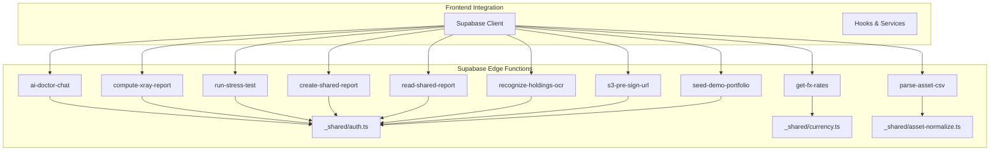
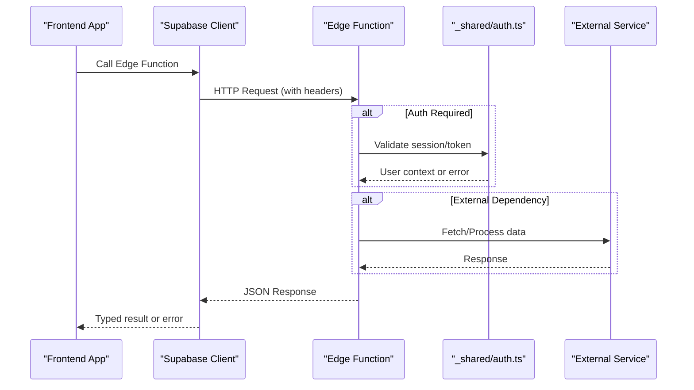
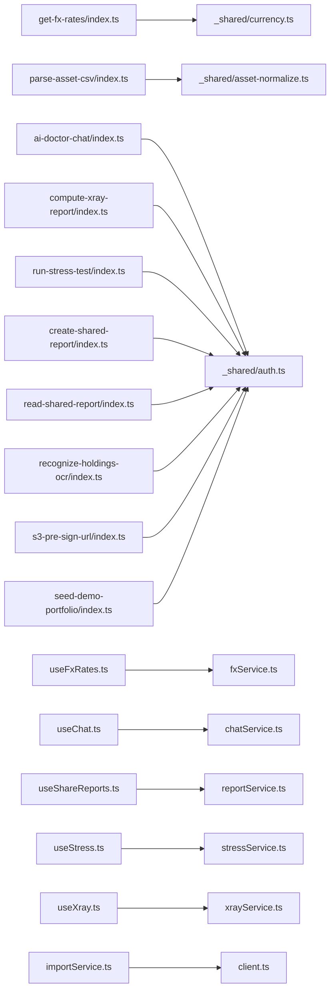

# Edge Functions API

<cite>
**Referenced Files in This Document**
- [get-fx-rates/index.ts](file://supabase/functions/get-fx-rates/index.ts)
- [parse-asset-csv/index.ts](file://supabase/functions/parse-asset-csv/index.ts)
- [ai-doctor-chat/index.ts](file://supabase/functions/ai-doctor-chat/index.ts)
- [compute-xray-report/index.ts](file://supabase/functions/compute-xray-report/index.ts)
- [run-stress-test/index.ts](file://supabase/functions/run-stress-test/index.ts)
- [create-shared-report/index.ts](file://supabase/functions/create-shared-report/index.ts)
- [read-shared-report/index.ts](file://supabase/functions/read-shared-report/index.ts)
- [recognize-holdings-ocr/index.ts](file://supabase/functions/recognize-holdings-ocr/index.ts)
- [s3-pre-sign-url/index.ts](file://supabase/functions/s3-pre-sign-url/index.ts)
- [seed-demo-portfolio/index.ts](file://supabase/functions/seed-demo-portfolio/index.ts)
- [_shared/auth.ts](file://supabase/functions/_shared/auth.ts)
- [_shared/currency.ts](file://supabase/functions/_shared/currency.ts)
- [_shared/asset-normalize.ts](file://supabase/functions/_shared/asset-normalize.ts)
- [client.ts](file://src/integrations/supabase/client.ts)
- [types.ts](file://src/integrations/supabase/types.ts)
- [useFxRates.ts](file://src/hooks/useFxRates.ts)
- [useChat.ts](file://src/hooks/useChat.ts)
- [useShareReports.ts](file://src/hooks/useShareReports.ts)
- [useStress.ts](file://src/hooks/useStress.ts)
- [useXray.ts](file://src/hooks/useXray.ts)
- [fxService.ts](file://src/services/fxService.ts)
- [chatService.ts](file://src/services/chatService.ts)
- [reportService.ts](file://src/services/reportService.ts)
- [stressService.ts](file://src/services/stressService.ts)
- [xrayService.ts](file://src/services/xrayService.ts)
- [importService.ts](file://src/services/importService.ts)
</cite>

## Table of Contents
1. [Introduction](#introduction)
2. [Project Structure](#project-structure)
3. [Core Components](#core-components)
4. [Architecture Overview](#architecture-overview)
5. [Detailed Component Analysis](#detailed-component-analysis)
6. [Dependency Analysis](#dependency-analysis)
7. [Performance Considerations](#performance-considerations)
8. [Troubleshooting Guide](#troubleshooting-guide)
9. [Conclusion](#conclusion)
10. [Appendices](#appendices)

## Introduction
This document provides comprehensive API documentation for FinSight’s Supabase Edge Functions. It covers all serverless function endpoints, including HTTP methods, URL patterns, request/response schemas, authentication requirements, error handling, rate limiting considerations, and security guidance. Client implementation examples are provided using the Supabase JavaScript client with proper error handling and type safety.

## Project Structure
FinSight implements its backend logic as Supabase Edge Functions under supabase/functions. Each function is a self-contained module that handles a specific domain operation (e.g., currency exchange rates, CSV parsing, AI chat, X-Ray report generation, stress testing, shared reports, OCR processing, S3 pre-signed URLs, and demo data seeding). Shared utilities for authentication, currency normalization, and asset normalization live under _shared. The frontend integrates via the Supabase JS client and typed helpers.

**Diagram sources**
- [get-fx-rates/index.ts](file://supabase/functions/get-fx-rates/index.ts)
- [parse-asset-csv/index.ts](file://supabase/functions/parse-asset-csv/index.ts)
- [ai-doctor-chat/index.ts](file://supabase/functions/ai-doctor-chat/index.ts)
- [compute-xray-report/index.ts](file://supabase/functions/compute-xray-report/index.ts)
- [run-stress-test/index.ts](file://supabase/functions/run-stress-test/index.ts)
- [create-shared-report/index.ts](file://supabase/functions/create-shared-report/index.ts)
- [read-shared-report/index.ts](file://supabase/functions/read-shared-report/index.ts)
- [recognize-holdings-ocr/index.ts](file://supabase/functions/recognize-holdings-ocr/index.ts)
- [s3-pre-sign-url/index.ts](file://supabase/functions/s3-pre-sign-url/index.ts)
- [seed-demo-portfolio/index.ts](file://supabase/functions/seed-demo-portfolio/index.ts)
- [_shared/auth.ts](file://supabase/functions/_shared/auth.ts)
- [_shared/currency.ts](file://supabase/functions/_shared/currency.ts)
- [_shared/asset-normalize.ts](file://supabase/functions/_shared/asset-normalize.ts)

**Section sources**
- [client.ts](file://src/integrations/supabase/client.ts)
- [types.ts](file://src/integrations/supabase/types.ts)

## Core Components
The following components represent the primary Edge Function endpoints:

- Currency Exchange Rates: get-fx-rates
- CSV Asset Parsing: parse-asset-csv
- AI Chat Interface: ai-doctor-chat
- X-Ray Report Generation: compute-xray-report
- Stress Testing Execution: run-stress-test
- Shared Report Management: create-shared-report, read-shared-report
- OCR Document Processing: recognize-holdings-ocr
- File Upload Handling: s3-pre-sign-url
- Demo Data Seeding: seed-demo-portfolio

Each endpoint is documented below with method, URL pattern, authentication, parameters, response schema, errors, and usage notes.

**Section sources**
- [get-fx-rates/index.ts](file://supabase/functions/get-fx-rates/index.ts)
- [parse-asset-csv/index.ts](file://supabase/functions/parse-asset-csv/index.ts)
- [ai-doctor-chat/index.ts](file://supabase/functions/ai-doctor-chat/index.ts)
- [compute-xray-report/index.ts](file://supabase/functions/compute-xray-report/index.ts)
- [run-stress-test/index.ts](file://supabase/functions/run-stress-test/index.ts)
- [create-shared-report/index.ts](file://supabase/functions/create-shared-report/index.ts)
- [read-shared-report/index.ts](file://supabase/functions/read-shared-report/index.ts)
- [recognize-holdings-ocr/index.ts](file://supabase/functions/recognize-holdings-ocr/index.ts)
- [s3-pre-sign-url/index.ts](file://supabase/functions/s3-pre-sign-url/index.ts)
- [seed-demo-portfolio/index.ts](file://supabase/functions/seed-demo-portfolio/index.ts)

## Architecture Overview
Edge Functions are invoked by the frontend through the Supabase JS client. Authentication is enforced per function where required using shared auth utilities. Some functions rely on external services (e.g., currency APIs, AI providers, OCR engines, S3). Responses are standardized JSON payloads with consistent error structures.

**Diagram sources**
- [_shared/auth.ts](file://supabase/functions/_shared/auth.ts)
- [get-fx-rates/index.ts](file://supabase/functions/get-fx-rates/index.ts)
- [ai-doctor-chat/index.ts](file://supabase/functions/ai-doctor-chat/index.ts)
- [recognize-holdings-ocr/index.ts](file://supabase/functions/recognize-holdings-ocr/index.ts)
- [s3-pre-sign-url/index.ts](file://supabase/functions/s3-pre-sign-url/index.ts)

## Detailed Component Analysis

### Currency Exchange Rates: get-fx-rates
- Method: GET
- URL Pattern: /functions/v1/get-fx-rates
- Authentication: Optional; typically public for rate retrieval unless restricted by environment policy
- Query Parameters:
  - base: string (optional) — Base currency code (e.g., USD)
  - symbols: string (optional) — Comma-separated list of target currencies
  - date: string (optional) — Historical date in YYYY-MM-DD format
- Response Schema:
  - success: boolean
  - data: object containing exchange rates keyed by currency code
  - timestamp: number (Unix epoch seconds)
  - meta: object with source and version info
- Errors:
  - 400 Bad Request: Invalid query parameters
  - 502 Bad Gateway: External currency service unavailable
  - 503 Service Unavailable: Rate limit exceeded or upstream timeout
- Notes:
  - Caching may be applied at the edge layer to reduce upstream calls
  - Default base currency is supported if not provided

Client example path:
- [useFxRates.ts](file://src/hooks/useFxRates.ts)
- [fxService.ts](file://src/services/fxService.ts)

**Section sources**
- [get-fx-rates/index.ts](file://supabase/functions/get-fx-rates/index.ts)
- [_shared/currency.ts](file://supabase/functions/_shared/currency.ts)
- [useFxRates.ts](file://src/hooks/useFxRates.ts)
- [fxService.ts](file://src/services/fxService.ts)

### CSV Asset Parsing: parse-asset-csv
- Method: POST
- URL Pattern: /functions/v1/parse-asset-csv
- Authentication: Required (user-scoped)
- Headers:
  - Content-Type: text/csv
- Body: Raw CSV content
- Response Schema:
  - success: boolean
  - data: array of normalized asset objects
  - warnings: array of warning messages for malformed rows
  - summary: object with counts (total, parsed, skipped)
- Errors:
  - 400 Bad Request: Malformed CSV or unsupported columns
  - 401 Unauthorized: Missing or invalid token
  - 413 Payload Too Large: Exceeds maximum payload size
- Notes:
  - Normalization uses shared asset utilities for consistent field mapping
  - Supports common brokerage export formats

Client example path:
- [importService.ts](file://src/services/importService.ts)

**Section sources**
- [parse-asset-csv/index.ts](file://supabase/functions/parse-asset-csv/index.ts)
- [_shared/asset-normalize.ts](file://supabase/functions/_shared/asset-normalize.ts)
- [importService.ts](file://src/services/importService.ts)

### AI Doctor Chat: ai-doctor-chat
- Method: POST
- URL Pattern: /functions/v1/ai-doctor-chat
- Authentication: Required (user-scoped)
- Request Body:
  - message: string — User prompt
  - conversation_id: string (optional) — Session identifier for continuity
  - system_prompt: string (optional) — Customized instructions
- Response Schema:
  - success: boolean
  - data: object with reply text and optional metadata (tokens used, model version)
  - conversation_id: string — Updated or new session ID
- Errors:
  - 400 Bad Request: Missing or invalid message
  - 401 Unauthorized: Missing or invalid token
  - 429 Too Many Requests: Rate limited by provider
  - 502 Bad Gateway: AI provider error
- Notes:
  - Streaming responses can be implemented via Server-Sent Events if needed
  - Input sanitization and output moderation should be enforced

Client example path:
- [useChat.ts](file://src/hooks/useChat.ts)
- [chatService.ts](file://src/services/chatService.ts)

**Section sources**
- [ai-doctor-chat/index.ts](file://supabase/functions/ai-doctor-chat/index.ts)
- [_shared/auth.ts](file://supabase/functions/_shared/auth.ts)
- [useChat.ts](file://src/hooks/useChat.ts)
- [chatService.ts](file://src/services/chatService.ts)

### X-Ray Report Generation: compute-xray-report
- Method: POST
- URL Pattern: /functions/v1/compute-xray-report
- Authentication: Required (user-scoped)
- Request Body:
  - assets: array of asset objects
  - metrics: array of metric identifiers
  - options: object with thresholds and time windows
- Response Schema:
  - success: boolean
  - data: object containing computed metrics, charts data, and insights
  - generated_at: number (Unix epoch seconds)
- Errors:
  - 400 Bad Request: Invalid asset structure or missing metrics
  - 401 Unauthorized: Missing or invalid token
  - 500 Internal Server Error: Computation failure
- Notes:
  - Heavy computations should consider background jobs for large datasets
  - Results may be cached per user and input fingerprint

Client example path:
- [useXray.ts](file://src/hooks/useXray.ts)
- [xrayService.ts](file://src/services/xrayService.ts)

**Section sources**
- [compute-xray-report/index.ts](file://supabase/functions/compute-xray-report/index.ts)
- [_shared/auth.ts](file://supabase/functions/_shared/auth.ts)
- [useXray.ts](file://src/hooks/useXray.ts)
- [xrayService.ts](file://src/services/xrayService.ts)

### Stress Testing Execution: run-stress-test
- Method: POST
- URL Pattern: /functions/v1/run-stress-test
- Authentication: Required (admin-scoped)
- Request Body:
  - scenario: string — Identifier for the test scenario
  - params: object — Scenario-specific parameters
- Response Schema:
  - success: boolean
  - data: object with results, duration, and performance metrics
  - job_id: string — For asynchronous tracking if applicable
- Errors:
  - 400 Bad Request: Unknown scenario or invalid parameters
  - 401 Unauthorized: Missing or invalid token
  - 403 Forbidden: Insufficient permissions
  - 500 Internal Server Error: Test execution failure
- Notes:
  - Long-running tests should return a job_id and support polling or webhooks
  - Admin-only access must be enforced via role checks

Client example path:
- [useStress.ts](file://src/hooks/useStress.ts)
- [stressService.ts](file://src/services/stressService.ts)

**Section sources**
- [run-stress-test/index.ts](file://supabase/functions/run-stress-test/index.ts)
- [_shared/auth.ts](file://supabase/functions/_shared/auth.ts)
- [useStress.ts](file://src/hooks/useStress.ts)
- [stressService.ts](file://src/services/stressService.ts)

### Shared Report Management: create-shared-report, read-shared-report
- Create Endpoint
  - Method: POST
  - URL Pattern: /functions/v1/create-shared-report
  - Authentication: Required (user-scoped)
  - Request Body:
    - title: string
    - description: string (optional)
    - data: object — Report payload
    - visibility: enum ("public", "private")
  - Response Schema:
    - success: boolean
    - data: object with report_id and share_url
- Read Endpoint
  - Method: GET
  - URL Pattern: /functions/v1/read-shared-report?report_id={id}
  - Authentication: Optional depending on visibility
  - Response Schema:
    - success: boolean
    - data: object with report details and contents
- Errors:
  - 400 Bad Request: Missing fields or invalid visibility value
  - 401 Unauthorized: Missing or invalid token (for private reports)
  - 404 Not Found: Report does not exist
- Notes:
  - Enforce access control based on visibility and ownership
  - Sanitize and validate report data before storage

Client example path:
- [useShareReports.ts](file://src/hooks/useShareReports.ts)
- [reportService.ts](file://src/services/reportService.ts)

**Section sources**
- [create-shared-report/index.ts](file://supabase/functions/create-shared-report/index.ts)
- [read-shared-report/index.ts](file://supabase/functions/read-shared-report/index.ts)
- [_shared/auth.ts](file://supabase/functions/_shared/auth.ts)
- [useShareReports.ts](file://src/hooks/useShareReports.ts)
- [reportService.ts](file://src/services/reportService.ts)

### OCR Document Processing: recognize-holdings-ocr
- Method: POST
- URL Pattern: /functions/v1/recognize-holdings-ocr
- Authentication: Required (user-scoped)
- Headers:
  - Content-Type: multipart/form-data
- Form Fields:
  - file: file — Image or PDF of holdings statement
- Response Schema:
  - success: boolean
  - data: array of recognized holdings entries
  - confidence_scores: array of numbers indicating recognition confidence
  - warnings: array of strings for low-confidence segments
- Errors:
  - 400 Bad Request: Unsupported file type or empty file
  - 401 Unauthorized: Missing or invalid token
  - 413 Payload Too Large: File exceeds size limits
  - 502 Bad Gateway: OCR service error
- Notes:
  - Preprocess images for better accuracy (e.g., deskew, enhance contrast)
  - Consider async processing for large documents

Client example path:
- [importService.ts](file://src/services/importService.ts)

**Section sources**
- [recognize-holdings-ocr/index.ts](file://supabase/functions/recognize-holdings-ocr/index.ts)
- [_shared/auth.ts](file://supabase/functions/_shared/auth.ts)
- [importService.ts](file://src/services/importService.ts)

### File Upload Handling: s3-pre-sign-url
- Method: POST
- URL Pattern: /functions/v1/s3-pre-sign-url
- Authentication: Required (user-scoped)
- Request Body:
  - filename: string
  - content_type: string
  - folder: string (optional) — Target directory within bucket
- Response Schema:
  - success: boolean
  - data: object with upload_url (pre-signed), download_url, and key
- Errors:
  - 400 Bad Request: Invalid filename or content type
  - 401 Unauthorized: Missing or invalid token
  - 500 Internal Server Error: S3 configuration error
- Notes:
  - Enforce allowed content types and size limits
  - Use signed URLs to avoid exposing credentials

Client example path:
- [importService.ts](file://src/services/importService.ts)

**Section sources**
- [s3-pre-sign-url/index.ts](file://supabase/functions/s3-pre-sign-url/index.ts)
- [_shared/auth.ts](file://supabase/functions/_shared/auth.ts)
- [importService.ts](file://src/services/importService.ts)

### Demo Data Seeding: seed-demo-portfolio
- Method: POST
- URL Pattern: /functions/v1/seed-demo-portfolio
- Authentication: Required (admin-scoped)
- Request Body:
  - user_id: string (optional) — If seeding for a specific user
  - scope: enum ("global", "user")
- Response Schema:
  - success: boolean
  - data: object with seeded entities count and IDs
- Errors:
  - 400 Bad Request: Invalid scope or user_id
  - 401 Unauthorized: Missing or invalid token
  - 403 Forbidden: Insufficient permissions
  - 500 Internal Server Error: Database write failure
- Notes:
  - Idempotent seeding should be supported to avoid duplicates
  - Clear rollback strategy in case of partial failures

Client example path:
- [importService.ts](file://src/services/importService.ts)

**Section sources**
- [seed-demo-portfolio/index.ts](file://supabase/functions/seed-demo-portfolio/index.ts)
- [_shared/auth.ts](file://supabase/functions/_shared/auth.ts)
- [importService.ts](file://src/services/importService.ts)

## Dependency Analysis
Edge Functions depend on shared modules for authentication, currency normalization, and asset normalization. Frontend hooks and services encapsulate Supabase client calls and provide typed interfaces.

**Diagram sources**
- [get-fx-rates/index.ts](file://supabase/functions/get-fx-rates/index.ts)
- [parse-asset-csv/index.ts](file://supabase/functions/parse-asset-csv/index.ts)
- [ai-doctor-chat/index.ts](file://supabase/functions/ai-doctor-chat/index.ts)
- [compute-xray-report/index.ts](file://supabase/functions/compute-xray-report/index.ts)
- [run-stress-test/index.ts](file://supabase/functions/run-stress-test/index.ts)
- [create-shared-report/index.ts](file://supabase/functions/create-shared-report/index.ts)
- [read-shared-report/index.ts](file://supabase/functions/read-shared-report/index.ts)
- [recognize-holdings-ocr/index.ts](file://supabase/functions/recognize-holdings-ocr/index.ts)
- [s3-pre-sign-url/index.ts](file://supabase/functions/s3-pre-sign-url/index.ts)
- [seed-demo-portfolio/index.ts](file://supabase/functions/seed-demo-portfolio/index.ts)
- [_shared/auth.ts](file://supabase/functions/_shared/auth.ts)
- [_shared/currency.ts](file://supabase/functions/_shared/currency.ts)
- [_shared/asset-normalize.ts](file://supabase/functions/_shared/asset-normalize.ts)
- [useFxRates.ts](file://src/hooks/useFxRates.ts)
- [useChat.ts](file://src/hooks/useChat.ts)
- [useShareReports.ts](file://src/hooks/useShareReports.ts)
- [useStress.ts](file://src/hooks/useStress.ts)
- [useXray.ts](file://src/hooks/useXray.ts)
- [fxService.ts](file://src/services/fxService.ts)
- [chatService.ts](file://src/services/chatService.ts)
- [reportService.ts](file://src/services/reportService.ts)
- [stressService.ts](file://src/services/stressService.ts)
- [xrayService.ts](file://src/services/xrayService.ts)
- [importService.ts](file://src/services/importService.ts)
- [client.ts](file://src/integrations/supabase/client.ts)

**Section sources**
- [client.ts](file://src/integrations/supabase/client.ts)
- [types.ts](file://src/integrations/supabase/types.ts)

## Performance Considerations
- Prefer caching for expensive operations (e.g., FX rates, X-Ray reports) using edge cache or database-level caching strategies.
- Stream large responses when possible (e.g., chat replies, long reports) to improve perceived latency.
- Validate and sanitize inputs early to fail fast and reduce downstream costs.
- Use pagination and filtering for large datasets to minimize payload sizes.
- Monitor cold start times and optimize initialization paths in Edge Functions.

[No sources needed since this section provides general guidance]

## Troubleshooting Guide
Common issues and resolutions:
- Authentication failures: Ensure tokens are present and valid; verify admin roles for protected endpoints.
- Rate limiting: Implement exponential backoff and retry logic; check provider quotas.
- Payload too large: Split uploads or compress data; enforce strict size limits.
- Upstream service errors: Log detailed error contexts and surface actionable messages to clients.
- CORS and network errors: Confirm correct origin settings and network policies.

**Section sources**
- [_shared/auth.ts](file://supabase/functions/_shared/auth.ts)
- [get-fx-rates/index.ts](file://supabase/functions/get-fx-rates/index.ts)
- [ai-doctor-chat/index.ts](file://supabase/functions/ai-doctor-chat/index.ts)
- [recognize-holdings-ocr/index.ts](file://supabase/functions/recognize-holdings-ocr/index.ts)
- [s3-pre-sign-url/index.ts](file://supabase/functions/s3-pre-sign-url/index.ts)

## Conclusion
FinSight’s Edge Functions provide a modular, secure, and scalable backend for financial analytics features. By standardizing request/response schemas, enforcing authentication, and leveraging shared utilities, the system ensures consistency and maintainability. Clients should use typed Supabase integrations and robust error handling to deliver reliable user experiences.

[No sources needed since this section summarizes without analyzing specific files]

## Appendices

### Client Implementation Examples (Supabase JS Client)
- FX Rates:
  - Hook: [useFxRates.ts](file://src/hooks/useFxRates.ts)
  - Service: [fxService.ts](file://src/services/fxService.ts)
- Chat:
  - Hook: [useChat.ts](file://src/hooks/useChat.ts)
  - Service: [chatService.ts](file://src/services/chatService.ts)
- Shared Reports:
  - Hook: [useShareReports.ts](file://src/hooks/useShareReports.ts)
  - Service: [reportService.ts](file://src/services/reportService.ts)
- Stress Tests:
  - Hook: [useStress.ts](file://src/hooks/useStress.ts)
  - Service: [stressService.ts](file://src/services/stressService.ts)
- X-Ray Reports:
  - Hook: [useXray.ts](file://src/hooks/useXray.ts)
  - Service: [xrayService.ts](file://src/services/xrayService.ts)
- Import (CSV, OCR, S3, Seed):
  - Service: [importService.ts](file://src/services/importService.ts)

**Section sources**
- [useFxRates.ts](file://src/hooks/useFxRates.ts)
- [fxService.ts](file://src/services/fxService.ts)
- [useChat.ts](file://src/hooks/useChat.ts)
- [chatService.ts](file://src/services/chatService.ts)
- [useShareReports.ts](file://src/hooks/useShareReports.ts)
- [reportService.ts](file://src/services/reportService.ts)
- [useStress.ts](file://src/hooks/useStress.ts)
- [stressService.ts](file://src/services/stressService.ts)
- [useXray.ts](file://src/hooks/useXray.ts)
- [xrayService.ts](file://src/services/xrayService.ts)
- [importService.ts](file://src/services/importService.ts)