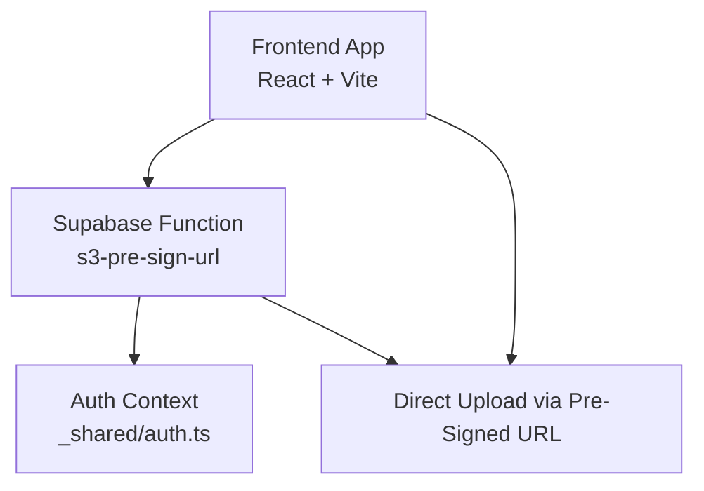
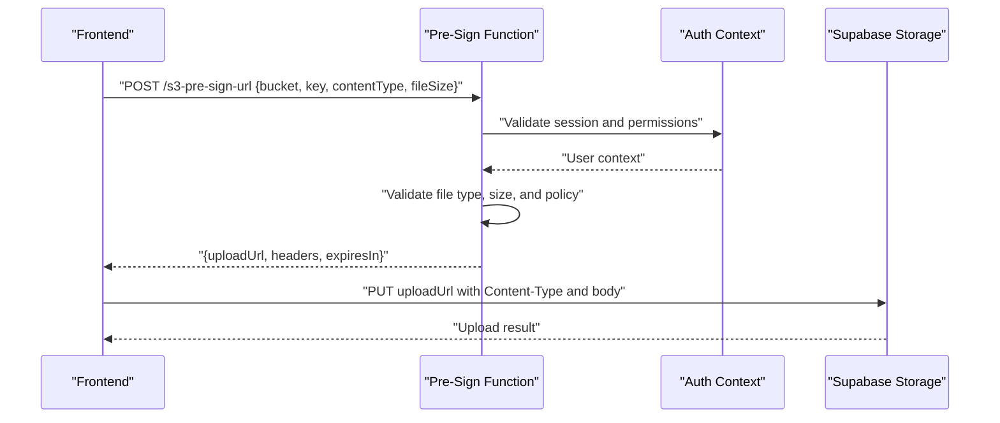
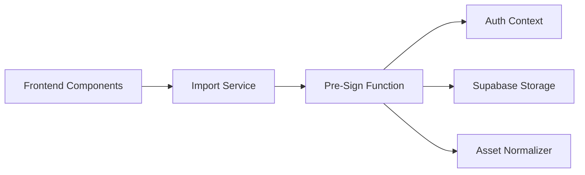

# File Storage Services

<cite>
**Referenced Files in This Document**
- [s3-pre-sign-url/index.ts](file://supabase/functions/s3-pre-sign-url/index.ts)
- [CsvImportFlow.tsx](file://src/components/desktop/import/CsvImportFlow.tsx)
- [importService.ts](file://src/services/importService.ts)
- [client.ts](file://src/integrations/supabase/client.ts)
- [config.toml](file://supabase/config.toml)
- [asset-normalize.ts](file://supabase/functions/_shared/asset-normalize.ts)
- [auth.ts](file://supabase/functions/_shared/auth.ts)
</cite>

## Table of Contents
1. [Introduction](#introduction)
2. [Project Structure](#project-structure)
3. [Core Components](#core-components)
4. [Architecture Overview](#architecture-overview)
5. [Detailed Component Analysis](#detailed-component-analysis)
6. [Dependency Analysis](#dependency-analysis)
7. [Performance Considerations](#performance-considerations)
8. [Troubleshooting Guide](#troubleshooting-guide)
9. [Conclusion](#conclusion)
10. [Appendices](#appendices)

## Introduction
This document provides comprehensive API documentation for FinSight’s file storage and upload services. It focuses on the S3 pre-sign URL generation endpoint, secure direct upload workflows, temporary credential management, CORS configuration, error handling, file organization strategies, metadata handling, access control integration, and cleanup procedures for expired uploads. It also includes practical guidance for implementing secure uploads, handling large files, validating file types, and integrating with Supabase storage buckets.

## Project Structure
FinSight integrates with Supabase Functions and Storage to provide secure, scalable file uploads:
- A serverless function generates signed URLs for direct uploads to Supabase Storage (backed by S3-compatible endpoints).
- The frontend requests a pre-signed URL, then uploads directly to storage using the returned credentials.
- Shared utilities handle authentication context and asset normalization.
- Configuration defines environment variables and runtime settings for Supabase functions.

[No sources needed since this diagram shows conceptual workflow, not actual code structure]

## Core Components
- Pre-sign URL Generation Endpoint: Generates time-limited, policy-bound credentials for direct uploads to a specific bucket and path.
- Direct Upload Workflow: Frontend obtains a pre-signed URL and performs an HTTP PUT to storage without proxying payload through the backend.
- Authentication Integration: Ensures only authenticated users can request pre-signed URLs and enforces user-scoped paths.
- Validation and Policies: Enforces allowed file types, maximum size, and content-type constraints at generation time.
- Error Handling: Returns structured errors for invalid inputs, rate limits, or storage failures.
- Cleanup: Expired uploads are managed by lifecycle policies and periodic cleanup routines.

**Section sources**
- [s3-pre-sign-url/index.ts](file://supabase/functions/s3-pre-sign-url/index.ts)
- [auth.ts](file://supabase/functions/_shared/auth.ts)
- [client.ts](file://src/integrations/supabase/client.ts)

## Architecture Overview
The upload flow uses a two-step process:
1. Request a pre-signed URL from the serverless function with validation and authorization checks.
2. Perform a direct upload to Supabase Storage using the returned credentials.

**Diagram sources**
- [s3-pre-sign-url/index.ts](file://supabase/functions/s3-pre-sign-url/index.ts)
- [auth.ts](file://supabase/functions/_shared/auth.ts)
- [client.ts](file://src/integrations/supabase/client.ts)

## Detailed Component Analysis

### Pre-Sign URL Generation Endpoint
Responsibilities:
- Accept upload parameters: target bucket, object key, content type, and optional file size.
- Validate input against security policies: allowed MIME types, max size, and naming rules.
- Enforce user isolation by scoping keys under a user-specific prefix.
- Generate a time-limited, policy-bound pre-signed URL for direct PUT upload.
- Return structured response including upload URL, required headers, and expiration.

Security considerations:
- Only authenticated users can request pre-signed URLs.
- Enforce strict allowlists for content types and extensions.
- Limit maximum file size to prevent abuse.
- Use short-lived tokens and minimal scopes.

Error handling:
- Invalid input returns clear error messages.
- Unauthorized or forbidden requests return appropriate status codes.
- Storage service errors are normalized and surfaced to clients.

Operational notes:
- Expiration window should be short (e.g., minutes) to reduce risk.
- Rate limiting and logging are recommended for production.

**Section sources**
- [s3-pre-sign-url/index.ts](file://supabase/functions/s3-pre-sign-url/index.ts)
- [auth.ts](file://supabase/functions/_shared/auth.ts)

### Direct Upload Workflow
Responsibilities:
- Frontend calls the pre-sign endpoint to obtain upload credentials.
- Performs a direct HTTP PUT to the returned URL with correct headers.
- Handles network retries and progress reporting for large files.
- On success, persists metadata (e.g., file path, size, type) to the application database.

Best practices:
- Set Content-Type exactly as validated during pre-sign generation.
- Include any additional headers required by the pre-signed policy.
- Implement client-side chunked uploads for very large files if supported.

**Section sources**
- [s3-pre-sign-url/index.ts](file://supabase/functions/s3-pre-sign-url/index.ts)
- [client.ts](file://src/integrations/supabase/client.ts)

### Authentication and Access Control Integration
Responsibilities:
- Verify user identity before issuing pre-signed URLs.
- Scope storage paths per user to enforce data isolation.
- Optionally integrate with row-level security or storage policies for fine-grained access.

Implementation patterns:
- Extract user context from request headers or session.
- Derive a unique folder prefix per user.
- Apply least-privilege policies to generated credentials.

**Section sources**
- [auth.ts](file://supabase/functions/_shared/auth.ts)
- [s3-pre-sign-url/index.ts](file://supabase/functions/s3-pre-sign-url/index.ts)

### File Organization Strategies
Recommended structure:
- User-scoped directories: /users/{userId}/...
- Feature-scoped subfolders: /users/{userId}/imports/, /users/{userId}/reports/
- Versioned or timestamped keys for auditability: /users/{userId}/imports/{YYYY}/{MM}/{DD}/{uuid}.csv

Benefits:
- Simplifies access control and cleanup.
- Improves listing performance and readability.
- Supports retention and lifecycle policies.

**Section sources**
- [s3-pre-sign-url/index.ts](file://supabase/functions/s3-pre-sign-url/index.ts)

### Metadata Handling
Approaches:
- Store file metadata in application tables: original name, content type, size, SHA-256 hash, created by, created at.
- Use object tags or custom headers for lightweight attributes when appropriate.
- Normalize asset metadata using shared utilities for consistency.

Normalization example reference:
- Asset normalization logic ensures consistent field names and formats across imports.

**Section sources**
- [asset-normalize.ts](file://supabase/functions/_shared/asset-normalize.ts)

### Security Policies and CORS Configuration
Policies:
- Allowlist content types and file extensions.
- Enforce maximum file sizes.
- Restrict destination bucket and path patterns.
- Short expiration windows for pre-signed URLs.

CORS:
- Configure Supabase Storage CORS to permit your frontend origin(s).
- Ensure preflight OPTIONS requests are handled if necessary.
- Keep origins restrictive to known domains.

Configuration references:
- Supabase runtime and environment variables are defined in configuration.

**Section sources**
- [config.toml](file://supabase/config.toml)
- [s3-pre-sign-url/index.ts](file://supabase/functions/s3-pre-sign-url/index.ts)

### Error Handling for Upload Failures
Common failure modes:
- Invalid or expired pre-signed URL.
- Mismatched Content-Type or missing headers.
- Network timeouts or partial uploads.
- Size exceeded or disallowed file type.

Handling strategy:
- Surface actionable error messages to users.
- Retry transient network errors with exponential backoff.
- Invalidate and regenerate pre-signed URLs on failure.
- Log detailed diagnostics server-side while avoiding sensitive data exposure.

**Section sources**
- [s3-pre-sign-url/index.ts](file://supabase/functions/s3-pre-sign-url/index.ts)

### Cleanup Procedures for Expired Uploads
Strategies:
- Lifecycle rules to delete objects older than a threshold.
- Scheduled jobs to purge incomplete or orphaned uploads.
- Prefix-based retention policies per feature or user.

Recommendations:
- Tag incomplete uploads with a marker and clean them up after a grace period.
- Monitor storage growth and set alerts.

**Section sources**
- [config.toml](file://supabase/config.toml)

### Practical Examples

#### Implementing Secure File Uploads
Steps:
1. Authenticate the user and ensure they have permission to upload.
2. Request a pre-signed URL with bucket, key, content type, and size.
3. Validate the response and perform a direct PUT to the returned URL.
4. On success, record metadata in the application database.

References:
- Pre-sign endpoint implementation.
- Supabase client usage for environment and configuration.

**Section sources**
- [s3-pre-sign-url/index.ts](file://supabase/functions/s3-pre-sign-url/index.ts)
- [client.ts](file://src/integrations/supabase/client.ts)

#### Handling Large Files
Guidance:
- For very large CSVs, consider multipart uploads if supported by the storage SDK.
- Stream uploads to avoid loading entire files into memory.
- Provide progress indicators and resume capability where possible.

References:
- Import flows that handle CSV assets.

**Section sources**
- [CsvImportFlow.tsx](file://src/components/desktop/import/CsvImportFlow.tsx)
- [importService.ts](file://src/services/importService.ts)

#### Validating File Types
Guidance:
- Maintain an allowlist of MIME types and extensions.
- Reject unknown or dangerous types early.
- Validate both client-provided and server-enforced policies.

References:
- Pre-sign endpoint validation logic.

**Section sources**
- [s3-pre-sign-url/index.ts](file://supabase/functions/s3-pre-sign-url/index.ts)

#### Integrating with Supabase Storage Buckets
Guidance:
- Define bucket names and policies in Supabase.
- Configure CORS to allow your app domain.
- Use environment variables for bucket names and regions.

References:
- Supabase configuration.

**Section sources**
- [config.toml](file://supabase/config.toml)

## Dependency Analysis
High-level dependencies:
- Pre-sign function depends on authentication context and storage APIs.
- Frontend components depend on import services and Supabase client.
- Shared utilities normalize imported assets consistently.

**Diagram sources**
- [CsvImportFlow.tsx](file://src/components/desktop/import/CsvImportFlow.tsx)
- [importService.ts](file://src/services/importService.ts)
- [s3-pre-sign-url/index.ts](file://supabase/functions/s3-pre-sign-url/index.ts)
- [auth.ts](file://supabase/functions/_shared/auth.ts)
- [asset-normalize.ts](file://supabase/functions/_shared/asset-normalize.ts)

**Section sources**
- [CsvImportFlow.tsx](file://src/components/desktop/import/CsvImportFlow.tsx)
- [importService.ts](file://src/services/importService.ts)
- [s3-pre-sign-url/index.ts](file://supabase/functions/s3-pre-sign-url/index.ts)
- [auth.ts](file://supabase/functions/_shared/auth.ts)
- [asset-normalize.ts](file://supabase/functions/_shared/asset-normalize.ts)

## Performance Considerations
- Prefer direct uploads to minimize server load and latency.
- Use short-lived pre-signed URLs to reduce token reuse risks.
- Enable compression for text-heavy assets when appropriate.
- Cache pre-signed URLs briefly on the client to avoid repeated calls within the same session.
- Monitor storage throughput and adjust concurrency for large batches.

[No sources needed since this section provides general guidance]

## Troubleshooting Guide
Common issues and resolutions:
- 403 Forbidden on upload: Check CORS settings and pre-signed URL validity.
- 400 Bad Request: Ensure Content-Type matches what was requested during pre-sign.
- Upload hangs or fails: Inspect network logs, retry with backoff, and verify file size limits.
- Permission denied: Confirm user authentication and bucket policies.

Diagnostic steps:
- Validate request payloads and headers.
- Review server-side logs for pre-sign generation and storage responses.
- Test with small files first, then scale up.

**Section sources**
- [s3-pre-sign-url/index.ts](file://supabase/functions/s3-pre-sign-url/index.ts)
- [client.ts](file://src/integrations/supabase/client.ts)

## Conclusion
FinSight’s file storage and upload services leverage Supabase Functions and Storage to provide secure, scalable, and user-isolated uploads. By enforcing strict validation, short-lived credentials, and clear error handling, the system balances usability with strong security. Adopting the recommended organization, metadata practices, and cleanup strategies will help maintain reliability and cost-efficiency over time.

[No sources needed since this section summarizes without analyzing specific files]

## Appendices

### API Reference: Pre-Sign URL Endpoint
- Method: POST
- Path: /functions/v1/s3-pre-sign-url
- Request body fields:
  - bucket: string (required)
  - key: string (required; user-scoped path)
  - contentType: string (required; must be in allowlist)
  - fileSize: number (optional; used for server-side validation)
- Response fields:
  - uploadUrl: string (time-limited)
  - headers: object (additional headers if required)
  - expiresIn: number (seconds until expiry)
- Errors:
  - 400: Invalid input or policy violation
  - 401: Unauthenticated
  - 403: Forbidden or insufficient permissions
  - 5xx: Internal or storage service errors

**Section sources**
- [s3-pre-sign-url/index.ts](file://supabase/functions/s3-pre-sign-url/index.ts)

### Security Checklist
- Enforce allowlisted content types and extensions.
- Limit maximum file size.
- Scope keys per user.
- Use short expiration windows.
- Configure CORS for trusted origins only.
- Log and monitor upload activity.

**Section sources**
- [s3-pre-sign-url/index.ts](file://supabase/functions/s3-pre-sign-url/index.ts)
- [config.toml](file://supabase/config.toml)