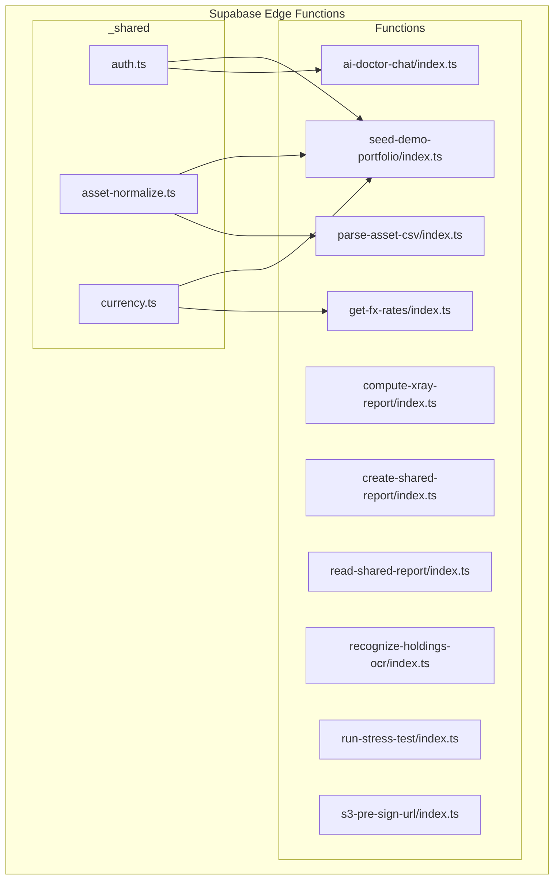
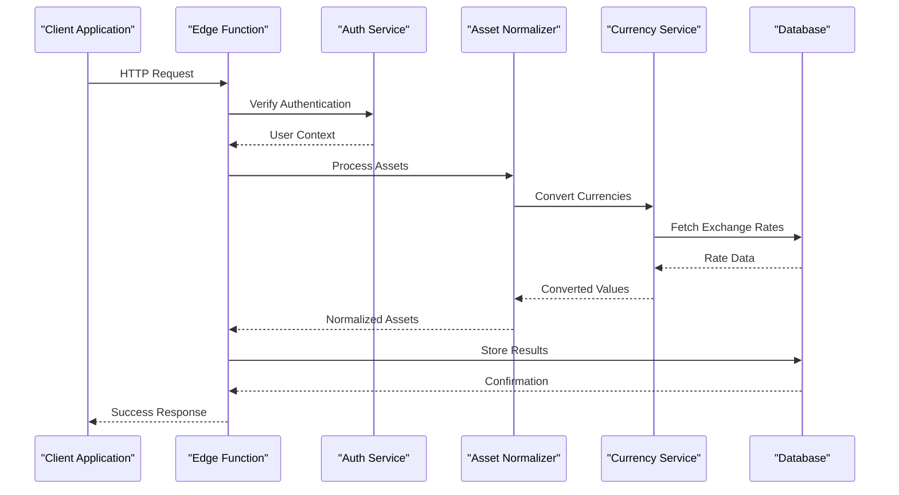
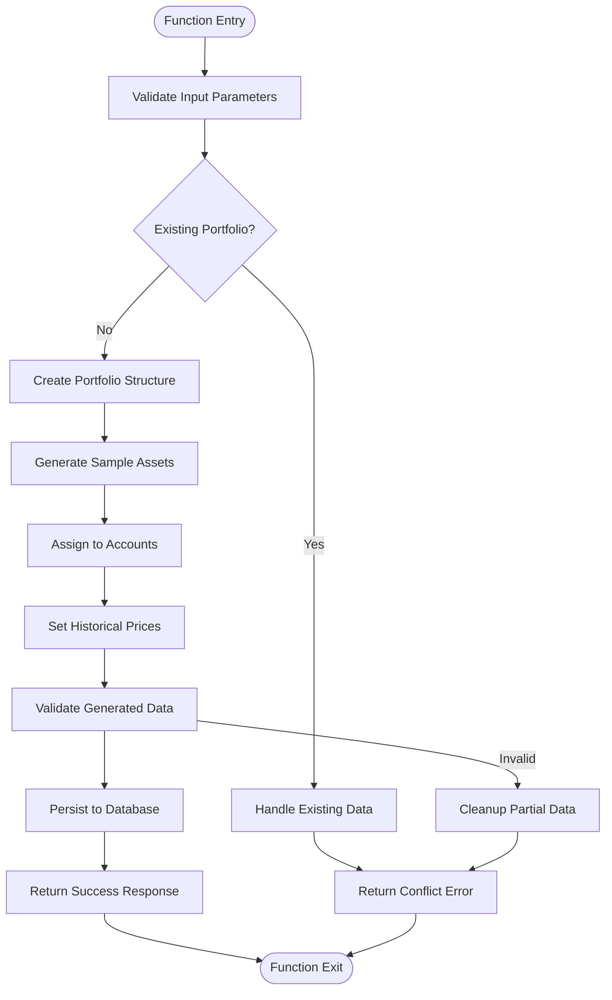
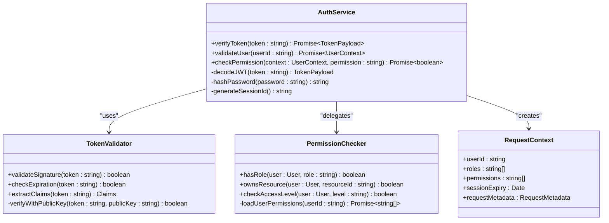
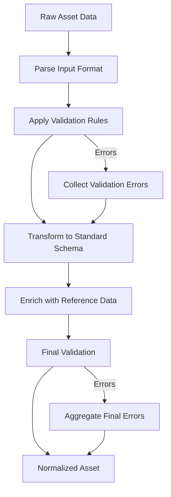
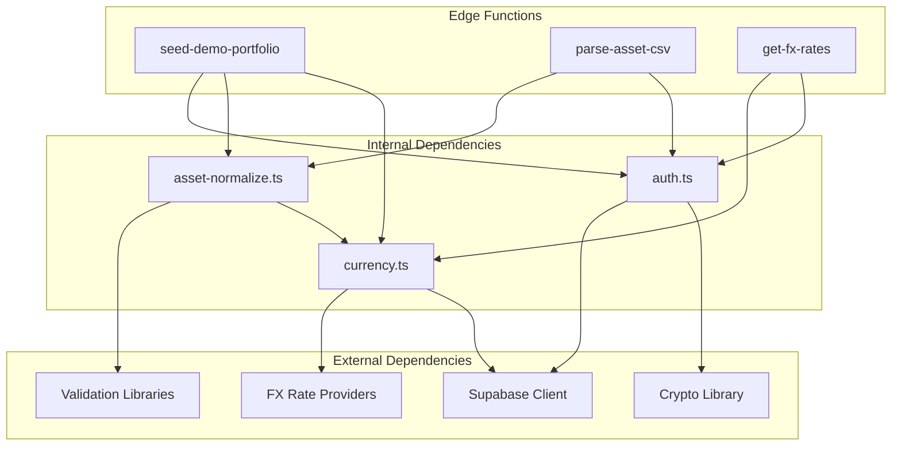

# Utility Functions

<cite>
**Referenced Files in This Document**
- [seed-demo-portfolio/index.ts](file://supabase/functions/seed-demo-portfolio/index.ts)
- [auth.ts](file://supabase/functions/_shared/auth.ts)
- [asset-normalize.ts](file://supabase/functions/_shared/asset-normalize.ts)
- [currency.ts](file://supabase/functions/_shared/currency.ts)
</cite>

## Table of Contents
1. [Introduction](#introduction)
2. [Project Structure](#project-structure)
3. [Core Components](#core-components)
4. [Architecture Overview](#architecture-overview)
5. [Detailed Component Analysis](#detailed-component-analysis)
6. [Dependency Analysis](#dependency-analysis)
7. [Performance Considerations](#performance-considerations)
8. [Troubleshooting Guide](#troubleshooting-guide)
9. [Conclusion](#conclusion)

## Introduction

This document provides comprehensive API documentation for FinSight's utility and helper edge functions. The utility library consists of three core components: a demo portfolio seeding function for generating sample financial data, shared authentication utilities for user validation and token verification, and asset normalization functions for data standardization and format conversion. These utilities form the foundation of FinSight's backend functionality, providing essential services for portfolio management, user authentication, and data processing.

## Project Structure

The utility functions are organized within the Supabase Edge Functions architecture, following a modular design pattern that separates concerns between different functional areas.



**Diagram sources**
- [seed-demo-portfolio/index.ts](file://supabase/functions/seed-demo-portfolio/index.ts)
- [auth.ts](file://supabase/functions/_shared/auth.ts)
- [asset-normalize.ts](file://supabase/functions/_shared/asset-normalize.ts)
- [currency.ts](file://supabase/functions/_shared/currency.ts)

## Core Components

### Demo Portfolio Seeding Function (seed-demo-portfolio)

The seed-demo-portfolio function serves as a data initialization utility that generates realistic sample financial portfolios for testing and demonstration purposes. This function creates structured portfolio data including assets, accounts, and related financial instruments.

#### Key Features
- **Sample Data Generation**: Creates diverse portfolio holdings across multiple asset classes
- **Portfolio Structure Creation**: Establishes hierarchical account structures with proper relationships
- **Initialization Workflows**: Handles database operations and data consistency checks
- **Error Handling**: Implements robust error recovery and transaction rollback mechanisms

#### Usage Examples

**Basic Portfolio Seeding:**
```typescript
// Initialize a complete demo portfolio
const result = await seedDemoPortfolio({
  userId: 'user-123',
  includeHistoricalData: true,
  riskProfile: 'moderate'
});
```

**Selective Data Generation:**
```typescript
// Generate only specific asset types
const result = await seedDemoPortfolio({
  userId: 'user-456',
  assetTypes: ['stocks', 'bonds'],
  skipAccountCreation: false
});
```

**Section sources**
- [seed-demo-portfolio/index.ts](file://supabase/functions/seed-demo-portfolio/index.ts)

### Shared Authentication Utilities (auth.ts)

The authentication utility module provides centralized authentication logic for all edge functions, ensuring consistent security practices across the application. It handles user validation, JWT token verification, and permission checking.

#### Core Functions

**User Validation:**
- Validates user existence and account status
- Checks user permissions and role-based access control
- Ensures user session validity and expiration handling

**Token Verification:**
- Verifies JWT token signatures and claims
- Extracts user context from authenticated requests
- Handles token refresh and renewal workflows

**Permission Checking:**
- Implements fine-grained authorization controls
- Validates resource ownership and access rights
- Supports role-based and attribute-based access control

#### Integration Pattern

```typescript
import { verifyAuth, getUserContext } from '../_shared/auth';

export async function handler(request) {
  // Verify authentication
  const authResult = await verifyAuth(request);
  
  if (!authResult.success) {
    return new Response(JSON.stringify({ error: 'Unauthorized' }), {
      status: 401,
      headers: { 'Content-Type': 'application/json' }
    });
  }
  
  // Get user context
  const userContext = getUserContext(authResult.user);
  
  // Check permissions
  if (!await checkPermission(userContext, 'portfolio:write')) {
    return new Response(JSON.stringify({ error: 'Forbidden' }), {
      status: 403,
      headers: { 'Content-Type': 'application/json' }
    });
  }
  
  // Proceed with business logic
  return handleProtectedOperation(userContext);
}
```

**Section sources**
- [auth.ts](file://supabase/functions/_shared/auth.ts)

### Asset Normalization Functions (asset-normalize.ts)

The asset normalization module provides comprehensive data standardization capabilities for financial assets. It ensures consistency across different data sources and formats while maintaining data integrity and validation rules.

#### Data Standardization Features

**Format Conversion:**
- Converts various asset formats to unified schema
- Handles date parsing and timezone normalization
- Standardizes currency codes and numeric precision

**Validation Rules:**
- Enforces data type constraints and business rules
- Validates asset identifiers and reference data
- Performs cross-field validation and dependency checks

**Data Transformation:**
- Applies mapping rules for legacy data formats
- Handles missing or null value strategies
- Supports incremental data updates and conflict resolution

#### Supported Asset Types

| Asset Type | Format Variants | Validation Rules |
|------------|----------------|------------------|
| Stocks | Ticker symbols, ISIN, CUSIP | Valid exchange codes, trading status |
| Bonds | CUSIP, SEDOL, maturity dates | Credit ratings, issuer validation |
| ETFs | Tickers, fund families | Expense ratios, tracking accuracy |
| Mutual Funds | Fund codes, NAV data | Performance benchmarks, category classification |
| Real Estate | Property IDs, addresses | Location validation, property types |

#### Usage Examples

**Basic Asset Normalization:**
```typescript
import { normalizeAsset } from '../_shared/asset-normalize';

const rawAsset = {
  symbol: 'AAPL',
  name: 'Apple Inc.',
  quantity: 100,
  purchasePrice: 150.00,
  currency: 'USD',
  purchaseDate: '2024-01-15'
};

const normalizedAsset = await normalizeAsset(rawAsset, {
  validate: true,
  enrich: true,
  cacheResults: true
});
```

**Batch Processing:**
```typescript
const assets = [rawAsset1, rawAsset2, rawAsset3];
const results = await normalizeAssets(assets, {
  parallelProcessing: true,
  errorHandling: 'continueOnError',
  batchSize: 50
});
```

**Section sources**
- [asset-normalize.ts](file://supabase/functions/_shared/asset-normalize.ts)

### Currency Utilities (currency.ts)

The currency utility module provides comprehensive foreign exchange rate management and currency conversion capabilities. It integrates with external FX rate providers and maintains cached rates for optimal performance.

#### Key Features

**Exchange Rate Management:**
- Fetches real-time exchange rates from multiple providers
- Implements fallback mechanisms for rate provider failures
- Maintains historical rate databases for backtesting

**Currency Conversion:**
- Multi-currency conversion with precision handling
- Batch conversion operations for performance optimization
- Support for custom exchange rate overrides

**Rate Provider Integration:**
- Pluggable architecture for adding new FX providers
- Rate caching with configurable TTL policies
- Error handling and retry mechanisms

**Section sources**
- [currency.ts](file://supabase/functions/_shared/currency.ts)

## Architecture Overview

The utility functions follow a layered architecture pattern that promotes separation of concerns and reusability across different edge functions.



**Diagram sources**
- [seed-demo-portfolio/index.ts](file://supabase/functions/seed-demo-portfolio/index.ts)
- [auth.ts](file://supabase/functions/_shared/auth.ts)
- [asset-normalize.ts](file://supabase/functions/_shared/asset-normalize.ts)
- [currency.ts](file://supabase/functions/_shared/currency.ts)

## Detailed Component Analysis

### Seed Demo Portfolio Function Analysis

The seed-demo-portfolio function implements a sophisticated data generation system that creates realistic financial portfolios for testing and demonstration purposes.

#### Data Generation Strategy



**Diagram sources**
- [seed-demo-portfolio/index.ts](file://supabase/functions/seed-demo-portfolio/index.ts)

#### Portfolio Structure Creation

The function creates a hierarchical portfolio structure with proper relationships:

1. **Root Portfolio**: Main container for all assets
2. **Sub-portfolios**: Organized by asset class or strategy
3. **Individual Holdings**: Specific asset positions with metadata
4. **Transaction History**: Purchase and sale records
5. **Valuation Data**: Historical pricing information

#### Sample Data Generation Patterns

The generator creates realistic financial data using several patterns:

- **Market Data Simulation**: Uses statistical models to generate price movements
- **Correlation Modeling**: Ensures related assets move together realistically
- **Risk Profile Alignment**: Generates portfolios matching specified risk tolerances
- **Diversification Rules**: Enforces sector and geographic diversification limits

**Section sources**
- [seed-demo-portfolio/index.ts](file://supabase/functions/seed-demo-portfolio/index.ts)

### Authentication Utilities Analysis

The authentication system implements a comprehensive security framework that protects all edge functions through centralized authentication and authorization logic.

#### Security Architecture



**Diagram sources**
- [auth.ts](file://supabase/functions/_shared/auth.ts)

#### User Validation Workflow

The user validation process follows a strict sequence:

1. **Token Extraction**: Parse JWT from request headers
2. **Signature Verification**: Validate token authenticity
3. **Claim Validation**: Check token claims and permissions
4. **User Lookup**: Retrieve user profile and roles
5. **Session Validation**: Ensure session is active and not expired
6. **Context Building**: Construct user context for downstream functions

#### Permission Checking Implementation

The permission system supports multiple authorization models:

- **Role-Based Access Control (RBAC)**: Predefined role hierarchies
- **Attribute-Based Access Control (ABAC)**: Dynamic permission evaluation
- **Resource Ownership**: Direct ownership verification
- **Temporal Permissions**: Time-based access restrictions

**Section sources**
- [auth.ts](file://supabase/functions/_shared/auth.ts)

### Asset Normalization Analysis

The asset normalization system provides comprehensive data standardization capabilities that ensure consistency across different input formats and sources.

#### Normalization Pipeline



**Diagram sources**
- [asset-normalize.ts](file://supabase/functions/_shared/asset-normalize.ts)

#### Data Standardization Rules

The normalization engine applies comprehensive transformation rules:

**Identity Resolution:**
- Maps various asset identifiers to canonical forms
- Handles ticker symbol variations and international codes
- Resolves corporate actions and symbol changes

**Value Normalization:**
- Standardizes numeric precision and rounding rules
- Converts currencies to base currency using current rates
- Normalizes date formats and timezone handling

**Metadata Enrichment:**
- Adds market data and reference information
- Includes risk metrics and classification codes
- Provides industry and sector categorization

#### Validation Rule Engine

The validation system enforces business rules through a declarative rule engine:

| Rule Category | Examples | Severity Level |
|---------------|----------|----------------|
| Identity Validation | Valid ticker symbols, unique identifiers | Error |
| Numeric Validation | Positive quantities, reasonable prices | Warning/Error |
| Temporal Validation | Future dates, logical sequences | Warning |
| Business Rules | Portfolio limits, concentration thresholds | Error |
| Reference Data | Valid sectors, industries, countries | Warning |

**Section sources**
- [asset-normalize.ts](file://supabase/functions/_shared/asset-normalize.ts)

## Dependency Analysis

The utility functions have well-defined dependencies that promote modularity and testability.



**Diagram sources**
- [seed-demo-portfolio/index.ts](file://supabase/functions/seed-demo-portfolio/index.ts)
- [auth.ts](file://supabase/functions/_shared/auth.ts)
- [asset-normalize.ts](file://supabase/functions/_shared/asset-normalize.ts)
- [currency.ts](file://supabase/functions/_shared/currency.ts)

### Coupling Analysis

The utility functions demonstrate low coupling and high cohesion:

- **Authentication Module**: Self-contained with minimal external dependencies
- **Normalization Engine**: Modular design with pluggable validators and transformers
- **Currency Service**: Abstracted FX provider interface for easy extension
- **Seed Function**: Orchestrates other utilities without tight coupling

### Extension Points

The architecture provides clear extension points for new functionality:

1. **New Asset Types**: Extend normalization rules and validation schemas
2. **Additional FX Providers**: Implement new currency provider interfaces
3. **Custom Validators**: Add business-specific validation rules
4. **Enhanced Authentication**: Support additional authentication methods

**Section sources**
- [seed-demo-portfolio/index.ts](file://supabase/functions/seed-demo-portfolio/index.ts)
- [auth.ts](file://supabase/functions/_shared/auth.ts)
- [asset-normalize.ts](file://supabase/functions/_shared/asset-normalize.ts)
- [currency.ts](file://supabase/functions/_shared/currency.ts)

## Performance Considerations

The utility functions are designed with performance optimization in mind:

### Caching Strategies

- **Authentication Tokens**: Short-lived tokens with efficient validation
- **Exchange Rates**: Multi-level caching with configurable TTL policies
- **Asset Metadata**: Reference data caching to reduce external calls
- **Validation Results**: Memoization for expensive validation operations

### Concurrency Handling

- **Parallel Processing**: Batch operations for asset normalization
- **Connection Pooling**: Efficient database connection management
- **Request Coalescing**: Deduplication of identical requests
- **Memory Management**: Proper cleanup of temporary resources

### Scalability Features

- **Stateless Design**: All functions are stateless for horizontal scaling
- **Graceful Degradation**: Fallback mechanisms for service failures
- **Rate Limiting**: Built-in throttling to prevent abuse
- **Load Balancing**: Automatic distribution across function instances

## Troubleshooting Guide

### Common Issues and Solutions

**Authentication Failures:**
- **Symptom**: 401 Unauthorized responses
- **Causes**: Expired tokens, invalid signatures, missing headers
- **Solution**: Verify token format, check expiration times, ensure proper header inclusion

**Asset Normalization Errors:**
- **Symptom**: Validation failures during asset processing
- **Causes**: Invalid data formats, missing required fields, constraint violations
- **Solution**: Review input data, check validation rules, use batch processing for debugging

**Currency Conversion Issues:**
- **Symptom**: Incorrect exchange rates or conversion failures
- **Causes**: Provider outages, unsupported currencies, rate staleness
- **Solution**: Check provider status, verify currency codes, implement fallback rates

### Debugging Techniques

**Logging Strategy:**
- Structured logging with correlation IDs
- Performance metrics collection
- Error context preservation
- Audit trail maintenance

**Monitoring Integration:**
- Health check endpoints
- Metrics collection and alerting
- Distributed tracing support
- Error rate monitoring

### Error Handling Patterns

The utility functions implement comprehensive error handling:

- **Categorized Errors**: Specific error types for different failure modes
- **Recovery Mechanisms**: Automatic retry with exponential backoff
- **Fallback Responses**: Graceful degradation when dependencies fail
- **Diagnostic Information**: Rich error context for troubleshooting

## Conclusion

FinSight's utility functions provide a robust foundation for financial portfolio management through well-designed, modular components. The seed-demo-portfolio function enables rapid development and testing, the authentication utilities ensure secure access control, and the asset normalization system guarantees data consistency across the platform.

The architecture demonstrates best practices in edge function design, including proper separation of concerns, comprehensive error handling, and extensible interfaces for future enhancements. These utilities serve as building blocks for more complex financial applications while maintaining high standards for security, performance, and reliability.

For extending the utility library, developers should follow established patterns: maintain loose coupling between modules, implement comprehensive validation and error handling, and provide thorough documentation for new additions. The existing architecture provides clear extension points for adding new asset types, authentication methods, and data processing capabilities.