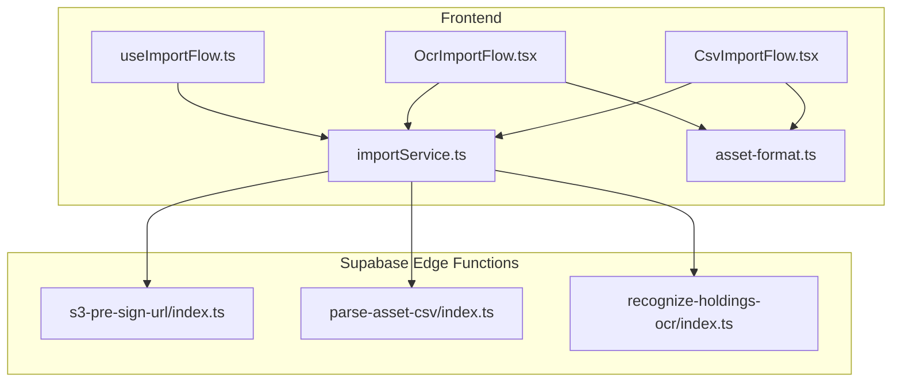
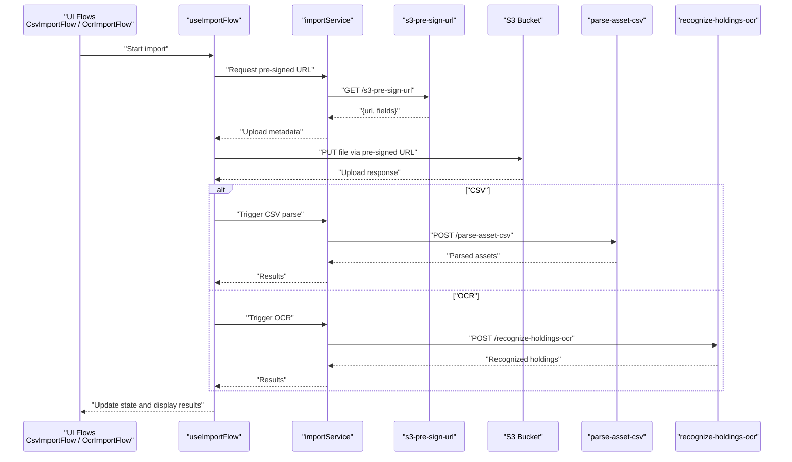
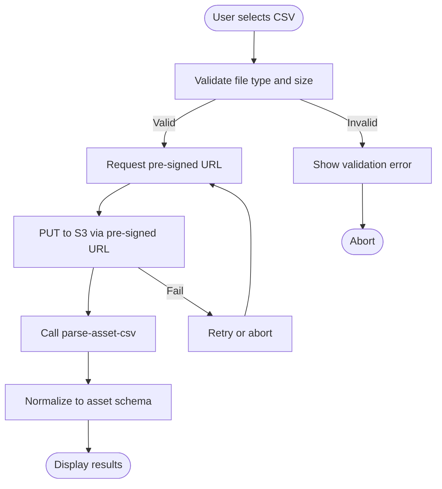
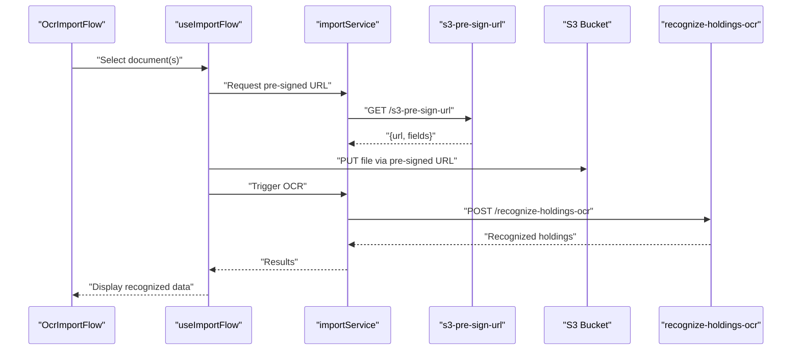
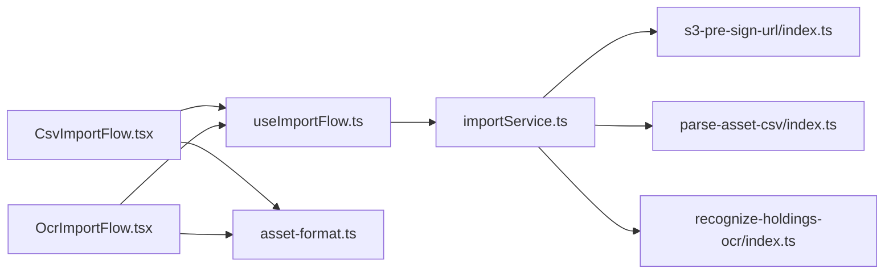

# File Processing API

<cite>
**Referenced Files in This Document**
- [CsvImportFlow.tsx](file://src/components/desktop/import/CsvImportFlow.tsx)
- [OcrImportFlow.tsx](file://src/components/desktop/import/OcrImportFlow.tsx)
- [importService.ts](file://src/services/importService.ts)
- [parse-asset-csv/index.ts](file://supabase/functions/parse-asset-csv/index.ts)
- [recognize-holdings-ocr/index.ts](file://supabase/functions/recognize-holdings-ocr/index.ts)
- [s3-pre-sign-url/index.ts](file://supabase/functions/s3-pre-sign-url/index.ts)
- [useImportFlow.ts](file://src/hooks/useImportFlow.ts)
- [AssetFormat](file://src/lib/asset-format.ts)
</cite>

## Table of Contents
1. [Introduction](#introduction)
2. [Project Structure](#project-structure)
3. [Core Components](#core-components)
4. [Architecture Overview](#architecture-overview)
5. [Detailed Component Analysis](#detailed-component-analysis)
6. [Dependency Analysis](#dependency-analysis)
7. [Performance Considerations](#performance-considerations)
8. [Troubleshooting Guide](#troubleshooting-guide)
9. [Conclusion](#conclusion)

## Introduction
This document describes FinSight’s file processing APIs for:
- CSV import of asset data
- OCR-based recognition of holdings documents
- S3 pre-signed URL generation for direct uploads

It covers upload protocols, supported formats, validation rules, processing pipelines, batch handling, progress tracking, error handling, size limits, format specifications, security considerations, and performance strategies. It also provides implementation examples for large files, multi-document processing, and managing upload states.

## Project Structure
The file processing features span the frontend UI flows, client services, Supabase Edge Functions, and shared utilities:
- Frontend flows orchestrate user interactions and state management for CSV and OCR imports
- Client services call Supabase functions to obtain pre-signed URLs and trigger processing
- Supabase Edge Functions implement parsing, OCR, and S3 integration
- Shared utilities define asset format normalization and helpers

**Diagram sources**
- [CsvImportFlow.tsx](file://src/components/desktop/import/CsvImportFlow.tsx)
- [OcrImportFlow.tsx](file://src/components/desktop/import/OcrImportFlow.tsx)
- [useImportFlow.ts](file://src/hooks/useImportFlow.ts)
- [importService.ts](file://src/services/importService.ts)
- [s3-pre-sign-url/index.ts](file://supabase/functions/s3-pre-sign-url/index.ts)
- [parse-asset-csv/index.ts](file://supabase/functions/parse-asset-csv/index.ts)
- [recognize-holdings-ocr/index.ts](file://supabase/functions/recognize-holdings-ocr/index.ts)
- [AssetFormat](file://src/lib/asset-format.ts)

**Section sources**
- [CsvImportFlow.tsx](file://src/components/desktop/import/CsvImportFlow.tsx)
- [OcrImportFlow.tsx](file://src/components/desktop/import/OcrImportFlow.tsx)
- [useImportFlow.ts](file://src/hooks/useImportFlow.ts)
- [importService.ts](file://src/services/importService.ts)
- [s3-pre-sign-url/index.ts](file://supabase/functions/s3-pre-sign-url/index.ts)
- [parse-asset-csv/index.ts](file://supabase/functions/parse-asset-csv/index.ts)
- [recognize-holdings-ocr/index.ts](file://supabase/functions/recognize-holdings-ocr/index.ts)
- [AssetFormat](file://src/lib/asset-format.ts)

## Core Components
- CSV Import Flow: Guides users through selecting a CSV, validating it, obtaining a pre-signed URL, uploading directly to S3, and triggering server-side parsing.
- OCR Import Flow: Guides users through selecting images/PDFs, obtaining pre-signed URLs, uploading to S3, and invoking OCR processing.
- Pre-signed URL Service: Requests temporary upload credentials from the backend to enable direct S3 uploads without proxying payloads through the app server.
- Asset Format Utilities: Define expected fields and normalization rules used by both CSV parsing and OCR outputs.

Key responsibilities:
- Validate file types and sizes on the client before requesting pre-signed URLs
- Manage upload state (pending, uploading, completed, failed)
- Handle retries and errors with user feedback
- Normalize parsed results into a consistent asset schema

**Section sources**
- [CsvImportFlow.tsx](file://src/components/desktop/import/CsvImportFlow.tsx)
- [OcrImportFlow.tsx](file://src/components/desktop/import/OcrImportFlow.tsx)
- [importService.ts](file://src/services/importService.ts)
- [AssetFormat](file://src/lib/asset-format.ts)

## Architecture Overview
End-to-end flow for file processing:
- Client requests a pre-signed URL from the S3 pre-sign function
- Client uploads the file directly to S3 using the returned URL
- Client triggers the appropriate processing function (CSV parse or OCR)
- Server processes the file and returns structured results
- Client updates UI state and displays results or errors

**Diagram sources**
- [CsvImportFlow.tsx](file://src/components/desktop/import/CsvImportFlow.tsx)
- [OcrImportFlow.tsx](file://src/components/desktop/import/OcrImportFlow.tsx)
- [useImportFlow.ts](file://src/hooks/useImportFlow.ts)
- [importService.ts](file://src/services/importService.ts)
- [s3-pre-sign-url/index.ts](file://supabase/functions/s3-pre-sign-url/index.ts)
- [parse-asset-csv/index.ts](file://supabase/functions/parse-asset-csv/index.ts)
- [recognize-holdings-ocr/index.ts](file://supabase/functions/recognize-holdings-ocr/index.ts)

## Detailed Component Analysis

### CSV Import Pipeline
Responsibilities:
- Accept CSV files and validate headers/content
- Generate pre-signed URL for direct S3 upload
- Trigger server-side CSV parsing and return normalized assets

Processing steps:
- Validate file extension and size
- Request pre-signed URL
- Upload file to S3
- Invoke CSV parse function
- Normalize and present results

**Diagram sources**
- [CsvImportFlow.tsx](file://src/components/desktop/import/CsvImportFlow.tsx)
- [useImportFlow.ts](file://src/hooks/useImportFlow.ts)
- [importService.ts](file://src/services/importService.ts)
- [parse-asset-csv/index.ts](file://supabase/functions/parse-asset-csv/index.ts)
- [AssetFormat](file://src/lib/asset-format.ts)

Supported formats and validation:
- File type: CSV
- Header requirements: Must include required columns as defined by the asset schema
- Size limit: Enforced by client and server; see Security and Limits section

Error handling:
- Client-side validation errors (type, size, missing headers)
- Network/upload failures with retry options
- Server-side parsing errors with descriptive messages

Implementation example paths:
- CSV selection and validation: [CsvImportFlow.tsx](file://src/components/desktop/import/CsvImportFlow.tsx)
- State management and orchestration: [useImportFlow.ts](file://src/hooks/useImportFlow.ts)
- Service calls for pre-sign and parse: [importService.ts](file://src/services/importService.ts)
- Server-side parsing logic: [parse-asset-csv/index.ts](file://supabase/functions/parse-asset-csv/index.ts)

**Section sources**
- [CsvImportFlow.tsx](file://src/components/desktop/import/CsvImportFlow.tsx)
- [useImportFlow.ts](file://src/hooks/useImportFlow.ts)
- [importService.ts](file://src/services/importService.ts)
- [parse-asset-csv/index.ts](file://supabase/functions/parse-asset-csv/index.ts)
- [AssetFormat](file://src/lib/asset-format.ts)

### OCR Document Recognition Pipeline
Responsibilities:
- Accept image or PDF documents
- Generate pre-signed URL for direct S3 upload
- Trigger OCR processing and return recognized holdings

Processing steps:
- Validate file type and size
- Request pre-signed URL
- Upload file to S3
- Invoke OCR function
- Return extracted holdings data

**Diagram sources**
- [OcrImportFlow.tsx](file://src/components/desktop/import/OcrImportFlow.tsx)
- [useImportFlow.ts](file://src/hooks/useImportFlow.ts)
- [importService.ts](file://src/services/importService.ts)
- [s3-pre-sign-url/index.ts](file://supabase/functions/s3-pre-sign-url/index.ts)
- [recognize-holdings-ocr/index.ts](file://supabase/functions/recognize-holdings-ocr/index.ts)

Supported formats and validation:
- File types: Images (e.g., PNG, JPG), PDFs
- Size limit: Enforced by client and server; see Security and Limits section

Error handling:
- Invalid file types or corrupted files
- OCR failures due to low-quality scans
- Network timeouts during upload or processing

Implementation example paths:
- OCR selection and validation: [OcrImportFlow.tsx](file://src/components/desktop/import/OcrImportFlow.tsx)
- Orchestration and state: [useImportFlow.ts](file://src/hooks/useImportFlow.ts)
- Service calls for pre-sign and OCR: [importService.ts](file://src/services/importService.ts)
- Server-side OCR logic: [recognize-holdings-ocr/index.ts](file://supabase/functions/recognize-holdings-ocr/index.ts)

**Section sources**
- [OcrImportFlow.tsx](file://src/components/desktop/import/OcrImportFlow.tsx)
- [useImportFlow.ts](file://src/hooks/useImportFlow.ts)
- [importService.ts](file://src/services/importService.ts)
- [recognize-holdings-ocr/index.ts](file://supabase/functions/recognize-holdings-ocr/index.ts)

### S3 Pre-Signed URL Generation
Responsibilities:
- Issue short-lived, scoped upload URLs for direct S3 PUT operations
- Enforce bucket policies and access controls on the server side

Security considerations:
- Short expiration windows
- Scoped to specific keys and content types
- Signed with server-side secrets not exposed to clients

Implementation example paths:
- Pre-signed URL endpoint: [s3-pre-sign-url/index.ts](file://supabase/functions/s3-pre-sign-url/index.ts)

**Section sources**
- [s3-pre-sign-url/index.ts](file://supabase/functions/s3-pre-sign-url/index.ts)

### Asset Format Normalization
Responsibilities:
- Define canonical asset fields and constraints
- Ensure consistency across CSV and OCR outputs

Normalization rules:
- Field names and types
- Required vs optional fields
- Currency and numeric formatting

Implementation example paths:
- Asset format definitions: [AssetFormat](file://src/lib/asset-format.ts)

**Section sources**
- [AssetFormat](file://src/lib/asset-format.ts)

## Dependency Analysis
Component relationships:
- UI flows depend on hooks and services
- Services depend on Supabase Edge Functions
- Edge Functions depend on external services (S3, OCR providers)

**Diagram sources**
- [CsvImportFlow.tsx](file://src/components/desktop/import/CsvImportFlow.tsx)
- [OcrImportFlow.tsx](file://src/components/desktop/import/OcrImportFlow.tsx)
- [useImportFlow.ts](file://src/hooks/useImportFlow.ts)
- [importService.ts](file://src/services/importService.ts)
- [s3-pre-sign-url/index.ts](file://supabase/functions/s3-pre-sign-url/index.ts)
- [parse-asset-csv/index.ts](file://supabase/functions/parse-asset-csv/index.ts)
- [recognize-holdings-ocr/index.ts](file://supabase/functions/recognize-holdings-ocr/index.ts)
- [AssetFormat](file://src/lib/asset-format.ts)

**Section sources**
- [CsvImportFlow.tsx](file://src/components/desktop/import/CsvImportFlow.tsx)
- [OcrImportFlow.tsx](file://src/components/desktop/import/OcrImportFlow.tsx)
- [useImportFlow.ts](file://src/hooks/useImportFlow.ts)
- [importService.ts](file://src/services/importService.ts)
- [s3-pre-sign-url/index.ts](file://supabase/functions/s3-pre-sign-url/index.ts)
- [parse-asset-csv/index.ts](file://supabase/functions/parse-asset-csv/index.ts)
- [recognize-holdings-ocr/index.ts](file://supabase/functions/recognize-holdings-ocr/index.ts)
- [AssetFormat](file://src/lib/asset-format.ts)

## Performance Considerations
- Use pre-signed URLs to avoid routing large files through the application server
- Implement chunked uploads for very large files if needed
- Enable compression where applicable (e.g., PDFs)
- Parallelize independent uploads in batch mode
- Cache pre-signed URLs within their validity window
- Optimize OCR by limiting resolution and removing unnecessary pages
- Add progress indicators and incremental state updates

[No sources needed since this section provides general guidance]

## Troubleshooting Guide
Common issues and resolutions:
- Validation errors: Check file type, size, and CSV headers against schema
- Upload failures: Verify network connectivity, CORS settings, and pre-signed URL validity
- Parsing errors: Inspect CSV structure and field mappings
- OCR failures: Improve scan quality, ensure readable text, and verify supported formats
- Rate limits: Back off and retry with exponential delay

Implementation example paths:
- Error handling in flows and services: [CsvImportFlow.tsx](file://src/components/desktop/import/CsvImportFlow.tsx), [OcrImportFlow.tsx](file://src/components/desktop/import/OcrImportFlow.tsx), [useImportFlow.ts](file://src/hooks/useImportFlow.ts), [importService.ts](file://src/services/importService.ts)

**Section sources**
- [CsvImportFlow.tsx](file://src/components/desktop/import/CsvImportFlow.tsx)
- [OcrImportFlow.tsx](file://src/components/desktop/import/OcrImportFlow.tsx)
- [useImportFlow.ts](file://src/hooks/useImportFlow.ts)
- [importService.ts](file://src/services/importService.ts)

## Conclusion
FinSight’s file processing APIs provide a robust pipeline for CSV import and OCR recognition backed by secure S3 pre-signed uploads. The architecture separates concerns between UI flows, orchestration hooks, service calls, and server-side processing, enabling scalability and maintainability. By following the validation rules, security practices, and performance strategies outlined here, developers can implement reliable, user-friendly file processing experiences.

[No sources needed since this section summarizes without analyzing specific files]