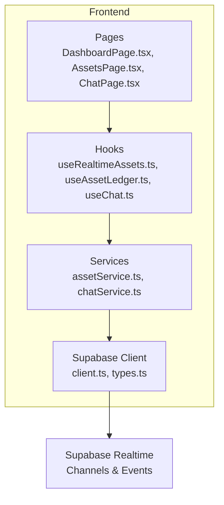
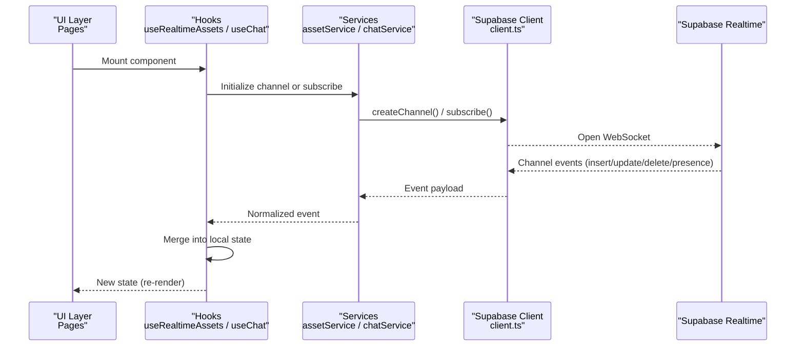
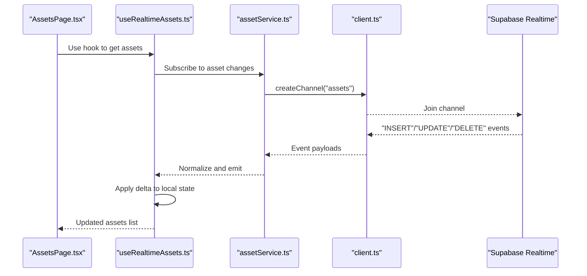
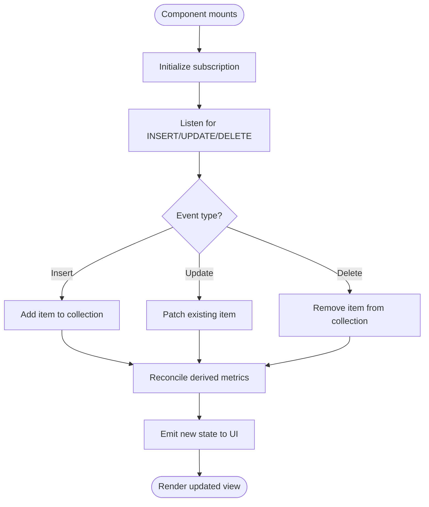
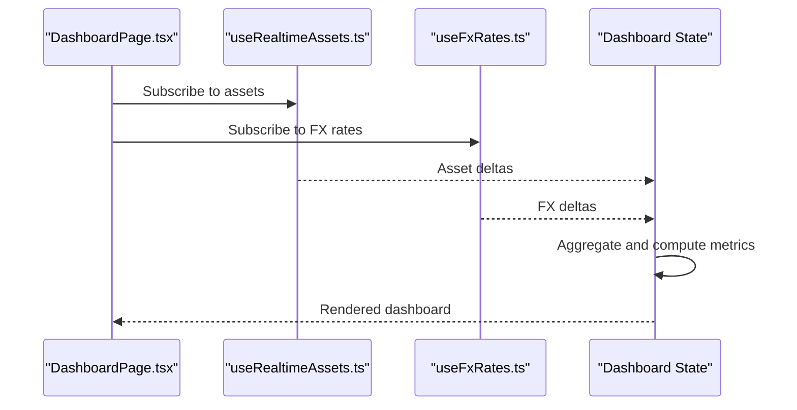
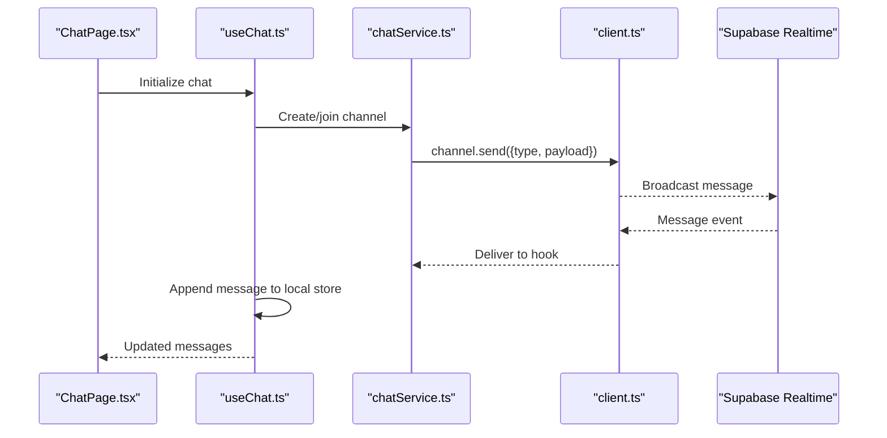
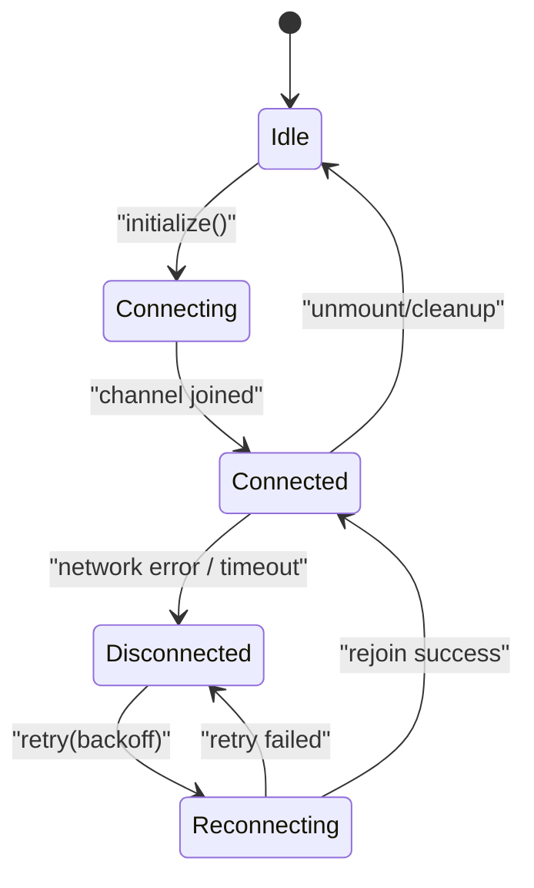
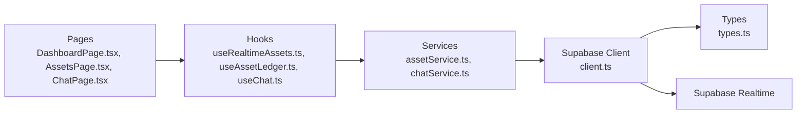

# Real-time APIs

<cite>
**Referenced Files in This Document**
- [useRealtimeAssets.ts](file://src/hooks/useRealtimeAssets.ts)
- [client.ts](file://src/integrations/supabase/client.ts)
- [types.ts](file://src/integrations/supabase/types.ts)
- [useAssetLedger.ts](file://src/hooks/useAssetLedger.ts)
- [assetService.ts](file://src/services/assetService.ts)
- [useChat.ts](file://src/hooks/useChat.ts)
- [chatService.ts](file://src/services/chatService.ts)
- [DashboardPage.tsx](file://src/pages/desktop/DashboardPage.tsx)
- [AssetsPage.tsx](file://src/pages/desktop/AssetsPage.tsx)
- [ChatPage.tsx](file://src/pages/desktop/ChatPage.tsx)
- [AppLayout.tsx](file://src/layouts/desktop/AppLayout.tsx)
- [index.html](file://index.html)
</cite>

## Table of Contents
1. [Introduction](#introduction)
2. [Project Structure](#project-structure)
3. [Core Components](#core-components)
4. [Architecture Overview](#architecture-overview)
5. [Detailed Component Analysis](#detailed-component-analysis)
6. [Dependency Analysis](#dependency-analysis)
7. [Performance Considerations](#performance-considerations)
8. [Troubleshooting Guide](#troubleshooting-guide)
9. [Conclusion](#conclusion)
10. [Appendices](#appendices)

## Introduction
This document explains FinSight’s real-time APIs and WebSocket connections, focusing on:
- Real-time asset updates and portfolio synchronization
- Live dashboard updates
- Collaborative features (e.g., chat)
- Supabase real-time subscriptions, connection management, event handling, and state synchronization patterns
- Connection lifecycle management, error recovery strategies, offline support, and performance optimization techniques
- Implementation examples for subscribing to asset changes, handling real-time notifications, and managing concurrent updates across multiple clients

The goal is to provide both a high-level understanding and actionable guidance for implementing robust real-time experiences in the application.

## Project Structure
FinSight organizes real-time functionality around hooks and services that integrate with Supabase:
- Hooks encapsulate subscription lifecycles and state synchronization
- Services abstract client calls and channel operations
- Pages consume hooks to render live UIs
- The Supabase client is configured centrally and typed for safety

**Diagram sources**
- [DashboardPage.tsx](file://src/pages/desktop/DashboardPage.tsx)
- [AssetsPage.tsx](file://src/pages/desktop/AssetsPage.tsx)
- [ChatPage.tsx](file://src/pages/desktop/ChatPage.tsx)
- [useRealtimeAssets.ts](file://src/hooks/useRealtimeAssets.ts)
- [useAssetLedger.ts](file://src/hooks/useAssetLedger.ts)
- [useChat.ts](file://src/hooks/useChat.ts)
- [assetService.ts](file://src/services/assetService.ts)
- [chatService.ts](file://src/services/chatService.ts)
- [client.ts](file://src/integrations/supabase/client.ts)
- [types.ts](file://src/integrations/supabase/types.ts)

**Section sources**
- [client.ts](file://src/integrations/supabase/client.ts)
- [types.ts](file://src/integrations/supabase/types.ts)
- [useRealtimeAssets.ts](file://src/hooks/useRealtimeAssets.ts)
- [useAssetLedger.ts](file://src/hooks/useAssetLedger.ts)
- [useChat.ts](file://src/hooks/useChat.ts)
- [assetService.ts](file://src/services/assetService.ts)
- [chatService.ts](file://src/services/chatService.ts)
- [DashboardPage.tsx](file://src/pages/desktop/DashboardPage.tsx)
- [AssetsPage.tsx](file://src/pages/desktop/AssetsPage.tsx)
- [ChatPage.tsx](file://src/pages/desktop/ChatPage.tsx)

## Core Components
- Supabase client initialization and typing
  - Centralized client configuration and typed database schema are used by all real-time features.
- Real-time assets hook
  - Manages subscriptions to asset table changes and synchronizes local state for dashboards and lists.
- Asset ledger hook
  - Coordinates asset data access and may coordinate with real-time updates for consistent views.
- Chat hook and service
  - Implements collaborative messaging using channels and events.
- Page consumers
  - Dashboard, Assets, and Chat pages subscribe to hooks to render live content.

Key responsibilities:
- Subscribe/unsubscribe to Supabase channels
- Handle insert/update/delete events
- Merge server deltas into local state
- Manage reconnection and backoff
- Provide stable interfaces to UI components

**Section sources**
- [client.ts](file://src/integrations/supabase/client.ts)
- [types.ts](file://src/integrations/supabase/types.ts)
- [useRealtimeAssets.ts](file://src/hooks/useRealtimeAssets.ts)
- [useAssetLedger.ts](file://src/hooks/useAssetLedger.ts)
- [useChat.ts](file://src/hooks/useChat.ts)
- [chatService.ts](file://src/services/chatService.ts)
- [assetService.ts](file://src/services/assetService.ts)
- [DashboardPage.tsx](file://src/pages/desktop/DashboardPage.tsx)
- [AssetsPage.tsx](file://src/pages/desktop/AssetsPage.tsx)
- [ChatPage.tsx](file://src/pages/desktop/ChatPage.tsx)

## Architecture Overview
The real-time architecture follows a layered pattern:
- UI layers (pages) depend on hooks
- Hooks orchestrate subscriptions and state sync
- Services wrap Supabase client calls and channel operations
- Supabase Realtime provides WebSocket-based pub/sub over database events and custom channels

**Diagram sources**
- [useRealtimeAssets.ts](file://src/hooks/useRealtimeAssets.ts)
- [useChat.ts](file://src/hooks/useChat.ts)
- [assetService.ts](file://src/services/assetService.ts)
- [chatService.ts](file://src/services/chatService.ts)
- [client.ts](file://src/integrations/supabase/client.ts)

## Detailed Component Analysis

### Real-time Assets Subscription Flow
This flow shows how asset changes propagate from the database to the UI via Supabase Realtime.

Implementation notes:
- Subscribe once per feature scope; unsubscribe on unmount
- Deduplicate events if necessary
- Maintain optimistic UI where appropriate

**Diagram sources**
- [AssetsPage.tsx](file://src/pages/desktop/AssetsPage.tsx)
- [useRealtimeAssets.ts](file://src/hooks/useRealtimeAssets.ts)
- [assetService.ts](file://src/services/assetService.ts)
- [client.ts](file://src/integrations/supabase/client.ts)

**Section sources**
- [useRealtimeAssets.ts](file://src/hooks/useRealtimeAssets.ts)
- [assetService.ts](file://src/services/assetService.ts)
- [AssetsPage.tsx](file://src/pages/desktop/AssetsPage.tsx)
- [client.ts](file://src/integrations/supabase/client.ts)

### Portfolio Synchronization Pattern
Portfolio views rely on consistent state derived from real-time events.

Best practices:
- Keep a canonical map keyed by unique IDs
- Batch merges when possible
- Recompute aggregates only when relevant fields change

**Diagram sources**
- [useRealtimeAssets.ts](file://src/hooks/useRealtimeAssets.ts)
- [useAssetLedger.ts](file://src/hooks/useAssetLedger.ts)

**Section sources**
- [useAssetLedger.ts](file://src/hooks/useAssetLedger.ts)
- [useRealtimeAssets.ts](file://src/hooks/useRealtimeAssets.ts)

### Live Dashboard Updates
Dashboards aggregate multiple real-time streams (e.g., assets, FX rates). The pattern:
- Subscribe to each stream independently
- Normalize and merge into a single dashboard state
- Debounce heavy computations

**Diagram sources**
- [DashboardPage.tsx](file://src/pages/desktop/DashboardPage.tsx)
- [useRealtimeAssets.ts](file://src/hooks/useRealtimeAssets.ts)

**Section sources**
- [DashboardPage.tsx](file://src/pages/desktop/DashboardPage.tsx)
- [useRealtimeAssets.ts](file://src/hooks/useRealtimeAssets.ts)

### Collaborative Features (Chat)
Collaboration uses channels and presence-like patterns for multi-client coordination.

Considerations:
- Ensure idempotent message handling
- Order messages by server timestamp
- Handle user presence and read receipts if needed

**Diagram sources**
- [ChatPage.tsx](file://src/pages/desktop/ChatPage.tsx)
- [useChat.ts](file://src/hooks/useChat.ts)
- [chatService.ts](file://src/services/chatService.ts)
- [client.ts](file://src/integrations/supabase/client.ts)

**Section sources**
- [useChat.ts](file://src/hooks/useChat.ts)
- [chatService.ts](file://src/services/chatService.ts)
- [ChatPage.tsx](file://src/pages/desktop/ChatPage.tsx)
- [client.ts](file://src/integrations/supabase/client.ts)

### Connection Lifecycle Management
A robust lifecycle includes:
- Initialization: configure client, set auth headers if required
- Subscription: join channels, attach listeners
- Monitoring: track connection status and errors
- Recovery: exponential backoff, retry policies
- Cleanup: remove listeners, leave channels, release resources

Guidelines:
- Use a central manager to avoid duplicate subscriptions
- Persist last known state to recover after reconnect
- Surface connection status to UI for feedback

**Diagram sources**
- [client.ts](file://src/integrations/supabase/client.ts)
- [useRealtimeAssets.ts](file://src/hooks/useRealtimeAssets.ts)
- [useChat.ts](file://src/hooks/useChat.ts)

**Section sources**
- [client.ts](file://src/integrations/supabase/client.ts)
- [useRealtimeAssets.ts](file://src/hooks/useRealtimeAssets.ts)
- [useChat.ts](file://src/hooks/useChat.ts)

### Error Handling and Offline Support
Patterns:
- Network error detection and automatic reconnection
- Queue mutations while offline and replay on reconnect
- Conflict resolution using server timestamps and idempotency keys
- Graceful degradation: show cached data and “syncing” indicators

Recommendations:
- Wrap channel subscriptions in try/catch with fallbacks
- Implement exponential backoff with jitter
- Persist pending writes locally and reconcile on reconnect

[No sources needed since this section provides general guidance]

### Performance Optimization Techniques
- Prefer row-level subscriptions and filters to reduce payload size
- Coalesce frequent updates (debounce/throttle) before UI re-renders
- Memoize derived values and avoid unnecessary recalculations
- Use virtualization for large lists
- Limit channel count per page; share subscriptions via context or a global manager

[No sources needed since this section provides general guidance]

## Dependency Analysis
High-level dependencies between modules involved in real-time features:

**Diagram sources**
- [DashboardPage.tsx](file://src/pages/desktop/DashboardPage.tsx)
- [AssetsPage.tsx](file://src/pages/desktop/AssetsPage.tsx)
- [ChatPage.tsx](file://src/pages/desktop/ChatPage.tsx)
- [useRealtimeAssets.ts](file://src/hooks/useRealtimeAssets.ts)
- [useAssetLedger.ts](file://src/hooks/useAssetLedger.ts)
- [useChat.ts](file://src/hooks/useChat.ts)
- [assetService.ts](file://src/services/assetService.ts)
- [chatService.ts](file://src/services/chatService.ts)
- [client.ts](file://src/integrations/supabase/client.ts)
- [types.ts](file://src/integrations/supabase/types.ts)

**Section sources**
- [client.ts](file://src/integrations/supabase/client.ts)
- [types.ts](file://src/integrations/supabase/types.ts)
- [useRealtimeAssets.ts](file://src/hooks/useRealtimeAssets.ts)
- [useAssetLedger.ts](file://src/hooks/useAssetLedger.ts)
- [useChat.ts](file://src/hooks/useChat.ts)
- [assetService.ts](file://src/services/assetService.ts)
- [chatService.ts](file://src/services/chatService.ts)
- [DashboardPage.tsx](file://src/pages/desktop/DashboardPage.tsx)
- [AssetsPage.tsx](file://src/pages/desktop/AssetsPage.tsx)
- [ChatPage.tsx](file://src/pages/desktop/ChatPage.tsx)

## Performance Considerations
- Minimize channel scope: filter by tenant/user/portfolio to reduce traffic
- Batch and coalesce updates to prevent excessive renders
- Compute aggregates lazily and cache results
- Avoid deep object cloning; prefer immutable patches
- Monitor memory usage and ensure proper cleanup on unmount

[No sources needed since this section provides general guidance]

## Troubleshooting Guide
Common issues and resolutions:
- No events received
  - Verify channel name and filters
  - Check authentication and RLS policies
  - Inspect browser network tab for WebSocket frames
- Duplicate or out-of-order events
  - Enforce ordering by server timestamp
  - De-duplicate by unique ID
- Frequent disconnects
  - Increase backoff caps and add jitter
  - Validate server-side rate limits
- High CPU during updates
  - Debounce UI updates
  - Optimize selectors and memoization

Operational checks:
- Confirm client initialization and environment variables
- Ensure index.html loads the app bundle correctly
- Review AppLayout for global providers that might affect subscriptions

**Section sources**
- [client.ts](file://src/integrations/supabase/client.ts)
- [index.html](file://index.html)
- [AppLayout.tsx](file://src/layouts/desktop/AppLayout.tsx)

## Conclusion
FinSight’s real-time layer combines Supabase Realtime with well-structured hooks and services to deliver live asset updates, synchronized portfolios, responsive dashboards, and collaborative features. By following the lifecycle, error recovery, and performance guidelines outlined here, teams can build resilient real-time experiences that scale across multiple clients and maintain consistency under varying network conditions.

[No sources needed since this section summarizes without analyzing specific files]

## Appendices

### Implementation Examples

- Subscribing to asset changes
  - Use the assets hook to subscribe and receive normalized updates
  - Reference: [useRealtimeAssets.ts](file://src/hooks/useRealtimeAssets.ts)

- Handling real-time notifications
  - Extend the chat hook/service to broadcast and listen for notification events
  - References: [useChat.ts](file://src/hooks/useChat.ts), [chatService.ts](file://src/services/chatService.ts)

- Managing concurrent updates across multiple clients
  - Maintain a canonical map keyed by IDs, apply server timestamps, and resolve conflicts deterministically
  - References: [useAssetLedger.ts](file://src/hooks/useAssetLedger.ts), [useRealtimeAssets.ts](file://src/hooks/useRealtimeAssets.ts)

- Consuming real-time data in pages
  - Dashboard, Assets, and Chat pages demonstrate integration points
  - References: [DashboardPage.tsx](file://src/pages/desktop/DashboardPage.tsx), [AssetsPage.tsx](file://src/pages/desktop/AssetsPage.tsx), [ChatPage.tsx](file://src/pages/desktop/ChatPage.tsx)