# Architecture Overview

<cite>
**Referenced Files in This Document**
- [App.tsx](file://src/App.tsx)
- [main.tsx](file://src/main.tsx)
- [vite.config.ts](file://vite.config.ts)
- [tailwind.config.js](file://tailwind.config.js)
- [components.json](file://components.json)
- [client.ts](file://src/integrations/supabase/client.ts)
- [types.ts](file://src/integrations/supabase/types.ts)
- [useAuthGuard.ts](file://src/hooks/useAuthGuard.ts)
- [useAssetLedger.ts](file://src/hooks/useAssetLedger.ts)
- [useRealtimeAssets.ts](file://src/hooks/useRealtimeAssets.ts)
- [useChat.ts](file://src/hooks/useChat.ts)
- [useFxRates.ts](file://src/hooks/useFxRates.ts)
- [useImportFlow.ts](file://src/hooks/useImportFlow.ts)
- [useProfile.ts](file://src/hooks/useProfile.ts)
- [useShareReports.ts](file://src/hooks/useShareReports.ts)
- [useStress.ts](file://src/hooks/useStress.ts)
- [useXray.ts](file://src/hooks/useXray.ts)
- [assetService.ts](file://src/services/assetService.ts)
- [authService.ts](file://src/services/authService.ts)
- [chatService.ts](file://src/services/chatService.ts)
- [fxService.ts](file://src/services/fxService.ts)
- [importService.ts](file://src/services/importService.ts)
- [profileService.ts](file://src/services/profileService.ts)
- [reportService.ts](file://src/services/reportService.ts)
- [stressService.ts](file://src/services/stressService.ts)
- [xrayService.ts](file://src/services/xrayService.ts)
- [AuthGate.tsx](file://src/components/desktop/AuthGate.tsx)
- [DashboardPage.tsx](file://src/pages/desktop/DashboardPage.tsx)
- [AssetsPage.tsx](file://src/pages/desktop/AssetsPage.tsx)
- [ChatPage.tsx](file://src/pages/desktop/ChatPage.tsx)
- [ImportPage.tsx](file://src/pages/desktop/ImportPage.tsx)
- [SharedReportPage.tsx](file://src/pages/desktop/SharedReportPage.tsx)
- [StressTestPage.tsx](file://src/pages/desktop/StressTestPage.tsx)
- [XRayPage.tsx](file://src/pages/desktop/XRayPage.tsx)
- [index.ts (ai-doctor-chat)](file://supabase/functions/ai-doctor-chat/index.ts)
- [index.ts (compute-xray-report)](file://supabase/functions/compute-xray-report/index.ts)
- [index.ts (create-shared-report)](file://supabase/functions/create-shared-report/index.ts)
- [index.ts (get-fx-rates)](file://supabase/functions/get-fx-rates/index.ts)
- [index.ts (parse-asset-csv)](file://supabase/functions/parse-asset-csv/index.ts)
- [index.ts (read-shared-report)](file://supabase/functions/read-shared-report/index.ts)
- [index.ts (recognize-holdings-ocr)](file://supabase/functions/recognize-holdings-ocr/index.ts)
- [index.ts (run-stress-test)](file://supabase/functions/run-stress-test/index.ts)
- [index.ts (s3-pre-sign-url)](file://supabase/functions/s3-pre-sign-url/index.ts)
- [index.ts (seed-demo-portfolio)](file://supabase/functions/seed-demo-portfolio/index.ts)
</cite>

## Table of Contents
1. Introduction
2. Project Structure
3. Core Components
4. Architecture Overview
5. Detailed Component Analysis
6. Dependency Analysis
7. Performance Considerations
8. Troubleshooting Guide
9. Conclusion

## Introduction
FinSight is a modern financial analytics application built with a React 18+ frontend and Supabase-backed services. The system follows a modular, component-based architecture with hook-centric state management and a clear separation between presentation components, business logic hooks, and data access services. It leverages TypeScript for end-to-end type safety, Vite for fast builds, Tailwind CSS for styling, and Supabase Edge Functions for serverless business operations.

The design emphasizes:
- Service-oriented architecture with thin UI layers and robust backend functions
- Clean separation of concerns across presentation, logic, and data access
- Type-safe data flow from UI to services to Supabase Edge Functions
- Real-time capabilities and secure authentication via Supabase

## Project Structure
The repository is organized by feature and layer:
- src/components: Reusable UI primitives and desktop-specific components
- src/hooks: Hook-centric business logic and state orchestration
- src/services: Data access layer encapsulating calls to Supabase client and Edge Functions
- src/pages: Feature pages composing components and hooks
- src/integrations/supabase: Supabase client configuration and shared types
- supabase/functions: Serverless Edge Functions implementing core business logic
- Configuration files at the root define build, styling, and project metadata

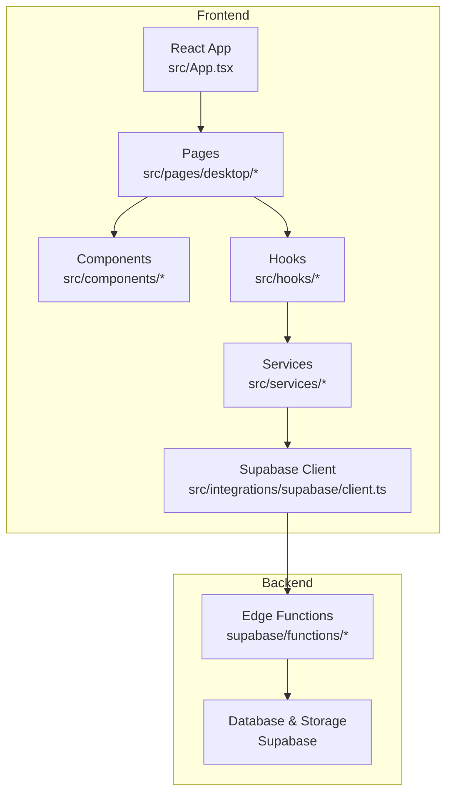

**Diagram sources**
- [App.tsx](file://src/App.tsx)
- [DashboardPage.tsx](file://src/pages/desktop/DashboardPage.tsx)
- [AuthGate.tsx](file://src/components/desktop/AuthGate.tsx)
- [useAuthGuard.ts](file://src/hooks/useAuthGuard.ts)
- [assetService.ts](file://src/services/assetService.ts)
- [client.ts](file://src/integrations/supabase/client.ts)
- [index.ts (parse-asset-csv)](file://supabase/functions/parse-asset-csv/index.ts)

**Section sources**
- [App.tsx](file://src/App.tsx)
- [main.tsx](file://src/main.tsx)
- [vite.config.ts](file://vite.config.ts)
- [tailwind.config.js](file://tailwind.config.js)
- [components.json](file://components.json)

## Core Components
FinSight’s frontend is structured around three primary layers:

- Presentation Layer (UI):
  - Pages compose domain features using reusable UI components and hooks
  - Desktop-specific components provide advanced UX patterns and dialogs
  - Shared UI primitives under src/components/ui ensure consistent design tokens

- Business Logic Layer (Hooks):
  - Hooks encapsulate stateful behavior, side effects, and orchestration
  - Examples include authentication guard, asset ledger, real-time assets, chat, FX rates, import flow, profile, share reports, stress tests, and X-ray analysis

- Data Access Layer (Services):
  - Services abstract all interactions with Supabase client and Edge Functions
  - They normalize payloads, handle errors, and expose typed APIs to hooks

This separation ensures that UI remains focused on rendering, while business rules and data flows are centralized and testable.

**Section sources**
- [useAuthGuard.ts](file://src/hooks/useAuthGuard.ts)
- [useAssetLedger.ts](file://src/hooks/useAssetLedger.ts)
- [useRealtimeAssets.ts](file://src/hooks/useRealtimeAssets.ts)
- [useChat.ts](file://src/hooks/useChat.ts)
- [useFxRates.ts](file://src/hooks/useFxRates.ts)
- [useImportFlow.ts](file://src/hooks/useImportFlow.ts)
- [useProfile.ts](file://src/hooks/useProfile.ts)
- [useShareReports.ts](file://src/hooks/useShareReports.ts)
- [useStress.ts](file://src/hooks/useStress.ts)
- [useXray.ts](file://src/hooks/useXray.ts)
- [assetService.ts](file://src/services/assetService.ts)
- [authService.ts](file://src/services/authService.ts)
- [chatService.ts](file://src/services/chatService.ts)
- [fxService.ts](file://src/services/fxService.ts)
- [importService.ts](file://src/services/importService.ts)
- [profileService.ts](file://src/services/profileService.ts)
- [reportService.ts](file://src/services/reportService.ts)
- [stressService.ts](file://src/services/stressService.ts)
- [xrayService.ts](file://src/services/xrayService.ts)

## Architecture Overview
The FinSight system combines a React frontend with Supabase backend services. The frontend uses Vite for development and builds, Tailwind CSS for styling, and TypeScript for type safety. The backend exposes Edge Functions for serverless computation and integrates with Supabase’s database and storage.

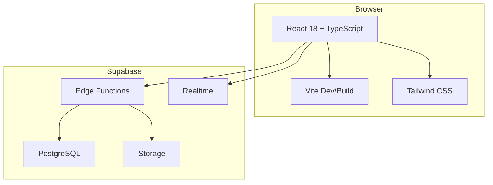

**Diagram sources**
- [vite.config.ts](file://vite.config.ts)
- [tailwind.config.js](file://tailwind.config.js)
- [client.ts](file://src/integrations/supabase/client.ts)
- [index.ts (get-fx-rates)](file://supabase/functions/get-fx-rates/index.ts)

Technology stack decisions:
- React 18+: Enables concurrent features and improved performance
- TypeScript: Ensures type safety across UI, hooks, services, and API contracts
- Vite: Fast dev server and optimized production builds
- Tailwind CSS: Utility-first styling with consistent design tokens
- Supabase: Auth, database, storage, real-time, and Edge Functions for serverless logic

**Section sources**
- [vite.config.ts](file://vite.config.ts)
- [tailwind.config.js](file://tailwind.config.js)
- [client.ts](file://src/integrations/supabase/client.ts)
- [types.ts](file://src/integrations/supabase/types.ts)

## Detailed Component Analysis

### Authentication Flow
Authentication is enforced through an auth guard hook and a dedicated gate component. The flow ensures users must be authenticated before accessing protected routes or features.

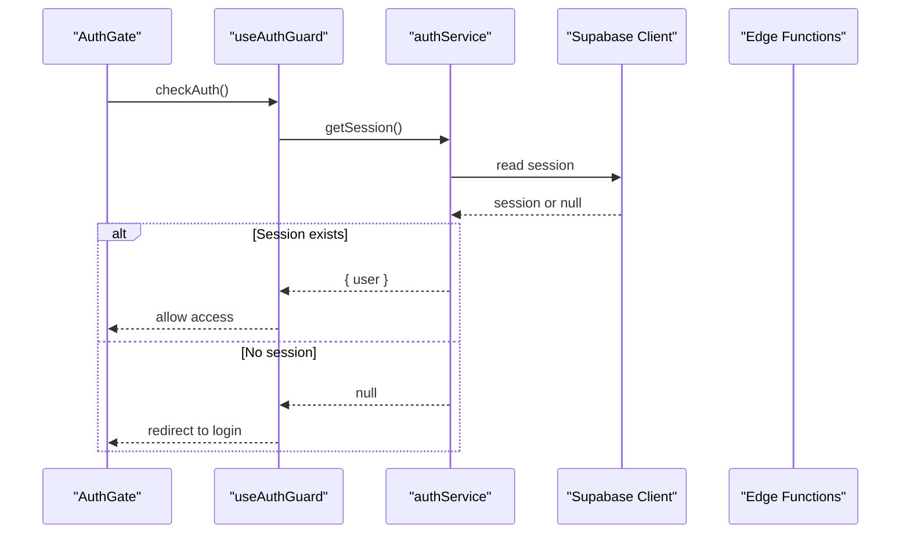

**Diagram sources**
- [AuthGate.tsx](file://src/components/desktop/AuthGate.tsx)
- [useAuthGuard.ts](file://src/hooks/useAuthGuard.ts)
- [authService.ts](file://src/services/authService.ts)
- [client.ts](file://src/integrations/supabase/client.ts)

**Section sources**
- [AuthGate.tsx](file://src/components/desktop/AuthGate.tsx)
- [useAuthGuard.ts](file://src/hooks/useAuthGuard.ts)
- [authService.ts](file://src/services/authService.ts)

### Asset Ledger Management
The asset ledger hook orchestrates CRUD operations and real-time updates for assets. It composes multiple services and manages local state for UI responsiveness.

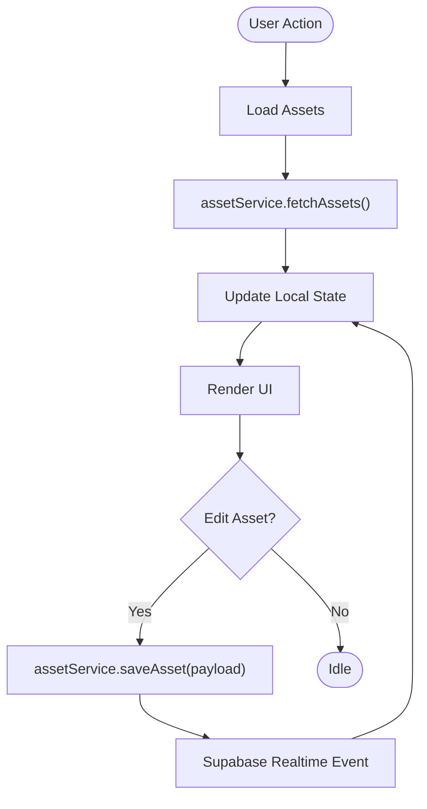

**Diagram sources**
- [useAssetLedger.ts](file://src/hooks/useAssetLedger.ts)
- [assetService.ts](file://src/services/assetService.ts)
- [useRealtimeAssets.ts](file://src/hooks/useRealtimeAssets.ts)
- [client.ts](file://src/integrations/supabase/client.ts)

**Section sources**
- [useAssetLedger.ts](file://src/hooks/useAssetLedger.ts)
- [assetService.ts](file://src/services/assetService.ts)
- [useRealtimeAssets.ts](file://src/hooks/useRealtimeAssets.ts)

### Chat Interaction
The chat feature uses a hook to manage conversation state and a service to call the AI doctor chat Edge Function.

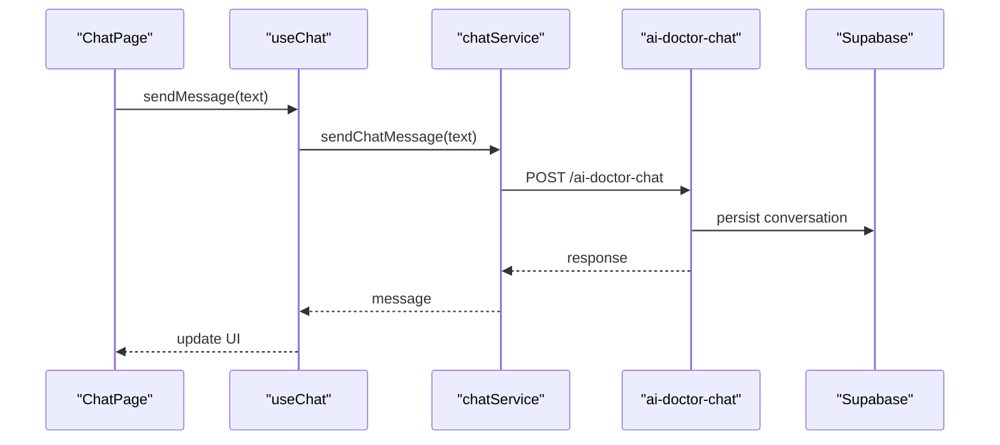

**Diagram sources**
- [ChatPage.tsx](file://src/pages/desktop/ChatPage.tsx)
- [useChat.ts](file://src/hooks/useChat.ts)
- [chatService.ts](file://src/services/chatService.ts)
- [index.ts (ai-doctor-chat)](file://supabase/functions/ai-doctor-chat/index.ts)

**Section sources**
- [ChatPage.tsx](file://src/pages/desktop/ChatPage.tsx)
- [useChat.ts](file://src/hooks/useChat.ts)
- [chatService.ts](file://src/services/chatService.ts)
- [index.ts (ai-doctor-chat)](file://supabase/functions/ai-doctor-chat/index.ts)

### FX Rates Retrieval
FX rates are fetched via a service calling the get-fx-rates Edge Function, which returns normalized currency data used across the app.

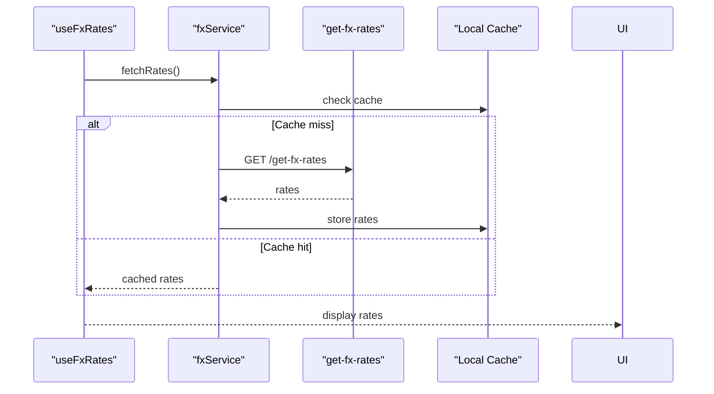

**Diagram sources**
- [useFxRates.ts](file://src/hooks/useFxRates.ts)
- [fxService.ts](file://src/services/fxService.ts)
- [index.ts (get-fx-rates)](file://supabase/functions/get-fx-rates/index.ts)

**Section sources**
- [useFxRates.ts](file://src/hooks/useFxRates.ts)
- [fxService.ts](file://src/services/fxService.ts)
- [index.ts (get-fx-rates)](file://supabase/functions/get-fx-rates/index.ts)

### Import Flow
The import flow supports CSV parsing and OCR recognition via Edge Functions, with review and validation steps before committing to the database.

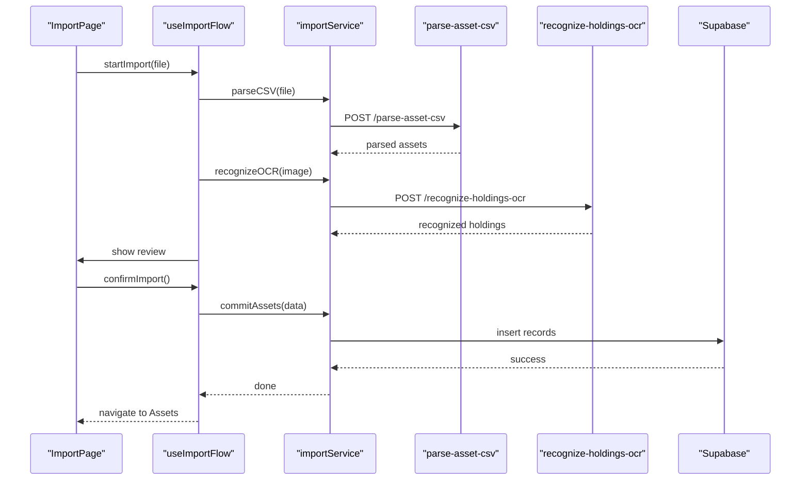

**Diagram sources**
- [ImportPage.tsx](file://src/pages/desktop/ImportPage.tsx)
- [useImportFlow.ts](file://src/hooks/useImportFlow.ts)
- [importService.ts](file://src/services/importService.ts)
- [index.ts (parse-asset-csv)](file://supabase/functions/parse-asset-csv/index.ts)
- [index.ts (recognize-holdings-ocr)](file://supabase/functions/recognize-holdings-ocr/index.ts)

**Section sources**
- [ImportPage.tsx](file://src/pages/desktop/ImportPage.tsx)
- [useImportFlow.ts](file://src/hooks/useImportFlow.ts)
- [importService.ts](file://src/services/importService.ts)
- [index.ts (parse-asset-csv)](file://supabase/functions/parse-asset-csv/index.ts)
- [index.ts (recognize-holdings-ocr)](file://supabase/functions/recognize-holdings-ocr/index.ts)

### Stress Test Execution
Stress testing is orchestrated by a hook that triggers the run-stress-test Edge Function and displays results.

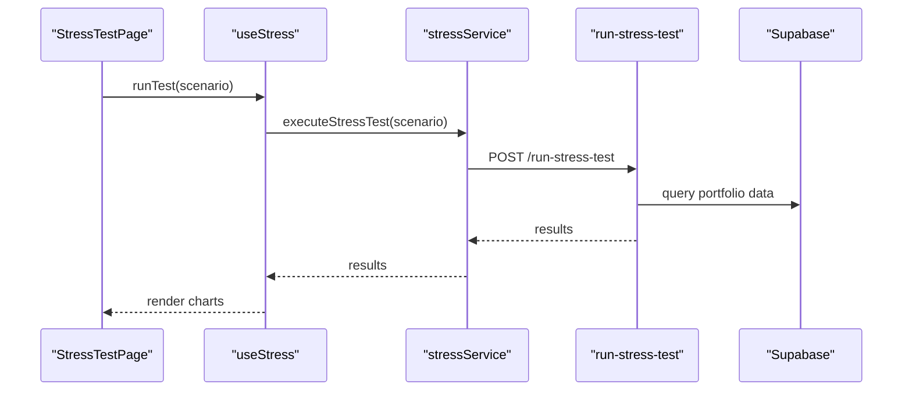

**Diagram sources**
- [StressTestPage.tsx](file://src/pages/desktop/StressTestPage.tsx)
- [useStress.ts](file://src/hooks/useStress.ts)
- [stressService.ts](file://src/services/stressService.ts)
- [index.ts (run-stress-test)](file://supabase/functions/run-stress-test/index.ts)

**Section sources**
- [StressTestPage.tsx](file://src/pages/desktop/StressTestPage.tsx)
- [useStress.ts](file://src/hooks/useStress.ts)
- [stressService.ts](file://src/services/stressService.ts)
- [index.ts (run-stress-test)](file://supabase/functions/run-stress-test/index.ts)

### X-Ray Report Generation
X-ray analysis computes detailed insights via an Edge Function and presents findings in the UI.

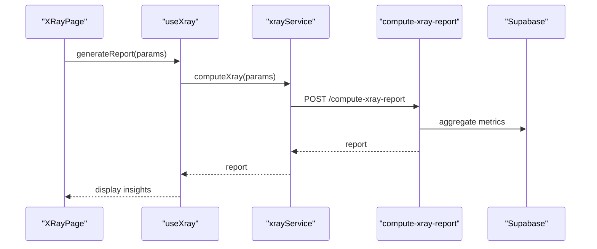

**Diagram sources**
- [XRayPage.tsx](file://src/pages/desktop/XRayPage.tsx)
- [useXray.ts](file://src/hooks/useXray.ts)
- [xrayService.ts](file://src/services/xrayService.ts)
- [index.ts (compute-xray-report)](file://supabase/functions/compute-xray-report/index.ts)

**Section sources**
- [XRayPage.tsx](file://src/pages/desktop/XRayPage.tsx)
- [useXray.ts](file://src/hooks/useXray.ts)
- [xrayService.ts](file://src/services/xrayService.ts)
- [index.ts (compute-xray-report)](file://supabase/functions/compute-xray-report/index.ts)

### Shared Reports
Shared reports are created and read via dedicated Edge Functions, enabling secure sharing and viewing of portfolio snapshots.

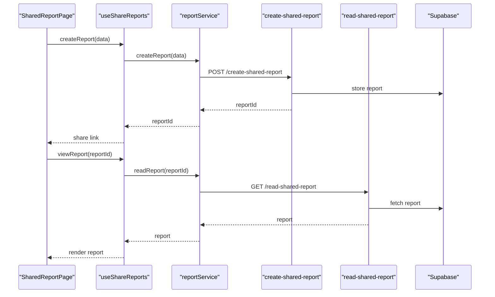

**Diagram sources**
- [SharedReportPage.tsx](file://src/pages/desktop/SharedReportPage.tsx)
- [useShareReports.ts](file://src/hooks/useShareReports.ts)
- [reportService.ts](file://src/services/reportService.ts)
- [index.ts (create-shared-report)](file://supabase/functions/create-shared-report/index.ts)
- [index.ts (read-shared-report)](file://supabase/functions/read-shared-report/index.ts)

**Section sources**
- [SharedReportPage.tsx](file://src/pages/desktop/SharedReportPage.tsx)
- [useShareReports.ts](file://src/hooks/useShareReports.ts)
- [reportService.ts](file://src/services/reportService.ts)
- [index.ts (create-shared-report)](file://supabase/functions/create-shared-report/index.ts)
- [index.ts (read-shared-report)](file://supabase/functions/read-shared-report/index.ts)

### Profile Management
Profile data is managed through a service and hook, allowing users to update their information securely.

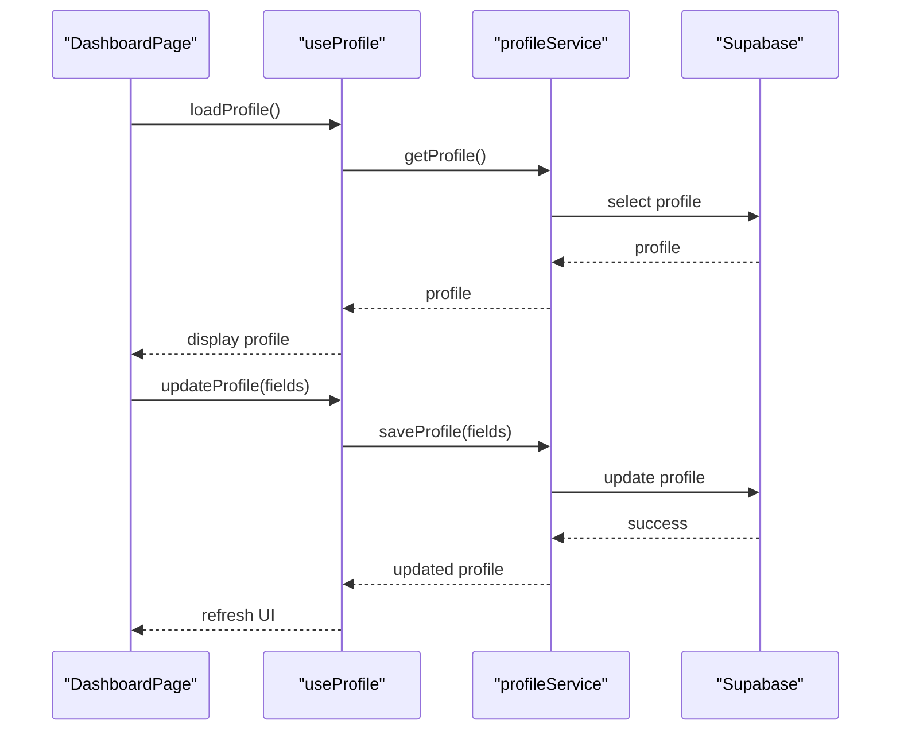

**Diagram sources**
- [DashboardPage.tsx](file://src/pages/desktop/DashboardPage.tsx)
- [useProfile.ts](file://src/hooks/useProfile.ts)
- [profileService.ts](file://src/services/profileService.ts)

**Section sources**
- [DashboardPage.tsx](file://src/pages/desktop/DashboardPage.tsx)
- [useProfile.ts](file://src/hooks/useProfile.ts)
- [profileService.ts](file://src/services/profileService.ts)

## Dependency Analysis
The frontend depends on Supabase client configuration and types, while services encapsulate all external calls. Hooks depend on services, and pages depend on hooks and components.

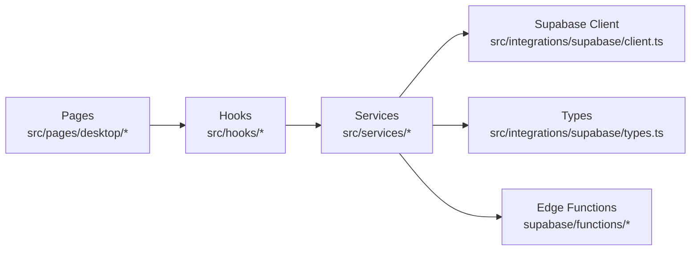

**Diagram sources**
- [DashboardPage.tsx](file://src/pages/desktop/DashboardPage.tsx)
- [useAssetLedger.ts](file://src/hooks/useAssetLedger.ts)
- [assetService.ts](file://src/services/assetService.ts)
- [client.ts](file://src/integrations/supabase/client.ts)
- [types.ts](file://src/integrations/supabase/types.ts)
- [index.ts (parse-asset-csv)](file://supabase/functions/parse-asset-csv/index.ts)

**Section sources**
- [client.ts](file://src/integrations/supabase/client.ts)
- [types.ts](file://src/integrations/supabase/types.ts)
- [assetService.ts](file://src/services/assetService.ts)
- [useAssetLedger.ts](file://src/hooks/useAssetLedger.ts)
- [DashboardPage.tsx](file://src/pages/desktop/DashboardPage.tsx)

## Performance Considerations
- Use memoization in hooks to avoid unnecessary re-renders
- Implement pagination and virtualization for large datasets
- Leverage Supabase Realtime for efficient live updates
- Cache FX rates and other static data locally to reduce network calls
- Optimize bundle size with code splitting and lazy loading

[No sources needed since this section provides general guidance]

## Troubleshooting Guide
Common issues and resolutions:
- Authentication failures: Verify session handling in the auth guard and ensure proper redirects
- Network errors: Check service error handling and retry strategies
- Realtime connection drops: Monitor Supabase client status and implement reconnection logic
- Edge Function timeouts: Review function execution time and optimize queries

**Section sources**
- [useAuthGuard.ts](file://src/hooks/useAuthGuard.ts)
- [authService.ts](file://src/services/authService.ts)
- [client.ts](file://src/integrations/supabase/client.ts)

## Conclusion
FinSight’s architecture delivers a scalable, maintainable, and type-safe financial analytics platform. The separation of concerns across UI, hooks, and services, combined with Supabase’s serverless backend, enables rapid development and robust functionality. The design supports future enhancements while maintaining clarity and performance.

[No sources needed since this section summarizes without analyzing specific files]