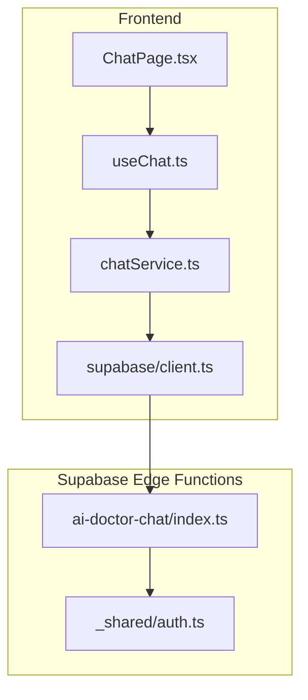
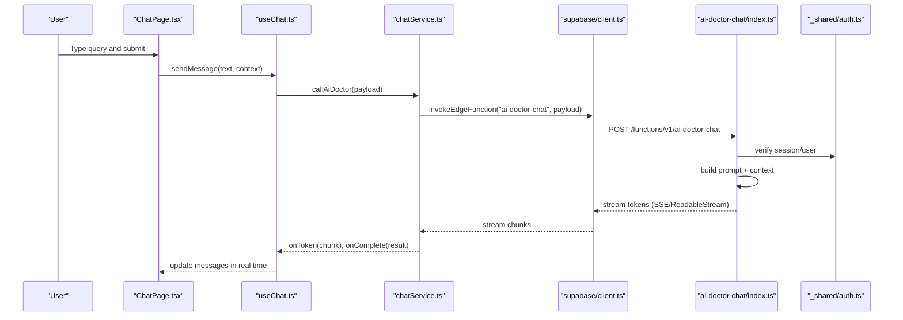
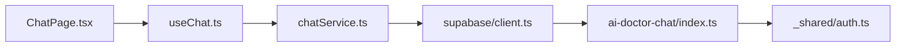

# AI Integration

<cite>
**Referenced Files in This Document**
- [useChat.ts](file://src/hooks/useChat.ts)
- [chatService.ts](file://src/services/chatService.ts)
- [ai-doctor-chat/index.ts](file://supabase/functions/ai-doctor-chat/index.ts)
- [ChatPage.tsx](file://src/pages/desktop/ChatPage.tsx)
- [client.ts](file://src/integrations/supabase/client.ts)
- [auth.ts](file://supabase/functions/_shared/auth.ts)
</cite>

## Table of Contents
1. [Introduction](#introduction)
2. [Project Structure](#project-structure)
3. [Core Components](#core-components)
4. [Architecture Overview](#architecture-overview)
5. [Detailed Component Analysis](#detailed-component-analysis)
6. [Dependency Analysis](#dependency-analysis)
7. [Performance Considerations](#performance-considerations)
8. [Troubleshooting Guide](#troubleshooting-guide)
9. [Conclusion](#conclusion)

## Introduction
This document explains the AI Integration feature that provides natural language portfolio analysis and health assessment through a conversational interface. It covers the chat UI implementation, client-side hooks and services, Supabase Edge Function orchestration, message streaming, error handling, and conversation context management. The goal is to help developers understand how user queries about portfolio health are transformed into actionable insights and recommendations via an AI service.

## Project Structure
The AI Integration spans three layers:
- Frontend Chat UI and state management (React components and hooks)
- Client-side service layer (HTTP calls, streaming, error handling)
- Serverless AI processing (Supabase Edge Function)

**Diagram sources**
- [ChatPage.tsx](file://src/pages/desktop/ChatPage.tsx)
- [useChat.ts](file://src/hooks/useChat.ts)
- [chatService.ts](file://src/services/chatService.ts)
- [client.ts](file://src/integrations/supabase/client.ts)
- [ai-doctor-chat/index.ts](file://supabase/functions/ai-doctor-chat/index.ts)
- [auth.ts](file://supabase/functions/_shared/auth.ts)

**Section sources**
- [ChatPage.tsx](file://src/pages/desktop/ChatPage.tsx)
- [useChat.ts](file://src/hooks/useChat.ts)
- [chatService.ts](file://src/services/chatService.ts)
- [client.ts](file://src/integrations/supabase/client.ts)
- [ai-doctor-chat/index.ts](file://supabase/functions/ai-doctor-chat/index.ts)
- [auth.ts](file://supabase/functions/_shared/auth.ts)

## Core Components
- useChat hook: Manages conversation state, message history, typing indicators, and streaming updates. It exposes methods to send messages, receive streamed responses, and reset or clear conversations.
- chatService: Encapsulates HTTP interactions with the Supabase Edge Function, handles request formatting, response parsing, and streaming consumption. It centralizes error mapping and retry logic.
- ai-doctor-chat Edge Function: Authenticates requests, reads conversation context, invokes the AI model, streams tokens back to the client, and formats structured outputs such as health scores and recommendations.
- ChatPage: Renders the chat UI, binds input events, displays messages, and integrates with useChat for real-time updates.

Key responsibilities:
- Conversation context management across turns
- Streaming token delivery for responsive UX
- Robust error handling and user feedback
- Structured AI output for consistent rendering

**Section sources**
- [useChat.ts](file://src/hooks/useChat.ts)
- [chatService.ts](file://src/services/chatService.ts)
- [ai-doctor-chat/index.ts](file://supabase/functions/ai-doctor-chat/index.ts)
- [ChatPage.tsx](file://src/pages/desktop/ChatPage.tsx)

## Architecture Overview
The chat flow connects the UI to the AI backend via a secure edge function. Messages are sent with conversation context; the server processes them using an AI model and streams partial responses back to the client for immediate display.

**Diagram sources**
- [ChatPage.tsx](file://src/pages/desktop/ChatPage.tsx)
- [useChat.ts](file://src/hooks/useChat.ts)
- [chatService.ts](file://src/services/chatService.ts)
- [client.ts](file://src/integrations/supabase/client.ts)
- [ai-doctor-chat/index.ts](file://supabase/functions/ai-doctor-chat/index.ts)
- [auth.ts](file://supabase/functions/_shared/auth.ts)

## Detailed Component Analysis

### useChat Hook
Responsibilities:
- Maintain local conversation state (messages, loading, errors)
- Manage streaming updates and final result aggregation
- Provide API surface for sending messages and clearing history
- Integrate with chatService for network operations

Typical usage pattern:
- Initialize hook with optional initial context
- On user submit, append user message, set loading state
- Call service method to start streaming
- Append incoming tokens to the latest assistant message
- On completion, finalize message and update any derived metrics

Error handling:
- Map network and server errors to user-friendly states
- Allow retry or fallback behavior

Streaming:
- Accumulate partial tokens until complete
- Debounce UI updates if needed for performance

**Section sources**
- [useChat.ts](file://src/hooks/useChat.ts)

### chatService Layer
Responsibilities:
- Build request payloads including conversation history and context
- Invoke Supabase Edge Function with proper headers and auth
- Consume streaming responses and emit incremental updates
- Normalize and validate server responses
- Centralize error transformation and logging

Streaming approach:
- Use ReadableStream or SSE to process tokens incrementally
- Emit onToken and onComplete callbacks to the caller

Error handling:
- Distinguish between transient and permanent failures
- Surface actionable messages to the UI

**Section sources**
- [chatService.ts](file://src/services/chatService.ts)
- [client.ts](file://src/integrations/supabase/client.ts)

### Supabase Edge Function: ai-doctor-chat
Responsibilities:
- Authenticate and authorize requests
- Load conversation context and relevant portfolio data
- Construct prompts tailored to portfolio health and recommendations
- Stream AI-generated tokens back to the client
- Format structured outputs (e.g., health score, risk flags, recommendations)

Security:
- Validate user session and permissions
- Sanitize inputs and limit context size

Streaming:
- Return a streaming response so the client can render tokens progressively

Structured output:
- Ensure consistent schema for downstream rendering and analytics

**Section sources**
- [ai-doctor-chat/index.ts](file://supabase/functions/ai-doctor-chat/index.ts)
- [auth.ts](file://supabase/functions/_shared/auth.ts)

### ChatPage UI
Responsibilities:
- Render message list with user and assistant bubbles
- Provide input field and send button
- Bind to useChat for state and actions
- Display typing indicator while streaming
- Handle keyboard shortcuts and accessibility

Integration points:
- Calls useChat.sendMessage on submit
- Displays streaming progress and final results
- Shows error banners when applicable

**Section sources**
- [ChatPage.tsx](file://src/pages/desktop/ChatPage.tsx)

## Dependency Analysis
High-level dependencies:
- ChatPage depends on useChat for state and actions
- useChat depends on chatService for networking
- chatService depends on supabase client for invoking functions
- ai-doctor-chat depends on shared auth utilities and external AI provider

**Diagram sources**
- [ChatPage.tsx](file://src/pages/desktop/ChatPage.tsx)
- [useChat.ts](file://src/hooks/useChat.ts)
- [chatService.ts](file://src/services/chatService.ts)
- [client.ts](file://src/integrations/supabase/client.ts)
- [ai-doctor-chat/index.ts](file://supabase/functions/ai-doctor-chat/index.ts)
- [auth.ts](file://supabase/functions/_shared/auth.ts)

**Section sources**
- [ChatPage.tsx](file://src/pages/desktop/ChatPage.tsx)
- [useChat.ts](file://src/hooks/useChat.ts)
- [chatService.ts](file://src/services/chatService.ts)
- [client.ts](file://src/integrations/supabase/client.ts)
- [ai-doctor-chat/index.ts](file://supabase/functions/ai-doctor-chat/index.ts)
- [auth.ts](file://supabase/functions/_shared/auth.ts)

## Performance Considerations
- Streaming first: Prefer token-by-token updates to reduce perceived latency.
- Context window control: Limit conversation history length and summarize older turns to keep prompts efficient.
- Debounced UI updates: Avoid excessive re-renders during high-frequency token streams.
- Error resilience: Implement retries with exponential backoff for transient network failures.
- Caching: Cache static assets and repeated non-sensitive queries where appropriate.

[No sources needed since this section provides general guidance]

## Troubleshooting Guide
Common issues and resolutions:
- Authentication failures: Verify session validity and ensure the Edge Function’s auth checks pass.
- Empty or truncated responses: Check context size limits and prompt construction; ensure streaming is not interrupted.
- Network timeouts: Add retry logic and user-facing error messages; consider increasing timeout thresholds for large contexts.
- Inconsistent formatting: Enforce a strict response schema on the server and validate on the client before rendering.

Operational tips:
- Log request IDs and timestamps at each layer for tracing.
- Capture partial responses on failure to aid debugging.
- Provide a “Regenerate” action to retry failed turns.

**Section sources**
- [chatService.ts](file://src/services/chatService.ts)
- [ai-doctor-chat/index.ts](file://supabase/functions/ai-doctor-chat/index.ts)
- [auth.ts](file://supabase/functions/_shared/auth.ts)

## Conclusion
The AI Integration delivers a responsive, streaming-enabled chat experience for portfolio health analysis. By separating concerns across UI, hooks, service, and edge function layers, the system remains maintainable and extensible. Proper authentication, context management, and structured outputs ensure reliable, actionable insights for users.

[No sources needed since this section summarizes without analyzing specific files]