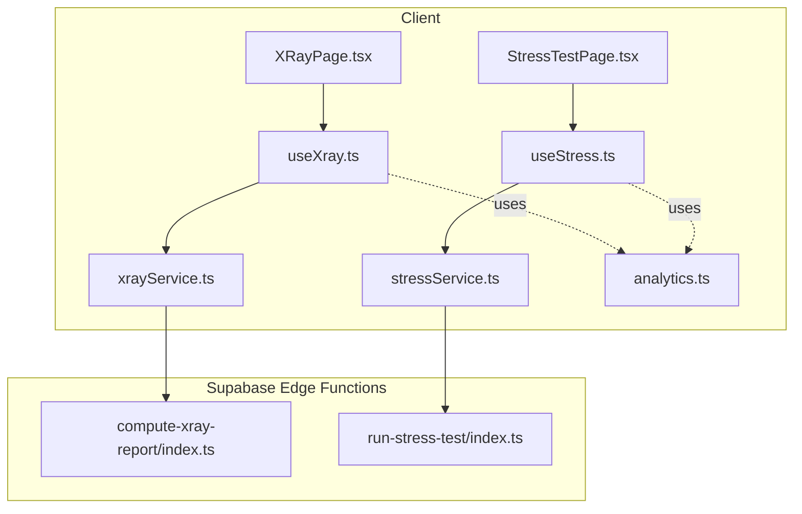
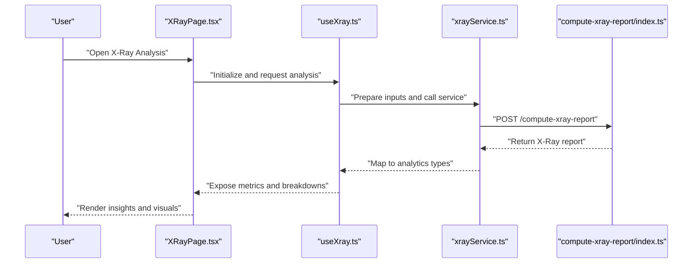
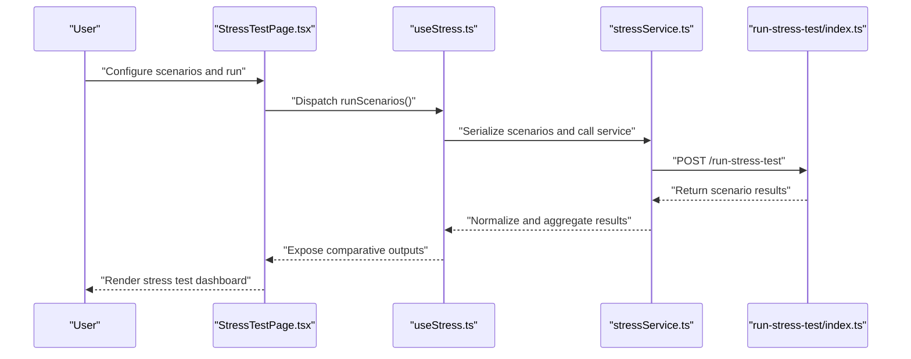
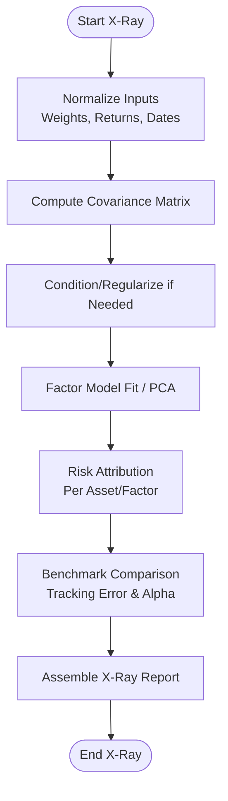
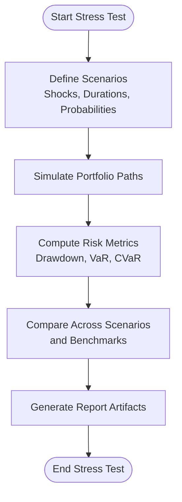
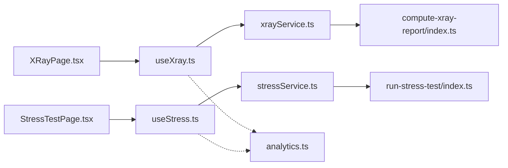

# Advanced Analysis

<cite>
**Referenced Files in This Document**
- [useXray.ts](file://src/hooks/useXray.ts)
- [useStress.ts](file://src/hooks/useStress.ts)
- [xrayService.ts](file://src/services/xrayService.ts)
- [stressService.ts](file://src/services/stressService.ts)
- [compute-xray-report/index.ts](file://supabase/functions/compute-xray-report/index.ts)
- [run-stress-test/index.ts](file://supabase/functions/run-stress-test/index.ts)
- [XRayPage.tsx](file://src/pages/desktop/XRayPage.tsx)
- [StressTestPage.tsx](file://src/pages/desktop/StressTestPage.tsx)
- [analytics.ts](file://src/types/app/analytics.ts)
</cite>

## Table of Contents
1. [Introduction](#introduction)
2. [Project Structure](#project-structure)
3. [Core Components](#core-components)
4. [Architecture Overview](#architecture-overview)
5. [Detailed Component Analysis](#detailed-component-analysis)
6. [Dependency Analysis](#dependency-analysis)
7. [Performance Considerations](#performance-considerations)
8. [Troubleshooting Guide](#troubleshooting-guide)
9. [Conclusion](#conclusion)
10. [Appendices](#appendices)

## Introduction
This document explains the Advanced Analysis feature, focusing on deep portfolio insights via X-Ray analysis and stress testing. It covers analytical algorithms, scenario modeling, risk assessment methodologies, client-side hooks and services, and Supabase Edge Functions used for heavy computation. It also includes examples of stress test scenarios, correlation analysis, benchmark comparisons, report generation guidance, computational complexity considerations, result interpretation, and performance optimization strategies.

## Project Structure
The Advanced Analysis feature spans React hooks, services, pages, types, and Supabase Edge Functions:
- Client-side orchestration is implemented through hooks and services that prepare inputs, manage state, and render results.
- Heavy computations are offloaded to Supabase Edge Functions for scalability and reliability.
- Shared analytics types define the data contracts between UI and backend.

**Diagram sources**
- [XRayPage.tsx](file://src/pages/desktop/XRayPage.tsx)
- [StressTestPage.tsx](file://src/pages/desktop/StressTestPage.tsx)
- [useXray.ts](file://src/hooks/useXray.ts)
- [useStress.ts](file://src/hooks/useStress.ts)
- [xrayService.ts](file://src/services/xrayService.ts)
- [stressService.ts](file://src/services/stressService.ts)
- [compute-xray-report/index.ts](file://supabase/functions/compute-xray-report/index.ts)
- [run-stress-test/index.ts](file://supabase/functions/run-stress-test/index.ts)
- [analytics.ts](file://src/types/app/analytics.ts)

**Section sources**
- [XRayPage.tsx](file://src/pages/desktop/XRayPage.tsx)
- [StressTestPage.tsx](file://src/pages/desktop/StressTestPage.tsx)
- [useXray.ts](file://src/hooks/useXray.ts)
- [useStress.ts](file://src/hooks/useStress.ts)
- [xrayService.ts](file://src/services/xrayService.ts)
- [stressService.ts](file://src/services/stressService.ts)
- [compute-xray-report/index.ts](file://supabase/functions/compute-xray-report/index.ts)
- [run-stress-test/index.ts](file://supabase/functions/run-stress-test/index.ts)
- [analytics.ts](file://src/types/app/analytics.ts)

## Core Components
- useXray hook: Orchestrates X-Ray analysis by preparing portfolio inputs, invoking the service layer, handling loading/error states, and exposing computed metrics and breakdowns to the UI.
- useStress hook: Manages stress test configuration, runs multiple scenarios, aggregates results, and exposes comparative outputs (e.g., drawdowns, VaR, tail metrics).
- xrayService: Encapsulates API calls to the compute-xray-report Edge Function and maps responses into typed analytics structures.
- stressService: Encapsulates API calls to the run-stress-test Edge Function and normalizes scenario results for visualization.
- Analytics types: Define shared interfaces for portfolio composition, factor exposures, scenario outcomes, and reporting artifacts.

Key responsibilities:
- Input validation and normalization before sending to Edge Functions.
- State management for long-running computations with progress indicators.
- Error propagation and retry policies where applicable.
- Result caching and memoization to avoid redundant calculations.

**Section sources**
- [useXray.ts](file://src/hooks/useXray.ts)
- [useStress.ts](file://src/hooks/useStress.ts)
- [xrayService.ts](file://src/services/xrayService.ts)
- [stressService.ts](file://src/services/stressService.ts)
- [analytics.ts](file://src/types/app/analytics.ts)

## Architecture Overview
The Advanced Analysis architecture separates UI orchestration from heavy computation:
- The UI layers (pages) consume hooks to present interactive controls and results.
- Hooks call services to serialize requests and handle response mapping.
- Services invoke Supabase Edge Functions for CPU-intensive tasks such as correlation matrices, Monte Carlo simulations, and factor decomposition.
- Results are returned as structured analytics objects consumed by charts and tables.

**Diagram sources**
- [XRayPage.tsx](file://src/pages/desktop/XRayPage.tsx)
- [useXray.ts](file://src/hooks/useXray.ts)
- [xrayService.ts](file://src/services/xrayService.ts)
- [compute-xray-report/index.ts](file://supabase/functions/compute-xray-report/index.ts)

**Diagram sources**
- [StressTestPage.tsx](file://src/pages/desktop/StressTestPage.tsx)
- [useStress.ts](file://src/hooks/useStress.ts)
- [stressService.ts](file://src/services/stressService.ts)
- [run-stress-test/index.ts](file://supabase/functions/run-stress-test/index.ts)

## Detailed Component Analysis

### X-Ray Analysis
X-Ray analysis decomposes portfolio risk and returns into underlying factors and asset-level contributions. Typical components include:
- Factor exposure estimation using historical return series and covariance-based methods.
- Asset contribution to volatility and drawdown attribution.
- Correlation structure analysis across assets or factors.
- Benchmark comparison highlighting relative performance and tracking error.

Algorithmic overview:
- Covariance matrix construction and conditioning for stability.
- Principal component analysis or factor model fitting to explain variance.
- Attribution of risk contributions per asset/factor.
- Aggregation into summary metrics (e.g., total volatility, Sharpe-like ratios).

**Diagram sources**
- [useXray.ts](file://src/hooks/useXray.ts)
- [xrayService.ts](file://src/services/xrayService.ts)
- [compute-xray-report/index.ts](file://supabase/functions/compute-xray-report/index.ts)
- [analytics.ts](file://src/types/app/analytics.ts)

Implementation notes:
- The hook manages lifecycle, loading, and error states while delegating computation to the service.
- The service serializes inputs and invokes the Edge Function, then maps responses to analytics types.
- The Edge Function performs heavy numerical operations and returns a structured report.

**Section sources**
- [useXray.ts](file://src/hooks/useXray.ts)
- [xrayService.ts](file://src/services/xrayService.ts)
- [compute-xray-report/index.ts](file://supabase/functions/compute-xray-report/index.ts)
- [analytics.ts](file://src/types/app/analytics.ts)

### Stress Testing
Stress testing evaluates portfolio resilience under adverse scenarios. Common scenario categories:
- Market shocks: equity sell-offs, rate hikes, credit spreads widening.
- Liquidity crunches: bid-ask spread expansion, reduced depth.
- Correlation spikes: diversification breakdown during crises.
- Idiosyncratic events: issuer defaults, sector-specific disruptions.

Processing pipeline:
- Scenario definition with shock magnitudes and durations.
- Simulation engine applies shocks to asset returns or prices.
- Aggregates portfolio-level outcomes: drawdowns, VaR/CVaR, recovery time.
- Produces comparative views across scenarios and benchmarks.

**Diagram sources**
- [useStress.ts](file://src/hooks/useStress.ts)
- [stressService.ts](file://src/services/stressService.ts)
- [run-stress-test/index.ts](file://supabase/functions/run-stress-test/index.ts)
- [analytics.ts](file://src/types/app/analytics.ts)

Examples of stress test scenarios:
- Equity crash: -30% broad market over 20 trading days with elevated volatility.
- Rate shock: +200 bps parallel shift with duration-weighted bond impacts.
- Credit event: Spread widening by 150 bps for investment-grade and 300 bps for high-yield.
- Correlation spike: Pairwise correlations increase by 0.3 across equities.
- Liquidity squeeze: Bid-ask spreads widen by 50%, reducing realized returns.

Result interpretation:
- Identify worst-case drawdowns and recovery horizons.
- Assess concentration risk and factor sensitivity.
- Evaluate hedging effectiveness and capital buffer adequacy.

**Section sources**
- [useStress.ts](file://src/hooks/useStress.ts)
- [stressService.ts](file://src/services/stressService.ts)
- [run-stress-test/index.ts](file://supabase/functions/run-stress-test/index.ts)
- [analytics.ts](file://src/types/app/analytics.ts)

### Hooks and Services
- useXray:
  - Responsibilities: input preparation, invocation of xrayService, state management, error handling, and exposing computed metrics.
  - Patterns: memoization of expensive inputs, debounced updates for interactive sliders, and progressive loading feedback.
- useStress:
  - Responsibilities: scenario configuration, batch execution, aggregation, and exposing comparative dashboards.
  - Patterns: concurrent scenario execution with controlled concurrency, cancellation tokens for aborting long runs, and partial result streaming.
- xrayService:
  - Responsibilities: payload serialization, HTTP transport to Edge Function, response parsing, and type-safe mapping.
- stressService:
  - Responsibilities: scenario normalization, batching, retry logic, and result consolidation.

**Section sources**
- [useXray.ts](file://src/hooks/useXray.ts)
- [useStress.ts](file://src/hooks/useStress.ts)
- [xrayService.ts](file://src/services/xrayService.ts)
- [stressService.ts](file://src/services/stressService.ts)

### Pages
- XRayPage:
  - Presents X-Ray metrics, factor exposures, attribution charts, and benchmark comparisons.
  - Integrates with useXray to react to user inputs and display results.
- StressTestPage:
  - Provides scenario builder, run controls, and comparative visualizations.
  - Integrates with useStress to execute and visualize stress outcomes.

**Section sources**
- [XRayPage.tsx](file://src/pages/desktop/XRayPage.tsx)
- [StressTestPage.tsx](file://src/pages/desktop/StressTestPage.tsx)

### Types
- analytics.ts:
  - Defines shared interfaces for portfolio composition, factor exposures, scenario outcomes, and report artifacts.
  - Ensures consistent contracts between UI, services, and Edge Functions.

**Section sources**
- [analytics.ts](file://src/types/app/analytics.ts)

## Dependency Analysis
The Advanced Analysis module exhibits clear separation of concerns:
- UI depends on hooks for orchestration.
- Hooks depend on services for transport and mapping.
- Services depend on Edge Functions for computation.
- Types provide a stable contract across layers.

**Diagram sources**
- [XRayPage.tsx](file://src/pages/desktop/XRayPage.tsx)
- [StressTestPage.tsx](file://src/pages/desktop/StressTestPage.tsx)
- [useXray.ts](file://src/hooks/useXray.ts)
- [useStress.ts](file://src/hooks/useStress.ts)
- [xrayService.ts](file://src/services/xrayService.ts)
- [stressService.ts](file://src/services/stressService.ts)
- [compute-xray-report/index.ts](file://supabase/functions/compute-xray-report/index.ts)
- [run-stress-test/index.ts](file://supabase/functions/run-stress-test/index.ts)
- [analytics.ts](file://src/types/app/analytics.ts)

**Section sources**
- [XRayPage.tsx](file://src/pages/desktop/XRayPage.tsx)
- [StressTestPage.tsx](file://src/pages/desktop/StressTestPage.tsx)
- [useXray.ts](file://src/hooks/useXray.ts)
- [useStress.ts](file://src/hooks/useStress.ts)
- [xrayService.ts](file://src/services/xrayService.ts)
- [stressService.ts](file://src/services/stressService.ts)
- [compute-xray-report/index.ts](file://supabase/functions/compute-xray-report/index.ts)
- [run-stress-test/index.ts](file://supabase/functions/run-stress-test/index.ts)
- [analytics.ts](file://src/types/app/analytics.ts)

## Performance Considerations
Computational complexity:
- Covariance matrix construction scales O(n^2) with number of assets; factor models and PCA add further overhead proportional to n and sample size.
- Monte Carlo simulations scale linearly with number of paths and time steps; scenario sets multiply cost by scenario count.
- Correlation analysis involves matrix operations and may require regularization for stability.

Optimization strategies:
- Memoize inputs and intermediate results to avoid recomputation when only minor parameters change.
- Batch and parallelize independent scenario executions with controlled concurrency limits.
- Use server-side caching for repeated queries with identical inputs.
- Downsample time series for exploratory analysis and switch to full-resolution for final reports.
- Apply numerical stabilization techniques (e.g., shrinkage estimators) to improve convergence speed and robustness.

Result interpretation tips:
- Focus on tail risk metrics (CVaR) alongside mean-variance measures.
- Validate factor exposures against domain knowledge to detect anomalies.
- Cross-check benchmark comparisons for consistency and reasonableness.

[No sources needed since this section provides general guidance]

## Troubleshooting Guide
Common issues and resolutions:
- Long-running computations:
  - Ensure proper cancellation and timeout handling in hooks.
  - Implement progress indicators and allow pausing/resuming.
- Numerical instability:
  - Check covariance conditioning and consider regularization.
  - Validate input date alignment and missing value handling.
- Data mismatches:
  - Verify currency conversion and frequency alignment before analysis.
  - Confirm weights sum to one and dates match return series.
- Edge Function errors:
  - Inspect payloads for schema compliance.
  - Add retries with exponential backoff for transient failures.

Operational checks:
- Confirm network connectivity and authentication for Edge Functions.
- Validate environment variables and function deployment status.
- Review logs for stack traces and error codes.

**Section sources**
- [useXray.ts](file://src/hooks/useXray.ts)
- [useStress.ts](file://src/hooks/useStress.ts)
- [xrayService.ts](file://src/services/xrayService.ts)
- [stressService.ts](file://src/services/stressService.ts)
- [compute-xray-report/index.ts](file://supabase/functions/compute-xray-report/index.ts)
- [run-stress-test/index.ts](file://supabase/functions/run-stress-test/index.ts)

## Conclusion
The Advanced Analysis feature delivers robust portfolio insights through X-Ray decomposition and comprehensive stress testing. By separating UI orchestration from heavy computation and leveraging Supabase Edge Functions, it achieves scalability and responsiveness. Clear typing contracts ensure reliable integration across layers. With careful attention to numerical stability, performance optimization, and result interpretation, users can make informed decisions about risk and allocation.

[No sources needed since this section summarizes without analyzing specific files]

## Appendices

### Example Scenarios and Reports
- Stress test scenarios:
  - Market crash, rate hike, credit spread widening, correlation spike, liquidity squeeze.
- Benchmark comparisons:
  - Track error, alpha, information ratio, and rolling performance vs. index.
- Report generation:
  - Exportable summaries including factor exposures, attribution, scenario outcomes, and recommendations.

[No sources needed since this section provides general guidance]