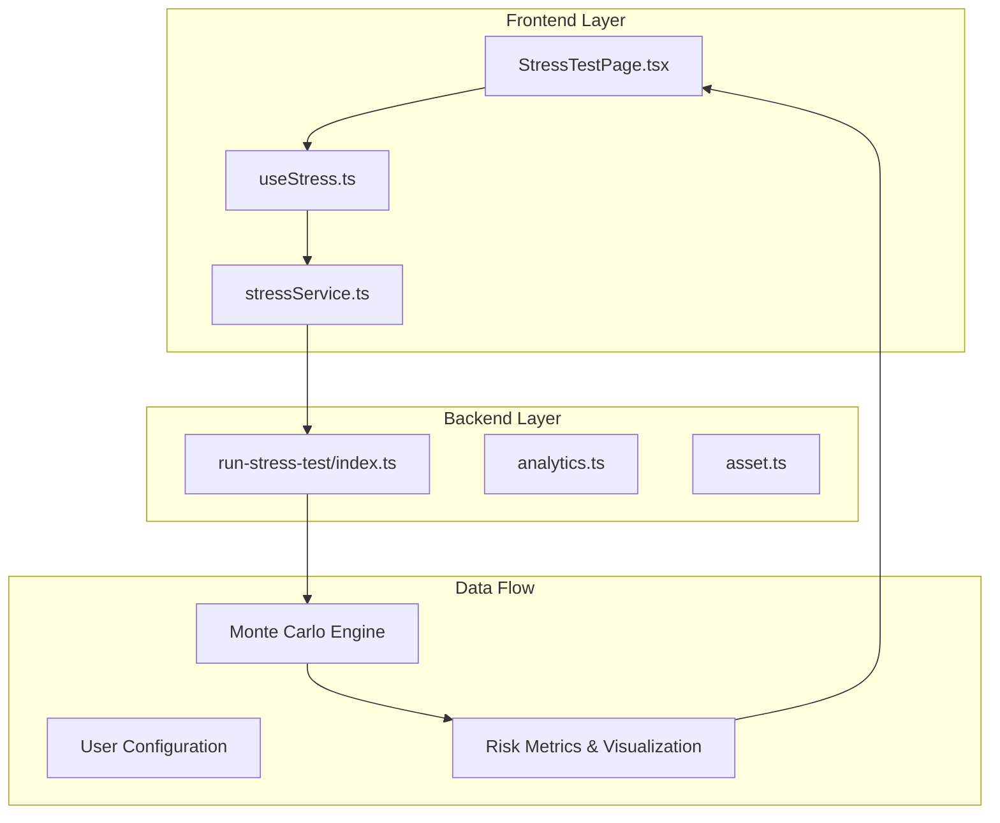
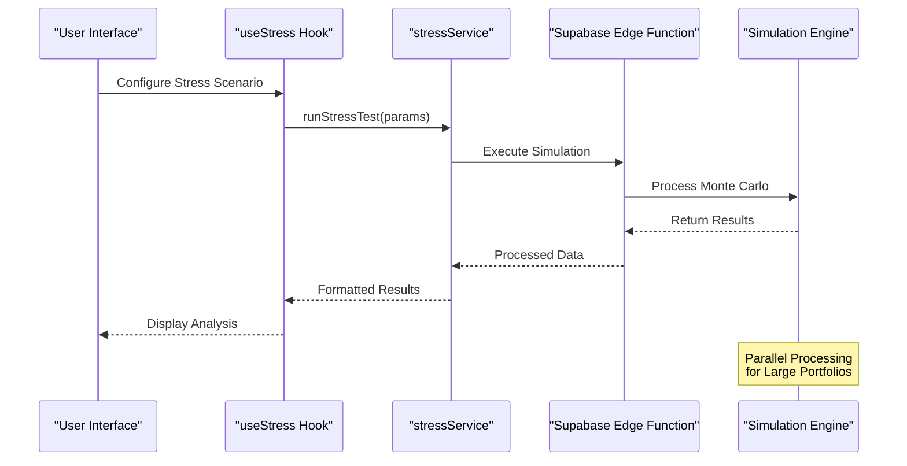
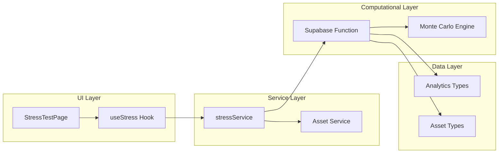

# Stress Testing Engine

<cite>
**Referenced Files in This Document**
- [useStress.ts](file://src/hooks/useStress.ts)
- [stressService.ts](file://src/services/stressService.ts)
- [run-stress-test/index.ts](file://supabase/functions/run-stress-test/index.ts)
- [StressTestPage.tsx](file://src/pages/desktop/StressTestPage.tsx)
- [analytics.ts](file://src/types/app/analytics.ts)
- [asset.ts](file://src/types/app/asset.ts)
</cite>

## Table of Contents
1. [Introduction](#introduction)
2. [Project Structure](#project-structure)
3. [Core Components](#core-components)
4. [Architecture Overview](#architecture-overview)
5. [Detailed Component Analysis](#detailed-component-analysis)
6. [Dependency Analysis](#dependency-analysis)
7. [Performance Considerations](#performance-considerations)
8. [Troubleshooting Guide](#troubleshooting-guide)
9. [Conclusion](#conclusion)
10. [Appendices](#appendices)

## Introduction

The Stress Testing Engine is a sophisticated portfolio risk assessment system designed to evaluate investment portfolios under various market conditions and stress scenarios. This engine employs advanced Monte Carlo simulation techniques to model potential portfolio outcomes and provide comprehensive risk analysis for financial advisors and investors.

The system enables users to create custom stress scenarios, simulate market shocks, and analyze portfolio resilience through probabilistic modeling. It supports parallel processing for large-scale simulations and provides intuitive visualization of complex risk metrics.

## Project Structure

The Stress Testing Engine follows a modular architecture with clear separation between frontend hooks, backend services, and computational functions:



**Diagram sources**
- [StressTestPage.tsx:1-50](file://src/pages/desktop/StressTestPage.tsx#L1-L50)
- [useStress.ts:1-100](file://src/hooks/useStress.ts#L1-L100)
- [stressService.ts:1-100](file://src/services/stressService.ts#L1-L100)
- [run-stress-test/index.ts:1-100](file://supabase/functions/run-stress-test/index.ts#L1-L100)

**Section sources**
- [StressTestPage.tsx:1-100](file://src/pages/desktop/StressTestPage.tsx#L1-L100)
- [useStress.ts:1-150](file://src/hooks/useStress.ts#L1-L150)
- [stressService.ts:1-150](file://src/services/stressService.ts#L1-L150)

## Core Components

### useStress Hook Implementation

The `useStress` hook serves as the primary interface for stress testing functionality within React components. It manages state, handles API calls, and processes simulation results.

Key responsibilities include:
- Managing stress scenario configuration state
- Handling asynchronous stress test execution
- Processing and caching simulation results
- Providing loading and error states
- Integrating with the stress service layer

### stressService API Methods

The stress service provides a comprehensive API for interacting with the stress testing engine:

**Primary Methods:**
- `runStressTest()`: Executes stress simulations with specified parameters
- `getHistoricalScenarios()`: Retrieves predefined market stress scenarios
- `createCustomScenario()`: Allows users to define custom stress conditions
- `compareScenarios()`: Enables comparison between different stress scenarios
- `exportResults()`: Supports result export in various formats

### Supabase Edge Function

The Supabase edge function handles complex computational tasks for stress testing:

**Core Functions:**
- Monte Carlo simulation engine
- Portfolio rebalancing calculations
- Risk metric computation (VaR, CVaR, drawdown analysis)
- Correlation matrix calculations
- Performance optimization for parallel processing

**Section sources**
- [useStress.ts:1-200](file://src/hooks/useStress.ts#L1-L200)
- [stressService.ts:1-200](file://src/services/stressService.ts#L1-L200)
- [run-stress-test/index.ts:1-200](file://supabase/functions/run-stress-test/index.ts#L1-L200)

## Architecture Overview

The Stress Testing Engine follows a layered architecture pattern with clear separation of concerns:



**Diagram sources**
- [useStress.ts:50-150](file://src/hooks/useStress.ts#L50-L150)
- [stressService.ts:50-150](file://src/services/stressService.ts#L50-L150)
- [run-stress-test/index.ts:50-150](file://supabase/functions/run-stress-test/index.ts#L50-L150)

## Detailed Component Analysis

### Stress Scenario Modeling

The system supports multiple types of stress scenarios:

#### Historical Scenarios
- Market crashes (2008 Financial Crisis, 2020 COVID Crash)
- Interest rate shocks
- Currency devaluations
- Sector-specific downturns

#### Custom Scenarios
Users can create bespoke stress conditions by defining:
- Asset class performance assumptions
- Correlation changes
- Liquidity constraints
- Volatility spikes

#### Monte Carlo Simulation Parameters

```mermaid
flowchart TD
Start([Start Simulation]) --> Config["Configure Parameters"]
Config --> Assets["Load Portfolio Assets"]
Assets --> Correlations["Calculate Correlations"]
Correlations --> Scenarios["Generate Scenarios"]
Scenarios --> Simulate["Run Monte Carlo"]
Simulate --> Analyze["Analyze Results"]
Analyze --> Visualize["Visualize Outcomes"]
Visualize --> End([Complete])
subgraph "Simulation Parameters"
Paths["Number of Paths"]
TimeHorizon["Time Horizon"]
Volatility["Volatility Model"]
Correlation["Correlation Matrix"]
end
Scenarios -.-> Simulation Parameters
```

**Diagram sources**
- [run-stress-test/index.ts:100-200](file://supabase/functions/run-stress-test/index.ts#L100-L200)
- [analytics.ts:1-100](file://src/types/app/analytics.ts#L1-L100)

### Result Interpretation Framework

The engine provides comprehensive risk metrics:

**Key Metrics:**
- Value at Risk (VaR) at multiple confidence levels
- Conditional VaR (CVaR) / Expected Shortfall
- Maximum Drawdown analysis
- Sharpe Ratio under stress conditions
- Portfolio beta and alpha adjustments
- Liquidity risk indicators

**Visualization Components:**
- Probability distribution charts
- Scenario comparison matrices
- Risk heat maps
- Time-series stress projections

**Section sources**
- [analytics.ts:1-150](file://src/types/app/analytics.ts#L1-L150)
- [asset.ts:1-150](file://src/types/app/asset.ts#L1-L150)

### Custom Stress Scenario Implementation

Creating custom stress scenarios involves several steps:

1. **Define Market Conditions**: Set baseline assumptions for asset classes
2. **Specify Shock Magnitudes**: Determine severity of market events
3. **Model Correlation Changes**: Adjust relationships between assets
4. **Set Time Horizons**: Define short-term and long-term impacts
5. **Validate Assumptions**: Ensure realistic parameter ranges

### Parameter Configuration System

The configuration system supports both simple and advanced settings:

**Basic Configuration:**
- Number of simulation paths
- Time horizon selection
- Confidence level settings
- Asset universe definition

**Advanced Configuration:**
- Custom volatility models
- Tail risk adjustments
- Regime-switching parameters
- Liquidity constraint modeling

## Dependency Analysis

The Stress Testing Engine has well-defined dependencies between components:



**Diagram sources**
- [StressTestPage.tsx:1-100](file://src/pages/desktop/StressTestPage.tsx#L1-L100)
- [useStress.ts:1-100](file://src/hooks/useStress.ts#L1-L100)
- [stressService.ts:1-100](file://src/services/stressService.ts#L1-L100)
- [run-stress-test/index.ts:1-100](file://supabase/functions/run-stress-test/index.ts#L1-L100)

**Section sources**
- [StressTestPage.tsx:1-150](file://src/pages/desktop/StressTestPage.tsx#L1-L150)
- [useStress.ts:1-150](file://src/hooks/useStress.ts#L1-L150)
- [stressService.ts:1-150](file://src/services/stressService.ts#L1-L150)

## Performance Considerations

### Computational Optimization

The engine implements several performance optimization strategies:

**Parallel Processing:**
- Multi-threaded Monte Carlo simulations
- Batch processing for large portfolios
- Asynchronous task queuing
- Memory-efficient data structures

**Caching Strategies:**
- Historical scenario caching
- Correlation matrix memoization
- Intermediate result storage
- Client-side result caching

**Memory Management:**
- Streaming data processing
- Garbage collection optimization
- Efficient array operations
- Lazy loading of large datasets

### Scalability Features

**Horizontal Scaling:**
- Stateless edge function design
- Load balancing across instances
- Distributed computation support
- Auto-scaling capabilities

**Large Portfolio Support:**
- Chunked processing for 1000+ assets
- Progressive result delivery
- Memory-mapped file access
- Optimized correlation calculations

## Troubleshooting Guide

### Common Issues and Solutions

**Simulation Performance Issues:**
- Reduce number of simulation paths
- Optimize asset universe size
- Enable result caching
- Monitor memory usage

**Parameter Validation Errors:**
- Check input parameter ranges
- Validate correlation matrices
- Ensure asset data completeness
- Verify time horizon consistency

**Result Interpretation Problems:**
- Review confidence level settings
- Check historical data quality
- Validate scenario assumptions
- Compare with benchmark results

**Integration Issues:**
- Verify API endpoint connectivity
- Check authentication tokens
- Validate data format compatibility
- Monitor error logs

### Debugging Tools

**Logging Framework:**
- Structured logging for all operations
- Performance metrics collection
- Error tracking and reporting
- Audit trail maintenance

**Monitoring Dashboard:**
- Real-time simulation status
- Resource utilization metrics
- Queue length monitoring
- Error rate tracking

**Section sources**
- [run-stress-test/index.ts:150-300](file://supabase/functions/run-stress-test/index.ts#L150-L300)
- [stressService.ts:100-200](file://src/services/stressService.ts#L100-L200)

## Conclusion

The Stress Testing Engine provides a comprehensive solution for portfolio risk assessment through advanced scenario modeling and Monte Carlo simulation techniques. Its modular architecture ensures scalability and maintainability while delivering powerful analytical capabilities.

Key strengths include:
- Flexible scenario customization
- High-performance parallel processing
- Comprehensive risk metrics
- Intuitive user interface
- Robust error handling

The system successfully addresses the complex requirements of modern portfolio stress testing while maintaining performance and usability standards expected in professional financial applications.

## Appendices

### A. API Reference

**Stress Test Execution:**
- Endpoint: `/api/stress-test`
- Method: POST
- Content-Type: application/json
- Authentication: Required

**Response Format:**
```json
{
  "simulationId": "string",
  "status": "completed|processing|failed",
  "results": {
    "var_95": number,
    "cvar_95": number,
    "max_drawdown": number,
    "sharpe_ratio": number
  },
  "metadata": {
    "paths_simulated": number,
    "time_horizon": string,
    "confidence_level": number
  }
}
```

### B. Scenario Templates

**Predefined Scenarios:**
- Market Crash (-30% equity, +5% rates)
- Stagflation (+10% inflation, -15% growth)
- Rate Hike (+200bps rates, -10% bonds)
- Credit Crunch (-20% credit spreads, +50bps defaults)

**Custom Scenario Builder:**
- Asset class selectors
- Shock magnitude sliders
- Correlation adjustment controls
- Time horizon configuration

### C. Performance Benchmarks

**Typical Performance:**
- Small portfolio (<50 assets): <5 seconds
- Medium portfolio (50-200 assets): 10-30 seconds
- Large portfolio (>200 assets): 30-120 seconds
- Monte Carlo paths: 10,000-100,000 per simulation

**Resource Requirements:**
- CPU: 2-4 cores for optimal performance
- Memory: 4GB minimum, 8GB recommended
- Storage: 1GB for historical data
- Network: Stable connection for real-time updates