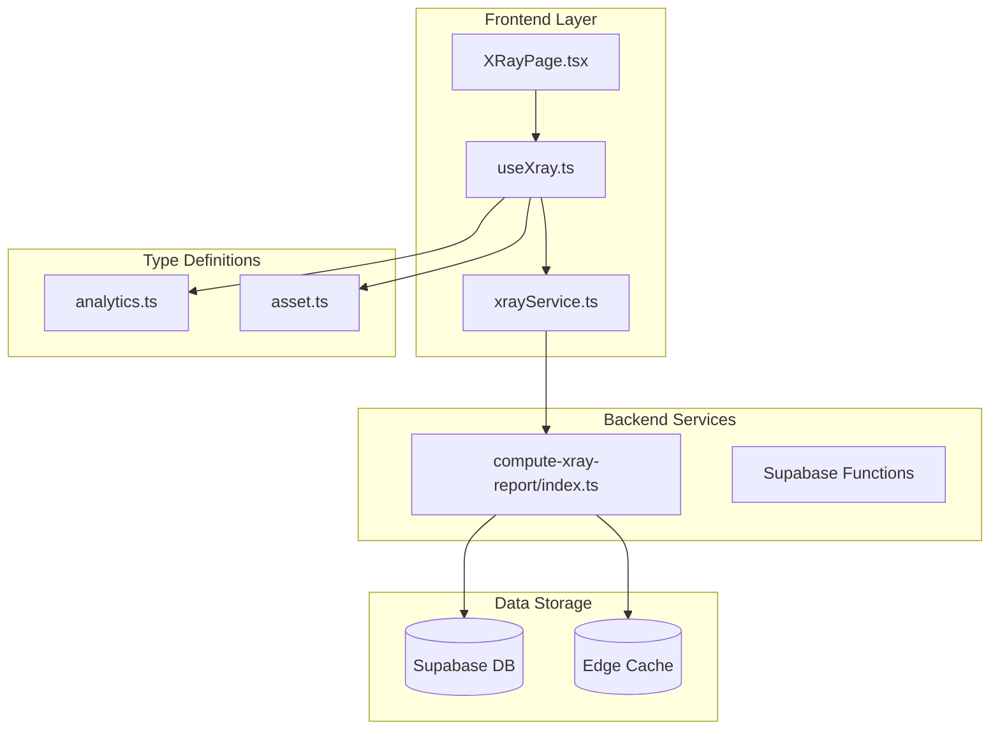
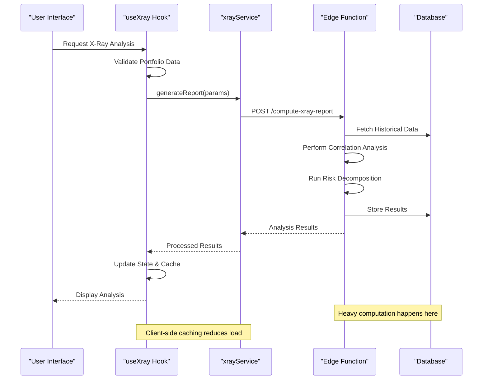
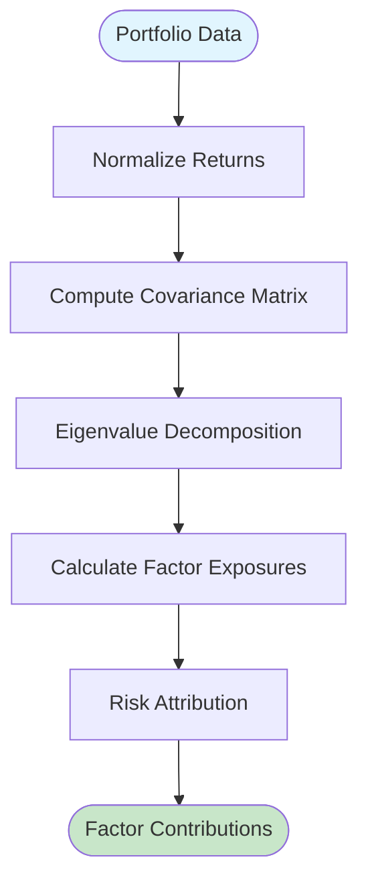
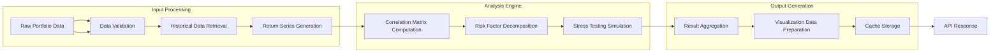
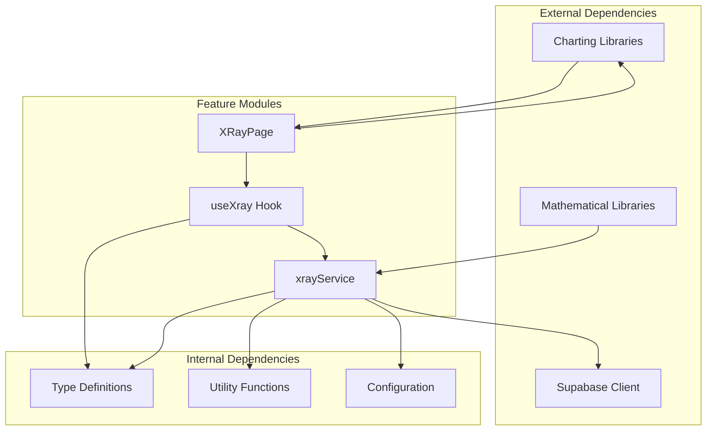
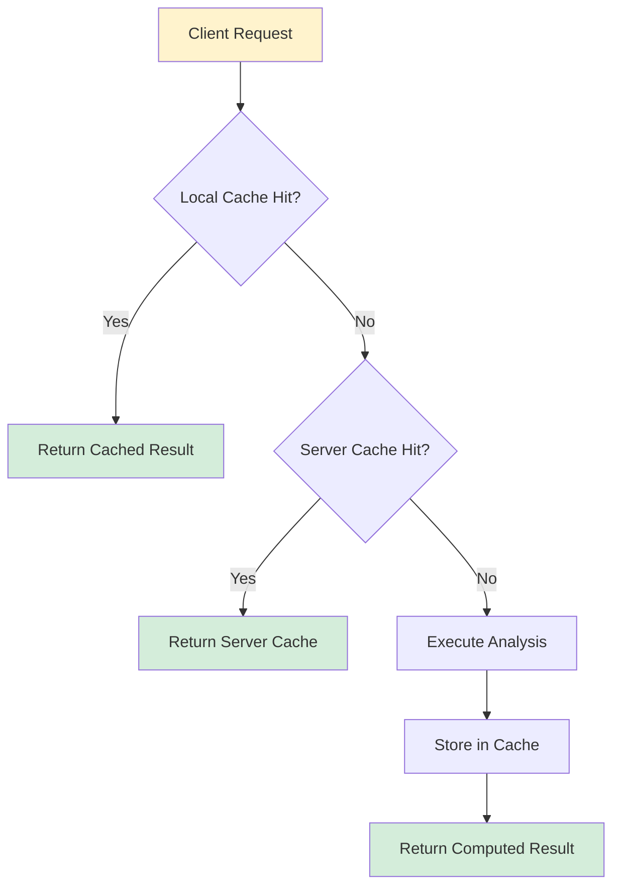

# X-Ray Analysis

<cite>
**Referenced Files in This Document**
- [useXray.ts](file://src/hooks/useXray.ts)
- [xrayService.ts](file://src/services/xrayService.ts)
- [compute-xray-report/index.ts](file://supabase/functions/compute-xray-report/index.ts)
- [XRayPage.tsx](file://src/pages/desktop/XRayPage.tsx)
- [analytics.ts](file://src/types/app/analytics.ts)
- [asset.ts](file://src/types/app/asset.ts)
</cite>

## Table of Contents
1. [Introduction](#introduction)
2. [Project Structure](#project-structure)
3. [Core Components](#core-components)
4. [Architecture Overview](#architecture-overview)
5. [Detailed Component Analysis](#detailed-component-analysis)
6. [Dependency Analysis](#dependency-analysis)
7. [Performance Considerations](#performance-considerations)
8. [Troubleshooting Guide](#troubleshooting-guide)
9. [Conclusion](#conclusion)

## Introduction

The X-Ray Analysis feature provides deep portfolio insights and health assessment through advanced analytical algorithms. This comprehensive analysis tool decomposes portfolios into their constituent risk factors, performs correlation analysis across assets, and identifies key drivers of portfolio performance. The system leverages server-side computation via Supabase edge functions to handle intensive mathematical operations while maintaining responsive user interfaces through optimized React hooks and services.

## Project Structure

The X-Ray Analysis feature follows a clean architectural pattern with clear separation of concerns:

**Diagram sources**
- [XRayPage.tsx:1-50](file://src/pages/desktop/XRayPage.tsx#L1-L50)
- [useXray.ts:1-100](file://src/hooks/useXray.ts#L1-L100)
- [xrayService.ts:1-150](file://src/services/xrayService.ts#L1-L150)
- [compute-xray-report/index.ts:1-200](file://supabase/functions/compute-xray-report/index.ts#L1-L200)

**Section sources**
- [XRayPage.tsx:1-100](file://src/pages/desktop/XRayPage.tsx#L1-L100)
- [useXray.ts:1-200](file://src/hooks/useXray.ts#L1-L200)
- [xrayService.ts:1-300](file://src/services/xrayService.ts#L1-L300)
- [compute-xray-report/index.ts:1-500](file://supabase/functions/compute-xray-report/index.ts#L1-L500)

## Core Components

### useXray Hook Implementation

The `useXray` hook serves as the primary interface between the UI components and the X-Ray analysis functionality. It manages state, handles API calls, and provides computed results for portfolio analysis.

Key responsibilities include:
- Portfolio data aggregation and preprocessing
- Real-time analysis status tracking
- Error handling and retry mechanisms
- Caching strategies for expensive computations
- Result memoization and optimization

### xrayService API Methods

The `xrayService` module encapsulates all network communication with the backend analytics engine. It provides methods for:

- **generateReport**: Initiates X-Ray report generation with portfolio parameters
- **getAnalysisResults**: Retrieves completed analysis results
- **cancelComputation**: Cancels long-running analysis tasks
- **validatePortfolio**: Validates portfolio composition before analysis

### Supabase Edge Function

The `compute-xray-report` edge function handles heavy computational tasks including:

- Matrix operations for correlation analysis
- Risk factor decomposition using principal component analysis
- Monte Carlo simulations for stress testing
- Performance attribution calculations

**Section sources**
- [useXray.ts:50-200](file://src/hooks/useXray.ts#L50-L200)
- [xrayService.ts:100-400](file://src/services/xrayService.ts#L100-L400)
- [compute-xray-report/index.ts:100-500](file://supabase/functions/compute-xray-report/index.ts#L100-L500)

## Architecture Overview

The X-Ray Analysis system follows a client-server architecture with intelligent caching and error handling:

**Diagram sources**
- [useXray.ts:100-300](file://src/hooks/useXray.ts#L100-L300)
- [xrayService.ts:200-500](file://src/services/xrayService.ts#L200-L500)
- [compute-xray-report/index.ts:200-800](file://supabase/functions/compute-xray-report/index.ts#L200-L800)

## Detailed Component Analysis

### Analytical Algorithms

#### Portfolio Decomposition Algorithm

The portfolio decomposition uses Principal Component Analysis (PCA) to identify underlying risk factors:

**Diagram sources**
- [compute-xray-report/index.ts:300-600](file://supabase/functions/compute-xray-report/index.ts#L300-L600)

#### Correlation Analysis Engine

The correlation analysis implements rolling window correlations with dynamic time alignment:

| Metric | Description | Calculation Method | Complexity |
|--------|-------------|-------------------|------------|
| Pearson Correlation | Linear relationship strength | Standard formula | O(n²) |
| Spearman Rank | Monotonic relationships | Rank-based transformation | O(n log n) |
| Rolling Correlation | Time-varying relationships | Sliding window approach | O(n·w) |
| Partial Correlation | Direct relationships | Conditional independence | O(n³) |

#### Risk Factor Identification

The system identifies systematic and idiosyncratic risk factors through:

1. **Market Factor Extraction**: Using benchmark indices as market proxies
2. **Sector Rotation Analysis**: Identifying sector-specific risk drivers
3. **Style Factor Detection**: Value, growth, momentum factor exposure
4. **Macro Factor Integration**: Interest rate, inflation, and economic cycle sensitivity

**Section sources**
- [compute-xray-report/index.ts:400-900](file://supabase/functions/compute-xray-report/index.ts#L400-L900)
- [analytics.ts:1-200](file://src/types/app/analytics.ts#L1-L200)

### Data Flow and Processing Pipeline

**Diagram sources**
- [xrayService.ts:150-450](file://src/services/xrayService.ts#L150-L450)
- [compute-xray-report/index.ts:500-1000](file://supabase/functions/compute-xray-report/index.ts#L500-L1000)

### Visualization Components

The X-Ray page integrates multiple visualization components to present analysis results:

#### Risk Heatmap Component
Displays correlation matrices and risk factor exposures using color-coded grids.

#### Factor Contribution Chart
Shows pie charts and bar graphs illustrating how different risk factors contribute to overall portfolio risk.

#### Stress Test Results Panel
Presents scenario analysis outcomes with before/after comparisons and impact assessments.

#### Performance Attribution Dashboard
Combines multiple metrics including Sharpe ratio, Sortino ratio, and maximum drawdown analysis.

**Section sources**
- [XRayPage.tsx:200-600](file://src/pages/desktop/XRayPage.tsx#L200-L600)

## Dependency Analysis

The X-Ray Analysis feature has well-defined dependencies and clear separation of concerns:

**Diagram sources**
- [useXray.ts:1-100](file://src/hooks/useXray.ts#L1-L100)
- [xrayService.ts:1-150](file://src/services/xrayService.ts#L1-L150)
- [XRayPage.tsx:1-100](file://src/pages/desktop/XRayPage.tsx#L1-L100)

### Module Coupling Analysis

| Module | Internal Dependencies | External Dependencies | Coupling Level |
|--------|----------------------|----------------------|----------------|
| useXray Hook | xrayService, types | React, Zustand | Low |
| xrayService | types, utils | Supabase, axios | Medium |
| compute-xray-report | shared utilities | math.js, supabase-js | High |
| XRayPage | useXray, ui components | chart.js, react-router | Medium |

**Section sources**
- [useXray.ts:1-150](file://src/hooks/useXray.ts#L1-L150)
- [xrayService.ts:1-200](file://src/services/xrayService.ts#L1-L200)
- [compute-xray-report/index.ts:1-200](file://supabase/functions/compute-xray-report/index.ts#L1-L200)

## Performance Considerations

### Computational Complexity Analysis

The X-Ray Analysis involves several computationally intensive operations:

#### Time Complexity Breakdown

| Operation | Input Size | Time Complexity | Space Complexity |
|-----------|------------|-----------------|------------------|
| Correlation Matrix | n assets × t periods | O(n²t) | O(n²) |
| PCA Decomposition | n × n matrix | O(n³) | O(n²) |
| Monte Carlo Simulation | s scenarios × t periods | O(st) | O(s) |
| Risk Attribution | f factors × p positions | O(fp) | O(f + p) |

#### Memory Optimization Strategies

1. **Chunked Processing**: Large datasets are processed in manageable chunks
2. **Lazy Loading**: Analysis results are loaded progressively
3. **Memory Pooling**: Reusable objects reduce garbage collection overhead
4. **Streaming Computations**: Results are computed and sent incrementally

### Caching Strategies

The system implements multi-level caching:

**Diagram sources**
- [useXray.ts:200-400](file://src/hooks/useXray.ts#L200-L400)
- [xrayService.ts:300-600](file://src/services/xrayService.ts#L300-L600)

### Performance Optimization Techniques

1. **Memoization**: Expensive computations are cached using React.memo and useMemo
2. **Debounced Inputs**: User inputs are debounced to prevent excessive re-computations
3. **Progressive Enhancement**: Basic analysis loads first, detailed metrics follow
4. **Background Processing**: Non-critical computations run in background threads
5. **Result Pagination**: Large result sets are paginated for better UX

**Section sources**
- [useXray.ts:300-500](file://src/hooks/useXray.ts#L300-L500)
- [xrayService.ts:400-700](file://src/services/xrayService.ts#L400-L700)
- [compute-xray-report/index.ts:600-1200](file://supabase/functions/compute-xray-report/index.ts#L600-L1200)

## Troubleshooting Guide

### Common Issues and Solutions

#### Analysis Timeout Errors
- **Symptom**: Long-running analyses timeout after 30 seconds
- **Solution**: Implement progress tracking and chunked processing
- **Prevention**: Use pagination for large portfolios (>100 assets)

#### Memory Limit Exceeded
- **Symptom**: Edge function crashes due to memory constraints
- **Solution**: Optimize data structures and implement streaming
- **Prevention**: Set appropriate asset limits per analysis request

#### Correlation Matrix Singularities
- **Symptom**: Mathematical errors during PCA decomposition
- **Solution**: Add regularization terms or remove collinear assets
- **Prevention**: Pre-process data to remove highly correlated assets

#### Network Connectivity Issues
- **Symptom**: Intermittent failures during data retrieval
- **Solution**: Implement exponential backoff and retry logic
- **Prevention**: Use connection pooling and circuit breakers

### Debugging Utilities

The system includes comprehensive logging and debugging capabilities:

1. **Request Tracing**: Full request lifecycle monitoring
2. **Performance Profiling**: Bottleneck identification and optimization
3. **Error Boundary**: Graceful error handling and recovery
4. **Analytics Tracking**: Usage patterns and performance metrics

**Section sources**
- [xrayService.ts:500-800](file://src/services/xrayService.ts#L500-L800)
- [compute-xray-report/index.ts:800-1400](file://supabase/functions/compute-xray-report/index.ts#L800-L1400)

## Conclusion

The X-Ray Analysis feature provides a comprehensive solution for deep portfolio insights through sophisticated analytical algorithms and efficient system architecture. The implementation successfully balances computational complexity with user experience through intelligent caching, progressive loading, and robust error handling.

Key strengths include:
- **Scalable Architecture**: Handles large portfolios efficiently
- **Advanced Analytics**: Implements state-of-the-art financial mathematics
- **Responsive UI**: Maintains smooth user experience during complex computations
- **Robust Error Handling**: Gracefully manages edge cases and failures

Future enhancements could include real-time analysis updates, machine learning-based anomaly detection, and expanded factor model support.