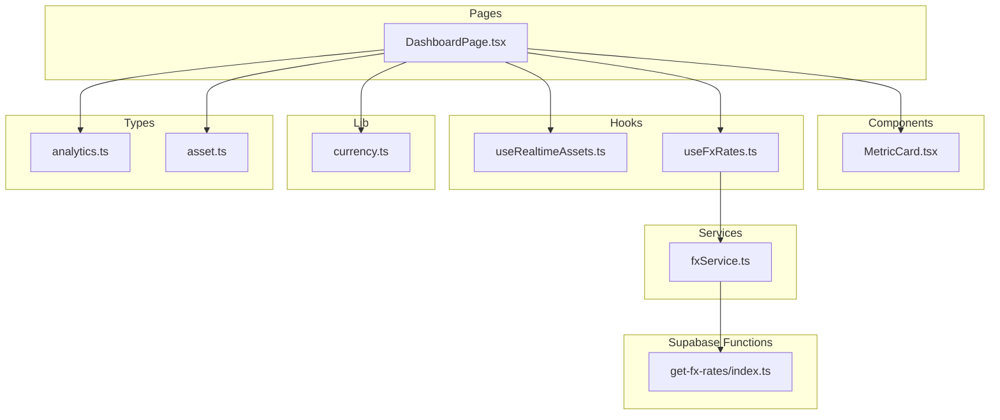
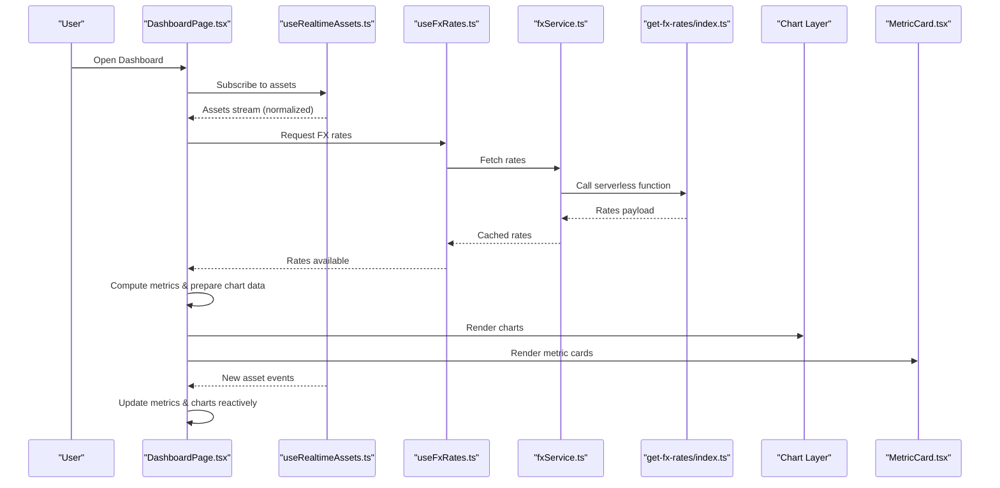
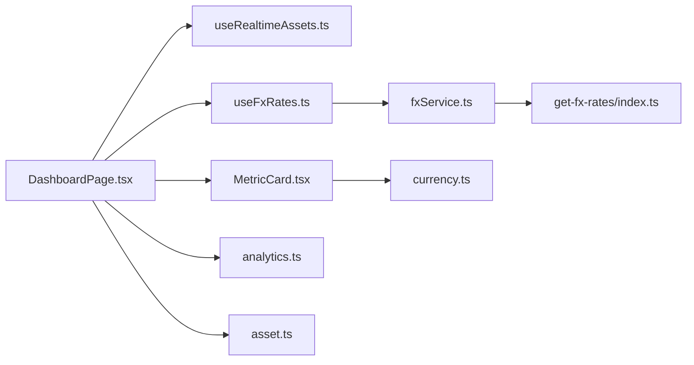

# Analytics Dashboard

<cite>
**Referenced Files in This Document**
- [DashboardPage.tsx](file://src/pages/desktop/DashboardPage.tsx)
- [MetricCard.tsx](file://src/components/desktop/MetricCard.tsx)
- [useRealtimeAssets.ts](file://src/hooks/useRealtimeAssets.ts)
- [useFxRates.ts](file://src/hooks/useFxRates.ts)
- [currency.ts](file://src/lib/currency.ts)
- [analytics.ts](file://src/types/app/analytics.ts)
- [asset.ts](file://src/types/app/asset.ts)
- [fxService.ts](file://src/services/fxService.ts)
- [get-fx-rates/index.ts](file://supabase/functions/get-fx-rates/index.ts)
</cite>

## Table of Contents
1. [Introduction](#introduction)
2. [Project Structure](#project-structure)
3. [Core Components](#core-components)
4. [Architecture Overview](#architecture-overview)
5. [Detailed Component Analysis](#detailed-component-analysis)
6. [Dependency Analysis](#dependency-analysis)
7. [Performance Considerations](#performance-considerations)
8. [Troubleshooting Guide](#troubleshooting-guide)
9. [Conclusion](#conclusion)
10. [Appendices](#appendices)

## Introduction
This document explains the Analytics Dashboard feature that provides real-time portfolio visualization and performance metrics. It covers dashboard layout, metric calculations, chart visualizations, and real-time data updates. It documents the useRealtimeAssets hook, MetricCard component, and currency conversion utilities. It also includes examples for creating custom metrics, configuring charts, and implementing responsive design patterns. Finally, it addresses performance optimization for large datasets, caching strategies, and real-time subscription management.

## Project Structure
The Analytics Dashboard is implemented as a page-level component that composes reusable UI components and hooks:
- Page entry point orchestrates data fetching, subscriptions, and rendering.
- MetricCard renders individual KPIs with formatting and optional tooltips.
- Real-time assets are provided by a dedicated hook that manages subscriptions and state.
- Currency conversion uses a service layer backed by a serverless function for FX rates.
- Shared types define analytics models and asset structures used across the dashboard.

**Diagram sources**
- [DashboardPage.tsx](file://src/pages/desktop/DashboardPage.tsx)
- [MetricCard.tsx](file://src/components/desktop/MetricCard.tsx)
- [useRealtimeAssets.ts](file://src/hooks/useRealtimeAssets.ts)
- [useFxRates.ts](file://src/hooks/useFxRates.ts)
- [fxService.ts](file://src/services/fxService.ts)
- [get-fx-rates/index.ts](file://supabase/functions/get-fx-rates/index.ts)
- [currency.ts](file://src/lib/currency.ts)
- [analytics.ts](file://src/types/app/analytics.ts)
- [asset.ts](file://src/types/app/asset.ts)

**Section sources**
- [DashboardPage.tsx](file://src/pages/desktop/DashboardPage.tsx)
- [MetricCard.tsx](file://src/components/desktop/MetricCard.tsx)
- [useRealtimeAssets.ts](file://src/hooks/useRealtimeAssets.ts)
- [useFxRates.ts](file://src/hooks/useFxRates.ts)
- [fxService.ts](file://src/services/fxService.ts)
- [get-fx-rates/index.ts](file://supabase/functions/get-fx-rates/index.ts)
- [currency.ts](file://src/lib/currency.ts)
- [analytics.ts](file://src/types/app/analytics.ts)
- [asset.ts](file://src/types/app/asset.ts)

## Core Components
- DashboardPage: Orchestrates real-time asset data, FX rates, and renders the dashboard layout including metric cards and charts. It subscribes to live updates and computes derived metrics for display.
- MetricCard: A presentational component that displays a single metric value with label, unit, and optional trend indicators. It formats numbers and currencies consistently and supports responsive sizing.
- useRealtimeAssets: A React hook that subscribes to asset changes (e.g., via Supabase realtime), normalizes incoming data, and exposes a stable interface for components to consume current portfolio state.
- useFxRates: A React hook that fetches and caches exchange rates from the FX service and provides them to consumers for multi-currency conversions.
- fxService: Encapsulates calls to the backend FX endpoint and handles error cases and retries.
- get-fx-rates: Serverless function that retrieves or computes FX rates and returns normalized data.
- currency: Utility functions for formatting, parsing, and converting between currencies using provided rates.
- Types: analytics.ts defines metric shapes and chart data models; asset.ts defines asset entities consumed by the dashboard.

Key responsibilities:
- Data acquisition and normalization (useRealtimeAssets, fxService).
- Presentation and formatting (MetricCard, currency).
- Composition and orchestration (DashboardPage).
- Type safety and contracts (analytics.ts, asset.ts).

**Section sources**
- [DashboardPage.tsx](file://src/pages/desktop/DashboardPage.tsx)
- [MetricCard.tsx](file://src/components/desktop/MetricCard.tsx)
- [useRealtimeAssets.ts](file://src/hooks/useRealtimeAssets.ts)
- [useFxRates.ts](file://src/hooks/useFxRates.ts)
- [fxService.ts](file://src/services/fxService.ts)
- [get-fx-rates/index.ts](file://supabase/functions/get-fx-rates/index.ts)
- [currency.ts](file://src/lib/currency.ts)
- [analytics.ts](file://src/types/app/analytics.ts)
- [asset.ts](file://src/types/app/asset.ts)

## Architecture Overview
The dashboard follows a reactive architecture:
- The page subscribes to real-time asset updates through useRealtimeAssets.
- FX rates are fetched on demand and cached via useFxRates and fxService.
- Derived metrics are computed locally from normalized assets and FX rates.
- Charts render time-series or categorical data based on prepared datasets.
- MetricCard components present key figures with consistent formatting.

**Diagram sources**
- [DashboardPage.tsx](file://src/pages/desktop/DashboardPage.tsx)
- [useRealtimeAssets.ts](file://src/hooks/useRealtimeAssets.ts)
- [useFxRates.ts](file://src/hooks/useFxRates.ts)
- [fxService.ts](file://src/services/fxService.ts)
- [get-fx-rates/index.ts](file://supabase/functions/get-fx-rates/index.ts)
- [MetricCard.tsx](file://src/components/desktop/MetricCard.tsx)

## Detailed Component Analysis

### DashboardPage Layout and Orchestration
Responsibilities:
- Initialize subscriptions for assets and FX rates.
- Normalize and aggregate asset data into metrics and chart inputs.
- Compose MetricCard instances and chart components.
- Handle loading, error, and empty states.
- Manage responsive behavior and user interactions.

Data flow:
- Subscriptions provide incremental updates.
- FX rates enable multi-currency aggregation.
- Derived metrics feed both MetricCard and chart layers.

Best practices:
- Memoize expensive computations over large datasets.
- Debounce or throttle frequent updates if needed.
- Separate concerns: data preparation vs. presentation.

**Section sources**
- [DashboardPage.tsx](file://src/pages/desktop/DashboardPage.tsx)

### useRealtimeAssets Hook
Purpose:
- Subscribe to asset changes and expose a stable dataset to consumers.
- Normalize incoming records to a consistent shape.
- Provide lifecycle control (subscribe/unsubscribe) and error handling.

Behavior:
- Establishes a subscription when mounted.
- Emits updated snapshots on change events.
- Maintains local cache to avoid redundant processing.
- Exposes methods to filter/sort or request specific slices.

Integration points:
- Consumed by DashboardPage to drive metrics and charts.
- Compatible with analytics.ts and asset.ts type contracts.

Optimization tips:
- Use selectors to derive only what is needed.
- Avoid re-rendering unrelated components by memoization.
- Implement pagination or virtualization for very large lists.

**Section sources**
- [useRealtimeAssets.ts](file://src/hooks/useRealtimeAssets.ts)
- [analytics.ts](file://src/types/app/analytics.ts)
- [asset.ts](file://src/types/app/asset.ts)

### MetricCard Component
Purpose:
- Display a single metric with label, value, unit, and optional trend indicator.
- Format values consistently (numbers, percentages, currencies).
- Support responsive sizing and accessibility attributes.

Props and behavior:
- Value and unit configuration.
- Optional delta or comparison against previous period.
- Tooltip or drill-down actions.
- Skeleton loading state while data is pending.

Formatting:
- Uses currency utilities for locale-aware formatting.
- Applies rounding rules and significant digits appropriate for financial data.

Accessibility:
- Semantic labels and aria attributes for screen readers.
- Keyboard navigable when interactive.

**Section sources**
- [MetricCard.tsx](file://src/components/desktop/MetricCard.tsx)
- [currency.ts](file://src/lib/currency.ts)

### Currency Conversion Utilities
Scope:
- Formatting currency values with correct symbols and decimals.
- Converting amounts between currencies using provided FX rates.
- Parsing localized strings back to numeric values when necessary.

FX integration:
- Relies on rates supplied by useFxRates and fxService.
- Handles missing or stale rates gracefully with fallbacks.

Usage patterns:
- Centralized formatting helpers for consistent UX.
- Batch conversion for bulk operations to minimize lookups.

**Section sources**
- [currency.ts](file://src/lib/currency.ts)
- [useFxRates.ts](file://src/hooks/useFxRates.ts)
- [fxService.ts](file://src/services/fxService.ts)
- [get-fx-rates/index.ts](file://supabase/functions/get-fx-rates/index.ts)

### FX Service and Serverless Function
Responsibilities:
- fxService: Encapsulates HTTP calls to the FX endpoint, retries, and error mapping.
- get-fx-rates: Retrieves or computes exchange rates and returns normalized payloads.

Caching strategy:
- Client-side caching via useFxRates to reduce network requests.
- Stale-while-revalidate pattern to keep UI responsive.

Error handling:
- Graceful degradation when rates are unavailable.
- Clear error messages and retry logic.

**Section sources**
- [fxService.ts](file://src/services/fxService.ts)
- [get-fx-rates/index.ts](file://supabase/functions/get-fx-rates/index.ts)
- [useFxRates.ts](file://src/hooks/useFxRates.ts)

## Dependency Analysis
High-level dependencies:
- DashboardPage depends on useRealtimeAssets and useFxRates for data.
- MetricCard depends on currency utilities for formatting.
- useFxRates depends on fxService which calls the serverless function.
- Types in analytics.ts and asset.ts define contracts across modules.

**Diagram sources**
- [DashboardPage.tsx](file://src/pages/desktop/DashboardPage.tsx)
- [useRealtimeAssets.ts](file://src/hooks/useRealtimeAssets.ts)
- [useFxRates.ts](file://src/hooks/useFxRates.ts)
- [fxService.ts](file://src/services/fxService.ts)
- [get-fx-rates/index.ts](file://supabase/functions/get-fx-rates/index.ts)
- [MetricCard.tsx](file://src/components/desktop/MetricCard.tsx)
- [currency.ts](file://src/lib/currency.ts)
- [analytics.ts](file://src/types/app/analytics.ts)
- [asset.ts](file://src/types/app/asset.ts)

**Section sources**
- [DashboardPage.tsx](file://src/pages/desktop/DashboardPage.tsx)
- [useRealtimeAssets.ts](file://src/hooks/useRealtimeAssets.ts)
- [useFxRates.ts](file://src/hooks/useFxRates.ts)
- [fxService.ts](file://src/services/fxService.ts)
- [get-fx-rates/index.ts](file://supabase/functions/get-fx-rates/index.ts)
- [MetricCard.tsx](file://src/components/desktop/MetricCard.tsx)
- [currency.ts](file://src/lib/currency.ts)
- [analytics.ts](file://src/types/app/analytics.ts)
- [asset.ts](file://src/types/app/asset.ts)

## Performance Considerations
- Large datasets:
  - Use virtualization or windowing for long lists.
  - Pre-aggregate data on the client where possible.
  - Memoize derived metrics and chart datasets.
- Real-time updates:
  - Coalesce rapid updates to batch re-renders.
  - Limit subscriptions to necessary fields.
  - Debounce heavy computations triggered by frequent updates.
- Caching:
  - Cache FX rates with TTL and background refresh.
  - Cache normalized assets per view to avoid recomputation.
- Rendering:
  - Split heavy charts into separate components with their own memoization.
  - Use lightweight placeholders during initial load.
- Network:
  - Retry with exponential backoff for FX requests.
  - Prefer server-side normalization when feasible.

[No sources needed since this section provides general guidance]

## Troubleshooting Guide
Common issues and resolutions:
- Missing FX rates:
  - Verify serverless function availability and response format.
  - Check client-side caching and fallback behavior.
- Real-time not updating:
  - Ensure subscription is active and not unsubscribed prematurely.
  - Validate event payloads match expected schema.
- Formatting inconsistencies:
  - Confirm currency codes and locales are correctly passed.
  - Validate number precision and rounding rules.
- Performance regressions:
  - Profile re-renders and identify unnecessary recalculations.
  - Inspect memory usage for large datasets and consider virtualization.

**Section sources**
- [fxService.ts](file://src/services/fxService.ts)
- [get-fx-rates/index.ts](file://supabase/functions/get-fx-rates/index.ts)
- [useRealtimeAssets.ts](file://src/hooks/useRealtimeAssets.ts)
- [currency.ts](file://src/lib/currency.ts)

## Conclusion
The Analytics Dashboard combines real-time asset streaming, robust FX conversion, and clear metric presentation to deliver actionable insights. By separating data acquisition, computation, and presentation, the system remains maintainable and performant. Following the recommended patterns for caching, subscription management, and responsive design ensures a smooth experience even under heavy data loads.

[No sources needed since this section summarizes without analyzing specific files]

## Appendices

### Examples and Recipes

- Custom metric creation:
  - Define a new metric shape in analytics.ts.
  - Compute the metric from normalized assets in DashboardPage.
  - Add a corresponding MetricCard instance with formatted output.

- Chart configuration:
  - Prepare time-series or categorical datasets from aggregated assets.
  - Configure chart options (axes, colors, tooltips) within the chart component.
  - Memoize chart data to prevent unnecessary redraws.

- Responsive design patterns:
  - Use flexible grid layouts and adaptive typography.
  - Adjust chart density and card sizes based on viewport.
  - Provide progressive disclosure for complex details on small screens.

- Real-time subscription management:
  - Centralize subscription lifecycle in useRealtimeAssets.
  - Reconnect on errors and handle partial updates safely.
  - Throttle or coalesce updates to avoid jank.

- Caching strategies:
  - Apply stale-while-revalidate for FX rates.
  - Persist last known good state for resilience.
  - Invalidate caches on explicit user actions or config changes.

[No sources needed since this section provides general guidance]