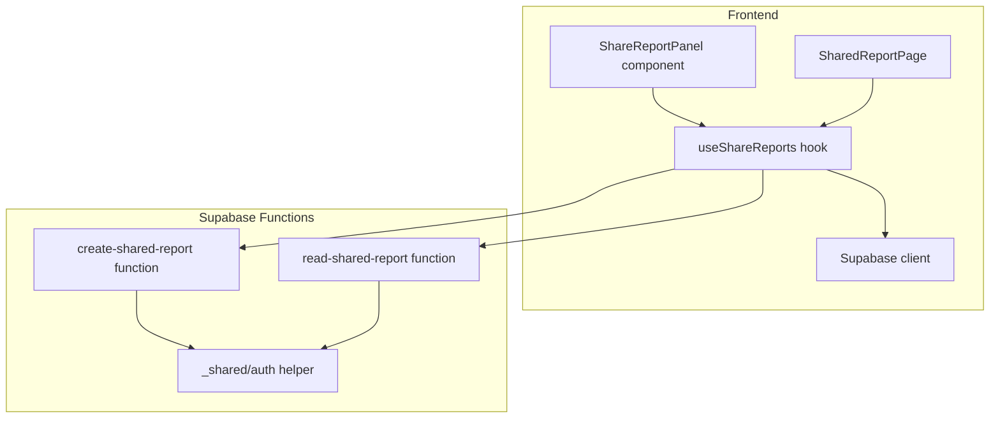
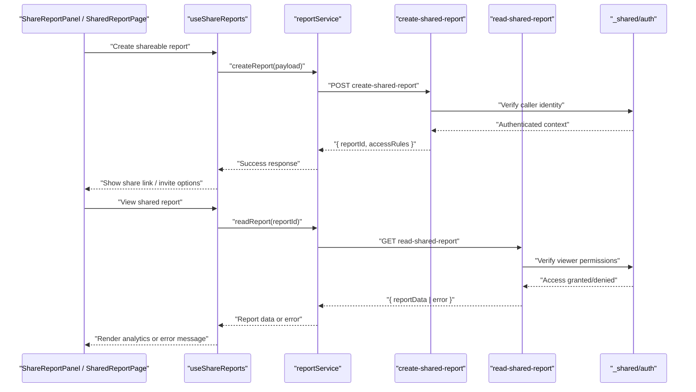
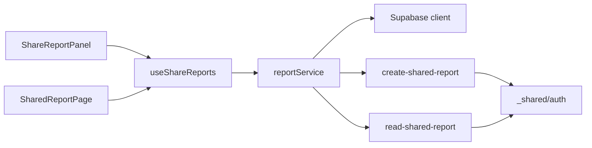

# Collaboration Features

<cite>
**Referenced Files in This Document**
- [useShareReports.ts](file://src/hooks/useShareReports.ts)
- [reportService.ts](file://src/services/reportService.ts)
- [create-shared-report/index.ts](file://supabase/functions/create-shared-report/index.ts)
- [read-shared-report/index.ts](file://supabase/functions/read-shared-report/index.ts)
- [SharedReportPage.tsx](file://src/pages/desktop/SharedReportPage.tsx)
- [ShareReportPanel.tsx](file://src/components/desktop/ShareReportPanel.tsx)
- [client.ts](file://src/integrations/supabase/client.ts)
- [auth.ts](file://supabase/functions/_shared/auth.ts)
</cite>

## Table of Contents
1. [Introduction](#introduction)
2. [Project Structure](#project-structure)
3. [Core Components](#core-components)
4. [Architecture Overview](#architecture-overview)
5. [Detailed Component Analysis](#detailed-component-analysis)
6. [Dependency Analysis](#dependency-analysis)
7. [Performance Considerations](#performance-considerations)
8. [Troubleshooting Guide](#troubleshooting-guide)
9. [Conclusion](#conclusion)
10. [Appendices](#appendices)

## Introduction
This document explains the collaboration features that enable shared reporting and team-based portfolio management. It covers how reports are created, shared, and accessed with fine-grained permissions; how real-time collaboration is implemented; and how report versioning can be approached. The documentation focuses on the useShareReports hook, the report service layer, and Supabase functions for report management, along with UI components that expose sharing workflows to users.

## Project Structure
The collaboration feature spans frontend hooks, services, pages, and Supabase serverless functions:
- Frontend hook: useShareReports manages state and interactions for sharing and viewing reports.
- Service layer: reportService encapsulates API calls to Supabase functions for creating and reading shared reports.
- Supabase functions: create-shared-report and read-shared-report implement backend logic for permission checks and data retrieval.
- UI components: ShareReportPanel provides a user interface for sharing, while SharedReportPage renders shared analytics for viewers.
- Supabase client: client.ts configures the Supabase connection used by both frontend and functions.
- Shared auth helper: _shared/auth.ts centralizes authentication utilities used across functions.

**Diagram sources**
- [useShareReports.ts](file://src/hooks/useShareReports.ts)
- [reportService.ts](file://src/services/reportService.ts)
- [create-shared-report/index.ts](file://supabase/functions/create-shared-report/index.ts)
- [read-shared-report/index.ts](file://supabase/functions/read-shared-report/index.ts)
- [SharedReportPage.tsx](file://src/pages/desktop/SharedReportPage.tsx)
- [ShareReportPanel.tsx](file://src/components/desktop/ShareReportPanel.tsx)
- [client.ts](file://src/integrations/supabase/client.ts)
- [auth.ts](file://supabase/functions/_shared/auth.ts)

**Section sources**
- [useShareReports.ts](file://src/hooks/useShareReports.ts)
- [reportService.ts](file://src/services/reportService.ts)
- [create-shared-report/index.ts](file://supabase/functions/create-shared-report/index.ts)
- [read-shared-report/index.ts](file://supabase/functions/read-shared-report/index.ts)
- [SharedReportPage.tsx](file://src/pages/desktop/SharedReportPage.tsx)
- [ShareReportPanel.tsx](file://src/components/desktop/ShareReportPanel.tsx)
- [client.ts](file://src/integrations/supabase/client.ts)
- [auth.ts](file://supabase/functions/_shared/auth.ts)

## Core Components
- useShareReports hook: Provides methods to create shareable reports, manage access permissions, and fetch shared report data. It integrates with the report service layer and handles loading/error states for collaborative flows.
- reportService: Encapsulates calls to Supabase functions for creating and reading shared reports, standardizing payloads and responses across the app.
- create-shared-report function: Validates ownership, enforces permissions, and persists report metadata and access rules.
- read-shared-report function: Verifies viewer permissions and returns report data or an error if access is denied.
- ShareReportPanel: UI for initiating sharing, inviting collaborators, and managing permissions.
- SharedReportPage: Renders shared analytics for authorized viewers using data fetched via the hook.

**Section sources**
- [useShareReports.ts](file://src/hooks/useShareReports.ts)
- [reportService.ts](file://src/services/reportService.ts)
- [create-shared-report/index.ts](file://supabase/functions/create-shared-report/index.ts)
- [read-shared-report/index.ts](file://supabase/functions/read-shared-report/index.ts)
- [ShareReportPanel.tsx](file://src/components/desktop/ShareReportPanel.tsx)
- [SharedReportPage.tsx](file://src/pages/desktop/SharedReportPage.tsx)

## Architecture Overview
The collaboration architecture follows a clear separation between UI, client-side orchestration, and serverless functions:
- UI components trigger actions through the useShareReports hook.
- The hook delegates operations to reportService, which communicates with Supabase functions.
- Supabase functions enforce security policies and return structured results to the client.

**Diagram sources**
- [useShareReports.ts](file://src/hooks/useShareReports.ts)
- [reportService.ts](file://src/services/reportService.ts)
- [create-shared-report/index.ts](file://supabase/functions/create-shared-report/index.ts)
- [read-shared-report/index.ts](file://supabase/functions/read-shared-report/index.ts)
- [auth.ts](file://supabase/functions/_shared/auth.ts)
- [ShareReportPanel.tsx](file://src/components/desktop/ShareReportPanel.tsx)
- [SharedReportPage.tsx](file://src/pages/desktop/SharedReportPage.tsx)

## Detailed Component Analysis

### useShareReports Hook
Responsibilities:
- Exposes functions to create shareable reports and fetch shared report data.
- Manages local state for loading, errors, and success feedback.
- Integrates with reportService to call Supabase functions.
- Handles permission-related outcomes (e.g., unauthorized access).

Usage patterns:
- Creating a shareable report: invoke the creation method from UI components; handle success to display share links or invitation controls.
- Viewing a shared report: pass the report identifier to the read method; render analytics when authorized, otherwise show an error.

Error handling:
- Distinguishes between network errors, permission denials, and invalid identifiers.
- Provides user-friendly messages and recovery suggestions.

Real-time considerations:
- If real-time updates are needed, integrate Supabase subscriptions within the hook to refresh data upon changes.

**Section sources**
- [useShareReports.ts](file://src/hooks/useShareReports.ts)
- [reportService.ts](file://src/services/reportService.ts)

### Report Service Layer
Responsibilities:
- Centralizes all calls to Supabase functions for report management.
- Normalizes request payloads and response shapes.
- Encapsulates error transformation and retry strategies where applicable.

Key operations:
- createReport: Sends payload to create-shared-report function.
- readReport: Requests report data from read-shared-report function.

Security integration:
- Ensures authenticated context is passed appropriately to functions.
- Enforces consistent error handling for authorization failures.

**Section sources**
- [reportService.ts](file://src/services/reportService.ts)
- [client.ts](file://src/integrations/supabase/client.ts)

### Supabase Functions

#### create-shared-report Function
Purpose:
- Creates a new shareable report with defined access rules.
- Validates ownership and permissions before persisting metadata.

Workflow:
- Authenticate caller using _shared/auth helper.
- Validate input parameters and ownership.
- Persist report metadata and access rules.
- Return report identifier and share configuration.

Security considerations:
- Enforce role-based access control.
- Sanitize inputs to prevent injection or misuse.

**Section sources**
- [create-shared-report/index.ts](file://supabase/functions/create-shared-report/index.ts)
- [auth.ts](file://supabase/functions/_shared/auth.ts)

#### read-shared-report Function
Purpose:
- Retrieves report data for authorized viewers.
- Validates viewer permissions based on report access rules.

Workflow:
- Authenticate viewer using _shared/auth helper.
- Check permissions against stored access rules.
- Return report data if authorized; otherwise, return an error.

Security considerations:
- Prevent unauthorized data exposure.
- Log access attempts for auditing.

**Section sources**
- [read-shared-report/index.ts](file://supabase/functions/read-shared-report/index.ts)
- [auth.ts](file://supabase/functions/_shared/auth.ts)

### UI Components

#### ShareReportPanel
Responsibilities:
- Provides a user interface for initiating sharing workflows.
- Allows selecting collaborators and setting permissions.
- Displays share links and status indicators.

User flow:
- User selects a report and opens the panel.
- Chooses collaborators and permission levels.
- Submits sharing settings; receives confirmation and share link.

**Section sources**
- [ShareReportPanel.tsx](file://src/components/desktop/ShareReportPanel.tsx)
- [useShareReports.ts](file://src/hooks/useShareReports.ts)

#### SharedReportPage
Responsibilities:
- Renders shared analytics for authorized viewers.
- Fetches report data via useShareReports and displays insights.
- Handles errors and redirects for unauthorized access.

User flow:
- Viewer navigates to a shared report URL.
- Hook validates access and loads report data.
- Page renders analytics or an error message.

**Section sources**
- [SharedReportPage.tsx](file://src/pages/desktop/SharedReportPage.tsx)
- [useShareReports.ts](file://src/hooks/useShareReports.ts)

## Dependency Analysis
The collaboration feature has clear dependencies:
- UI components depend on the useShareReports hook for business logic.
- The hook depends on reportService for API communication.
- reportService depends on Supabase client configuration.
- Supabase functions depend on the shared auth helper for identity verification.

**Diagram sources**
- [ShareReportPanel.tsx](file://src/components/desktop/ShareReportPanel.tsx)
- [SharedReportPage.tsx](file://src/pages/desktop/SharedReportPage.tsx)
- [useShareReports.ts](file://src/hooks/useShareReports.ts)
- [reportService.ts](file://src/services/reportService.ts)
- [client.ts](file://src/integrations/supabase/client.ts)
- [create-shared-report/index.ts](file://supabase/functions/create-shared-report/index.ts)
- [read-shared-report/index.ts](file://supabase/functions/read-shared-report/index.ts)
- [auth.ts](file://supabase/functions/_shared/auth.ts)

**Section sources**
- [useShareReports.ts](file://src/hooks/useShareReports.ts)
- [reportService.ts](file://src/services/reportService.ts)
- [client.ts](file://src/integrations/supabase/client.ts)
- [create-shared-report/index.ts](file://supabase/functions/create-shared-report/index.ts)
- [read-shared-report/index.ts](file://supabase/functions/read-shared-report/index.ts)
- [auth.ts](file://supabase/functions/_shared/auth.ts)

## Performance Considerations
- Minimize redundant API calls by caching report data in the hook state.
- Use pagination or selective field fetching for large reports.
- Implement optimistic UI updates for sharing actions to improve perceived performance.
- Leverage Supabase function timeouts and retries judiciously to balance reliability and latency.

[No sources needed since this section provides general guidance]

## Troubleshooting Guide
Common issues and resolutions:
- Unauthorized access: Ensure the viewer’s session is valid and permissions are correctly configured in the report’s access rules.
- Network errors: Verify Supabase client configuration and network connectivity; check function logs for server-side errors.
- Invalid report identifiers: Validate the report ID format and ensure it exists in the system.
- Permission mismatches: Review role assignments and access rule definitions in the create-shared-report function.

Debugging steps:
- Inspect browser console for hook-level errors.
- Check Supabase function logs for detailed error messages.
- Validate payloads sent to reportService and responses received.

**Section sources**
- [useShareReports.ts](file://src/hooks/useShareReports.ts)
- [reportService.ts](file://src/services/reportService.ts)
- [create-shared-report/index.ts](file://supabase/functions/create-shared-report/index.ts)
- [read-shared-report/index.ts](file://supabase/functions/read-shared-report/index.ts)

## Conclusion
The collaboration features provide a robust foundation for shared reporting and team-based portfolio management. The useShareReports hook orchestrates user interactions, the reportService layer standardizes API communication, and Supabase functions enforce security and data integrity. By following the outlined patterns, teams can implement secure, scalable, and user-friendly collaboration workflows.

[No sources needed since this section summarizes without analyzing specific files]

## Appendices

### Security Considerations
- Authentication: Always verify caller identity using the shared auth helper in functions.
- Authorization: Enforce role-based access control and validate permissions before returning data.
- Input validation: Sanitize and validate all inputs to prevent injection attacks.
- Audit logging: Record access attempts and permission changes for compliance and debugging.

[No sources needed since this section provides general guidance]

### Real-Time Collaboration Patterns
- Use Supabase subscriptions to listen for changes in report data or access rules.
- Debounce updates to avoid excessive re-renders in the UI.
- Implement conflict resolution strategies for concurrent edits.

[No sources needed since this section provides general guidance]

### Report Versioning Strategies
- Store versioned snapshots of report data alongside metadata.
- Maintain an immutable history of changes for auditability.
- Provide rollback capabilities for critical corrections.

[No sources needed since this section provides general guidance]