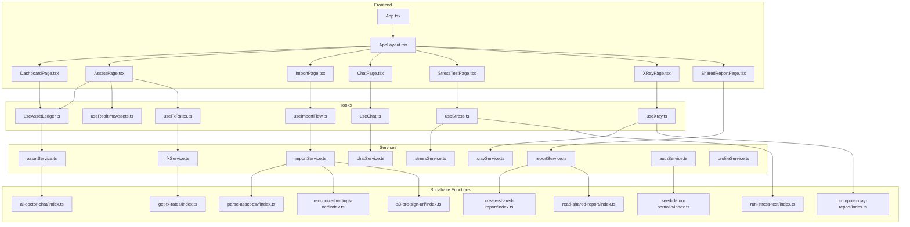
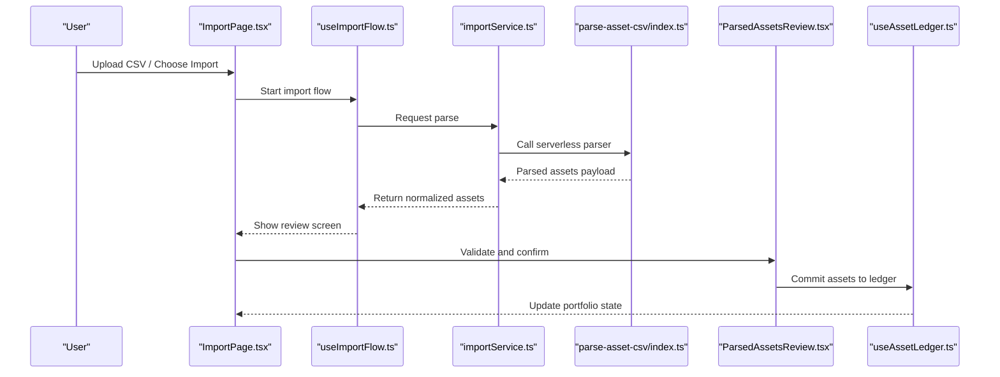
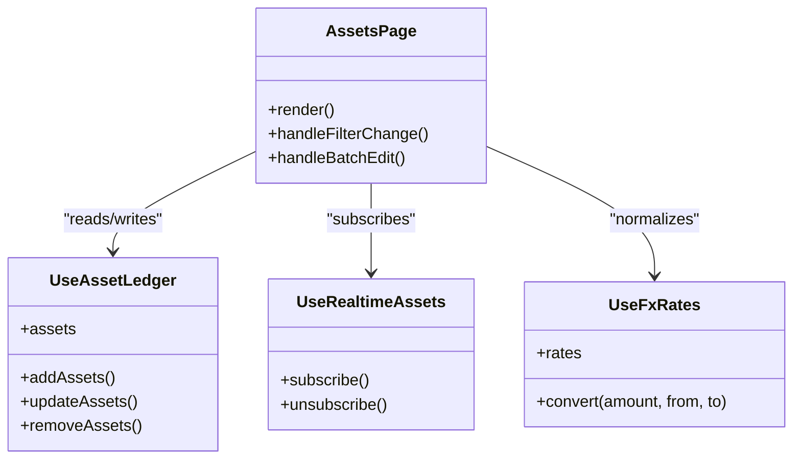
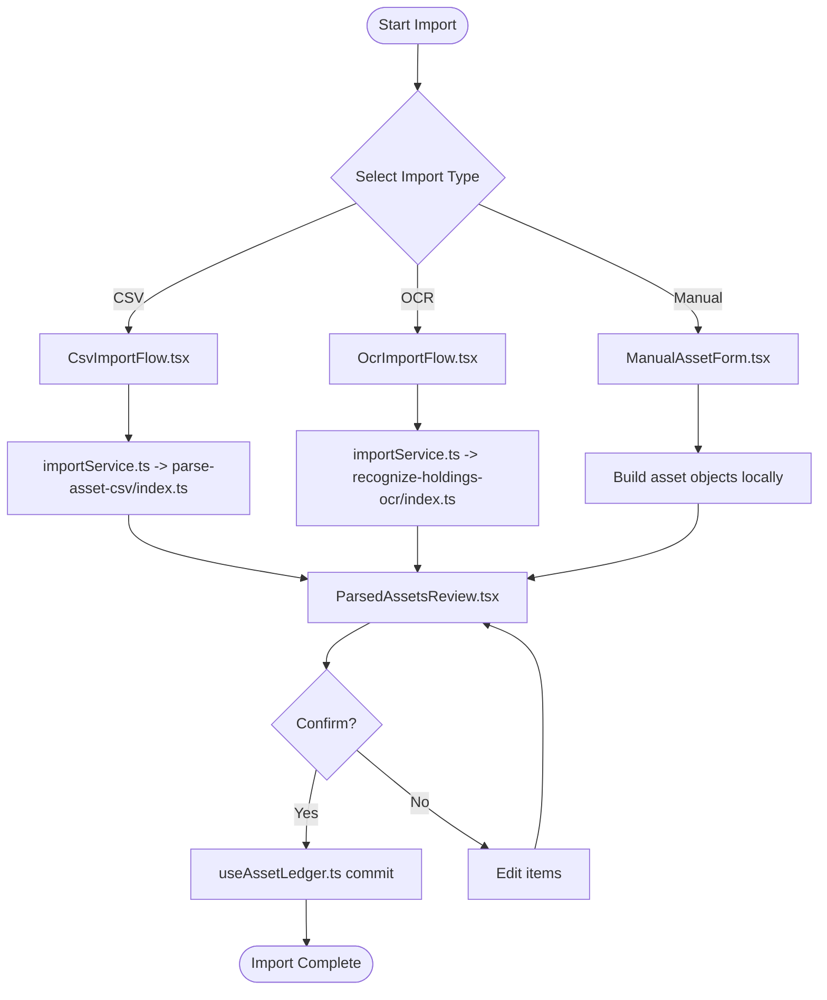
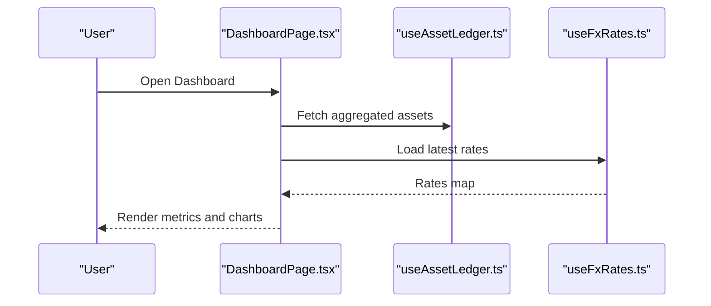
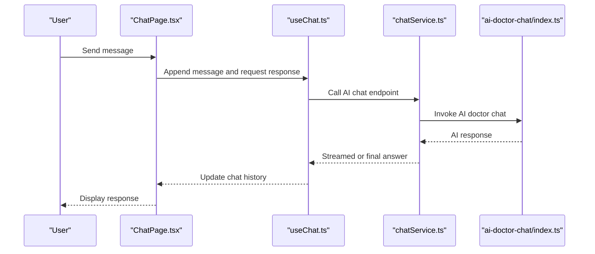
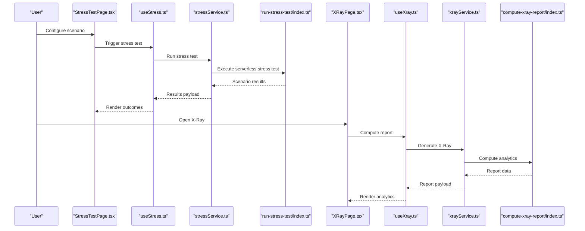
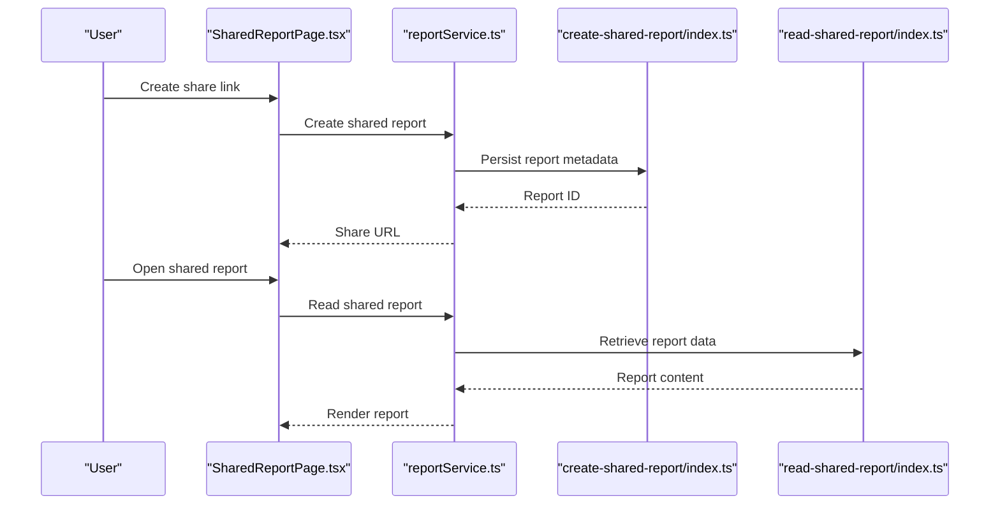
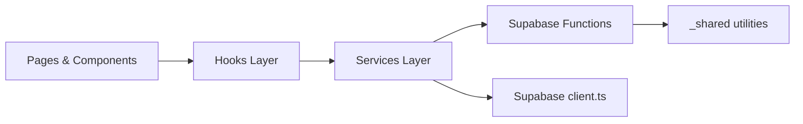

# Core Features

<cite>
**Referenced Files in This Document**
- [App.tsx](file://src/App.tsx)
- [main.tsx](file://src/main.tsx)
- [AppLayout.tsx](file://src/layouts/desktop/AppLayout.tsx)
- [DashboardPage.tsx](file://src/pages/desktop/DashboardPage.tsx)
- [AssetsPage.tsx](file://src/pages/desktop/AssetsPage.tsx)
- [ImportPage.tsx](file://src/pages/desktop/ImportPage.tsx)
- [ChatPage.tsx](file://src/pages/desktop/ChatPage.tsx)
- [StressTestPage.tsx](file://src/pages/desktop/StressTestPage.tsx)
- [XRayPage.tsx](file://src/pages/desktop/XRayPage.tsx)
- [SharedReportPage.tsx](file://src/pages/desktop/SharedReportPage.tsx)
- [CsvImportFlow.tsx](file://src/components/desktop/import/CsvImportFlow.tsx)
- [OcrImportFlow.tsx](file://src/components/desktop/import/OcrImportFlow.tsx)
- [ManualAssetForm.tsx](file://src/components/desktop/import/ManualAssetForm.tsx)
- [ParsedAssetsReview.tsx](file://src/components/desktop/import/ParsedAssetsReview.tsx)
- [useImportFlow.ts](file://src/hooks/useImportFlow.ts)
- [useAssetLedger.ts](file://src/hooks/useAssetLedger.ts)
- [useRealtimeAssets.ts](file://src/hooks/useRealtimeAssets.ts)
- [useFxRates.ts](file://src/hooks/useFxRates.ts)
- [useChat.ts](file://src/hooks/useChat.ts)
- [useStress.ts](file://src/hooks/useStress.ts)
- [useXray.ts](file://src/hooks/useXray.ts)
- [assetService.ts](file://src/services/assetService.ts)
- [importService.ts](file://src/services/importService.ts)
- [chatService.ts](file://src/services/chatService.ts)
- [stressService.ts](file://src/services/stressService.ts)
- [xrayService.ts](file://src/services/xrayService.ts)
- [fxService.ts](file://src/services/fxService.ts)
- [reportService.ts](file://src/services/reportService.ts)
- [authService.ts](file://src/services/authService.ts)
- [profileService.ts](file://src/services/profileService.ts)
- [client.ts](file://src/integrations/supabase/client.ts)
- [types.ts](file://src/integrations/supabase/types.ts)
- [ai-doctor-chat/index.ts](file://supabase/functions/ai-doctor-chat/index.ts)
- [parse-asset-csv/index.ts](file://supabase/functions/parse-asset-csv/index.ts)
- [recognize-holdings-ocr/index.ts](file://supabase/functions/recognize-holdings-ocr/index.ts)
- [run-stress-test/index.ts](file://supabase/functions/run-stress-test/index.ts)
- [compute-xray-report/index.ts](file://supabase/functions/compute-xray-report/index.ts)
- [create-shared-report/index.ts](file://supabase/functions/create-shared-report/index.ts)
- [read-shared-report/index.ts](file://supabase/functions/read-shared-report/index.ts)
- [get-fx-rates/index.ts](file://supabase/functions/get-fx-rates/index.ts)
- [seed-demo-portfolio/index.ts](file://supabase/functions/seed-demo-portfolio/index.ts)
- [s3-pre-sign-url/index.ts](file://supabase/functions/s3-pre-sign-url/index.ts)
- [asset-normalize.ts](file://supabase/functions/_shared/asset-normalize.ts)
- [auth.ts](file://supabase/functions/_shared/auth.ts)
- [currency.ts](file://supabase/functions/_shared/currency.ts)
</cite>

## Table of Contents
1. Introduction
2. Project Structure
3. Core Components
4. Architecture Overview
5. Detailed Component Analysis
6. Dependency Analysis
7. Performance Considerations
8. Troubleshooting Guide
9. Conclusion

## Introduction
FinSight is a financial portfolio platform that helps users track, analyze, and collaborate on investment portfolios. The core feature modules include:
- Portfolio Management: Centralized view and editing of assets, accounts, and holdings with real-time updates and multi-currency support.
- Import System: Flexible ingestion from CSV files, OCR scans, and manual entry, with validation and review before committing to the ledger.
- Analytics Dashboard: High-level metrics, performance summaries, and visualizations for quick insights.
- AI Integration: Conversational assistant for portfolio guidance and explanations.
- Advanced Analysis: Stress testing and X-Ray deep-dive analytics for risk and composition analysis.
- Collaboration: Shared reports and secure read-only access for advisors or co-investors.

This document explains how these modules integrate end-to-end, provides user workflows, and highlights technical implementation details for developers.

## Project Structure
The application follows a layered architecture:
- UI layer (React pages and components)
- Hooks layer (stateful logic and data orchestration)
- Services layer (API calls and business operations)
- Supabase Functions (serverless endpoints for parsing, OCR, analytics, and collaboration)
- Database and storage via Supabase (migrations, S3 pre-signed URLs)

**Diagram sources**
- [App.tsx](file://src/App.tsx)
- [AppLayout.tsx](file://src/layouts/desktop/AppLayout.tsx)
- [DashboardPage.tsx](file://src/pages/desktop/DashboardPage.tsx)
- [AssetsPage.tsx](file://src/pages/desktop/AssetsPage.tsx)
- [ImportPage.tsx](file://src/pages/desktop/ImportPage.tsx)
- [ChatPage.tsx](file://src/pages/desktop/ChatPage.tsx)
- [StressTestPage.tsx](file://src/pages/desktop/StressTestPage.tsx)
- [XRayPage.tsx](file://src/pages/desktop/XRayPage.tsx)
- [SharedReportPage.tsx](file://src/pages/desktop/SharedReportPage.tsx)
- [useAssetLedger.ts](file://src/hooks/useAssetLedger.ts)
- [useImportFlow.ts](file://src/hooks/useImportFlow.ts)
- [useRealtimeAssets.ts](file://src/hooks/useRealtimeAssets.ts)
- [useFxRates.ts](file://src/hooks/useFxRates.ts)
- [useChat.ts](file://src/hooks/useChat.ts)
- [useStress.ts](file://src/hooks/useStress.ts)
- [useXray.ts](file://src/hooks/useXray.ts)
- [assetService.ts](file://src/services/assetService.ts)
- [importService.ts](file://src/services/importService.ts)
- [chatService.ts](file://src/services/chatService.ts)
- [stressService.ts](file://src/services/stressService.ts)
- [xrayService.ts](file://src/services/xrayService.ts)
- [fxService.ts](file://src/services/fxService.ts)
- [reportService.ts](file://src/services/reportService.ts)
- [ai-doctor-chat/index.ts](file://supabase/functions/ai-doctor-chat/index.ts)
- [parse-asset-csv/index.ts](file://supabase/functions/parse-asset-csv/index.ts)
- [recognize-holdings-ocr/index.ts](file://supabase/functions/recognize-holdings-ocr/index.ts)
- [run-stress-test/index.ts](file://supabase/functions/run-stress-test/index.ts)
- [compute-xray-report/index.ts](file://supabase/functions/compute-xray-report/index.ts)
- [create-shared-report/index.ts](file://supabase/functions/create-shared-report/index.ts)
- [read-shared-report/index.ts](file://supabase/functions/read-shared-report/index.ts)
- [get-fx-rates/index.ts](file://supabase/functions/get-fx-rates/index.ts)
- [seed-demo-portfolio/index.ts](file://supabase/functions/seed-demo-portfolio/index.ts)
- [s3-pre-sign-url/index.ts](file://supabase/functions/s3-pre-sign-url/index.ts)

**Section sources**
- [App.tsx](file://src/App.tsx)
- [main.tsx](file://src/main.tsx)
- [AppLayout.tsx](file://src/layouts/desktop/AppLayout.tsx)

## Core Components
- Portfolio Management
  - Assets page displays holdings, balances, and metadata; supports filtering and batch edits.
  - Real-time asset updates and FX normalization ensure consistent reporting across currencies.
  - Ledger hook centralizes state for assets and related operations.
- Import System
  - Multi-modal import flows: CSV upload, OCR scan, and manual entry.
  - Review step validates parsed assets before committing to the ledger.
  - Services coordinate with serverless functions for parsing and OCR.
- Analytics Dashboard
  - Aggregates key metrics and presents summary views for portfolio health.
- AI Integration
  - Chat interface powered by an AI doctor chat function for conversational insights.
- Advanced Analysis
  - Stress testing simulates scenarios against current holdings.
  - X-Ray computes deep-dive analytics and risk breakdowns.
- Collaboration
  - Create and read shared reports for secure sharing with stakeholders.

**Section sources**
- [AssetsPage.tsx](file://src/pages/desktop/AssetsPage.tsx)
- [useAssetLedger.ts](file://src/hooks/useAssetLedger.ts)
- [useRealtimeAssets.ts](file://src/hooks/useRealtimeAssets.ts)
- [useFxRates.ts](file://src/hooks/useFxRates.ts)
- [ImportPage.tsx](file://src/pages/desktop/ImportPage.tsx)
- [CsvImportFlow.tsx](file://src/components/desktop/import/CsvImportFlow.tsx)
- [OcrImportFlow.tsx](file://src/components/desktop/import/OcrImportFlow.tsx)
- [ManualAssetForm.tsx](file://src/components/desktop/import/ManualAssetForm.tsx)
- [ParsedAssetsReview.tsx](file://src/components/desktop/import/ParsedAssetsReview.tsx)
- [useImportFlow.ts](file://src/hooks/useImportFlow.ts)
- [DashboardPage.tsx](file://src/pages/desktop/DashboardPage.tsx)
- [ChatPage.tsx](file://src/pages/desktop/ChatPage.tsx)
- [useChat.ts](file://src/hooks/useChat.ts)
- [StressTestPage.tsx](file://src/pages/desktop/StressTestPage.tsx)
- [useStress.ts](file://src/hooks/useStress.ts)
- [XRayPage.tsx](file://src/pages/desktop/XRayPage.tsx)
- [useXray.ts](file://src/hooks/useXray.ts)
- [SharedReportPage.tsx](file://src/pages/desktop/SharedReportPage.tsx)
- [reportService.ts](file://src/services/reportService.ts)

## Architecture Overview
FinSight integrates React UI with Supabase Functions for heavy processing and persistence. The flow typically goes:
- UI triggers a service call
- Service invokes a Supabase Function
- Function performs parsing, OCR, analytics, or report generation
- Results are returned to the UI and persisted as needed

**Diagram sources**
- [ImportPage.tsx](file://src/pages/desktop/ImportPage.tsx)
- [useImportFlow.ts](file://src/hooks/useImportFlow.ts)
- [importService.ts](file://src/services/importService.ts)
- [parse-asset-csv/index.ts](file://supabase/functions/parse-asset-csv/index.ts)
- [ParsedAssetsReview.tsx](file://src/components/desktop/import/ParsedAssetsReview.tsx)
- [useAssetLedger.ts](file://src/hooks/useAssetLedger.ts)

## Detailed Component Analysis

### Portfolio Management
Portfolio management centers around the Assets page and the asset ledger hook. It provides:
- Asset listing and filtering
- Batch editing capabilities
- Real-time updates and currency normalization

**Diagram sources**
- [AssetsPage.tsx](file://src/pages/desktop/AssetsPage.tsx)
- [useAssetLedger.ts](file://src/hooks/useAssetLedger.ts)
- [useRealtimeAssets.ts](file://src/hooks/useRealtimeAssets.ts)
- [useFxRates.ts](file://src/hooks/useFxRates.ts)

**Section sources**
- [AssetsPage.tsx](file://src/pages/desktop/AssetsPage.tsx)
- [useAssetLedger.ts](file://src/hooks/useAssetLedger.ts)
- [useRealtimeAssets.ts](file://src/hooks/useRealtimeAssets.ts)
- [useFxRates.ts](file://src/hooks/useFxRates.ts)
- [assetService.ts](file://src/services/assetService.ts)

### Import System
The import system supports three primary flows:
- CSV import: Upload and parse structured data
- OCR import: Extract holdings from images
- Manual entry: Add assets directly

**Diagram sources**
- [ImportPage.tsx](file://src/pages/desktop/ImportPage.tsx)
- [CsvImportFlow.tsx](file://src/components/desktop/import/CsvImportFlow.tsx)
- [OcrImportFlow.tsx](file://src/components/desktop/import/OcrImportFlow.tsx)
- [ManualAssetForm.tsx](file://src/components/desktop/import/ManualAssetForm.tsx)
- [ParsedAssetsReview.tsx](file://src/components/desktop/import/ParsedAssetsReview.tsx)
- [useImportFlow.ts](file://src/hooks/useImportFlow.ts)
- [importService.ts](file://src/services/importService.ts)
- [parse-asset-csv/index.ts](file://supabase/functions/parse-asset-csv/index.ts)
- [recognize-holdings-ocr/index.ts](file://supabase/functions/recognize-holdings-ocr/index.ts)
- [useAssetLedger.ts](file://src/hooks/useAssetLedger.ts)

**Section sources**
- [ImportPage.tsx](file://src/pages/desktop/ImportPage.tsx)
- [CsvImportFlow.tsx](file://src/components/desktop/import/CsvImportFlow.tsx)
- [OcrImportFlow.tsx](file://src/components/desktop/import/OcrImportFlow.tsx)
- [ManualAssetForm.tsx](file://src/components/desktop/import/ManualAssetForm.tsx)
- [ParsedAssetsReview.tsx](file://src/components/desktop/import/ParsedAssetsReview.tsx)
- [useImportFlow.ts](file://src/hooks/useImportFlow.ts)
- [importService.ts](file://src/services/importService.ts)
- [parse-asset-csv/index.ts](file://supabase/functions/parse-asset-csv/index.ts)
- [recognize-holdings-ocr/index.ts](file://supabase/functions/recognize-holdings-ocr/index.ts)

### Analytics Dashboard
The dashboard aggregates portfolio metrics and provides high-level insights. It consumes normalized asset data and FX rates to present consistent figures.

**Diagram sources**
- [DashboardPage.tsx](file://src/pages/desktop/DashboardPage.tsx)
- [useAssetLedger.ts](file://src/hooks/useAssetLedger.ts)
- [useFxRates.ts](file://src/hooks/useFxRates.ts)

**Section sources**
- [DashboardPage.tsx](file://src/pages/desktop/DashboardPage.tsx)
- [useAssetLedger.ts](file://src/hooks/useAssetLedger.ts)
- [useFxRates.ts](file://src/hooks/useFxRates.ts)

### AI Integration
The AI chat feature allows users to ask questions about their portfolio and receive contextual answers.

**Diagram sources**
- [ChatPage.tsx](file://src/pages/desktop/ChatPage.tsx)
- [useChat.ts](file://src/hooks/useChat.ts)
- [chatService.ts](file://src/services/chatService.ts)
- [ai-doctor-chat/index.ts](file://supabase/functions/ai-doctor-chat/index.ts)

**Section sources**
- [ChatPage.tsx](file://src/pages/desktop/ChatPage.tsx)
- [useChat.ts](file://src/hooks/useChat.ts)
- [chatService.ts](file://src/services/chatService.ts)
- [ai-doctor-chat/index.ts](file://supabase/functions/ai-doctor-chat/index.ts)

### Advanced Analysis
Two advanced features provide deeper insights:
- Stress Testing: Simulate market shocks and evaluate portfolio impact.
- X-Ray: Compute detailed analytics and risk breakdowns.

**Diagram sources**
- [StressTestPage.tsx](file://src/pages/desktop/StressTestPage.tsx)
- [useStress.ts](file://src/hooks/useStress.ts)
- [stressService.ts](file://src/services/stressService.ts)
- [run-stress-test/index.ts](file://supabase/functions/run-stress-test/index.ts)
- [XRayPage.tsx](file://src/pages/desktop/XRayPage.tsx)
- [useXray.ts](file://src/hooks/useXray.ts)
- [xrayService.ts](file://src/services/xrayService.ts)
- [compute-xray-report/index.ts](file://supabase/functions/compute-xray-report/index.ts)

**Section sources**
- [StressTestPage.tsx](file://src/pages/desktop/StressTestPage.tsx)
- [useStress.ts](file://src/hooks/useStress.ts)
- [stressService.ts](file://src/services/stressService.ts)
- [run-stress-test/index.ts](file://supabase/functions/run-stress-test/index.ts)
- [XRayPage.tsx](file://src/pages/desktop/XRayPage.tsx)
- [useXray.ts](file://src/hooks/useXray.ts)
- [xrayService.ts](file://src/services/xrayService.ts)
- [compute-xray-report/index.ts](file://supabase/functions/compute-xray-report/index.ts)

### Collaboration
Collaboration enables creating and reading shared reports for secure distribution.

**Diagram sources**
- [SharedReportPage.tsx](file://src/pages/desktop/SharedReportPage.tsx)
- [reportService.ts](file://src/services/reportService.ts)
- [create-shared-report/index.ts](file://supabase/functions/create-shared-report/index.ts)
- [read-shared-report/index.ts](file://supabase/functions/read-shared-report/index.ts)

**Section sources**
- [SharedReportPage.tsx](file://src/pages/desktop/SharedReportPage.tsx)
- [reportService.ts](file://src/services/reportService.ts)
- [create-shared-report/index.ts](file://supabase/functions/create-shared-report/index.ts)
- [read-shared-report/index.ts](file://supabase/functions/read-shared-report/index.ts)

## Dependency Analysis
Key integration points:
- UI hooks depend on services for API calls
- Services invoke Supabase Functions for parsing, OCR, analytics, and collaboration
- FX rates and asset normalization utilities ensure consistency across modules

**Diagram sources**
- [AppLayout.tsx](file://src/layouts/desktop/AppLayout.tsx)
- [useAssetLedger.ts](file://src/hooks/useAssetLedger.ts)
- [useImportFlow.ts](file://src/hooks/useImportFlow.ts)
- [assetService.ts](file://src/services/assetService.ts)
- [importService.ts](file://src/services/importService.ts)
- [client.ts](file://src/integrations/supabase/client.ts)
- [asset-normalize.ts](file://supabase/functions/_shared/asset-normalize.ts)
- [currency.ts](file://supabase/functions/_shared/currency.ts)

**Section sources**
- [client.ts](file://src/integrations/supabase/client.ts)
- [types.ts](file://src/integrations/supabase/types.ts)
- [asset-normalize.ts](file://supabase/functions/_shared/asset-normalize.ts)
- [currency.ts](file://supabase/functions/_shared/currency.ts)

## Performance Considerations
- Prefer server-side parsing and OCR to reduce client load and improve accuracy.
- Cache FX rates where appropriate to minimize repeated network calls.
- Use real-time subscriptions judiciously to avoid excessive re-renders.
- Defer heavy computations (stress tests, X-Ray) to serverless functions and stream results when possible.
- Implement pagination and virtualization for large asset lists.

[No sources needed since this section provides general guidance]

## Troubleshooting Guide
Common issues and strategies:
- Import failures: Validate CSV structure and handle malformed rows; use the review step to correct entries before committing.
- OCR misreads: Re-scan with clearer images; verify extracted fields in the review step.
- FX discrepancies: Ensure latest rates are fetched and normalize amounts consistently.
- AI chat errors: Check function availability and input context; retry with simplified prompts.
- Stress test timeouts: Reduce scenario complexity or increase timeout thresholds on the serverless function.
- Shared report access: Verify permissions and report IDs; ensure the read function is reachable.

**Section sources**
- [ParsedAssetsReview.tsx](file://src/components/desktop/import/ParsedAssetsReview.tsx)
- [useImportFlow.ts](file://src/hooks/useImportFlow.ts)
- [useFxRates.ts](file://src/hooks/useFxRates.ts)
- [useChat.ts](file://src/hooks/useChat.ts)
- [useStress.ts](file://src/hooks/useStress.ts)
- [useXray.ts](file://src/hooks/useXray.ts)
- [reportService.ts](file://src/services/reportService.ts)

## Conclusion
FinSight’s modular design cleanly separates UI, state orchestration, and serverless processing. Users can quickly set up portfolios through flexible imports, gain insights via the dashboard and AI chat, and perform deep analyses with stress testing and X-Ray. Collaboration features enable secure sharing of reports. For developers, the clear separation between hooks, services, and Supabase Functions simplifies maintenance and scaling while providing robust integration points for future enhancements.

[No sources needed since this section summarizes without analyzing specific files]