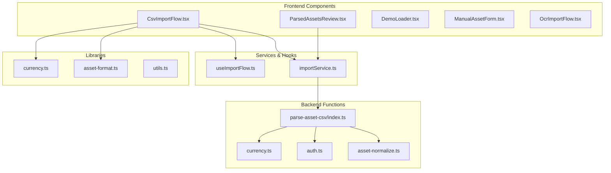
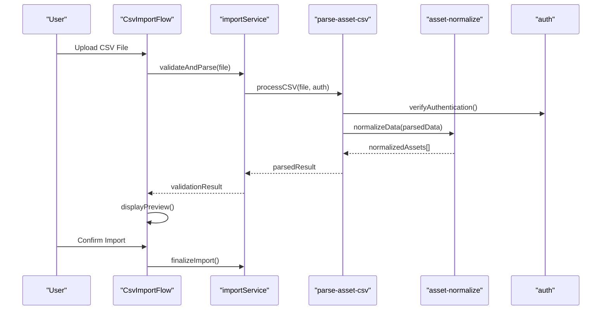
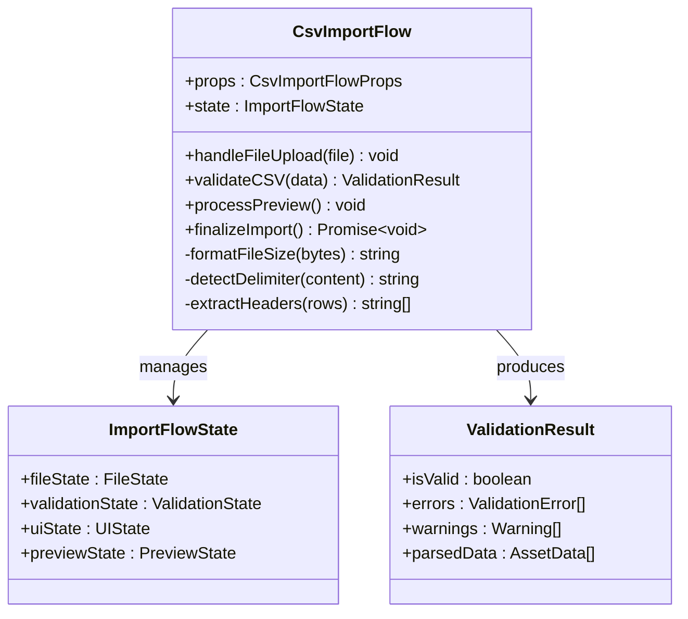
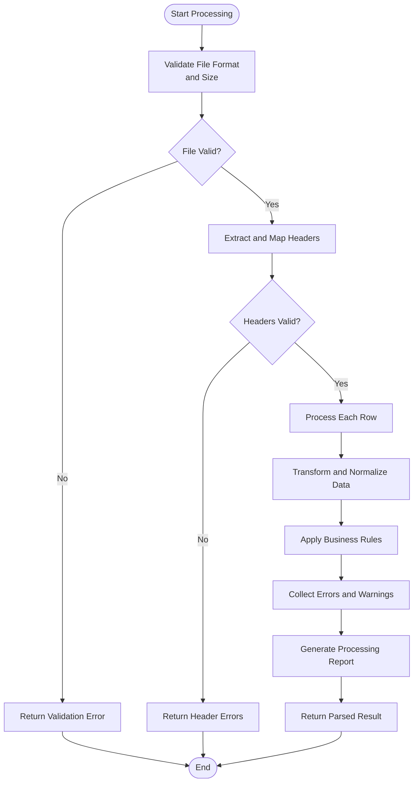
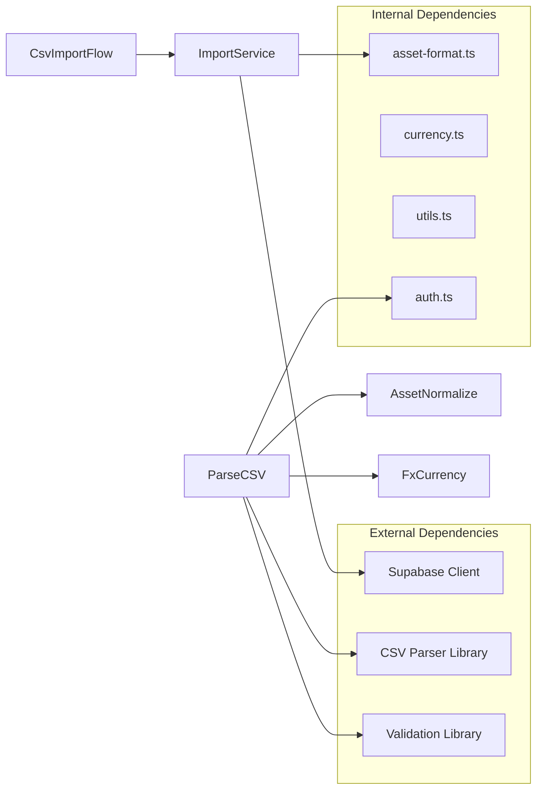

# CSV Import Flow

<cite>
**Referenced Files in This Document**
- [CsvImportFlow.tsx](file://src/components/desktop/import/CsvImportFlow.tsx)
- [parse-asset-csv/index.ts](file://supabase/functions/parse-asset-csv/index.ts)
- [importService.ts](file://src/services/importService.ts)
- [useImportFlow.ts](file://src/hooks/useImportFlow.ts)
- [ParsedAssetsReview.tsx](file://src/components/desktop/import/ParsedAssetsReview.tsx)
- [DemoLoader.tsx](file://src/components/desktop/import/DemoLoader.tsx)
- [ManualAssetForm.tsx](file://src/components/desktop/import/ManualAssetForm.tsx)
- [OcrImportFlow.tsx](file://src/components/desktop/import/OcrImportFlow.tsx)
- [asset-format.ts](file://src/lib/asset-format.ts)
- [currency.ts](file://src/lib/currency.ts)
- [utils.ts](file://src/lib/utils.ts)
- [asset-normalize.ts](file://supabase/functions/_shared/asset-normalize.ts)
- [auth.ts](file://supabase/functions/_shared/auth.ts)
- [currency.ts](file://supabase/functions/_shared/currency.ts)
</cite>

## Table of Contents
1. [Introduction](#introduction)
2. [Project Structure](#project-structure)
3. [Core Components](#core-components)
4. [Architecture Overview](#architecture-overview)
5. [Detailed Component Analysis](#detailed-component-analysis)
6. [Dependency Analysis](#dependency-analysis)
7. [Performance Considerations](#performance-considerations)
8. [Troubleshooting Guide](#troubleshooting-guide)
9. [Conclusion](#conclusion)

## Introduction

The CSV Import Flow is a comprehensive system that enables users to upload portfolio holdings data through CSV files. This component provides a user-friendly interface for importing financial asset data, including validation, parsing, and review capabilities. The system supports various CSV formats, handles data normalization, and integrates with server-side processing for robust error handling and data transformation.

## Project Structure

The CSV Import Flow consists of multiple interconnected components across the frontend and backend:

**Diagram sources**
- [CsvImportFlow.tsx](file://src/components/desktop/import/CsvImportFlow.tsx)
- [parse-asset-csv/index.ts](file://supabase/functions/parse-asset-csv/index.ts)
- [importService.ts](file://src/services/importService.ts)
- [useImportFlow.ts](file://src/hooks/useImportFlow.ts)

**Section sources**
- [CsvImportFlow.tsx](file://src/components/desktop/import/CsvImportFlow.tsx)
- [parse-asset-csv/index.ts](file://supabase/functions/parse-asset-csv/index.ts)

## Core Components

### CsvImportFlow Component

The main entry point for CSV import functionality, providing:
- File upload interface with drag-and-drop support
- CSV format validation and preview
- Error handling and user feedback
- Integration with parsing services

### Server-Side Processing

The parse-asset-csv edge function handles:
- CSV file parsing and validation
- Data transformation and normalization
- Error detection and reporting
- Integration with authentication and currency services

### Supporting Services

- **importService**: Manages communication between frontend and backend
- **useImportFlow**: Provides state management and business logic
- **asset-format**: Defines supported CSV column mappings and formats
- **currency**: Handles currency conversion and validation

**Section sources**
- [CsvImportFlow.tsx](file://src/components/desktop/import/CsvImportFlow.tsx)
- [parse-asset-csv/index.ts](file://supabase/functions/parse-asset-csv/index.ts)
- [importService.ts](file://src/services/importService.ts)
- [useImportFlow.ts](file://src/hooks/useImportFlow.ts)

## Architecture Overview

The CSV Import Flow follows a client-server architecture with clear separation of concerns:

**Diagram sources**
- [CsvImportFlow.tsx](file://src/components/desktop/import/CsvImportFlow.tsx)
- [importService.ts](file://src/services/importService.ts)
- [parse-asset-csv/index.ts](file://supabase/functions/parse-asset-csv/index.ts)
- [asset-normalize.ts](file://supabase/functions/_shared/asset-normalize.ts)

## Detailed Component Analysis

### CsvImportFlow Component Analysis

The CsvImportFlow component manages the complete CSV import lifecycle:

#### Props Interface
- `onComplete`: Callback function for successful imports
- `className`: Styling customization
- `disabled`: Import flow control
- `initialData`: Pre-populated data for editing

#### State Management
- `fileState`: Current uploaded file and metadata
- `validationState`: Parsing results and errors
- `uiState`: Loading states and user interactions
- `previewState`: Data preview configuration

#### User Interaction Patterns
- Drag-and-drop file upload
- Real-time validation feedback
- Interactive data preview
- Batch operations support

**Diagram sources**
- [CsvImportFlow.tsx](file://src/components/desktop/import/CsvImportFlow.tsx)

**Section sources**
- [CsvImportFlow.tsx](file://src/components/desktop/import/CsvImportFlow.tsx)

### Server-Side CSV Parsing Logic

The parse-asset-csv edge function implements robust CSV processing:

#### Authentication & Security
- JWT token validation
- User permission verification
- Rate limiting protection

#### CSV Parsing Pipeline
1. **File Validation**: Size limits, format checks, encoding detection
2. **Header Mapping**: Column name normalization and validation
3. **Data Transformation**: Type conversion, currency handling, date parsing
4. **Business Rules**: Duplicate detection, value range validation
5. **Error Collection**: Comprehensive error reporting with line numbers

#### Data Normalization
- Asset type standardization
- Currency code validation (ISO 4217)
- Date format normalization
- Numeric precision handling

**Diagram sources**
- [parse-asset-csv/index.ts](file://supabase/functions/parse-asset-csv/index.ts)
- [asset-normalize.ts](file://supabase/functions/_shared/asset-normalize.ts)

**Section sources**
- [parse-asset-csv/index.ts](file://supabase/functions/parse-asset-csv/index.ts)
- [asset-normalize.ts](file://supabase/functions/_shared/asset-normalize.ts)

### Supported CSV Formats and Column Mappings

#### Required Columns
- **Symbol/Ticker**: Unique asset identifier
- **Quantity**: Number of shares or units
- **Price**: Purchase price per unit
- **Currency**: ISO 4217 currency code

#### Optional Columns
- **AssetType**: Stock, ETF, Bond, Crypto, etc.
- **Exchange**: Trading exchange identifier
- **PurchaseDate**: Acquisition date
- **Account**: Portfolio account name
- **Notes**: Additional comments or descriptions

#### Data Validation Rules
- Symbol: Alphanumeric, 1-10 characters
- Quantity: Positive numeric values
- Price: Non-negative decimal values
- Currency: Valid ISO 4217 codes
- Dates: YYYY-MM-DD format

**Section sources**
- [asset-format.ts](file://src/lib/asset-format.ts)
- [currency.ts](file://src/lib/currency.ts)

## Dependency Analysis

The CSV Import Flow has well-defined dependencies:

**Diagram sources**
- [importService.ts](file://src/services/importService.ts)
- [parse-asset-csv/index.ts](file://supabase/functions/parse-asset-csv/index.ts)
- [asset-format.ts](file://src/lib/asset-format.ts)

**Section sources**
- [importService.ts](file://src/services/importService.ts)
- [parse-asset-csv/index.ts](file://supabase/functions/parse-asset-csv/index.ts)

## Performance Considerations

### Frontend Optimization
- Lazy loading of large CSV files
- Debounced validation during file input
- Virtual scrolling for large data previews
- Memory-efficient file processing

### Backend Optimization
- Streaming CSV parsing for large files
- Batch processing of validation rules
- Caching of currency conversion rates
- Connection pooling for database operations

### Error Handling Strategy
- Graceful degradation for malformed data
- Partial import support with error reporting
- Retry mechanisms for transient failures
- Comprehensive logging for debugging

## Troubleshooting Guide

### Common CSV Import Issues

#### File Format Problems
- **Encoding Issues**: Ensure UTF-8 encoding for international characters
- **Delimiter Conflicts**: Verify comma vs. semicolon delimiters
- **Header Mismatch**: Check column names match expected format
- **Empty Rows**: Remove blank lines from CSV files

#### Data Validation Errors
- **Invalid Symbols**: Verify ticker symbols exist in supported exchanges
- **Missing Required Fields**: Ensure all mandatory columns are populated
- **Invalid Numbers**: Check for proper numeric formatting
- **Currency Codes**: Validate against ISO 4217 standards

#### Network and Authentication
- **Connection Timeouts**: Monitor network stability during uploads
- **Authentication Failures**: Verify user session validity
- **Rate Limiting**: Check API usage limits and implement backoff

### Debugging Techniques

#### Frontend Debugging
- Enable detailed logging in browser console
- Inspect network requests and responses
- Validate local file parsing before upload
- Test with sample CSV files

#### Backend Debugging
- Review Supabase function logs
- Check database constraints and triggers
- Monitor error boundaries and exception handling
- Validate data transformations step-by-step

**Section sources**
- [parse-asset-csv/index.ts](file://supabase/functions/parse-asset-csv/index.ts)
- [CsvImportFlow.tsx](file://src/components/desktop/import/CsvImportFlow.tsx)

## Conclusion

The CSV Import Flow provides a robust, user-friendly solution for importing portfolio holdings data. With comprehensive validation, flexible format support, and reliable error handling, it enables seamless integration of external portfolio data into the application. The modular architecture ensures maintainability and scalability while providing excellent user experience through real-time feedback and intuitive interfaces.