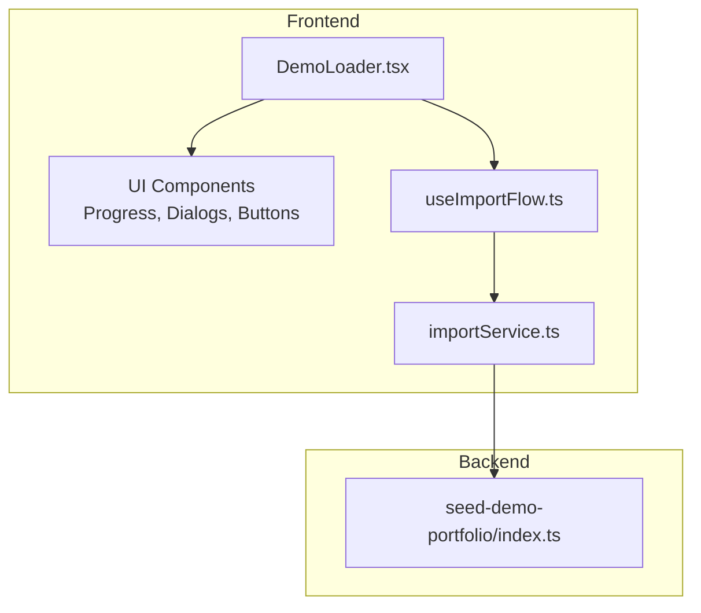
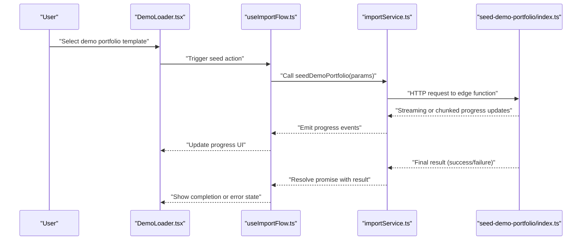
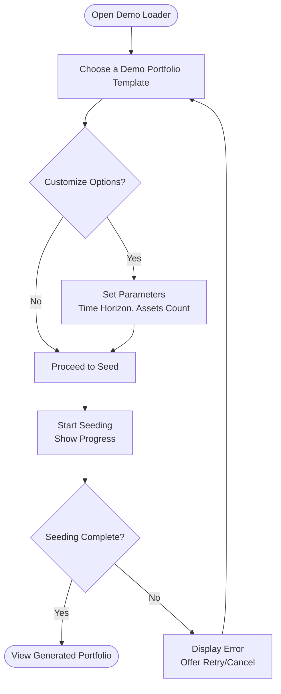
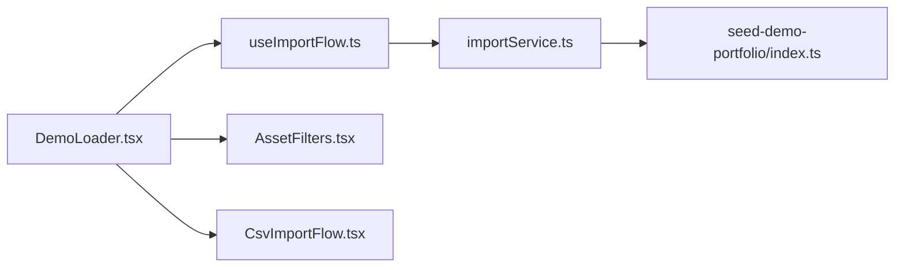

# Demo Portfolio Loader

<cite>
**Referenced Files in This Document**
- [DemoLoader.tsx](file://src/components/desktop/import/DemoLoader.tsx)
- [index.ts](file://supabase/functions/seed-demo-portfolio/index.ts)
- [useImportFlow.ts](file://src/hooks/useImportFlow.ts)
- [importService.ts](file://src/services/importService.ts)
- [AssetFilters.tsx](file://src/components/desktop/AssetFilters.tsx)
- [CsvImportFlow.tsx](file://src/components/desktop/import/CsvImportFlow.tsx)
</cite>

## Table of Contents
1. [Introduction](#introduction)
2. [Project Structure](#project-structure)
3. [Core Components](#core-components)
4. [Architecture Overview](#architecture-overview)
5. [Detailed Component Analysis](#detailed-component-analysis)
6. [Dependency Analysis](#dependency-analysis)
7. [Performance Considerations](#performance-considerations)
8. [Troubleshooting Guide](#troubleshooting-guide)
9. [Conclusion](#conclusion)

## Introduction
The Demo Portfolio Loader feature enables users to quickly populate their workspace with realistic, pre-configured sample portfolios for testing and demonstration. It provides a user-friendly selection interface, clear loading states, and progress indicators, while the backend edge function generates diverse asset allocations, historical performance data, and risk metrics. This documentation explains how the frontend DemoLoader component interacts with the seed-demo-portfolio Supabase Edge Function, outlines available portfolio templates, customization options, and best practices for using demo data in development and testing environments.

## Project Structure
The Demo Portfolio Loader spans both the client-side UI and a serverless edge function:
- Frontend: A dedicated DemoLoader component within the import flow, integrated with import hooks and services.
- Backend: A Supabase Edge Function that seeds realistic portfolio data into the application’s database.

**Diagram sources**
- [DemoLoader.tsx](file://src/components/desktop/import/DemoLoader.tsx)
- [useImportFlow.ts](file://src/hooks/useImportFlow.ts)
- [importService.ts](file://src/services/importService.ts)
- [index.ts](file://supabase/functions/seed-demo-portfolio/index.ts)

**Section sources**
- [DemoLoader.tsx](file://src/components/desktop/import/DemoLoader.tsx)
- [useImportFlow.ts](file://src/hooks/useImportFlow.ts)
- [importService.ts](file://src/services/importService.ts)
- [index.ts](file://supabase/functions/seed-demo-portfolio/index.ts)

## Core Components
- DemoLoader (frontend): Presents a curated list of demo portfolio templates, allows selection, and manages loading states and progress feedback during seeding.
- useImportFlow (hook): Orchestrates import-related state transitions and integrates with services to execute actions such as seeding demo portfolios.
- importService (service): Encapsulates API calls to the Supabase Edge Function for generating and persisting demo data.
- seed-demo-portfolio (edge function): Generates realistic sample data including diversified assets, historical returns, volatility, drawdowns, and other risk metrics, then persists them via Supabase.

Key responsibilities:
- User interaction: Template selection, confirmation, cancellation.
- State management: Loading, progress updates, success/error handling.
- Data generation: Realistic distributions across asset classes and time horizons.
- Persistence: Writing generated holdings and analytics to the database.

**Section sources**
- [DemoLoader.tsx](file://src/components/desktop/import/DemoLoader.tsx)
- [useImportFlow.ts](file://src/hooks/useImportFlow.ts)
- [importService.ts](file://src/services/importService.ts)
- [index.ts](file://supabase/functions/seed-demo-portfolio/index.ts)

## Architecture Overview
The Demo Portfolio Loader follows a layered architecture:
- Presentation layer: DemoLoader renders the selection UI and progress indicators.
- Orchestration layer: useImportFlow coordinates workflow steps and state.
- Service layer: importService abstracts network calls to the edge function.
- Serverless layer: seed-demo-portfolio computes and persists demo data.

**Diagram sources**
- [DemoLoader.tsx](file://src/components/desktop/import/DemoLoader.tsx)
- [useImportFlow.ts](file://src/hooks/useImportFlow.ts)
- [importService.ts](file://src/services/importService.ts)
- [index.ts](file://supabase/functions/seed-demo-portfolio/index.ts)

## Detailed Component Analysis

### DemoLoader Component
Responsibilities:
- Display available demo portfolio templates with descriptions and risk profiles.
- Capture user selection and optional customization parameters (e.g., time horizon, number of assets).
- Manage UI states: idle, loading, progress, success, error.
- Render progress indicators and actionable feedback (retry, cancel).

Interaction patterns:
- On selection, triggers the import hook to initiate seeding.
- Subscribes to progress updates from the service layer to reflect real-time status.
- Handles errors by surfacing user-friendly messages and recovery options.

Integration points:
- Uses UI primitives for dialogs, buttons, and progress bars.
- Communicates with useImportFlow and importService for orchestration and networking.

**Section sources**
- [DemoLoader.tsx](file://src/components/desktop/import/DemoLoader.tsx)

### Seed Demo Portfolio Edge Function
Responsibilities:
- Generate realistic sample data:
  - Diverse asset allocations across equities, fixed income, alternatives, and cash.
  - Historical price series and derived metrics (returns, volatility, Sharpe ratio, max drawdown).
  - Risk metrics and summary statistics suitable for dashboards and reports.
- Persist generated data into the application database through Supabase clients.
- Emit progress updates to the caller for UI feedback.

Data characteristics:
- Asset universe includes tickers, names, sectors, and regions.
- Time series covers multiple years with daily or monthly granularity.
- Metrics include annualized return, standard deviation, correlation matrices, and stress-test scenarios.

Error handling:
- Validates input parameters and environment configuration.
- Returns structured error responses with actionable details.
- Ensures idempotency where applicable to avoid duplicate seeding.

**Section sources**
- [index.ts](file://supabase/functions/seed-demo-portfolio/index.ts)

### Import Flow Orchestration (Hook and Service)
Responsibilities:
- useImportFlow:
  - Maintains import state (idle, running, completed, failed).
  - Coordinates lifecycle events and exposes methods to start/stop imports.
  - Bridges UI components with service-layer calls.
- importService:
  - Provides typed functions to call the seed-demo-portfolio edge function.
  - Parses and forwards progress events to the caller.
  - Normalizes responses and maps errors to user-facing messages.

Integration points:
- Works alongside CsvImportFlow and ParsedAssetsReview to maintain consistent UX across import modalities.
- Leverages shared utilities for currency normalization and asset formatting.

**Section sources**
- [useImportFlow.ts](file://src/hooks/useImportFlow.ts)
- [importService.ts](file://src/services/importService.ts)
- [CsvImportFlow.tsx](file://src/components/desktop/import/CsvImportFlow.tsx)

### Conceptual Overview
The Demo Portfolio Loader is designed to be intuitive and informative:
- Templates are categorized by risk profile and investment objective.
- Progress indicators provide transparency during long-running operations.
- Error states guide users toward resolution without exposing low-level details.

[No sources needed since this diagram shows conceptual workflow, not actual code structure]

## Dependency Analysis
The Demo Portfolio Loader depends on several modules:
- DemoLoader depends on UI components and the import hook.
- The import hook depends on the import service for network operations.
- The import service depends on the Supabase Edge Function runtime.
- Shared utilities support currency and asset formatting.

**Diagram sources**
- [DemoLoader.tsx](file://src/components/desktop/import/DemoLoader.tsx)
- [useImportFlow.ts](file://src/hooks/useImportFlow.ts)
- [importService.ts](file://src/services/importService.ts)
- [index.ts](file://supabase/functions/seed-demo-portfolio/index.ts)
- [AssetFilters.tsx](file://src/components/desktop/AssetFilters.tsx)
- [CsvImportFlow.tsx](file://src/components/desktop/import/CsvImportFlow.tsx)

**Section sources**
- [DemoLoader.tsx](file://src/components/desktop/import/DemoLoader.tsx)
- [useImportFlow.ts](file://src/hooks/useImportFlow.ts)
- [importService.ts](file://src/services/importService.ts)
- [index.ts](file://supabase/functions/seed-demo-portfolio/index.ts)
- [AssetFilters.tsx](file://src/components/desktop/AssetFilters.tsx)
- [CsvImportFlow.tsx](file://src/components/desktop/import/CsvImportFlow.tsx)

## Performance Considerations
- Streaming progress: Prefer streaming or chunked updates from the edge function to keep the UI responsive.
- Batch writes: Group database inserts to reduce round-trips and improve throughput.
- Caching: Cache static template metadata and asset universes to minimize repeated computations.
- Concurrency limits: Avoid concurrent seeding requests that could overload the database.
- Backoff and retries: Implement exponential backoff for transient network failures.

[No sources needed since this section provides general guidance]

## Troubleshooting Guide
Common issues and resolutions:
- Network timeouts: Ensure the edge function endpoint is reachable and consider increasing timeout thresholds for large datasets.
- Database constraints: Verify schema migrations are applied; check unique constraints and foreign keys when inserting holdings.
- Invalid parameters: Validate inputs such as time horizon and asset count before invoking the edge function.
- Partial seeding: If progress stops mid-way, inspect logs for errors and retry with smaller batches.

Operational tips:
- Enable detailed logging in the edge function for debugging.
- Use idempotent seeding flags to prevent duplicates during retries.
- Provide user-facing error messages that suggest next steps (retry, adjust parameters, contact support).

**Section sources**
- [index.ts](file://supabase/functions/seed-demo-portfolio/index.ts)
- [importService.ts](file://src/services/importService.ts)

## Conclusion
The Demo Portfolio Loader streamlines onboarding and testing by providing realistic, customizable sample portfolios. Its modular design separates UI concerns, orchestration logic, and server-side data generation, enabling maintainability and scalability. By following the guidelines and troubleshooting recommendations, developers can confidently leverage demo data to validate features, train models, and demonstrate capabilities in controlled environments.