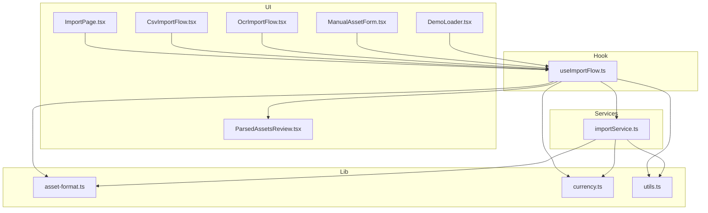
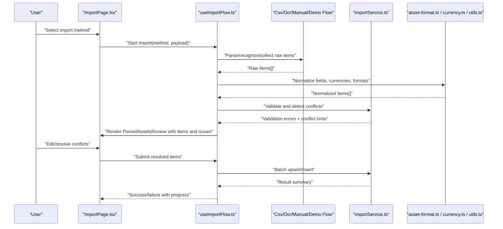
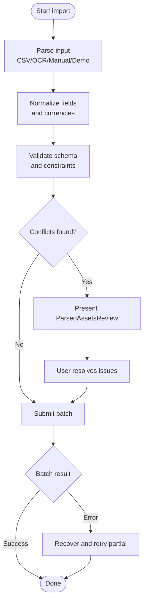
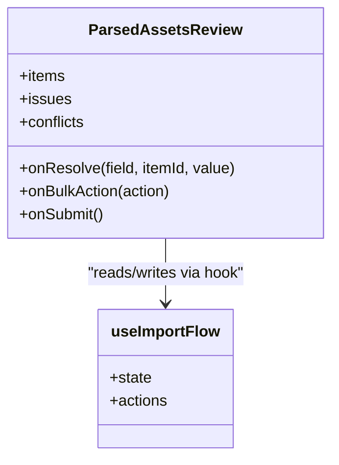
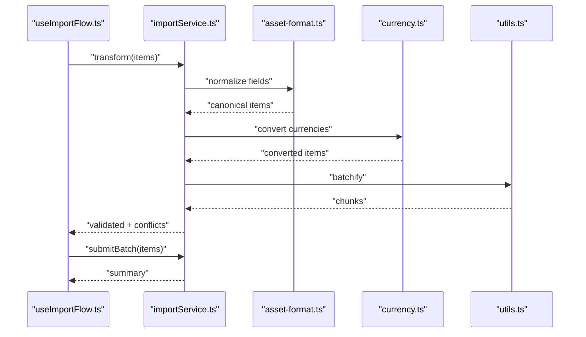
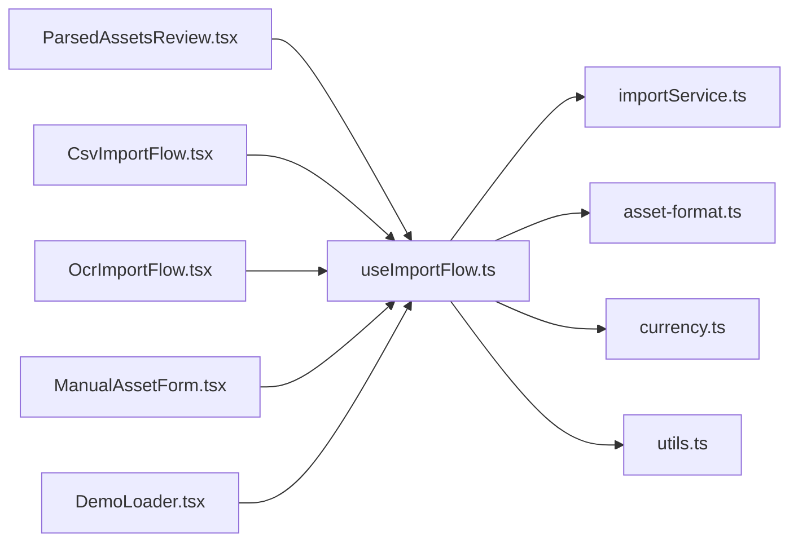

# Import Pipeline & Review

<cite>
**Referenced Files in This Document**
- [useImportFlow.ts](file://src/hooks/useImportFlow.ts)
- [ParsedAssetsReview.tsx](file://src/components/desktop/import/ParsedAssetsReview.tsx)
- [importService.ts](file://src/services/importService.ts)
- [ImportPage.tsx](file://src/pages/desktop/ImportPage.tsx)
- [CsvImportFlow.tsx](file://src/components/desktop/import/CsvImportFlow.tsx)
- [OcrImportFlow.tsx](file://src/components/desktop/import/OcrImportFlow.tsx)
- [ManualAssetForm.tsx](file://src/components/desktop/import/ManualAssetForm.tsx)
- [DemoLoader.tsx](file://src/components/desktop/import/DemoLoader.tsx)
- [asset-format.ts](file://src/lib/asset-format.ts)
- [currency.ts](file://src/lib/currency.ts)
- [utils.ts](file://src/lib/utils.ts)
</cite>

## Table of Contents
1. [Introduction](#introduction)
2. [Project Structure](#project-structure)
3. [Core Components](#core-components)
4. [Architecture Overview](#architecture-overview)
5. [Detailed Component Analysis](#detailed-component-analysis)
6. [Dependency Analysis](#dependency-analysis)
7. [Performance Considerations](#performance-considerations)
8. [Troubleshooting Guide](#troubleshooting-guide)
9. [Conclusion](#conclusion)

## Introduction
This document describes the unified import pipeline architecture and asset review interface. It explains how the useImportFlow hook orchestrates multiple import methods (CSV, OCR, manual entry, demo data), manages import state, coordinates validation and normalization, and integrates with the ParsedAssetsReview component for pre-submission review. It also details the import service layer’s responsibilities for data transformation, conflict resolution, and batch operations, and provides workflow diagrams covering end-to-end flow from file upload to portfolio update, including error recovery and progress tracking.

## Project Structure
The import feature spans hooks, services, UI components, and shared utilities:
- Hook orchestration: src/hooks/useImportFlow.ts
- Review UI: src/components/desktop/import/ParsedAssetsReview.tsx
- Service layer: src/services/importService.ts
- Page integration: src/pages/desktop/ImportPage.tsx
- Import flows: CsvImportFlow.tsx, OcrImportFlow.tsx, ManualAssetForm.tsx, DemoLoader.tsx
- Shared utilities: asset-format.ts, currency.ts, utils.ts

[No sources needed since this diagram shows conceptual structure]

## Core Components
- useImportFlow: Central orchestrator for all import methods; maintains normalized assets, validation results, conflicts, progress, and submission state; exposes actions to start imports, validate, normalize, resolve conflicts, and submit.
- ParsedAssetsReview: Unified review interface that displays parsed assets, highlights validation issues, allows user corrections, and triggers final submission via the hook.
- importService: Backend-facing service responsible for transformation, normalization, conflict detection/resolution helpers, and batch operations.
- Import flows: CSV parser, OCR recognizer, manual form, and demo loader each produce intermediate records consumed by the hook and service.

Key responsibilities:
- Orchestration: coordinate parsing, validation, normalization, conflict handling, and submission.
- State management: track progress, errors, warnings, and final status.
- Data integrity: ensure consistent schema, currency conversion, deduplication, and conflict resolution.
- UX feedback: provide actionable errors and progress indicators during long-running operations.

**Section sources**
- [useImportFlow.ts](file://src/hooks/useImportFlow.ts)
- [ParsedAssetsReview.tsx](file://src/components/desktop/import/ParsedAssetsReview.tsx)
- [importService.ts](file://src/services/importService.ts)
- [CsvImportFlow.tsx](file://src/components/desktop/import/CsvImportFlow.tsx)
- [OcrImportFlow.tsx](file://src/components/desktop/import/OcrImportFlow.tsx)
- [ManualAssetForm.tsx](file://src/components/desktop/import/ManualAssetForm.tsx)
- [DemoLoader.tsx](file://src/components/desktop/import/DemoLoader.tsx)

## Architecture Overview
End-to-end import process:
- User selects an import method (CSV, OCR, manual, or demo).
- Each flow produces raw items that are validated and normalized into a common schema.
- Conflicts are detected and presented for resolution.
- User reviews and edits in ParsedAssetsReview.
- Final submission is performed via batch operations through the service layer.

**Diagram sources**
- [ImportPage.tsx](file://src/pages/desktop/ImportPage.tsx)
- [useImportFlow.ts](file://src/hooks/useImportFlow.ts)
- [CsvImportFlow.tsx](file://src/components/desktop/import/CsvImportFlow.tsx)
- [OcrImportFlow.tsx](file://src/components/desktop/import/OcrImportFlow.tsx)
- [ManualAssetForm.tsx](file://src/components/desktop/import/ManualAssetForm.tsx)
- [DemoLoader.tsx](file://src/components/desktop/import/DemoLoader.tsx)
- [importService.ts](file://src/services/importService.ts)
- [asset-format.ts](file://src/lib/asset-format.ts)
- [currency.ts](file://src/lib/currency.ts)
- [utils.ts](file://src/lib/utils.ts)

## Detailed Component Analysis

### useImportFlow Hook
Responsibilities:
- Method dispatch: routes CSV, OCR, manual, and demo inputs to appropriate parsers.
- Validation and normalization: applies field mapping, type coercion, currency normalization, and format standardization.
- Conflict detection: identifies duplicates or overlapping holdings and surfaces resolution options.
- Progress tracking: emits incremental updates for large batches.
- Submission coordination: calls batch operations and aggregates results.

State model (conceptual):
- items: normalized asset entries
- issues: validation errors/warnings per item
- conflicts: duplicate/conflict metadata and suggested resolutions
- progress: percentage or step-based progress
- status: idle | parsing | validating | normalizing | reviewing | submitting | success | error

Control flow:
- Start import -> parse -> normalize -> validate -> present review -> submit -> finalize.

**Diagram sources**
- [useImportFlow.ts](file://src/hooks/useImportFlow.ts)
- [ParsedAssetsReview.tsx](file://src/components/desktop/import/ParsedAssetsReview.tsx)
- [importService.ts](file://src/services/importService.ts)

**Section sources**
- [useImportFlow.ts](file://src/hooks/useImportFlow.ts)

### ParsedAssetsReview Component
Purpose:
- Display normalized assets in a tabular or card view.
- Highlight validation errors and warnings inline.
- Allow in-place editing and conflict resolution.
- Provide bulk actions (e.g., accept all suggestions).
- Trigger final submission via the hook.

UX considerations:
- Clear error messages and guidance.
- Keyboard-friendly navigation.
- Undo/redo support for edits before submission.
- Progress indicator during submission.

**Diagram sources**
- [ParsedAssetsReview.tsx](file://src/components/desktop/import/ParsedAssetsReview.tsx)
- [useImportFlow.ts](file://src/hooks/useImportFlow.ts)

**Section sources**
- [ParsedAssetsReview.tsx](file://src/components/desktop/import/ParsedAssetsReview.tsx)

### Import Service Layer
Responsibilities:
- Data transformation: map diverse inputs to canonical asset schema.
- Normalization: handle currencies, units, dates, and identifiers.
- Conflict resolution helpers: detect duplicates, suggest merges/skips.
- Batch operations: upsert or insert in efficient batches with transactional semantics where possible.
- Error aggregation: collect and return structured errors for UI display.

Integration points:
- Uses asset-format.ts for canonical types and formatting.
- Uses currency.ts for exchange rates and conversions.
- Uses utils.ts for helper functions (e.g., batching, hashing).

**Diagram sources**
- [importService.ts](file://src/services/importService.ts)
- [asset-format.ts](file://src/lib/asset-format.ts)
- [currency.ts](file://src/lib/currency.ts)
- [utils.ts](file://src/lib/utils.ts)

**Section sources**
- [importService.ts](file://src/services/importService.ts)
- [asset-format.ts](file://src/lib/asset-format.ts)
- [currency.ts](file://src/lib/currency.ts)
- [utils.ts](file://src/lib/utils.ts)

### Import Flows
- CsvImportFlow: Reads CSV, maps columns, handles headers, and returns raw items.
- OcrImportFlow: Recognizes holdings via OCR, extracts entities, and returns raw items.
- ManualAssetForm: Collects user input and validates at entry time.
- DemoLoader: Seeds sample data for testing and onboarding.

Each flow outputs a consistent intermediate shape consumed by useImportFlow for normalization and validation.

**Section sources**
- [CsvImportFlow.tsx](file://src/components/desktop/import/CsvImportFlow.tsx)
- [OcrImportFlow.tsx](file://src/components/desktop/import/OcrImportFlow.tsx)
- [ManualAssetForm.tsx](file://src/components/desktop/import/ManualAssetForm.tsx)
- [DemoLoader.tsx](file://src/components/desktop/import/DemoLoader.tsx)

## Dependency Analysis
High-level dependencies:
- useImportFlow depends on importService and lib utilities.
- ParsedAssetsReview depends on useImportFlow for state and actions.
- Import flows depend on lib utilities for parsing/formatting.
- importService depends on asset-format and currency for canonicalization.

**Diagram sources**
- [useImportFlow.ts](file://src/hooks/useImportFlow.ts)
- [ParsedAssetsReview.tsx](file://src/components/desktop/import/ParsedAssetsReview.tsx)
- [importService.ts](file://src/services/importService.ts)
- [CsvImportFlow.tsx](file://src/components/desktop/import/CsvImportFlow.tsx)
- [OcrImportFlow.tsx](file://src/components/desktop/import/OcrImportFlow.tsx)
- [ManualAssetForm.tsx](file://src/components/desktop/import/ManualAssetForm.tsx)
- [DemoLoader.tsx](file://src/components/desktop/import/DemoLoader.tsx)
- [asset-format.ts](file://src/lib/asset-format.ts)
- [currency.ts](file://src/lib/currency.ts)
- [utils.ts](file://src/lib/utils.ts)

**Section sources**
- [useImportFlow.ts](file://src/hooks/useImportFlow.ts)
- [ParsedAssetsReview.tsx](file://src/components/desktop/import/ParsedAssetsReview.tsx)
- [importService.ts](file://src/services/importService.ts)

## Performance Considerations
- Batch size tuning: split large datasets into chunks to avoid UI freezes and reduce memory pressure.
- Lazy rendering: virtualize large tables in ParsedAssetsReview for smooth scrolling.
- Debounced edits: debounce user edits to minimize re-renders and unnecessary validations.
- Incremental progress: emit frequent progress updates to keep users informed.
- Currency rate caching: cache FX rates to avoid repeated network calls during normalization.
- Idempotent submissions: design batch endpoints to be idempotent to safely retry failed chunks.

[No sources needed since this section provides general guidance]

## Troubleshooting Guide
Common issues and remedies:
- Parsing failures: verify column mappings and header presence; show specific row/column errors.
- Invalid values: highlight invalid fields with clear messages and allow quick fixes.
- Duplicate holdings: present merge/skip options; default to skip if uncertain.
- Network timeouts: implement retries with exponential backoff and partial success reporting.
- Currency conversion errors: fallback to last known rates and flag affected items for review.

Operational tips:
- Log structured errors with context (method, chunk index, item IDs).
- Provide “Retry failed” action for partial failures.
- Persist draft review state to recover after refresh.

**Section sources**
- [useImportFlow.ts](file://src/hooks/useImportFlow.ts)
- [ParsedAssetsReview.tsx](file://src/components/desktop/import/ParsedAssetsReview.tsx)
- [importService.ts](file://src/services/importService.ts)

## Conclusion
The unified import pipeline centralizes orchestration in useImportFlow, ensures data quality through validation and normalization, and offers a robust review experience via ParsedAssetsReview. The import service layer encapsulates transformation, conflict handling, and batch operations, while shared utilities enforce consistency across formats and currencies. With clear progress tracking, error recovery, and user-driven conflict resolution, the system delivers a reliable and user-friendly import workflow from file upload to portfolio update.