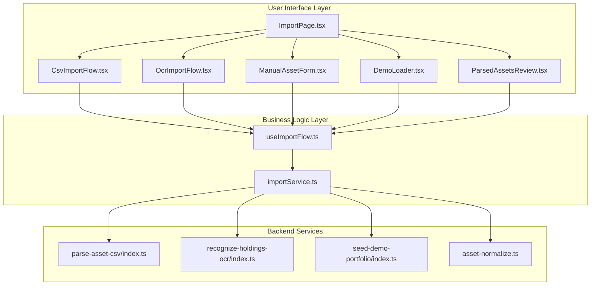
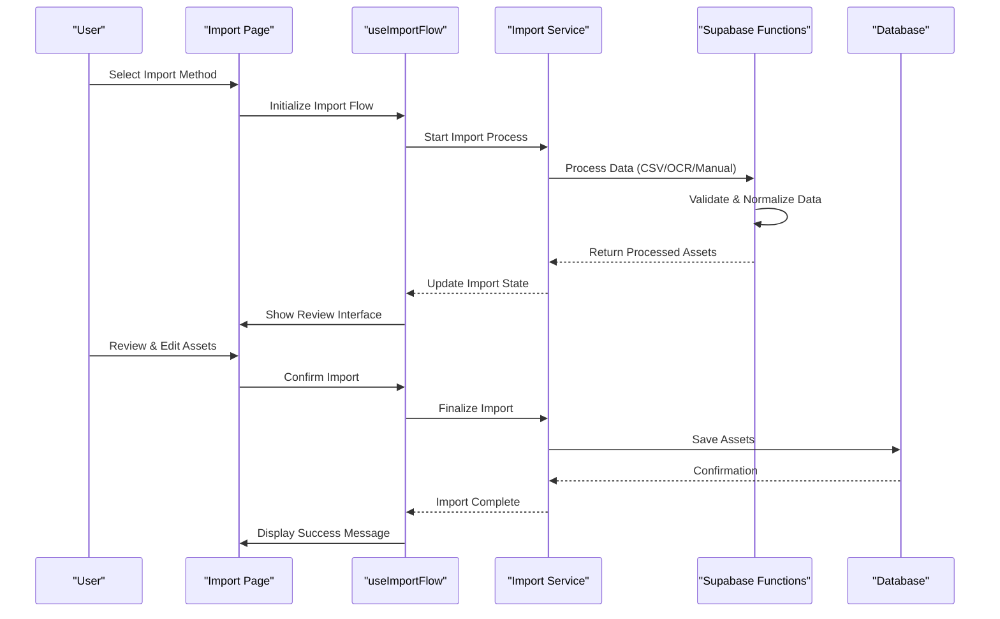
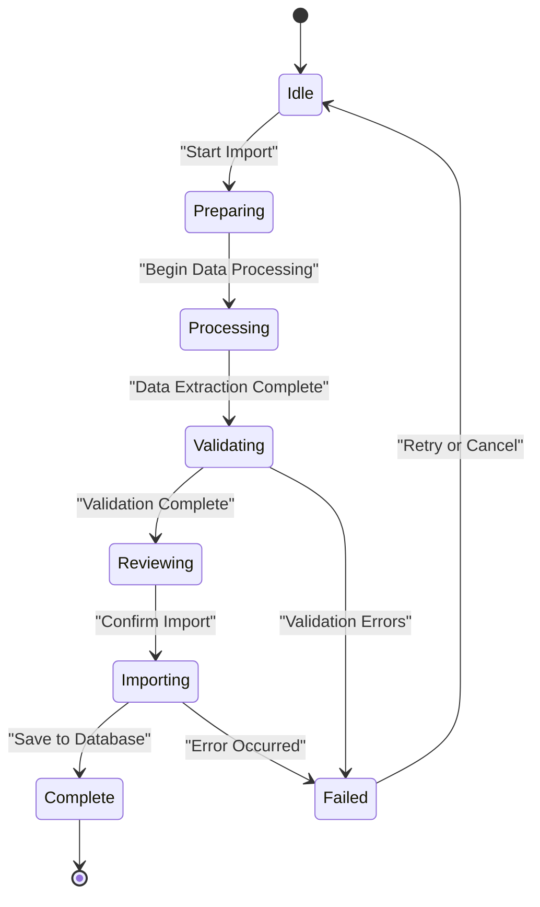
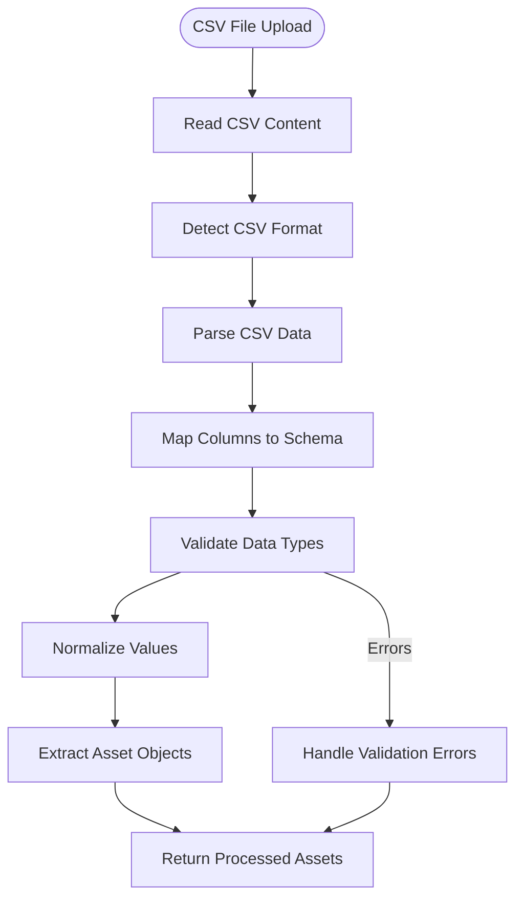
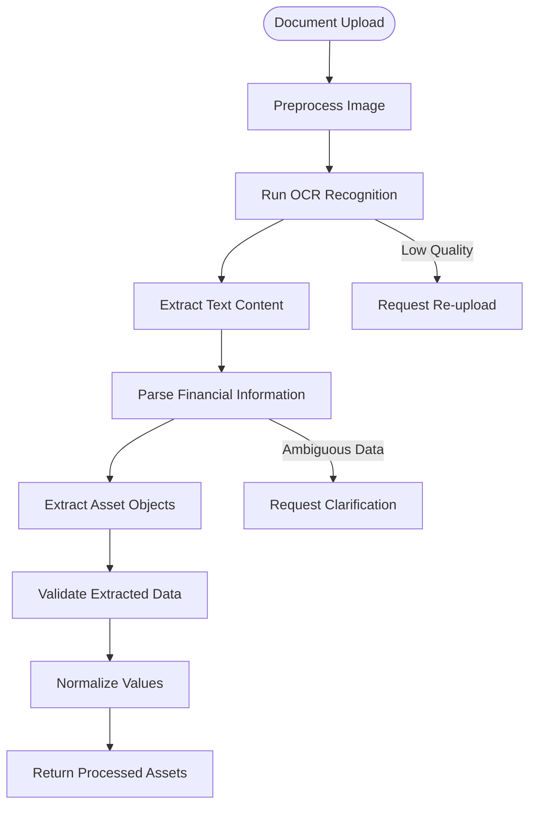
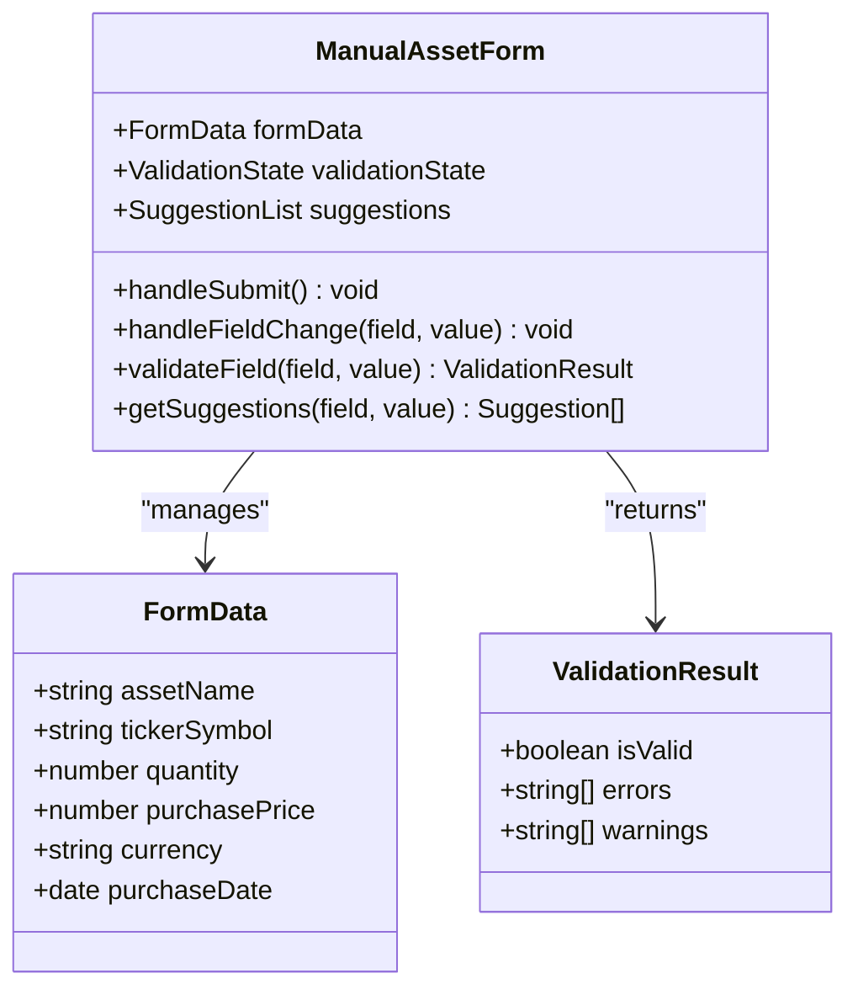
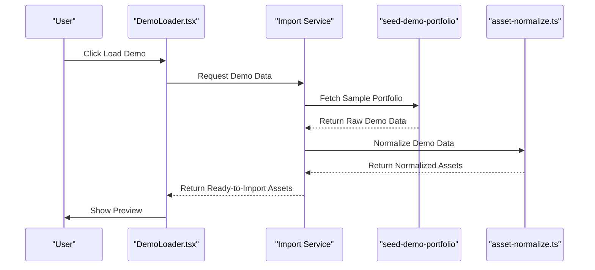
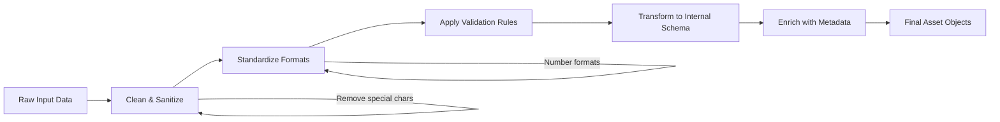
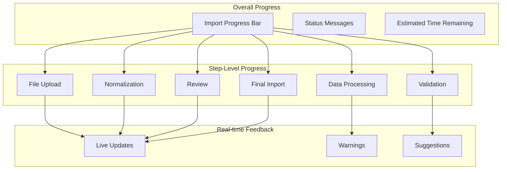
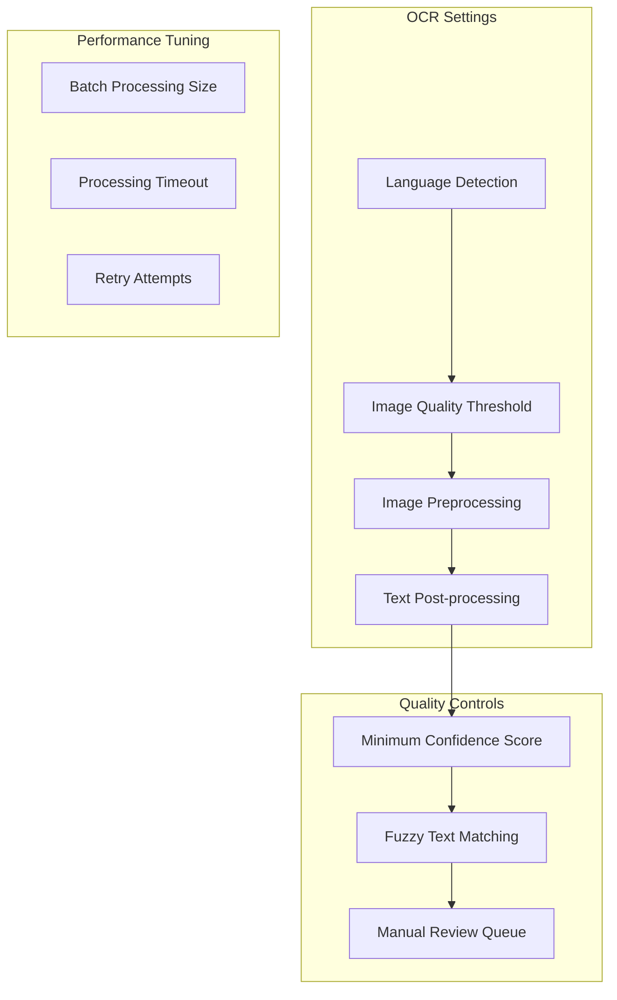

# Import System

<cite>
**Referenced Files in This Document**
- [useImportFlow.ts](file://src/hooks/useImportFlow.ts)
- [CsvImportFlow.tsx](file://src/components/desktop/import/CsvImportFlow.tsx)
- [OcrImportFlow.tsx](file://src/components/desktop/import/OcrImportFlow.tsx)
- [ManualAssetForm.tsx](file://src/components/desktop/import/ManualAssetForm.tsx)
- [DemoLoader.tsx](file://src/components/desktop/import/DemoLoader.tsx)
- [ParsedAssetsReview.tsx](file://src/components/desktop/import/ParsedAssetsReview.tsx)
- [ImportPage.tsx](file://src/pages/desktop/ImportPage.tsx)
- [importService.ts](file://src/services/importService.ts)
- [parse-asset-csv/index.ts](file://supabase/functions/parse-asset-csv/index.ts)
- [recognize-holdings-ocr/index.ts](file://supabase/functions/recognize-holdings-ocr/index.ts)
- [seed-demo-portfolio/index.ts](file://supabase/functions/seed-demo-portfolio/index.ts)
- [asset-normalize.ts](file://supabase/functions/_shared/asset-normalize.ts)
</cite>

## Table of Contents
1. [Introduction](#introduction)
2. [Project Structure](#project-structure)
3. [Core Components](#core-components)
4. [Architecture Overview](#architecture-overview)
5. [Detailed Component Analysis](#detailed-component-analysis)
6. [Data Processing Pipeline](#data-processing-pipeline)
7. [Error Handling and Progress Tracking](#error-handling-and-progress-tracking)
8. [Supported File Formats and OCR Configuration](#supported-file-formats-and-ocr-configuration)
9. [Performance Considerations](#performance-considerations)
10. [Troubleshooting Guide](#troubleshooting-guide)
11. [Conclusion](#conclusion)

## Introduction

The Import System is a comprehensive data ingestion framework that enables users to import financial portfolio data through multiple methods including CSV file parsing, OCR document processing, manual entry, and demo portfolio loading. The system provides a unified interface for data validation, normalization, and review before finalizing imports into the application's asset management database.

This system is designed to handle various input formats, perform intelligent data extraction and validation, and provide users with a clear review process before committing changes to their portfolio data.

## Project Structure

The Import System follows a modular architecture with clear separation of concerns:

**Diagram sources**
- [ImportPage.tsx](file://src/pages/desktop/ImportPage.tsx)
- [useImportFlow.ts](file://src/hooks/useImportFlow.ts)
- [importService.ts](file://src/services/importService.ts)

**Section sources**
- [ImportPage.tsx](file://src/pages/desktop/ImportPage.tsx)
- [useImportFlow.ts](file://src/hooks/useImportFlow.ts)

## Core Components

### useImportFlow Hook

The `useImportFlow` hook serves as the central orchestrator for the entire import process, managing state, coordinating between different import methods, and handling the overall workflow lifecycle.

Key responsibilities include:
- State management for import progress and status
- Coordination between different import flow components
- Data validation and normalization orchestration
- Error handling and user feedback management
- Progress tracking throughout the import pipeline

### Import Flow Components

Each import method has its dedicated component that handles specific input processing:

#### CSV Import Flow
Handles CSV file uploads, parsing, and initial data validation. Supports various CSV formats and performs column mapping.

#### OCR Import Flow
Processes scanned documents and images using optical character recognition to extract financial data. Handles image preprocessing and text extraction.

#### Manual Asset Form
Provides an interactive form interface for users to manually enter asset information with real-time validation and suggestions.

#### Demo Loader
Loads pre-configured sample portfolio data for testing and demonstration purposes.

#### Parsed Assets Review
Displays processed assets in a tabular format for user review, allowing edits, deletions, and final confirmation before import.

**Section sources**
- [CsvImportFlow.tsx](file://src/components/desktop/import/CsvImportFlow.tsx)
- [OcrImportFlow.tsx](file://src/components/desktop/import/OcrImportFlow.tsx)
- [ManualAssetForm.tsx](file://src/components/desktop/import/ManualAssetForm.tsx)
- [DemoLoader.tsx](file://src/components/desktop/import/DemoLoader.tsx)
- [ParsedAssetsReview.tsx](file://src/components/desktop/import/ParsedAssetsReview.tsx)

## Architecture Overview

The Import System implements a pipeline architecture with clear separation between data ingestion, processing, and presentation layers:

**Diagram sources**
- [useImportFlow.ts](file://src/hooks/useImportFlow.ts)
- [importService.ts](file://src/services/importService.ts)
- [parse-asset-csv/index.ts](file://supabase/functions/parse-asset-csv/index.ts)

## Detailed Component Analysis

### Import Flow Architecture

The import system follows a state machine pattern where each import method progresses through defined stages:

**Diagram sources**
- [useImportFlow.ts](file://src/hooks/useImportFlow.ts)

### CSV Import Processing

The CSV import flow handles various CSV formats with intelligent column detection and mapping:

**Diagram sources**
- [CsvImportFlow.tsx](file://src/components/desktop/import/CsvImportFlow.tsx)
- [parse-asset-csv/index.ts](file://supabase/functions/parse-asset-csv/index.ts)

### OCR Document Processing

The OCR import flow processes scanned documents and images to extract financial data:

**Diagram sources**
- [OcrImportFlow.tsx](file://src/components/desktop/import/OcrImportFlow.tsx)
- [recognize-holdings-ocr/index.ts](file://supabase/functions/recognize-holdings-ocr/index.ts)

### Manual Asset Entry

The manual entry form provides real-time validation and suggestions:

**Diagram sources**
- [ManualAssetForm.tsx](file://src/components/desktop/import/ManualAssetForm.tsx)

### Demo Portfolio Loading

The demo loader provides sample data for testing and demonstration:

**Diagram sources**
- [DemoLoader.tsx](file://src/components/desktop/import/DemoLoader.tsx)
- [seed-demo-portfolio/index.ts](file://supabase/functions/seed-demo-portfolio/index.ts)
- [asset-normalize.ts](file://supabase/functions/_shared/asset-normalize.ts)

## Data Processing Pipeline

### Data Validation Rules

The system implements comprehensive validation rules across all import methods:

| Field | Type | Required | Validation Rules |
|-------|------|----------|------------------|
| Asset Name | String | Yes | Non-empty, max 100 characters |
| Ticker Symbol | String | No | Alphanumeric, max 10 characters |
| Quantity | Number | Yes | Positive number, max 10^15 |
| Purchase Price | Number | Yes | Positive number, supports decimals |
| Currency | String | Yes | ISO 4217 currency code |
| Purchase Date | Date | Yes | Valid date, not in future |
| Account ID | UUID | Yes | Valid UUID format |

### Data Normalization Workflow

All imported data goes through a standardized normalization process:

**Diagram sources**
- [asset-normalize.ts](file://supabase/functions/_shared/asset-normalize.ts)

## Error Handling and Progress Tracking

### Error Categories

The system categorizes errors into distinct types for appropriate user feedback:

| Error Type | Description | User Action | Recovery Option |
|------------|-------------|-------------|-----------------|
| Validation Error | Data doesn't meet requirements | Review and correct fields | Auto-suggestions available |
| Processing Error | Technical issue during import | Retry operation | Automatic retry with backoff |
| Network Error | Connection or API failure | Check internet connection | Exponential backoff retry |
| Format Error | Unsupported file format | Convert to supported format | Format conversion hints |
| Permission Error | Insufficient access rights | Contact administrator | Admin assistance required |

### Progress Tracking Implementation

Progress tracking is implemented at multiple levels:

**Diagram sources**
- [useImportFlow.ts](file://src/hooks/useImportFlow.ts)

## Supported File Formats and OCR Configuration

### Supported File Formats

| Format | Extension | Max Size | Features |
|--------|-----------|----------|----------|
| CSV | .csv | 10MB | Multi-sheet support, encoding detection |
| Excel | .xlsx, .xls | 25MB | Formula evaluation, named ranges |
| PDF | .pdf | 50MB | Text extraction, table recognition |
| Images | .jpg, .png, .tiff | 10MB | OCR processing, quality assessment |
| JSON | .json | 5MB | Schema validation, nested structures |

### OCR Configuration Options

The OCR system supports various configuration options for different document types:

**Diagram sources**
- [OcrImportFlow.tsx](file://src/components/desktop/import/OcrImportFlow.tsx)
- [recognize-holdings-ocr/index.ts](file://supabase/functions/recognize-holdings-ocr/index.ts)

## Performance Considerations

### Optimization Strategies

The Import System implements several performance optimization strategies:

- **Lazy Loading**: Components load only when needed
- **Chunked Processing**: Large files are processed in manageable chunks
- **Caching**: Frequently used data is cached to reduce API calls
- **Debounced Validation**: Real-time validation is debounced to prevent excessive processing
- **Background Processing**: Heavy operations run in background threads

### Memory Management

Memory usage is optimized through:
- Stream processing for large files
- Garbage collection triggers after major operations
- Efficient data structure selection
- Proper cleanup of temporary resources

## Troubleshooting Guide

### Common Issues and Solutions

| Issue | Symptoms | Solution |
|-------|----------|----------|
| CSV Parsing Failures | Invalid format errors | Check delimiter settings, encoding |
| OCR Recognition Errors | Low confidence scores | Improve image quality, adjust settings |
| Slow Import Performance | Long processing times | Reduce batch size, check network |
| Data Validation Errors | Field-specific errors | Review data format, use suggestions |
| Memory Exhaustion | Application crashes | Process smaller batches, clear cache |

### Debug Information

The system provides comprehensive debug information:
- Detailed error logs with stack traces
- Processing timeline with timestamps
- Memory usage statistics
- Network request/response logging
- Data transformation audit trails

**Section sources**
- [useImportFlow.ts](file://src/hooks/useImportFlow.ts)
- [importService.ts](file://src/services/importService.ts)

## Conclusion

The Import System provides a robust, flexible, and user-friendly solution for importing financial portfolio data through multiple channels. Its modular architecture ensures maintainability while the comprehensive validation and normalization processes guarantee data integrity. The system's emphasis on user feedback and error handling creates a smooth import experience even for complex data scenarios.

Key strengths include:
- Multiple import methods supporting various data sources
- Intelligent data validation and normalization
- Comprehensive error handling and recovery mechanisms
- Real-time progress tracking and user feedback
- Extensible architecture for future import methods

The system is designed to scale with growing data volumes and can accommodate new import formats and processing methods through its modular component structure.