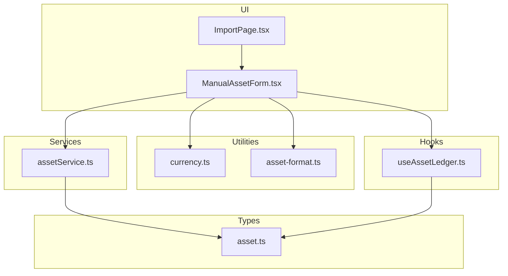
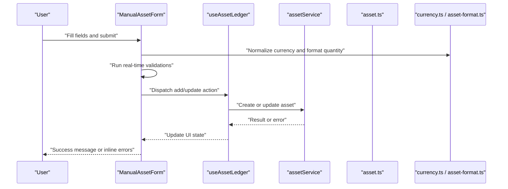
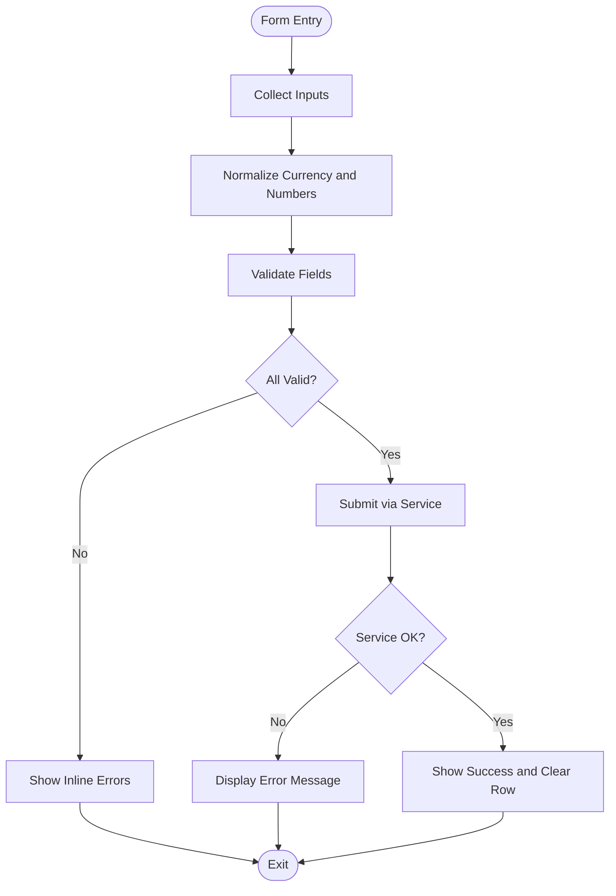
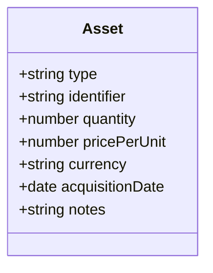
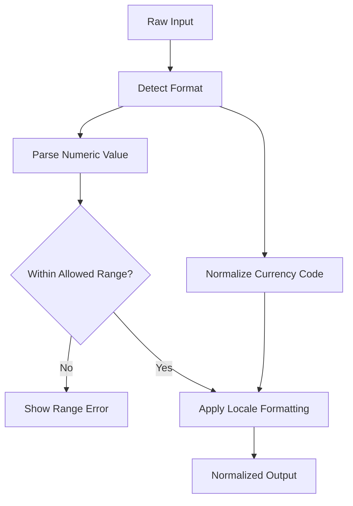
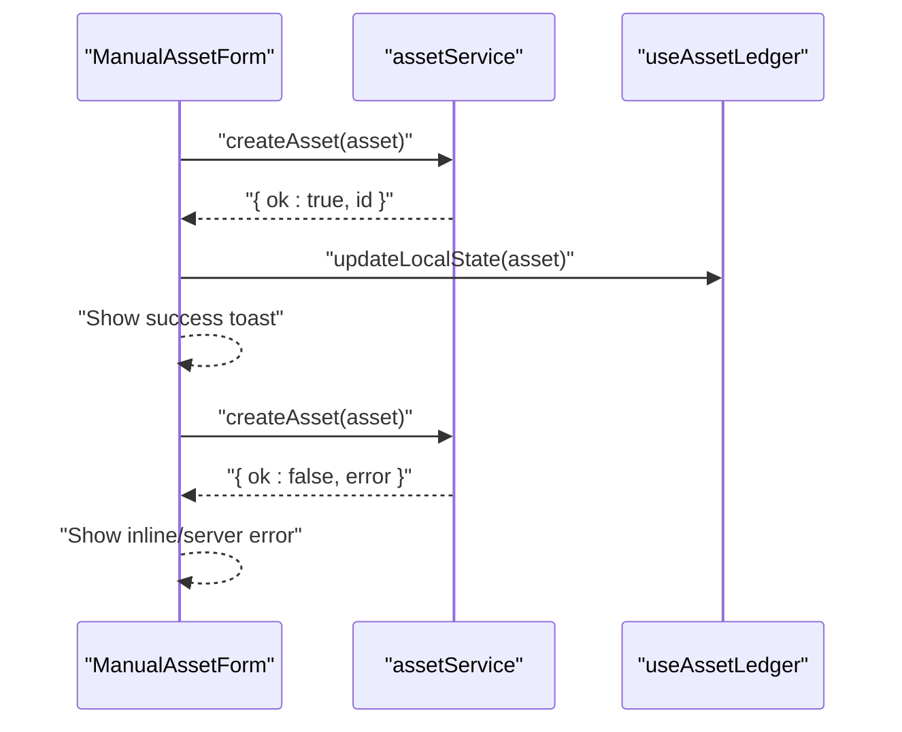
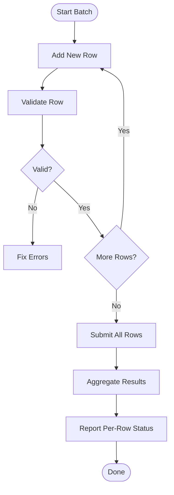
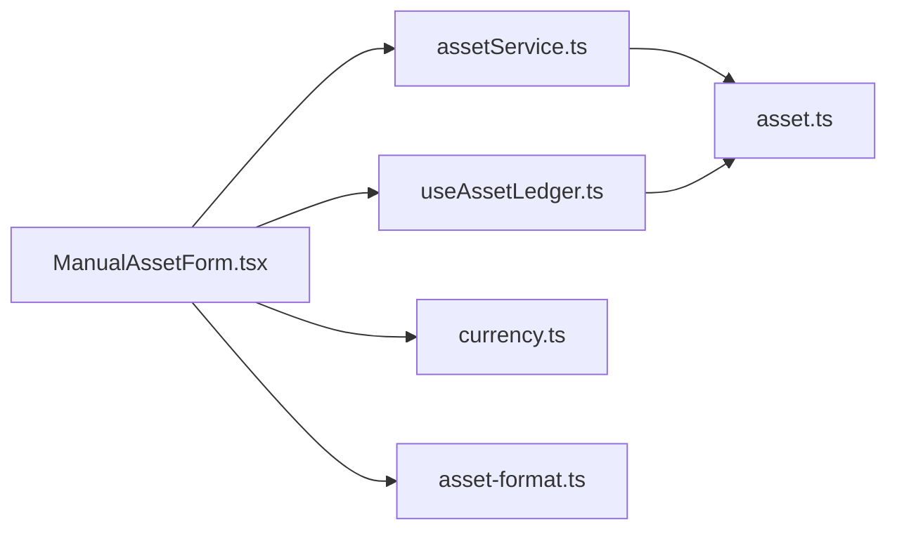

# Manual Asset Entry

<cite>
**Referenced Files in This Document**
- [ManualAssetForm.tsx](file://src/components/desktop/import/ManualAssetForm.tsx)
- [assetService.ts](file://src/services/assetService.ts)
- [asset.ts](file://src/types/app/asset.ts)
- [currency.ts](file://src/lib/currency.ts)
- [asset-format.ts](file://src/lib/asset-format.ts)
- [useAssetLedger.ts](file://src/hooks/useAssetLedger.ts)
- [ImportPage.tsx](file://src/pages/desktop/ImportPage.tsx)
</cite>

## Table of Contents
1. [Introduction](#introduction)
2. [Project Structure](#project-structure)
3. [Core Components](#core-components)
4. [Architecture Overview](#architecture-overview)
5. [Detailed Component Analysis](#detailed-component-analysis)
6. [Dependency Analysis](#dependency-analysis)
7. [Performance Considerations](#performance-considerations)
8. [Troubleshooting Guide](#troubleshooting-guide)
9. [Conclusion](#conclusion)

## Introduction
This document explains the Manual Asset Entry feature that allows users to add individual assets to their portfolio via a guided form. It covers:
- The ManualAssetForm component’s fields, validations, and real-time feedback
- Supported asset types and example scenarios (stocks, bonds, crypto, real estate)
- Currency handling and quantity formatting
- Integration with the asset service layer and error handling for invalid entries
- Batch entry capabilities and how manual entries relate to batch workflows

## Project Structure
The Manual Asset Entry feature spans UI components, services, types, and utilities:
- UI: ManualAssetForm.tsx renders the form and orchestrates validation and submission
- Service: assetService.ts provides methods to persist or update assets
- Types: asset.ts defines the canonical asset data model used across the app
- Utilities: currency.ts and asset-format.ts handle currency normalization and number formatting
- Hooks: useAssetLedger.ts manages local state and side effects around asset operations
- Page: ImportPage.tsx integrates the form into the import flow

**Diagram sources**
- [ManualAssetForm.tsx](file://src/components/desktop/import/ManualAssetForm.tsx)
- [assetService.ts](file://src/services/assetService.ts)
- [asset.ts](file://src/types/app/asset.ts)
- [currency.ts](file://src/lib/currency.ts)
- [asset-format.ts](file://src/lib/asset-format.ts)
- [useAssetLedger.ts](file://src/hooks/useAssetLedger.ts)
- [ImportPage.tsx](file://src/pages/desktop/ImportPage.tsx)

**Section sources**
- [ManualAssetForm.tsx](file://src/components/desktop/import/ManualAssetForm.tsx)
- [assetService.ts](file://src/services/assetService.ts)
- [asset.ts](file://src/types/app/asset.ts)
- [currency.ts](file://src/lib/currency.ts)
- [asset-format.ts](file://src/lib/asset-format.ts)
- [useAssetLedger.ts](file://src/hooks/useAssetLedger.ts)
- [ImportPage.tsx](file://src/pages/desktop/ImportPage.tsx)

## Core Components
- ManualAssetForm: A controlled form that collects asset details, validates inputs in real time, formats quantities and currencies, and submits via the asset service. It also supports adding multiple rows for quick batch entry.
- Asset Service Layer: Provides functions to create/update assets and returns standardized results and errors consumed by the UI.
- Data Model: A strongly typed asset structure ensures consistent field names and constraints across the application.

Key responsibilities:
- Field-level validation with immediate user feedback
- Normalization of currency codes and numeric values
- Submission orchestration and error propagation
- Optional multi-row mode for batch entry

**Section sources**
- [ManualAssetForm.tsx](file://src/components/desktop/import/ManualAssetForm.tsx)
- [assetService.ts](file://src/services/assetService.ts)
- [asset.ts](file://src/types/app/asset.ts)

## Architecture Overview
The form follows a layered architecture:
- Presentation: ManualAssetForm handles user interactions and displays validation messages
- State: useAssetLedger coordinates local state and triggers service calls
- Domain: assetService encapsulates persistence logic and business rules
- Contracts: asset.ts defines the canonical shape of an asset record
- Utilities: currency.ts and asset-format.ts ensure consistent formatting and normalization

**Diagram sources**
- [ManualAssetForm.tsx](file://src/components/desktop/import/ManualAssetForm.tsx)
- [useAssetLedger.ts](file://src/hooks/useAssetLedger.ts)
- [assetService.ts](file://src/services/assetService.ts)
- [asset.ts](file://src/types/app/asset.ts)
- [currency.ts](file://src/lib/currency.ts)
- [asset-format.ts](file://src/lib/asset-format.ts)

## Detailed Component Analysis

### ManualAssetForm: Fields, Validations, and Real-Time Feedback
- Input fields typically include:
  - Asset type selector (e.g., stock, bond, crypto, real estate)
  - Identifier (ticker/symbol/name)
  - Quantity (number input with formatting)
  - Price per unit (with currency selection)
  - Acquisition date (optional depending on asset type)
  - Notes/tags (optional)
- Validation rules enforced in real time:
  - Required fields are validated on change and blur
  - Numeric fields enforce positive numbers and reasonable ranges
  - Currency code must be a supported ISO code
  - Date fields must be valid dates when provided
  - Type-specific rules (e.g., minimum price thresholds for certain asset classes)
- Real-time feedback:
  - Inline error messages appear next to invalid fields
  - Success indicators show when a row is valid
  - Submit button remains disabled until all required fields pass validation
- Batch entry:
  - Users can add multiple rows and submit them together
  - Each row is validated independently before aggregation
  - Partial failures report which rows failed and why

**Diagram sources**
- [ManualAssetForm.tsx](file://src/components/desktop/import/ManualAssetForm.tsx)
- [currency.ts](file://src/lib/currency.ts)
- [asset-format.ts](file://src/lib/asset-format.ts)

**Section sources**
- [ManualAssetForm.tsx](file://src/components/desktop/import/ManualAssetForm.tsx)
- [currency.ts](file://src/lib/currency.ts)
- [asset-format.ts](file://src/lib/asset-format.ts)

### Asset Data Model and Validation Rules
The canonical asset structure includes:
- Required fields:
  - Type: one of supported categories (stock, bond, crypto, real estate)
  - Identifier: ticker/symbol/name appropriate to the type
  - Quantity: positive number
  - Price per unit: positive number
  - Currency: valid ISO currency code
- Optional properties:
  - Acquisition date
  - Notes or tags
  - Account or location metadata
  - Custom attributes specific to asset class
- Validation rules:
  - Type determines allowed identifiers and additional fields
  - Quantity and price must be greater than zero
  - Currency must be recognized and normalized
  - Dates must be valid and not in the future if restricted by policy

**Diagram sources**
- [asset.ts](file://src/types/app/asset.ts)

**Section sources**
- [asset.ts](file://src/types/app/asset.ts)

### Currency Handling and Quantity Formatting
- Currency normalization:
  - Accepts both full names and ISO codes
  - Converts to uppercase standard codes
  - Rejects unsupported codes with clear feedback
- Number formatting:
  - Thousands separators applied automatically
  - Decimal precision aligned with currency settings
  - Prevents invalid characters and negative values where disallowed

**Diagram sources**
- [currency.ts](file://src/lib/currency.ts)
- [asset-format.ts](file://src/lib/asset-format.ts)

**Section sources**
- [currency.ts](file://src/lib/currency.ts)
- [asset-format.ts](file://src/lib/asset-format.ts)

### Integration with Asset Service Layer and Error Handling
- Submission flow:
  - Form builds an asset object conforming to the type contract
  - Calls the asset service to create or update the asset
  - Receives a result or error and updates UI accordingly
- Error handling:
  - Network errors display a generic failure message with retry option
  - Validation errors from the server map to specific fields
  - Duplicate or conflicting entries surface actionable guidance
- Success path:
  - On success, the row clears and a confirmation appears
  - Local ledger updates reflect the new asset immediately

**Diagram sources**
- [ManualAssetForm.tsx](file://src/components/desktop/import/ManualAssetForm.tsx)
- [assetService.ts](file://src/services/assetService.ts)
- [useAssetLedger.ts](file://src/hooks/useAssetLedger.ts)

**Section sources**
- [assetService.ts](file://src/services/assetService.ts)
- [useAssetLedger.ts](file://src/hooks/useAssetLedger.ts)
- [ManualAssetForm.tsx](file://src/components/desktop/import/ManualAssetForm.tsx)

### Examples by Asset Type
- Stocks:
  - Identifier: ticker symbol
  - Typical fields: quantity, price per share, currency, acquisition date
- Bonds:
  - Identifier: ISIN or CUSIP
  - Additional fields may include coupon rate and maturity date
- Crypto:
  - Identifier: coin symbol or contract address
  - Quantity often uses decimal precision; price in fiat currency
- Real Estate:
  - Identifier: property address or parcel ID
  - Additional fields may include square footage and location tags

These examples illustrate how the same form adapts to different asset classes through type-specific validation and optional fields.

[No sources needed since this section provides general examples]

### Batch Entry Capabilities
- Add multiple rows without leaving the form
- Validate each row independently before submission
- Aggregate successful rows and report failures per row
- Provide bulk actions such as “Clear All” and “Add Another”

**Diagram sources**
- [ManualAssetForm.tsx](file://src/components/desktop/import/ManualAssetForm.tsx)

**Section sources**
- [ManualAssetForm.tsx](file://src/components/desktop/import/ManualAssetForm.tsx)

## Dependency Analysis
The following diagram shows key dependencies between the form, service, types, and utilities:

**Diagram sources**
- [ManualAssetForm.tsx](file://src/components/desktop/import/ManualAssetForm.tsx)
- [assetService.ts](file://src/services/assetService.ts)
- [useAssetLedger.ts](file://src/hooks/useAssetLedger.ts)
- [asset.ts](file://src/types/app/asset.ts)
- [currency.ts](file://src/lib/currency.ts)
- [asset-format.ts](file://src/lib/asset-format.ts)

**Section sources**
- [ManualAssetForm.tsx](file://src/components/desktop/import/ManualAssetForm.tsx)
- [assetService.ts](file://src/services/assetService.ts)
- [useAssetLedger.ts](file://src/hooks/useAssetLedger.ts)
- [asset.ts](file://src/types/app/asset.ts)
- [currency.ts](file://src/lib/currency.ts)
- [asset-format.ts](file://src/lib/asset-format.ts)

## Performance Considerations
- Debounce expensive validations or network checks to avoid jank during typing
- Use memoized formatting functions for large batches
- Avoid re-rendering entire forms by isolating row state
- Prefer incremental submissions for very large batches to reduce memory pressure

[No sources needed since this section provides general guidance]

## Troubleshooting Guide
Common issues and resolutions:
- Invalid currency code:
  - Ensure the code matches a supported ISO standard
  - Check normalization behavior and error messages
- Negative or zero quantity/price:
  - Enforce positive number constraints and provide clear hints
- Duplicate entries:
  - If duplicates are rejected, guide users to edit existing records instead
- Server errors:
  - Display user-friendly messages and offer retry options
- Date parsing failures:
  - Validate date formats and provide calendar pickers where possible

**Section sources**
- [ManualAssetForm.tsx](file://src/components/desktop/import/ManualAssetForm.tsx)
- [assetService.ts](file://src/services/assetService.ts)

## Conclusion
The Manual Asset Entry form provides a robust, user-friendly way to add assets to a portfolio. With strong type contracts, real-time validation, currency normalization, and clear error handling, it supports diverse asset types and batch workflows while integrating cleanly with the service layer.

[No sources needed since this section summarizes without analyzing specific files]