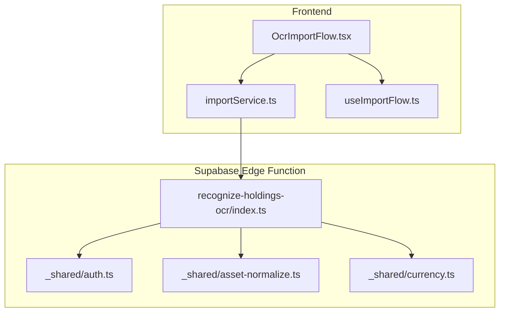
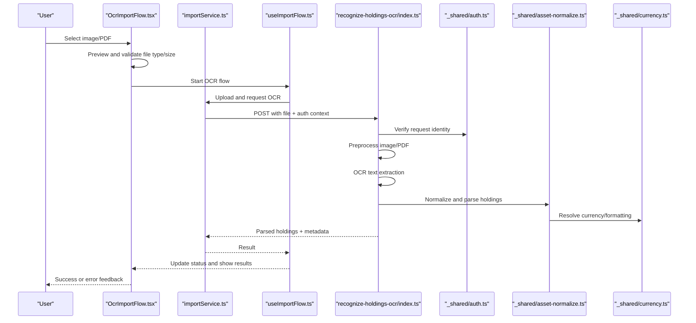
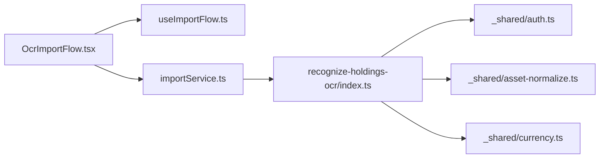

# OCR Document Processing

<cite>
**Referenced Files in This Document**
- [OcrImportFlow.tsx](file://src/components/desktop/import/OcrImportFlow.tsx)
- [index.ts](file://supabase/functions/recognize-holdings-ocr/index.ts)
- [asset-normalize.ts](file://supabase/functions/_shared/asset-normalize.ts)
- [auth.ts](file://supabase/functions/_shared/auth.ts)
- [currency.ts](file://supabase/functions/_shared/currency.ts)
- [importService.ts](file://src/services/importService.ts)
- [useImportFlow.ts](file://src/hooks/useImportFlow.ts)
</cite>

## Table of Contents
1. [Introduction](#introduction)
2. [Project Structure](#project-structure)
3. [Core Components](#core-components)
4. [Architecture Overview](#architecture-overview)
5. [Detailed Component Analysis](#detailed-component-analysis)
6. [Dependency Analysis](#dependency-analysis)
7. [Performance Considerations](#performance-considerations)
8. [Troubleshooting Guide](#troubleshooting-guide)
9. [Conclusion](#conclusion)

## Introduction
This document explains the OCR Document Processing feature that allows users to import portfolio holdings from scanned documents or screenshots. It covers the user-facing OcrImportFlow component (upload, preview, and processing status), the serverless recognize-holdings-ocr edge function (image recognition, text extraction, and parsing), supported formats, preprocessing, accuracy considerations, post-processing validation, and best practices for optimal results.

## Project Structure
The OCR flow spans UI components, a service layer, hooks, and a Supabase Edge Function:
- Frontend UI: OcrImportFlow handles file selection, image preview, progress indication, and error display.
- Service/Hook: importService and useImportFlow orchestrate upload and call the edge function.
- Backend: recognize-holdings-ocr performs authentication, image handling, OCR, normalization, and returns parsed assets.

**Diagram sources**
- [OcrImportFlow.tsx](file://src/components/desktop/import/OcrImportFlow.tsx)
- [importService.ts](file://src/services/importService.ts)
- [useImportFlow.ts](file://src/hooks/useImportFlow.ts)
- [index.ts](file://supabase/functions/recognize-holdings-ocr/index.ts)
- [auth.ts](file://supabase/functions/_shared/auth.ts)
- [asset-normalize.ts](file://supabase/functions/_shared/asset-normalize.ts)
- [currency.ts](file://supabase/functions/_shared/currency.ts)

**Section sources**
- [OcrImportFlow.tsx](file://src/components/desktop/import/OcrImportFlow.tsx)
- [importService.ts](file://src/services/importService.ts)
- [useImportFlow.ts](file://src/hooks/useImportFlow.ts)
- [index.ts](file://supabase/functions/recognize-holdings-ocr/index.ts)
- [asset-normalize.ts](file://supabase/functions/_shared/asset-normalize.ts)
- [auth.ts](file://supabase/functions/_shared/auth.ts)
- [currency.ts](file://supabase/functions/_shared/currency.ts)

## Core Components
- OcrImportFlow (UI): Provides an image/PDF upload interface, live preview, and processing status indicators (e.g., uploading, recognizing, parsing). It also surfaces errors and success feedback to the user.
- recognize-holdings-ocr (Edge Function): Authenticates requests, accepts images/PDFs, runs OCR, normalizes extracted data, and returns structured holdings.

Key responsibilities:
- OcrImportFlow: File input, preview rendering, progress updates, error messaging, and triggering the backend call.
- Edge Function: Security checks, image/PDF ingestion, OCR pipeline, normalization, and response formatting.

**Section sources**
- [OcrImportFlow.tsx](file://src/components/desktop/import/OcrImportFlow.tsx)
- [index.ts](file://supabase/functions/recognize-holdings-ocr/index.ts)

## Architecture Overview
End-to-end flow from upload to parsed holdings:

**Diagram sources**
- [OcrImportFlow.tsx](file://src/components/desktop/import/OcrImportFlow.tsx)
- [importService.ts](file://src/services/importService.ts)
- [useImportFlow.ts](file://src/hooks/useImportFlow.ts)
- [index.ts](file://supabase/functions/recognize-holdings-ocr/index.ts)
- [auth.ts](file://supabase/functions/_shared/auth.ts)
- [asset-normalize.ts](file://supabase/functions/_shared/asset-normalize.ts)
- [currency.ts](file://supabase/functions/_shared/currency.ts)

## Detailed Component Analysis

### OcrImportFlow Component
Responsibilities:
- Accepts image and PDF files via a file input.
- Renders a preview of the selected document.
- Shows processing states: uploading, recognizing, parsing, complete, and error.
- Calls the import service/hook to trigger OCR and displays outcomes.

User interactions:
- Drag-and-drop or click-to-upload.
- Immediate visual confirmation via preview.
- Clear status messages during long-running operations.

Error handling:
- Invalid file types or oversized files are rejected early.
- Network or server errors surface actionable messages.

Best practices:
- Keep previews lightweight (resize/compress before sending if needed).
- Debounce or cancel in-flight requests on unmount.

**Section sources**
- [OcrImportFlow.tsx](file://src/components/desktop/import/OcrImportFlow.tsx)

### recognize-holdings-ocr Edge Function
Responsibilities:
- Validates and authenticates the request using shared auth utilities.
- Accepts image and PDF inputs.
- Performs preprocessing (e.g., format conversion, scaling, denoising).
- Runs OCR to extract text.
- Parses raw text into structured holdings using normalization helpers.
- Returns validated results to the client.

Data normalization:
- Uses asset normalization and currency utilities to standardize fields and values.

Security:
- Enforces authentication and authorization checks before processing.

**Section sources**
- [index.ts](file://supabase/functions/recognize-holdings-ocr/index.ts)
- [auth.ts](file://supabase/functions/_shared/auth.ts)
- [asset-normalize.ts](file://supabase/functions/_shared/asset-normalize.ts)
- [currency.ts](file://supabase/functions/_shared/currency.ts)

### Service and Hook Orchestration
- importService encapsulates HTTP calls to the edge function, including headers and payload preparation.
- useImportFlow manages state transitions (idle, uploading, recognizing, parsing, done, error) and exposes methods for the UI to consume.

Integration points:
- The UI triggers the hook, which delegates to the service.
- The service forwards the request to the edge function and propagates responses/errors back up.

**Section sources**
- [importService.ts](file://src/services/importService.ts)
- [useImportFlow.ts](file://src/hooks/useImportFlow.ts)

## Dependency Analysis
High-level dependencies between modules involved in OCR:

**Diagram sources**
- [OcrImportFlow.tsx](file://src/components/desktop/import/OcrImportFlow.tsx)
- [useImportFlow.ts](file://src/hooks/useImportFlow.ts)
- [importService.ts](file://src/services/importService.ts)
- [index.ts](file://supabase/functions/recognize-holdings-ocr/index.ts)
- [auth.ts](file://supabase/functions/_shared/auth.ts)
- [asset-normalize.ts](file://supabase/functions/_shared/asset-normalize.ts)
- [currency.ts](file://supabase/functions/_shared/currency.ts)

**Section sources**
- [OcrImportFlow.tsx](file://src/components/desktop/import/OcrImportFlow.tsx)
- [useImportFlow.ts](file://src/hooks/useImportFlow.ts)
- [importService.ts](file://src/services/importService.ts)
- [index.ts](file://supabase/functions/recognize-holdings-ocr/index.ts)
- [auth.ts](file://supabase/functions/_shared/auth.ts)
- [asset-normalize.ts](file://supabase/functions/_shared/asset-normalize.ts)
- [currency.ts](file://supabase/functions/_shared/currency.ts)

## Performance Considerations
- Image size and resolution: Large scans increase upload time and OCR latency. Prefer moderate DPI (e.g., 300 DPI) and reasonable dimensions.
- Compression: Lossless or near-lossless compression reduces bandwidth without harming OCR quality.
- Batch uploads: If supporting multiple pages, consider page-by-page processing to improve responsiveness.
- Caching: Cache repeated OCR results for identical documents when appropriate.
- Error retries: Implement exponential backoff for transient network failures.

[No sources needed since this section provides general guidance]

## Troubleshooting Guide
Common issues and remedies:
- Low-quality scans: Blurry, skewed, or low-contrast images reduce OCR accuracy. Re-scan with better lighting, steady camera, and higher resolution.
- Unsupported formats: Only accepted image and PDF files will be processed; others are rejected at the UI level.
- Partial text extraction: Complex layouts or small fonts may cause misreads. Provide clearer headings and consistent formatting.
- Currency mismatches: Ensure currency codes are legible; the normalization layer uses currency utilities to standardize values.
- Authentication errors: Confirm the user is logged in and has permission to invoke the edge function.

Operational tips:
- Use high-contrast backgrounds and avoid glare/shadows.
- Align documents straight and keep edges visible.
- For multi-page PDFs, ensure each page is clear and not compressed excessively.

**Section sources**
- [OcrImportFlow.tsx](file://src/components/desktop/import/OcrImportFlow.tsx)
- [index.ts](file://supabase/functions/recognize-holdings-ocr/index.ts)
- [asset-normalize.ts](file://supabase/functions/_shared/asset-normalize.ts)
- [currency.ts](file://supabase/functions/_shared/currency.ts)

## Conclusion
The OCR Document Processing feature integrates a responsive UI with a secure, normalized backend pipeline to convert scanned holdings into structured data. By following recommended scanning practices and leveraging built-in preprocessing and normalization, users can achieve reliable imports across supported image and PDF formats.