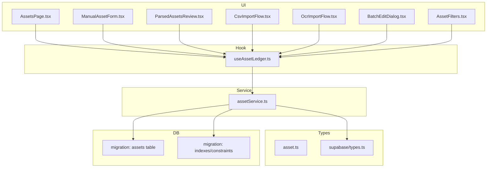
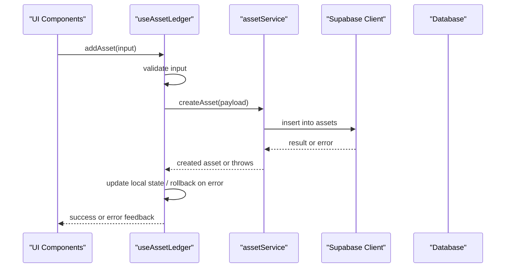
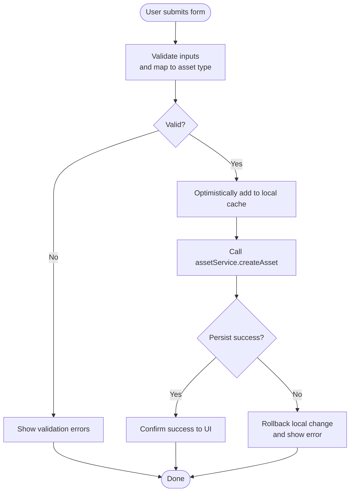
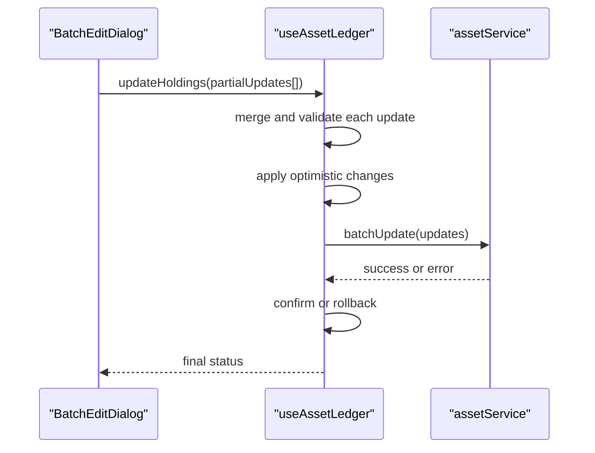
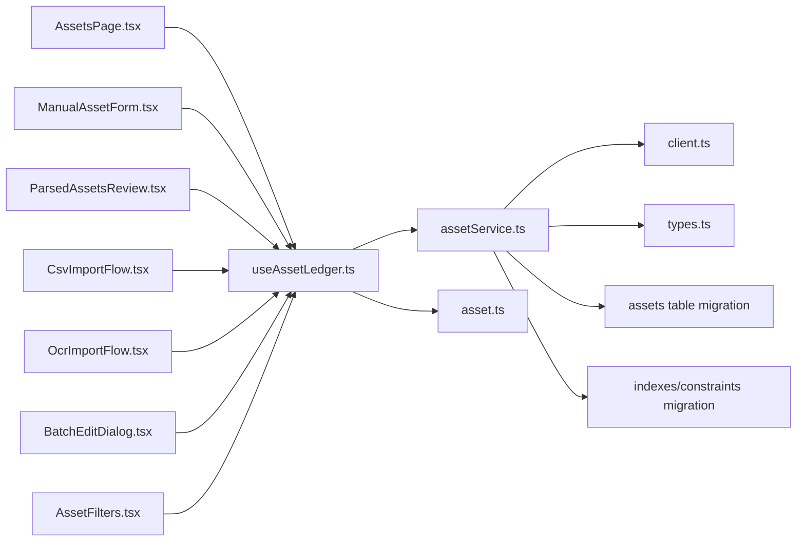

# Asset Tracking and Categorization

<cite>
**Referenced Files in This Document**
- [useAssetLedger.ts](file://src/hooks/useAssetLedger.ts)
- [assetService.ts](file://src/services/assetService.ts)
- [asset.ts](file://src/types/app/asset.ts)
- [AssetsPage.tsx](file://src/pages/desktop/AssetsPage.tsx)
- [ManualAssetForm.tsx](file://src/components/desktop/import/ManualAssetForm.tsx)
- [ParsedAssetsReview.tsx](file://src/components/desktop/import/ParsedAssetsReview.tsx)
- [CsvImportFlow.tsx](file://src/components/desktop/import/CsvImportFlow.tsx)
- [OcrImportFlow.tsx](file://src/components/desktop/import/OcrImportFlow.tsx)
- [BatchEditDialog.tsx](file://src/components/desktop/BatchEditDialog.tsx)
- [AssetFilters.tsx](file://src/components/desktop/AssetFilters.tsx)
- [client.ts](file://src/integrations/supabase/client.ts)
- [types.ts](file://src/integrations/supabase/types.ts)
- [20260723193427_c3d317b84bc14b6391cd2ce84628a6aa.sql](file://supabase/migrations/20260723193427_c3d317b84bc14b6391cd2ce84628a6aa.sql)
- [20260723193624_d41656f9e95f430a82546bc3044e545a.sql](file://supabase/migrations/20260723193624_d41656f9e95f430a82546bc3044e545a.sql)
</cite>

## Table of Contents
1. [Introduction](#introduction)
2. [Project Structure](#project-structure)
3. [Core Components](#core-components)
4. [Architecture Overview](#architecture-overview)
5. [Detailed Component Analysis](#detailed-component-analysis)
6. [Dependency Analysis](#dependency-analysis)
7. [Performance Considerations](#performance-considerations)
8. [Troubleshooting Guide](#troubleshooting-guide)
9. [Conclusion](#conclusion)

## Introduction
This document explains the Asset Tracking and Categorization sub-feature with a focus on how the useAssetLedger hook manages asset state, including CRUD operations, data validation, and type safety patterns. It also documents the asset service layer architecture, database interactions, and error handling strategies. Concrete examples are provided for adding new assets, updating holdings, and categorizing different asset types (stocks, bonds, crypto, etc.). The asset data model, field definitions, and business rules are outlined, along with performance considerations for large portfolios and caching strategies.

## Project Structure
The asset tracking feature spans UI components, hooks, services, types, and Supabase integrations:
- UI layers: pages and reusable components for asset entry, review, filtering, and batch editing
- Hook layer: useAssetLedger centralizes asset state and operations
- Service layer: assetService encapsulates persistence and API calls
- Types: shared TypeScript models for assets and Supabase client types
- Database: migrations define the schema used by the service layer

**Diagram sources**
- [AssetsPage.tsx](file://src/pages/desktop/AssetsPage.tsx)
- [ManualAssetForm.tsx](file://src/components/desktop/import/ManualAssetForm.tsx)
- [ParsedAssetsReview.tsx](file://src/components/desktop/import/ParsedAssetsReview.tsx)
- [CsvImportFlow.tsx](file://src/components/desktop/import/CsvImportFlow.tsx)
- [OcrImportFlow.tsx](file://src/components/desktop/import/OcrImportFlow.tsx)
- [BatchEditDialog.tsx](file://src/components/desktop/BatchEditDialog.tsx)
- [AssetFilters.tsx](file://src/components/desktop/AssetFilters.tsx)
- [useAssetLedger.ts](file://src/hooks/useAssetLedger.ts)
- [assetService.ts](file://src/services/assetService.ts)
- [asset.ts](file://src/types/app/asset.ts)
- [types.ts](file://src/integrations/supabase/types.ts)
- [20260723193427_c3d317b84bc14b6391cd2ce84628a6aa.sql](file://supabase/migrations/20260723193427_c3d317b84bc14b6391cd2ce84628a6aa.sql)
- [20260723193624_d41656f9e95f430a82546bc3044e545a.sql](file://supabase/migrations/20260723193624_d41656f9e95f430a82546bc3044e545a.sql)

**Section sources**
- [useAssetLedger.ts](file://src/hooks/useAssetLedger.ts)
- [assetService.ts](file://src/services/assetService.ts)
- [asset.ts](file://src/types/app/asset.ts)
- [AssetsPage.tsx](file://src/pages/desktop/AssetsPage.tsx)
- [ManualAssetForm.tsx](file://src/components/desktop/import/ManualAssetForm.tsx)
- [ParsedAssetsReview.tsx](file://src/components/desktop/import/ParsedAssetsReview.tsx)
- [CsvImportFlow.tsx](file://src/components/desktop/import/CsvImportFlow.tsx)
- [OcrImportFlow.tsx](file://src/components/desktop/import/OcrImportFlow.tsx)
- [BatchEditDialog.tsx](file://src/components/desktop/BatchEditDialog.tsx)
- [AssetFilters.tsx](file://src/components/desktop/AssetFilters.tsx)
- [client.ts](file://src/integrations/supabase/client.ts)
- [types.ts](file://src/integrations/supabase/types.ts)
- [20260723193427_c3d317b84bc14b6391cd2ce84628a6aa.sql](file://supabase/migrations/20260723193427_c3d317b84bc14b6391cd2ce84628a6aa.sql)
- [20260723193624_d41656f9e95f430a82546bc3044e545a.sql](file://supabase/migrations/20260723193624_d41656f9e95f430a82546bc3044e545a.sql)

## Core Components
- useAssetLedger hook: Centralizes asset state, exposes CRUD methods, handles optimistic updates, validation, and error states.
- assetService: Encapsulates all persistence logic, including fetching, creating, updating, and deleting assets via Supabase.
- Asset types: Shared TypeScript models that enforce structure and constraints across UI and service layers.
- UI components: Provide forms, reviews, filters, and batch editing to interact with the ledger.

Key responsibilities:
- State management: local cache of assets, loading/error flags, and derived views
- Validation: shape checks, required fields, numeric ranges, and category-specific rules
- Type safety: strict TS interfaces and discriminated unions for asset categories
- Error handling: user-friendly messages, retry semantics, and rollback on failure

**Section sources**
- [useAssetLedger.ts](file://src/hooks/useAssetLedger.ts)
- [assetService.ts](file://src/services/assetService.ts)
- [asset.ts](file://src/types/app/asset.ts)

## Architecture Overview
The asset subsystem follows a layered architecture:
- UI components call the useAssetLedger hook
- The hook delegates to assetService for persistence
- assetService uses the Supabase client and typed responses
- Database schema is defined by migrations

**Diagram sources**
- [useAssetLedger.ts](file://src/hooks/useAssetLedger.ts)
- [assetService.ts](file://src/services/assetService.ts)
- [client.ts](file://src/integrations/supabase/client.ts)
- [20260723193427_c3d317b84bc14b6391cd2ce84628a6aa.sql](file://supabase/migrations/20260723193427_c3d317b84bc14b6391cd2ce84628a6aa.sql)

## Detailed Component Analysis

### useAssetLedger Hook
Responsibilities:
- Manages a local cache of assets and provides CRUD methods
- Performs input validation before calling the service
- Applies optimistic updates and rolls back on errors
- Exposes loading and error states for UI feedback
- Supports filtering and sorting helpers for large datasets

Typical operations:
- Add asset: validates payload, calls service, updates cache
- Update holdings: merges partial changes, revalidates, persists
- Delete asset: removes from cache immediately, then confirms server deletion
- Fetch assets: loads from service, populates cache, handles errors

Validation and type safety:
- Uses shared asset types to ensure consistent shapes
- Enforces required fields per category (e.g., ticker for stocks, ISIN for bonds)
- Numeric validations for quantities, prices, and fees

Error handling:
- Catches network and constraint errors
- Maps to user-friendly messages
- Reverts optimistic changes when necessary

**Section sources**
- [useAssetLedger.ts](file://src/hooks/useAssetLedger.ts)

### Asset Service Layer (assetService)
Responsibilities:
- Encapsulates all database interactions for assets
- Provides functions for fetch, create, update, delete
- Normalizes payloads and maps results to typed models
- Handles pagination and filtering at the database level where applicable

Integration points:
- Uses Supabase client instance for queries and mutations
- Relies on generated Supabase types for strong typing
- Aligns with migration-defined schema

Error handling:
- Translates low-level errors into domain-level exceptions
- Preserves context for debugging and logging

**Section sources**
- [assetService.ts](file://src/services/assetService.ts)
- [client.ts](file://src/integrations/supabase/client.ts)
- [types.ts](file://src/integrations/supabase/types.ts)

### Asset Data Model and Business Rules
Data model overview:
- Core fields include unique identifier, owner reference, category, ticker/identifier, quantity, cost basis, currency, timestamps, and metadata
- Category-specific fields exist for stocks, bonds, crypto, cash, and other asset classes
- Constraints ensure referential integrity and data quality

Business rules:
- Required fields vary by category (e.g., ticker for equities, coupon rate for bonds)
- Quantities must be non-negative; prices and fees must be positive where applicable
- Duplicate detection based on owner + category + ticker/identifier
- Auditability through created_at and updated_at timestamps

Examples by category:
- Stocks: category = stock, required ticker, optional exchange, shares count, average cost
- Bonds: category = bond, required issuer/ticker, face value, coupon, maturity date
- Crypto: category = crypto, required symbol, holdings amount, acquisition price
- Cash: category = cash, required currency code, balance

**Section sources**
- [asset.ts](file://src/types/app/asset.ts)
- [20260723193427_c3d317b84bc14b6391cd2ce84628a6aa.sql](file://supabase/migrations/20260723193427_c3d317b84bc14b6391cd2ce84628a6aa.sql)
- [20260723193624_d41656f9e95f430a82546bc3044e545a.sql](file://supabase/migrations/20260723193624_d41656f9e95f430a82546bc3044e545a.sql)

### UI Integration Examples

#### Adding a New Asset
- Manual entry: ManualAssetForm collects inputs, validates, and calls useAssetLedger.addAsset
- CSV import: CsvImportFlow parses rows, normalizes to asset types, and batches adds via useAssetLedger
- OCR import: OcrImportFlow extracts holdings, presents ParsedAssetsReview for confirmation, then commits via useAssetLedger

**Diagram sources**
- [ManualAssetForm.tsx](file://src/components/desktop/import/ManualAssetForm.tsx)
- [CsvImportFlow.tsx](file://src/components/desktop/import/CsvImportFlow.tsx)
- [OcrImportFlow.tsx](file://src/components/desktop/import/OcrImportFlow.tsx)
- [ParsedAssetsReview.tsx](file://src/components/desktop/import/ParsedAssetsReview.tsx)
- [useAssetLedger.ts](file://src/hooks/useAssetLedger.ts)
- [assetService.ts](file://src/services/assetService.ts)

**Section sources**
- [ManualAssetForm.tsx](file://src/components/desktop/import/ManualAssetForm.tsx)
- [CsvImportFlow.tsx](file://src/components/desktop/import/CsvImportFlow.tsx)
- [OcrImportFlow.tsx](file://src/components/desktop/import/OcrImportFlow.tsx)
- [ParsedAssetsReview.tsx](file://src/components/desktop/import/ParsedAssetsReview.tsx)
- [useAssetLedger.ts](file://src/hooks/useAssetLedger.ts)
- [assetService.ts](file://src/services/assetService.ts)

#### Updating Holdings
- Batch edit: BatchEditDialog allows bulk updates (e.g., adjusting cost basis or tags), which useAssetLedger applies locally then persists
- Single edit: Inline edits trigger targeted updates via useAssetLedger.updateAsset

**Diagram sources**
- [BatchEditDialog.tsx](file://src/components/desktop/BatchEditDialog.tsx)
- [useAssetLedger.ts](file://src/hooks/useAssetLedger.ts)
- [assetService.ts](file://src/services/assetService.ts)

**Section sources**
- [BatchEditDialog.tsx](file://src/components/desktop/BatchEditDialog.tsx)
- [useAssetLedger.ts](file://src/hooks/useAssetLedger.ts)
- [assetService.ts](file://src/services/assetService.ts)

#### Categorizing Different Asset Types
- Discriminated union pattern ensures only valid fields per category are accepted
- UI components adapt their forms based on selected category
- Service layer enforces category-specific constraints during persistence

**Section sources**
- [asset.ts](file://src/types/app/asset.ts)
- [ManualAssetForm.tsx](file://src/components/desktop/import/ManualAssetForm.tsx)
- [assetService.ts](file://src/services/assetService.ts)

## Dependency Analysis
The following diagram shows key dependencies between components, hook, service, types, and database schema.

**Diagram sources**
- [AssetsPage.tsx](file://src/pages/desktop/AssetsPage.tsx)
- [ManualAssetForm.tsx](file://src/components/desktop/import/ManualAssetForm.tsx)
- [ParsedAssetsReview.tsx](file://src/components/desktop/import/ParsedAssetsReview.tsx)
- [CsvImportFlow.tsx](file://src/components/desktop/import/CsvImportFlow.tsx)
- [OcrImportFlow.tsx](file://src/components/desktop/import/OcrImportFlow.tsx)
- [BatchEditDialog.tsx](file://src/components/desktop/BatchEditDialog.tsx)
- [AssetFilters.tsx](file://src/components/desktop/AssetFilters.tsx)
- [useAssetLedger.ts](file://src/hooks/useAssetLedger.ts)
- [assetService.ts](file://src/services/assetService.ts)
- [client.ts](file://src/integrations/supabase/client.ts)
- [types.ts](file://src/integrations/supabase/types.ts)
- [20260723193427_c3d317b84bc14b6391cd2ce84628a6aa.sql](file://supabase/migrations/20260723193427_c3d317b84bc14b6391cd2ce84628a6aa.sql)
- [20260723193624_d41656f9e95f430a82546bc3044e545a.sql](file://supabase/migrations/20260723193624_d41656f9e95f430a82546bc3044e545a.sql)

**Section sources**
- [useAssetLedger.ts](file://src/hooks/useAssetLedger.ts)
- [assetService.ts](file://src/services/assetService.ts)
- [client.ts](file://src/integrations/supabase/client.ts)
- [types.ts](file://src/integrations/supabase/types.ts)
- [20260723193427_c3d317b84bc14b6391cd2ce84628a6aa.sql](file://supabase/migrations/20260723193427_c3d317b84bc14b6391cd2ce84628a6aa.sql)
- [20260723193624_d41656f9e95f430a82546bc3044e545a.sql](file://supabase/migrations/20260723193624_d41656f9e95f430a82546bc3044e545a.sql)

## Performance Considerations
For large portfolios:
- Prefer server-side pagination and filtering in assetService to reduce payload sizes
- Use selective field projection to minimize data transfer
- Debounce search/filter inputs in AssetFilters to limit re-renders
- Keep useAssetLedger’s local cache efficient by avoiding unnecessary recomputations
- Apply memoization for derived views (e.g., totals by category)
- Consider background sync for heavy operations like imports

Caching strategies:
- Maintain an in-memory cache in useAssetLedger keyed by owner and filters
- Implement stale-while-revalidate patterns: serve cached data while refreshing
- Cache normalization by unique identifiers to avoid duplicates
- Invalidate caches on mutations and on explicit refresh actions

[No sources needed since this section provides general guidance]

## Troubleshooting Guide
Common issues and resolutions:
- Validation failures: check required fields per category and numeric constraints
- Network errors: verify Supabase client configuration and permissions
- Constraint violations: inspect database constraints and unique keys
- Optimistic rollback: if a mutation fails, ensure local state is reverted and user is notified

Debugging tips:
- Log payload shapes before service calls
- Inspect Supabase error codes and messages
- Verify migration state matches expected schema

**Section sources**
- [useAssetLedger.ts](file://src/hooks/useAssetLedger.ts)
- [assetService.ts](file://src/services/assetService.ts)
- [client.ts](file://src/integrations/supabase/client.ts)

## Conclusion
The Asset Tracking and Categorization feature centers around a robust useAssetLedger hook that orchestrates state, validation, and persistence via assetService. Strong typing and clear separation of concerns enable safe, maintainable operations across diverse asset categories. With careful attention to performance and caching, the system scales well for large portfolios while providing a responsive user experience.