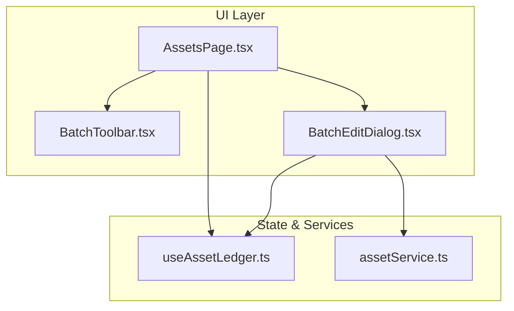
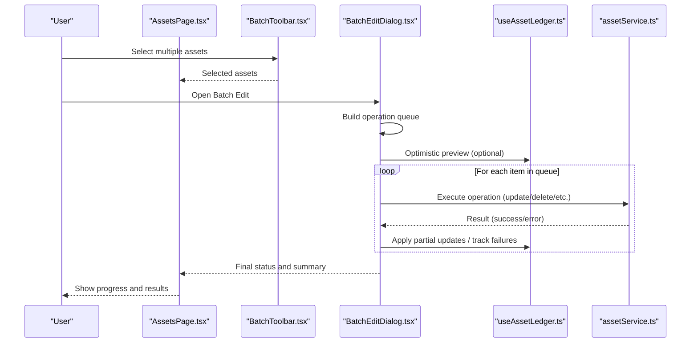
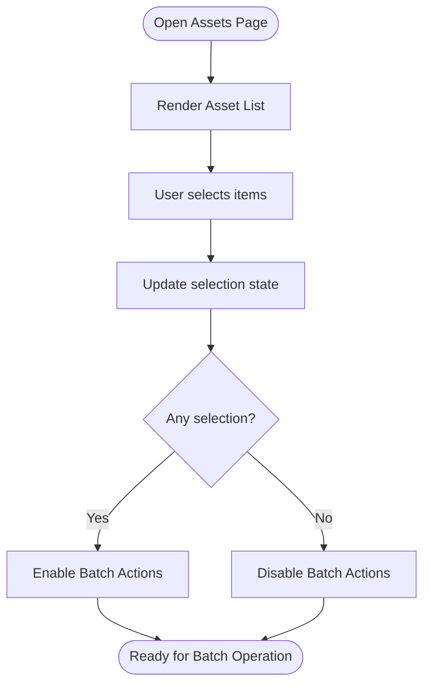
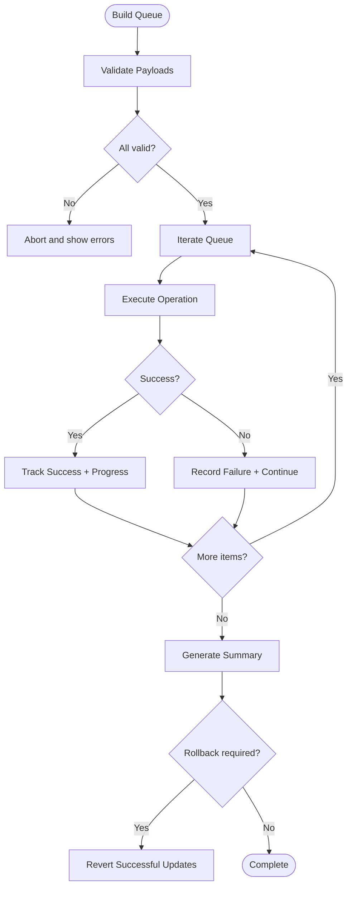
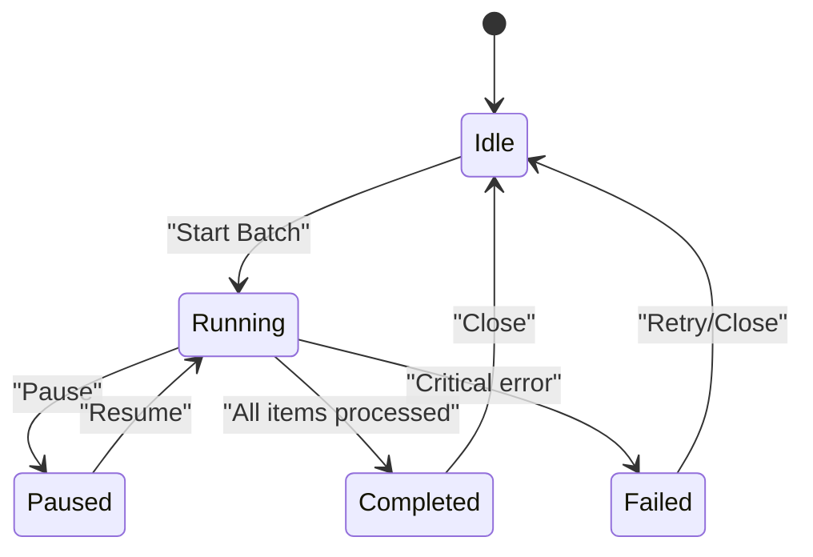
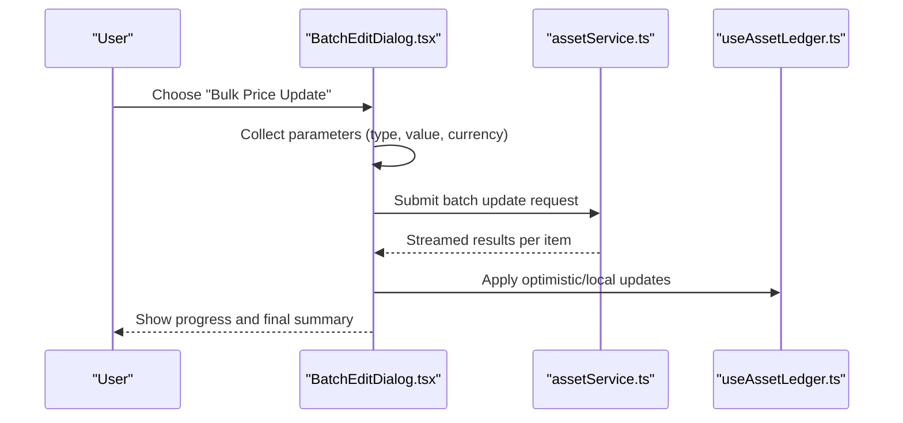
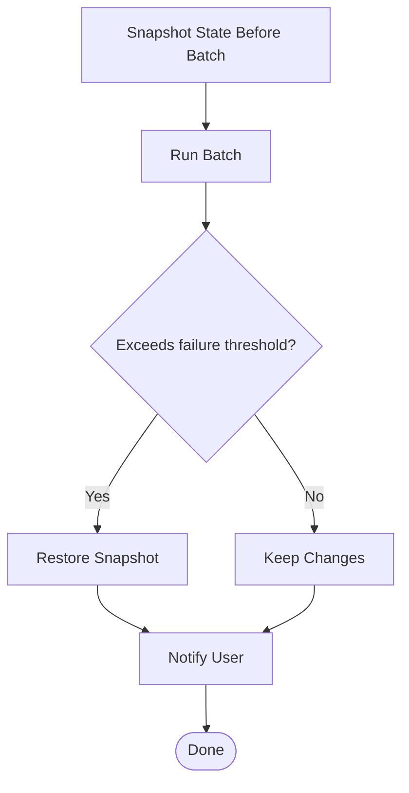
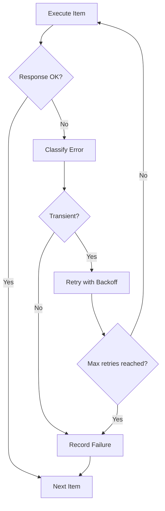
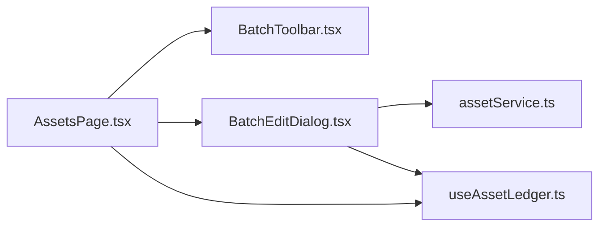

# Batch Operations and Bulk Management

<cite>
**Referenced Files in This Document**
- [BatchEditDialog.tsx](file://src/components/desktop/BatchEditDialog.tsx)
- [BatchToolbar.tsx](file://src/components/desktop/BatchToolbar.tsx)
- [AssetsPage.tsx](file://src/pages/desktop/AssetsPage.tsx)
- [assetService.ts](file://src/services/assetService.ts)
- [useAssetLedger.ts](file://src/hooks/useAssetLedger.ts)
</cite>

## Table of Contents
1. [Introduction](#introduction)
2. [Project Structure](#project-structure)
3. [Core Components](#core-components)
4. [Architecture Overview](#architecture-overview)
5. [Detailed Component Analysis](#detailed-component-analysis)
6. [Dependency Analysis](#dependency-analysis)
7. [Performance Considerations](#performance-considerations)
8. [Troubleshooting Guide](#troubleshooting-guide)
9. [Conclusion](#conclusion)

## Introduction
This document explains the batch operations and bulk management capabilities for assets, focusing on how users can perform bulk actions across multiple items simultaneously. It covers selection mechanisms, operation queuing, progress tracking, transaction handling, rollback strategies, user feedback, and error handling when individual items fail during a batch run. The primary UI components involved are the BatchEditDialog and BatchToolbar, integrated within the Assets page and backed by asset services and hooks.

## Project Structure
The batch functionality is implemented as a cohesive set of UI components and supporting services:
- BatchToolbar: Provides selection controls and exposes selected assets to parent context.
- BatchEditDialog: Presents available batch operations and orchestrates execution with progress and results.
- AssetsPage: Hosts the toolbar and dialog, manages selection state, and coordinates service calls.
- assetService: Encapsulates server-side operations used by batch workflows (e.g., update, delete).
- useAssetLedger: Manages local asset data and optimistic updates where applicable.

**Diagram sources**
- [AssetsPage.tsx](file://src/pages/desktop/AssetsPage.tsx)
- [BatchToolbar.tsx](file://src/components/desktop/BatchToolbar.tsx)
- [BatchEditDialog.tsx](file://src/components/desktop/BatchEditDialog.tsx)
- [assetService.ts](file://src/services/assetService.ts)
- [useAssetLedger.ts](file://src/hooks/useAssetLedger.ts)

**Section sources**
- [AssetsPage.tsx](file://src/pages/desktop/AssetsPage.tsx)
- [BatchToolbar.tsx](file://src/components/desktop/BatchToolbar.tsx)
- [BatchEditDialog.tsx](file://src/components/desktop/BatchEditDialog.tsx)
- [assetService.ts](file://src/services/assetService.ts)
- [useAssetLedger.ts](file://src/hooks/useAssetLedger.ts)

## Core Components
- BatchToolbar
  - Purpose: Enables multi-select of assets and exposes the current selection to the application.
  - Key responsibilities:
    - Toggle select-all and per-item selection.
    - Compute and expose selected IDs or asset objects.
    - Enable/disable batch actions based on selection count.
- BatchEditDialog
  - Purpose: Presents batch operations and executes them against selected assets.
  - Key responsibilities:
    - Render operation-specific forms (e.g., price change, category update).
    - Queue and execute operations with progress reporting.
    - Handle success/failure outcomes and provide user feedback.
    - Coordinate with assetService and local ledger for consistency.
- AssetsPage
  - Purpose: Orchestrates selection state, renders BatchToolbar and BatchEditDialog, and integrates with services.
  - Key responsibilities:
    - Maintain selection state and pass it to child components.
    - Trigger batch operations from the dialog.
    - Update UI state and reflect changes via useAssetLedger and assetService.

**Section sources**
- [BatchToolbar.tsx](file://src/components/desktop/BatchToolbar.tsx)
- [BatchEditDialog.tsx](file://src/components/desktop/BatchEditDialog.tsx)
- [AssetsPage.tsx](file://src/pages/desktop/AssetsPage.tsx)

## Architecture Overview
The batch workflow follows a clear separation between UI orchestration, state management, and service layer calls:

**Diagram sources**
- [AssetsPage.tsx](file://src/pages/desktop/AssetsPage.tsx)
- [BatchToolbar.tsx](file://src/components/desktop/BatchToolbar.tsx)
- [BatchEditDialog.tsx](file://src/components/desktop/BatchEditDialog.tsx)
- [assetService.ts](file://src/services/assetService.ts)
- [useAssetLedger.ts](file://src/hooks/useAssetLedger.ts)

## Detailed Component Analysis

### Selection Mechanism
- Multi-select model:
  - Per-item checkboxes allow granular selection.
  - A select-all control toggles all visible items.
  - Selection state is maintained at the page level and passed down to BatchToolbar and BatchEditDialog.
- Visual feedback:
  - Selected rows are highlighted.
  - Toolbar shows the number of selected items and enables/disables batch actions accordingly.

[No sources needed since this diagram shows conceptual workflow, not actual code structure]

**Section sources**
- [BatchToolbar.tsx](file://src/components/desktop/BatchToolbar.tsx)
- [AssetsPage.tsx](file://src/pages/desktop/AssetsPage.tsx)

### Operation Queuing and Execution
- Queue construction:
  - Based on selected assets and chosen operation parameters.
  - Each queue entry includes target asset ID(s), operation type, and payload.
- Execution strategy:
  - Sequential or limited-concurrency execution to avoid overwhelming the server.
  - Progress tracking updates the UI after each item completes.
- Transaction-like behavior:
  - Partial successes are recorded; failed items are reported individually.
  - Optional rollback: if configured, previously successful updates can be reverted upon critical failure.

**Diagram sources**
- [BatchEditDialog.tsx](file://src/components/desktop/BatchEditDialog.tsx)
- [assetService.ts](file://src/services/assetService.ts)
- [useAssetLedger.ts](file://src/hooks/useAssetLedger.ts)

**Section sources**
- [BatchEditDialog.tsx](file://src/components/desktop/BatchEditDialog.tsx)
- [assetService.ts](file://src/services/assetService.ts)
- [useAssetLedger.ts](file://src/hooks/useAssetLedger.ts)

### Progress Tracking and User Feedback
- Real-time progress:
  - A progress indicator reflects completed vs total items.
  - Status messages summarize successes, failures, and skipped items.
- Accessibility:
  - Clear labels and announcements for screen readers.
  - Keyboard navigation support for dialogs and lists.

**Diagram sources**
- [BatchEditDialog.tsx](file://src/components/desktop/BatchEditDialog.tsx)

**Section sources**
- [BatchEditDialog.tsx](file://src/components/desktop/BatchEditDialog.tsx)

### Common Batch Operations
- Bulk price updates:
  - Applies percentage or absolute adjustments to selected assets.
  - Validates ranges and currency consistency before execution.
- Category changes:
  - Reassigns category metadata across selected assets.
  - Ensures category existence and compatibility.
- Mass deletions:
  - Removes selected assets after confirmation.
  - Optionally cascades dependent records according to policy.

**Diagram sources**
- [BatchEditDialog.tsx](file://src/components/desktop/BatchEditDialog.tsx)
- [assetService.ts](file://src/services/assetService.ts)
- [useAssetLedger.ts](file://src/hooks/useAssetLedger.ts)

**Section sources**
- [BatchEditDialog.tsx](file://src/components/desktop/BatchEditDialog.tsx)
- [assetService.ts](file://src/services/assetService.ts)
- [useAssetLedger.ts](file://src/hooks/useAssetLedger.ts)

### Transaction Handling and Rollback
- Transaction semantics:
  - While server transactions may vary, the client simulates transactional behavior by:
    - Recording intermediate states.
    - Supporting rollback of successful updates if a later step fails critically.
- Rollback triggers:
  - Configurable thresholds (e.g., more than N% failures).
  - Explicit user choice to abort and revert.
- Implementation approach:
  - Snapshot pre-batch state.
  - On rollback, restore snapshot and notify the user.

**Diagram sources**
- [BatchEditDialog.tsx](file://src/components/desktop/BatchEditDialog.tsx)
- [useAssetLedger.ts](file://src/hooks/useAssetLedger.ts)

**Section sources**
- [BatchEditDialog.tsx](file://src/components/desktop/BatchEditDialog.tsx)
- [useAssetLedger.ts](file://src/hooks/useAssetLedger.ts)

### Error Handling Strategies
- Per-item errors:
  - Individual failures are captured and reported without halting the entire batch.
  - Users receive a detailed list of failed items and reasons.
- Network/server errors:
  - Retries with exponential backoff for transient issues.
  - Graceful degradation if retries exceed limits.
- Validation errors:
  - Early validation prevents invalid payloads from entering the queue.
  - Inline guidance helps users correct inputs before running the batch.

**Diagram sources**
- [BatchEditDialog.tsx](file://src/components/desktop/BatchEditDialog.tsx)
- [assetService.ts](file://src/services/assetService.ts)

**Section sources**
- [BatchEditDialog.tsx](file://src/components/desktop/BatchEditDialog.tsx)
- [assetService.ts](file://src/services/assetService.ts)

## Dependency Analysis
The following diagram highlights key dependencies among batch-related modules:

**Diagram sources**
- [AssetsPage.tsx](file://src/pages/desktop/AssetsPage.tsx)
- [BatchToolbar.tsx](file://src/components/desktop/BatchToolbar.tsx)
- [BatchEditDialog.tsx](file://src/components/desktop/BatchEditDialog.tsx)
- [assetService.ts](file://src/services/assetService.ts)
- [useAssetLedger.ts](file://src/hooks/useAssetLedger.ts)

**Section sources**
- [AssetsPage.tsx](file://src/pages/desktop/AssetsPage.tsx)
- [BatchToolbar.tsx](file://src/components/desktop/BatchToolbar.tsx)
- [BatchEditDialog.tsx](file://src/components/desktop/BatchEditDialog.tsx)
- [assetService.ts](file://src/services/assetService.ts)
- [useAssetLedger.ts](file://src/hooks/useAssetLedger.ts)

## Performance Considerations
- Concurrency control:
  - Limit concurrent requests to balance throughput and stability.
- Batching size:
  - Cap maximum batch size to prevent long-running tasks and memory pressure.
- Optimistic updates:
  - Apply local previews immediately for better perceived performance.
- Debouncing and throttling:
  - Avoid redundant re-renders during large selections or frequent updates.
- Server-side considerations:
  - Prefer bulk endpoints when available to reduce round-trips.

[No sources needed since this section provides general guidance]

## Troubleshooting Guide
- Symptoms:
  - Batch appears stuck: check progress indicators and network activity.
  - Some items fail while others succeed: review per-item error summaries.
  - Unexpected state after batch: verify rollback behavior and snapshots.
- Steps:
  - Reduce batch size and retry.
  - Inspect console logs for specific failure reasons.
  - Confirm that required fields and constraints are satisfied.
  - If using rollback, ensure snapshot restoration completed successfully.

**Section sources**
- [BatchEditDialog.tsx](file://src/components/desktop/BatchEditDialog.tsx)
- [assetService.ts](file://src/services/assetService.ts)

## Conclusion
The batch operations system provides a robust framework for performing bulk actions efficiently and safely. Through careful selection management, queued execution, progress feedback, and resilient error handling, users can confidently apply large-scale changes to their assets. Transaction-like semantics and optional rollback further enhance reliability, ensuring data integrity even when individual items encounter issues.