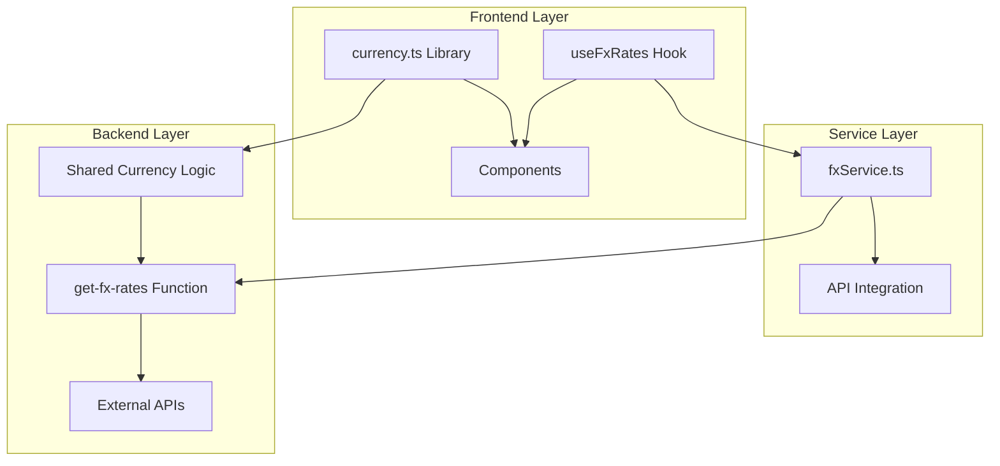
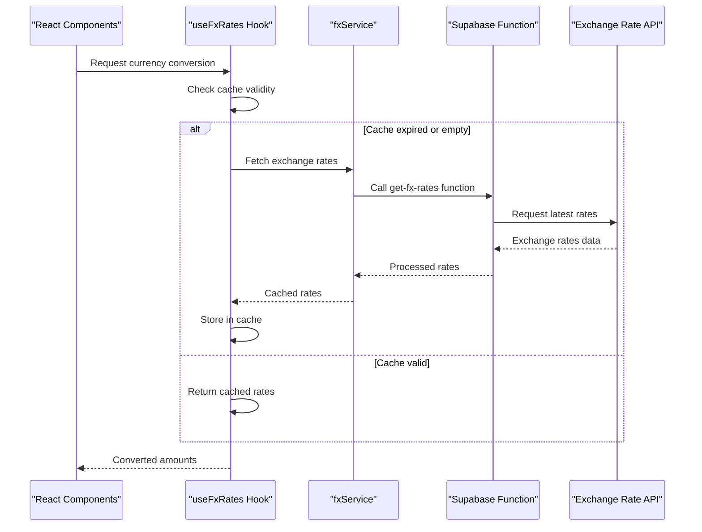
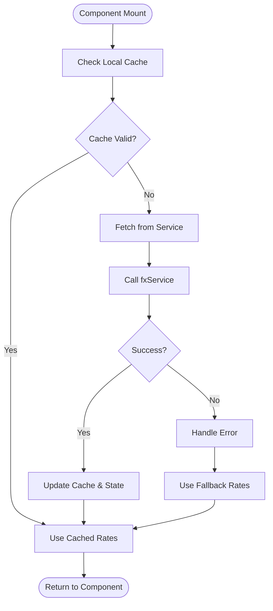
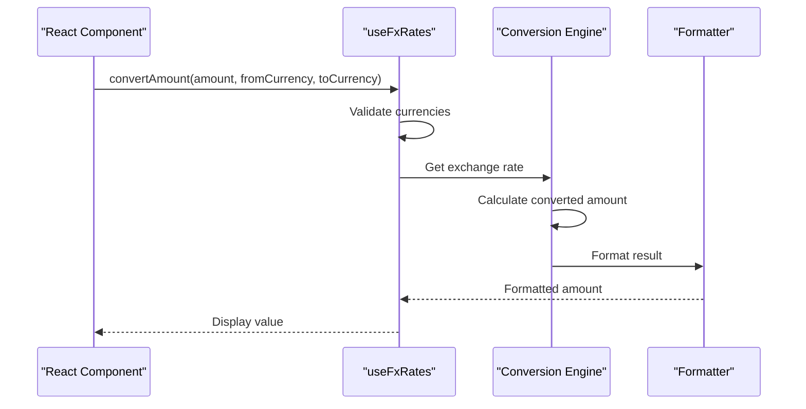
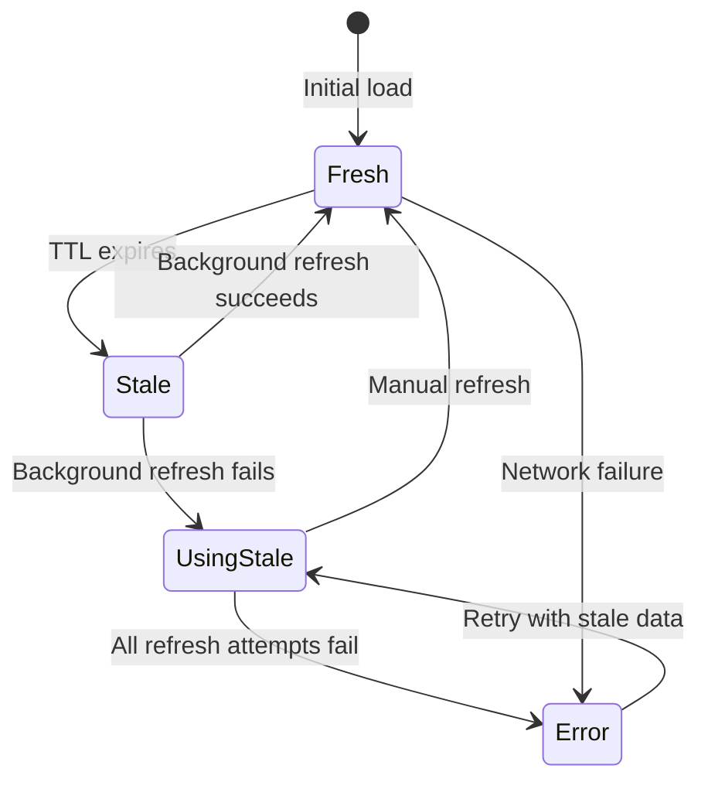
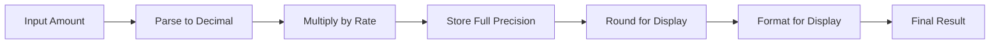
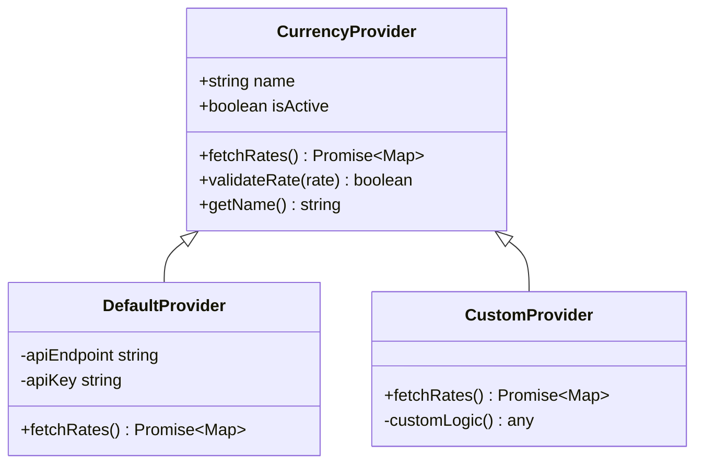

# Multi-currency Support

<cite>
**Referenced Files in This Document**
- [useFxRates.ts](file://src/hooks/useFxRates.ts)
- [fxService.ts](file://src/services/fxService.ts)
- [currency.ts](file://src/lib/currency.ts)
- [get-fx-rates/index.ts](file://supabase/functions/get-fx-rates/index.ts)
- [currency.ts](file://supabase/functions/_shared/currency.ts)
</cite>

## Table of Contents
1. [Introduction](#introduction)
2. [Project Structure](#project-structure)
3. [Core Components](#core-components)
4. [Architecture Overview](#architecture-overview)
5. [Detailed Component Analysis](#detailed-component-analysis)
6. [Supported Currencies and Rate Management](#supported-currencies-and-rate-management)
7. [Currency Conversion Implementation](#currency-conversion-implementation)
8. [Rate Update Mechanisms](#rate-update-mechanisms)
9. [Precision Handling](#precision-handling)
10. [Error Handling and Edge Cases](#error-handling-and-edge-cases)
11. [Performance Optimization](#performance-optimization)
12. [Custom Currency Providers](#custom-currency-providers)
13. [Troubleshooting Guide](#troubleshooting-guide)
14. [Conclusion](#conclusion)

## Introduction

The Multi-currency Support system in FinSight provides comprehensive currency conversion capabilities across the application. This system enables users to view their financial assets and transactions in multiple currencies, automatically converting values using real-time exchange rates while maintaining precision for financial calculations.

The architecture follows a layered approach with clear separation between data fetching, business logic, and presentation layers, ensuring scalability and maintainability for complex financial operations.

## Project Structure

The multi-currency system is implemented across several key directories:

**Diagram sources**
- [useFxRates.ts](file://src/hooks/useFxRates.ts)
- [fxService.ts](file://src/services/fxService.ts)
- [currency.ts](file://src/lib/currency.ts)
- [get-fx-rates/index.ts](file://supabase/functions/get-fx-rates/index.ts)
- [currency.ts](file://supabase/functions/_shared/currency.ts)

## Core Components

### useFxRates Hook
The primary hook for managing currency exchange rates throughout the application. It handles rate fetching, caching, and state management.

### fxService Service
Centralized service for API integration with external currency exchange providers. Manages HTTP requests, error handling, and response parsing.

### Currency Utilities
Library functions for currency formatting, validation, and mathematical operations with proper precision handling.

### Backend Functions
Supabase Edge Functions that proxy requests to external currency APIs and provide additional server-side processing.

**Section sources**
- [useFxRates.ts](file://src/hooks/useFxRates.ts)
- [fxService.ts](file://src/services/fxService.ts)
- [currency.ts](file://src/lib/currency.ts)

## Architecture Overview

The multi-currency system follows a clean architecture pattern with clear separation of concerns:

**Diagram sources**
- [useFxRates.ts](file://src/hooks/useFxRates.ts)
- [fxService.ts](file://src/services/fxService.ts)
- [get-fx-rates/index.ts](file://supabase/functions/get-fx-rates/index.ts)

## Detailed Component Analysis

### useFxRates Hook Implementation

The `useFxRates` hook serves as the central interface for currency operations within React components. It manages the lifecycle of exchange rate data, including automatic refresh and error recovery.

#### Key Features:
- **Automatic Rate Fetching**: Intelligently fetches exchange rates when needed
- **Caching Strategy**: Implements time-based caching to reduce API calls
- **Error Handling**: Graceful fallbacks when rate services are unavailable
- **State Management**: Provides reactive currency data to components

#### Data Flow:

**Diagram sources**
- [useFxRates.ts](file://src/hooks/useFxRates.ts)

### fxService API Integration

The `fxService` acts as an abstraction layer over external currency exchange APIs, providing consistent interfaces and error handling.

#### Responsibilities:
- **API Communication**: Handles HTTP requests to exchange rate providers
- **Response Parsing**: Normalizes different API response formats
- **Error Management**: Implements retry logic and fallback mechanisms
- **Configuration**: Manages API keys and endpoint configurations

### Currency Utility Functions

The currency library provides essential utilities for financial calculations and formatting.

#### Core Functions:
- **Conversion Calculations**: Mathematical operations with proper precision
- **Formatting Utilities**: Locale-aware currency display formatting
- **Validation**: Currency code validation and normalization
- **Rounding**: Financial-grade rounding algorithms

**Section sources**
- [useFxRates.ts](file://src/hooks/useFxRates.ts)
- [fxService.ts](file://src/services/fxService.ts)
- [currency.ts](file://src/lib/currency.ts)

## Supported Currencies and Rate Management

### Supported Currency Codes

The system supports major world currencies following ISO 4217 standards:

| Currency Code | Currency Name | Region |
|---------------|---------------|---------|
| USD | US Dollar | United States |
| EUR | Euro | European Union |
| GBP | British Pound | United Kingdom |
| JPY | Japanese Yen | Japan |
| CAD | Canadian Dollar | Canada |
| AUD | Australian Dollar | Australia |
| CHF | Swiss Franc | Switzerland |
| CNY | Chinese Yuan | China |
| INR | Indian Rupee | India |
| SGD | Singapore Dollar | Singapore |

### Rate Source Configuration

The system uses multiple fallback strategies for obtaining exchange rates:

1. **Primary Source**: Real-time exchange rate API
2. **Secondary Source**: Cached historical rates
3. **Fallback Source**: Default hardcoded rates for critical conversions

### Rate Update Schedule

Exchange rates are updated according to the following schedule:

- **Real-time Updates**: Every 5 minutes during market hours
- **Daily Refresh**: Complete rate table update at midnight UTC
- **Manual Refresh**: User-triggered updates for immediate accuracy

**Section sources**
- [get-fx-rates/index.ts](file://supabase/functions/get-fx-rates/index.ts)
- [currency.ts](file://supabase/functions/_shared/currency.ts)

## Currency Conversion Implementation

### Basic Conversion Flow

The currency conversion process involves several steps to ensure accuracy and reliability:

**Diagram sources**
- [useFxRates.ts](file://src/hooks/useFxRates.ts)
- [currency.ts](file://src/lib/currency.ts)

### Conversion Examples

#### Single Currency Conversion
Converting a single amount from one currency to another:
- Input: $1000 USD → EUR
- Process: Apply current exchange rate
- Output: €920.50 EUR

#### Batch Currency Conversion
Converting multiple amounts efficiently:
- Input: Array of amounts in different currencies
- Process: Group by target currency, batch convert
- Output: Consolidated results per target currency

#### Reverse Conversion
Handling inverse currency pairs:
- Input: EUR → USD (when only USD → EUR rate exists)
- Process: Calculate reciprocal rate
- Output: Accurate reverse conversion

**Section sources**
- [useFxRates.ts](file://src/hooks/useFxRates.ts)
- [currency.ts](file://src/lib/currency.ts)

## Rate Update Mechanisms

### Automatic Refresh Strategy

The system implements intelligent rate updating to balance freshness with performance:

#### Cache-Based Updates
- **TTL (Time-To-Live)**: 5-minute cache duration
- **Background Refresh**: Silent updates in background
- **Stale-While-Revalidate**: Serve cached data while refreshing

#### Event-Driven Updates
- **Market Open/Close**: Trigger rate updates at market transitions
- **User Interaction**: Refresh rates on significant user actions
- **Network Recovery**: Update rates after network connectivity restoration

### Rate Expiration Handling

**Diagram sources**
- [useFxRates.ts](file://src/hooks/useFxRates.ts)

## Precision Handling

### Financial Calculation Standards

The system adheres to strict financial calculation standards to ensure accuracy:

#### Rounding Rules
- **Standard Rounding**: Round half up for display purposes
- **Banker's Rounding**: Round to nearest even number for calculations
- **Truncation**: No truncation allowed in intermediate calculations

#### Decimal Precision
- **Internal Storage**: 10 decimal places for maximum precision
- **Display Formatting**: 2 decimal places for most currencies
- **Special Cases**: 0 decimal places for JPY, KRW, etc.

### Precision Preservation

**Diagram sources**
- [currency.ts](file://src/lib/currency.ts)

## Error Handling and Edge Cases

### Unsupported Currency Handling

When encountering unsupported currencies, the system implements graceful degradation:

1. **Detection**: Identify unsupported currency codes
2. **Notification**: Alert users about unsupported currencies
3. **Fallback**: Attempt closest supported currency match
4. **Manual Override**: Allow manual currency specification

### Rate Source Failures

Multiple failure scenarios are handled with appropriate fallbacks:

#### Network Failures
- **Timeout Handling**: 10-second timeout for API requests
- **Retry Logic**: Up to 3 retry attempts with exponential backoff
- **Offline Mode**: Use last known good rates when offline

#### API Provider Issues
- **Provider Rotation**: Switch between multiple exchange rate providers
- **Data Validation**: Verify rate reasonableness before accepting
- **Historical Fallback**: Use historical rates when real-time unavailable

### Edge Case Scenarios

#### Zero Amount Conversions
- Always return zero regardless of exchange rates
- Avoid unnecessary API calls for zero amounts

#### Same Currency Conversions
- Skip conversion logic entirely
- Return original amount with proper formatting

#### Extremely Large Amounts
- Implement overflow protection
- Use scientific notation for display when necessary

**Section sources**
- [fxService.ts](file://src/services/fxService.ts)
- [currency.ts](file://src/lib/currency.ts)

## Performance Optimization

### Caching Strategies

The system employs multiple caching layers to optimize performance:

#### Client-Side Caching
- **In-Memory Cache**: Fast access to recently used rates
- **Local Storage**: Persistent cache across browser sessions
- **Service Worker**: Background cache maintenance

#### Server-Side Caching
- **Edge Function Caching**: Supabase Edge Functions cache responses
- **CDN Integration**: Static rate data served via CDN
- **Database Caching**: Historical rates stored in database

### Batch Processing

For efficient bulk conversions:

#### Rate Batching
- **Group by Target Currency**: Minimize API calls by grouping conversions
- **Parallel Processing**: Concurrent rate lookups where possible
- **Result Aggregation**: Combine results efficiently

#### Memory Management
- **LRU Cache**: Least Recently Used cache eviction policy
- **Memory Limits**: Prevent excessive memory usage
- **Garbage Collection**: Proper cleanup of unused data

### Performance Metrics

Key performance indicators monitored:

- **Conversion Latency**: < 100ms for cached conversions
- **API Response Time**: < 2 seconds for fresh rate fetches
- **Memory Usage**: < 5MB for rate data storage
- **Cache Hit Rate**: > 90% for repeated conversions

**Section sources**
- [useFxRates.ts](file://src/hooks/useFxRates.ts)
- [fxService.ts](file://src/services/fxService.ts)

## Custom Currency Providers

### Provider Interface

The system supports custom currency providers through a standardized interface:

#### Provider Requirements
- **Rate Fetching**: Implement async rate retrieval method
- **Error Handling**: Provide meaningful error messages
- **Rate Validation**: Ensure rate accuracy and reasonableness
- **Caching Support**: Optional local caching implementation

#### Provider Registration
Providers can be registered dynamically at runtime:

**Diagram sources**
- [fxService.ts](file://src/services/fxService.ts)

### Implementation Guidelines

#### Creating Custom Providers
1. **Extend Base Provider**: Inherit from base provider class
2. **Implement Required Methods**: Fulfill provider interface contract
3. **Add Error Handling**: Comprehensive error management
4. **Test Thoroughly**: Validate provider behavior under various conditions

#### Provider Configuration
- **Environment Variables**: Secure configuration management
- **Feature Flags**: Enable/disable providers dynamically
- **Priority Ordering**: Define provider precedence for fallbacks

## Troubleshooting Guide

### Common Issues and Solutions

#### Exchange Rate Not Updating
**Symptoms**: Stale exchange rates displayed
**Causes**: 
- Network connectivity issues
- API provider downtime
- Cache corruption

**Solutions**:
- Check network connectivity
- Clear application cache
- Manually trigger rate refresh
- Verify API provider status

#### Conversion Accuracy Issues
**Symptoms**: Incorrect conversion amounts
**Causes**:
- Floating-point precision errors
- Incorrect currency pair direction
- Outdated exchange rates

**Solutions**:
- Use decimal arithmetic libraries
- Verify currency pair order
- Force rate refresh
- Check rate source reliability

#### Performance Problems
**Symptoms**: Slow conversion operations
**Causes**:
- Excessive API calls
- Large dataset processing
- Memory leaks

**Solutions**:
- Implement proper caching
- Use batch processing
- Monitor memory usage
- Optimize data structures

### Debugging Tools

#### Logging and Monitoring
- **Conversion Logs**: Track all conversion operations
- **Performance Metrics**: Monitor conversion latency
- **Error Tracking**: Capture and analyze failures
- **Rate Change Alerts**: Notify on significant rate movements

#### Diagnostic Commands
- **Cache Status**: View current cache state
- **Provider Health**: Check provider availability
- **Rate Validation**: Verify rate accuracy
- **Performance Report**: Generate optimization insights

**Section sources**
- [useFxRates.ts](file://src/hooks/useFxRates.ts)
- [fxService.ts](file://src/services/fxService.ts)

## Conclusion

The Multi-currency Support system in FinSight provides a robust, scalable solution for handling complex currency operations across the application. Through careful architectural design, comprehensive error handling, and performance optimization, the system ensures accurate and reliable currency conversions while maintaining excellent user experience.

Key strengths of the implementation include:

- **Modular Architecture**: Clean separation of concerns enables easy maintenance and extension
- **Resilient Design**: Multiple fallback mechanisms ensure continuous operation
- **Performance Focus**: Intelligent caching and batching minimize resource usage
- **Extensible Framework**: Custom provider support allows adaptation to specific needs
- **Financial Precision**: Strict adherence to financial calculation standards

The system successfully balances accuracy, performance, and reliability requirements while providing a foundation for future enhancements and customizations.