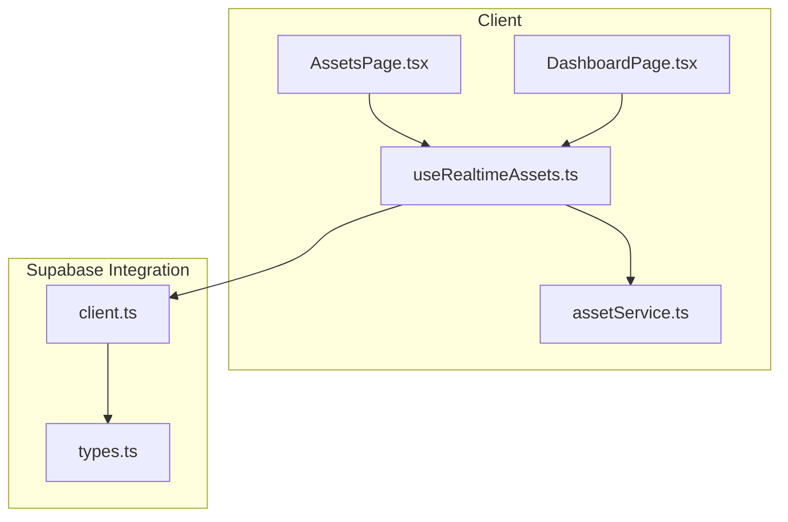
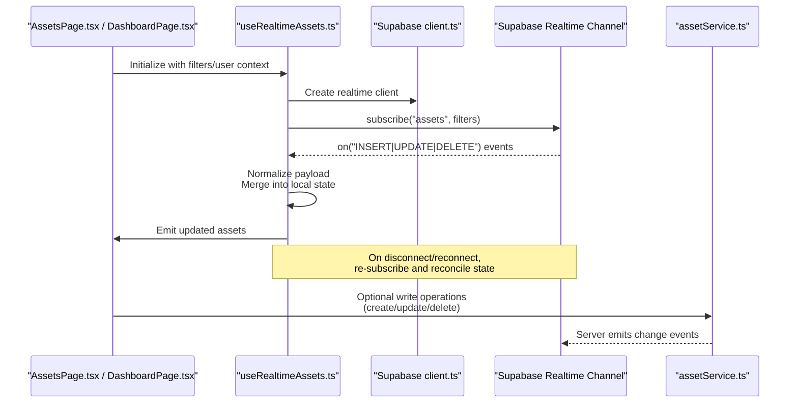
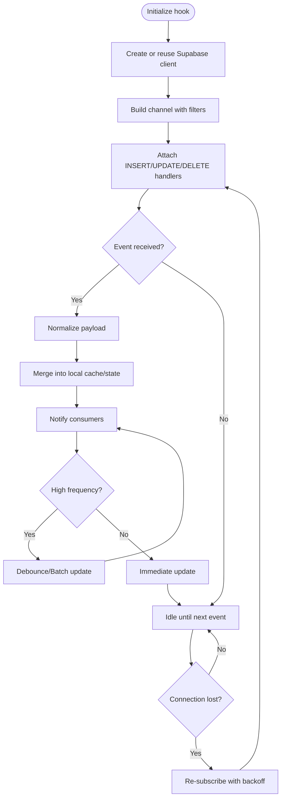
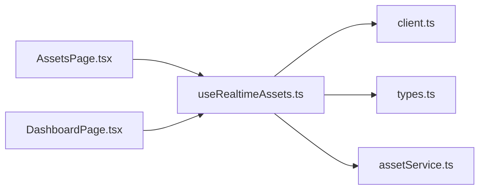

# Real-time Value Updates

<cite>
**Referenced Files in This Document**
- [useRealtimeAssets.ts](file://src/hooks/useRealtimeAssets.ts)
- [client.ts](file://src/integrations/supabase/client.ts)
- [types.ts](file://src/integrations/supabase/types.ts)
- [assetService.ts](file://src/services/assetService.ts)
- [AssetPage.tsx](file://src/pages/desktop/AssetsPage.tsx)
- [DashboardPage.tsx](file://src/pages/desktop/DashboardPage.tsx)
</cite>

## Table of Contents
1. [Introduction](#introduction)
2. [Project Structure](#project-structure)
3. [Core Components](#core-components)
4. [Architecture Overview](#architecture-overview)
5. [Detailed Component Analysis](#detailed-component-analysis)
6. [Dependency Analysis](#dependency-analysis)
7. [Performance Considerations](#performance-considerations)
8. [Troubleshooting Guide](#troubleshooting-guide)
9. [Conclusion](#conclusion)

## Introduction
This document explains the Real-time Value Updates system, focusing on how the useRealtimeAssets hook implements Supabase real-time subscriptions for live portfolio updates. It covers the subscription lifecycle, connection management, offline handling strategies, and patterns for setting up listeners, handling update events, and optimizing performance under frequent price updates. It also addresses WebSocket connection issues, reconnection logic, and data synchronization between client and server.

## Project Structure
The real-time value updates feature is implemented primarily through a React hook that subscribes to Supabase real-time channels and integrates with asset services and pages. The key files involved are:
- Hook implementation for real-time subscriptions
- Supabase client configuration and types
- Asset service layer for data operations
- Pages consuming the hook to render live-updated UI

**Diagram sources**
- [useRealtimeAssets.ts](file://src/hooks/useRealtimeAssets.ts)
- [assetService.ts](file://src/services/assetService.ts)
- [AssetsPage.tsx](file://src/pages/desktop/AssetsPage.tsx)
- [DashboardPage.tsx](file://src/pages/desktop/DashboardPage.tsx)
- [client.ts](file://src/integrations/supabase/client.ts)
- [types.ts](file://src/integrations/supabase/types.ts)

**Section sources**
- [useRealtimeAssets.ts](file://src/hooks/useRealtimeAssets.ts)
- [client.ts](file://src/integrations/supabase/client.ts)
- [types.ts](file://src/integrations/supabase/types.ts)
- [assetService.ts](file://src/services/assetService.ts)
- [AssetsPage.tsx](file://src/pages/desktop/AssetsPage.tsx)
- [DashboardPage.tsx](file://src/pages/desktop/DashboardPage.tsx)

## Core Components
- useRealtimeAssets hook: Manages Supabase real-time subscriptions for assets, including channel setup, event handling, state synchronization, and cleanup.
- Supabase client: Provides the real-time client instance and configuration used by the hook.
- Types: Define schema and payload shapes for real-time events and asset records.
- Asset service: Encapsulates asset-related queries and mutations; may be used alongside real-time updates for initial load or writes.
- Pages: Consume the hook to display live-updated portfolio values.

Key responsibilities:
- Subscribe/unsubscribe to relevant tables/channels based on user context (e.g., authenticated user).
- Normalize incoming real-time payloads into application state.
- Debounce or batch updates to reduce rendering overhead during high-frequency price changes.
- Handle offline scenarios by falling back to cached or last-known state and resuming when connectivity returns.

**Section sources**
- [useRealtimeAssets.ts](file://src/hooks/useRealtimeAssets.ts)
- [client.ts](file://src/integrations/supabase/client.ts)
- [types.ts](file://src/integrations/supabase/types.ts)
- [assetService.ts](file://src/services/assetService.ts)

## Architecture Overview
The real-time architecture connects React components to Supabase via WebSockets. The hook manages the lifecycle of channels and ensures consistent client state.

**Diagram sources**
- [useRealtimeAssets.ts](file://src/hooks/useRealtimeAssets.ts)
- [client.ts](file://src/integrations/supabase/client.ts)
- [assetService.ts](file://src/services/assetService.ts)
- [AssetsPage.tsx](file://src/pages/desktop/AssetsPage.tsx)
- [DashboardPage.tsx](file://src/pages/desktop/DashboardPage.tsx)

## Detailed Component Analysis

### useRealtimeAssets Hook
Responsibilities:
- Establishes a Supabase real-time channel scoped to the current user’s assets.
- Subscribes to INSERT, UPDATE, and DELETE events on the assets table.
- Normalizes incoming events into a stable shape consumed by UI.
- Maintains a local cache to support offline-first behavior and fast renders.
- Implements debouncing/batching for high-frequency price updates.
- Handles reconnection and resubscription on network changes.

Subscription lifecycle:
- Initialization: Create or reuse a Supabase client, build a channel with filters (e.g., user_id), and attach event handlers.
- Active: Process events, merge into local state, and notify consumers.
- Cleanup: Unsubscribe from the channel and clear timers on unmount or dependency changes.
- Reconnection: Detect disconnections, attempt re-subscription with exponential backoff, and reconcile state if needed.

Offline handling:
- Persist last known assets locally (e.g., in-memory cache or storage) to keep UI responsive.
- Queue writes while offline and replay after reconnection.
- Resume subscriptions automatically when connectivity returns.

Optimization strategies:
- Debounce rapid price updates to limit re-renders.
- Batch multiple events into a single state update.
- Use memoization in consumers to avoid unnecessary recalculations.
- Filter at the channel level to minimize payload size.

Error handling:
- Log and surface connection errors.
- Gracefully degrade UI when offline or when events fail to process.
- Provide retry mechanisms with backoff for reconnection.

**Diagram sources**
- [useRealtimeAssets.ts](file://src/hooks/useRealtimeAssets.ts)

**Section sources**
- [useRealtimeAssets.ts](file://src/hooks/useRealtimeAssets.ts)

### Supabase Client and Types
- client.ts: Exposes a configured Supabase client instance used by the hook to create channels and manage subscriptions.
- types.ts: Defines TypeScript types for asset records and real-time event payloads, ensuring type safety across the integration.

Usage patterns:
- Import the client in the hook to create channels.
- Use typed payloads to normalize and validate incoming events.

**Section sources**
- [client.ts](file://src/integrations/supabase/client.ts)
- [types.ts](file://src/integrations/supabase/types.ts)

### Asset Service Layer
- assetService.ts: Encapsulates asset CRUD operations and queries. While real-time handles live updates, this service can be used for initial data loading, explicit writes, and background reconciliation.

Integration points:
- Initial load before subscribing to real-time events.
- Write operations that trigger server-side changes, which then propagate via real-time channels.

**Section sources**
- [assetService.ts](file://src/services/assetService.ts)

### Consumer Pages
- AssetsPage.tsx and DashboardPage.tsx: Consume the useRealtimeAssets hook to render live-updated portfolio metrics and asset lists. They should leverage memoization and efficient rendering to handle frequent updates.

Best practices:
- Avoid heavy computations inside render; compute derived values lazily.
- Use virtualization for large lists to maintain smooth scrolling.

**Section sources**
- [AssetsPage.tsx](file://src/pages/desktop/AssetsPage.tsx)
- [DashboardPage.tsx](file://src/pages/desktop/DashboardPage.tsx)

## Dependency Analysis
The following diagram shows dependencies among core modules related to real-time updates.

**Diagram sources**
- [AssetsPage.tsx](file://src/pages/desktop/AssetsPage.tsx)
- [DashboardPage.tsx](file://src/pages/desktop/DashboardPage.tsx)
- [useRealtimeAssets.ts](file://src/hooks/useRealtimeAssets.ts)
- [client.ts](file://src/integrations/supabase/client.ts)
- [types.ts](file://src/integrations/supabase/types.ts)
- [assetService.ts](file://src/services/assetService.ts)

**Section sources**
- [useRealtimeAssets.ts](file://src/hooks/useRealtimeAssets.ts)
- [client.ts](file://src/integrations/supabase/client.ts)
- [types.ts](file://src/integrations/supabase/types.ts)
- [assetService.ts](file://src/services/assetService.ts)
- [AssetsPage.tsx](file://src/pages/desktop/AssetsPage.tsx)
- [DashboardPage.tsx](file://src/pages/desktop/DashboardPage.tsx)

## Performance Considerations
- Debounce and batch updates: Coalesce rapid price updates to reduce re-render frequency.
- Memoize derived calculations: Compute totals and charts only when underlying data changes.
- Virtualize lists: Render only visible rows for large portfolios.
- Minimize payload: Filter columns and scope channels to required fields.
- Prefer incremental merges: Update only changed fields instead of replacing entire datasets.
- Avoid blocking the main thread: Offload heavy work to web workers if necessary.

[No sources needed since this section provides general guidance]

## Troubleshooting Guide
Common issues and resolutions:
- WebSocket connection failures:
  - Verify network connectivity and firewall rules.
  - Check authentication state and ensure the user is logged in before subscribing.
  - Implement exponential backoff for reconnection attempts.
- Stale or missing data:
  - Ensure proper cleanup and re-subscription on dependency changes.
  - Reconcile local cache with server state after reconnect.
- High CPU usage during updates:
  - Increase debounce intervals or batch more aggressively.
  - Optimize consumer components with memoization and virtualization.
- Offline behavior:
  - Persist last known state and queue writes for later replay.
  - Show an indicator when operating offline and resume seamlessly when online.

Operational tips:
- Log channel lifecycle events (subscribe, unsubscribe, error, reconnect).
- Add health checks to monitor connection status and latency.
- Provide manual refresh controls for users to force reconciliation.

**Section sources**
- [useRealtimeAssets.ts](file://src/hooks/useRealtimeAssets.ts)
- [client.ts](file://src/integrations/supabase/client.ts)

## Conclusion
The Real-time Value Updates system leverages the useRealtimeAssets hook to provide live portfolio updates via Supabase real-time channels. By carefully managing the subscription lifecycle, implementing robust reconnection and offline strategies, and optimizing for high-frequency updates, the application delivers a responsive and reliable user experience. Consumers should follow best practices for memoization and rendering efficiency to complement the hook’s optimizations.

[No sources needed since this section summarizes without analyzing specific files]