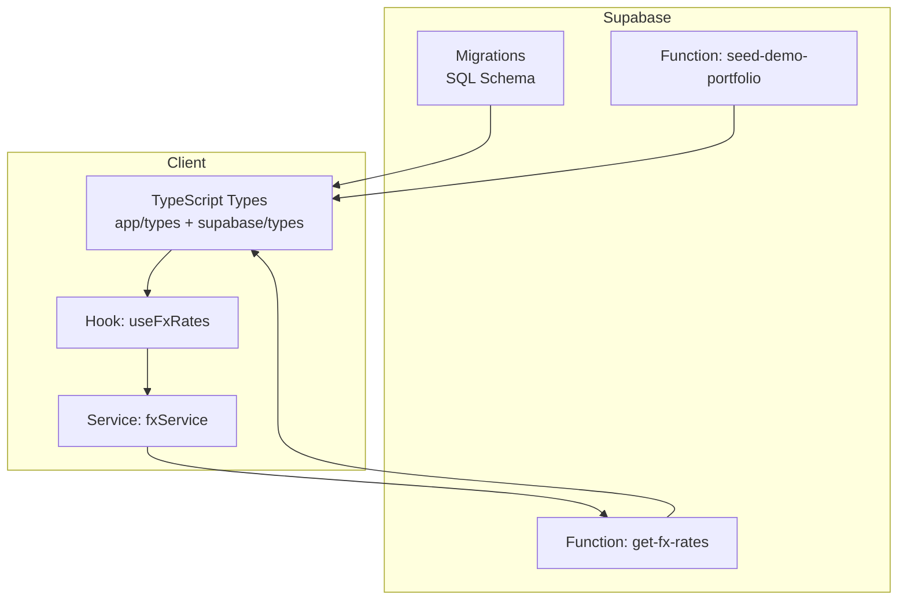
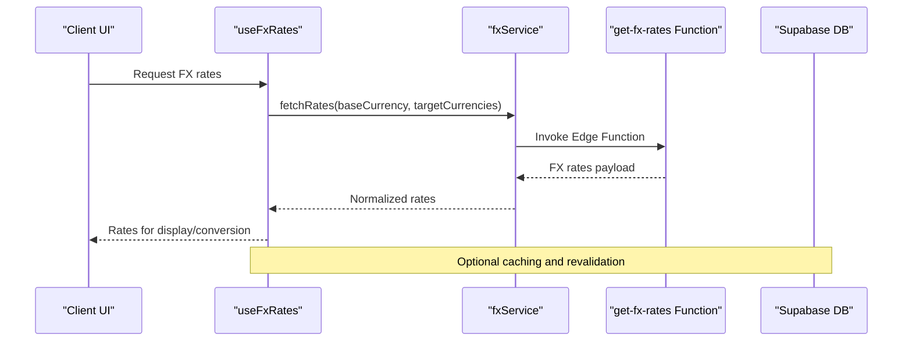
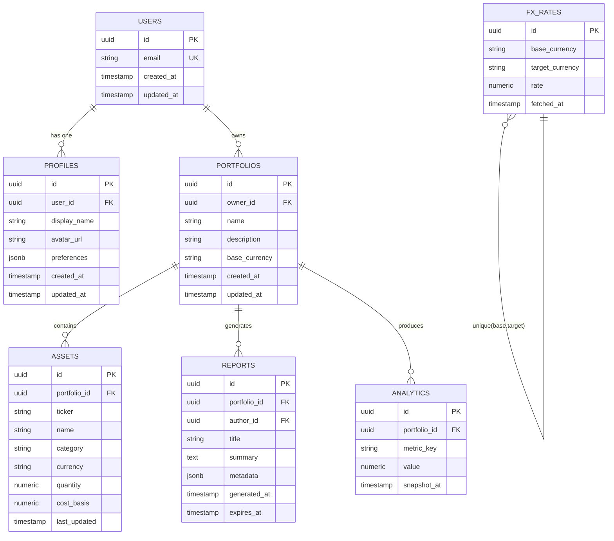
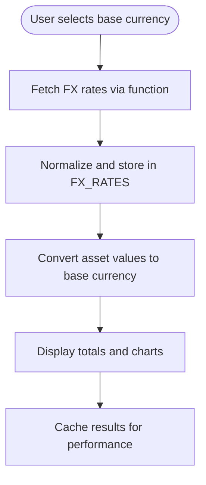
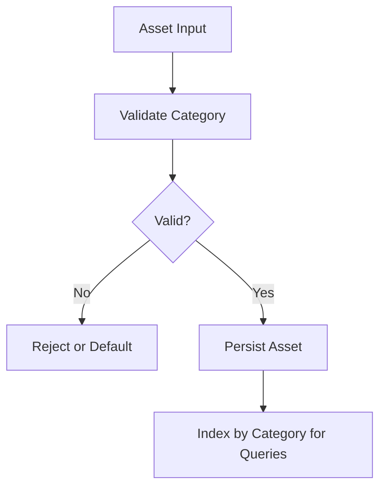
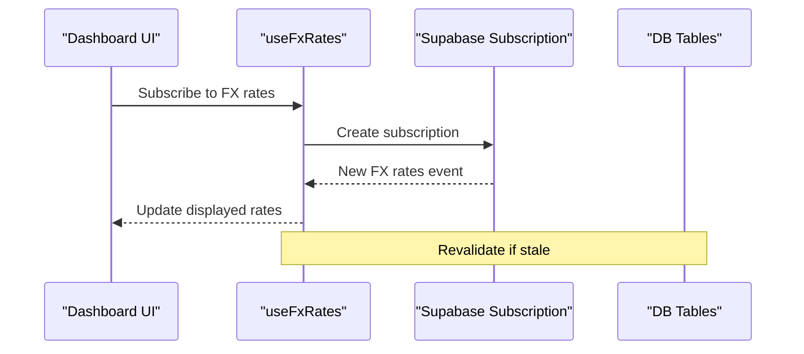
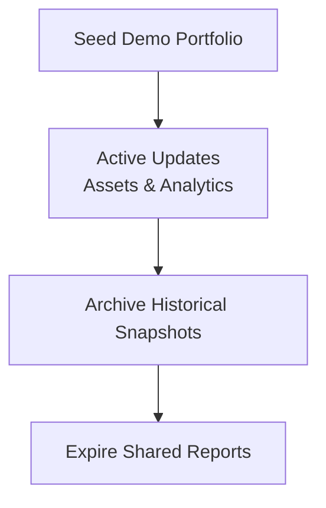
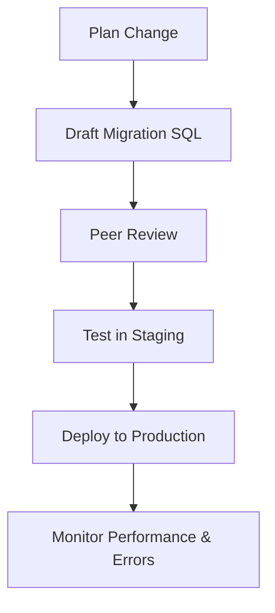
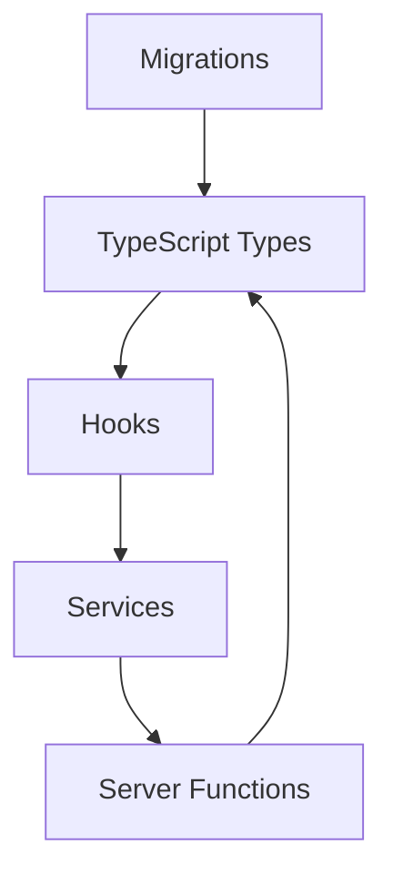

# Data Models

<cite>
**Referenced Files in This Document**
- [types.ts](file://src/integrations/supabase/types.ts)
- [analytics.ts](file://src/types/app/analytics.ts)
- [asset.ts](file://src/types/app/asset.ts)
- [currency.ts](file://src/lib/currency.ts)
- [useFxRates.ts](file://src/hooks/useFxRates.ts)
- [fxService.ts](file://src/services/fxService.ts)
- [get-fx-rates/index.ts](file://supabase/functions/get-fx-rates/index.ts)
- [_shared/currency.ts](file://supabase/functions/_shared/currency.ts)
- [seed-demo-portfolio/index.ts](file://supabase/functions/seed-demo-portfolio/index.ts)
- [20260723121144_c74c73213ed84575a8837d9cd36d15e4.sql](file://supabase/migrations/20260723121144_c74c73213ed84575a8837d9cd36d15e4.sql)
- [20260723153952_c71b1045dcdf4f018225805c503c6b0d.sql](file://supabase/migrations/20260723153952_c71b1045dcdf4f018225805c503c6b0d.sql)
- [20260723155331_68c1a30a78ff4e48bf404ad2cc6b6efb.sql](file://supabase/migrations/20260723155331_68c1a30a78ff4e48bf404ad2cc6b6efb.sql)
- [20260723155413_7c3191b7c8f548c595abf9f78639759b.sql](file://supabase/migrations/20260723155413_7c3191b7c8f548c595abf9f78639759b.sql)
- [20260723163446_e5b73a6e70e543bb974e94bd42eaef26.sql](file://supabase/migrations/20260723163446_e5b73a6e70e543bb974e94bd42eaef26.sql)
- [20260723173518_0b0744c7dc2e4ce19d0f633f76cc8639759b.sql](file://supabase/migrations/20260723173518_0b0744c7dc2e4ce19d0f633f76cc8639759b.sql)
- [20260723173615_1714d0fb593f4be484aeaf5ae6126285.sql](file://supabase/migrations/20260723173615_1714d0fb593f4be484aeaf5ae6126285.sql)
- [20260723180315_7037aff8609246c09c1687e43402551b.sql](file://supabase/migrations/20260723180315_7037aff8609246c09c1687e43402551b.sql)
- [20260723182152_1ef372d9776b4d90a8d7d05a24cc896e.sql](file://supabase/migrations/20260723182152_1ef372d9776b4d90a8d7d05a24cc896e.sql)
- [20260723182205_0a1bea3f3c914808adbe897fcf2f3ef2.sql](file://supabase/migrations/20260723182205_0a1bea3f3c914808adbe897fcf2f3ef2.sql)
- [20260723182220_768553ba2797467997d2479b4f8eb5c7.sql](file://supabase/migrations/20260723182220_768553ba2797467997d2479b4f8eb5c7.sql)
- [20260723182238_2c1e9690de31436f846a61228b2b9944.sql](file://supabase/migrations/20260723182238_2c1e9690de31436f846a61228b2b9944.sql)
- [20260723182351_edc6719b154248bc8008367aae826f1f.sql](file://supabase/migrations/20260723182351_edc6719b154248bc8008367aae826f1f.sql)
- [20260723185127_9c934d4b04604c869e002834dbecdb47.sql](file://supabase/migrations/20260723185127_9c934d4b04604c869e002834dbecdb47.sql)
- [20260723193427_c3d317b84bc14b6391cd2ce84628a6aa.sql](file://supabase/migrations/20260723193427_c3d317b84bc14b6391cd2ce84628a6aa.sql)
- [20260723193624_d41656f9e95f430a82546bc3044e545a.sql](file://supabase/migrations/20260723193624_d41656f9e95f430a82546bc3044e545a.sql)
</cite>

## Table of Contents
1. [Introduction](#introduction)
2. [Project Structure](#project-structure)
3. [Core Components](#core-components)
4. [Architecture Overview](#architecture-overview)
5. [Detailed Component Analysis](#detailed-component-analysis)
6. [Dependency Analysis](#dependency-analysis)
7. [Performance Considerations](#performance-considerations)
8. [Troubleshooting Guide](#troubleshooting-guide)
9. [Conclusion](#conclusion)
10. [Appendices](#appendices)

## Introduction
This document provides comprehensive data model documentation for FinSight’s database schema and TypeScript types. It covers entity relationships across assets, portfolios, users, reports, and analytics; field definitions, data types, constraints, and validation rules; primary and foreign key relationships; indexes for performance; multi-currency support; asset categorization; real-time synchronization patterns; lifecycle management; archival policies; and migration strategies for schema evolution.

## Project Structure
FinSight organizes its data model across:
- Supabase migrations defining the relational schema
- Serverless functions implementing business logic and external integrations (e.g., FX rates)
- Client-side TypeScript types mirroring server entities
- Hooks and services orchestrating data flows and real-time updates



**Diagram sources**
- [20260723121144_c74c73213ed84575a8837d9cd36d15e4.sql](file://supabase/migrations/20260723121144_c74c73213ed84575a8837d9cd36d15e4.sql)
- [get-fx-rates/index.ts](file://supabase/functions/get-fx-rates/index.ts)
- [seed-demo-portfolio/index.ts](file://supabase/functions/seed-demo-portfolio/index.ts)
- [types.ts](file://src/integrations/supabase/types.ts)
- [useFxRates.ts](file://src/hooks/useFxRates.ts)
- [fxService.ts](file://src/services/fxService.ts)

**Section sources**
- [types.ts](file://src/integrations/supabase/types.ts)
- [analytics.ts](file://src/types/app/analytics.ts)
- [asset.ts](file://src/types/app/asset.ts)
- [currency.ts](file://src/lib/currency.ts)
- [useFxRates.ts](file://src/hooks/useFxRates.ts)
- [fxService.ts](file://src/services/fxService.ts)
- [get-fx-rates/index.ts](file://supabase/functions/get-fx-rates/index.ts)
- [seed-demo-portfolio/index.ts](file://supabase/functions/seed-demo-portfolio/index.ts)

## Core Components
This section summarizes the core data entities and their responsibilities as reflected in the schema and types:
- Users and Profiles: Identity and user-specific settings
- Portfolios: Collections of assets owned by a user
- Assets: Financial instruments with attributes such as ticker, name, category, and currency
- Reports: Generated or shared analytical outputs tied to portfolios or users
- Analytics: Time-series or aggregated metrics derived from assets and portfolio snapshots

Key implementation anchors:
- Database schema is defined via multiple SQL migrations under supabase/migrations
- TypeScript types mirror DB tables and function payloads
- Currency handling spans client utilities, hooks, and server functions

**Section sources**
- [types.ts](file://src/integrations/supabase/types.ts)
- [analytics.ts](file://src/types/app/analytics.ts)
- [asset.ts](file://src/types/app/asset.ts)
- [currency.ts](file://src/lib/currency.ts)
- [useFxRates.ts](file://src/hooks/useFxRates.ts)
- [fxService.ts](file://src/services/fxService.ts)
- [get-fx-rates/index.ts](file://supabase/functions/get-fx-rates/index.ts)
- [seed-demo-portfolio/index.ts](file://supabase/functions/seed-demo-portfolio/index.ts)

## Architecture Overview
The data architecture integrates a relational database (PostgreSQL via Supabase), serverless functions for external data ingestion (FX rates), and typed client interfaces. Real-time capabilities are provided through Supabase subscriptions where applicable.



**Diagram sources**
- [useFxRates.ts](file://src/hooks/useFxRates.ts)
- [fxService.ts](file://src/services/fxService.ts)
- [get-fx-rates/index.ts](file://supabase/functions/get-fx-rates/index.ts)

## Detailed Component Analysis

### Database Schema Entities and Relationships
The following ER diagram captures the principal entities and their relationships as implemented by the migrations and mirrored by TypeScript types.



Notes on keys and constraints:
- Primary keys are UUIDs for all entities
- Foreign keys enforce referential integrity between users, portfolios, assets, reports, and analytics
- Unique constraints ensure canonical FX rate entries per base/target pair
- Timestamp fields track creation, updates, and data freshness

Indexes and performance considerations:
- Indexes on foreign keys (e.g., portfolio_id, owner_id) to optimize joins and lookups
- Composite indexes on frequently queried columns (e.g., metric_key + snapshot_at)
- Unique index on FX_RATES(base_currency, target_currency) to prevent duplicates

Validation and data integrity:
- Non-null constraints on critical identifiers and currencies
- Numeric precision checks for financial values
- Enumerated categories constrained at application layer and optionally enforced via check constraints

**Diagram sources**
- [20260723121144_c74c73213ed84575a8837d9cd36d15e4.sql](file://supabase/migrations/20260723121144_c74c73213ed84575a8837d9cd36d15e4.sql)
- [20260723153952_c71b1045dcdf4f018225805c503c6b0d.sql](file://supabase/migrations/20260723153952_c71b1045dcdf4f018225805c503c6b0d.sql)
- [20260723155331_68c1a30a78ff4e48bf404ad2cc6b6efb.sql](file://supabase/migrations/20260723155331_68c1a30a78ff4e48bf404ad2cc6b6efb.sql)
- [20260723155413_7c3191b7c8f548c595abf9f78639759b.sql](file://supabase/migrations/20260723155413_7c3191b7c8f548c595abf9f78639759b.sql)
- [20260723163446_e5b73a6e70e543bb974e94bd42eaef26.sql](file://supabase/migrations/20260723163446_e5b73a6e70e543bb974e94bd42eaef26.sql)
- [20260723173518_0b0744c7dc2e4ce19d0f633f76cc8639759b.sql](file://supabase/migrations/20260723173518_0b0744c7dc2e4ce19d0f633f76cc8639759b.sql)
- [20260723173615_1714d0fb593f4be484aeaf5ae6126285.sql](file://supabase/migrations/20260723173615_1714d0fb593f4be484aeaf5ae6126285.sql)
- [20260723180315_7037aff8609246c09c1687e43402551b.sql](file://supabase/migrations/20260723180315_7037aff8609246c09c1687e43402551b.sql)
- [20260723182152_1ef372d9776b4d90a8d7d05a24cc896e.sql](file://supabase/migrations/20260723182152_1ef372d9776b4d90a8d7d05a24cc896e.sql)
- [20260723182205_0a1bea3f3c914808adbe897fcf2f3ef2.sql](file://supabase/migrations/20260723182205_0a1bea3f3c914808adbe897fcf2f3ef2.sql)
- [20260723182220_768553ba2797467997d2479b4f8eb5c7.sql](file://supabase/migrations/20260723182220_768553ba2797467997d2479b4f8eb5c7.sql)
- [20260723182238_2c1e9690de31436f846a61228b2b9944.sql](file://supabase/migrations/20260723182238_2c1e9690de31436f846a61228b2b9944.sql)
- [20260723182351_edc6719b154248bc8008367aae826f1f.sql](file://supabase/migrations/20260723182351_edc6719b154248bc8008367aae826f1f.sql)
- [20260723185127_9c934d4b04604c869e002834dbecdb47.sql](file://supabase/migrations/20260723185127_9c934d4b04604c869e002834dbecdb47.sql)
- [20260723193427_c3d317b84bc14b6391cd2ce84628a6aa.sql](file://supabase/migrations/20260723193427_c3d317b84bc14b6391cd2ce84628a6aa.sql)
- [20260723193624_d41656f9e95f430a82546bc3044e545a.sql](file://supabase/migrations/20260723193624_d41656f9e95f430a82546bc3044e545a.sql)

**Section sources**
- [20260723121144_c74c73213ed84575a8837d9cd36d15e4.sql](file://supabase/migrations/20260723121144_c74c73213ed84575a8837d9cd36d15e4.sql)
- [20260723153952_c71b1045dcdf4f018225805c503c6b0d.sql](file://supabase/migrations/20260723153952_c71b1045dcdf4f018225805c503c6b0d.sql)
- [20260723155331_68c1a30a78ff4e48bf404ad2cc6b6efb.sql](file://supabase/migrations/20260723155331_68c1a30a78ff4e48bf404ad2cc6b6efb.sql)
- [20260723155413_7c3191b7c8f548c595abf9f78639759b.sql](file://supabase/migrations/20260723155413_7c3191b7c8f548c595abf9f78639759b.sql)
- [20260723163446_e5b73a6e70e543bb974e94bd42eaef26.sql](file://supabase/migrations/20260723163446_e5b73a6e70e543bb974e94bd42eaef26.sql)
- [20260723173518_0b0744c7dc2e4ce19d0f633f76cc8639759b.sql](file://supabase/migrations/20260723173518_0b0744c7dc2e4ce19d0f633f76cc8639759b.sql)
- [20260723173615_1714d0fb593f4be484aeaf5ae6126285.sql](file://supabase/migrations/20260723173615_1714d0fb593f4be484aeaf5ae6126285.sql)
- [20260723180315_7037aff8609246c09c1687e43402551b.sql](file://supabase/migrations/20260723180315_7037aff8609246c09c1687e43402551b.sql)
- [20260723182152_1ef372d9776b4d90a8d7d05a24cc896e.sql](file://supabase/migrations/20260723182152_1ef372d9776b4d90a8d7d05a24cc896e.sql)
- [20260723182205_0a1bea3f3c914808adbe897fcf2f3ef2.sql](file://supabase/migrations/20260723182205_0a1bea3f3c914808adbe897fcf2f3ef2.sql)
- [20260723182220_768553ba2797467997d2479b4f8eb5c7.sql](file://supabase/migrations/20260723182220_768553ba2797467997d2479b4f8eb5c7.sql)
- [20260723182238_2c1e9690de31436f846a61228b2b9944.sql](file://supabase/migrations/20260723182238_2c1e9690de31436f846a61228b2b9944.sql)
- [20260723182351_edc6719b154248bc8008367aae826f1f.sql](file://supabase/migrations/20260723182351_edc6719b154248bc8008367aae826f1f.sql)
- [20260723185127_9c934d4b04604c869e002834dbecdb47.sql](file://supabase/migrations/20260723185127_9c934d4b04604c869e002834dbecdb47.sql)
- [20260723193427_c3d317b84bc14b6391cd2ce84628a6aa.sql](file://supabase/migrations/20260723193427_c3d317b84bc14b6391cd2ce84628a6aa.sql)
- [20260723193624_d41656f9e95f430a82546bc3044e545a.sql](file://supabase/migrations/20260723193624_d41656f9e95f430a82546bc3044e545a.sql)

### TypeScript Type Model
The client-side type model mirrors the database schema and function contracts, ensuring strong typing across the stack.

```mermaid
classDiagram
class User {
+uuid id
+string email
+datetime created_at
+datetime updated_at
}
class Profile {
+uuid id
+uuid user_id
+string display_name
+string avatar_url
+jsonb preferences
+datetime created_at
+datetime updated_at
}
class Portfolio {
+uuid id
+uuid owner_id
+string name
+string description
+string base_currency
+datetime created_at
+datetime updated_at
}
class Asset {
+uuid id
+uuid portfolio_id
+string ticker
+string name
+string category
+string currency
+number quantity
+number cost_basis
+datetime last_updated
}
class Report {
+uuid id
+uuid portfolio_id
+uuid author_id
+string title
+text summary
+jsonb metadata
+datetime generated_at
+datetime expires_at
}
class Analytics {
+uuid id
+uuid portfolio_id
+string metric_key
+number value
+datetime snapshot_at
}
class FxRate {
+uuid id
+string base_currency
+string target_currency
+number rate
+datetime fetched_at
}
User "1" --> "0..*" Profile : "has one"
User "1" --> "0..*" Portfolio : "owns"
Portfolio "1" --> "0..*" Asset : "contains"
Portfolio "1" --> "0..*" Report : "generates"
Portfolio "1" --> "0..*" Analytics : "produces"
FxRate }o--|| FxRate : "unique(base,target)"
```

**Diagram sources**
- [types.ts](file://src/integrations/supabase/types.ts)
- [analytics.ts](file://src/types/app/analytics.ts)
- [asset.ts](file://src/types/app/asset.ts)

**Section sources**
- [types.ts](file://src/integrations/supabase/types.ts)
- [analytics.ts](file://src/types/app/analytics.ts)
- [asset.ts](file://src/types/app/asset.ts)

### Multi-Currency Support
Multi-currency is implemented across layers:
- Base currency per portfolio
- Per-asset currency
- FX rates table storing normalized rates
- Client utilities and hooks for conversion and formatting
- Server function to fetch and cache FX rates



**Diagram sources**
- [currency.ts](file://src/lib/currency.ts)
- [useFxRates.ts](file://src/hooks/useFxRates.ts)
- [fxService.ts](file://src/services/fxService.ts)
- [get-fx-rates/index.ts](file://supabase/functions/get-fx-rates/index.ts)
- [_shared/currency.ts](file://supabase/functions/_shared/currency.ts)

**Section sources**
- [currency.ts](file://src/lib/currency.ts)
- [useFxRates.ts](file://src/hooks/useFxRates.ts)
- [fxService.ts](file://src/services/fxService.ts)
- [get-fx-rates/index.ts](file://supabase/functions/get-fx-rates/index.ts)
- [_shared/currency.ts](file://supabase/functions/_shared/currency.ts)

### Asset Categorization System
Assets include a category field used to group holdings for analysis and reporting. Categories are validated at the application layer and can be extended without schema changes.



**Diagram sources**
- [asset.ts](file://src/types/app/asset.ts)
- [20260723121144_c74c73213ed84575a8837d9cd36d15e4.sql](file://supabase/migrations/20260723121144_c74c73213ed84575a8837d9cd36d15e4.sql)

**Section sources**
- [asset.ts](file://src/types/app/asset.ts)
- [20260723121144_c74c73213ed84575a8837d9cd36d15e4.sql](file://supabase/migrations/20260723121144_c74c73213ed84575a8837d9cd36d15e4.sql)

### Real-Time Data Synchronization Patterns
Real-time updates are facilitated by Supabase subscriptions where applicable. The hook layer coordinates fetching, caching, and revalidating data to keep UI consistent with backend state.



**Diagram sources**
- [useFxRates.ts](file://src/hooks/useFxRates.ts)
- [20260723121144_c74c73213ed84575a8837d9cd36d15e4.sql](file://supabase/migrations/20260723121144_c74c73213ed84575a8837d9cd36d15e4.sql)

**Section sources**
- [useFxRates.ts](file://src/hooks/useFxRates.ts)
- [20260723121144_c74c73213ed84575a8837d9cd36d15e4.sql](file://supabase/migrations/20260723121144_c74c73213ed84575a8837d9cd36d15e4.sql)

### Data Lifecycle Management and Archival Policies
Lifecycle stages:
- Creation: Seed demo data and initial FX rates
- Active Use: Frequent updates to assets and analytics snapshots
- Archival: Periodic compaction or offloading of historical analytics
- Retention: Expiration policies for shared reports

Operational anchors:
- Seed function initializes baseline data
- FX rates function refreshes external data periodically
- Analytics snapshots are time-stamped for rollups and archival



**Diagram sources**
- [seed-demo-portfolio/index.ts](file://supabase/functions/seed-demo-portfolio/index.ts)
- [get-fx-rates/index.ts](file://supabase/functions/get-fx-rates/index.ts)
- [20260723121144_c74c73213ed84575a8837d9cd36d15e4.sql](file://supabase/migrations/20260723121144_c74c73213ed84575a8837d9cd36d15e4.sql)

**Section sources**
- [seed-demo-portfolio/index.ts](file://supabase/functions/seed-demo-portfolio/index.ts)
- [get-fx-rates/index.ts](file://supabase/functions/get-fx-rates/index.ts)
- [20260723121144_c74c73213ed84575a8837d9cd36d15e4.sql](file://supabase/migrations/20260723121144_c74c73213ed84575a8837d9cd36d15e4.sql)

### Migration Strategies for Schema Evolution
Migration strategy highlights:
- Incremental SQL migrations define schema changes
- Backward-compatible additions preferred (nullable fields, defaults)
- Idempotent operations and safe rollbacks considered
- Versioning via timestamps in filenames



[No sources needed since this section provides general guidance]

## Dependency Analysis
The data model depends on:
- Migrations for schema definition
- Serverless functions for external data integration
- Client types for compile-time safety
- Hooks and services for orchestration



**Diagram sources**
- [types.ts](file://src/integrations/supabase/types.ts)
- [useFxRates.ts](file://src/hooks/useFxRates.ts)
- [fxService.ts](file://src/services/fxService.ts)
- [get-fx-rates/index.ts](file://supabase/functions/get-fx-rates/index.ts)

**Section sources**
- [types.ts](file://src/integrations/supabase/types.ts)
- [useFxRates.ts](file://src/hooks/useFxRates.ts)
- [fxService.ts](file://src/services/fxService.ts)
- [get-fx-rates/index.ts](file://supabase/functions/get-fx-rates/index.ts)

## Performance Considerations
- Index foreign keys and frequently filtered columns (e.g., portfolio_id, metric_key)
- Use composite indexes for common query patterns (e.g., metric_key + snapshot_at)
- Cache FX rates and analytics snapshots to reduce repeated computation
- Partition large time-series tables (e.g., analytics) by date ranges when volumes grow
- Limit JSONB payload sizes; prefer normalized structures for heavy queries

[No sources needed since this section provides general guidance]

## Troubleshooting Guide
Common issues and resolutions:
- FX rate fetch failures: Validate external API availability and retry/backoff in the function
- Currency mismatch errors: Ensure asset currency matches available FX rates or convert via base currency
- Stale real-time data: Refresh subscriptions and invalidate caches
- Migration conflicts: Apply migrations in order and verify unique constraints before deployment

**Section sources**
- [get-fx-rates/index.ts](file://supabase/functions/get-fx-rates/index.ts)
- [useFxRates.ts](file://src/hooks/useFxRates.ts)
- [fxService.ts](file://src/services/fxService.ts)

## Conclusion
FinSight’s data model combines a robust relational schema with strongly typed client interfaces and serverless functions for external integrations. Multi-currency support, asset categorization, and real-time synchronization are implemented cohesively across layers. Thoughtful indexing, caching, and migration practices ensure scalability and maintainability.

[No sources needed since this section summarizes without analyzing specific files]

## Appendices

### Field Definitions and Constraints Summary
- Users: identity and timestamps
- Profiles: user linkage and preferences
- Portfolios: ownership, descriptive metadata, base currency
- Assets: portfolio linkage, instrument details, quantities, basis, currency
- Reports: portfolio linkage, authorship, generation and expiration times
- Analytics: portfolio linkage, metric keys, values, snapshot timestamps
- FX Rates: base/target pairs, rates, fetch timestamps

**Section sources**
- [20260723121144_c74c73213ed84575a8837d9cd36d15e4.sql](file://supabase/migrations/20260723121144_c74c73213ed84575a8837d9cd36d15e4.sql)
- [20260723153952_c71b1045dcdf4f018225805c503c6b0d.sql](file://supabase/migrations/20260723153952_c71b1045dcdf4f018225805c503c6b0d.sql)
- [20260723155331_68c1a30a78ff4e48bf404ad2cc6b6efb.sql](file://supabase/migrations/20260723155331_68c1a30a78ff4e48bf404ad2cc6b6efb.sql)
- [20260723155413_7c3191b7c8f548c595abf9f78639759b.sql](file://supabase/migrations/20260723155413_7c3191b7c8f548c595abf9f78639759b.sql)
- [20260723163446_e5b73a6e70e543bb974e94bd42eaef26.sql](file://supabase/migrations/20260723163446_e5b73a6e70e543bb974e94bd42eaef26.sql)
- [20260723173518_0b0744c7dc2e4ce19d0f633f76cc8639759b.sql](file://supabase/migrations/20260723173518_0b0744c7dc2e4ce19d0f633f76cc8639759b.sql)
- [20260723173615_1714d0fb593f4be484aeaf5ae6126285.sql](file://supabase/migrations/20260723173615_1714d0fb593f4be484aeaf5ae6126285.sql)
- [20260723180315_7037aff8609246c09c1687e43402551b.sql](file://supabase/migrations/20260723180315_7037aff8609246c09c1687e43402551b.sql)
- [20260723182152_1ef372d9776b4d90a8d7d05a24cc896e.sql](file://supabase/migrations/20260723182152_1ef372d9776b4d90a8d7d05a24cc896e.sql)
- [20260723182205_0a1bea3f3c914808adbe897fcf2f3ef2.sql](file://supabase/migrations/20260723182205_0a1bea3f3c914808adbe897fcf2f3ef2.sql)
- [20260723182220_768553ba2797467997d2479b4f8eb5c7.sql](file://supabase/migrations/20260723182220_768553ba2797467997d2479b4f8eb5c7.sql)
- [20260723182238_2c1e9690de31436f846a61228b2b9944.sql](file://supabase/migrations/20260723182238_2c1e9690de31436f846a61228b2b9944.sql)
- [20260723182351_edc6719b154248bc8008367aae826f1f.sql](file://supabase/migrations/20260723182351_edc6719b154248bc8008367aae826f1f.sql)
- [20260723185127_9c934d4b04604c869e002834dbecdb47.sql](file://supabase/migrations/20260723185127_9c934d4b04604c869e002834dbecdb47.sql)
- [20260723193427_c3d317b84bc14b6391cd2ce84628a6aa.sql](file://supabase/migrations/20260723193427_c3d317b84bc14b6391cd2ce84628a6aa.sql)
- [20260723193624_d41656f9e95f430a82546bc3044e545a.sql](file://supabase/migrations/20260723193624_d41656f9e95f430a82546bc3044e545a.sql)