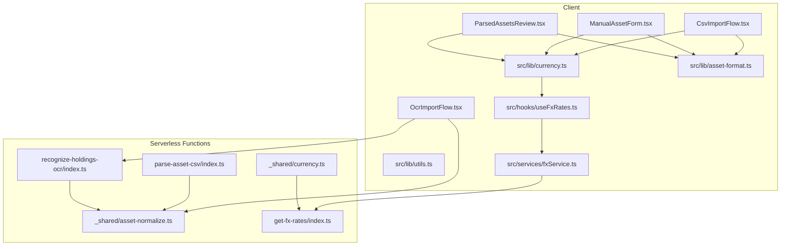
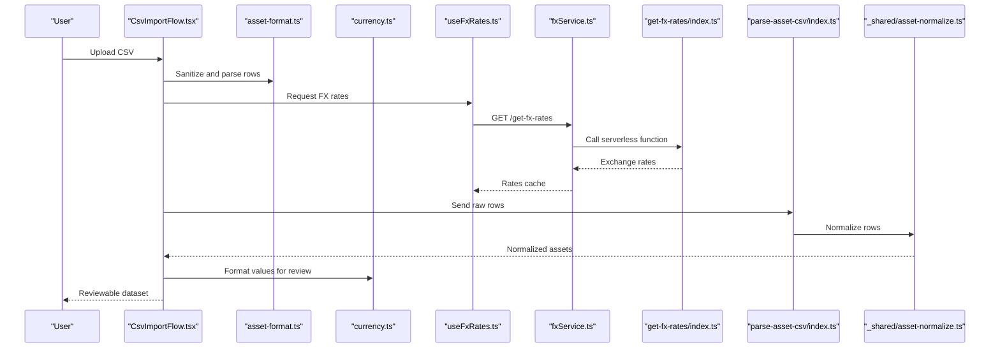
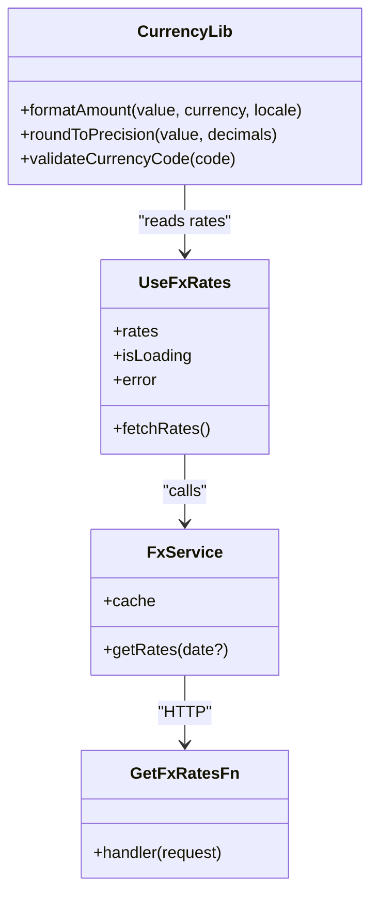
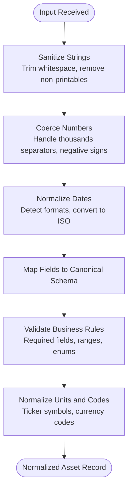
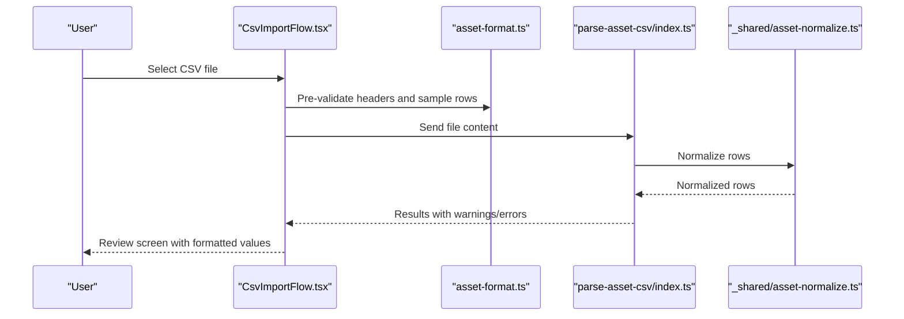
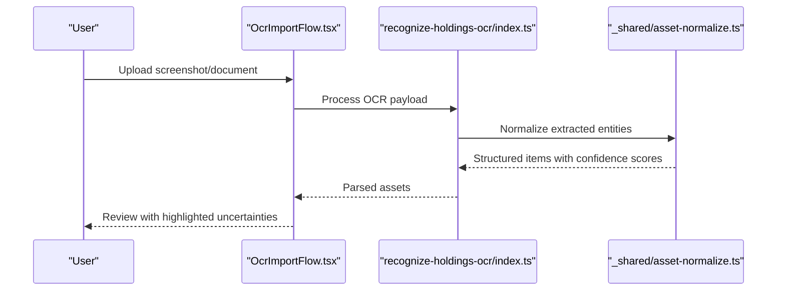
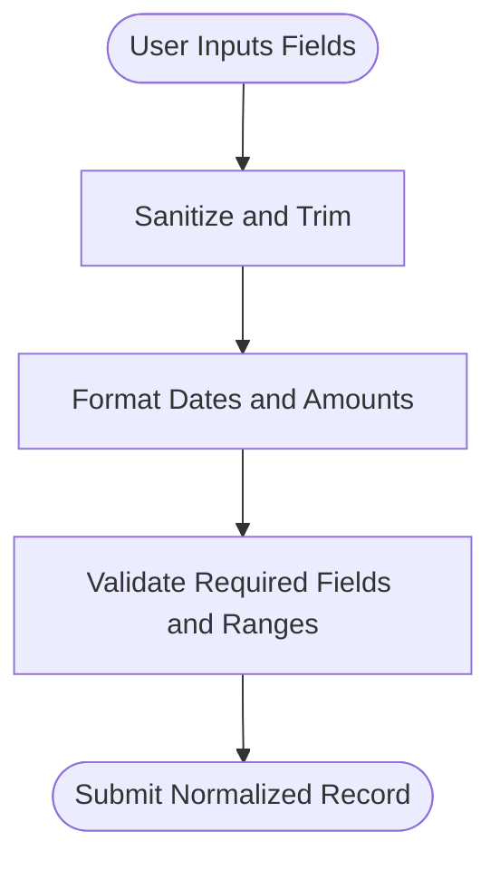
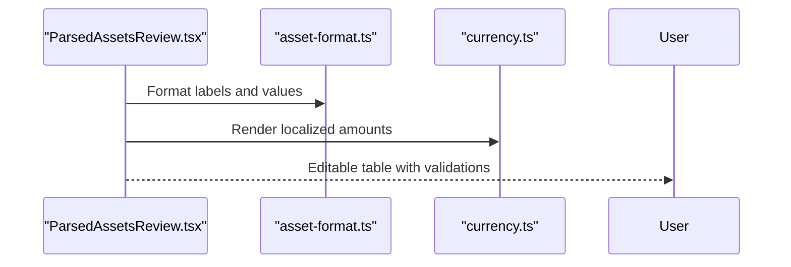
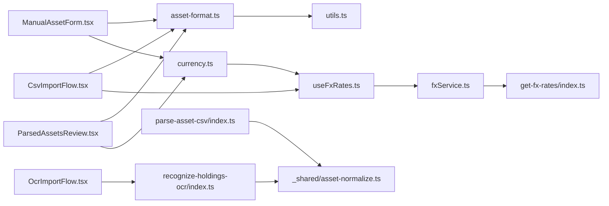

# Data Transformations & Utilities

<cite>
**Referenced Files in This Document**
- [src/lib/currency.ts](file://src/lib/currency.ts)
- [src/lib/asset-format.ts](file://src/lib/asset-format.ts)
- [src/lib/utils.ts](file://src/lib/utils.ts)
- [src/hooks/useFxRates.ts](file://src/hooks/useFxRates.ts)
- [src/services/fxService.ts](file://src/services/fxService.ts)
- [supabase/functions/_shared/currency.ts](file://supabase/functions/_shared/currency.ts)
- [supabase/functions/get-fx-rates/index.ts](file://supabase/functions/get-fx-rates/index.ts)
- [supabase/functions/_shared/asset-normalize.ts](file://supabase/functions/_shared/asset-normalize.ts)
- [supabase/functions/parse-asset-csv/index.ts](file://supabase/functions/parse-asset-csv/index.ts)
- [supabase/functions/recognize-holdings-ocr/index.ts](file://supabase/functions/recognize-holdings-ocr/index.ts)
- [src/components/desktop/import/CsvImportFlow.tsx](file://src/components/desktop/import/CsvImportFlow.tsx)
- [src/components/desktop/import/OcrImportFlow.tsx](file://src/components/desktop/import/OcrImportFlow.tsx)
- [src/components/desktop/import/ManualAssetForm.tsx](file://src/components/desktop/import/ManualAssetForm.tsx)
- [src/components/desktop/import/ParsedAssetsReview.tsx](file://src/components/desktop/import/ParsedAssetsReview.tsx)
</cite>

## Table of Contents
1. [Introduction](#introduction)
2. [Project Structure](#project-structure)
3. [Core Components](#core-components)
4. [Architecture Overview](#architecture-overview)
5. [Detailed Component Analysis](#detailed-component-analysis)
6. [Dependency Analysis](#dependency-analysis)
7. [Performance Considerations](#performance-considerations)
8. [Troubleshooting Guide](#troubleshooting-guide)
9. [Conclusion](#conclusion)
10. [Appendices](#appendices)

## Introduction
This document explains FinSight’s data transformation utilities and formatting functions with a focus on:
- Currency conversion logic, exchange rate handling, and multi-currency support
- Asset format parsing, validation, and normalization for CSV imports, OCR processing, and manual entry
- Data sanitization, formatting utilities, and business rules
- Common transformation workflows, error handling patterns, and performance optimizations
- Locale-specific formatting, date/time handling, and numerical precision considerations

The goal is to provide both high-level architecture insights and code-level details so that developers can implement, extend, and troubleshoot the transformation pipeline confidently.

## Project Structure
FinSight organizes transformation-related logic across client-side libraries, hooks, services, and serverless functions:
- Client-side libraries: currency utilities, asset format helpers, and general utilities
- Hooks and services: FX rates retrieval and caching
- Serverless functions: FX rates endpoint, CSV parsing, OCR recognition, and shared normalization utilities

**Diagram sources**
- [src/lib/currency.ts](file://src/lib/currency.ts)
- [src/lib/asset-format.ts](file://src/lib/asset-format.ts)
- [src/lib/utils.ts](file://src/lib/utils.ts)
- [src/hooks/useFxRates.ts](file://src/hooks/useFxRates.ts)
- [src/services/fxService.ts](file://src/services/fxService.ts)
- [supabase/functions/_shared/currency.ts](file://supabase/functions/_shared/currency.ts)
- [supabase/functions/get-fx-rates/index.ts](file://supabase/functions/get-fx-rates/index.ts)
- [supabase/functions/_shared/asset-normalize.ts](file://supabase/functions/_shared/asset-normalize.ts)
- [supabase/functions/parse-asset-csv/index.ts](file://supabase/functions/parse-asset-csv/index.ts)
- [supabase/functions/recognize-holdings-ocr/index.ts](file://supabase/functions/recognize-holdings-ocr/index.ts)
- [src/components/desktop/import/CsvImportFlow.tsx](file://src/components/desktop/import/CsvImportFlow.tsx)
- [src/components/desktop/import/OcrImportFlow.tsx](file://src/components/desktop/import/OcrImportFlow.tsx)
- [src/components/desktop/import/ManualAssetForm.tsx](file://src/components/desktop/import/ManualAssetForm.tsx)
- [src/components/desktop/import/ParsedAssetsReview.tsx](file://src/components/desktop/import/ParsedAssetsReview.tsx)

**Section sources**
- [src/lib/currency.ts](file://src/lib/currency.ts)
- [src/lib/asset-format.ts](file://src/lib/asset-format.ts)
- [src/lib/utils.ts](file://src/lib/utils.ts)
- [src/hooks/useFxRates.ts](file://src/hooks/useFxRates.ts)
- [src/services/fxService.ts](file://src/services/fxService.ts)
- [supabase/functions/_shared/currency.ts](file://supabase/functions/_shared/currency.ts)
- [supabase/functions/get-fx-rates/index.ts](file://supabase/functions/get-fx-rates/index.ts)
- [supabase/functions/_shared/asset-normalize.ts](file://supabase/functions/_shared/asset-normalize.ts)
- [supabase/functions/parse-asset-csv/index.ts](file://supabase/functions/parse-asset-csv/index.ts)
- [supabase/functions/recognize-holdings-ocr/index.ts](file://supabase/functions/recognize-holdings-ocr/index.ts)
- [src/components/desktop/import/CsvImportFlow.tsx](file://src/components/desktop/import/CsvImportFlow.tsx)
- [src/components/desktop/import/OcrImportFlow.tsx](file://src/components/desktop/import/OcrImportFlow.tsx)
- [src/components/desktop/import/ManualAssetForm.tsx](file://src/components/desktop/import/ManualAssetForm.tsx)
- [src/components/desktop/import/ParsedAssetsReview.tsx](file://src/components/desktop/import/ParsedAssetsReview.tsx)

## Core Components
- Currency utilities (client): Provide formatting, rounding, and locale-aware number display; may include helper conversions when rates are available.
- Asset format utilities (client): Normalize raw inputs into consistent internal structures for assets; handle CSV fields, OCR outputs, and manual form entries.
- General utilities (client): Shared helpers for sanitization, string trimming, safe numeric parsing, and common transformations.
- FX rates hook (client): Fetches and caches exchange rates from the serverless function; exposes stable API for components.
- FX service (client): Encapsulates HTTP calls to get-fx-rates and manages request lifecycle and errors.
- Shared currency (serverless): Canonical definitions for supported currencies and any server-side formatting or validation rules.
- FX rates endpoint (serverless): Retrieves and returns up-to-date exchange rates.
- Asset normalization (serverless): Centralized normalization for parsed CSV and OCR results before persistence.
- CSV parser (serverless): Parses uploaded CSVs into structured rows and normalizes them using shared utilities.
- OCR recognizer (serverless): Processes OCR output into standardized asset records and normalizes via shared utilities.
- Import flows (client): Orchestrate user interactions for CSV import, OCR upload, and manual entry, leveraging the above utilities.

**Section sources**
- [src/lib/currency.ts](file://src/lib/currency.ts)
- [src/lib/asset-format.ts](file://src/lib/asset-format.ts)
- [src/lib/utils.ts](file://src/lib/utils.ts)
- [src/hooks/useFxRates.ts](file://src/hooks/useFxRates.ts)
- [src/services/fxService.ts](file://src/services/fxService.ts)
- [supabase/functions/_shared/currency.ts](file://supabase/functions/_shared/currency.ts)
- [supabase/functions/get-fx-rates/index.ts](file://supabase/functions/get-fx-rates/index.ts)
- [supabase/functions/_shared/asset-normalize.ts](file://supabase/functions/_shared/asset-normalize.ts)
- [supabase/functions/parse-asset-csv/index.ts](file://supabase/functions/parse-asset-csv/index.ts)
- [supabase/functions/recognize-holdings-ocr/index.ts](file://supabase/functions/recognize-holdings-ocr/index.ts)
- [src/components/desktop/import/CsvImportFlow.tsx](file://src/components/desktop/import/CsvImportFlow.tsx)
- [src/components/desktop/import/OcrImportFlow.tsx](file://src/components/desktop/import/OcrImportFlow.tsx)
- [src/components/desktop/import/ManualAssetForm.tsx](file://src/components/desktop/import/ManualAssetForm.tsx)
- [src/components/desktop/import/ParsedAssetsReview.tsx](file://src/components/desktop/import/ParsedAssetsReview.tsx)

## Architecture Overview
The transformation pipeline spans client and serverless layers:
- Client orchestrates input collection (CSV, OCR, manual), applies local formatting/sanitization, and requests FX rates as needed.
- Serverless functions provide canonical normalization and FX rates endpoints.
- Normalized assets flow back to the client for review and persistence.

**Diagram sources**
- [src/components/desktop/import/CsvImportFlow.tsx](file://src/components/desktop/import/CsvImportFlow.tsx)
- [src/lib/asset-format.ts](file://src/lib/asset-format.ts)
- [src/lib/currency.ts](file://src/lib/currency.ts)
- [src/hooks/useFxRates.ts](file://src/hooks/useFxRates.ts)
- [src/services/fxService.ts](file://src/services/fxService.ts)
- [supabase/functions/get-fx-rates/index.ts](file://supabase/functions/get-fx-rates/index.ts)
- [supabase/functions/parse-asset-csv/index.ts](file://supabase/functions/parse-asset-csv/index.ts)
- [supabase/functions/_shared/asset-normalize.ts](file://supabase/functions/_shared/asset-normalize.ts)

## Detailed Component Analysis

### Currency Conversion and Multi-Currency Support
Responsibilities:
- Define supported currencies and canonical codes
- Provide formatting helpers for locale-aware display
- Convert amounts between currencies using cached exchange rates
- Ensure consistent rounding and precision rules

Key implementation points:
- Use a central FX rates cache to avoid repeated network calls
- Apply deterministic rounding strategies for financial values
- Validate currency codes against a known set
- Separate formatting (display) from conversion (computation)

**Diagram sources**
- [src/lib/currency.ts](file://src/lib/currency.ts)
- [src/hooks/useFxRates.ts](file://src/hooks/useFxRates.ts)
- [src/services/fxService.ts](file://src/services/fxService.ts)
- [supabase/functions/get-fx-rates/index.ts](file://supabase/functions/get-fx-rates/index.ts)

**Section sources**
- [src/lib/currency.ts](file://src/lib/currency.ts)
- [src/hooks/useFxRates.ts](file://src/hooks/useFxRates.ts)
- [src/services/fxService.ts](file://src/services/fxService.ts)
- [supabase/functions/_shared/currency.ts](file://supabase/functions/_shared/currency.ts)
- [supabase/functions/get-fx-rates/index.ts](file://supabase/functions/get-fx-rates/index.ts)

### Asset Format Parsing, Validation, and Normalization
Responsibilities:
- Accept raw inputs from CSV, OCR, and manual forms
- Sanitize strings, coerce numbers, normalize dates, and standardize units
- Validate required fields and business rules (e.g., positive quantities)
- Produce normalized asset records ready for review and storage

Common workflow:
- Input ingestion -> Sanitization -> Field mapping -> Validation -> Normalization -> Output

**Diagram sources**
- [src/lib/asset-format.ts](file://src/lib/asset-format.ts)
- [src/lib/utils.ts](file://src/lib/utils.ts)
- [supabase/functions/_shared/asset-normalize.ts](file://supabase/functions/_shared/asset-normalize.ts)

**Section sources**
- [src/lib/asset-format.ts](file://src/lib/asset-format.ts)
- [src/lib/utils.ts](file://src/lib/utils.ts)
- [supabase/functions/_shared/asset-normalize.ts](file://supabase/functions/_shared/asset-normalize.ts)

### CSV Import Flow
Responsibilities:
- Parse uploaded CSV files into rows
- Delegate normalization to serverless function
- Present review UI with formatted previews and error summaries

**Diagram sources**
- [src/components/desktop/import/CsvImportFlow.tsx](file://src/components/desktop/import/CsvImportFlow.tsx)
- [src/lib/asset-format.ts](file://src/lib/asset-format.ts)
- [supabase/functions/parse-asset-csv/index.ts](file://supabase/functions/parse-asset-csv/index.ts)
- [supabase/functions/_shared/asset-normalize.ts](file://supabase/functions/_shared/asset-normalize.ts)

**Section sources**
- [src/components/desktop/import/CsvImportFlow.tsx](file://src/components/desktop/import/CsvImportFlow.tsx)
- [src/lib/asset-format.ts](file://src/lib/asset-format.ts)
- [supabase/functions/parse-asset-csv/index.ts](file://supabase/functions/parse-asset-csv/index.ts)
- [supabase/functions/_shared/asset-normalize.ts](file://supabase/functions/_shared/asset-normalize.ts)

### OCR Import Flow
Responsibilities:
- Accept image/text from OCR
- Convert OCR output into structured holdings
- Normalize and validate using shared utilities
- Surface ambiguous fields for user confirmation

**Diagram sources**
- [src/components/desktop/import/OcrImportFlow.tsx](file://src/components/desktop/import/OcrImportFlow.tsx)
- [supabase/functions/recognize-holdings-ocr/index.ts](file://supabase/functions/recognize-holdings-ocr/index.ts)
- [supabase/functions/_shared/asset-normalize.ts](file://supabase/functions/_shared/asset-normalize.ts)

**Section sources**
- [src/components/desktop/import/OcrImportFlow.tsx](file://src/components/desktop/import/OcrImportFlow.tsx)
- [supabase/functions/recognize-holdings-ocr/index.ts](file://supabase/functions/recognize-holdings-ocr/index.ts)
- [supabase/functions/_shared/asset-normalize.ts](file://supabase/functions/_shared/asset-normalize.ts)

### Manual Entry Form
Responsibilities:
- Provide validated input controls for single asset creation
- Apply client-side sanitization and formatting hints
- Enforce business rules before submission

**Diagram sources**
- [src/components/desktop/import/ManualAssetForm.tsx](file://src/components/desktop/import/ManualAssetForm.tsx)
- [src/lib/asset-format.ts](file://src/lib/asset-format.ts)
- [src/lib/utils.ts](file://src/lib/utils.ts)

**Section sources**
- [src/components/desktop/import/ManualAssetForm.tsx](file://src/components/desktop/import/ManualAssetForm.tsx)
- [src/lib/asset-format.ts](file://src/lib/asset-format.ts)
- [src/lib/utils.ts](file://src/lib/utils.ts)

### Parsed Assets Review
Responsibilities:
- Display normalized assets with formatted values
- Allow corrections and re-validation
- Aggregate warnings and errors for quick remediation

**Diagram sources**
- [src/components/desktop/import/ParsedAssetsReview.tsx](file://src/components/desktop/import/ParsedAssetsReview.tsx)
- [src/lib/asset-format.ts](file://src/lib/asset-format.ts)
- [src/lib/currency.ts](file://src/lib/currency.ts)

**Section sources**
- [src/components/desktop/import/ParsedAssetsReview.tsx](file://src/components/desktop/import/ParsedAssetsReview.tsx)
- [src/lib/asset-format.ts](file://src/lib/asset-format.ts)
- [src/lib/currency.ts](file://src/lib/currency.ts)

## Dependency Analysis
High-level dependencies among transformation modules:

**Diagram sources**
- [src/lib/asset-format.ts](file://src/lib/asset-format.ts)
- [src/lib/utils.ts](file://src/lib/utils.ts)
- [src/lib/currency.ts](file://src/lib/currency.ts)
- [src/hooks/useFxRates.ts](file://src/hooks/useFxRates.ts)
- [src/services/fxService.ts](file://src/services/fxService.ts)
- [supabase/functions/get-fx-rates/index.ts](file://supabase/functions/get-fx-rates/index.ts)
- [src/components/desktop/import/CsvImportFlow.tsx](file://src/components/desktop/import/CsvImportFlow.tsx)
- [src/components/desktop/import/OcrImportFlow.tsx](file://src/components/desktop/import/OcrImportFlow.tsx)
- [supabase/functions/recognize-holdings-ocr/index.ts](file://supabase/functions/recognize-holdings-ocr/index.ts)
- [supabase/functions/_shared/asset-normalize.ts](file://supabase/functions/_shared/asset-normalize.ts)
- [supabase/functions/parse-asset-csv/index.ts](file://supabase/functions/parse-asset-csv/index.ts)
- [src/components/desktop/import/ManualAssetForm.tsx](file://src/components/desktop/import/ManualAssetForm.tsx)
- [src/components/desktop/import/ParsedAssetsReview.tsx](file://src/components/desktop/import/ParsedAssetsReview.tsx)

**Section sources**
- [src/lib/asset-format.ts](file://src/lib/asset-format.ts)
- [src/lib/utils.ts](file://src/lib/utils.ts)
- [src/lib/currency.ts](file://src/lib/currency.ts)
- [src/hooks/useFxRates.ts](file://src/hooks/useFxRates.ts)
- [src/services/fxService.ts](file://src/services/fxService.ts)
- [supabase/functions/get-fx-rates/index.ts](file://supabase/functions/get-fx-rates/index.ts)
- [src/components/desktop/import/CsvImportFlow.tsx](file://src/components/desktop/import/CsvImportFlow.tsx)
- [src/components/desktop/import/OcrImportFlow.tsx](file://src/components/desktop/import/OcrImportFlow.tsx)
- [supabase/functions/recognize-holdings-ocr/index.ts](file://supabase/functions/recognize-holdings-ocr/index.ts)
- [supabase/functions/_shared/asset-normalize.ts](file://supabase/functions/_shared/asset-normalize.ts)
- [supabase/functions/parse-asset-csv/index.ts](file://supabase/functions/parse-asset-csv/index.ts)
- [src/components/desktop/import/ManualAssetForm.tsx](file://src/components/desktop/import/ManualAssetForm.tsx)
- [src/components/desktop/import/ParsedAssetsReview.tsx](file://src/components/desktop/import/ParsedAssetsReview.tsx)

## Performance Considerations
- Cache FX rates at the client level to minimize network latency and reduce server load.
- Batch CSV rows for normalization to reduce per-row overhead.
- Defer heavy formatting until review time to keep initial parsing fast.
- Use deterministic rounding and fixed decimal arithmetic where possible to avoid floating-point drift.
- Avoid redundant parsing by validating headers once and reusing column mappings.
- Stream large OCR payloads and return partial results with progress indicators.

[No sources needed since this section provides general guidance]

## Troubleshooting Guide
Common issues and resolutions:
- Invalid currency codes: Validate against supported list and prompt correction.
- Malformed dates: Detect multiple formats and normalize to ISO; surface ambiguous cases for user selection.
- Number parsing failures: Handle locale-specific thousand separators and negative sign variants; sanitize non-numeric characters.
- Missing required fields: Enforce presence checks early and highlight missing columns in CSVs.
- FX rate availability: If rates are unavailable for a requested date, fallback to nearest available date and warn users.
- OCR ambiguity: Show confidence scores and allow manual overrides for uncertain fields.

**Section sources**
- [src/lib/utils.ts](file://src/lib/utils.ts)
- [src/lib/asset-format.ts](file://src/lib/asset-format.ts)
- [src/hooks/useFxRates.ts](file://src/hooks/useFxRates.ts)
- [supabase/functions/_shared/asset-normalize.ts](file://supabase/functions/_shared/asset-normalize.ts)

## Conclusion
FinSight’s transformation utilities separate concerns between client-side formatting/validation and server-side normalization/FX services. This design enables robust multi-currency support, flexible input sources (CSV, OCR, manual), and clear review workflows. By adhering to consistent sanitization, validation, and rounding practices, the system ensures accurate and locale-friendly financial data throughout the pipeline.

[No sources needed since this section summarizes without analyzing specific files]

## Appendices

### Example Transformation Workflows
- CSV import: Upload -> pre-validate headers -> parse -> normalize -> review -> persist
- OCR import: Upload image -> recognize -> normalize -> review -> persist
- Manual entry: Fill form -> validate -> format -> submit

[No sources needed since this section provides conceptual examples]

### Locale-Specific Formatting and Date/Time Handling
- Use locale-aware formatting for currency and numbers
- Normalize all dates to ISO 8601 internally while displaying in user’s locale
- Preserve timezone information when relevant and clarify assumptions in UI

[No sources needed since this section provides conceptual guidance]

### Numerical Precision Considerations
- Prefer fixed-decimal arithmetic for financial calculations
- Round consistently after final computations
- Document rounding policies and precision levels used across the system

[No sources needed since this section provides conceptual guidance]