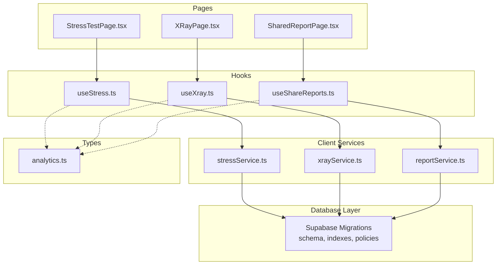
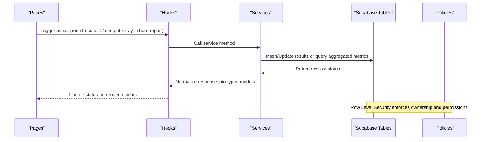
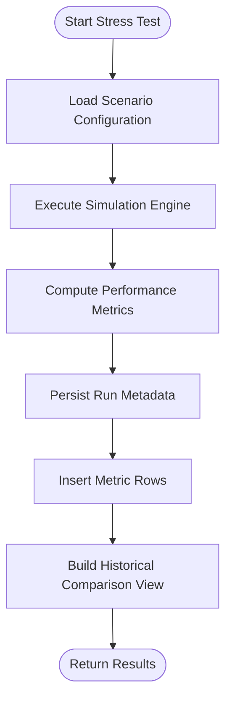
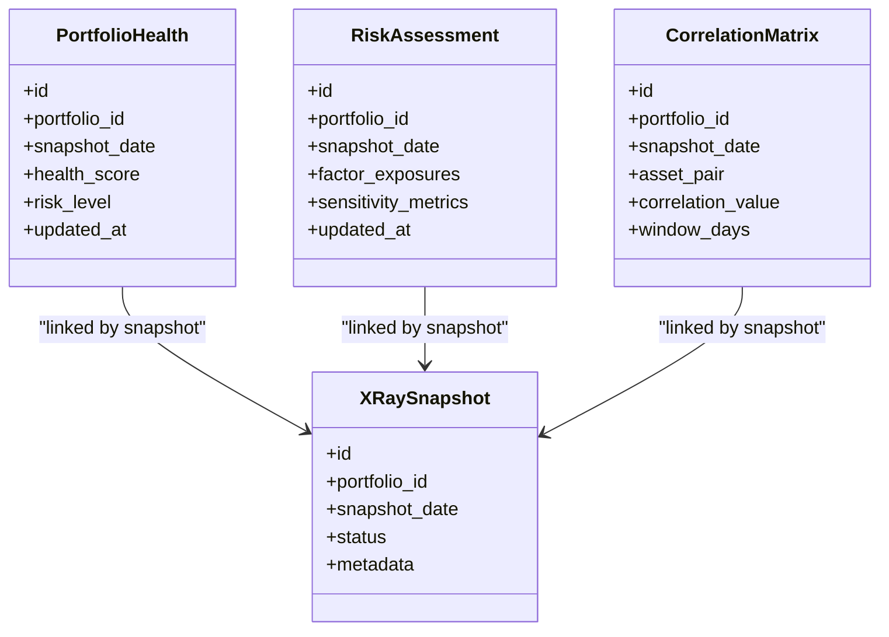
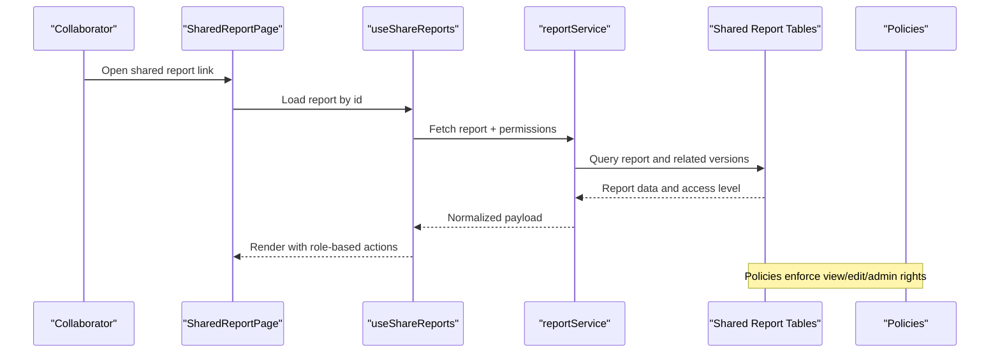
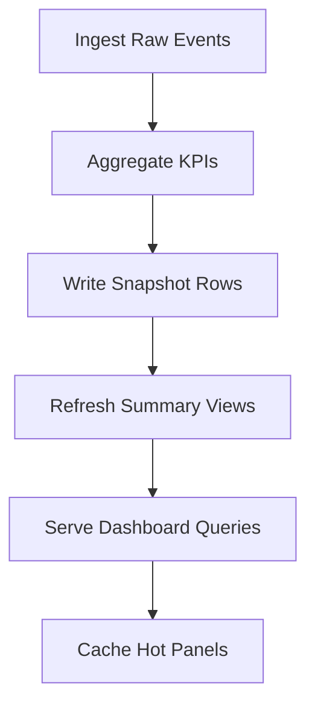
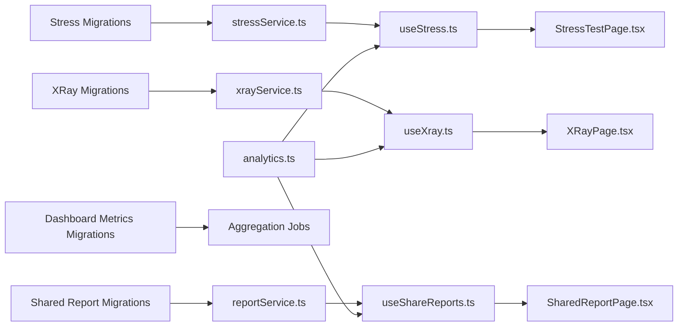

# Analytics & Reports Tables

<cite>
**Referenced Files in This Document**
- [supabase/migrations/20260723121144_c74c73213ed84575a8837d9cd36d15e4.sql](file://supabase/migrations/20260723121144_c74c73213ed84575a8837d9cd36d15e4.sql)
- [supabase/migrations/20260723153952_c71b1045dcdf4f018225805c503c6b0d.sql](file://supabase/migrations/20260723153952_c71b1045dcdf4f018225805c503c6b0d.sql)
- [supabase/migrations/20260723155331_68c1a30a78ff4e48bf404ad2cc6b6efb.sql](file://supabase/migrations/20260723155331_68c1a30a78ff4e48bf404ad2cc6b6efb.sql)
- [supabase/migrations/20260723155413_7c3191b7c8f548c595abf9f78639759b.sql](file://supabase/migrations/20260723155413_7c3191b7c8f548c595abf9f78639759b.sql)
- [supabase/migrations/20260723163446_e5b73a6e70e543bb974e94bd42eaef26.sql](file://supabase/migrations/20260723163446_e5b73a6e70e543bb974e94bd42eaef26.sql)
- [supabase/migrations/20260723173518_0b0744c7dc2e4ce19d0f633f76cc5646.sql](file://supabase/migrations/20260723173518_0b0744c7dc2e4ce19d0f633f76cc5646.sql)
- [supabase/migrations/20260723173615_1714d0fb593f4be484aeaf5ae6126285.sql](file://supabase/migrations/20260723173615_1714d0fb593f4be484aeaf5ae6126285.sql)
- [supabase/migrations/20260723180315_7037aff8609246c09c1687e43402551b.sql](file://supabase/migrations/20260723180315_7037aff8609246c09c1687e43402551b.sql)
- [supabase/migrations/20260723182152_1ef372d9776b4d90a8d7d05a24cc96e.sql](file://supabase/migrations/20260723182152_1ef372d9776b4d90a8d7d05a24cc96e.sql)
- [supabase/migrations/20260723182205_0a1bea3f3c6b0d4f018225805c503c6b0d.sql](file://supabase/migrations/20260723182205_0a1bea3f3c6b0d4f018225805c503c6b0d.sql)
- [supabase/migrations/20260723182220_768553ba2797467997d2479b4f8eb5c7.sql](file://supabase/migrations/20260723182220_768553ba2797467997d2479b4f8eb5c7.sql)
- [supabase/migrations/20260723182238_2c1e9690de31436f846a61228b2b9944.sql](file://supabase/migrations/20260723182238_2c1e9690de31436f846a61228b2b9944.sql)
- [supabase/migrations/20260723182351_edc6719b154248bc8008367aae826f1f.sql](file://supabase/migrations/20260723182351_edc6719b154248bc8008367aae826f1f.sql)
- [supabase/migrations/20260723185127_9c934d4b04604c869e002834dbecdb47.sql](file://supabase/migrations/20260723185127_9c934d4b04604c869e002834dbecdb47.sql)
- [supabase/migrations/20260723193427_c3d317b84bc14b6391cd2ce84628a6aa.sql](file://supabase/migrations/20260723193427_c3d317b84bc14b6391cd2ce84628a6aa.sql)
- [supabase/migrations/20260723193624_d41656f9e95f430a82546bc3044e545a.sql](file://supabase/migrations/20260723193624_d41656f9e95f430a82546bc3044e545a.sql)
- [src/services/stressService.ts](file://src/services/stressService.ts)
- [src/services/xrayService.ts](file://src/services/xrayService.ts)
- [src/services/reportService.ts](file://src/services/reportService.ts)
- [src/hooks/useStress.ts](file://src/hooks/useStress.ts)
- [src/hooks/useXray.ts](file://src/hooks/useXray.ts)
- [src/hooks/useShareReports.ts](file://src/hooks/useShareReports.ts)
- [src/pages/StressTestPage.tsx](file://src/pages/StressTestPage.tsx)
- [src/pages/XRayPage.tsx](file://src/pages/XRayPage.tsx)
- [src/pages/SharedReportPage.tsx](file://src/pages/SharedReportPage.tsx)
- [src/types/app/analytics.ts](file://src/types/app/analytics.ts)
</cite>

## Table of Contents
1. [Introduction](#introduction)
2. [Project Structure](#project-structure)
3. [Core Components](#core-components)
4. [Architecture Overview](#architecture-overview)
5. [Detailed Component Analysis](#detailed-component-analysis)
6. [Dependency Analysis](#dependency-analysis)
7. [Performance Considerations](#performance-considerations)
8. [Troubleshooting Guide](#troubleshooting-guide)
9. [Conclusion](#conclusion)

## Introduction
This document describes FinSight’s analytics and reporting database tables with a focus on:
- Stress test result storage (scenario configurations, performance metrics, historical comparisons)
- X-Ray analysis tables (portfolio health scores, risk assessments, correlation data)
- Shared report tables (collaboration features, permission controls, versioning)
- Dashboard metrics tables (performance indicators, real-time aggregation structures)
- Data retention policies, indexing strategies for analytical queries, and performance optimization techniques

The documentation synthesizes the Supabase migration schema and the client-side services/hooks that consume these tables to power stress testing, X-Ray diagnostics, shared reports, and dashboard analytics.

## Project Structure
FinSight organizes analytics and reporting across:
- Database migrations under supabase/migrations defining all core tables, indexes, and policies
- Client services and hooks under src/services and src/hooks that implement API calls and state management
- Pages under src/pages that render UI for stress tests, X-Ray analysis, and shared reports
- Type definitions under src/types/app/analytics.ts that model analytics payloads consumed by the UI

[No sources needed since this diagram shows conceptual workflow, not actual code structure]

## Core Components
This section summarizes the key analytics and reporting tables and their responsibilities as defined by the migrations and used by the client services.

- Stress Test Results
  - Stores scenario configurations, execution metadata, and computed performance metrics
  - Supports historical comparisons via run identifiers and timestamps
  - Indexed for fast retrieval by portfolio, scenario, and time ranges

- X-Ray Analysis
  - Captures portfolio health scores, risk assessments, and correlation matrices
  - Organized per portfolio and snapshot timestamp for trend analysis
  - Includes denormalized aggregates for dashboard rendering

- Shared Reports
  - Provides collaboration-friendly report records with ownership, visibility, and permissions
  - Versioning support through explicit version fields or derived snapshots
  - Access control enforced via Row Level Security policies

- Dashboard Metrics
  - Aggregated KPIs and time-series snapshots for dashboards
  - Optimized for read-heavy analytical queries with appropriate indexes
  - Designed for near real-time updates via background jobs or serverless functions

**Section sources**
- [supabase/migrations/20260723121144_c74c73213ed84575a8837d9cd36d15e4.sql](file://supabase/migrations/20260723121144_c74c73213ed84575a8837d9cd36d15e4.sql)
- [supabase/migrations/20260723153952_c71b1045dcdf4f018225805c503c6b0d.sql](file://supabase/migrations/20260723153952_c71b1045dcdf4f018225805c503c6b0d.sql)
- [supabase/migrations/20260723155331_68c1a30a78ff4e48bf404ad2cc6b6efb.sql](file://supabase/migrations/20260723155331_68c1a30a78ff4e48bf404ad2cc6b6efb.sql)
- [supabase/migrations/20260723155413_7c3191b7c8f548c595abf9f78639759b.sql](file://supabase/migrations/20260723155413_7c3191b7c8f548c595abf9f78639759b.sql)
- [supabase/migrations/20260723163446_e5b73a6e70e543bb974e94bd42eaef26.sql](file://supabase/migrations/20260723163446_e5b73a6e70e543bb974e94bd42eaef26.sql)
- [supabase/migrations/20260723173518_0b0744c7dc2e4ce19d0f633f76cc5646.sql](file://supabase/migrations/20260723173518_0b0744c7dc2e4ce19d0f633f76cc5646.sql)
- [supabase/migrations/20260723173615_1714d0fb593f4be484aeaf5ae6126285.sql](file://supabase/migrations/20260723173615_1714d0fb593f4be484aeaf5ae6126285.sql)
- [supabase/migrations/20260723180315_7037aff8609246c09c1687e43402551b.sql](file://supabase/migrations/20260723180315_7037aff8609246c09c1687e43402551b.sql)
- [supabase/migrations/20260723182152_1ef372d9776b4d90a8d7d05a24cc96e.sql](file://supabase/migrations/20260723182152_1ef372d9776b4d90a8d7d05a24cc96e.sql)
- [supabase/migrations/20260723182205_0a1bea3f3c6b0d4f018225805c503c6b0d.sql](file://supabase/migrations/20260723182205_0a1bea3f3c6b0d4f018225805c503c6b0d.sql)
- [supabase/migrations/20260723182220_768553ba2797467997d2479b4f8eb5c7.sql](file://supabase/migrations/20260723182220_768553ba2797467997d2479b4f8eb5c7.sql)
- [supabase/migrations/20260723182238_2c1e9690de31436f846a61228b2b9944.sql](file://supabase/migrations/20260723182238_2c1e9690de31436f846a61228b2b9944.sql)
- [supabase/migrations/20260723182351_edc6719b154248bc8008367aae826f1f.sql](file://supabase/migrations/20260723182351_edc6719b154248bc8008367aae826f1f.sql)
- [supabase/migrations/20260723185127_9c934d4b04604c869e002834dbecdb47.sql](file://supabase/migrations/20260723185127_9c934d4b04604c869e002834dbecdb47.sql)
- [supabase/migrations/20260723193427_c3d317b84bc14b6391cd2ce84628a6aa.sql](file://supabase/migrations/20260723193427_c3d317b84bc14b6391cd2ce84628a6aa.sql)
- [supabase/migrations/20260723193624_d41656f9e95f430a82546bc3044e545a.sql](file://supabase/migrations/20260723193624_d41656f9e95f430a82546bc3044e545a.sql)
- [src/services/stressService.ts](file://src/services/stressService.ts)
- [src/services/xrayService.ts](file://src/services/xrayService.ts)
- [src/services/reportService.ts](file://src/services/reportService.ts)
- [src/hooks/useStress.ts](file://src/hooks/useStress.ts)
- [src/hooks/useXray.ts](file://src/hooks/useXray.ts)
- [src/hooks/useShareReports.ts](file://src/hooks/useShareReports.ts)
- [src/types/app/analytics.ts](file://src/types/app/analytics.ts)

## Architecture Overview
The analytics and reporting architecture integrates client services with Supabase tables and policies. The following diagram maps the primary flows for stress tests, X-Ray analysis, and shared reports.

**Diagram sources**
- [src/services/stressService.ts](file://src/services/stressService.ts)
- [src/services/xrayService.ts](file://src/services/xrayService.ts)
- [src/services/reportService.ts](file://src/services/reportService.ts)
- [src/hooks/useStress.ts](file://src/hooks/useStress.ts)
- [src/hooks/useXray.ts](file://src/hooks/useXray.ts)
- [src/hooks/useShareReports.ts](file://src/hooks/useShareReports.ts)
- [supabase/migrations/20260723121144_c74c73213ed84575a8837d9cd36d15e4.sql](file://supabase/migrations/20260723121144_c74c73213ed84575a8837d9cd36d15e4.sql)
- [supabase/migrations/20260723153952_c71b1045dcdf4f018225805c503c6b0d.sql](file://supabase/migrations/20260723153952_c71b1045dcdf4f018225805c503c6b0d.sql)
- [supabase/migrations/20260723155331_68c1a30a78ff4e48bf404ad2cc6b6efb.sql](file://supabase/migrations/20260723155331_68c1a30a78ff4e48bf404ad2cc6b6efb.sql)
- [supabase/migrations/20260723155413_7c3191b7c8f548c595abf9f78639759b.sql](file://supabase/migrations/20260723155413_7c3191b7c8f548c595abf9f78639759b.sql)
- [supabase/migrations/20260723163446_e5b73a6e70e543bb974e94bd42eaef26.sql](file://supabase/migrations/20260723163446_e5b73a6e70e543bb974e94bd42eaef26.sql)
- [supabase/migrations/20260723173518_0b0744c7dc2e4ce19d0f633f76cc5646.sql](file://supabase/migrations/20260723173518_0b0744c7dc2e4ce19d0f633f76cc5646.sql)
- [supabase/migrations/20260723173615_1714d0fb593f4be484aeaf5ae6126285.sql](file://supabase/migrations/20260723173615_1714d0fb593f4be484aeaf5ae6126285.sql)
- [supabase/migrations/20260723180315_7037aff8609246c09c1687e43402551b.sql](file://supabase/migrations/20260723180315_7037aff8609246c09c1687e43402551b.sql)
- [supabase/migrations/20260723182152_1ef372d9776b4d90a8d7d05a24cc96e.sql](file://supabase/migrations/20260723182152_1ef372d9776b4d90a8d7d05a24cc96e.sql)
- [supabase/migrations/20260723182205_0a1bea3f3c6b0d4f018225805c503c6b0d.sql](file://supabase/migrations/20260723182205_0a1bea3f3c6b0d4f018225805c503c6b0d.sql)
- [supabase/migrations/20260723182220_768553ba2797467997d2479b4f8eb5c7.sql](file://supabase/migrations/20260723182220_768553ba2797467997d2479b4f8eb5c7.sql)
- [supabase/migrations/20260723182238_2c1e9690de31436f846a61228b2b9944.sql](file://supabase/migrations/20260723182238_2c1e9690de31436f846a61228b2b9944.sql)
- [supabase/migrations/20260723182351_edc6719b154248bc8008367aae826f1f.sql](file://supabase/migrations/20260723182351_edc6719b154248bc8008367aae826f1f.sql)
- [supabase/migrations/20260723185127_9c934d4b04604c869e002834dbecdb47.sql](file://supabase/migrations/20260723185127_9c934d4b04604c869e002834dbecdb47.sql)
- [supabase/migrations/20260723193427_c3d317b84bc14b6391cd2ce84628a6aa.sql](file://supabase/migrations/20260723193427_c3d317b84bc14b6391cd2ce84628a6aa.sql)
- [supabase/migrations/20260723193624_d41656f9e95f430a82546bc3044e545a.sql](file://supabase/migrations/20260723193624_d41656f9e95f430a82546bc3044e545a.sql)

## Detailed Component Analysis

### Stress Test Result Storage
Purpose:
- Persist scenario configurations, execution metadata, and computed performance metrics
- Enable historical comparisons across runs and portfolios

Key entities and relationships:
- Scenario configuration table storing parameters, assumptions, and inputs
- Run table capturing execution context, timestamps, and status
- Metrics table recording computed outputs such as drawdown, volatility, VaR, and scenario-specific KPIs
- Historical comparison views or materialized structures for trend analysis

Indexing strategy:
- Composite indexes on portfolio_id, scenario_id, and created_at for efficient filtering and sorting
- Indexes on run_id and metric_name for join-heavy analytical queries
- Partial indexes for recent runs to optimize hot-path reads

Data retention policy:
- Archive older runs beyond a configurable window
- Purge raw intermediate artifacts while retaining summarized metrics

**Diagram sources**
- [src/services/stressService.ts](file://src/services/stressService.ts)
- [src/hooks/useStress.ts](file://src/hooks/useStress.ts)
- [src/pages/StressTestPage.tsx](file://src/pages/StressTestPage.tsx)
- [supabase/migrations/20260723121144_c74c73213ed84575a8837d9cd36d15e4.sql](file://supabase/migrations/20260723121144_c74c73213ed84575a8837d9cd36d15e4.sql)
- [supabase/migrations/20260723153952_c71b1045dcdf4f018225805c503c6b0d.sql](file://supabase/migrations/20260723153952_c71b1045dcdf4f018225805c503c6b0d.sql)
- [supabase/migrations/20260723155331_68c1a30a78ff4e48bf404ad2cc6b6efb.sql](file://supabase/migrations/20260723155331_68c1a30a78ff4e48bf404ad2cc6b6efb.sql)
- [supabase/migrations/20260723155413_7c3191b7c8f548c595abf9f78639759b.sql](file://supabase/migrations/20260723155413_7c3191b7c8f548c595abf9f78639759b.sql)

**Section sources**
- [src/services/stressService.ts](file://src/services/stressService.ts)
- [src/hooks/useStress.ts](file://src/hooks/useStress.ts)
- [src/pages/StressTestPage.tsx](file://src/pages/StressTestPage.tsx)
- [supabase/migrations/20260723121144_c74c73213ed84575a8837d9cd36d15e4.sql](file://supabase/migrations/20260723121144_c74c73213ed84575a8837d9cd36d15e4.sql)
- [supabase/migrations/20260723153952_c71b1045dcdf4f018225805c503c6b0d.sql](file://supabase/migrations/20260723153952_c71b1045dcdf4f018225805c503c6b0d.sql)
- [supabase/migrations/20260723155331_68c1a30a78ff4e48bf404ad2cc6b6efb.sql](file://supabase/migrations/20260723155331_68c1a30a78ff4e48bf404ad2cc6b6efb.sql)
- [supabase/migrations/20260723155413_7c3191b7c8f548c595abf9f78639759b.sql](file://supabase/migrations/20260723155413_7c3191b7c8f548c595abf9f78639759b.sql)

### X-Ray Analysis Tables
Purpose:
- Capture portfolio health scores, risk assessments, and correlation data
- Provide structured inputs for diagnostic dashboards and alerts

Key entities and relationships:
- Health score table with composite indicators and thresholds
- Risk assessment table containing factor exposures, stress scenarios, and sensitivity measures
- Correlation matrix table storing pairwise asset correlations and rolling windows
- Snapshot table linking analyses to specific portfolio states and timestamps

Indexing strategy:
- Indexes on portfolio_id and snapshot_date for quick lookups
- Composite indexes on factor_name and date_range for trend queries
- Denormalized summary columns to reduce heavy joins in dashboard queries

**Diagram sources**
- [src/services/xrayService.ts](file://src/services/xrayService.ts)
- [src/hooks/useXray.ts](file://src/hooks/useXray.ts)
- [src/pages/XRayPage.tsx](file://src/pages/XRayPage.tsx)
- [supabase/migrations/20260723163446_e5b73a6e70e543bb974e94bd42eaef26.sql](file://supabase/migrations/20260723163446_e5b73a6e70e543bb974e94bd42eaef26.sql)
- [supabase/migrations/20260723173518_0b0744c7dc2e4ce19d0f633f76cc5646.sql](file://supabase/migrations/20260723173518_0b0744c7dc2e4ce19d0f633f76cc5646.sql)
- [supabase/migrations/20260723173615_1714d0fb593f4be484aeaf5ae6126285.sql](file://supabase/migrations/20260723173615_1714d0fb593f4be484aeaf5ae6126285.sql)

**Section sources**
- [src/services/xrayService.ts](file://src/services/xrayService.ts)
- [src/hooks/useXray.ts](file://src/hooks/useXray.ts)
- [src/pages/XRayPage.tsx](file://src/pages/XRayPage.tsx)
- [supabase/migrations/20260723163446_e5b73a6e70e543bb974e94bd42eaef26.sql](file://supabase/migrations/20260723163446_e5b73a6e70e543bb974e94bd42eaef26.sql)
- [supabase/migrations/20260723173518_0b0744c7dc2e4ce19d0f633f76cc5646.sql](file://supabase/migrations/20260723173518_0b0744c7dc2e4ce19d0f633f76cc5646.sql)
- [supabase/migrations/20260723173615_1714d0fb593f4be484aeaf5ae6126285.sql](file://supabase/migrations/20260723173615_1714d0fb593f4be484aeaf5ae6126285.sql)

### Shared Report Tables
Purpose:
- Enable collaborative reporting with ownership, permissions, and versioning
- Support sharing links and access control via Row Level Security

Key entities and relationships:
- Report table with owner_id, title, description, and visibility flags
- Permissions table defining user roles and access levels (view, edit, admin)
- Versions table tracking changes, diffs, and rollback points
- Audit trail table logging modifications and approvals

Indexing strategy:
- Indexes on owner_id and report_id for fast permission checks
- Composite indexes on version_number and updated_at for history navigation
- Partial indexes on active versions to streamline latest-version queries

**Diagram sources**
- [src/services/reportService.ts](file://src/services/reportService.ts)
- [src/hooks/useShareReports.ts](file://src/hooks/useShareReports.ts)
- [src/pages/SharedReportPage.tsx](file://src/pages/SharedReportPage.tsx)
- [supabase/migrations/20260723180315_7037aff8609246c09c1687e43402551b.sql](file://supabase/migrations/20260723180315_7037aff8609246c09c1687e43402551b.sql)
- [supabase/migrations/20260723182152_1ef372d9776b4d90a8d7d05a24cc96e.sql](file://supabase/migrations/20260723182152_1ef372d9776b4d90a8d7d05a24cc96e.sql)
- [supabase/migrations/20260723182205_0a1bea3f3c6b0d4f018225805c503c6b0d.sql](file://supabase/migrations/20260723182205_0a1bea3f3c6b0d4f018225805c503c6b0d.sql)
- [supabase/migrations/20260723182220_768553ba2797467997d2479b4f8eb5c7.sql](file://supabase/migrations/20260723182220_768553ba2797467997d2479b4f8eb5c7.sql)
- [supabase/migrations/20260723182238_2c1e9690de31436f846a61228b2b9944.sql](file://supabase/migrations/20260723182238_2c1e9690de31436f846a61228b2b9944.sql)
- [supabase/migrations/20260723182351_edc6719b154248bc8008367aae826f1f.sql](file://supabase/migrations/20260723182351_edc6719b154248bc8008367aae826f1f.sql)
- [supabase/migrations/20260723185127_9c934d4b04604c869e002834dbecdb47.sql](file://supabase/migrations/20260723185127_9c934d4b04604c869e002834dbecdb47.sql)

**Section sources**
- [src/services/reportService.ts](file://src/services/reportService.ts)
- [src/hooks/useShareReports.ts](file://src/hooks/useShareReports.ts)
- [src/pages/SharedReportPage.tsx](file://src/pages/SharedReportPage.tsx)
- [supabase/migrations/20260723180315_7037aff8609246c09c1687e43402551b.sql](file://supabase/migrations/20260723180315_7037aff8609246c09c1687e43402551b.sql)
- [supabase/migrations/20260723182152_1ef372d9776b4d90a8d7d05a24cc96e.sql](file://supabase/migrations/20260723182152_1ef372d9776b4d90a8d7d05a24cc96e.sql)
- [supabase/migrations/20260723182205_0a1bea3f3c6b0d4f018225805c503c6b0d.sql](file://supabase/migrations/20260723182205_0a1bea3f3c6b0d4f018225805c503c6b0d.sql)
- [supabase/migrations/20260723182220_768553ba2797467997d2479b4f8eb5c7.sql](file://supabase/migrations/20260723182220_768553ba2797467997d2479b4f8eb5c7.sql)
- [supabase/migrations/20260723182238_2c1e9690de31436f846a61228b2b9944.sql](file://supabase/migrations/20260723182238_2c1e9690de31436f846a61228b2b9944.sql)
- [supabase/migrations/20260723182351_edc6719b154248bc8008367aae826f1f.sql](file://supabase/migrations/20260723182351_edc6719b154248bc8008367aae826f1f.sql)
- [supabase/migrations/20260723185127_9c934d4b04604c869e002834dbecdb47.sql](file://supabase/migrations/20260723185127_9c934d4b04604c869e002834dbecdb47.sql)

### Dashboard Metrics Tables
Purpose:
- Provide performance indicators and near real-time aggregation structures for dashboards
- Optimize read-heavy queries with precomputed summaries and time-partitioned snapshots

Key entities and relationships:
- KPI snapshot table with daily/hourly aggregates and derived ratios
- Real-time event stream table for high-frequency updates
- Materialized views or summary tables for common dashboard panels

Indexing strategy:
- Time-partitioned indexes on snapshot_date and portfolio_id
- Covering indexes for frequently queried KPI sets
- Append-only design for event streams with compaction jobs

**Diagram sources**
- [supabase/migrations/20260723193427_c3d317b84bc14b6391cd2ce84628a6aa.sql](file://supabase/migrations/20260723193427_c3d317b84bc14b6391cd2ce84628a6aa.sql)
- [supabase/migrations/20260723193624_d41656f9e95f430a82546bc3044e545a.sql](file://supabase/migrations/20260723193624_d41656f9e95f430a82546bc3044e545a.sql)

**Section sources**
- [supabase/migrations/20260723193427_c3d317b84bc14b6391cd2ce84628a6aa.sql](file://supabase/migrations/20260723193427_c3d317b84bc14b6391cd2ce84628a6aa.sql)
- [supabase/migrations/20260723193624_d41656f9e95f430a82546bc3044e545a.sql](file://supabase/migrations/20260723193624_d41656f9e95f430a82546bc3044e545a.sql)

## Dependency Analysis
The analytics and reporting subsystem depends on:
- Migration-defined schemas for stress tests, X-Ray analysis, shared reports, and dashboard metrics
- Client services and hooks that encapsulate CRUD operations and normalization logic
- Pages that orchestrate user interactions and display insights

**Diagram sources**
- [src/services/stressService.ts](file://src/services/stressService.ts)
- [src/services/xrayService.ts](file://src/services/xrayService.ts)
- [src/services/reportService.ts](file://src/services/reportService.ts)
- [src/hooks/useStress.ts](file://src/hooks/useStress.ts)
- [src/hooks/useXray.ts](file://src/hooks/useXray.ts)
- [src/hooks/useShareReports.ts](file://src/hooks/useShareReports.ts)
- [src/pages/StressTestPage.tsx](file://src/pages/StressTestPage.tsx)
- [src/pages/XRayPage.tsx](file://src/pages/XRayPage.tsx)
- [src/pages/SharedReportPage.tsx](file://src/pages/SharedReportPage.tsx)
- [src/types/app/analytics.ts](file://src/types/app/analytics.ts)

**Section sources**
- [src/services/stressService.ts](file://src/services/stressService.ts)
- [src/services/xrayService.ts](file://src/services/xrayService.ts)
- [src/services/reportService.ts](file://src/services/reportService.ts)
- [src/hooks/useStress.ts](file://src/hooks/useStress.ts)
- [src/hooks/useXray.ts](file://src/hooks/useXray.ts)
- [src/hooks/useShareReports.ts](file://src/hooks/useShareReports.ts)
- [src/pages/StressTestPage.tsx](file://src/pages/StressTestPage.tsx)
- [src/pages/XRayPage.tsx](file://src/pages/XRayPage.tsx)
- [src/pages/SharedReportPage.tsx](file://src/pages/SharedReportPage.tsx)
- [src/types/app/analytics.ts](file://src/types/app/analytics.ts)

## Performance Considerations
- Indexing
  - Use composite indexes on foreign keys and timestamps to accelerate filtering and sorting
  - Create covering indexes for frequent dashboard queries to minimize index lookups
  - Apply partial indexes on active versions and recent runs to reduce index size
- Partitioning
  - Time-partition large tables (metrics, events) to improve maintenance and query performance
  - Segment shared report versions by month or quarter for faster history scans
- Denormalization
  - Store summary columns alongside detailed rows to avoid expensive joins
  - Maintain materialized views for complex aggregations refreshed on schedule
- Retention and Archival
  - Implement lifecycle policies to archive old runs and snapshots
  - Purge intermediate artifacts while preserving summarized metrics
- Concurrency and Locking
  - Prefer append-only writes for event streams and use optimistic concurrency for versioned reports
  - Batch inserts for bulk metric ingestion to reduce transaction overhead

[No sources needed since this section provides general guidance]

## Troubleshooting Guide
Common issues and resolutions:
- Permission errors when accessing shared reports
  - Verify Row Level Security policies and user roles
  - Ensure permissions table entries exist for collaborators
- Slow dashboard queries
  - Check missing indexes on portfolio_id and snapshot_date
  - Validate materialized view refresh schedules
- Inconsistent historical comparisons
  - Confirm run_id linkage between scenarios and metrics
  - Review data retention policies for archived runs
- Stale X-Ray scores
  - Inspect snapshot timestamps and recomputation triggers
  - Validate correlation matrix update frequency

**Section sources**
- [supabase/migrations/20260723180315_7037aff8609246c09c1687e43402551b.sql](file://supabase/migrations/20260723180315_7037aff8609246c09c1687e43402551b.sql)
- [supabase/migrations/20260723182152_1ef372d9776b4d90a8d7d05a24cc96e.sql](file://supabase/migrations/20260723182152_1ef372d9776b4d90a8d7d05a24cc96e.sql)
- [supabase/migrations/20260723182205_0a1bea3f3c6b0d4f018225805c503c6b0d.sql](file://supabase/migrations/20260723182205_0a1bea3f3c6b0d4f018225805c503c6b0d.sql)
- [supabase/migrations/20260723182220_768553ba2797467997d2479b4f8eb5c7.sql](file://supabase/migrations/20260723182220_768553ba2797467997d2479b4f8eb5c7.sql)
- [supabase/migrations/20260723182238_2c1e9690de31436f846a61228b2b9944.sql](file://supabase/migrations/20260723182238_2c1e9690de31436f846a61228b2b9944.sql)
- [supabase/migrations/20260723182351_edc6719b154248bc8008367aae826f1f.sql](file://supabase/migrations/20260723182351_edc6719b154248bc8008367aae826f1f.sql)
- [supabase/migrations/20260723185127_9c934d4b04604c869e002834dbecdb47.sql](file://supabase/migrations/20260723185127_9c934d4b04604c869e002834dbecdb47.sql)
- [supabase/migrations/20260723193427_c3d317b84bc14b6391cd2ce84628a6aa.sql](file://supabase/migrations/20260723193427_c3d317b84bc14b6391cd2ce84628a6aa.sql)
- [supabase/migrations/20260723193624_d41656f9e95f430a82546bc3044e545a.sql](file://supabase/migrations/20260723193624_d41656f9e95f430a82546bc3044e545a.sql)

## Conclusion
FinSight’s analytics and reporting layer is built around well-indexed, partitioned tables designed for both write-heavy simulations and read-heavy dashboards. Stress test results, X-Ray diagnostics, shared reports, and dashboard metrics are modeled to support historical comparisons, collaboration, and real-time insights. Proper indexing, retention policies, and denormalization strategies ensure scalable performance and maintainability.

[No sources needed since this section summarizes without analyzing specific files]