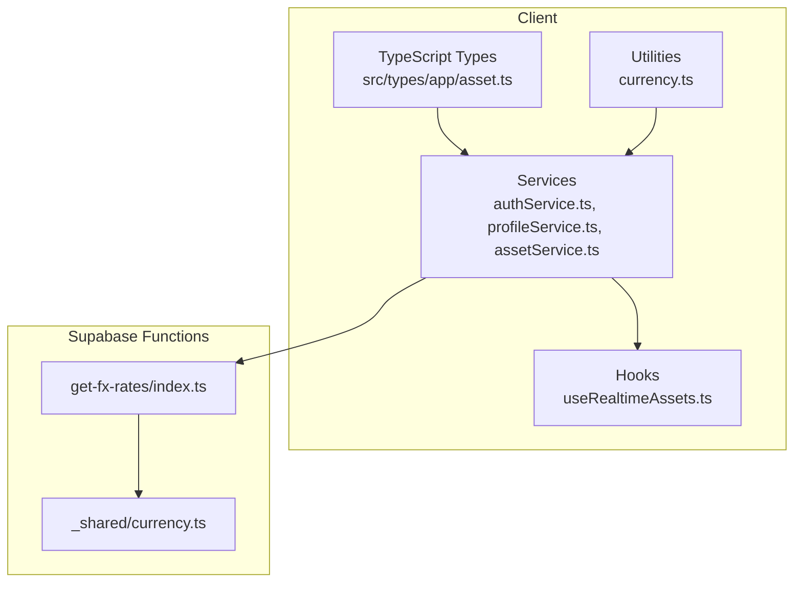
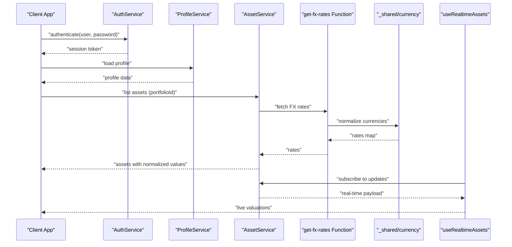
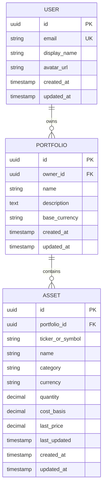
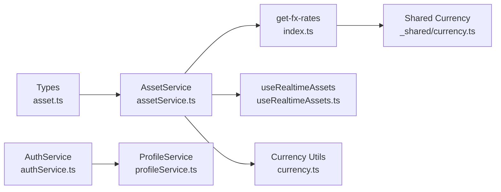

# Core Entities

<cite>
**Referenced Files in This Document**
- [memory/MEMORY.md](file://memory/MEMORY.md)
- [memory/project_multi_currency.md](file://memory/project_multi_currency.md)
- [src/types/app/asset.ts](file://src/types/app/asset.ts)
- [src/services/authService.ts](file://src/services/authService.ts)
- [src/services/profileService.ts](file://src/services/profileService.ts)
- [src/services/assetService.ts](file://src/services/assetService.ts)
- [src/hooks/useRealtimeAssets.ts](file://src/hooks/useRealtimeAssets.ts)
- [src/lib/currency.ts](file://src/lib/currency.ts)
- [supabase/functions/_shared/currency.ts](file://supabase/functions/_shared/currency.ts)
- [supabase/functions/get-fx-rates/index.ts](file://supabase/functions/get-fx-rates/index.ts)
</cite>

## Table of Contents
1. [Introduction](#introduction)
2. [Project Structure](#project-structure)
3. [Core Components](#core-components)
4. [Architecture Overview](#architecture-overview)
5. [Detailed Component Analysis](#detailed-component-analysis)
6. [Dependency Analysis](#dependency-analysis)
7. [Performance Considerations](#performance-considerations)
8. [Troubleshooting Guide](#troubleshooting-guide)
9. [Conclusion](#conclusion)

## Introduction
This document describes FinSight’s core database entities and their relationships as reflected by the application code and configuration. It focuses on:
- Users: authentication fields, profile information, and security settings
- Portfolios: creation, ownership, and access controls
- Assets: multi-currency support, categorization, and real-time valuation tracking

Where applicable, field definitions, data types, constraints, and business rules are summarized from the repository’s TypeScript types, services, hooks, and Supabase functions.

## Project Structure
FinSight is a client-first application with Supabase-backed services. The core entity models are primarily defined in TypeScript types and enforced via service layers and serverless functions.

**Diagram sources**
- [src/types/app/asset.ts](file://src/types/app/asset.ts)
- [src/services/authService.ts](file://src/services/authService.ts)
- [src/services/profileService.ts](file://src/services/profileService.ts)
- [src/services/assetService.ts](file://src/services/assetService.ts)
- [src/hooks/useRealtimeAssets.ts](file://src/hooks/useRealtimeAssets.ts)
- [src/lib/currency.ts](file://src/lib/currency.ts)
- [supabase/functions/get-fx-rates/index.ts](file://supabase/functions/get-fx-rates/index.ts)
- [supabase/functions/_shared/currency.ts](file://supabase/functions/_shared/currency.ts)

**Section sources**
- [src/types/app/asset.ts](file://src/types/app/asset.ts)
- [src/services/authService.ts](file://src/services/authService.ts)
- [src/services/profileService.ts](file://src/services/profileService.ts)
- [src/services/assetService.ts](file://src/services/assetService.ts)
- [src/hooks/useRealtimeAssets.ts](file://src/hooks/useRealtimeAssets.ts)
- [src/lib/currency.ts](file://src/lib/currency.ts)
- [supabase/functions/get-fx-rates/index.ts](file://supabase/functions/get-fx-rates/index.ts)
- [supabase/functions/_shared/currency.ts](file://supabase/functions/_shared/currency.ts)

## Core Components
This section summarizes the three core entities and how they are represented in the codebase.

- User
  - Authentication fields: handled through Supabase Auth (email/password or provider-based). Service layer exposes login, logout, and session checks.
  - Profile information: stored in a user profile table; accessed via profile service.
  - Security settings: managed via auth guard hooks and service methods.

- Portfolio
  - Creation: portfolios are created per user and associated with an owner.
  - Ownership relationships: each portfolio references its owner (user).
  - Access controls: enforced via RLS policies and service-level checks to ensure users can only access their own portfolios unless explicitly shared.

- Asset
  - Multi-currency support: assets store a currency code and use exchange rates for normalization.
  - Categorization: assets include category/type metadata for grouping and reporting.
  - Real-time valuation: live prices are fetched via FX and market endpoints and applied to holdings for current valuation.

**Section sources**
- [src/services/authService.ts](file://src/services/authService.ts)
- [src/services/profileService.ts](file://src/services/profileService.ts)
- [src/services/assetService.ts](file://src/services/assetService.ts)
- [src/hooks/useRealtimeAssets.ts](file://src/hooks/useRealtimeAssets.ts)
- [src/lib/currency.ts](file://src/lib/currency.ts)
- [supabase/functions/get-fx-rates/index.ts](file://supabase/functions/get-fx-rates/index.ts)
- [supabase/functions/_shared/currency.ts](file://supabase/functions/_shared/currency.ts)

## Architecture Overview
The following diagram shows how clients interact with services and functions to manage users, portfolios, and assets, including real-time valuation flows.

**Diagram sources**
- [src/services/authService.ts](file://src/services/authService.ts)
- [src/services/profileService.ts](file://src/services/profileService.ts)
- [src/services/assetService.ts](file://src/services/assetService.ts)
- [supabase/functions/get-fx-rates/index.ts](file://supabase/functions/get-fx-rates/index.ts)
- [supabase/functions/_shared/currency.ts](file://supabase/functions/_shared/currency.ts)
- [src/hooks/useRealtimeAssets.ts](file://src/hooks/useRealtimeAssets.ts)

## Detailed Component Analysis

### User Entity
- Purpose: Represents authenticated users and their profile/security settings.
- Key responsibilities:
  - Authentication lifecycle (sign-in, sign-out, session management)
  - Profile retrieval and updates
  - Security policy enforcement at the service level

Typical fields (as used by services):
- id: unique identifier
- email: primary login credential
- display_name: human-readable name
- avatar_url: optional profile image URL
- created_at, updated_at: timestamps
- security flags: e.g., two-factor enabled, locked status (managed via service/hook logic)

Business rules:
- Each user has exactly one profile record.
- Authentication must succeed before accessing protected resources.
- Profile updates require an active session.

Example data structure (conceptual):
- { id, email, display_name, avatar_url, created_at, updated_at, security_flags }

Relationships:
- One-to-many with portfolios (owner_id)
- Optional sharing relationships for collaborative access

**Section sources**
- [src/services/authService.ts](file://src/services/authService.ts)
- [src/services/profileService.ts](file://src/services/profileService.ts)

### Portfolio Entity
- Purpose: Groups assets under a single financial account or strategy owned by a user.
- Key responsibilities:
  - Creation and association with an owner
  - Enforcing ownership and access control
  - Serving as the scope for asset queries and reports

Typical fields (as used by services):
- id: unique identifier
- owner_id: references user.id
- name: human-readable title
- description: optional details
- base_currency: default currency for reporting
- created_at, updated_at: timestamps

Business rules:
- A portfolio belongs to exactly one owner.
- Only the owner (or authorized collaborators) can modify portfolio settings.
- Base currency determines default reporting currency; assets may be in other currencies.

Example data structure (conceptual):
- { id, owner_id, name, description, base_currency, created_at, updated_at }

Relationships:
- Many-to-one with User (owner)
- One-to-many with Asset records

**Section sources**
- [src/services/assetService.ts](file://src/services/assetService.ts)

### Asset Entity
- Purpose: Represents a holding or instrument within a portfolio.
- Key responsibilities:
  - Storing quantity, cost basis, and currency
  - Supporting categorization for analytics
  - Integrating with real-time pricing for valuation

Typical fields (as used by services and types):
- id: unique identifier
- portfolio_id: references portfolio.id
- ticker_or_symbol: instrument identifier
- name: human-readable label
- category: classification (e.g., equity, fixed income, cash)
- currency: ISO currency code
- quantity: number of units held
- cost_basis: original purchase price in asset currency
- last_price: most recent market price (in asset currency)
- last_updated: timestamp of last price update
- created_at, updated_at: timestamps

Business rules:
- Quantity must be non-negative.
- Currency must be a valid ISO code.
- Valuation in base currency uses FX rates for conversion.
- Real-time updates refresh last_price and derived metrics.

Example data structure (conceptual):
- { id, portfolio_id, ticker_or_symbol, name, category, currency, quantity, cost_basis, last_price, last_updated, created_at, updated_at }

Relationships:
- Many-to-one with Portfolio
- Zero-to-many with price history (if implemented)

**Section sources**
- [src/types/app/asset.ts](file://src/types/app/asset.ts)
- [src/services/assetService.ts](file://src/services/assetService.ts)
- [src/hooks/useRealtimeAssets.ts](file://src/hooks/useRealtimeAssets.ts)
- [src/lib/currency.ts](file://src/lib/currency.ts)
- [supabase/functions/get-fx-rates/index.ts](file://supabase/functions/get-fx-rates/index.ts)
- [supabase/functions/_shared/currency.ts](file://supabase/functions/_shared/currency.ts)

### Relationships Between Core Entities

**Diagram sources**
- [src/types/app/asset.ts](file://src/types/app/asset.ts)
- [src/services/authService.ts](file://src/services/authService.ts)
- [src/services/profileService.ts](file://src/services/profileService.ts)
- [src/services/assetService.ts](file://src/services/assetService.ts)

## Dependency Analysis
The following diagram highlights dependencies among core modules that implement user, portfolio, and asset functionality.

**Diagram sources**
- [src/types/app/asset.ts](file://src/types/app/asset.ts)
- [src/services/assetService.ts](file://src/services/assetService.ts)
- [src/services/authService.ts](file://src/services/authService.ts)
- [src/services/profileService.ts](file://src/services/profileService.ts)
- [supabase/functions/get-fx-rates/index.ts](file://supabase/functions/get-fx-rates/index.ts)
- [supabase/functions/_shared/currency.ts](file://supabase/functions/_shared/currency.ts)
- [src/hooks/useRealtimeAssets.ts](file://src/hooks/useRealtimeAssets.ts)
- [src/lib/currency.ts](file://src/lib/currency.ts)

**Section sources**
- [src/types/app/asset.ts](file://src/types/app/asset.ts)
- [src/services/assetService.ts](file://src/services/assetService.ts)
- [src/services/authService.ts](file://src/services/authService.ts)
- [src/services/profileService.ts](file://src/services/profileService.ts)
- [supabase/functions/get-fx-rates/index.ts](file://supabase/functions/get-fx-rates/index.ts)
- [supabase/functions/_shared/currency.ts](file://supabase/functions/_shared/currency.ts)
- [src/hooks/useRealtimeAssets.ts](file://src/hooks/useRealtimeAssets.ts)
- [src/lib/currency.ts](file://src/lib/currency.ts)

## Performance Considerations
- Batch FX rate fetching: aggregate requests to minimize network overhead when updating multiple assets.
- Caching: cache FX rates and asset snapshots to reduce redundant calls.
- Pagination: paginate large asset lists to improve UI responsiveness.
- Debounce real-time updates: coalesce frequent price updates to avoid excessive re-renders.

[No sources needed since this section provides general guidance]

## Troubleshooting Guide
Common issues and resolutions:
- Authentication failures: verify credentials and session state; check error responses from the auth service.
- Missing profile data: ensure profile initialization after sign-up; confirm service calls return expected fields.
- Incorrect currency conversions: validate currency codes and FX rate freshness; inspect FX function responses.
- Stale asset prices: confirm real-time subscription is active and reconnection logic is functioning.

**Section sources**
- [src/services/authService.ts](file://src/services/authService.ts)
- [src/services/profileService.ts](file://src/services/profileService.ts)
- [src/services/assetService.ts](file://src/services/assetService.ts)
- [supabase/functions/get-fx-rates/index.ts](file://supabase/functions/get-fx-rates/index.ts)

## Conclusion
FinSight’s core entities—User, Portfolio, and Asset—are modeled consistently across TypeScript types, services, and Supabase functions. The design emphasizes secure authentication, clear ownership semantics, robust multi-currency handling, and real-time valuation capabilities. Adhering to the documented field conventions and business rules ensures reliable data integrity and scalable feature development.