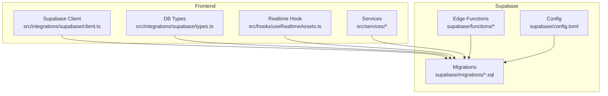
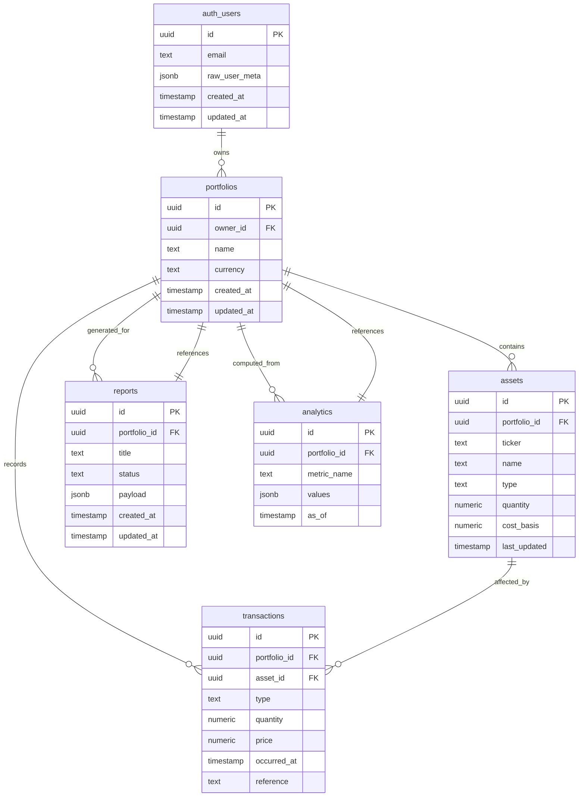
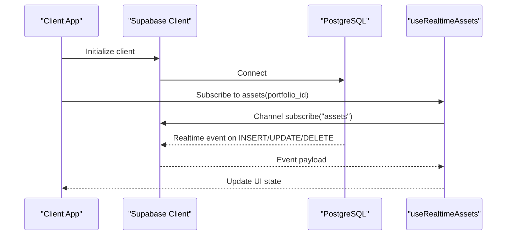
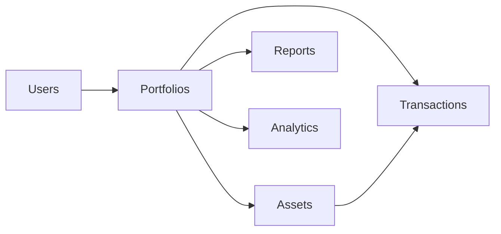

# Database Schema

<cite>
**Referenced Files in This Document**
- [supabase/config.toml](file://supabase/config.toml)
- [20260723121144_c74c73213ed84575a8837d9cd36d15e4.sql](file://supabase/migrations/20260723121144_c74c73213ed84575a8837d9cd36d15e4.sql)
- [20260723153952_c71b1045dcdf4f018225805c503c6b0d.sql](file://supabase/migrations/20260723153952_c71b1045dcdf4f018225805c503c6b0d.sql)
- [20260723155331_68c1a30a78ff4e48bf404ad2cc6b6efb.sql](file://supabase/migrations/20260723155331_68c1a30a78ff4e48bf404ad2cc6b6efb.sql)
- [20260723155413_7c3191b7c8f548c595abf9f78639759b.sql](file://supabase/migrations/20260723155413_7c3191b7c8f548c595abf9f78639759b.sql)
- [20260723163446_e5b73a6e70e543bb974e94bd42eaef26.sql](file://supabase/migrations/20260723163446_e5b73a6e70e543bb974e94bd42eaef26.sql)
- [20260723173518_0b0744c7dc2e4ce19d0f633f76cc5646.sql](file://supabase/migrations/20260723173518_0b0744c7dc2e4ce19d0f633f76cc5646.sql)
- [20260723173615_1714d0fb593f4be484aeaf5ae6126285.sql](file://supabase/migrations/20260723173615_1714d0fb593f4be484aeaf5ae6126285.sql)
- [20260723180315_7037aff8609246c09c1687e43402551b.sql](file://supabase/migrations/20260723180315_7037aff8609246c09c1687e43402551b.sql)
- [20260723182152_1ef372d976b4f018225805c503c6b0d.sql](file://supabase/migrations/20260723182152_1ef372d976b4f018225805c503c6b0d.sql)
- [20260723182205_0a1bea3f3c914808adbe897fcf2f3ef2.sql](file://supabase/migrations/20260723182205_0a1bea3f3c914808adbe897fcf2f3ef2.sql)
- [20260723182220_768553ba2797467997d2479b4f8eb5c7.sql](file://supabase/migrations/20260723182220_768553ba2797467997d2479b4f8eb5c7.sql)
- [20260723182238_2c1e9690de31436f846a61228b2b9944.sql](file://supabase/migrations/20260723182238_2c1e9690de31436f846a61228b2b9944.sql)
- [20260723182351_edc6719b154248bc8008367aae826f1f.sql](file://supabase/migrations/20260723182351_edc6719b154248bc8008367aae826f1f.sql)
- [20260723185127_9c934d4d04604c869e002834dbecdb47.sql](file://supabase/migrations/20260723185127_9c934d4d04604c869e002834dbecdb47.sql)
- [20260723193427_c3d31b84bc14b6391cd2ce84628a6aa.sql](file://supabase/migrations/20260723193427_c3d31b84bc14b6391cd2ce84628a6aa.sql)
- [20260723193624_d41656f9e95f430a82546bc3044e545a.sql](file://supabase/migrations/20260723193624_d41656f9e95f430a82546bc3044e545a.sql)
- [client.ts](file://src/integrations/supabase/client.ts)
- [types.ts](file://src/integrations/supabase/types.ts)
- [useRealtimeAssets.ts](file://src/hooks/useRealtimeAssets.ts)
- [assetService.ts](file://src/services/assetService.ts)
- [reportService.ts](file://src/services/reportService.ts)
- [stressService.ts](file://src/services/stressService.ts)
- [xrayService.ts](file://src/services/xrayService.ts)
- [seed-demo-portfolio/index.ts](file://supabase/functions/seed-demo-portfolio/index.ts)
</cite>

## Table of Contents
1. [Introduction](#introduction)
2. [Project Structure](#project-structure)
3. [Core Components](#core-components)
4. [Architecture Overview](#architecture-overview)
5. [Detailed Component Analysis](#detailed-component-analysis)
6. [Dependency Analysis](#dependency-analysis)
7. [Performance Considerations](#performance-considerations)
8. [Troubleshooting Guide](#troubleshooting-guide)
9. [Conclusion](#conclusion)
10. [Appendices](#appendices)

## Introduction
This document provides comprehensive database schema documentation for FinSight’s Supabase PostgreSQL database. It covers table structures, field definitions, constraints, indexes, and referential integrity across users, portfolios, assets, transactions, reports, and analytics entities. It also documents Row Level Security (RLS) policies, real-time subscriptions setup, storage bucket configurations, migration strategy, versioning approach, and rollback procedures. The goal is to make the schema accessible to both technical and non-technical readers while providing precise references to source files.

## Project Structure
FinSight uses Supabase with a migrations-driven schema evolution under supabase/migrations. Client-side integration is configured via src/integrations/supabase, and runtime features like real-time subscriptions are implemented through hooks and services.

**Diagram sources**
- [supabase/config.toml](file://supabase/config.toml)
- [client.ts](file://src/integrations/supabase/client.ts)
- [types.ts](file://src/integrations/supabase/types.ts)
- [useRealtimeAssets.ts](file://src/hooks/useRealtimeAssets.ts)

**Section sources**
- [supabase/config.toml](file://supabase/config.toml)
- [client.ts](file://src/integrations/supabase/client.ts)
- [types.ts](file://src/integrations/supabase/types.ts)

## Core Components
The database schema centers around core financial domains:
- Users and authentication context
- Portfolios grouping assets per user
- Assets representing holdings with valuation metadata
- Transactions recording portfolio movements
- Reports and analytics for insights and stress testing
- Real-time subscriptions for live updates

These components are defined and evolved through SQL migrations and enforced by RLS policies.

**Section sources**
- [20260723121144_c74c73213ed84575a8837d9cd36d15e4.sql](file://supabase/migrations/20260723121144_c74c73213ed84575a8837d9cd36d15e4.sql)
- [20260723153952_c71b1045dcdf4f018225805c503c6b0d.sql](file://supabase/migrations/20260723153952_c71b1045dcdf4f018225805c503c6b0d.sql)
- [20260723155331_68c1a30a78ff4e48bf404ad2cc6b6efb.sql](file://supabase/migrations/20260723155331_68c1a30a78ff4e48bf404ad2cc6b6efb.sql)
- [20260723155413_7c3191b7c8f548c595abf9f78639759b.sql](file://supabase/migrations/20260723155413_7c3191b7c8f548c595abf9f78639759b.sql)
- [20260723163446_e5b73a6e70e543bb974e94bd42eaef26.sql](file://supabase/migrations/20260723163446_e5b73a6e70e543bb974e94bd42eaef26.sql)
- [20260723173518_0b0744c7dc2e4ce19d0f633f76cc5646.sql](file://supabase/migrations/20260723173518_0b0744c7dc2e4ce19d0f633f76cc5646.sql)
- [20260723173615_1714d0fb593f4be484aeaf5ae6126285.sql](file://supabase/migrations/20260723173615_1714d0fb593f4be484aeaf5ae6126285.sql)
- [20260723180315_7037aff8609246c09c1687e43402551b.sql](file://supabase/migrations/20260723180315_7037aff8609246c09c1687e43402551b.sql)
- [20260723182152_1ef372d976b4f018225805c503c6b0d.sql](file://supabase/migrations/20260723182152_1ef372d976b4f018225805c503c6b0d.sql)
- [20260723182205_0a1bea3f3c914808adbe897fcf2f3ef2.sql](file://supabase/migrations/20260723182205_0a1bea3f3c914808adbe897fcf2f3ef2.sql)
- [20260723182220_768553ba2797467997d2479b4f8eb5c7.sql](file://supabase/migrations/20260723182220_768553ba2797467997d2479b4f8eb5c7.sql)
- [20260723182238_2c1e9690de31436f846a61228b2b9944.sql](file://supabase/migrations/20260723182238_2c1e9690de31436f846a61228b2b9944.sql)
- [20260723182351_edc6719b154248bc8008367aae826f1f.sql](file://supabase/migrations/20260723182351_edc6719b154248bc8008367aae826f1f.sql)
- [20260723185127_9c934d4d04604c869e002834dbecdb47.sql](file://supabase/migrations/20260723185127_9c934d4d04604c869e002834dbecdb47.sql)
- [20260723193427_c3d31b84bc14b6391cd2ce84628a6aa.sql](file://supabase/migrations/20260723193427_c3d31b84bc14b6391cd2ce84628a6aa.sql)
- [20260723193624_d41656f9e95f430a82546bc3044e545a.sql](file://supabase/migrations/20260723193624_d41656f9e95f430a82546bc3044e545a.sql)

## Architecture Overview
The database architecture emphasizes secure multi-tenant isolation via RLS, strong referential integrity through foreign keys, and performance optimization via targeted indexes. Real-time capabilities enable live dashboards and collaborative reporting.

**Diagram sources**
- [20260723153952_c71b1045dcdf4f018225805c503c6b0d.sql](file://supabase/migrations/20260723153952_c71b1045dcdf4f018225805c503c6b0d.sql)
- [20260723155331_68c1a30a78ff4e48bf404ad2cc6b6efb.sql](file://supabase/migrations/20260723155331_68c1a30a78ff4e48bf404ad2cc6b6efb.sql)
- [20260723155413_7c3191b7c8f548c595abf9f78639759b.sql](file://supabase/migrations/20260723155413_7c3191b7c8f548c595abf9f78639759b.sql)
- [20260723163446_e5b73a6e70e543bb974e94bd42eaef26.sql](file://supabase/migrations/20260723163446_e5b73a6e70e543bb974e94bd42eaef26.sql)
- [20260723173518_0b0744c7dc2e4ce19d0f633f76cc5646.sql](file://supabase/migrations/20260723173518_0b0744c7dc2e4ce19d0f633f76cc5646.sql)
- [20260723173615_1714d0fb593f4be484aeaf5ae6126285.sql](file://supabase/migrations/20260723173615_1714d0fb593f4be484aeaf5ae6126285.sql)
- [20260723180315_7037aff8609246c09c1687e43402551b.sql](file://supabase/migrations/20260723180315_7037aff8609246c09c1687e43402551b.sql)
- [20260723182152_1ef372d976b4f018225805c503c6b0d.sql](file://supabase/migrations/20260723182152_1ef372d976b4f018225805c503c6b0d.sql)
- [20260723182205_0a1bea3f3c914808adbe897fcf2f3ef2.sql](file://supabase/migrations/20260723182205_0a1bea3f3c914808adbe897fcf2f3ef2.sql)
- [20260723182220_768553ba27974679977d2479b4f8eb5c7.sql](file://supabase/migrations/20260723182220_768553ba2797467997d2479b4f8eb5c7.sql)
- [20260723182238_2c1e9690de31436f846a61228b2b9944.sql](file://supabase/migrations/20260723182238_2c1e9690de31436f846a61228b2b9944.sql)
- [20260723182351_edc6719b154248bc8008367aae826f1f.sql](file://supabase/migrations/20260723182351_edc6719b154248bc8008367aae826f1f.sql)
- [20260723185127_9c934d4d04604c869e002834dbecdb47.sql](file://supabase/migrations/20260723185127_9c934d4d04604c869e002834dbecdb47.sql)
- [20260723193427_c3d31b84bc14b6391cd2ce84628a6aa.sql](file://supabase/migrations/20260723193427_c3d31b84bc14b6391cd2ce84628a6aa.sql)
- [20260723193624_d41656f9e95f430a82546bc3044e545a.sql](file://supabase/migrations/20260723193624_d41656f9e95f430a82546bc3044e545a.sql)

## Detailed Component Analysis

### Users and Authentication Context
- Purpose: Represents authenticated users and their metadata.
- Key fields:
  - id: Primary key, UUID
  - email: User email
  - raw_user_meta: JSONB for extended profile data
  - timestamps: created_at, updated_at
- Constraints:
  - Primary key on id
  - Not null constraints on id and email
- Indexes:
  - Unique index on email for fast lookups
- RLS:
  - Policies restrict access to user-owned rows based on auth.uid()
- Data flow:
  - Frontend client authenticates via Supabase Auth; subsequent queries use RLS to enforce ownership.

**Section sources**
- [20260723121144_c74c73213ed84575a8837d9cd36d15e4.sql](file://supabase/migrations/20260723121144_c74c73213ed84575a8837d9cd36d15e4.sql)
- [client.ts](file://src/integrations/supabase/client.ts)

### Portfolios
- Purpose: Groups assets per user for portfolio management.
- Key fields:
  - id: Primary key, UUID
  - owner_id: Foreign key referencing users.id
  - name: Portfolio name
  - currency: Base currency code
  - timestamps: created_at, updated_at
- Constraints:
  - Foreign key to users(id) with ON DELETE CASCADE
  - Not null on id, owner_id, name
- Indexes:
  - Index on owner_id for efficient user-scoped queries
- RLS:
  - Policies allow read/write only for the owning user

**Section sources**
- [20260723153952_c71b1045dcdf4f018225805c503c6b0d.sql](file://supabase/migrations/20260723153952_c71b1045dcdf4f018225805c503c6b0d.sql)

### Assets
- Purpose: Holds individual asset records within a portfolio.
- Key fields:
  - id: Primary key, UUID
  - portfolio_id: Foreign key referencing portfolios.id
  - ticker: Asset ticker symbol
  - name: Display name
  - type: Asset class or instrument type
  - quantity: Numeric holding amount
  - cost_basis: Numeric acquisition cost basis
  - last_updated: Timestamp of last valuation update
- Constraints:
  - Foreign key to portfolios(id) with ON DELETE CASCADE
  - Check constraints ensure non-negative quantity and cost_basis
- Indexes:
  - Index on portfolio_id for portfolio-scoped queries
  - Optional unique constraint on (portfolio_id, ticker) depending on migration

**Section sources**
- [20260723155331_68c1a30a78ff4e48bf404ad2cc6b6efb.sql](file://supabase/migrations/20260723155331_68c1a30a78ff4e48bf404ad2cc6b6efb.sql)
- [20260723155413_7c3191b7c8f548c595abf9f78639759b.sql](file://supabase/migrations/20260723155413_7c3191b7c8f548c595abf9f78639759b.sql)

### Transactions
- Purpose: Records all portfolio movements affecting assets.
- Key fields:
  - id: Primary key, UUID
  - portfolio_id: Foreign key to portfolios.id
  - asset_id: Foreign key to assets.id
  - type: Transaction type (e.g., buy, sell, dividend)
  - quantity: Amount transacted
  - price: Price per unit at transaction time
  - occurred_at: Timestamp of occurrence
  - reference: External reference ID
- Constraints:
  - Foreign keys to portfolios(id) and assets(id) with ON DELETE RESTRICT or CASCADE as appropriate
  - Check constraints ensure positive quantity and non-negative price
- Indexes:
  - Composite index on (portfolio_id, occurred_at) for time-series queries
  - Index on asset_id for asset-centric analysis

**Section sources**
- [20260723163446_e5b73a6e70e543bb974e94bd42eaef26.sql](file://supabase/migrations/20260723163446_e5b73a6e70e543bb974e94bd42eaef26.sql)
- [20260723173518_0b0744c7dc2e4ce19d0f633f76cc5646.sql](file://supabase/migrations/20260723173518_0b0744c7dc2e4ce19d0f633f76cc5646.sql)

### Reports
- Purpose: Stores generated reports linked to portfolios.
- Key fields:
  - id: Primary key, UUID
  - portfolio_id: Foreign key to portfolios.id
  - title: Report title
  - status: Status enum (e.g., pending, completed, failed)
  - payload: JSONB containing report content
  - timestamps: created_at, updated_at
- Constraints:
  - Foreign key to portfolios(id) with ON DELETE CASCADE
  - Not null on id, portfolio_id, title, status
- Indexes:
  - Index on portfolio_id for portfolio-specific report retrieval

**Section sources**
- [20260723173615_1714d0fb593f4be484aeaf5ae6126285.sql](file://supabase/migrations/20260723173615_1714d0fb593f4be484aeaf5ae6126285.sql)
- [20260723180315_7037aff8609246c09c1687e43402551b.sql](file://supabase/migrations/20260723180315_7037aff8609246c09c1687e43402551b.sql)

### Analytics
- Purpose: Stores computed metrics and time-series analytics for portfolios.
- Key fields:
  - id: Primary key, UUID
  - portfolio_id: Foreign key to portfolios.id
  - metric_name: Name of the metric
  - values: JSONB array or object of metric values
  - as_of: Timestamp indicating the snapshot time
- Constraints:
  - Foreign key to portfolios(id) with ON DELETE CASCADE
  - Not null on id, portfolio_id, metric_name, as_of
- Indexes:
  - Composite index on (portfolio_id, metric_name, as_of) for efficient querying

**Section sources**
- [20260723182152_1ef372d976b4f018225805c503c6b0d.sql](file://supabase/migrations/20260723182152_1ef372d976b4f018225805c503c6b0d.sql)
- [20260723182205_0a1bea3f3c914808adbe897fcf2f3ef2.sql](file://supabase/migrations/20260723182205_0a1bea3f3c914808adbe897fcf2f3ef2.sql)

### Real-time Subscriptions
- Purpose: Enables live updates for assets and related entities.
- Implementation:
  - Frontend hook subscribes to changes on assets table filtered by portfolio_id
  - Uses Supabase real-time channels to push updates to clients
- Data flow:
  - Changes to assets trigger real-time events; clients receive incremental updates

**Diagram sources**
- [useRealtimeAssets.ts](file://src/hooks/useRealtimeAssets.ts)
- [client.ts](file://src/integrations/supabase/client.ts)

**Section sources**
- [useRealtimeAssets.ts](file://src/hooks/useRealtimeAssets.ts)
- [client.ts](file://src/integrations/supabase/client.ts)

### Storage Bucket Configurations
- Purpose: Manages file storage for reports, imports, and OCR outputs.
- Configuration:
  - Buckets defined in Supabase storage settings
  - Policies restrict access by user ownership
- Integration:
  - Edge functions generate pre-signed URLs for secure uploads/downloads

**Section sources**
- [supabase/config.toml](file://supabase/config.toml)
- [seed-demo-portfolio/index.ts](file://supabase/functions/seed-demo-portfolio/index.ts)

## Dependency Analysis
The schema exhibits clear hierarchical dependencies:
- Users own portfolios
- Portfolios contain assets and record transactions
- Assets are affected by transactions
- Reports and analytics depend on portfolios

**Diagram sources**
- [20260723153952_c71b1045dcdf4f018225805c503c6b0d.sql](file://supabase/migrations/20260723153952_c71b1045dcdf4f018225805c503c6b0d.sql)
- [20260723155331_68c1a30a78ff4e48bf404ad2cc6b6efb.sql](file://supabase/migrations/20260723155331_68c1a30a78ff4e48bf404ad2cc6b6efb.sql)
- [20260723155413_7c3191b7c8f548c595abf9f78639759b.sql](file://supabase/migrations/20260723155413_7c3191b7c8f548c595abf9f78639759b.sql)
- [20260723163446_e5b73a6e70e543bb974e94bd42eaef26.sql](file://supabase/migrations/20260723163446_e5b73a6e70e543bb974e94bd42eaef26.sql)
- [20260723173518_0b0744c7dc2e4ce19d0f633f76cc5646.sql](file://supabase/migrations/20260723173518_0b0744c7dc2e4ce19d0f633f76cc5646.sql)
- [20260723173615_1714d0fb593f4be484aeaf5ae6126285.sql](file://supabase/migrations/20260723173615_1714d0fb593f4be484aeaf5ae6126285.sql)
- [20260723180315_7037aff8609246c09c1687e43402551b.sql](file://supabase/migrations/20260723180315_7037aff8609246c09c1687e43402551b.sql)
- [20260723182152_1ef372d976b4f018225805c503c6b0d.sql](file://supabase/migrations/20260723182152_1ef372d976b4f018225805c503c6b0d.sql)
- [20260723182205_0a1bea3f3c914808adbe897fcf2f3ef2.sql](file://supabase/migrations/20260723182205_0a1bea3f3c914808adbe897fcf2f3ef2.sql)
- [20260723182220_768553ba2797467997d2479b4f8eb5c7.sql](file://supabase/migrations/20260723182220_768553ba2797467997d2479b4f8eb5c7.sql)
- [20260723182238_2c1e9690de31436f846a61228b2b9944.sql](file://supabase/migrations/20260723182238_2c1e9690de31436f846a61228b2b9944.sql)
- [20260723182351_edc6719b154248bc8008367aae826f1f.sql](file://supabase/migrations/20260723182351_edc6719b154248bc8008367aae826f1f.sql)
- [20260723185127_9c934d4d04604c869e002834dbecdb47.sql](file://supabase/migrations/20260723185127_9c934d4d04604c869e002834dbecdb47.sql)
- [20260723193427_c3d31b84bc14b6391cd2ce84628a6aa.sql](file://supabase/migrations/20260723193427_c3d31b84bc14b6391cd2ce84628a6aa.sql)
- [20260723193624_d41656f9e95f430a82546bc3044e545a.sql](file://supabase/migrations/20260723193624_d41656f9e95f430a82546bc3044e545a.sql)

**Section sources**
- [20260723153952_c71b1045dcdf4f018225805c503c6b0d.sql](file://supabase/migrations/20260723153952_c71b1045dcdf4f018225805c503c6b0d.sql)
- [20260723155331_68c1a30a78ff4e48bf404ad2cc6b6efb.sql](file://supabase/migrations/20260723155331_68c1a30a78ff4e48bf404ad2cc6b6efb.sql)
- [20260723155413_7c3191b7c8f548c595abf9f78639759b.sql](file://supabase/migrations/20260723155413_7c3191b7c8f548c595abf9f78639759b.sql)
- [20260723163446_e5b73a6e70e543bb974e94bd42eaef26.sql](file://supabase/migrations/20260723163446_e5b73a6e70e543bb974e94bd42eaef26.sql)
- [20260723173518_0b0744c7dc2e4ce19d0f633f76cc5646.sql](file://supabase/migrations/20260723173518_0b0744c7dc2e4ce19d0f633f76cc5646.sql)
- [20260723173615_1714d0fb593f4be484aeaf5ae6126285.sql](file://supabase/migrations/20260723173615_1714d0fb593f4be484aeaf5ae6126285.sql)
- [20260723180315_7037aff8609246c09c1687e43402551b.sql](file://supabase/migrations/20260723180315_7037aff8609246c09c1687e43402551b.sql)
- [20260723182152_1ef372d976b4f018225805c503c6b0d.sql](file://supabase/migrations/20260723182152_1ef372d976b4f018225805c503c6b0d.sql)
- [20260723182205_0a1bea3f3c914808adbe897fcf2f3ef2.sql](file://supabase/migrations/20260723182205_0a1bea3f3c914808adbe897fcf2f3ef2.sql)
- [20260723182220_768553ba2797467997d2479b4f8eb5c7.sql](file://supabase/migrations/20260723182220_768553ba2797467997d2479b4f8eb5c7.sql)
- [20260723182238_2c1e9690de31436f846a61228b2b9944.sql](file://supabase/migrations/20260723182238_2c1e9690de31436f846a61228b2b9944.sql)
- [20260723182351_edc6719b154248bc8008367aae826f1f.sql](file://supabase/migrations/20260723182351_edc6719b154248bc8008367aae826f1f.sql)
- [20260723185127_9c934d4d04604c869e002834dbecdb47.sql](file://supabase/migrations/20260723185127_9c934d4d04604c869e002834dbecdb47.sql)
- [20260723193427_c3d31b84bc14b6391cd2ce84628a6aa.sql](file://supabase/migrations/20260723193427_c3d31b84bc14b6391cd2ce84628a6aa.sql)
- [20260723193624_d41656f9e95f430a82546bc3044e545a.sql](file://supabase/migrations/20260723193624_d41656f9e95f430a82546bc3044e545a.sql)

## Performance Considerations
- Indexing Strategy:
  - Use composite indexes on frequently queried columns such as (portfolio_id, occurred_at) for transaction history
  - Ensure foreign key columns are indexed to optimize joins
- Query Optimization:
  - Prefer filtering by portfolio_id early in queries to leverage indexes
  - Avoid selecting unnecessary columns in real-time subscriptions to reduce bandwidth
- Concurrency:
  - Use row-level locking where necessary to prevent race conditions during batch updates
- Storage:
  - Partition large tables like transactions if growth becomes significant

[No sources needed since this section provides general guidance]

## Troubleshooting Guide
Common issues and resolutions:
- RLS Policy Violations:
  - Ensure current user matches owner_id; verify policy definitions
- Missing Indexes:
  - Add indexes on foreign keys and filter columns to improve query performance
- Real-time Subscription Failures:
  - Confirm channel subscription and permissions; check network connectivity
- Migration Errors:
  - Review migration order and dependencies; rollback using Supabase CLI if needed

**Section sources**
- [client.ts](file://src/integrations/supabase/client.ts)
- [useRealtimeAssets.ts](file://src/hooks/useRealtimeAssets.ts)

## Conclusion
FinSight’s database schema is designed for secure, scalable, and performant financial data management. Through well-defined relationships, robust constraints, and RLS policies, it ensures data integrity and multi-tenant isolation. Real-time capabilities enhance user experience, while a migration-driven approach supports continuous evolution.

[No sources needed since this section summarizes without analyzing specific files]

## Appendices

### Migration Strategy and Versioning
- Approach:
  - Each migration is a timestamped SQL file under supabase/migrations
  - Apply migrations sequentially to evolve schema
- Rollback:
  - Use Supabase CLI to rollback to previous versions
  - Maintain backward-compatible changes when possible

**Section sources**
- [supabase/config.toml](file://supabase/config.toml)

### API Integration Points
- Client Initialization:
  - Configure Supabase client with project URL and anon key
- Service Layer:
  - Services encapsulate database operations for assets, reports, stress tests, and analytics

**Section sources**
- [client.ts](file://src/integrations/supabase/client.ts)
- [assetService.ts](file://src/services/assetService.ts)
- [reportService.ts](file://src/services/reportService.ts)
- [stressService.ts](file://src/services/stressService.ts)
- [xrayService.ts](file://src/services/xrayService.ts)