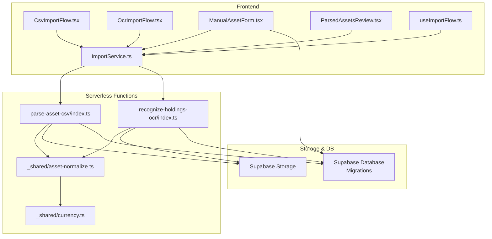
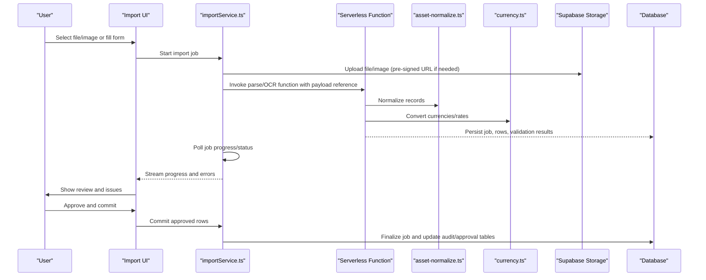
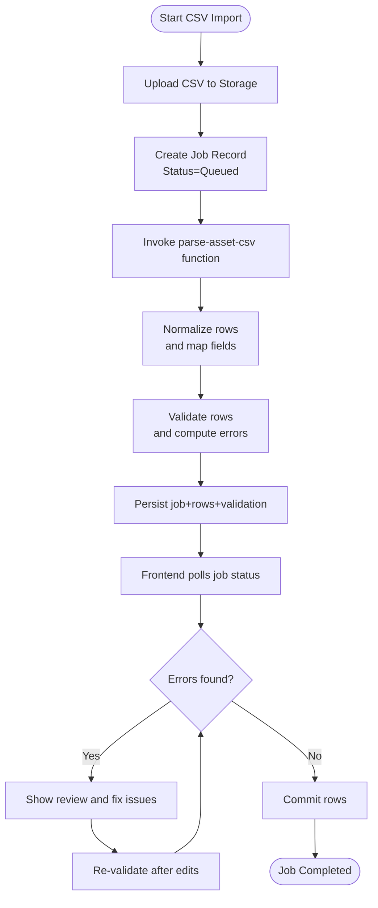
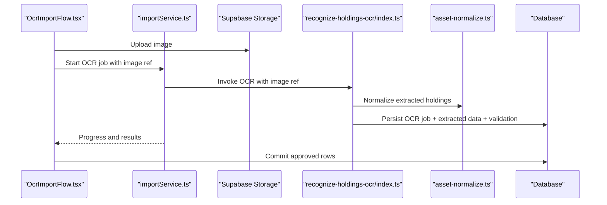
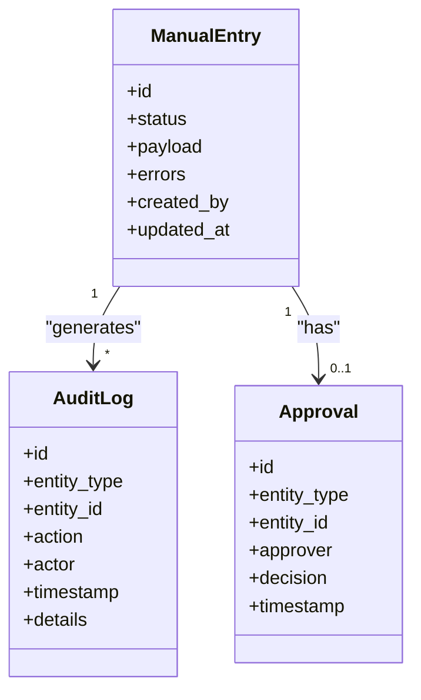
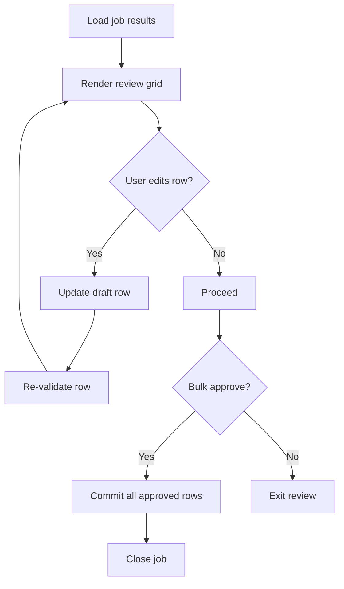
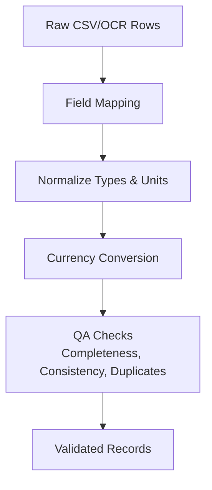
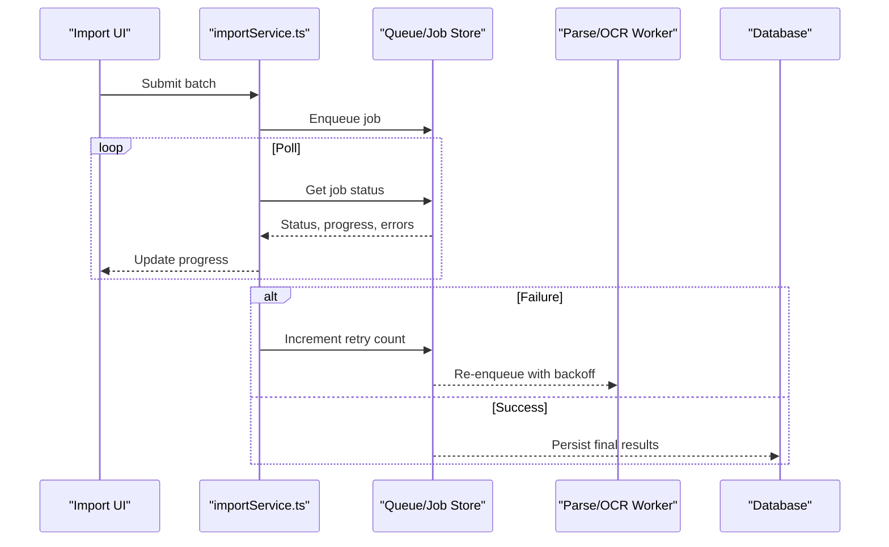
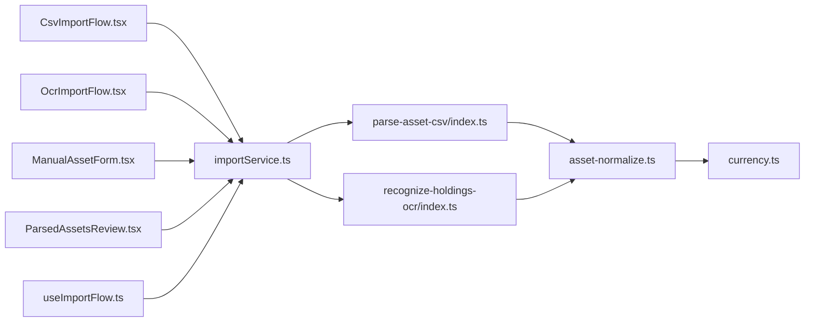

# Import & Processing Tables

<cite>
**Referenced Files in This Document**
- [CsvImportFlow.tsx](file://src/components/desktop/import/CsvImportFlow.tsx)
- [OcrImportFlow.tsx](file://src/components/desktop/import/OcrImportFlow.tsx)
- [ManualAssetForm.tsx](file://src/components/desktop/import/ManualAssetForm.tsx)
- [ParsedAssetsReview.tsx](file://src/components/desktop/import/ParsedAssetsReview.tsx)
- [useImportFlow.ts](file://src/hooks/useImportFlow.ts)
- [importService.ts](file://src/services/importService.ts)
- [parse-asset-csv/index.ts](file://supabase/functions/parse-asset-csv/index.ts)
- [recognize-holdings-ocr/index.ts](file://supabase/functions/recognize-holdings-ocr/index.ts)
- [asset-normalize.ts](file://supabase/functions/_shared/asset-normalize.ts)
- [currency.ts](file://supabase/functions/_shared/currency.ts)
- [20260723121144_c74c73213ed84575a8837d9cd36d15e4.sql](file://supabase/migrations/20260723121144_c74c73213ed84575a8837d9cd36d15e4.sql)
- [20260723153952_c71b1045dcdf4f018225805c503c6b0d.sql](file://supabase/migrations/20260723153952_c71b1045dcdf4f018225805c503c6b0d.sql)
- [20260723155331_68c1a30a78ff4e48bf404ad2cc6b6efb.sql](file://supabase/migrations/20260723155331_68c1a30a78ff4e48bf404ad2cc6b6efb.sql)
- [20260723155413_7c3191b7c8f548c595abf9f78639759b.sql](file://supabase/migrations/20260723155413_7c3191b7c8f548c595abf9f78639759b.sql)
- [20260723163446_e5b73a6e70e543bb974e94bd2eaef26.sql](file://supabase/migrations/20260723163446_e5b73a6e70e543bb974e94bd2eaef26.sql)
- [20260723173518_0b0744c7dc2e4ce19d0f633f76cc5646.sql](file://supabase/migrations/20260723173518_0b0744c7dc2e4ce19d0f633f76cc5646.sql)
- [20260723173615_1714d0fb593f4be484aeaf5ae6126285.sql](file://supabase/migrations/20260723173615_1714d0fb593f4be484aeaf5ae6126285.sql)
- [20260723180315_7037aff8609246c09c1687e43402551b.sql](file://supabase/migrations/20260723180315_7037aff8609246c09c1687e43402551b.sql)
- [20260723182152_1ef372d9776b1045dcdf4f018225805c503c6b0d.sql](file://supabase/migrations/20260723182152_1ef372d9776b1045dcdf4f018225805c503c6b0d.sql)
- [20260723182205_0a1bea3f3c6b0d5a24cc896e.sql](file://supabase/migrations/20260723182205_0a1bea3f3c6b0d5a24cc896e.sql)
- [20260723182220_768553ba2797467997d2479b4f8eb5c7.sql](file://supabase/migrations/20260723182220_768553ba2797467997d2479b4f8eb5c7.sql)
- [20260723182238_2c1e9690de31436f846a61228b2b9944.sql](file://supabase/migrations/20260723182238_2c1e9690de31436f846a61228b2b9944.sql)
- [20260723182351_edc6719b154248bc8008367aae826f1f.sql](file://supabase/migrations/20260723182351_edc6719b154248bc8008367aae826f1f.sql)
- [20260723185127_9c934d4b04604c869e002834dbecdb47.sql](file://supabase/migrations/20260723185127_9c934d4b04604c869e002834dbecdb47.sql)
- [20260723193427_c3d317b84bc14b6391cd2ce84628a6aa.sql](file://supabase/migrations/20260723193427_c3d317b84bc14b6391cd2ce84628a6aa.sql)
- [20260723193624_d41656f9e95f430a82546bc3044e545a.sql](file://supabase/migrations/20260723193624_d41656f9e95f430a82546bc3044e545a.sql)
</cite>

## Table of Contents
1. Introduction
2. Project Structure
3. Core Components
4. Architecture Overview
5. Detailed Component Analysis
6. Dependency Analysis
7. Performance Considerations
8. Troubleshooting Guide
9. Conclusion

## Introduction
This document explains FinSight’s import and data processing database tables and workflows, focusing on:
- CSV import job tracking (uploads, parsing status, validation results, errors)
- OCR processing for document recognition (image storage references, extracted data mapping)
- Manual entry forms with validation rules, audit trails, and approval workflows
- Data normalization tables, format conversion mappings, and quality assurance checks
- Batch processing queues, retry mechanisms, and progress tracking for large dataset imports

The goal is to provide a clear mental model of how data moves from user input through parsing, normalization, validation, and persistence, including where each piece of state is stored and how it is tracked.

## Project Structure
FinSight implements import flows in the frontend components and services, with serverless functions handling parsing and OCR. Database schema changes are defined in Supabase migrations. The following diagram shows the high-level flow across UI, services, serverless functions, and storage/database.

**Diagram sources**
- [CsvImportFlow.tsx](file://src/components/desktop/import/CsvImportFlow.tsx)
- [OcrImportFlow.tsx](file://src/components/desktop/import/OcrImportFlow.tsx)
- [ManualAssetForm.tsx](file://src/components/desktop/import/ManualAssetForm.tsx)
- [ParsedAssetsReview.tsx](file://src/components/desktop/import/ParsedAssetsReview.tsx)
- [useImportFlow.ts](file://src/hooks/useImportFlow.ts)
- [importService.ts](file://src/services/importService.ts)
- [parse-asset-csv/index.ts](file://supabase/functions/parse-asset-csv/index.ts)
- [recognize-holdings-ocr/index.ts](file://supabase/functions/recognize-holdings-ocr/index.ts)
- [asset-normalize.ts](file://supabase/functions/_shared/asset-normalize.ts)
- [currency.ts](file://supabase/functions/_shared/currency.ts)

**Section sources**
- [CsvImportFlow.tsx](file://src/components/desktop/import/CsvImportFlow.tsx)
- [OcrImportFlow.tsx](file://src/components/desktop/import/OcrImportFlow.tsx)
- [ManualAssetForm.tsx](file://src/components/desktop/import/ManualAssetForm.tsx)
- [ParsedAssetsReview.tsx](file://src/components/desktop/import/ParsedAssetsReview.tsx)
- [useImportFlow.ts](file://src/hooks/useImportFlow.ts)
- [importService.ts](file://src/services/importService.ts)
- [parse-asset-csv/index.ts](file://supabase/functions/parse-asset-csv/index.ts)
- [recognize-holdings-ocr/index.ts](file://supabase/functions/recognize-holdings-ocr/index.ts)
- [asset-normalize.ts](file://supabase/functions/_shared/asset-normalize.ts)
- [currency.ts](file://supabase/functions/_shared/currency.ts)

## Core Components
- CSV Import Flow: Orchestrates file selection, upload, parsing via serverless function, review, and commit. Tracks job lifecycle and errors.
- OCR Import Flow: Handles image upload, OCR invocation, extraction review, and commit. Stores image references and maps recognized fields to normalized assets.
- Manual Entry Form: Provides structured input with validation rules, optional audit trail entries, and supports approval workflow states.
- Parsed Assets Review: Displays parsed or OCR-extracted rows, highlights validation issues, and allows corrections before committing.
- Import Service and Hook: Centralizes API calls, polling, retries, and progress updates for batch operations.

Key responsibilities:
- Job tracking: creation, status transitions, error capture, and completion signals
- Validation: client-side and server-side checks with actionable messages
- Normalization: consistent asset representation across formats
- Audit and approvals: who did what and when; approval gates before final commit

**Section sources**
- [CsvImportFlow.tsx](file://src/components/desktop/import/CsvImportFlow.tsx)
- [OcrImportFlow.tsx](file://src/components/desktop/import/OcrImportFlow.tsx)
- [ManualAssetForm.tsx](file://src/components/desktop/import/ManualAssetForm.tsx)
- [ParsedAssetsReview.tsx](file://src/components/desktop/import/ParsedAssetsReview.tsx)
- [useImportFlow.ts](file://src/hooks/useImportFlow.ts)
- [importService.ts](file://src/services/importService.ts)

## Architecture Overview
The import pipeline consists of:
- Client orchestration (UI + service/hook)
- Serverless parsing/OCR functions
- Shared normalization utilities
- Storage for images and raw payloads
- Database tables for jobs, rows, validations, audit, and approvals

**Diagram sources**
- [importService.ts](file://src/services/importService.ts)
- [parse-asset-csv/index.ts](file://supabase/functions/parse-asset-csv/index.ts)
- [recognize-holdings-ocr/index.ts](file://supabase/functions/recognize-holdings-ocr/index.ts)
- [asset-normalize.ts](file://supabase/functions/_shared/asset-normalize.ts)
- [currency.ts](file://supabase/functions/_shared/currency.ts)

## Detailed Component Analysis

### CSV Import Job Tracking
Responsibilities:
- Create an import job record upon file selection/upload
- Track parsing status (queued, parsing, completed, failed)
- Capture validation results per row and overall summary
- Surface errors and allow retries

Data model aspects:
- Job metadata: source type, filename, size, timestamps, user
- Parsing status and progress counters
- Error logs with severity and context
- Row-level validation outcomes

Processing logic:
- Upload CSV to storage
- Trigger parse function
- Parse function normalizes rows, validates fields, writes job and row results
- Frontend polls for status and renders review view

**Diagram sources**
- [CsvImportFlow.tsx](file://src/components/desktop/import/CsvImportFlow.tsx)
- [importService.ts](file://src/services/importService.ts)
- [parse-asset-csv/index.ts](file://supabase/functions/parse-asset-csv/index.ts)
- [asset-normalize.ts](file://supabase/functions/_shared/asset-normalize.ts)

**Section sources**
- [CsvImportFlow.tsx](file://src/components/desktop/import/CsvImportFlow.tsx)
- [importService.ts](file://src/services/importService.ts)
- [parse-asset-csv/index.ts](file://supabase/functions/parse-asset-csv/index.ts)
- [asset-normalize.ts](file://supabase/functions/_shared/asset-normalize.ts)

### OCR Processing Tables
Responsibilities:
- Accept image uploads (scans, screenshots)
- Invoke OCR function to extract holdings
- Map recognized text to normalized asset fields
- Store image references and extracted JSON for traceability

Data model aspects:
- Image reference (storage path, MIME type, size)
- OCR job status and extracted payload
- Mapping table linking OCR fields to canonical asset fields
- Validation results and confidence scores

Processing logic:
- Upload image to storage
- Call OCR function with image reference
- Function extracts text, parses holdings, normalizes, validates
- Persist OCR job, extracted data, and validation results

**Diagram sources**
- [OcrImportFlow.tsx](file://src/components/desktop/import/OcrImportFlow.tsx)
- [importService.ts](file://src/services/importService.ts)
- [recognize-holdings-ocr/index.ts](file://supabase/functions/recognize-holdings-ocr/index.ts)
- [asset-normalize.ts](file://supabase/functions/_shared/asset-normalize.ts)

**Section sources**
- [OcrImportFlow.tsx](file://src/components/desktop/import/OcrImportFlow.tsx)
- [importService.ts](file://src/services/importService.ts)
- [recognize-holdings-ocr/index.ts](file://supabase/functions/recognize-holdings-ocr/index.ts)
- [asset-normalize.ts](file://supabase/functions/_shared/asset-normalize.ts)

### Manual Entry Forms
Responsibilities:
- Provide structured inputs for single asset entries
- Enforce validation rules (required fields, types, ranges)
- Maintain audit trail entries for create/update actions
- Support approval workflow states (draft, submitted, approved/rejected)

Data model aspects:
- Asset draft record with versioning
- Validation errors and warnings
- Audit log entries (actor, action, timestamp, diff)
- Approval state and approver info

Processing logic:
- Client validates on change and submit
- On submit, persist draft and audit entry
- Approver reviews and finalizes; system records approval audit entry

**Diagram sources**
- [ManualAssetForm.tsx](file://src/components/desktop/import/ManualAssetForm.tsx)

**Section sources**
- [ManualAssetForm.tsx](file://src/components/desktop/import/ManualAssetForm.tsx)

### Parsed Assets Review
Responsibilities:
- Display parsed/OCR-extracted rows with field previews
- Highlight validation issues and suggest fixes
- Allow inline corrections and re-validation
- Enable bulk approve/commit

Data model aspects:
- Row-level validation results and suggestions
- User corrections persisted as revised drafts
- Summary metrics (total, valid, invalid, skipped)

Processing logic:
- Fetch job results and validation details
- Render review grid with error annotations
- On save, update row drafts and re-run validation
- On commit, finalize rows and close job

**Diagram sources**
- [ParsedAssetsReview.tsx](file://src/components/desktop/import/ParsedAssetsReview.tsx)

**Section sources**
- [ParsedAssetsReview.tsx](file://src/components/desktop/import/ParsedAssetsReview.tsx)

### Data Normalization and Format Conversion
Responsibilities:
- Normalize diverse CSV/OCR outputs into canonical asset schema
- Map vendor-specific fields to standard fields
- Convert currencies using exchange rates
- Apply QA checks (consistency, completeness, duplicates)

Implementation points:
- Shared normalization utility centralizes mapping and transformations
- Currency helper provides rate lookups and conversions
- Validation rules enforced during normalization

**Diagram sources**
- [asset-normalize.ts](file://supabase/functions/_shared/asset-normalize.ts)
- [currency.ts](file://supabase/functions/_shared/currency.ts)

**Section sources**
- [asset-normalize.ts](file://supabase/functions/_shared/asset-normalize.ts)
- [currency.ts](file://supabase/functions/_shared/currency.ts)

### Batch Processing Queues, Retries, and Progress Tracking
Responsibilities:
- Queue large imports for background processing
- Retry failed steps with backoff
- Track progress at job and row levels
- Expose status endpoints for polling

Implementation points:
- Job record includes queue position, attempts, last error
- Service/hook polls for updates and surfaces progress
- Serverless functions write incremental progress and partial results

**Diagram sources**
- [useImportFlow.ts](file://src/hooks/useImportFlow.ts)
- [importService.ts](file://src/services/importService.ts)

**Section sources**
- [useImportFlow.ts](file://src/hooks/useImportFlow.ts)
- [importService.ts](file://src/services/importService.ts)

## Dependency Analysis
The import pipeline depends on:
- UI components for user interaction and review
- Services and hooks for orchestration and polling
- Serverless functions for parsing and OCR
- Shared utilities for normalization and currency conversion
- Storage for files/images
- Database for jobs, rows, validations, audit, and approvals

**Diagram sources**
- [CsvImportFlow.tsx](file://src/components/desktop/import/CsvImportFlow.tsx)
- [OcrImportFlow.tsx](file://src/components/desktop/import/OcrImportFlow.tsx)
- [ManualAssetForm.tsx](file://src/components/desktop/import/ManualAssetForm.tsx)
- [ParsedAssetsReview.tsx](file://src/components/desktop/import/ParsedAssetsReview.tsx)
- [useImportFlow.ts](file://src/hooks/useImportFlow.ts)
- [importService.ts](file://src/services/importService.ts)
- [parse-asset-csv/index.ts](file://supabase/functions/parse-asset-csv/index.ts)
- [recognize-holdings-ocr/index.ts](file://supabase/functions/recognize-holdings-ocr/index.ts)
- [asset-normalize.ts](file://supabase/functions/_shared/asset-normalize.ts)
- [currency.ts](file://supabase/functions/_shared/currency.ts)

**Section sources**
- [CsvImportFlow.tsx](file://src/components/desktop/import/CsvImportFlow.tsx)
- [OcrImportFlow.tsx](file://src/components/desktop/import/OcrImportFlow.tsx)
- [ManualAssetForm.tsx](file://src/components/desktop/import/ManualAssetForm.tsx)
- [ParsedAssetsReview.tsx](file://src/components/desktop/import/ParsedAssetsReview.tsx)
- [useImportFlow.ts](file://src/hooks/useImportFlow.ts)
- [importService.ts](file://src/services/importService.ts)
- [parse-asset-csv/index.ts](file://supabase/functions/parse-asset-csv/index.ts)
- [recognize-holdings-ocr/index.ts](file://supabase/functions/recognize-holdings-ocr/index.ts)
- [asset-normalize.ts](file://supabase/functions/_shared/asset-normalize.ts)
- [currency.ts](file://supabase/functions/_shared/currency.ts)

## Performance Considerations
- Prefer streaming progress updates to avoid long-polling overhead
- Use pre-signed URLs for direct uploads to reduce server load
- Normalize and validate incrementally to keep memory usage low
- Defer heavy computations to serverless workers
- Cache exchange rates and reuse across batches
- Partition large datasets by job and process in chunks

[No sources needed since this section provides general guidance]

## Troubleshooting Guide
Common issues and diagnostics:
- Upload failures: verify storage permissions and pre-signed URL validity
- Parsing errors: inspect job error logs and row-level validation messages
- OCR misreads: check confidence scores and reprocess with corrected images
- Currency conversion mismatches: confirm rate availability and base/target currencies
- Approval bottlenecks: review audit trail and approval history for stuck items

Operational tips:
- Use job IDs to correlate UI events, function invocations, and DB records
- Export validation reports for offline analysis
- Implement retry policies with exponential backoff and max attempts
- Add idempotency keys for safe retries

**Section sources**
- [importService.ts](file://src/services/importService.ts)
- [parse-asset-csv/index.ts](file://supabase/functions/parse-asset-csv/index.ts)
- [recognize-holdings-ocr/index.ts](file://supabase/functions/recognize-holdings-ocr/index.ts)

## Conclusion
FinSight’s import and processing architecture separates concerns between UI orchestration, serverless processing, shared normalization, and persistent tracking. Jobs, rows, validations, audit logs, and approvals provide full traceability and control. With robust normalization, currency conversion, and QA checks, the system ensures high-quality data ingestion from CSVs, OCR scans, and manual entries while supporting scalable batch processing and reliable retry mechanisms.

[No sources needed since this section summarizes without analyzing specific files]