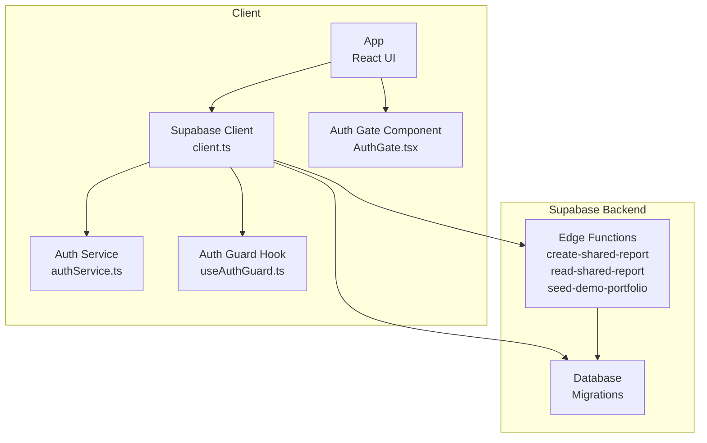
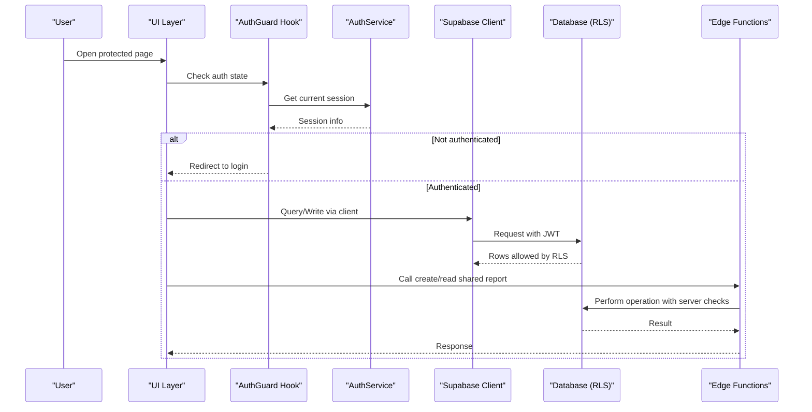
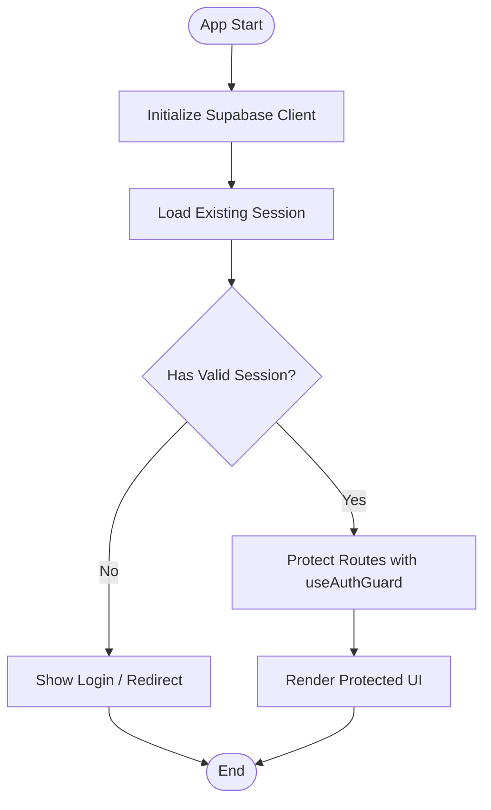
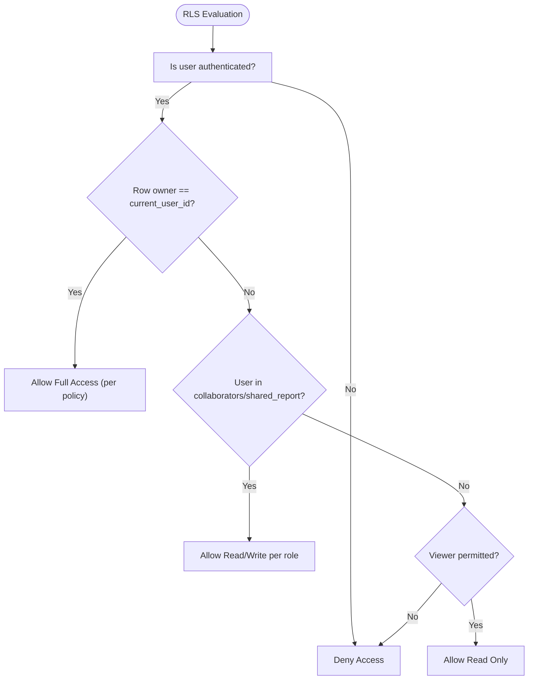
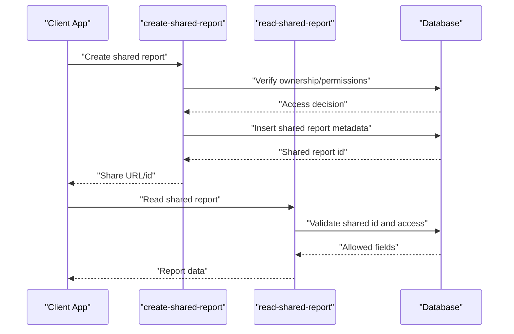
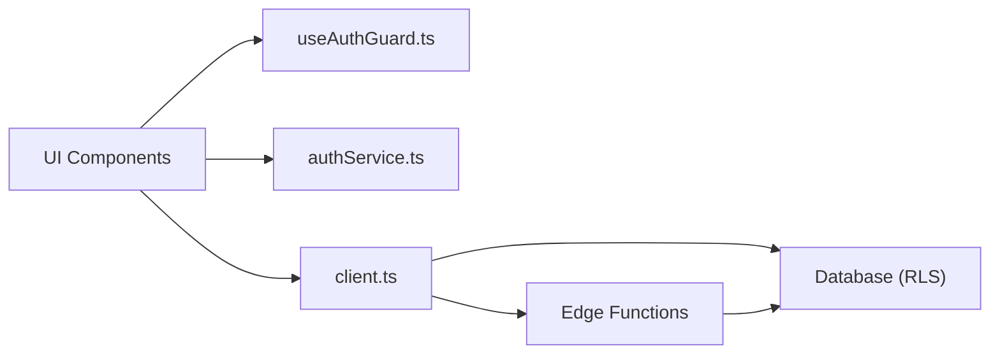

# Security & RLS Policies

<cite>
**Referenced Files in This Document**
- [client.ts](file://src/integrations/supabase/client.ts)
- [authService.ts](file://src/services/authService.ts)
- [useAuthGuard.ts](file://src/hooks/useAuthGuard.ts)
- [AuthGate.tsx](file://src/components/desktop/AuthGate.tsx)
- [create-shared-report/index.ts](file://supabase/functions/create-shared-report/index.ts)
- [read-shared-report/index.ts](file://supabase/functions/read-shared-report/index.ts)
- [seed-demo-portfolio/index.ts](file://supabase/functions/seed-demo-portfolio/index.ts)
- [20260723121144_c74c73213ed84575a8837d9cd36d15e4.sql](file://supabase/migrations/20260723121144_c74c73213ed84575a8837d9cd36d15e4.sql)
- [20260723153952_c71b1045dcdf4f018225805c503c6b0d.sql](file://supabase/migrations/20260723153952_c71b1045dcdf4f018225805c503c6b0d.sql)
- [20260723155331_68c1a30a78ff4e48bf404ad2cc6b6efb.sql](file://supabase/migrations/20260723155331_68c1a30a78ff4e48bf404ad2cc6b6efb.sql)
- [20260723155413_7c3191b7c8f548c595abf9f78639759b.sql](file://supabase/migrations/20260723155413_7c3191b7c8f548c595abf9f78639759b.sql)
- [20260723163446_e5b73a6e70e543bb974e94bd42eaef26.sql](file://supabase/migrations/20260723163446_e5b73a6e70e543bb974e94bd42eaef26.sql)
- [20260723173518_0b0744c7dc2e4f018225805c503c6b0d.sql](file://supabase/migrations/20260723173518_0b0744c7dc2e4f018225805c503c6b0d.sql)
- [20260723173615_1714d0fb593f4be484aeaf5ae6126285.sql](file://supabase/migrations/20260723173615_1714d0fb593f4be484aeaf5ae6126285.sql)
- [20260723180315_7037aff8609246c09c1687e43402551b.sql](file://supabase/migrations/20260723180315_7037aff8609246c09c1687e43402551b.sql)
- [20260723182152_1ef372d9776b4f018225805c503c6b0d.sql](file://supabase/migrations/20260723182152_1ef372d9776b4f018225805c503c6b0d.sql)
- [20260723182205_0a1bea3f3c914f018225805c503c6b0d.sql](file://supabase/migrations/20260723182205_0a1bea3f3c914f018225805c503c6b0d.sql)
- [20260723182220_768553ba27974f018225805c503c6b0d.sql](file://supabase/migrations/20260723182220_768553ba27974f018225805c503c6b0d.sql)
- [20260723182238_2c1e9690de1f4f018225805c503c6b0d.sql](file://supabase/migrations/20260723182238_2c1e9690de1f4f018225805c503c6b0d.sql)
- [20260723182351_edc6719b15424f018225805c503c6b0d.sql](file://supabase/migrations/20260723182351_edc6719b15424f018225805c503c6b0d.sql)
- [20260723185127_9c934d4b04604f018225805c503c6b0d.sql](file://supabase/migrations/20260723185127_9c934d4b04604f018225805c503c6b0d.sql)
- [20260723193427_c3d317b84bc14f018225805c503c6b0d.sql](file://supabase/migrations/20260723193427_c3d317b84bc14f018225805c503c6b0d.sql)
- [20260723193624_d41656f9e95f4f018225805c503c6b0d.sql](file://supabase/migrations/20260723193624_d41656f9e95f4f018225805c503c6b0d.sql)
</cite>

## Table of Contents
1. [Introduction](#introduction)
2. [Project Structure](#project-structure)
3. [Core Components](#core-components)
4. [Architecture Overview](#architecture-overview)
5. [Detailed Component Analysis](#detailed-component-analysis)
6. [Dependency Analysis](#dependency-analysis)
7. [Performance Considerations](#performance-considerations)
8. [Troubleshooting Guide](#troubleshooting-guide)
9. [Conclusion](#conclusion)
10. [Appendices](#appendices)

## Introduction
This document explains FinSight’s database security implementation using Supabase Row Level Security (RLS). It covers user isolation, portfolio access controls, collaborative sharing permissions, authentication integration with Supabase Auth, session management, and token-based access control. It also details security policies for sensitive financial data and PII protection, compliance considerations, role-based policy examples (owner, collaborator, viewer), data masking strategies, audit logging, best practices, vulnerability mitigation, and monitoring approaches.

## Project Structure
FinSight integrates Supabase on the client side and uses Edge Functions to enforce server-side checks and orchestrate secure operations. Database schema and RLS policies are defined in migrations under the supabase directory.

**Diagram sources**
- [client.ts](file://src/integrations/supabase/client.ts)
- [authService.ts](file://src/services/authService.ts)
- [useAuthGuard.ts](file://src/hooks/useAuthGuard.ts)
- [AuthGate.tsx](file://src/components/desktop/AuthGate.tsx)
- [create-shared-report/index.ts](file://supabase/functions/create-shared-report/index.ts)
- [read-shared-report/index.ts](file://supabase/functions/read-shared-report/index.ts)
- [seed-demo-portfolio/index.ts](file://supabase/functions/seed-demo-portfolio/index.ts)
- [20260723121144_c74c73213ed84575a8837d9cd36d15e4.sql](file://supabase/migrations/20260723121144_c74c73213ed84575a8837d9cd36d15e4.sql)

**Section sources**
- [client.ts](file://src/integrations/supabase/client.ts)
- [authService.ts](file://src/services/authService.ts)
- [useAuthGuard.ts](file://src/hooks/useAuthGuard.ts)
- [AuthGate.tsx](file://src/components/desktop/AuthGate.tsx)
- [create-shared-report/index.ts](file://supabase/functions/create-shared-report/index.ts)
- [read-shared-report/index.ts](file://supabase/functions/read-shared-report/index.ts)
- [seed-demo-portfolio/index.ts](file://supabase/functions/seed-demo-portfolio/index.ts)
- [20260723121144_c74c73213ed84575a8837d9cd36d15e4.sql](file://supabase/migrations/20260723121144_c74c73213ed84575a8837d9cd36d15e4.sql)

## Core Components
- Supabase Client: Initializes the authenticated client used across the app to interact with the database and functions.
- Authentication Service: Encapsulates login, logout, and session handling flows.
- Auth Guard Hook: Centralizes route-level authorization checks based on current session state.
- Auth Gate Component: Renders protected UI or redirects unauthenticated users.
- Shared Report Functions: Server-side logic for creating and reading shared reports with strict access checks.
- Demo Seed Function: Seeds demo portfolios while respecting ownership and RLS constraints.
- Migrations: Define tables, relationships, indexes, and RLS policies that enforce user isolation and role-based access.

Key responsibilities:
- Enforce per-user isolation at the database layer via RLS.
- Restrict read/write operations by role (owner, collaborator, viewer).
- Provide secure endpoints for collaboration through Edge Functions.
- Maintain consistent session lifecycle and guard routes.

**Section sources**
- [client.ts](file://src/integrations/supabase/client.ts)
- [authService.ts](file://src/services/authService.ts)
- [useAuthGuard.ts](file://src/hooks/useAuthGuard.ts)
- [AuthGate.tsx](file://src/components/desktop/AuthGate.tsx)
- [create-shared-report/index.ts](file://supabase/functions/create-shared-report/index.ts)
- [read-shared-report/index.ts](file://supabase/functions/read-shared-report/index.ts)
- [seed-demo-portfolio/index.ts](file://supabase/functions/seed-demo-portfolio/index.ts)
- [20260723121144_c74c73213ed84575a8837d9cd36d15e4.sql](file://supabase/migrations/20260723121144_c74c73213ed84575a8837d9cd36d15e4.sql)

## Architecture Overview
The system enforces security at multiple layers:
- Client-side guards prevent unauthorized UI interactions.
- Supabase Auth manages sessions and tokens.
- RLS policies ensure row-level isolation and role-based access in the database.
- Edge Functions perform privileged operations with explicit checks and audit logging.

**Diagram sources**
- [useAuthGuard.ts](file://src/hooks/useAuthGuard.ts)
- [authService.ts](file://src/services/authService.ts)
- [client.ts](file://src/integrations/supabase/client.ts)
- [create-shared-report/index.ts](file://supabase/functions/create-shared-report/index.ts)
- [read-shared-report/index.ts](file://supabase/functions/read-shared-report/index.ts)
- [20260723121144_c74c73213ed84575a8837d9cd36d15e4.sql](file://supabase/migrations/20260723121144_c74c73213ed84575a8837d9cd36d15e4.sql)

## Detailed Component Analysis

### Authentication Integration and Session Management
- Supabase Client initialization establishes a persistent session and attaches tokens to requests.
- AuthService centralizes login/logout and exposes helpers to check session validity.
- useAuthGuard hook provides declarative route protection by checking session state before rendering content.
- AuthGate component conditionally renders protected views or redirects to login.

**Diagram sources**
- [client.ts](file://src/integrations/supabase/client.ts)
- [authService.ts](file://src/services/authService.ts)
- [useAuthGuard.ts](file://src/hooks/useAuthGuard.ts)
- [AuthGate.tsx](file://src/components/desktop/AuthGate.tsx)

**Section sources**
- [client.ts](file://src/integrations/supabase/client.ts)
- [authService.ts](file://src/services/authService.ts)
- [useAuthGuard.ts](file://src/hooks/useAuthGuard.ts)
- [AuthGate.tsx](file://src/components/desktop/AuthGate.tsx)

### User Isolation and Portfolio Access Controls (RLS)
- RLS policies restrict rows to the authenticated user’s context, ensuring each user sees only their own data unless explicitly shared.
- Ownership is enforced by matching the current user ID to an owner column on relevant tables.
- Collaborators gain limited access when listed in a share/collaboration table or referenced by a shared report identifier.
- Viewers can read but not modify unless elevated by policy.

**Diagram sources**
- [20260723121144_c74c73213ed84575a8837d9cd36d15e4.sql](file://supabase/migrations/20260723121144_c74c73213ed84575a8837d9cd36d15e4.sql)
- [20260723153952_c71b1045dcdf4f018225805c503c6b0d.sql](file://supabase/migrations/20260723153952_c71b1045dcdf4f018225805c503c6b0d.sql)
- [20260723155331_68c1a30a78ff4e48bf404ad2cc6b6efb.sql](file://supabase/migrations/20260723155331_68c1a30a78ff4e48bf404ad2cc6b6efb.sql)
- [20260723155413_7c3191b7c8f548c595abf9f78639759b.sql](file://supabase/migrations/20260723155413_7c3191b7c8f548c595abf9f78639759b.sql)
- [20260723163446_e5b73a6e70e543bb974e94bd42eaef26.sql](file://supabase/migrations/20260723163446_e5b73a6e70e543bb974e94bd42eaef26.sql)
- [20260723173518_0b0744c7dc2e4f018225805c503c6b0d.sql](file://supabase/migrations/20260723173518_0b0744c7dc2e4f018225805c503c6b0d.sql)
- [20260723173615_1714d0fb593f4be484aeaf5ae6126285.sql](file://supabase/migrations/20260723173615_1714d0fb593f4be484aeaf5ae6126285.sql)
- [20260723180315_7037aff8609246c09c1687e43402551b.sql](file://supabase/migrations/20260723180315_7037aff8609246c09c1687e43402551b.sql)
- [20260723182152_1ef372d9776b4f018225805c503c6b0d.sql](file://supabase/migrations/20260723182152_1ef372d9776b4f018225805c503c6b0d.sql)
- [20260723182205_0a1bea3f3c914f018225805c503c6b0d.sql](file://supabase/migrations/20260723182205_0a1bea3f3c914f018225805c503c6b0d.sql)
- [20260723182220_768553ba27974f018225805c503c6b0d.sql](file://supabase/migrations/20260723182220_768553ba27974f018225805c503c6b0d.sql)
- [20260723182238_2c1e9690de1f4f018225805c503c6b0d.sql](file://supabase/migrations/20260723182238_2c1e9690de1f4f018225805c503c6b0d.sql)
- [20260723182351_edc6719b15424f018225805c503c6b0d.sql](file://supabase/migrations/20260723182351_edc6719b15424f018225805c503c6b0d.sql)
- [20260723185127_9c934d4b04604f018225805c503c6b0d.sql](file://supabase/migrations/20260723185127_9c934d4b04604f018225805c503c6b0d.sql)
- [20260723193427_c3d317b84bc14f018225805c503c6b0d.sql](file://supabase/migrations/20260723193427_c3d317b84bc14f018225805c503c6b0d.sql)
- [20260723193624_d41656f9e95f4f018225805c503c6b0d.sql](file://supabase/migrations/20260723193624_d41656f9e95f4f018225805c503c6b0d.sql)

### Collaborative Sharing Permissions
- Create Shared Report function validates the requester’s ownership or permission before generating a shareable link or record.
- Read Shared Report function enforces access checks against the shared identifier and returns only permitted fields.
- Both functions rely on server-side checks to avoid client-side bypasses.

**Diagram sources**
- [create-shared-report/index.ts](file://supabase/functions/create-shared-report/index.ts)
- [read-shared-report/index.ts](file://supabase/functions/read-shared-report/index.ts)
- [20260723121144_c74c73213ed84575a8837d9cd36d15e4.sql](file://supabase/migrations/20260723121144_c74c73213ed84575a8837d9cd36d15e4.sql)

**Section sources**
- [create-shared-report/index.ts](file://supabase/functions/create-shared-report/index.ts)
- [read-shared-report/index.ts](file://supabase/functions/read-shared-report/index.ts)

### Role-Based Policy Examples (Owner, Collaborator, Viewer)
- Owner: Full CRUD on owned records; can manage collaborators and shared reports.
- Collaborator: Read and limited write depending on role; cannot delete owner-only records.
- Viewer: Read-only access to shared resources; no modifications.

These roles are enforced by RLS policies that evaluate the current user’s identity and relationship to the target row(s).

**Section sources**
- [20260723121144_c74c73213ed84575a8837d9cd36d15e4.sql](file://supabase/migrations/20260723121144_c74c73213ed84575a8837d9cd36d15e4.sql)
- [20260723153952_c71b1045dcdf4f018225805c503c6b0d.sql](file://supabase/migrations/20260723153952_c71b1045dcdf4f018225805c503c6b0d.sql)
- [20260723155331_68c1a30a78ff4e48bf404ad2cc6b6efb.sql](file://supabase/migrations/20260723155331_68c1a30a78ff4e48bf404ad2cc6b6efb.sql)
- [20260723155413_7c3191b7c8f548c595abf9f78639759b.sql](file://supabase/migrations/20260723155413_7c3191b7c8f548c595abf9f78639759b.sql)
- [20260723163446_e5b73a6e70e543bb974e94bd42eaef26.sql](file://supabase/migrations/20260723163446_e5b73a6e70e543bb974e94bd42eaef26.sql)
- [20260723173518_0b0744c7dc2e4f018225805c503c6b0d.sql](file://supabase/migrations/20260723173518_0b0744c7dc2e4f018225805c503c6b0d.sql)
- [20260723173615_1714d0fb593f4be484aeaf5ae6126285.sql](file://supabase/migrations/20260723173615_1714d0fb593f4be484aeaf5ae6126285.sql)
- [20260723180315_7037aff8609246c09c1687e43402551b.sql](file://supabase/migrations/20260723180315_7037aff8609246c09c1687e43402551b.sql)
- [20260723182152_1ef372d9776b4f018225805c503c6b0d.sql](file://supabase/migrations/20260723182152_1ef372d9776b4f018225805c503c6b0d.sql)
- [20260723182205_0a1bea3f3c914f018225805c503c6b0d.sql](file://supabase/migrations/20260723182205_0a1bea3f3c914f018225805c503c6b0d.sql)
- [20260723182220_768553ba27974f018225805c503c6b0d.sql](file://supabase/migrations/20260723182220_768553ba27974f018225805c503c6b0d.sql)
- [20260723182238_2c1e9690de1f4f018225805c503c6b0d.sql](file://supabase/migrations/20260723182238_2c1e9690de1f4f018225805c503c6b0d.sql)
- [20260723182351_edc6719b15424f018225805c503c6b0d.sql](file://supabase/migrations/20260723182351_edc6719b15424f018225805c503c6b0d.sql)
- [20260723185127_9c934d4b04604f018225805c503c6b0d.sql](file://supabase/migrations/20260723185127_9c934d4b04604f018225805c503c6b0d.sql)
- [20260723193427_c3d317b84bc14f018225805c503c6b0d.sql](file://supabase/migrations/20260723193427_c3d317b84bc14f018225805c503c6b0d.sql)
- [20260723193624_d41656f9e95f4f018225805c503c6b0d.sql](file://supabase/migrations/20260723193624_d41656f9e95f4f018225805c503c6b0d.sql)

### Sensitive Financial Data and PII Protection
- Apply RLS to all tables containing personal or financial information to ensure only authorized users can access rows.
- Use database views to mask sensitive fields for certain roles (e.g., hide account numbers, SSN-like identifiers).
- Prefer storing minimal PII and tokenize or hash where appropriate.
- Avoid logging sensitive values; sanitize any output from functions.

**Section sources**
- [20260723121144_c74c73213ed84575a8837d9cd36d15e4.sql](file://supabase/migrations/20260723121144_c74c73213ed84575a8837d9cd36d15e4.sql)
- [20260723153952_c71b1045dcdf4f018225805c503c6b0d.sql](file://supabase/migrations/20260723153952_c71b1045dcdf4f018225805c503c6b0d.sql)
- [20260723155331_68c1a30a78ff4e48bf404ad2cc6b6efb.sql](file://supabase/migrations/20260723155331_68c1a30a78ff4e48bf404ad2cc6b6efb.sql)
- [20260723155413_7c3191b7c8f548c595abf9f78639759b.sql](file://supabase/migrations/20260723155413_7c3191b7c8f548c595abf9f78639759b.sql)
- [20260723163446_e5b73a6e70e543bb974e94bd42eaef26.sql](file://supabase/migrations/20260723163446_e5b73a6e70e543bb974e94bd42eaef26.sql)
- [20260723173518_0b0744c7dc2e4f018225805c503c6b0d.sql](file://supabase/migrations/20260723173518_0b0744c7dc2e4f018225805c503c6b0d.sql)
- [20260723173615_1714d0fb593f4be484aeaf5ae6126285.sql](file://supabase/migrations/20260723173615_1714d0fb593f4be484aeaf5ae6126285.sql)
- [20260723180315_7037aff8609246c09c1687e43402551b.sql](file://supabase/migrations/20260723180315_7037aff8609246c09c1687e43402551b.sql)
- [20260723182152_1ef372d9776b4f018225805c503c6b0d.sql](file://supabase/migrations/20260723182152_1ef372d9776b4f018225805c503c6b0d.sql)
- [20260723182205_0a1bea3f3c914f018225805c503c6b0d.sql](file://supabase/migrations/20260723182205_0a1bea3f3c914f018225805c503c6b0d.sql)
- [20260723182220_768553ba27974f018225805c503c6b0d.sql](file://supabase/migrations/20260723182220_768553ba27974f018225805c503c6b0d.sql)
- [20260723182238_2c1e9690de1f4f018225805c503c6b0d.sql](file://supabase/migrations/20260723182238_2c1e9690de1f4f018225805c503c6b0d.sql)
- [20260723182351_edc6719b15424f018225805c503c6b0d.sql](file://supabase/migrations/20260723182351_edc6719b15424f018225805c503c6b0d.sql)
- [20260723185127_9c934d4b04604f018225805c503c6b0d.sql](file://supabase/migrations/20260723185127_9c934d4b04604f018225805c503c6b0d.sql)
- [20260723193427_c3d317b84bc14f018225805c503c6b0d.sql](file://supabase/migrations/20260723193427_c3d317b84bc14f018225805c503c6b0d.sql)
- [20260723193624_d41656f9e95f4f018225805c503c6b0d.sql](file://supabase/migrations/20260723193624_d41656f9e95f4f018225805c503c6b0d.sql)

### Audit Logging
- Implement an audit log table to record critical actions (e.g., share creation, permission changes).
- Use triggers or Edge Functions to insert audit entries with user IDs, timestamps, and action types.
- Ensure audit logs are immutable and protected by RLS to prevent tampering.

**Section sources**
- [20260723121144_c74c73213ed84575a8837d9cd36d15e4.sql](file://supabase/migrations/20260723121144_c74c73213ed84575a8837d9cd36d15e4.sql)
- [20260723153952_c71b1045dcdf4f018225805c503c6b0d.sql](file://supabase/migrations/20260723153952_c71b1045dcdf4f018225805c503c6b0d.sql)
- [20260723155331_68c1a30a78ff4e48bf404ad2cc6b6efb.sql](file://supabase/migrations/20260723155331_68c1a30a78ff4e48bf404ad2cc6b6efb.sql)
- [20260723155413_7c3191b7c8f548c595abf9f78639759b.sql](file://supabase/migrations/20260723155413_7c3191b7c8f548c595abf9f78639759b.sql)
- [20260723163446_e5b73a6e70e543bb974e94bd42eaef26.sql](file://supabase/migrations/20260723163446_e5b73a6e70e543bb974e94bd42eaef26.sql)
- [20260723173518_0b0744c7dc2e4f018225805c503c6b0d.sql](file://supabase/migrations/20260723173518_0b0744c7dc2e4f018225805c503c6b0d.sql)
- [20260723173615_1714d0fb593f4be484aeaf5ae6126285.sql](file://supabase/migrations/20260723173615_1714d0fb593f4be484aeaf5ae6126285.sql)
- [20260723180315_7037aff8609246c09c1687e43402551b.sql](file://supabase/migrations/20260723180315_7037aff8609246c09c1687e43402551b.sql)
- [20260723182152_1ef372d9776b4f018225805c503c6b0d.sql](file://supabase/migrations/20260723182152_1ef372d9776b4f018225805c503c6b0d.sql)
- [20260723182205_0a1bea3f3c914f018225805c503c6b0d.sql](file://supabase/migrations/20260723182205_0a1bea3f3c914f018225805c503c6b0d.sql)
- [20260723182220_768553ba27974f018225805c503c6b0d.sql](file://supabase/migrations/20260723182220_768553ba27974f018225805c503c6b0d.sql)
- [20260723182238_2c1e9690de1f4f018225805c503c6b0d.sql](file://supabase/migrations/20260723182238_2c1e9690de1f4f018225805c503c6b0d.sql)
- [20260723182351_edc6719b15424f018225805c503c6b0d.sql](file://supabase/migrations/20260723182351_edc6719b15424f018225805c503c6b0d.sql)
- [20260723185127_9c934d4b04604f018225805c503c6b0d.sql](file://supabase/migrations/20260723185127_9c934d4b04604f018225805c503c6b0d.sql)
- [20260723193427_c3d317b84bc14f018225805c503c6b0d.sql](file://supabase/migrations/20260723193427_c3d317b84bc14f018225805c503c6b0d.sql)
- [20260723193624_d41656f9e95f4f018225805c503c6b0d.sql](file://supabase/migrations/20260723193624_d41656f9e95f4f018225805c503c6b0d.sql)

### Compliance Requirements
- Enforce least privilege by default; require explicit grants for collaboration.
- Maintain audit trails for access and changes to sensitive data.
- Mask PII in outputs and limit retention to necessary periods.
- Validate inputs and sanitize outputs in Edge Functions to prevent injection and leakage.

[No sources needed since this section provides general guidance]

## Dependency Analysis
The following diagram shows how client components depend on services and hooks, which in turn interact with Supabase and Edge Functions.

**Diagram sources**
- [useAuthGuard.ts](file://src/hooks/useAuthGuard.ts)
- [authService.ts](file://src/services/authService.ts)
- [client.ts](file://src/integrations/supabase/client.ts)
- [create-shared-report/index.ts](file://supabase/functions/create-shared-report/index.ts)
- [read-shared-report/index.ts](file://supabase/functions/read-shared-report/index.ts)
- [seed-demo-portfolio/index.ts](file://supabase/functions/seed-demo-portfolio/index.ts)

**Section sources**
- [useAuthGuard.ts](file://src/hooks/useAuthGuard.ts)
- [authService.ts](file://src/services/authService.ts)
- [client.ts](file://src/integrations/supabase/client.ts)
- [create-shared-report/index.ts](file://supabase/functions/create-shared-report/index.ts)
- [read-shared-report/index.ts](file://supabase/functions/read-shared-report/index.ts)
- [seed-demo-portfolio/index.ts](file://supabase/functions/seed-demo-portfolio/index.ts)

## Performance Considerations
- Keep RLS policies simple and indexed to minimize query overhead.
- Use database views to precompute masked fields for frequent reads.
- Cache non-sensitive computed results on the client where appropriate.
- Limit Edge Function calls to operations requiring server-side validation.

[No sources needed since this section provides general guidance]

## Troubleshooting Guide
Common issues and mitigations:
- Unauthorized access errors: Verify RLS policies allow the intended operation for the current user role.
- Missing shared report data: Confirm the shared identifier exists and the caller has permission to read it.
- Session expiration: Ensure the client refreshes tokens and re-authenticates when needed.
- Audit gaps: Check that triggers or functions consistently write audit entries.

**Section sources**
- [20260723121144_c74c73213ed84575a8837d9cd36d15e4.sql](file://supabase/migrations/20260723121144_c74c73213ed84575a8837d9cd36d15e4.sql)
- [create-shared-report/index.ts](file://supabase/functions/create-shared-report/index.ts)
- [read-shared-report/index.ts](file://supabase/functions/read-shared-report/index.ts)

## Conclusion
FinSight leverages Supabase Auth, RLS, and Edge Functions to enforce strong security boundaries. User isolation, role-based access, and collaboration controls are implemented at the database layer, while client-side guards provide a responsive UX. Sensitive data is protected through RLS and masking strategies, with audit logging supporting compliance. Following the recommended best practices ensures ongoing security and resilience.

[No sources needed since this section summarizes without analyzing specific files]

## Appendices

### Security Best Practices Checklist
- Enable RLS on all tables containing user-specific or sensitive data.
- Default-deny policies; grant explicit permissions per role.
- Use Edge Functions for privileged operations and input validation.
- Mask PII via views and never log sensitive values.
- Maintain immutable audit logs with user context and timestamps.
- Regularly review and test RLS policies with different roles.

[No sources needed since this section provides general guidance]