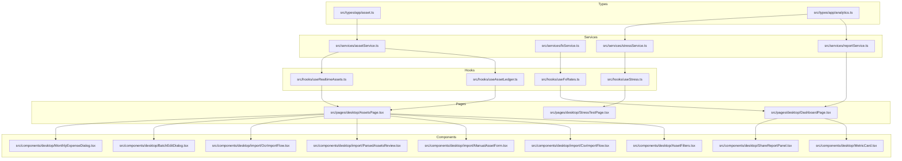
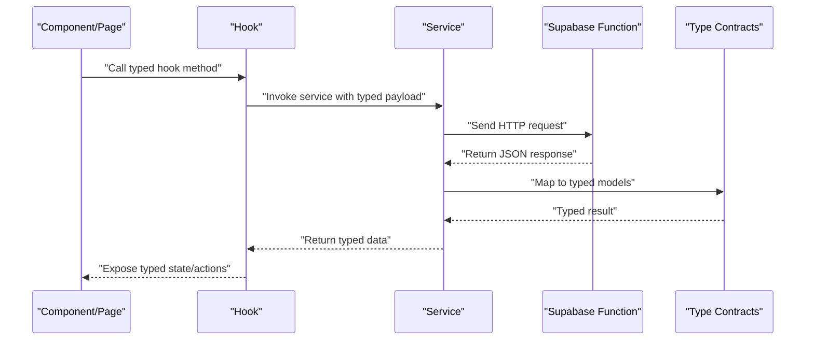
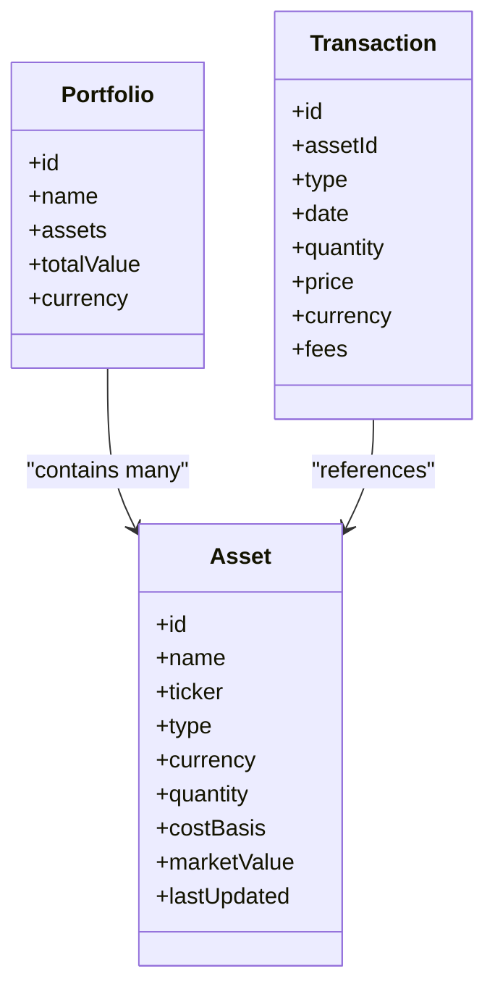
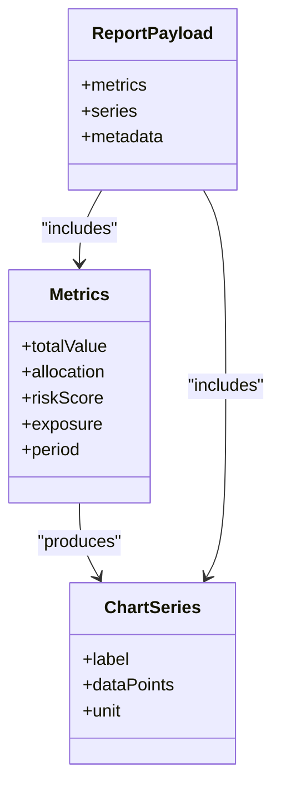
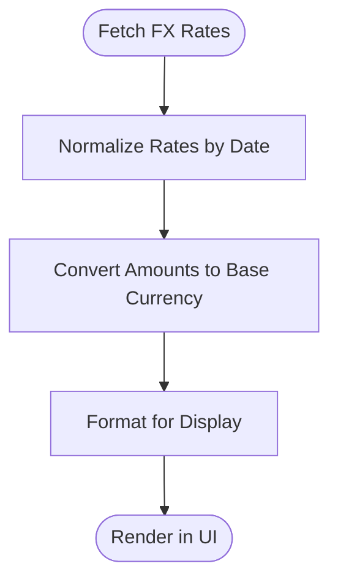
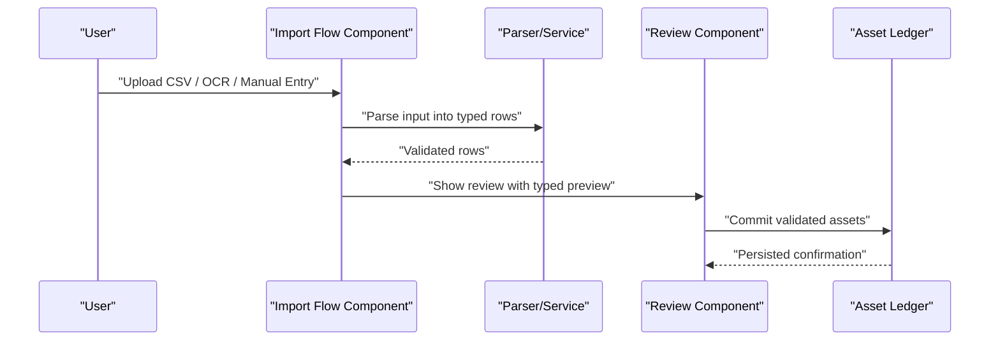
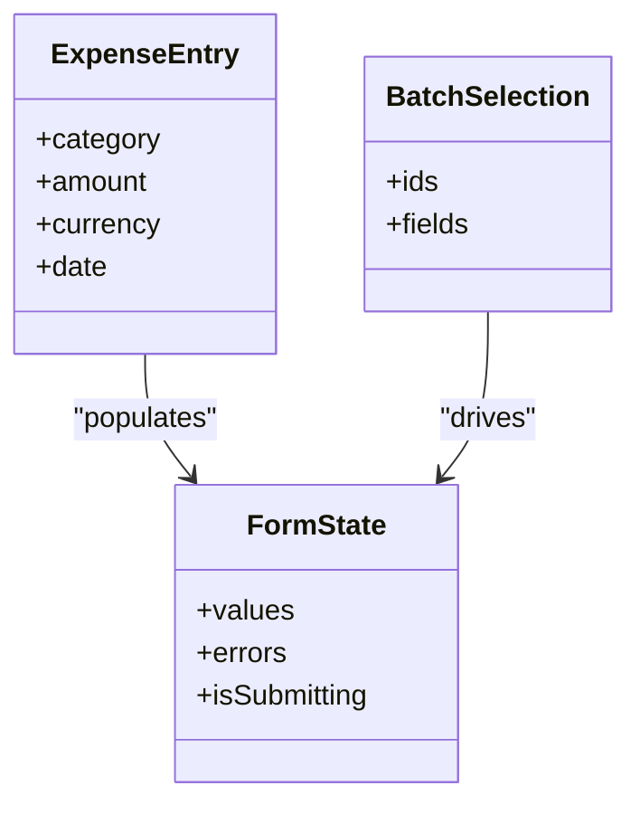
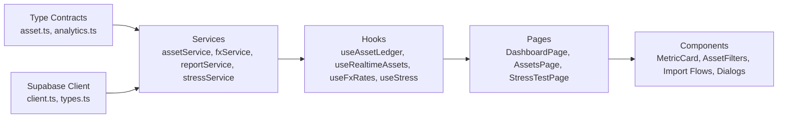

# TypeScript Type Definitions

<cite>
**Referenced Files in This Document**
- [asset.ts](file://src/types/app/asset.ts)
- [analytics.ts](file://src/types/app/analytics.ts)
- [client.ts](file://src/integrations/supabase/client.ts)
- [types.ts](file://src/integrations/supabase/types.ts)
- [assetService.ts](file://src/services/assetService.ts)
- [fxService.ts](file://src/services/fxService.ts)
- [reportService.ts](file://src/services/reportService.ts)
- [stressService.ts](file://src/services/stressService.ts)
- [useAssetLedger.ts](file://src/hooks/useAssetLedger.ts)
- [useRealtimeAssets.ts](file://src/hooks/useRealtimeAssets.ts)
- [useFxRates.ts](file://src/hooks/useFxRates.ts)
- [useStress.ts](file://src/hooks/useStress.ts)
- [DashboardPage.tsx](file://src/pages/desktop/DashboardPage.tsx)
- [AssetsPage.tsx](file://src/pages/desktop/AssetsPage.tsx)
- [StressTestPage.tsx](file://src/pages/desktop/StressTestPage.tsx)
- [MetricCard.tsx](file://src/components/desktop/MetricCard.tsx)
- [AssetFilters.tsx](file://src/components/desktop/AssetFilters.tsx)
- [CsvImportFlow.tsx](file://src/components/desktop/import/CsvImportFlow.tsx)
- [ManualAssetForm.tsx](file://src/components/desktop/import/ManualAssetForm.tsx)
- [ParsedAssetsReview.tsx](file://src/components/desktop/import/ParsedAssetsReview.tsx)
- [OcrImportFlow.tsx](file://src/components/desktop/import/OcrImportFlow.tsx)
- [BatchEditDialog.tsx](file://src/components/desktop/BatchEditDialog.tsx)
- [MonthlyExpenseDialog.tsx](file://src/components/desktop/MonthlyExpenseDialog.tsx)
- [ShareReportPanel.tsx](file://src/components/desktop/ShareReportPanel.tsx)
- [currency.ts](file://src/lib/currency.ts)
- [asset-format.ts](file://src/lib/asset-format.ts)
</cite>

## Table of Contents
1. [Introduction](#introduction)
2. [Project Structure](#project-structure)
3. [Core Components](#core-components)
4. [Architecture Overview](#architecture-overview)
5. [Detailed Component Analysis](#detailed-component-analysis)
6. [Dependency Analysis](#dependency-analysis)
7. [Performance Considerations](#performance-considerations)
8. [Troubleshooting Guide](#troubleshooting-guide)
9. [Conclusion](#conclusion)
10. [Appendices](#appendices)

## Introduction
This document explains FinSight’s frontend TypeScript type system with a focus on core asset types (Asset, Portfolio, Transaction), analytics and reporting structures, API request/response contracts, error handling patterns, and practical usage across components and services. It also covers type safety techniques such as discriminated unions, generics, and utility types, and provides guidance for evolving types while maintaining backward compatibility.

## Project Structure
The type system is primarily organized under src/types/app and is consumed by services, hooks, pages, and UI components. Services define the shape of API payloads and responses; hooks encapsulate stateful data flows typed against those shapes; pages and components consume typed data to render dashboards, import flows, and reports.

**Diagram sources**
- [asset.ts](file://src/types/app/asset.ts)
- [analytics.ts](file://src/types/app/analytics.ts)
- [assetService.ts](file://src/services/assetService.ts)
- [fxService.ts](file://src/services/fxService.ts)
- [reportService.ts](file://src/services/reportService.ts)
- [stressService.ts](file://src/services/stressService.ts)
- [useAssetLedger.ts](file://src/hooks/useAssetLedger.ts)
- [useRealtimeAssets.ts](file://src/hooks/useRealtimeAssets.ts)
- [useFxRates.ts](file://src/hooks/useFxRates.ts)
- [useStress.ts](file://src/hooks/useStress.ts)
- [DashboardPage.tsx](file://src/pages/desktop/DashboardPage.tsx)
- [AssetsPage.tsx](file://src/pages/desktop/AssetsPage.tsx)
- [StressTestPage.tsx](file://src/pages/desktop/StressTestPage.tsx)
- [MetricCard.tsx](file://src/components/desktop/MetricCard.tsx)
- [AssetFilters.tsx](file://src/components/desktop/AssetFilters.tsx)
- [CsvImportFlow.tsx](file://src/components/desktop/import/CsvImportFlow.tsx)
- [ManualAssetForm.tsx](file://src/components/desktop/import/ManualAssetForm.tsx)
- [ParsedAssetsReview.tsx](file://src/components/desktop/import/ParsedAssetsReview.tsx)
- [OcrImportFlow.tsx](file://src/components/desktop/import/OcrImportFlow.tsx)
- [BatchEditDialog.tsx](file://src/components/desktop/BatchEditDialog.tsx)
- [MonthlyExpenseDialog.tsx](file://src/components/desktop/MonthlyExpenseDialog.tsx)
- [ShareReportPanel.tsx](file://src/components/desktop/ShareReportPanel.tsx)

**Section sources**
- [asset.ts](file://src/types/app/asset.ts)
- [analytics.ts](file://src/types/app/analytics.ts)
- [assetService.ts](file://src/services/assetService.ts)
- [fxService.ts](file://src/services/fxService.ts)
- [reportService.ts](file://src/services/reportService.ts)
- [stressService.ts](file://src/services/stressService.ts)
- [useAssetLedger.ts](file://src/hooks/useAssetLedger.ts)
- [useRealtimeAssets.ts](file://src/hooks/useRealtimeAssets.ts)
- [useFxRates.ts](file://src/hooks/useFxRates.ts)
- [useStress.ts](file://src/hooks/useStress.ts)
- [DashboardPage.tsx](file://src/pages/desktop/DashboardPage.tsx)
- [AssetsPage.tsx](file://src/pages/desktop/AssetsPage.tsx)
- [StressTestPage.tsx](file://src/pages/desktop/StressTestPage.tsx)
- [MetricCard.tsx](file://src/components/desktop/MetricCard.tsx)
- [AssetFilters.tsx](file://src/components/desktop/AssetFilters.tsx)
- [CsvImportFlow.tsx](file://src/components/desktop/import/CsvImportFlow.tsx)
- [ManualAssetForm.tsx](file://src/components/desktop/import/ManualAssetForm.tsx)
- [ParsedAssetsReview.tsx](file://src/components/desktop/import/ParsedAssetsReview.tsx)
- [OcrImportFlow.tsx](file://src/components/desktop/import/OcrImportFlow.tsx)
- [BatchEditDialog.tsx](file://src/components/desktop/BatchEditDialog.tsx)
- [MonthlyExpenseDialog.tsx](file://src/components/desktop/MonthlyExpenseDialog.tsx)
- [ShareReportPanel.tsx](file://src/components/desktop/ShareReportPanel.tsx)

## Core Components
This section documents the foundational types that model assets, portfolios, transactions, and analytics outputs. These types are used consistently across services, hooks, and UI layers to ensure strong typing and predictable behavior.

- Asset: Represents an individual holding or financial instrument within a portfolio. Includes identifiers, classification, valuation fields, and metadata required for aggregation and reporting.
- Portfolio: A collection of assets grouped by account or strategy, providing aggregate metrics and linkage to user context.
- Transaction: Captures events that change portfolio composition or value (e.g., buys, sells, dividends), enabling time-series analysis and reconciliation.
- Analytics: Aggregated metrics, chart-ready series, and report payloads produced by computation endpoints (e.g., stress tests, X-ray reports).

These types are defined centrally and imported by services and hooks to enforce consistent contracts between the client and server functions.

**Section sources**
- [asset.ts](file://src/types/app/asset.ts)
- [analytics.ts](file://src/types/app/analytics.ts)

## Architecture Overview
The type system forms the contract layer between UI and backend services. Services translate network payloads into strongly-typed domain models. Hooks manage state using these models and expose typed APIs to components. Pages orchestrate multiple hooks and services to render dashboards and workflows.

**Diagram sources**
- [assetService.ts](file://src/services/assetService.ts)
- [fxService.ts](file://src/services/fxService.ts)
- [reportService.ts](file://src/services/reportService.ts)
- [stressService.ts](file://src/services/stressService.ts)
- [useAssetLedger.ts](file://src/hooks/useAssetLedger.ts)
- [useRealtimeAssets.ts](file://src/hooks/useRealtimeAssets.ts)
- [useFxRates.ts](file://src/hooks/useFxRates.ts)
- [useStress.ts](file://src/hooks/useStress.ts)
- [client.ts](file://src/integrations/supabase/client.ts)
- [types.ts](file://src/integrations/supabase/types.ts)

## Detailed Component Analysis

### Asset Domain Types
The asset domain centers around three core entities: Asset, Portfolio, and Transaction. They form the backbone of portfolio modeling and reporting.

**Diagram sources**
- [asset.ts](file://src/types/app/asset.ts)

Key characteristics:
- Discriminated unions are used to differentiate asset categories and transaction kinds, enabling exhaustive checks in rendering and processing logic.
- Generics parameterize currency-aware computations and chart series to avoid duplication and improve type inference.
- Utility types derive optional or partial variants for forms and batch operations.

Usage examples:
- Services map raw network payloads to Asset/Portfolio/Transaction before returning them to hooks.
- Hooks expose typed arrays and computed aggregates to components.
- Components use discriminated unions to render category-specific fields and actions.

**Section sources**
- [asset.ts](file://src/types/app/asset.ts)
- [assetService.ts](file://src/services/assetService.ts)
- [useAssetLedger.ts](file://src/hooks/useAssetLedger.ts)
- [useRealtimeAssets.ts](file://src/hooks/useRealtimeAssets.ts)
- [AssetsPage.tsx](file://src/pages/desktop/AssetsPage.tsx)
- [AssetFilters.tsx](file://src/components/desktop/AssetFilters.tsx)
- [BatchEditDialog.tsx](file://src/components/desktop/BatchEditDialog.tsx)

### Analytics and Reporting Types
Analytics types describe metrics, chart series, and report payloads generated by computation endpoints such as stress testing and X-ray analysis.

**Diagram sources**
- [analytics.ts](file://src/types/app/analytics.ts)

Highlights:
- Series types support time-based and categorical charts with typed units and labels.
- Report payloads bundle metrics and series for consistent consumption by dashboard components.
- Stress test results extend base analytics with scenario parameters and outcome distributions.

Usage examples:
- Services return typed ReportPayload objects from compute endpoints.
- Hooks transform and cache analytics data for efficient re-renders.
- Dashboard components consume metrics and series to render cards and charts.

**Section sources**
- [analytics.ts](file://src/types/app/analytics.ts)
- [reportService.ts](file://src/services/reportService.ts)
- [stressService.ts](file://src/services/stressService.ts)
- [useStress.ts](file://src/hooks/useStress.ts)
- [DashboardPage.tsx](file://src/pages/desktop/DashboardPage.tsx)
- [StressTestPage.tsx](file://src/pages/desktop/StressTestPage.tsx)
- [MetricCard.tsx](file://src/components/desktop/MetricCard.tsx)
- [ShareReportPanel.tsx](file://src/components/desktop/ShareReportPanel.tsx)

### FX Rates and Currency Handling
FX rates types enable multi-currency valuation and conversion. The types capture exchange rates over time and provide utilities for normalization and formatting.

**Diagram sources**
- [fxService.ts](file://src/services/fxService.ts)
- [useFxRates.ts](file://src/hooks/useFxRates.ts)
- [currency.ts](file://src/lib/currency.ts)

Notes:
- Services fetch and cache rate data, exposing typed getters for current and historical rates.
- Hooks memoize conversions and provide typed helpers for components.
- Library utilities handle rounding, locale formatting, and currency codes.

**Section sources**
- [fxService.ts](file://src/services/fxService.ts)
- [useFxRates.ts](file://src/hooks/useFxRates.ts)
- [currency.ts](file://src/lib/currency.ts)
- [DashboardPage.tsx](file://src/pages/desktop/DashboardPage.tsx)

### Import Flows and Data Validation
Import flows rely on typed schemas to validate CSV, OCR, and manual inputs before persisting assets.

**Diagram sources**
- [CsvImportFlow.tsx](file://src/components/desktop/import/CsvImportFlow.tsx)
- [OcrImportFlow.tsx](file://src/components/desktop/import/OcrImportFlow.tsx)
- [ManualAssetForm.tsx](file://src/components/desktop/import/ManualAssetForm.tsx)
- [ParsedAssetsReview.tsx](file://src/components/desktop/import/ParsedAssetsReview.tsx)
- [asset-format.ts](file://src/lib/asset-format.ts)
- [useAssetLedger.ts](file://src/hooks/useAssetLedger.ts)

Validation strategies:
- Discriminated unions distinguish row types and error categories.
- Utility types produce partial records for incremental editing.
- Services normalize and deduplicate entries before committing.

**Section sources**
- [CsvImportFlow.tsx](file://src/components/desktop/import/CsvImportFlow.tsx)
- [OcrImportFlow.tsx](file://src/components/desktop/import/OcrImportFlow.tsx)
- [ManualAssetForm.tsx](file://src/components/desktop/import/ManualAssetForm.tsx)
- [ParsedAssetsReview.tsx](file://src/components/desktop/import/ParsedAssetsReview.tsx)
- [asset-format.ts](file://src/lib/asset-format.ts)
- [useAssetLedger.ts](file://src/hooks/useAssetLedger.ts)

### Monthly Expenses and Batch Operations
Monthly expense dialogs and batch edit dialogs leverage typed forms and selection sets to ensure safe mutations.

**Diagram sources**
- [MonthlyExpenseDialog.tsx](file://src/components/desktop/MonthlyExpenseDialog.tsx)
- [BatchEditDialog.tsx](file://src/components/desktop/BatchEditDialog.tsx)

Best practices:
- Use discriminated unions for field-level validation errors.
- Apply generics to reusable form helpers for different entity types.
- Keep mutation payloads minimal and strictly typed.

**Section sources**
- [MonthlyExpenseDialog.tsx](file://src/components/desktop/MonthlyExpenseDialog.tsx)
- [BatchEditDialog.tsx](file://src/components/desktop/BatchEditDialog.tsx)

## Dependency Analysis
The type system enforces clear boundaries between layers. Services depend on type contracts; hooks depend on services; components depend on hooks. External integrations (Supabase client and types) provide additional runtime guarantees.

**Diagram sources**
- [asset.ts](file://src/types/app/asset.ts)
- [analytics.ts](file://src/types/app/analytics.ts)
- [assetService.ts](file://src/services/assetService.ts)
- [fxService.ts](file://src/services/fxService.ts)
- [reportService.ts](file://src/services/reportService.ts)
- [stressService.ts](file://src/services/stressService.ts)
- [useAssetLedger.ts](file://src/hooks/useAssetLedger.ts)
- [useRealtimeAssets.ts](file://src/hooks/useRealtimeAssets.ts)
- [useFxRates.ts](file://src/hooks/useFxRates.ts)
- [useStress.ts](file://src/hooks/useStress.ts)
- [DashboardPage.tsx](file://src/pages/desktop/DashboardPage.tsx)
- [AssetsPage.tsx](file://src/pages/desktop/AssetsPage.tsx)
- [StressTestPage.tsx](file://src/pages/desktop/StressTestPage.tsx)
- [MetricCard.tsx](file://src/components/desktop/MetricCard.tsx)
- [AssetFilters.tsx](file://src/components/desktop/AssetFilters.tsx)
- [CsvImportFlow.tsx](file://src/components/desktop/import/CsvImportFlow.tsx)
- [ManualAssetForm.tsx](file://src/components/desktop/import/ManualAssetForm.tsx)
- [ParsedAssetsReview.tsx](file://src/components/desktop/import/ParsedAssetsReview.tsx)
- [OcrImportFlow.tsx](file://src/components/desktop/import/OcrImportFlow.tsx)
- [BatchEditDialog.tsx](file://src/components/desktop/BatchEditDialog.tsx)
- [MonthlyExpenseDialog.tsx](file://src/components/desktop/MonthlyExpenseDialog.tsx)
- [client.ts](file://src/integrations/supabase/client.ts)
- [types.ts](file://src/integrations/supabase/types.ts)

**Section sources**
- [asset.ts](file://src/types/app/asset.ts)
- [analytics.ts](file://src/types/app/analytics.ts)
- [assetService.ts](file://src/services/assetService.ts)
- [fxService.ts](file://src/services/fxService.ts)
- [reportService.ts](file://src/services/reportService.ts)
- [stressService.ts](file://src/services/stressService.ts)
- [useAssetLedger.ts](file://src/hooks/useAssetLedger.ts)
- [useRealtimeAssets.ts](file://src/hooks/useRealtimeAssets.ts)
- [useFxRates.ts](file://src/hooks/useFxRates.ts)
- [useStress.ts](file://src/hooks/useStress.ts)
- [DashboardPage.tsx](file://src/pages/desktop/DashboardPage.tsx)
- [AssetsPage.tsx](file://src/pages/desktop/AssetsPage.tsx)
- [StressTestPage.tsx](file://src/pages/desktop/StressTestPage.tsx)
- [MetricCard.tsx](file://src/components/desktop/MetricCard.tsx)
- [AssetFilters.tsx](file://src/components/desktop/AssetFilters.tsx)
- [CsvImportFlow.tsx](file://src/components/desktop/import/CsvImportFlow.tsx)
- [ManualAssetForm.tsx](file://src/components/desktop/import/ManualAssetForm.tsx)
- [ParsedAssetsReview.tsx](file://src/components/desktop/import/ParsedAssetsReview.tsx)
- [OcrImportFlow.tsx](file://src/components/desktop/import/OcrImportFlow.tsx)
- [BatchEditDialog.tsx](file://src/components/desktop/BatchEditDialog.tsx)
- [MonthlyExpenseDialog.tsx](file://src/components/desktop/MonthlyExpenseDialog.tsx)
- [client.ts](file://src/integrations/supabase/client.ts)
- [types.ts](file://src/integrations/supabase/types.ts)

## Performance Considerations
- Memoization in hooks reduces recomputation of derived metrics and FX conversions.
- Prefer immutable updates to large arrays (assets, series) to minimize re-renders.
- Use discriminated unions to branch efficiently without expensive runtime checks.
- Cache FX rates and analytics results where appropriate to avoid redundant network calls.

[No sources needed since this section provides general guidance]

## Troubleshooting Guide
Common issues and resolutions:
- Mismatched API payloads: Ensure services map server responses to typed models before returning to hooks. Validate response shapes at service boundaries.
- Partial or missing fields in imports: Use utility types to mark optional fields during review and require completion before commit.
- Currency mismatches: Verify currency codes and apply normalization utilities before conversions.
- Exhaustive checks failures: Add missing cases in discriminated union branches to satisfy TypeScript’s strictness.

**Section sources**
- [assetService.ts](file://src/services/assetService.ts)
- [fxService.ts](file://src/services/fxService.ts)
- [reportService.ts](file://src/services/reportService.ts)
- [stressService.ts](file://src/services/stressService.ts)
- [useAssetLedger.ts](file://src/hooks/useAssetLedger.ts)
- [useFxRates.ts](file://src/hooks/useFxRates.ts)
- [useStress.ts](file://src/hooks/useStress.ts)
- [CsvImportFlow.tsx](file://src/components/desktop/import/CsvImportFlow.tsx)
- [ManualAssetForm.tsx](file://src/components/desktop/import/ManualAssetForm.tsx)
- [ParsedAssetsReview.tsx](file://src/components/desktop/import/ParsedAssetsReview.tsx)
- [OcrImportFlow.tsx](file://src/components/desktop/import/OcrImportFlow.tsx)

## Conclusion
FinSight’s frontend type system emphasizes clarity, safety, and extensibility through well-defined core types, discriminated unions, generics, and utility types. Services and hooks act as typed adapters between UI and backend, ensuring consistent contracts and predictable behavior. By following the patterns outlined here, teams can evolve types safely, maintain backward compatibility, and deliver robust financial analytics experiences.

[No sources needed since this section summarizes without analyzing specific files]

## Appendices

### API Response and Request Payload Patterns
- Requests: Services construct typed payloads aligned with backend function expectations.
- Responses: Services parse and validate JSON into typed models before exposing to hooks.
- Errors: Services surface typed error envelopes with actionable messages and codes.

**Section sources**
- [assetService.ts](file://src/services/assetService.ts)
- [fxService.ts](file://src/services/fxService.ts)
- [reportService.ts](file://src/services/reportService.ts)
- [stressService.ts](file://src/services/stressService.ts)
- [client.ts](file://src/integrations/supabase/client.ts)
- [types.ts](file://src/integrations/supabase/types.ts)

### Type Evolution and Backward Compatibility
- Introduce new fields as optional initially; enforce required status via migrations and validation layers.
- Use utility types to create versioned variants when necessary.
- Maintain discriminated union stability by adding new discriminators rather than mutating existing ones.
- Provide migration helpers in services to adapt legacy payloads to current types.

**Section sources**
- [asset.ts](file://src/types/app/asset.ts)
- [analytics.ts](file://src/types/app/analytics.ts)
- [assetService.ts](file://src/services/assetService.ts)
- [reportService.ts](file://src/services/reportService.ts)
- [stressService.ts](file://src/services/stressService.ts)