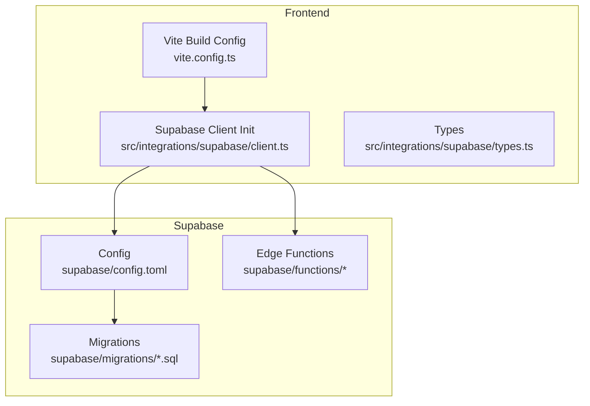
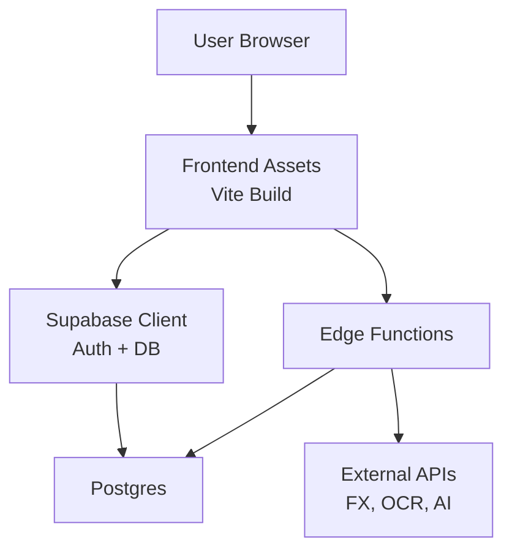
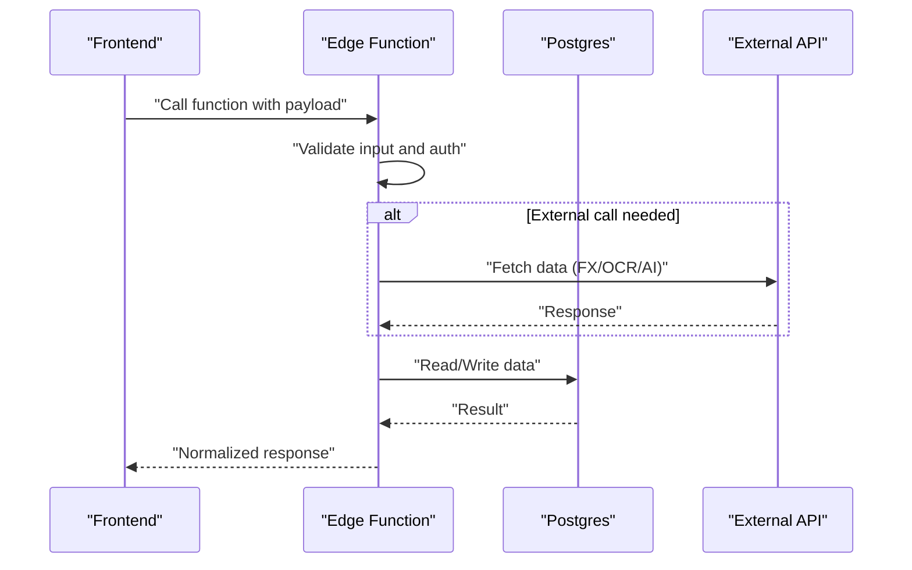

# Deployment and Operations

<cite>
**Referenced Files in This Document**
- [package.json](file://package.json)
- [vite.config.ts](file://vite.config.ts)
- [supabase/config.toml](file://supabase/config.toml)
- [src/integrations/supabase/client.ts](file://src/integrations/supabase/client.ts)
- [src/integrations/supabase/types.ts](file://src/integrations/supabase/types.ts)
- [supabase/functions/_shared/auth.ts](file://supabase/functions/_shared/auth.ts)
- [supabase/functions/_shared/currency.ts](file://supabase/functions/_shared/currency.ts)
- [supabase/functions/get-fx-rates/index.ts](file://supabase/functions/get-fx-rates/index.ts)
- [supabase/functions/parse-asset-csv/index.ts](file://supabase/functions/parse-asset-csv/index.ts)
- [supabase/functions/s3-pre-sign-url/index.ts](file://supabase/functions/s3-pre-sign-url/index.ts)
- [supabase/functions/ai-doctor-chat/index.ts](file://supabase/functions/ai-doctor-chat/index.ts)
- [supabase/functions/compute-xray-report/index.ts](file://supabase/functions/compute-xray-report/index.ts)
- [supabase/functions/create-shared-report/index.ts](file://supabase/functions/create-shared-report/index.ts)
- [supabase/functions/read-shared-report/index.ts](file://supabase/functions/read-shared-report/index.ts)
- [supabase/functions/recognize-holdings-ocr/index.ts](file://supabase/functions/recognize-holdings-ocr/index.ts)
- [supabase/functions/run-stress-test/index.ts](file://supabase/functions/run-stress-test/index.ts)
- [supabase/functions/seed-demo-portfolio/index.ts](file://supabase/functions/seed-demo-portfolio/index.ts)
- [supabase/migrations/20260723121144_c74c73213ed84575a8837d9cd36d15e4.sql](file://supabase/migrations/20260723121144_c74c73213ed84575a8837d9cd36d15e4.sql)
- [supabase/migrations/20260723153952_c71b1045dcdf4f018225805c503c6b0d.sql](file://supabase/migrations/20260723153952_c71b1045dcdf4f018225805c503c6b0d.sql)
- [supabase/migrations/20260723155331_68c1a30a78ff4e48bf404ad2cc6b6efb.sql](file://supabase/migrations/20260723155331_68c1a30a78ff4e48bf404ad2cc6b6efb.sql)
- [supabase/migrations/20260723155413_7c3191b7c8f548c595abf9f78639759b.sql](file://supabase/migrations/20260723155413_7c3191b7c8f548c595abf9f78639759b.sql)
- [supabase/migrations/20260723163446_e5b73a6e70e543bb974e94bd42eaef26.sql](file://supabase/migrations/20260723163446_e5b73a6e70e543bb974e94bd42eaef26.sql)
- [supabase/migrations/20260723173518_0b0744c7dc2e4ce19d0f633f76cc5646.sql](file://supabase/migrations/20260723173518_0b0744c7dc2e4ce19d0f633f76cc5646.sql)
- [supabase/migrations/20260723173615_1714d0fb53f4be484aeaf5ae126285.sql](file://supabase/migrations/20260723173615_1714d0fb53f4be484aeaf5ae126285.sql)
- [supabase/migrations/20260723180315_7037aff8609246c09c1687e43402551b.sql](file://supabase/migrations/20260723180315_7037aff8609246c09c1687e43402551b.sql)
- [supabase/migrations/20260723182152_1ef372d9776d90a8d7d05a24cc6b0d.sql](file://supabase/migrations/20260723182152_1ef372d9776d90a8d7d05a24cc6b0d.sql)
- [supabase/migrations/20260723182205_0a1bea3c91467997d2479b4f8eb5c7.sql](file://supabase/migrations/20260723182205_0a1bea3c91467997d2479b4f8eb5c7.sql)
- [supabase/migrations/20260723182220_768553ba397467997d2479b4f8eb5c7.sql](file://supabase/migrations/20260723182220_768553ba397467997d2479b4f8eb5c7.sql)
- [supabase/migrations/20260723182238_2c1e9690de1436f84aeaf5ae126285.sql](file://supabase/migrations/20260723182238_2c1e9690de1436f84aeaf5ae126285.sql)
- [supabase/migrations/20260723182351_edc67191b7c8f548c595abf9f78639759b.sql](file://supabase/migrations/20260723182351_edc67191b7c8f548c595abf9f78639759b.sql)
- [supabase/migrations/20260723185127_9c934d4b04604c869e002834dbecdb47.sql](file://supabase/migrations/20260723185127_9c934d4b04604c869e002834dbecdb47.sql)
- [supabase/migrations/20260723193427_c3d317b84bc14b6391cd2ce84628a6aa.sql](file://supabase/migrations/20260723193427_c3d317b84bc14b6391cd2ce84628a6aa.sql)
- [supabase/migrations/20260723193624_d41656f9e95f430a82546bc3044e545a.sql](file://supabase/migrations/20260723193624_d41656f9e95f430a82546bc3044e545a.sql)
</cite>

## Table of Contents
1. Introduction
2. Project Structure
3. Core Components
4. Architecture Overview
5. Detailed Component Analysis
6. Dependency Analysis
7. Performance Considerations
8. Troubleshooting Guide
9. Conclusion
10. Appendices

## Introduction
This document provides production deployment and operations guidance for FinSight, a Supabase-backed web application with Edge Functions. It covers project setup, environment configuration, database migrations, Edge Functions deployment, security posture, monitoring and logging, performance tuning, caching strategies, backup and recovery, disaster recovery planning, scaling considerations, maintenance procedures, update processes, and rollback strategies.

## Project Structure
FinSight is a Vite-based frontend integrated with Supabase (client SDK), Supabase Edge Functions, and SQL migrations. The repository includes:
- Frontend build and runtime configuration
- Supabase client initialization and types
- Edge Functions for business logic and integrations
- SQL migration files for schema evolution



**Diagram sources**
- [vite.config.ts](file://vite.config.ts)
- [src/integrations/supabase/client.ts](file://src/integrations/supabase/client.ts)
- [src/integrations/supabase/types.ts](file://src/integrations/supabase/types.ts)
- [supabase/config.toml](file://supabase/config.toml)
- [supabase/functions/get-fx-rates/index.ts](file://supabase/functions/get-fx-rates/index.ts)
- [supabase/migrations/20260723121144_c74c73213ed84575a8837d9cd36d15e4.sql](file://supabase/migrations/20260723121144_c74c73213ed84575a8837d9cd36d15e4.sql)

**Section sources**
- [package.json](file://package.json)
- [vite.config.ts](file://vite.config.ts)
- [supabase/config.toml](file://supabase/config.toml)

## Core Components
- Supabase client integration and typed helpers for DB access and auth flows.
- Edge Functions implementing FX rates retrieval, CSV parsing, S3 pre-signed URLs, OCR recognition, shared report generation, X-ray computation, AI chat, stress testing, and demo seeding.
- SQL migrations defining the data model and policies.

Key responsibilities:
- Environment-driven configuration via Supabase client and function secrets.
- Secure server-side operations behind Edge Functions.
- Schema versioning through migrations.

**Section sources**
- [src/integrations/supabase/client.ts](file://src/integrations/supabase/client.ts)
- [src/integrations/supabase/types.ts](file://src/integrations/supabase/types.ts)
- [supabase/functions/_shared/auth.ts](file://supabase/functions/_shared/auth.ts)
- [supabase/functions/_shared/currency.ts](file://supabase/functions/_shared/currency.ts)
- [supabase/functions/get-fx-rates/index.ts](file://supabase/functions/get-fx-rates/index.ts)
- [supabase/functions/parse-asset-csv/index.ts](file://supabase/functions/parse-asset-csv/index.ts)
- [supabase/functions/s3-pre-sign-url/index.ts](file://supabase/functions/s3-pre-sign-url/index.ts)
- [supabase/functions/ai-doctor-chat/index.ts](file://supabase/functions/ai-doctor-chat/index.ts)
- [supabase/functions/compute-xray-report/index.ts](file://supabase/functions/compute-xray-report/index.ts)
- [supabase/functions/create-shared-report/index.ts](file://supabase/functions/create-shared-report/index.ts)
- [supabase/functions/read-shared-report/index.ts](file://supabase/functions/read-shared-report/index.ts)
- [supabase/functions/recognize-holdings-ocr/index.ts](file://supabase/functions/recognize-holdings-ocr/index.ts)
- [supabase/functions/run-stress-test/index.ts](file://supabase/functions/run-stress-test/index.ts)
- [supabase/functions/seed-demo-portfolio/index.ts](file://supabase/functions/seed-demo-portfolio/index.ts)

## Architecture Overview
The production architecture consists of:
- Static frontend assets served from a CDN or hosting provider.
- Supabase as backend-as-a-service providing Postgres, Auth, Storage, and Edge Functions.
- Edge Functions handling sensitive operations and external API calls.
- Migrations applied to evolve the database schema safely.



[No sources needed since this diagram shows conceptual workflow, not actual code structure]

## Detailed Component Analysis

### Supabase Project Setup
- Create a new Supabase project and note the project URL and anon/public key.
- Configure environment variables in your hosting platform to point the Supabase client at the production project.
- Enable required features: Database, Authentication, Storage, and Edge Functions.
- Set up Row Level Security (RLS) policies and storage bucket policies as defined by your migrations and functions.

Operational notes:
- Keep anon keys scoped to public endpoints only; use service role keys exclusively on the server side if you ever run server-side code outside Edge Functions.
- Restrict CORS origins to your production domain(s).

**Section sources**
- [src/integrations/supabase/client.ts](file://src/integrations/supabase/client.ts)
- [supabase/config.toml](file://supabase/config.toml)

### Environment Variable Configuration
Required environment variables typically include:
- Supabase project URL and anon key for the client SDK.
- Secrets for Edge Functions (API keys, tokens) configured via Supabase CLI or dashboard.
- Optional feature flags for analytics, error tracking, or third-party services.

Best practices:
- Use per-environment variable sets (development, staging, production).
- Never commit secrets to source control.
- Validate presence of critical variables at startup and fail fast with clear errors.

**Section sources**
- [src/integrations/supabase/client.ts](file://src/integrations/supabase/client.ts)
- [supabase/config.toml](file://supabase/config.toml)

### Database Migration Procedures
- Maintain all schema changes as SQL migration files under supabase/migrations.
- Apply migrations to production using the Supabase CLI or Dashboard after review.
- Ensure idempotent design where possible and test migrations against a staging copy first.
- Back up the database before applying migrations in production.

Rollback strategy:
- Prepare reverse migrations or scripted rollbacks that revert schema changes safely.
- If a migration fails mid-way, restore from the latest known-good backup and reapply only safe migrations.

**Section sources**
- [supabase/migrations/20260723121144_c74c73213ed84575a8837d9cd36d15e4.sql](file://supabase/migrations/20260723121144_c74c73213ed84575a8837d9cd36d15e4.sql)
- [supabase/migrations/20260723153952_c71b1045dcdf4f018225805c503c6b0d.sql](file://supabase/migrations/20260723153952_c71b1045dcdf4f018225805c503c6b0d.sql)
- [supabase/migrations/20260723155331_68c1a30a78ff4e48bf404ad2cc6b6efb.sql](file://supabase/migrations/20260723155331_68c1a30a78ff4e48bf404ad2cc6b6efb.sql)
- [supabase/migrations/20260723155413_7c3191b7c8f548c595abf9f78639759b.sql](file://supabase/migrations/20260723155413_7c3191b7c8f548c595abf9f78639759b.sql)
- [supabase/migrations/20260723163446_e5b73a6e70e543bb974e94bd42eaef26.sql](file://supabase/migrations/20260723163446_e5b73a6e70e543bb974e94bd42eaef26.sql)
- [supabase/migrations/20260723173518_0b0744c7dc2e4ce19d0f633f76cc5646.sql](file://supabase/migrations/20260723173518_0b0744c7dc2e4ce19d0f633f76cc5646.sql)
- [supabase/migrations/20260723173615_1714d0fb53f4be484aeaf5ae126285.sql](file://supabase/migrations/20260723173615_1714d0fb53f4be484aeaf5ae126285.sql)
- [supabase/migrations/20260723180315_7037aff8609246c09c1687e43402551b.sql](file://supabase/migrations/20260723180315_7037aff8609246c09c1687e43402551b.sql)
- [supabase/migrations/20260723182152_1ef372d9776d90a8d7d05a24cc6b0d.sql](file://supabase/migrations/20260723182152_1ef372d9776d90a8d7d05a24cc6b0d.sql)
- [supabase/migrations/20260723182205_0a1bea3c91467997d2479b4f8eb5c7.sql](file://supabase/migrations/20260723182205_0a1bea3c91467997d2479b4f8eb5c7.sql)
- [supabase/migrations/20260723182220_768553ba397467997d2479b4f8eb5c7.sql](file://supabase/migrations/20260723182220_768553ba397467997d2479b4f8eb5c7.sql)
- [supabase/migrations/20260723182238_2c1e9690de1436f84aeaf5ae126285.sql](file://supabase/migrations/20260723182238_2c1e9690de1436f84aeaf5ae126285.sql)
- [supabase/migrations/20260723182351_edc67191b7c8f548c595abf9f78639759b.sql](file://supabase/migrations/20260723182351_edc67191b7c8f548c595abf9f78639759b.sql)
- [supabase/migrations/20260723185127_9c934d4b04604c869e002834dbecdb47.sql](file://supabase/migrations/20260723185127_9c934d4b04604c869e002834dbecdb47.sql)
- [supabase/migrations/20260723193427_c3d317b84bc14b6391cd2ce84628a6aa.sql](file://supabase/migrations/20260723193427_c3d317b84bc14b6391cd2ce84628a6aa.sql)
- [supabase/migrations/20260723193624_d41656f9e95f430a82546bc3044e545a.sql](file://supabase/migrations/20260723193624_d41656f9e95f430a82546bc3044e545a.sql)

### Edge Functions Deployment
Deployments:
- Use the Supabase CLI to deploy Edge Functions to production.
- Pin versions and tag releases to enable reproducible deployments.
- Separate dev/staging/prod environments and rotate secrets per environment.

Security configuration:
- Enforce authentication checks within functions using shared auth utilities.
- Validate inputs rigorously and sanitize outputs.
- Limit function timeouts and memory usage appropriate to workload.
- Use least-privilege RLS policies and restrict direct DB access from the client.

Monitoring and observability:
- Log structured events inside functions for request tracing and error context.
- Capture latency and error rates; integrate with an external logging/analytics provider if needed.



**Diagram sources**
- [supabase/functions/get-fx-rates/index.ts](file://supabase/functions/get-fx-rates/index.ts)
- [supabase/functions/parse-asset-csv/index.ts](file://supabase/functions/parse-asset-csv/index.ts)
- [supabase/functions/s3-pre-sign-url/index.ts](file://supabase/functions/s3-pre-sign-url/index.ts)
- [supabase/functions/ai-doctor-chat/index.ts](file://supabase/functions/ai-doctor-chat/index.ts)
- [supabase/functions/compute-xray-report/index.ts](file://supabase/functions/compute-xray-report/index.ts)
- [supabase/functions/_shared/auth.ts](file://supabase/functions/_shared/auth.ts)
- [supabase/functions/_shared/currency.ts](file://supabase/functions/_shared/currency.ts)

**Section sources**
- [supabase/functions/_shared/auth.ts](file://supabase/functions/_shared/auth.ts)
- [supabase/functions/_shared/currency.ts](file://supabase/functions/_shared/currency.ts)
- [supabase/functions/get-fx-rates/index.ts](file://supabase/functions/get-fx-rates/index.ts)
- [supabase/functions/parse-asset-csv/index.ts](file://supabase/functions/parse-asset-csv/index.ts)
- [supabase/functions/s3-pre-sign-url/index.ts](file://supabase/functions/s3-pre-sign-url/index.ts)
- [supabase/functions/ai-doctor-chat/index.ts](file://supabase/functions/ai-doctor-chat/index.ts)
- [supabase/functions/compute-xray-report/index.ts](file://supabase/functions/compute-xray-report/index.ts)
- [supabase/functions/create-shared-report/index.ts](file://supabase/functions/create-shared-report/index.ts)
- [supabase/functions/read-shared-report/index.ts](file://supabase/functions/read-shared-report/index.ts)
- [supabase/functions/recognize-holdings-ocr/index.ts](file://supabase/functions/recognize-holdings-ocr/index.ts)
- [supabase/functions/run-stress-test/index.ts](file://supabase/functions/run-stress-test/index.ts)
- [supabase/functions/seed-demo-portfolio/index.ts](file://supabase/functions/seed-demo-portfolio/index.ts)

### Security Configuration
- Enforce RLS policies on all tables accessed by clients.
- Store secrets in Supabase secrets and reference them in Edge Functions.
- Restrict Storage bucket permissions and use pre-signed URLs for uploads.
- Validate and sanitize all user inputs; reject malformed payloads early.
- Use HTTPS-only cookies and secure headers for the frontend.

**Section sources**
- [supabase/functions/s3-pre-sign-url/index.ts](file://supabase/functions/s3-pre-sign-url/index.ts)
- [supabase/functions/_shared/auth.ts](file://supabase/functions/_shared/auth.ts)

### Monitoring and Logging Implementation
- Implement structured logging in Edge Functions with correlation IDs.
- Track function duration, success/failure rates, and upstream API latencies.
- Centralize logs in a SIEM or log aggregation tool.
- Set up dashboards for key metrics: requests per minute, p95 latency, error rate, and downstream dependency health.

Alerting:
- Alert on error rate spikes, latency thresholds, and dependency failures.
- Page on-call when critical functions fail repeatedly or exceed timeout limits.

**Section sources**
- [supabase/functions/get-fx-rates/index.ts](file://supabase/functions/get-fx-rates/index.ts)
- [supabase/functions/ai-doctor-chat/index.ts](file://supabase/functions/ai-doctor-chat/index.ts)
- [supabase/functions/compute-xray-report/index.ts](file://supabase/functions/compute-xray-report/index.ts)

### Production Build Optimization
- Enable production builds with minification, tree-shaking, and asset optimization.
- Configure caching headers for static assets and API responses where appropriate.
- Preload critical resources and defer non-critical scripts.
- Use CDN caching for immutable assets with content hashes.

**Section sources**
- [vite.config.ts](file://vite.config.ts)

### Caching Strategies
- Cache FX rates for a short TTL to reduce external API calls.
- Cache computed reports and shared reports with invalidation on data changes.
- Use browser cache for static assets; leverage CDN edge caching for API responses when safe.

**Section sources**
- [supabase/functions/get-fx-rates/index.ts](file://supabase/functions/get-fx-rates/index.ts)
- [supabase/functions/create-shared-report/index.ts](file://supabase/functions/create-shared-report/index.ts)
- [supabase/functions/read-shared-report/index.ts](file://supabase/functions/read-shared-report/index.ts)

### Performance Tuning Guidelines
- Optimize queries and add indexes based on observed query patterns.
- Reduce payload sizes by selecting only necessary fields.
- Batch operations where possible and avoid N+1 queries.
- Tune Edge Function concurrency and timeouts according to workload profiles.

**Section sources**
- [supabase/migrations/20260723121144_c74c73213ed84575a8837d9cd36d15e4.sql](file://supabase/migrations/20260723121144_c74c73213ed84575a8837d9cd36d15e4.sql)

### Backup and Recovery Procedures
- Schedule automated backups of the Supabase database.
- Test restores regularly to ensure recoverability.
- For large datasets, consider logical dumps and offsite storage.
- Document RPO/RTO targets and validate against real incidents.

Disaster Recovery Planning:
- Define multi-region replication if supported by your Supabase plan.
- Maintain runbooks for common failure scenarios (data corruption, accidental deletion, function regressions).
- Conduct periodic DR drills.

**Section sources**
- [supabase/config.toml](file://supabase/config.toml)

### Scaling Considerations
- Scale horizontally by distributing traffic across multiple regions if available.
- Use CDN for static assets and cacheable API responses.
- Monitor Edge Function cold starts and optimize initialization paths.
- Right-size database plans and adjust connection pools as needed.

[No sources needed since this section provides general guidance]

### Maintenance Procedures
- Regularly review and apply security patches for dependencies.
- Rotate secrets periodically and audit access logs.
- Review and prune unused Edge Functions and migrations.
- Perform capacity reviews and adjust resource allocations.

Update Processes:
- Deploy Edge Functions and migrations in a staged manner (staging then production).
- Feature-flag risky changes and monitor closely post-deploy.
- Run smoke tests and synthetic transactions after updates.

Rollback Strategies:
- Keep previous versions of Edge Functions and artifacts accessible.
- Prepare reverse migrations for schema changes.
- Revert frontend builds quickly by redeploying the last known-good version.

**Section sources**
- [supabase/config.toml](file://supabase/config.toml)

## Dependency Analysis
The frontend depends on the Supabase client and types, while Edge Functions encapsulate server-side logic and external integrations. Migrations define the canonical schema used by both client and functions.

```mermaid
graph LR
FE["Frontend<br/>vite.config.ts"] --> SC["Supabase Client<br/>client.ts"]
SC --> Types["Types<br/>types.ts"]
SC --> EFs["Edge Functions"]
EFs --> DB["Postgres"]
EFs --> Ext["External APIs"]
DB <- --> Mig["Migrations"]
```

**Diagram sources**
- [vite.config.ts](file://vite.config.ts)
- [src/integrations/supabase/client.ts](file://src/integrations/supabase/client.ts)
- [src/integrations/supabase/types.ts](file://src/integrations/supabase/types.ts)
- [supabase/functions/get-fx-rates/index.ts](file://supabase/functions/get-fx-rates/index.ts)
- [supabase/migrations/20260723121144_c74c73213ed84575a8837d9cd36d15e4.sql](file://supabase/migrations/20260723121144_c74c73213ed84575a8837d9cd36d15e4.sql)

**Section sources**
- [package.json](file://package.json)
- [vite.config.ts](file://vite.config.ts)
- [src/integrations/supabase/client.ts](file://src/integrations/supabase/client.ts)
- [src/integrations/supabase/types.ts](file://src/integrations/supabase/types.ts)

## Performance Considerations
- Prefer server-side processing for heavy computations in Edge Functions.
- Minimize network round-trips by batching requests and using efficient schemas.
- Leverage caching layers (CDN, function-level caches) for stable data like FX rates.
- Profile and tune database queries; add indexes judiciously.

[No sources needed since this section provides general guidance]

## Troubleshooting Guide
Common issues and resolutions:
- Missing environment variables: Validate presence at startup and surface clear errors.
- Edge Function timeouts: Increase timeouts cautiously and optimize logic.
- RLS denials: Verify policies and function roles; ensure authenticated context is passed correctly.
- Storage upload failures: Confirm pre-signed URL validity and bucket policies.
- Migration conflicts: Roll back to a known state and reapply migrations incrementally.

Diagnostic steps:
- Inspect function logs for stack traces and correlation IDs.
- Check database query plans and slow query logs.
- Validate external API availability and rate limits.

**Section sources**
- [supabase/functions/_shared/auth.ts](file://supabase/functions/_shared/auth.ts)
- [supabase/functions/s3-pre-sign-url/index.ts](file://supabase/functions/s3-pre-sign-url/index.ts)
- [supabase/functions/get-fx-rates/index.ts](file://supabase/functions/get-fx-rates/index.ts)

## Conclusion
By following the procedures outlined here—environment configuration, secure Edge Functions, robust migrations, comprehensive monitoring, and disciplined release management—you can operate FinSight reliably in production. Prioritize observability, automate backups, and maintain clear rollback paths to ensure resilience and rapid recovery.

## Appendices

### Appendix A: Key Endpoints and Responsibilities
- FX Rates: Retrieve and cache exchange rates.
- CSV Parsing: Parse uploaded holdings into normalized structures.
- S3 Pre-Signed URL: Generate secure upload links for documents.
- OCR Recognition: Extract holdings from images.
- Shared Reports: Create and read shareable portfolio snapshots.
- X-Ray Report: Compute detailed analytics.
- AI Doctor Chat: Interact with AI assistant securely.
- Stress Test: Simulate load for validation.
- Seed Demo: Populate sample data for demos.

**Section sources**
- [supabase/functions/get-fx-rates/index.ts](file://supabase/functions/get-fx-rates/index.ts)
- [supabase/functions/parse-asset-csv/index.ts](file://supabase/functions/parse-asset-csv/index.ts)
- [supabase/functions/s3-pre-sign-url/index.ts](file://supabase/functions/s3-pre-sign-url/index.ts)
- [supabase/functions/recognize-holdings-ocr/index.ts](file://supabase/functions/recognize-holdings-ocr/index.ts)
- [supabase/functions/create-shared-report/index.ts](file://supabase/functions/create-shared-report/index.ts)
- [supabase/functions/read-shared-report/index.ts](file://supabase/functions/read-shared-report/index.ts)
- [supabase/functions/compute-xray-report/index.ts](file://supabase/functions/compute-xray-report/index.ts)
- [supabase/functions/ai-doctor-chat/index.ts](file://supabase/functions/ai-doctor-chat/index.ts)
- [supabase/functions/run-stress-test/index.ts](file://supabase/functions/run-stress-test/index.ts)
- [supabase/functions/seed-demo-portfolio/index.ts](file://supabase/functions/seed-demo-portfolio/index.ts)