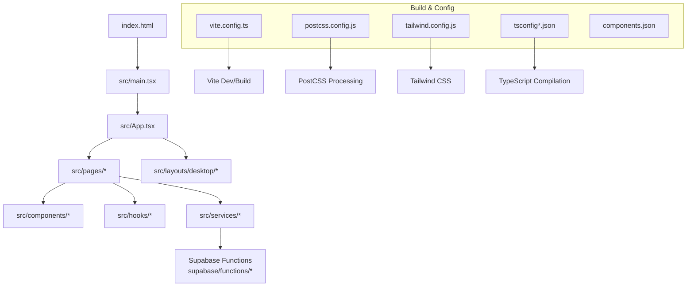
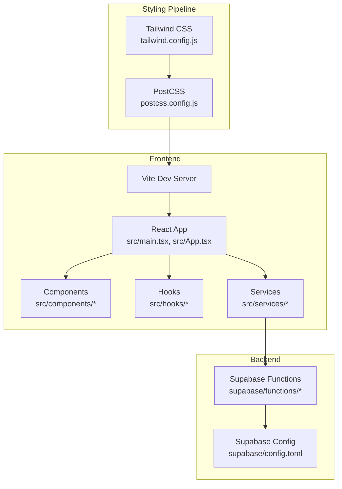
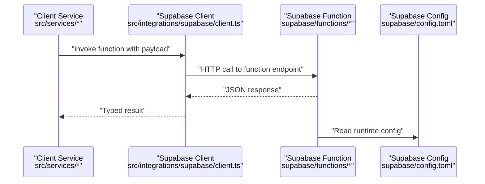

# Development Guide

<cite>
**Referenced Files in This Document**
- [package.json](file://package.json)
- [vite.config.ts](file://vite.config.ts)
- [postcss.config.js](file://postcss.config.js)
- [tailwind.config.js](file://tailwind.config.js)
- [tsconfig.json](file://tsconfig.json)
- [tsconfig.app.json](file://tsconfig.app.json)
- [tsconfig.node.json](file://tsconfig.node.json)
- [components.json](file://components.json)
- [index.html](file://index.html)
- [src/main.tsx](file://src/main.tsx)
- [src/App.tsx](file://src/App.tsx)
- [src/index.css](file://src/index.css)
- [src/vite-env.d.ts](file://src/vite-env.d.ts)
- [supabase/config.toml](file://supabase/config.toml)
</cite>

## Table of Contents
1. [Introduction](#introduction)
2. [Project Structure](#project-structure)
3. [Core Components](#core-components)
4. [Architecture Overview](#architecture-overview)
5. [Detailed Component Analysis](#detailed-component-analysis)
6. [Dependency Analysis](#dependency-analysis)
7. [Performance Considerations](#performance-considerations)
8. [Troubleshooting Guide](#troubleshooting-guide)
9. [Conclusion](#conclusion)
10. [Appendices](#appendices)

## Introduction
This development guide explains how to set up a local development environment for FinSight, the coding standards and conventions used across the codebase, the build system configuration (Vite, PostCSS, Tailwind CSS), testing strategy, debugging techniques, performance profiling tools, Git workflow, pull request process, code review guidelines, and troubleshooting steps for common issues. The goal is to help contributors get productive quickly while maintaining consistency and quality.

## Project Structure
FinSight is a TypeScript + React application built with Vite and styled using Tailwind CSS via PostCSS. It integrates with Supabase for backend services and functions. The source tree follows a feature-oriented layout:

- src/components: UI components organized by platform (desktop) and shared primitives (ui).
- src/hooks: Custom React hooks encapsulating business logic and data access patterns.
- src/integrations/supabase: Supabase client and generated types.
- src/layouts/desktop: Layout components for desktop views.
- src/lib: Shared utilities and domain helpers.
- src/pages: Page-level components that compose features.
- src/services: Client-side service modules that call Supabase functions or APIs.
- supabase: Serverless functions, migrations, and Supabase configuration.

**Diagram sources**
- [index.html:1-20](file://index.html#L1-L20)
- [src/main.tsx:1-40](file://src/main.tsx#L1-L40)
- [src/App.tsx:1-60](file://src/App.tsx#L1-L60)
- [vite.config.ts:1-80](file://vite.config.ts#L1-L80)
- [postcss.config.js:1-40](file://postcss.config.js#L1-L40)
- [tailwind.config.js:1-60](file://tailwind.config.js#L1-L60)
- [tsconfig.json:1-40](file://tsconfig.json#L1-L40)
- [tsconfig.app.json:1-40](file://tsconfig.app.json#L1-L40)
- [tsconfig.node.json:1-40](file://tsconfig.node.json#L1-L40)
- [components.json:1-40](file://components.json#L1-L40)

**Section sources**
- [index.html:1-20](file://index.html#L1-L20)
- [src/main.tsx:1-40](file://src/main.tsx#L1-L40)
- [src/App.tsx:1-60](file://src/App.tsx#L1-L60)
- [vite.config.ts:1-80](file://vite.config.ts#L1-L80)
- [postcss.config.js:1-40](file://postcss.config.js#L1-L40)
- [tailwind.config.js:1-60](file://tailwind.config.js#L1-L60)
- [tsconfig.json:1-40](file://tsconfig.json#L1-L40)
- [tsconfig.app.json:1-40](file://tsconfig.app.json#L1-L40)
- [tsconfig.node.json:1-40](file://tsconfig.node.json#L1-L40)
- [components.json:1-40](file://components.json#L1-L40)

## Core Components
- Application entrypoint: Initializes the React app and mounts it into the DOM.
- App shell: Composes routes, layouts, and global providers.
- Pages: Feature containers that orchestrate components, hooks, and services.
- Services: Encapsulate calls to Supabase functions and external APIs.
- Hooks: Reusable logic for state, side effects, and data fetching.
- UI primitives: Reusable, accessible components under src/components/ui.

Key responsibilities:
- src/main.tsx: Bootstraps the app and renders the root component.
- src/App.tsx: Defines top-level structure and routing integration.
- src/index.css: Global styles and Tailwind directives.
- vite.config.ts: Build configuration for Vite, including plugins and aliases.
- postcss.config.js: PostCSS pipeline configuration.
- tailwind.config.js: Tailwind customization and plugin setup.
- tsconfig.*: TypeScript project settings for app and Node tooling.
- components.json: shadcn/ui configuration for component scaffolding.

**Section sources**
- [src/main.tsx:1-40](file://src/main.tsx#L1-L40)
- [src/App.tsx:1-60](file://src/App.tsx#L1-L60)
- [src/index.css:1-40](file://src/index.css#L1-L40)
- [vite.config.ts:1-80](file://vite.config.ts#L1-L80)
- [postcss.config.js:1-40](file://postcss.config.js#L1-L40)
- [tailwind.config.js:1-60](file://tailwind.config.js#L1-L60)
- [tsconfig.json:1-40](file://tsconfig.json#L1-L40)
- [tsconfig.app.json:1-40](file://tsconfig.app.json#L1-L40)
- [tsconfig.node.json:1-40](file://tsconfig.node.json#L1-L40)
- [components.json:1-40](file://components.json#L1-L40)

## Architecture Overview
The frontend architecture centers on a React application orchestrated by Vite. Tailwind CSS provides utility-first styling processed through PostCSS. Supabase functions handle server-side logic invoked from client services.

**Diagram sources**
- [vite.config.ts:1-80](file://vite.config.ts#L1-L80)
- [src/main.tsx:1-40](file://src/main.tsx#L1-L40)
- [src/App.tsx:1-60](file://src/App.tsx#L1-L60)
- [postcss.config.js:1-40](file://postcss.config.js#L1-L40)
- [tailwind.config.js:1-60](file://tailwind.config.js#L1-L60)
- [supabase/config.toml:1-40](file://supabase/config.toml#L1-L40)

## Detailed Component Analysis

### Build System Configuration
- Vite: Centralized build and dev server configuration. Look for plugins, alias mappings, and environment handling.
- PostCSS: Processes CSS with Tailwind and other plugins; ensure order and plugin compatibility.
- Tailwind CSS: Utility classes, theme customization, and plugin integrations.
- TypeScript: Separate configs for app and Node tooling; strictness and path mapping are defined here.
- shadcn/ui: Component scaffolding configuration for consistent UI primitives.

Recommended checks:
- Verify Vite plugins match your needs (e.g., React, path aliases).
- Ensure PostCSS plugins align with Tailwind version and any additional processors.
- Confirm Tailwind content paths include all component directories.
- Validate tsconfig paths and module resolution for imports.

**Section sources**
- [vite.config.ts:1-80](file://vite.config.ts#L1-L80)
- [postcss.config.js:1-40](file://postcss.config.js#L1-L40)
- [tailwind.config.js:1-60](file://tailwind.config.js#L1-L60)
- [tsconfig.json:1-40](file://tsconfig.json#L1-L40)
- [tsconfig.app.json:1-40](file://tsconfig.app.json#L1-L40)
- [tsconfig.node.json:1-40](file://tsconfig.node.json#L1-L40)
- [components.json:1-40](file://components.json#L1-L40)

### Frontend Entry and Shell
- Entry point initializes the React tree and attaches it to the DOM.
- App shell composes pages, layouts, and global providers.
- Global styles import Tailwind directives and custom overrides.

Best practices:
- Keep initialization minimal in the entrypoint.
- Use the app shell for cross-cutting concerns like providers and error boundaries.
- Import global styles once at the top level.

**Section sources**
- [src/main.tsx:1-40](file://src/main.tsx#L1-L40)
- [src/App.tsx:1-60](file://src/App.tsx#L1-L60)
- [src/index.css:1-40](file://src/index.css#L1-L40)

### Service Layer and Supabase Integration
- Services encapsulate calls to Supabase functions and manage payloads and errors.
- Supabase client and types are centralized under integrations/supabase.
- Functions implement server-side logic such as parsing CSVs, OCR, FX rates, stress tests, and report generation.

Integration flow example:

**Diagram sources**
- [src/integrations/supabase/client.ts:1-60](file://src/integrations/supabase/client.ts#L1-L60)
- [supabase/config.toml:1-40](file://supabase/config.toml#L1-L40)

**Section sources**
- [src/integrations/supabase/client.ts:1-60](file://src/integrations/supabase/client.ts#L1-L60)
- [supabase/config.toml:1-40](file://supabase/config.toml#L1-L40)

### UI Primitives and Organization
- UI primitives live under src/components/ui and follow consistent props and accessibility patterns.
- Desktop-specific components reside under src/components/desktop.
- SVG icons are centralized and reused across components.

Guidelines:
- Prefer composition over prop drilling; use context where appropriate.
- Keep UI primitives small, focused, and testable.
- Use consistent naming: PascalCase for components, camelCase for props and functions.

**Section sources**
- [src/components/ui/button.tsx:1-60](file://src/components/ui/button.tsx#L1-L60)
- [src/components/ui/dialog.tsx:1-60](file://src/components/ui/dialog.tsx#L1-L60)
- [src/components/ui/table.tsx:1-60](file://src/components/ui/table.tsx#L1-L60)
- [src/components/ui/form.tsx:1-60](file://src/components/ui/form.tsx#L1-L60)
- [src/components/ui/select.tsx:1-60](file://src/components/ui/select.tsx#L1-L60)
- [src/components/ui/tabs.tsx:1-60](file://src/components/ui/tabs.tsx#L1-L60)
- [src/components/ui/dropdown-menu.tsx:1-60](file://src/components/ui/dropdown-menu.tsx#L1-L60)
- [src/components/ui/popover.tsx:1-60](file://src/components/ui/popover.tsx#L1-L60)
- [src/components/ui/calendar.tsx:1-60](file://src/components/ui/calendar.tsx#L1-L60)
- [src/components/ui/date-picker.tsx:1-60](file://src/components/ui/date-picker.tsx#L1-L60)
- [src/components/ui/accordion.tsx:1-60](file://src/components/ui/accordion.tsx#L1-L60)
- [src/components/ui/alert.tsx:1-60](file://src/components/ui/alert.tsx#L1-L60)
- [src/components/ui/badge.tsx:1-60](file://src/components/ui/badge.tsx#L1-L60)
- [src/components/ui/card.tsx:1-60](file://src/components/ui/card.tsx#L1-L60)
- [src/components/ui/input.tsx:1-60](file://src/components/ui/input.tsx#L1-L60)
- [src/components/ui/label.tsx:1-60](file://src/components/ui/label.tsx#L1-L60)
- [src/components/ui/switch.tsx:1-60](file://src/components/ui/switch.tsx#L1-L60)
- [src/components/ui/slider.tsx:1-60](file://src/components/ui/slider.tsx#L1-L60)
- [src/components/ui/checkbox.tsx:1-60](file://src/components/ui/checkbox.tsx#L1-L60)
- [src/components/ui/radio-group.tsx:1-60](file://src/components/ui/radio-group.tsx#L1-L60)
- [src/components/ui/progress.tsx:1-60](file://src/components/ui/progress.tsx#L1-L60)
- [src/components/ui/avatar.tsx:1-60](file://src/components/ui/avatar.tsx#L1-L60)
- [src/components/ui/breadcrumb.tsx:1-60](file://src/components/ui/breadcrumb.tsx#L1-L60)
- [src/components/ui/collapsible.tsx:1-60](file://src/components/ui/collapsible.tsx#L1-L60)
- [src/components/ui/command.tsx:1-60](file://src/components/ui/command.tsx#L1-L60)
- [src/components/ui/context-menu.tsx:1-60](file://src/components/ui/context-menu.tsx#L1-L60)
- [src/components/ui/drawer.tsx:1-60](file://src/components/ui/drawer.tsx#L1-L60)
- [src/components/ui/hover-card.tsx:1-60](file://src/components/ui/hover-card.tsx#L1-L60)
- [src/components/ui/input-otp.tsx:1-60](file://src/components/ui/input-otp.tsx#L1-L60)
- [src/components/ui/menubar.tsx:1-60](file://src/components/ui/menubar.tsx#L1-L60)
- [src/components/ui/navigation-menu.tsx:1-60](file://src/components/ui/navigation-menu.tsx#L1-L60)
- [src/components/ui/pagination.tsx:1-60](file://src/components/ui/pagination.tsx#L1-L60)
- [src/components/ui/resizable.tsx:1-60](file://src/components/ui/resizable.tsx#L1-L60)
- [src/components/ui/scroll-area.tsx:1-60](file://src/components/ui/scroll-area.tsx#L1-L60)
- [src/components/ui/separator.tsx:1-60](file://src/components/ui/separator.tsx#L1-L60)
- [src/components/ui/sheet.tsx:1-60](file://src/components/ui/sheet.tsx#L1-L60)
- [src/components/ui/skeleton.tsx:1-60](file://src/components/ui/skeleton.tsx#L1-L60)
- [src/components/ui/toggle.tsx:1-60](file://src/components/ui/toggle.tsx#L1-L60)
- [src/components/ui/toggle-group.tsx:1-60](file://src/components/ui/toggle-group.tsx#L1-L60)
- [src/components/ui/tooltip.tsx:1-60](file://src/components/ui/tooltip.tsx#L1-L60)
- [src/components/ui/carousel.tsx:1-60](file://src/components/ui/carousel.tsx#L1-L60)
- [src/components/ui/aspect-ratio.tsx:1-60](file://src/components/ui/aspect-ratio.tsx#L1-L60)
- [src/components/ui/sonner.tsx:1-60](file://src/components/ui/sonner.tsx#L1-L60)
- [src/components/ui/svg/svg-icon.tsx:1-60](file://src/components/ui/svg/svg-icon.tsx#L1-L60)
- [src/components/ui/svg/svg-icon-resources.tsx:1-60](file://src/components/ui/svg/svg-icon-resources.tsx#L1-L60)

## Dependency Analysis
- Package manager: pnpm is used (lockfile present).
- Runtime dependencies: React, Vite, TypeScript, Tailwind CSS, PostCSS, Supabase client, and related tooling.
- Build-time dependencies: Vite plugins, PostCSS plugins, Tailwind CLI or plugin, type definitions.

Recommendations:
- Pin versions in package.json to avoid drift.
- Keep devDependencies separate from runtime dependencies.
- Regularly audit dependencies for security updates.

**Section sources**
- [package.json:1-120](file://package.json#L1-L120)
- [pnpm-lock.yaml:1-40](file://pnpm-lock.yaml#L1-L40)

## Performance Considerations
- Code splitting: Leverage dynamic imports for heavy pages or features.
- Tree-shaking: Ensure unused exports are not imported; prefer named imports.
- Asset optimization: Configure image and font optimizations in Vite if needed.
- Styling: Avoid large CSS bundles by relying on Tailwind’s purging and avoiding unnecessary plugins.
- Network requests: Batch or cache API responses where possible; consider optimistic updates.
- Profiling: Use browser DevTools Performance tab and React Profiler to identify bottlenecks.

[No sources needed since this section provides general guidance]

## Troubleshooting Guide
Common issues and resolutions:
- Node.js version mismatch: Ensure you are using the required Node.js version specified in the project configuration.
- Package manager conflicts: Use pnpm consistently; do not mix npm/yarn with pnpm lockfiles.
- Tailwind not applying: Verify PostCSS and Tailwind configurations and that content paths include all component files.
- TypeScript errors: Check tsconfig settings and ensure path aliases resolve correctly.
- Vite dev server issues: Clear caches, reinstall dependencies, and restart the server.
- Supabase function invocation failures: Validate environment variables and function endpoints; check logs in Supabase dashboard.

Environment checklist:
- Install Node.js matching the project’s required version.
- Install pnpm globally if not present.
- Run dependency installation with pnpm install.
- Start the dev server with the configured script.

**Section sources**
- [package.json:1-120](file://package.json#L1-L120)
- [vite.config.ts:1-80](file://vite.config.ts#L1-L80)
- [postcss.config.js:1-40](file://postcss.config.js#L1-L40)
- [tailwind.config.js:1-60](file://tailwind.config.js#L1-L60)
- [tsconfig.json:1-40](file://tsconfig.json#L1-L40)
- [tsconfig.app.json:1-40](file://tsconfig.app.json#L1-L40)
- [tsconfig.node.json:1-40](file://tsconfig.node.json#L1-L40)

## Conclusion
This guide outlines the development environment setup, coding standards, build system configuration, testing and debugging strategies, Git workflow expectations, and troubleshooting steps for contributing to FinSight. Adhering to these practices will improve collaboration, maintainability, and overall product quality.

[No sources needed since this section summarizes without analyzing specific files]

## Appendices

### Development Environment Setup
- Node.js: Use the version specified in the project configuration.
- Package manager: Use pnpm for consistent installs and lockfile integrity.
- IDE recommendations: VS Code with extensions for TypeScript, ESLint, Prettier, Tailwind CSS IntelliSense, and React snippets.
- Local Supabase: Optionally run Supabase locally using the provided configuration and functions.

**Section sources**
- [package.json:1-120](file://package.json#L1-L120)
- [supabase/config.toml:1-40](file://supabase/config.toml#L1-L40)

### Coding Standards and Conventions
- TypeScript usage: Strict mode enabled; prefer explicit types and interfaces; avoid any where possible.
- Component organization: Small, focused components; colocate related hooks and services; keep UI primitives reusable.
- Naming conventions: PascalCase for components and types; camelCase for functions and variables; kebab-case for file names when appropriate.
- File structure: Group by feature or domain; place shared utilities under lib; keep page components thin and orchestrating.

**Section sources**
- [tsconfig.json:1-40](file://tsconfig.json#L1-L40)
- [tsconfig.app.json:1-40](file://tsconfig.app.json#L1-L40)
- [src/components/ui/*.tsx:1-60](file://src/components/ui/button.tsx#L1-L60)
- [src/hooks/*.ts:1-60](file://src/hooks/useAuthGuard.ts#L1-L60)
- [src/services/*.ts:1-60](file://src/services/authService.ts#L1-L60)
- [src/pages/desktop/*.tsx:1-60](file://src/pages/desktop/DashboardPage.tsx#L1-L60)

### Build System Details
- Vite: Configure plugins, aliases, and environment variables; enable fast refresh during development.
- PostCSS: Ensure correct plugin order; integrate Tailwind and any additional processors.
- Tailwind CSS: Define content paths, theme extensions, and plugins; avoid redundant styles.
- TypeScript: Separate app and Node configs; enforce strict checks and path mappings.

**Section sources**
- [vite.config.ts:1-80](file://vite.config.ts#L1-L80)
- [postcss.config.js:1-40](file://postcss.config.js#L1-L40)
- [tailwind.config.js:1-60](file://tailwind.config.js#L1-L60)
- [tsconfig.json:1-40](file://tsconfig.json#L1-L40)
- [tsconfig.app.json:1-40](file://tsconfig.app.json#L1-L40)
- [tsconfig.node.json:1-40](file://tsconfig.node.json#L1-L40)

### Testing Strategy
- Unit tests: Test pure functions, hooks, and utilities using a framework compatible with Vite and TypeScript.
- Component tests: Render components in isolation and assert behavior and accessibility.
- Integration tests: Validate service interactions with Supabase functions using mocks or local instances.
- Coverage: Aim for meaningful coverage thresholds focusing on critical paths.

[No sources needed since this section provides general guidance]

### Debugging Techniques
- Browser DevTools: Use Sources, Console, Network, and Performance tabs.
- React Profiler: Identify expensive re-renders and measure component performance.
- Logging: Add structured logs in services and hooks; filter by feature or request ID.
- Error boundaries: Wrap sections of the UI to capture and display errors gracefully.

[No sources needed since this section provides general guidance]

### Git Workflow and Pull Requests
- Branching: Create feature branches from main; keep commits atomic and descriptive.
- Commits: Follow conventional commit messages; reference issue numbers when applicable.
- Pull requests: Include description, screenshots/videos for UI changes, and validation steps.
- Code reviews: Address feedback promptly; ensure CI passes; keep PRs small and focused.

[No sources needed since this section provides general guidance]