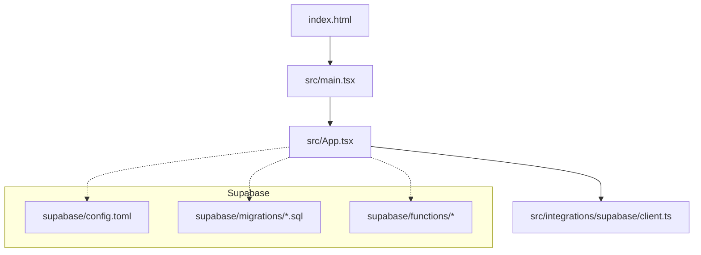
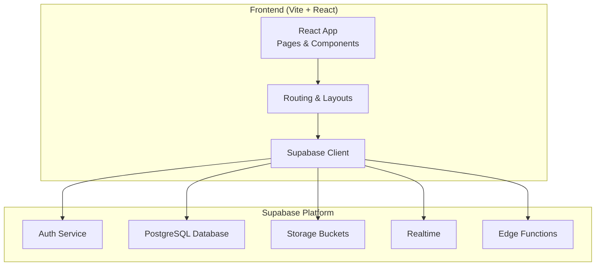
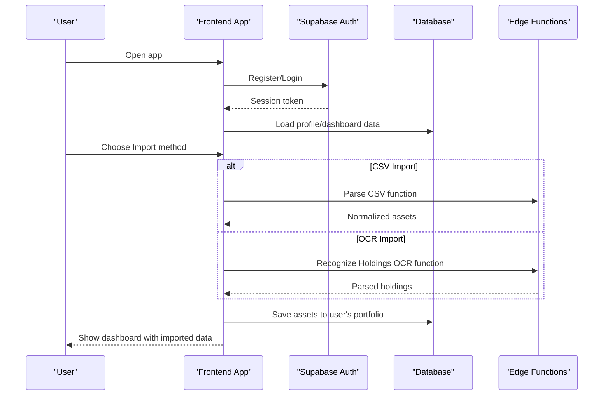
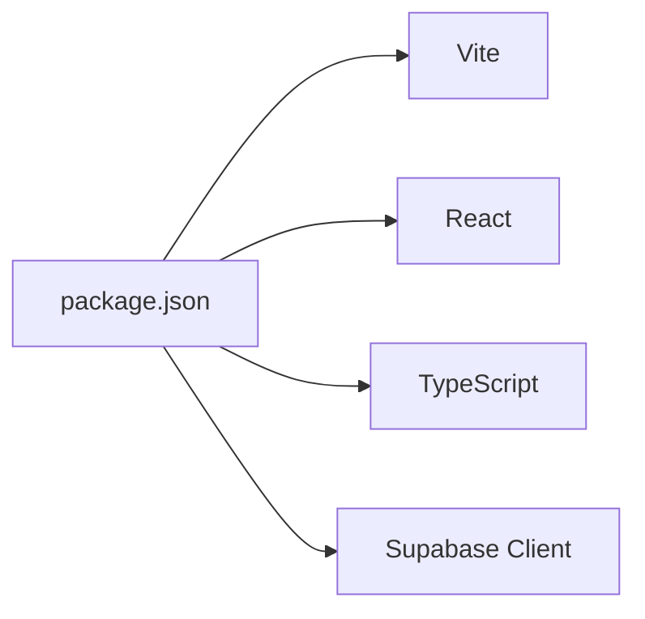

# Getting Started

<cite>
**Referenced Files in This Document**
- [package.json](file://package.json)
- [vite.config.ts](file://vite.config.ts)
- [tsconfig.json](file://tsconfig.json)
- [index.html](file://index.html)
- [src/main.tsx](file://src/main.tsx)
- [src/App.tsx](file://src/App.tsx)
- [src/integrations/supabase/client.ts](file://src/integrations/supabase/client.ts)
- [supabase/config.toml](file://supabase/config.toml)
</cite>

## Table of Contents
1. Introduction
2. Project Structure
3. Core Components
4. Architecture Overview
5. Detailed Component Analysis
6. Dependency Analysis
7. Performance Considerations
8. Troubleshooting Guide
9. Conclusion

## Introduction
FinSight is a full-stack React + TypeScript application for financial portfolio management and analysis, backed by Supabase for authentication, database, storage, and edge functions. It provides onboarding flows to register accounts, import holdings via CSV or OCR, and analyze portfolios with dashboards and reports.

Prerequisite knowledge:
- React fundamentals (components, hooks, routing)
- TypeScript basics (types, interfaces, strict mode)
- Basic financial portfolio concepts (assets, accounts, currency, reporting)

## Project Structure
The repository follows a feature-oriented layout:
- Frontend app entry points and configuration at the root
- React application code under src/
- Supabase project files under supabase/ (migrations, edge functions, config)

**Diagram sources**
- [index.html:1-20](file://index.html#L1-L20)
- [src/main.tsx:1-40](file://src/main.tsx#L1-L40)
- [src/App.tsx:1-60](file://src/App.tsx#L1-L60)
- [src/integrations/supabase/client.ts:1-40](file://src/integrations/supabase/client.ts#L1-L40)
- [supabase/config.toml:1-40](file://supabase/config.toml#L1-L40)

**Section sources**
- [index.html:1-20](file://index.html#L1-L20)
- [src/main.tsx:1-40](file://src/main.tsx#L1-L40)
- [src/App.tsx:1-60](file://src/App.tsx#L1-L60)
- [src/integrations/supabase/client.ts:1-40](file://src/integrations/supabase/client.ts#L1-L40)
- [supabase/config.toml:1-40](file://supabase/config.toml#L1-L40)

## Core Components
- Application bootstrap: The Vite-based React app initializes from the HTML entry and mounts the root component.
- Routing and layout: The top-level app wires pages and layouts for desktop views.
- Supabase client: A typed client is configured for auth, database, storage, and realtime features.
- Supabase backend: Migrations define schema; edge functions implement server-side logic like parsing CSVs, OCR, FX rates, stress tests, and shared reports.

Key responsibilities:
- Client initialization and environment configuration
- Feature modules for assets, imports, analytics, chat, and sharing
- Edge functions for heavy processing and external integrations

**Section sources**
- [src/main.tsx:1-40](file://src/main.tsx#L1-L40)
- [src/App.tsx:1-60](file://src/App.tsx#L1-L60)
- [src/integrations/supabase/client.ts:1-40](file://src/integrations/supabase/client.ts#L1-L40)
- [supabase/config.toml:1-40](file://supabase/config.toml#L1-L40)

## Architecture Overview
High-level architecture showing frontend, Supabase services, and edge functions.

[No sources needed since this diagram shows conceptual architecture]

## Detailed Component Analysis

### Environment Configuration
- Install dependencies using pnpm.
- Configure Supabase locally or connect to a remote project.
- Ensure environment variables are set for the Supabase URL and anon key.
- Apply database migrations and deploy edge functions as described below.

Typical commands:
- Install dependencies
- Start local dev server
- Build production bundle
- Run linting and type checks

**Section sources**
- [package.json:1-60](file://package.json#L1-L60)
- [vite.config.ts:1-40](file://vite.config.ts#L1-L40)
- [tsconfig.json:1-40](file://tsconfig.json#L1-L40)

### Supabase Setup
- Initialize or link your Supabase project.
- Create a .env file with Supabase URL and anon public key.
- Apply all SQL migrations to provision tables and policies.
- Deploy edge functions used by the app (CSV parsing, OCR, FX rates, stress tests, shared reports).

Local development tips:
- Use Supabase CLI to run a local instance if desired.
- Verify migrations and functions before starting the app.

**Section sources**
- [supabase/config.toml:1-40](file://supabase/config.toml#L1-L40)

### First-Time User Onboarding Flow
End-to-end flow from registration to importing a portfolio.

[No sources needed since this diagram shows conceptual workflow]

### Development Commands
Common scripts available through the package manager:
- Install dependencies
- Start development server with hot reload
- Build for production
- Lint and format code
- Type checking with TypeScript

Run these from the repository root using pnpm.

**Section sources**
- [package.json:1-60](file://package.json#L1-L60)

### Debugging Techniques
- Browser DevTools: Inspect network requests to Supabase, check auth state, and review console logs.
- React DevTools: Trace component renders and hook usage.
- Supabase Dashboard: Validate schema, RLS policies, and function logs.
- Local logging: Add structured logs in components and services to trace import flows and errors.

[No sources needed since this section provides general guidance]

## Dependency Analysis
Core runtime and build-time dependencies include:
- Vite for fast builds and dev server
- React and ReactDOM for UI
- TypeScript tooling for type safety
- Supabase JS client for backend integration

**Diagram sources**
- [package.json:1-60](file://package.json#L1-L60)

**Section sources**
- [package.json:1-60](file://package.json#L1-L60)

## Performance Considerations
- Prefer lazy loading for heavy pages and routes.
- Cache FX rates and static assets where appropriate.
- Use pagination and selective queries for large datasets.
- Offload CPU-intensive tasks (OCR, parsing) to edge functions.

[No sources needed since this section provides general guidance]

## Troubleshooting Guide
- Authentication issues: Verify Supabase URL and anon key in environment variables; ensure RLS policies allow access.
- Migration failures: Re-run migrations against the correct project; inspect error messages in the Supabase dashboard.
- Edge function errors: Check function logs in the Supabase dashboard; validate inputs and secrets.
- CORS or network errors: Confirm allowed domains and headers in Supabase settings.

**Section sources**
- [src/integrations/supabase/client.ts:1-40](file://src/integrations/supabase/client.ts#L1-L40)
- [supabase/config.toml:1-40](file://supabase/config.toml#L1-L40)

## Conclusion
You now have the essentials to install, configure, and run FinSight locally, understand its architecture, and onboard your first portfolio. Use the provided commands and debugging tips to iterate quickly, and rely on Supabase’s managed services for auth, database, storage, and serverless functions.