# API Layer Design

<cite>
**Referenced Files in This Document**
- [assetService.ts](file://src/services/assetService.ts)
- [authService.ts](file://src/services/authService.ts)
- [fxService.ts](file://src/services/fxService.ts)
- [profileService.ts](file://src/services/profileService.ts)
- [chatService.ts](file://src/services/chatService.ts)
- [importService.ts](file://src/services/importService.ts)
- [reportService.ts](file://src/services/reportService.ts)
- [stressService.ts](file://src/services/stressService.ts)
- [xrayService.ts](file://src/services/xrayService.ts)
- [useFxRates.ts](file://src/hooks/useFxRates.ts)
- [useAuthGuard.ts](file://src/hooks/useAuthGuard.ts)
- [client.ts](file://src/integrations/supabase/client.ts)
- [types.ts](file://src/integrations/supabase/types.ts)
- [currency.ts](file://src/lib/currency.ts)
- [asset-format.ts](file://src/lib/asset-format.ts)
- [get-fx-rates/index.ts](file://supabase/functions/get-fx-rates/index.ts)
- [ai-doctor-chat/index.ts](file://supabase/functions/ai-doctor-chat/index.ts)
- [compute-xray-report/index.ts](file://supabase/functions/compute-xray-report/index.ts)
- [create-shared-report/index.ts](file://supabase/functions/create-shared-report/index.ts)
- [parse-asset-csv/index.ts](file://supabase/functions/parse-asset-csv/index.ts)
- [recognize-holdings-ocr/index.ts](file://supabase/functions/recognize-holdings-ocr/index.ts)
- [run-stress-test/index.ts](file://supabase/functions/run-stress-test/index.ts)
- [s3-pre-sign-url/index.ts](file://supabase/functions/s3-pre-sign-url/index.ts)
- [seed-demo-portfolio/index.ts](file://supabase/functions/seed-demo-portfolio/index.ts)
</cite>

## Table of Contents
1. [Introduction](#introduction)
2. [Project Structure](#project-structure)
3. [Core Components](#core-components)
4. [Architecture Overview](#architecture-overview)
5. [Detailed Component Analysis](#detailed-component-analysis)
6. [Dependency Analysis](#dependency-analysis)
7. [Performance Considerations](#performance-considerations)
8. [Troubleshooting Guide](#troubleshooting-guide)
9. [Conclusion](#conclusion)
10. [Appendices](#appendices)

## Introduction
This document describes the API layer design for FinSight’s service-oriented architecture. It focuses on how services encapsulate business logic, interact with Supabase Edge Functions, and provide type-safe interfaces to UI components and hooks. The documentation covers:
- Service class structure and method organization
- Dependency injection patterns used across services
- Error handling strategies, retry mechanisms, and logging approaches
- Type safety using TypeScript interfaces and utility types
- Request/response transformations and data format handling
- Caching strategies and performance optimizations
- Testing approaches for API services
- Reference implementations for currency conversion, authentication, and asset management

## Project Structure
The API layer is implemented as a set of domain-focused service modules under src/services. Each service encapsulates calls to Supabase Edge Functions, performs request/response transformations, and exposes typed methods to consumers (hooks and pages). Shared utilities live under src/lib, while Supabase client integration and generated types are under src/integrations/supabase.

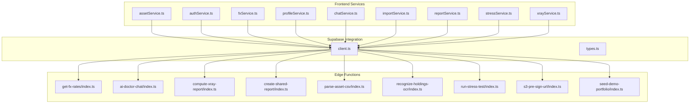

**Diagram sources**
- [assetService.ts](file://src/services/assetService.ts)
- [authService.ts](file://src/services/authService.ts)
- [fxService.ts](file://src/services/fxService.ts)
- [profileService.ts](file://src/services/profileService.ts)
- [chatService.ts](file://src/services/chatService.ts)
- [importService.ts](file://src/services/importService.ts)
- [reportService.ts](file://src/services/reportService.ts)
- [stressService.ts](file://src/services/stressService.ts)
- [xrayService.ts](file://src/services/xrayService.ts)
- [client.ts](file://src/integrations/supabase/client.ts)
- [types.ts](file://src/integrations/supabase/types.ts)
- [get-fx-rates/index.ts](file://supabase/functions/get-fx-rates/index.ts)
- [ai-doctor-chat/index.ts](file://supabase/functions/ai-doctor-chat/index.ts)
- [compute-xray-report/index.ts](file://supabase/functions/compute-xray-report/index.ts)
- [create-shared-report/index.ts](file://supabase/functions/create-shared-report/index.ts)
- [parse-asset-csv/index.ts](file://supabase/functions/parse-asset-csv/index.ts)
- [recognize-holdings-ocr/index.ts](file://supabase/functions/recognize-holdings-ocr/index.ts)
- [run-stress-test/index.ts](file://supabase/functions/run-stress-test/index.ts)
- [s3-pre-sign-url/index.ts](file://supabase/functions/s3-pre-sign-url/index.ts)
- [seed-demo-portfolio/index.ts](file://supabase/functions/seed-demo-portfolio/index.ts)

**Section sources**
- [assetService.ts](file://src/services/assetService.ts)
- [authService.ts](file://src/services/authService.ts)
- [fxService.ts](file://src/services/fxService.ts)
- [profileService.ts](file://src/services/profileService.ts)
- [chatService.ts](file://src/services/chatService.ts)
- [importService.ts](file://src/services/importService.ts)
- [reportService.ts](file://src/services/reportService.ts)
- [stressService.ts](file://src/services/stressService.ts)
- [xrayService.ts](file://src/services/xrayService.ts)
- [client.ts](file://src/integrations/supabase/client.ts)
- [types.ts](file://src/integrations/supabase/types.ts)

## Core Components
FinSight’s API layer consists of cohesive service modules that:
- Encapsulate HTTP calls via Supabase client functions
- Transform raw payloads into strongly-typed domain models
- Centralize error handling and optional retry behavior
- Provide stable APIs consumed by React hooks and pages

Key responsibilities per service:
- Define input/output types for each operation
- Implement request builders (headers, query params, body)
- Normalize responses and map errors to consistent shapes
- Optionally cache results or integrate with hooks for stateful access

Examples of core services:
- Currency conversion: fxService orchestrates FX rate retrieval and normalization
- Authentication: authService manages session-related operations and guards
- Asset management: assetService handles asset CRUD and import flows

**Section sources**
- [fxService.ts](file://src/services/fxService.ts)
- [authService.ts](file://src/services/authService.ts)
- [assetService.ts](file://src/services/assetService.ts)

## Architecture Overview
The API layer follows a service-oriented pattern where each service is a focused module responsible for one domain area. Services depend on the Supabase client for function invocation and leverage shared utilities for formatting and validation. Hooks consume services to manage UI state and side effects.

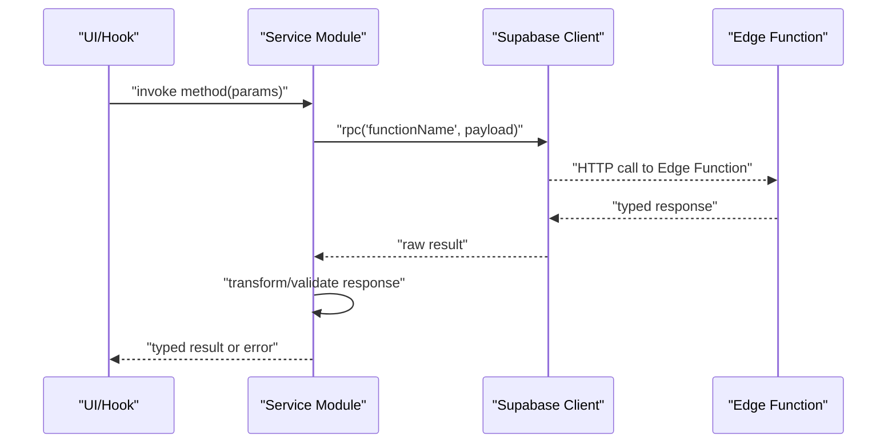

**Diagram sources**
- [client.ts](file://src/integrations/supabase/client.ts)
- [fxService.ts](file://src/services/fxService.ts)
- [get-fx-rates/index.ts](file://supabase/functions/get-fx-rates/index.ts)

## Detailed Component Analysis

### Currency Conversion Service (fxService)
Responsibilities:
- Fetch FX rates from the get-fx-rates Edge Function
- Normalize and cache rates for efficient UI consumption
- Provide typed methods for converting amounts between currencies

Typical flow:
- Build request parameters (base currency, target currencies, date)
- Invoke Supabase RPC
- Validate and normalize response into a rate map
- Expose conversion helpers

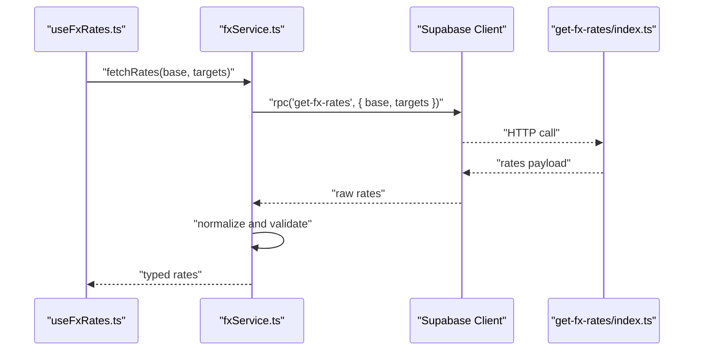

**Diagram sources**
- [useFxRates.ts](file://src/hooks/useFxRates.ts)
- [fxService.ts](file://src/services/fxService.ts)
- [client.ts](file://src/integrations/supabase/client.ts)
- [get-fx-rates/index.ts](file://supabase/functions/get-fx-rates/index.ts)

**Section sources**
- [fxService.ts](file://src/services/fxService.ts)
- [useFxRates.ts](file://src/hooks/useFxRates.ts)
- [get-fx-rates/index.ts](file://supabase/functions/get-fx-rates/index.ts)

### Authentication Service Patterns (authService)
Responsibilities:
- Manage user sessions and auth state
- Provide guard utilities for protected routes
- Coordinate with Supabase auth functions and local state

Common patterns:
- Centralized login/logout methods
- Session validation and refresh
- Guard hooks that wrap route-level access control

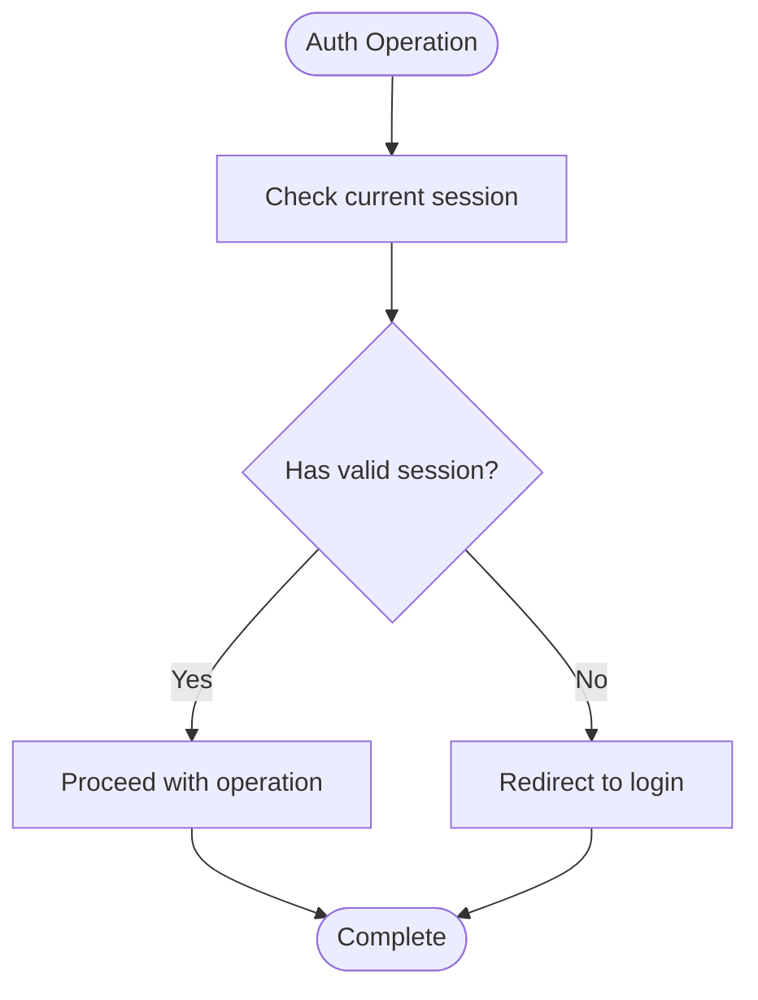

**Diagram sources**
- [authService.ts](file://src/services/authService.ts)
- [useAuthGuard.ts](file://src/hooks/useAuthGuard.ts)

**Section sources**
- [authService.ts](file://src/services/authService.ts)
- [useAuthGuard.ts](file://src/hooks/useAuthGuard.ts)

### Asset Management Service (assetService)
Responsibilities:
- Handle asset CRUD operations
- Orchestrate CSV parsing and OCR-based holdings recognition
- Integrate with import flows and report generation

Key interactions:
- parse-asset-csv for bulk imports
- recognize-holdings-ocr for image-based extraction
- seed-demo-portfolio for sample data population

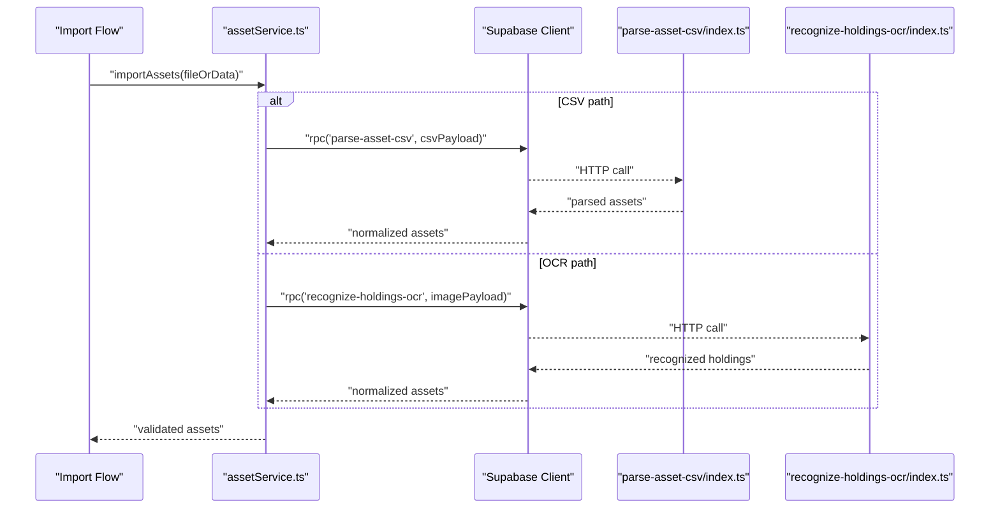

**Diagram sources**
- [assetService.ts](file://src/services/assetService.ts)
- [client.ts](file://src/integrations/supabase/client.ts)
- [parse-asset-csv/index.ts](file://supabase/functions/parse-asset-csv/index.ts)
- [recognize-holdings-ocr/index.ts](file://supabase/functions/recognize-holdings-ocr/index.ts)

**Section sources**
- [assetService.ts](file://src/services/assetService.ts)
- [parse-asset-csv/index.ts](file://supabase/functions/parse-asset-csv/index.ts)
- [recognize-holdings-ocr/index.ts](file://supabase/functions/recognize-holdings-ocr/index.ts)

### Chat Service (chatService)
Responsibilities:
- Interact with ai-doctor-chat Edge Function
- Stream or batch chat messages
- Maintain conversation context and typing states

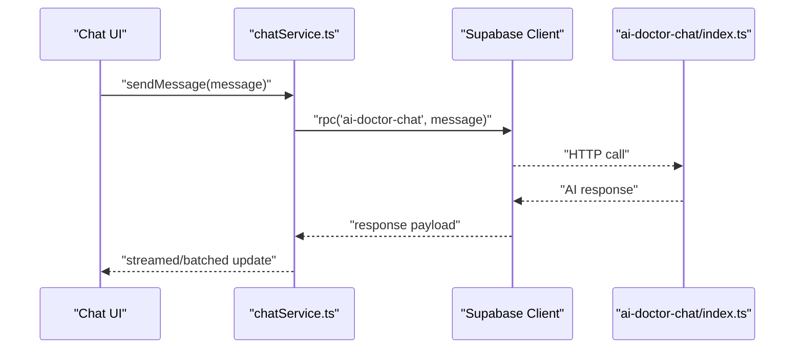

**Diagram sources**
- [chatService.ts](file://src/services/chatService.ts)
- [client.ts](file://src/integrations/supabase/client.ts)
- [ai-doctor-chat/index.ts](file://supabase/functions/ai-doctor-chat/index.ts)

**Section sources**
- [chatService.ts](file://src/services/chatService.ts)
- [ai-doctor-chat/index.ts](file://supabase/functions/ai-doctor-chat/index.ts)

### Report Service (reportService)
Responsibilities:
- Generate shared reports via create-shared-report
- Read existing reports via read-shared-report
- Compute analytics and insights through compute-xray-report

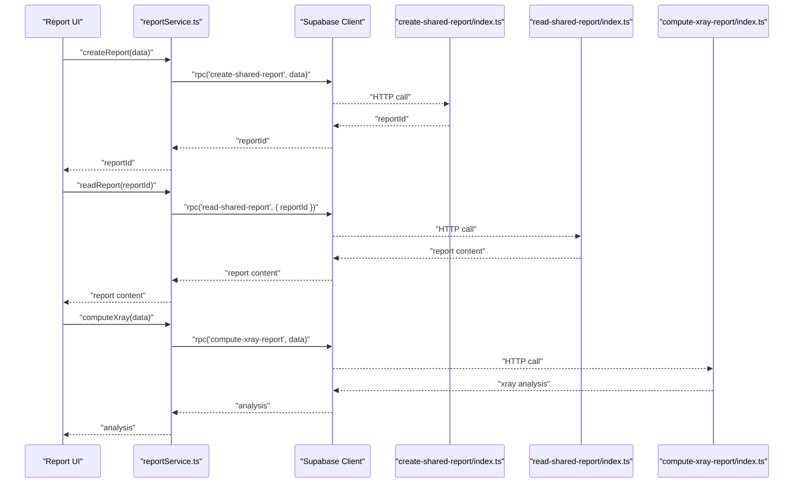

**Diagram sources**
- [reportService.ts](file://src/services/reportService.ts)
- [client.ts](file://src/integrations/supabase/client.ts)
- [create-shared-report/index.ts](file://supabase/functions/create-shared-report/index.ts)
- [compute-xray-report/index.ts](file://supabase/functions/compute-xray-report/index.ts)

**Section sources**
- [reportService.ts](file://src/services/reportService.ts)
- [create-shared-report/index.ts](file://supabase/functions/create-shared-report/index.ts)
- [compute-xray-report/index.ts](file://supabase/functions/compute-xray-report/index.ts)

### Stress Test Service (stressService)
Responsibilities:
- Execute stress tests via run-stress-test
- Aggregate and present test outcomes
- Provide feedback for portfolio resilience

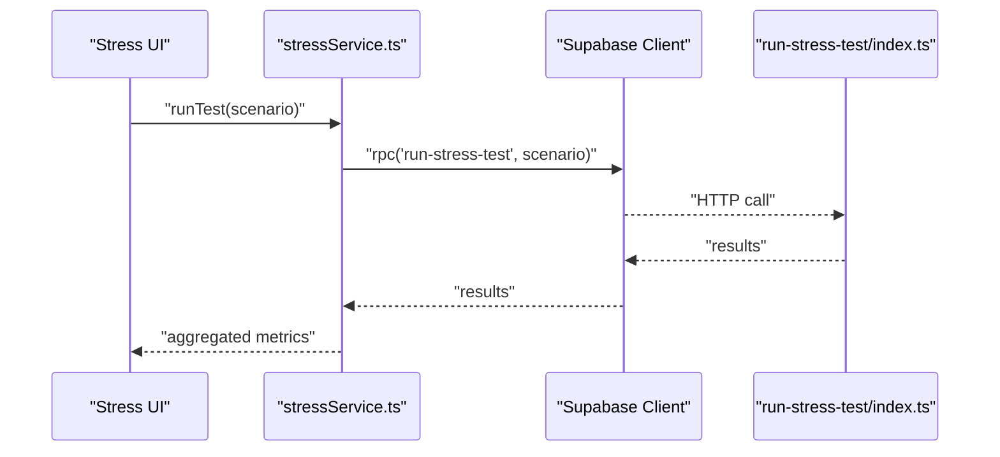

**Diagram sources**
- [stressService.ts](file://src/services/stressService.ts)
- [client.ts](file://src/integrations/supabase/client.ts)
- [run-stress-test/index.ts](file://supabase/functions/run-stress-test/index.ts)

**Section sources**
- [stressService.ts](file://src/services/stressService.ts)
- [run-stress-test/index.ts](file://supabase/functions/run-stress-test/index.ts)

### XRay Service (xrayService)
Responsibilities:
- Compute detailed analytics and risk insights
- Interface with compute-xray-report
- Present actionable recommendations

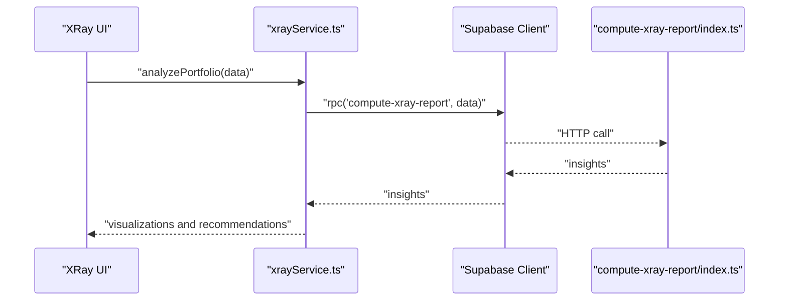

**Diagram sources**
- [xrayService.ts](file://src/services/xrayService.ts)
- [client.ts](file://src/integrations/supabase/client.ts)
- [compute-xray-report/index.ts](file://supabase/functions/compute-xray-report/index.ts)

**Section sources**
- [xrayService.ts](file://src/services/xrayService.ts)
- [compute-xray-report/index.ts](file://supabase/functions/compute-xray-report/index.ts)

### Import Service (importService)
Responsibilities:
- Orchestrate multi-step import flows
- Coordinate CSV parsing and OCR recognition
- Validate and preview imported assets before committing

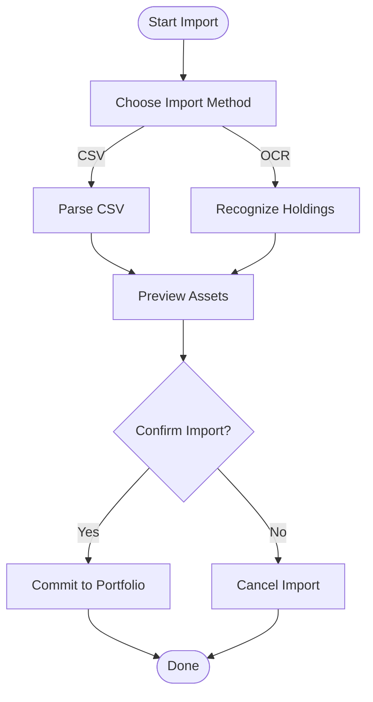

**Diagram sources**
- [importService.ts](file://src/services/importService.ts)
- [parse-asset-csv/index.ts](file://supabase/functions/parse-asset-csv/index.ts)
- [recognize-holdings-ocr/index.ts](file://supabase/functions/recognize-holdings-ocr/index.ts)

**Section sources**
- [importService.ts](file://src/services/importService.ts)
- [parse-asset-csv/index.ts](file://supabase/functions/parse-asset-csv/index.ts)
- [recognize-holdings-ocr/index.ts](file://supabase/functions/recognize-holdings-ocr/index.ts)

### Profile Service (profileService)
Responsibilities:
- Manage user profile data
- Sync preferences and settings
- Provide typed getters/setters for profile fields

**Section sources**
- [profileService.ts](file://src/services/profileService.ts)

## Dependency Analysis
Services depend on:
- Supabase client for RPC calls
- Shared utilities for formatting and validation
- Generated types for strong typing across layers

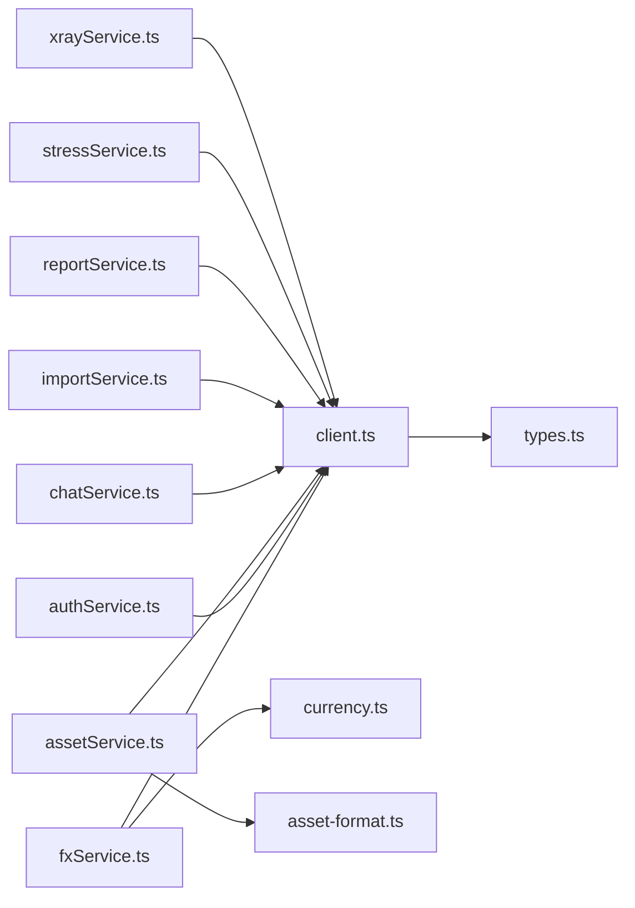

**Diagram sources**
- [fxService.ts](file://src/services/fxService.ts)
- [authService.ts](file://src/services/authService.ts)
- [assetService.ts](file://src/services/assetService.ts)
- [chatService.ts](file://src/services/chatService.ts)
- [importService.ts](file://src/services/importService.ts)
- [reportService.ts](file://src/services/reportService.ts)
- [stressService.ts](file://src/services/stressService.ts)
- [xrayService.ts](file://src/services/xrayService.ts)
- [client.ts](file://src/integrations/supabase/client.ts)
- [types.ts](file://src/integrations/supabase/types.ts)
- [currency.ts](file://src/lib/currency.ts)
- [asset-format.ts](file://src/lib/asset-format.ts)

**Section sources**
- [client.ts](file://src/integrations/supabase/client.ts)
- [types.ts](file://src/integrations/supabase/types.ts)
- [currency.ts](file://src/lib/currency.ts)
- [asset-format.ts](file://src/lib/asset-format.ts)

## Performance Considerations
- Caching FX rates locally to reduce network calls and improve responsiveness
- Debouncing heavy computations (e.g., stress tests) to avoid redundant work
- Using typed responses to minimize runtime validation overhead
- Prefetching common datasets (e.g., currency lists) during app initialization
- Leveraging Edge Functions for server-side processing to offload CPU-intensive tasks

[No sources needed since this section provides general guidance]

## Troubleshooting Guide
Common issues and resolutions:
- Network timeouts: implement retries with exponential backoff for transient failures
- Validation errors: ensure request payloads conform to expected schemas; log structured errors
- Auth failures: verify session validity and refresh tokens when necessary
- Data mismatches: use strict TypeScript types and centralized validators to catch inconsistencies early

Recommended practices:
- Wrap RPC calls with consistent error boundaries
- Log contextual information (endpoint, payload shape, timestamps) without sensitive data
- Provide user-friendly error messages mapped from backend codes

**Section sources**
- [client.ts](file://src/integrations/supabase/client.ts)
- [types.ts](file://src/integrations/supabase/types.ts)

## Conclusion
FinSight’s API layer adopts a clear service-oriented architecture with strong typing, centralized error handling, and well-defined dependencies. Services encapsulate domain-specific logic, transform data consistently, and expose stable APIs to UI components. By following the patterns outlined here—especially around caching, retries, and type safety—you can extend the system with new services confidently and maintain high reliability and performance.

[No sources needed since this section summarizes without analyzing specific files]

## Appendices

### Creating a New Service
Steps:
- Create a new file under src/services named after the domain (e.g., myDomainService.ts)
- Define input/output types using TypeScript interfaces
- Implement methods that call Supabase RPC via client.ts
- Add request/response transformations and validations
- Export typed methods for hooks/pages to consume

**Section sources**
- [client.ts](file://src/integrations/supabase/client.ts)
- [types.ts](file://src/integrations/supabase/types.ts)

### Implementing Request/Response Transformations
Guidelines:
- Normalize incoming payloads to internal domain models
- Map backend error codes to user-facing messages
- Use utility types to enforce shape constraints

**Section sources**
- [currency.ts](file://src/lib/currency.ts)
- [asset-format.ts](file://src/lib/asset-format.ts)

### Handling Different Data Formats
Approaches:
- Convert CSV inputs to normalized asset structures
- Parse OCR outputs into standardized holdings
- Ensure consistent currency formatting and locale-aware numbers

**Section sources**
- [parse-asset-csv/index.ts](file://supabase/functions/parse-asset-csv/index.ts)
- [recognize-holdings-ocr/index.ts](file://supabase/functions/recognize-holdings-ocr/index.ts)
- [currency.ts](file://src/lib/currency.ts)

### Caching Strategies
Recommendations:
- Cache FX rates with time-based invalidation
- Memoize expensive computations in hooks
- Use local storage sparingly for non-sensitive preferences

**Section sources**
- [useFxRates.ts](file://src/hooks/useFxRates.ts)

### Testing Approaches for API Services
Strategies:
- Unit test transformation logic with synthetic payloads
- Mock Supabase client RPC calls to isolate service behavior
- Validate error paths and retry conditions
- Snapshot test normalized outputs for stability

**Section sources**
- [client.ts](file://src/integrations/supabase/client.ts)
- [types.ts](file://src/integrations/supabase/types.ts)