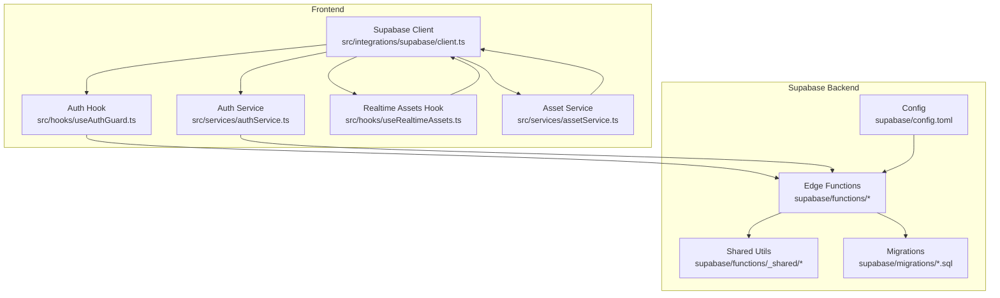
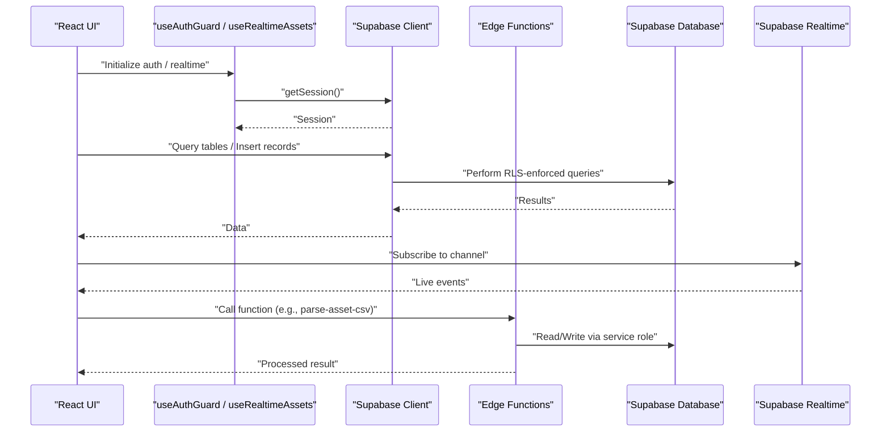
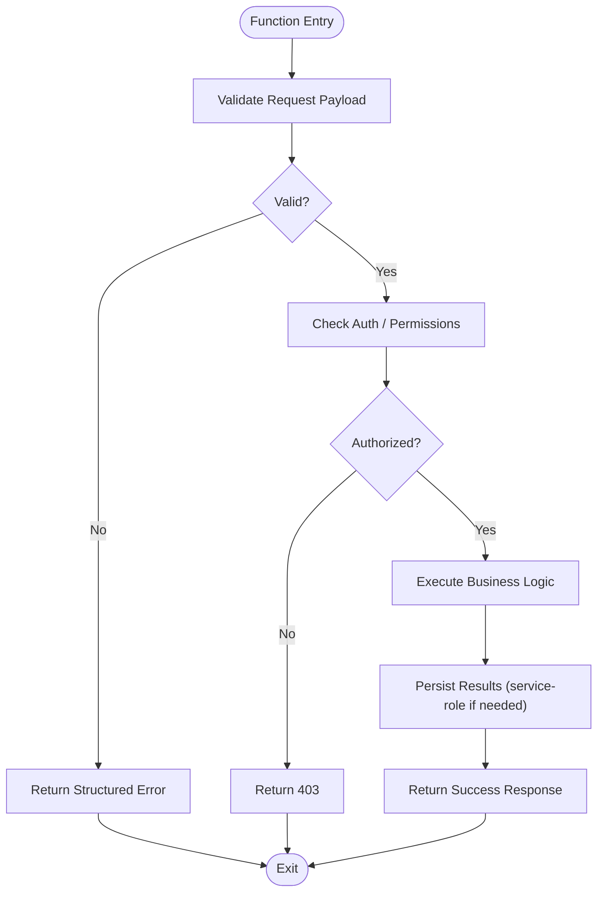
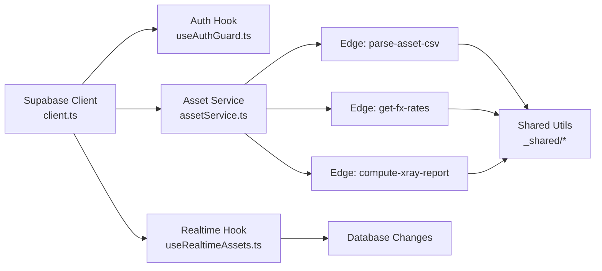

# Backend Integration

<cite>
**Referenced Files in This Document**
- [client.ts](file://src/integrations/supabase/client.ts)
- [types.ts](file://src/integrations/supabase/types.ts)
- [useAuthGuard.ts](file://src/hooks/useAuthGuard.ts)
- [authService.ts](file://src/services/authService.ts)
- [useRealtimeAssets.ts](file://src/hooks/useRealtimeAssets.ts)
- [assetService.ts](file://src/services/assetService.ts)
- [index.ts](file://supabase/functions/parse-asset-csv/index.ts)
- [index.ts](file://supabase/functions/get-fx-rates/index.ts)
- [index.ts](file://supabase/functions/compute-xray-report/index.ts)
- [index.ts](file://supabase/functions/ai-doctor-chat/index.ts)
- [index.ts](file://supabase/functions/create-shared-report/index.ts)
- [index.ts](file://supabase/functions/read-shared-report/index.ts)
- [index.ts](file://supabase/functions/recognize-holdings-ocr/index.ts)
- [index.ts](file://supabase/functions/run-stress-test/index.ts)
- [index.ts](file://supabase/functions/s3-pre-sign-url/index.ts)
- [index.ts](file://supabase/functions/seed-demo-portfolio/index.ts)
- [asset-normalize.ts](file://supabase/functions/_shared/asset-normalize.ts)
- [auth.ts](file://supabase/functions/_shared/auth.ts)
- [currency.ts](file://supabase/functions/_shared/currency.ts)
- [config.toml](file://supabase/config.toml)
</cite>

## Table of Contents
1. [Introduction](#introduction)
2. [Project Structure](#project-structure)
3. [Core Components](#core-components)
4. [Architecture Overview](#architecture-overview)
5. [Detailed Component Analysis](#detailed-component-analysis)
6. [Dependency Analysis](#dependency-analysis)
7. [Performance Considerations](#performance-considerations)
8. [Troubleshooting Guide](#troubleshooting-guide)
9. [Conclusion](#conclusion)
10. [Appendices](#appendices)

## Introduction
This document provides comprehensive backend integration guidance for FinSight’s Supabase implementation. It covers client configuration, authentication flows, real-time subscriptions, Edge Functions development and deployment, database schema design principles, migration management, query optimization, security best practices, rate limiting, monitoring, and debugging techniques. The goal is to help developers implement robust serverless data processing, real-time features, and secure integrations with Supabase.

## Project Structure
FinSight organizes Supabase-related code across the frontend client layer and the Supabase backend:
- Frontend Supabase client and types live under src/integrations/supabase.
- Authentication hooks and services are implemented in src/hooks and src/services.
- Real-time subscriptions are encapsulated in dedicated hooks.
- Supabase Edge Functions are located under supabase/functions, with shared utilities under _shared.
- Database migrations are stored under supabase/migrations.
- Supabase project configuration is defined in supabase/config.toml.

**Diagram sources**
- [client.ts](file://src/integrations/supabase/client.ts)
- [useAuthGuard.ts](file://src/hooks/useAuthGuard.ts)
- [authService.ts](file://src/services/authService.ts)
- [useRealtimeAssets.ts](file://src/hooks/useRealtimeAssets.ts)
- [assetService.ts](file://src/services/assetService.ts)
- [index.ts](file://supabase/functions/parse-asset-csv/index.ts)
- [index.ts](file://supabase/functions/get-fx-rates/index.ts)
- [index.ts](file://supabase/functions/compute-xray-report/index.ts)
- [index.ts](file://supabase/functions/ai-doctor-chat/index.ts)
- [index.ts](file://supabase/functions/create-shared-report/index.ts)
- [index.ts](file://supabase/functions/read-shared-report/index.ts)
- [index.ts](file://supabase/functions/recognize-holdings-ocr/index.ts)
- [index.ts](file://supabase/functions/run-stress-test/index.ts)
- [index.ts](file://supabase/functions/s3-pre-sign-url/index.ts)
- [index.ts](file://supabase/functions/seed-demo-portfolio/index.ts)
- [asset-normalize.ts](file://supabase/functions/_shared/asset-normalize.ts)
- [auth.ts](file://supabase/functions/_shared/auth.ts)
- [currency.ts](file://supabase/functions/_shared/currency.ts)
- [config.toml](file://supabase/config.toml)

**Section sources**
- [client.ts](file://src/integrations/supabase/client.ts)
- [types.ts](file://src/integrations/supabase/types.ts)
- [useAuthGuard.ts](file://src/hooks/useAuthGuard.ts)
- [authService.ts](file://src/services/authService.ts)
- [useRealtimeAssets.ts](file://src/hooks/useRealtimeAssets.ts)
- [assetService.ts](file://src/services/assetService.ts)
- [config.toml](file://supabase/config.toml)

## Core Components
- Supabase Client Configuration
  - Centralized client initialization and typed helpers ensure consistent access patterns across the app.
  - Types are centralized to keep DB schemas and function payloads strongly typed.

- Authentication Flow
  - Hooks and services orchestrate session state, user identity, and protected routes.
  - Services abstract auth operations (sign-in, sign-up, password reset) and integrate with Supabase Auth.

- Real-time Subscriptions
  - Dedicated hooks subscribe to table changes and broadcast updates to UI components.
  - Subscription lifecycle is managed to avoid memory leaks and redundant listeners.

- Asset Data Services
  - Services encapsulate CRUD operations, caching strategies, and error handling for assets.
  - They coordinate with both direct Supabase queries and Edge Functions when needed.

**Section sources**
- [client.ts](file://src/integrations/supabase/client.ts)
- [types.ts](file://src/integrations/supabase/types.ts)
- [useAuthGuard.ts](file://src/hooks/useAuthGuard.ts)
- [authService.ts](file://src/services/authService.ts)
- [useRealtimeAssets.ts](file://src/hooks/useRealtimeAssets.ts)
- [assetService.ts](file://src/services/assetService.ts)

## Architecture Overview
The system integrates a React-based frontend with Supabase for authentication, database, storage, and serverless functions. Real-time capabilities are provided via Supabase channels. Edge Functions handle heavy or sensitive tasks such as CSV parsing, OCR, FX rates fetching, report generation, and AI chat interactions.

**Diagram sources**
- [useAuthGuard.ts](file://src/hooks/useAuthGuard.ts)
- [useRealtimeAssets.ts](file://src/hooks/useRealtimeAssets.ts)
- [client.ts](file://src/integrations/supabase/client.ts)
- [index.ts](file://supabase/functions/parse-asset-csv/index.ts)
- [index.ts](file://supabase/functions/get-fx-rates/index.ts)
- [index.ts](file://supabase/functions/compute-xray-report/index.ts)
- [index.ts](file://supabase/functions/ai-doctor-chat/index.ts)
- [index.ts](file://supabase/functions/create-shared-report/index.ts)
- [index.ts](file://supabase/functions/read-shared-report/index.ts)
- [index.ts](file://supabase/functions/recognize-holdings-ocr/index.ts)
- [index.ts](file://supabase/functions/run-stress-test/index.ts)
- [index.ts](file://supabase/functions/s3-pre-sign-url/index.ts)
- [index.ts](file://supabase/functions/seed-demo-portfolio/index.ts)

## Detailed Component Analysis

### Supabase Client Configuration
- Responsibilities
  - Initialize the Supabase client with environment-specific settings.
  - Provide typed helpers for database queries and function calls.
  - Centralize error handling and logging for network and auth errors.

- Best Practices
  - Use environment variables for URLs and keys.
  - Keep types synchronized with DB schema using generated types.
  - Avoid storing secrets in the client; only public endpoints should be called from the browser.

**Section sources**
- [client.ts](file://src/integrations/supabase/client.ts)
- [types.ts](file://src/integrations/supabase/types.ts)

### Authentication Flow Setup
- Responsibilities
  - Manage user sessions, redirect flows, and protected route guards.
  - Expose user identity and roles to services and components.
  - Handle token refresh and logout gracefully.

- Implementation Patterns
  - Hook-based session checks before rendering protected pages.
  - Service-layer wrappers around auth methods to standardize behavior.
  - Clear separation between UI state and Supabase session state.

**Section sources**
- [useAuthGuard.ts](file://src/hooks/useAuthGuard.ts)
- [authService.ts](file://src/services/authService.ts)

### Real-time Subscription Patterns
- Responsibilities
  - Subscribe to table changes and broadcast updates to relevant UI components.
  - Manage subscription lifecycles to prevent memory leaks.
  - Normalize incoming events into application state.

- Implementation Patterns
  - Per-feature hooks encapsulating channel creation and event handlers.
  - Debounced updates for high-frequency events.
  - Error recovery and reconnection logic.

**Section sources**
- [useRealtimeAssets.ts](file://src/hooks/useRealtimeAssets.ts)

### Asset Data Services
- Responsibilities
  - Encapsulate asset CRUD operations, validation, and caching.
  - Coordinate with Edge Functions for heavy processing (e.g., CSV parsing).
  - Provide consistent error responses and retry policies.

- Implementation Patterns
  - Service facade over Supabase client methods.
  - Local cache invalidation on mutations.
  - Batch operations where possible to reduce round-trips.

**Section sources**
- [assetService.ts](file://src/services/assetService.ts)

### Edge Functions Development
- Function Structure
  - Each function resides in its own directory with an index file.
  - Shared utilities are placed under _shared for reuse across functions.
  - Input validation, authentication checks, and error handling are standardized.

- Security Considerations
  - Validate all inputs and enforce row-level security boundaries.
  - Use service-role clients inside functions for privileged operations.
  - Avoid exposing secrets; rely on Supabase runtime secrets.

- Error Handling
  - Return structured error responses with codes and messages.
  - Log errors with context for observability.
  - Implement retries for transient failures.

- Deployment Patterns
  - Deploy individual functions independently.
  - Versioned releases with rollback support.
  - Environment-specific configurations via Supabase CLI.

- Examples
  - CSV parsing pipeline: validate input, normalize assets, persist results.
  - FX rates fetcher: cache external API responses, serve normalized rates.
  - X-ray report generator: aggregate metrics and produce reports.
  - AI doctor chat: orchestrate LLM calls with prompt templates.
  - Shared report creator/reader: manage shareable report links and permissions.
  - OCR holdings recognizer: process images and extract holdings.
  - Stress test runner: simulate load and collect metrics.
  - S3 pre-sign URL provider: generate secure upload URLs.
  - Seed demo portfolio: populate sample data for onboarding.

**Diagram sources**
- [index.ts](file://supabase/functions/parse-asset-csv/index.ts)
- [index.ts](file://supabase/functions/get-fx-rates/index.ts)
- [index.ts](file://supabase/functions/compute-xray-report/index.ts)
- [index.ts](file://supabase/functions/ai-doctor-chat/index.ts)
- [index.ts](file://supabase/functions/create-shared-report/index.ts)
- [index.ts](file://supabase/functions/read-shared-report/index.ts)
- [index.ts](file://supabase/functions/recognize-holdings-ocr/index.ts)
- [index.ts](file://supabase/functions/run-stress-test/index.ts)
- [index.ts](file://supabase/functions/s3-pre-sign-url/index.ts)
- [index.ts](file://supabase/functions/seed-demo-portfolio/index.ts)
- [asset-normalize.ts](file://supabase/functions/_shared/asset-normalize.ts)
- [auth.ts](file://supabase/functions/_shared/auth.ts)
- [currency.ts](file://supabase/functions/_shared/currency.ts)

**Section sources**
- [index.ts](file://supabase/functions/parse-asset-csv/index.ts)
- [index.ts](file://supabase/functions/get-fx-rates/index.ts)
- [index.ts](file://supabase/functions/compute-xray-report/index.ts)
- [index.ts](file://supabase/functions/ai-doctor-chat/index.ts)
- [index.ts](file://supabase/functions/create-shared-report/index.ts)
- [index.ts](file://supabase/functions/read-shared-report/index.ts)
- [index.ts](file://supabase/functions/recognize-holdings-ocr/index.ts)
- [index.ts](file://supabase/functions/run-stress-test/index.ts)
- [index.ts](file://supabase/functions/s3-pre-sign-url/index.ts)
- [index.ts](file://supabase/functions/seed-demo-portfolio/index.ts)
- [asset-normalize.ts](file://supabase/functions/_shared/asset-normalize.ts)
- [auth.ts](file://supabase/functions/_shared/auth.ts)
- [currency.ts](file://supabase/functions/_shared/currency.ts)

### Database Schema Design Principles
- Normalization vs Denormalization
  - Normalize core entities (users, portfolios, assets) to maintain integrity.
  - Denormalize frequently accessed aggregates for performance.

- Indexing Strategy
  - Add indexes on foreign keys and common filter columns.
  - Use composite indexes for multi-column queries.

- Row-Level Security (RLS)
  - Enforce per-user access at the database level.
  - Define policies that align with business rules.

- Constraints and Validation
  - Use constraints to prevent invalid states.
  - Apply check constraints for enums and ranges.

**Section sources**
- [config.toml](file://supabase/config.toml)

### Migration Management
- Versioned Migrations
  - Each SQL file represents a single change set.
  - Maintain idempotent scripts where possible.

- Rollback Strategy
  - Keep reverse migrations for critical changes.
  - Test rollbacks in staging environments.

- Dependency Ordering
  - Ensure migrations run in correct order.
  - Use naming conventions to reflect chronological order.

**Section sources**
- [config.toml](file://supabase/config.toml)

### Query Optimization Strategies
- Select Only Needed Columns
  - Reduce payload size by selecting specific fields.

- Pagination and Limiting
  - Use offset or keyset pagination for large datasets.

- Caching Layers
  - Cache expensive computations in Edge Functions.
  - Leverage client-side caches with invalidation strategies.

- Batch Operations
  - Group writes to minimize round-trips.

**Section sources**
- [assetService.ts](file://src/services/assetService.ts)

## Dependency Analysis
The frontend depends on the Supabase client for database and auth operations, while Edge Functions depend on shared utilities and the Supabase runtime. Realtime subscriptions bridge database changes to the UI.

**Diagram sources**
- [client.ts](file://src/integrations/supabase/client.ts)
- [useAuthGuard.ts](file://src/hooks/useAuthGuard.ts)
- [useRealtimeAssets.ts](file://src/hooks/useRealtimeAssets.ts)
- [assetService.ts](file://src/services/assetService.ts)
- [index.ts](file://supabase/functions/parse-asset-csv/index.ts)
- [index.ts](file://supabase/functions/get-fx-rates/index.ts)
- [index.ts](file://supabase/functions/compute-xray-report/index.ts)
- [asset-normalize.ts](file://supabase/functions/_shared/asset-normalize.ts)
- [auth.ts](file://supabase/functions/_shared/auth.ts)
- [currency.ts](file://supabase/functions/_shared/currency.ts)

**Section sources**
- [client.ts](file://src/integrations/supabase/client.ts)
- [useAuthGuard.ts](file://src/hooks/useAuthGuard.ts)
- [useRealtimeAssets.ts](file://src/hooks/useRealtimeAssets.ts)
- [assetService.ts](file://src/services/assetService.ts)
- [index.ts](file://supabase/functions/parse-asset-csv/index.ts)
- [index.ts](file://supabase/functions/get-fx-rates/index.ts)
- [index.ts](file://supabase/functions/compute-xray-report/index.ts)
- [asset-normalize.ts](file://supabase/functions/_shared/asset-normalize.ts)
- [auth.ts](file://supabase/functions/_shared/auth.ts)
- [currency.ts](file://supabase/functions/_shared/currency.ts)

## Performance Considerations
- Minimize Network Calls
  - Batch writes and reads where feasible.
  - Use pagination to limit payload sizes.

- Efficient Realtime Usage
  - Subscribe only to necessary channels.
  - Debounce frequent updates to avoid UI thrashing.

- Edge Function Optimization
  - Cache external API responses.
  - Use connection pooling and efficient algorithms.

- Database Indexing
  - Profile slow queries and add targeted indexes.
  - Avoid over-indexing which can degrade write performance.

[No sources needed since this section provides general guidance]

## Troubleshooting Guide
- Common Issues
  - Authentication failures: verify session validity and redirect URLs.
  - Realtime disconnects: implement reconnection logic and backoff.
  - Edge Function timeouts: optimize logic and increase limits if necessary.

- Debugging Techniques
  - Enable detailed logs in Edge Functions.
  - Use Supabase dashboard to inspect queries and realtime events.
  - Instrument client-side errors and network requests.

- Rate Limiting
  - Apply request throttling at the client and function levels.
  - Use exponential backoff for retries.

- Monitoring
  - Track latency and error rates for critical paths.
  - Set up alerts for anomalies in function execution and DB performance.

**Section sources**
- [useAuthGuard.ts](file://src/hooks/useAuthGuard.ts)
- [useRealtimeAssets.ts](file://src/hooks/useRealtimeAssets.ts)
- [assetService.ts](file://src/services/assetService.ts)
- [index.ts](file://supabase/functions/parse-asset-csv/index.ts)
- [index.ts](file://supabase/functions/get-fx-rates/index.ts)
- [index.ts](file://supabase/functions/compute-xray-report/index.ts)

## Conclusion
FinSight’s Supabase integration leverages a clean separation of concerns: a typed client layer, robust authentication hooks, real-time subscriptions, and well-structured Edge Functions. By following the design principles, security practices, and optimization strategies outlined here, teams can build scalable, secure, and responsive financial applications.

[No sources needed since this section summarizes without analyzing specific files]

## Appendices

### Practical Examples

- Implementing Serverless Functions for Data Processing
  - Create a new function directory with an index file.
  - Validate inputs, perform normalization using shared utilities, and persist results.
  - Return structured responses and log errors.

- Setting Up Real-time Features
  - Subscribe to relevant channels in a dedicated hook.
  - Map events to local state updates and handle reconnections.

- Managing Environment Configurations
  - Store environment variables securely in Supabase.
  - Reference them in Edge Functions and client initialization.

**Section sources**
- [index.ts](file://supabase/functions/parse-asset-csv/index.ts)
- [index.ts](file://supabase/functions/get-fx-rates/index.ts)
- [index.ts](file://supabase/functions/compute-xray-report/index.ts)
- [useRealtimeAssets.ts](file://src/hooks/useRealtimeAssets.ts)
- [client.ts](file://src/integrations/supabase/client.ts)