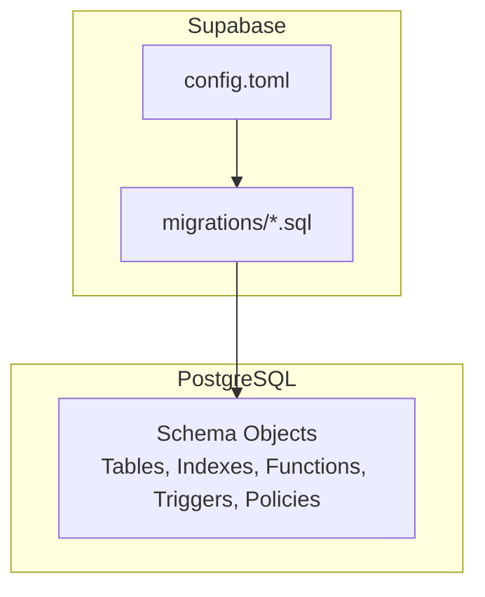
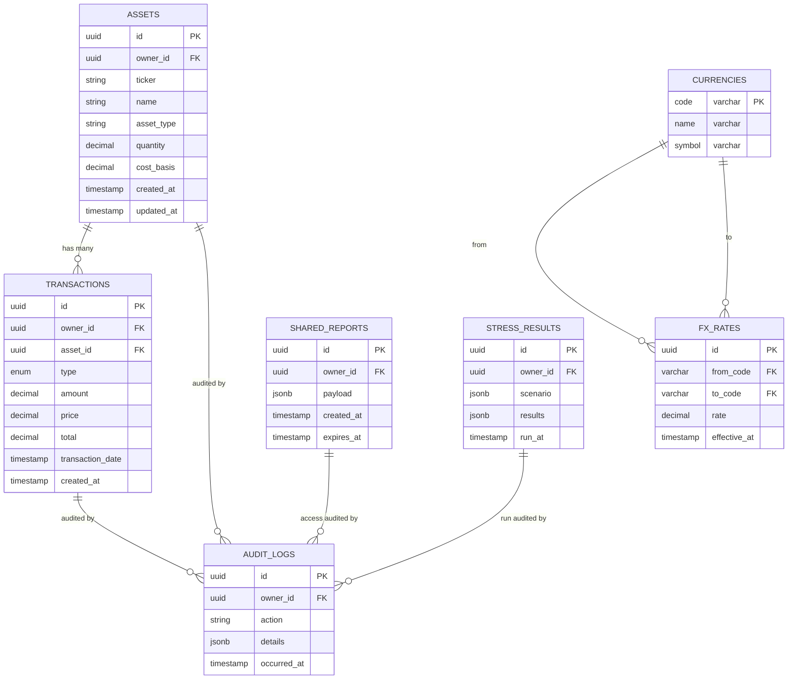
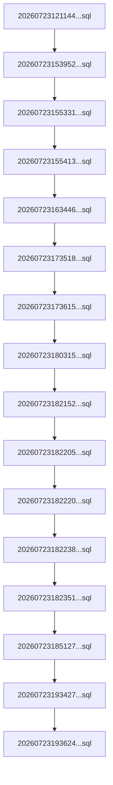

# Database Schema Design

<cite>
**Referenced Files in This Document**
- [supabase/config.toml](file://supabase/config.toml)
- [20260723121144_c74c73213ed84575a8837d9cd36d15e4.sql](file://supabase/migrations/20260723121144_c74c73213ed84575a8837d9cd36d15e4.sql)
- [20260723153952_c71b1045dcdf4f018225805c503c6b0d.sql](file://supabase/migrations/20260723153952_c71b1045dcdf4f018225805c503c6b0d.sql)
- [20260723155331_68c1a30a78ff4e48bf404ad2cc6b6efb.sql](file://supabase/migrations/20260723155331_68c1a30a78ff4e48bf404ad2cc6b6efb.sql)
- [20260723155413_7c3191b7c8f548c595abf9f78639759b.sql](file://supabase/migrations/20260723155413_7c3191b7c8f548c595abf9f78639759b.sql)
- [20260723163446_e5b73a6e70e543bb974e94bd42eaef26.sql](file://supabase/migrations/20260723163446_e5b73a6e70e543bb974e94bd42eaef26.sql)
- [20260723173518_0b0744c7dc2e4ce19d0f633f76cc5646.sql](file://supabase/migrations/20260723173518_0b0744c7dc2e4ce19d0f633f76cc5646.sql)
- [20260723173615_1714d0fb593f4be484aeaf5ae6126285.sql](file://supabase/migrations/20260723173615_1714d0fb593f4be484aeaf5ae6126285.sql)
- [20260723180315_7037aff8609246c09c1687e43402551b.sql](file://supabase/migrations/20260723180315_7037aff8609246c09c1687e43402551b.sql)
- [20260723182152_1ef372d9776b4d90a8d7d05a24cc896e.sql](file://supabase/migrations/20260723182152_1ef372d9776b4d90a8d7d05a24cc896e.sql)
- [20260723182205_0a1bea3f3c914808adbe897fcf2f3ef2.sql](file://supabase/migrations/20260723182205_0a1bea3f3c914808adbe897fcf2f3ef2.sql)
- [20260723182220_768553ba2797467997d2479b4f8eb5c7.sql](file://supabase/migrations/20260723182220_768553ba2797467997d2479b4f8eb5c7.sql)
- [20260723182238_2c1e9690de31436f846a61228b2b9944.sql](file://supabase/migrations/20260723182238_2c1e9690de31436f846a61228b2b9944.sql)
- [20260723182351_edc6719b154248bc8008367aae826f1f.sql](file://supabase/migrations/20260723182351_edc6719b154248bc8008367aae826f1f.sql)
- [20260723185127_9c934d4b04604c869e002834dbecdb47.sql](file://supabase/migrations/20260723185127_9c934d4b04604c869e002834dbecdb47.sql)
- [20260723193427_c3d317b84bc14b6391cd2ce84628a6aa.sql](file://supabase/migrations/20260723193427_c3d317b84bc14b6391cd2ce84628a6aa.sql)
- [20260723193624_d41656f9e95f430a82546bc3044e545a.sql](file://supabase/migrations/20260723193624_d41656f9e95f430a82546bc3044e545a.sql)
</cite>

## Table of Contents
1. Introduction
2. Project Structure
3. Core Components
4. Architecture Overview
5. Detailed Component Analysis
6. Dependency Analysis
7. Performance Considerations
8. Troubleshooting Guide
9. Conclusion
10. Appendices

## Introduction
This document provides comprehensive database schema documentation for FinSight’s Supabase PostgreSQL implementation. It covers entity relationships, table structures, data types, migration management, version control strategies, rollback procedures, indexing and query optimization, security policies including row-level security (RLS), backup and disaster recovery, monitoring approaches, and guidelines for schema evolution with backward compatibility.

## Project Structure
FinSight uses Supabase migrations under the supabase/migrations directory to evolve the PostgreSQL schema. The Supabase configuration is defined in supabase/config.toml. Migrations are timestamped SQL files that define tables, indexes, constraints, triggers, functions, and RLS policies.

**Diagram sources**
- [supabase/config.toml](file://supabase/config.toml)
- [20260723121144_c74c73213ed84575a8837d9cd36d15e4.sql](file://supabase/migrations/20260723121144_c74c73213ed84575a8837d9cd36d15e4.sql)

**Section sources**
- [supabase/config.toml](file://supabase/config.toml)

## Core Components
The database schema centers around financial assets, portfolios, transactions, currency exchange rates, shared reports, stress test results, and audit logs. Each component is implemented via migrations that create tables, enforce constraints, add indexes, and configure RLS policies.

Key components:
- Assets and holdings
- Transactions and ledger entries
- Currency and FX rates
- Shared reports and access control
- Stress testing results
- Audit logging and system metadata

**Section sources**
- [20260723121144_c74c73213ed84575a8837d9cd36d15e4.sql](file://supabase/migrations/20260723121144_c74c73213ed84575a8837d9cd36d15e4.sql)
- [20260723153952_c71b1045dcdf4f018225805c503c6b0d.sql](file://supabase/migrations/20260723153952_c71b1045dcdf4f018225805c503c6b0d.sql)
- [20260723155331_68c1a30a78ff4e48bf404ad2cc6b6efb.sql](file://supabase/migrations/20260723155331_68c1a30a78ff4e48bf404ad2cc6b6efb.sql)
- [20260723155413_7c3191b7c8f548c595abf9f78639759b.sql](file://supabase/migrations/20260723155413_7c3191b7c8f548c595abf9f78639759b.sql)
- [20260723163446_e5b73a6e70e543bb974e94bd42eaef26.sql](file://supabase/migrations/20260723163446_e5b73a6e70e543bb974e94bd42eaef26.sql)
- [20260723173518_0b0744c7dc2e4ce19d0f633f76cc5646.sql](file://supabase/migrations/20260723173518_0b0744c7dc2e4ce19d0f633f76cc5646.sql)
- [20260723173615_1714d0fb593f4be484aeaf5ae6126285.sql](file://supabase/migrations/20260723173615_1714d0fb593f4be484aeaf5ae6126285.sql)
- [20260723180315_7037aff8609246c09c1687e43402551b.sql](file://supabase/migrations/20260723180315_7037aff8609246c09c1687e43402551b.sql)
- [20260723182152_1ef372d9776b4d90a8d7d05a24cc896e.sql](file://supabase/migrations/20260723182152_1ef372d9776b4d90a8d7d05a24cc896e.sql)
- [20260723182205_0a1bea3f3c914808adbe897fcf2f3ef2.sql](file://supabase/migrations/20260723182205_0a1bea3f3c914808adbe897fcf2f3ef2.sql)
- [20260723182220_768553ba2797467997d2479b4f8eb5c7.sql](file://supabase/migrations/20260723182220_768553ba2797467997d2479b4f8eb5c7.sql)
- [20260723182238_2c1e9690de31436f846a61228b2b9944.sql](file://supabase/migrations/20260723182238_2c1e9690de31436f846a61228b2b9944.sql)
- [20260723182351_edc6719b154248bc8008367aae826f1f.sql](file://supabase/migrations/20260723182351_edc6719b154248bc8008367aae826f1f.sql)
- [20260723185127_9c934d4b04604c869e002834dbecdb47.sql](file://supabase/migrations/20260723185127_9c934d4b04604c869e002834dbecdb47.sql)
- [20260723193427_c3d317b84bc14b6391cd2ce84628a6aa.sql](file://supabase/migrations/20260723193427_c3d317b84bc14b6391cd2ce84628a6aa.sql)
- [20260723193624_d41656f9e95f430a82546bc3044e545a.sql](file://supabase/migrations/20260723193624_d41656f9e95f430a82546bc3044e545a.sql)

## Architecture Overview
The database architecture follows a normalized relational model with clear separation between core entities (assets, transactions, currencies), operational artifacts (shared reports, stress tests), and auditability (logs). Migrations incrementally build this schema, while RLS policies secure tenant isolation.

**Diagram sources**
- [20260723121144_c74c73213ed84575a8837d9cd36d15e4.sql](file://supabase/migrations/20260723121144_c74c73213ed84575a8837d9cd36d15e4.sql)
- [20260723153952_c71b1045dcdf4f018225805c503c6b0d.sql](file://supabase/migrations/20260723153952_c71b1045dcdf4f018225805c503c6b0d.sql)
- [20260723155331_68c1a30a78ff4e48bf404ad2cc6b6efb.sql](file://supabase/migrations/20260723155331_68c1a30a78ff4e48bf404ad2cc6b6efb.sql)
- [20260723155413_7c3191b7c8f548c595abf9f78639759b.sql](file://supabase/migrations/20260723155413_7c3191b7c8f548c595abf9f78639759b.sql)
- [20260723163446_e5b73a6e70e543bb974e94bd42eaef26.sql](file://supabase/migrations/20260723163446_e5b73a6e70e543bb974e94bd42eaef26.sql)
- [20260723173518_0b0744c7dc2e4ce19d0f633f76cc5646.sql](file://supabase/migrations/20260723173518_0b0744c7dc2e4ce19d0f633f76cc5646.sql)
- [20260723173615_1714d0fb593f4be484aeaf5ae6126285.sql](file://supabase/migrations/20260723173615_1714d0fb593f4be484aeaf5ae6126285.sql)
- [20260723180315_7037aff8609246c09c1687e43402551b.sql](file://supabase/migrations/20260723180315_7037aff8609246c09c1687e43402551b.sql)
- [20260723182152_1ef372d9776b4d90a8d7d05a24cc896e.sql](file://supabase/migrations/20260723182152_1ef372d9776b4d90a8d7d05a24cc896e.sql)
- [20260723182205_0a1bea3f3c914808adbe897fcf2f3ef2.sql](file://supabase/migrations/20260723182205_0a1bea3f3c914808adbe897fcf2f3ef2.sql)
- [20260723182220_768553ba2797467997d2479b4f8eb5c7.sql](file://supabase/migrations/20260723182220_768553ba2797467997d2479b4f8eb5c7.sql)
- [20260723182238_2c1e9690de31436f846a61228b2b9944.sql](file://supabase/migrations/20260723182238_2c1e9690de31436f846a61228b2b9944.sql)
- [20260723182351_edc6719b154248bc8008367aae826f1f.sql](file://supabase/migrations/20260723182351_edc6719b154248bc8008367aae826f1f.sql)
- [20260723185127_9c934d4b04604c869e002834dbecdb47.sql](file://supabase/migrations/20260723185127_9c934d4b04604c869e002834dbecdb47.sql)
- [20260723193427_c3d317b84bc14b6391cd2ce84628a6aa.sql](file://supabase/migrations/20260723193427_c3d317b84bc14b6391cd2ce84628a6aa.sql)
- [20260723193624_d41656f9e95f430a82546bc3044e545a.sql](file://supabase/migrations/20260723193624_d41656f9e95f430a82546bc3044e545a.sql)

## Detailed Component Analysis

### Assets and Holdings
- Purpose: Store user-owned assets, quantities, and cost basis.
- Key fields: identifier, owner reference, ticker/name, type, quantity, cost basis, timestamps.
- Constraints: Owner foreign key; optional unique ticker per owner if enforced by migration.
- Indexing: Index on owner_id and ticker for fast lookups.
- RLS: Policies restrict rows to current authenticated user.

**Section sources**
- [20260723121144_c74c73213ed84575a8837d9cd36d15e4.sql](file://supabase/migrations/20260723121144_c74c73213ed84575a8837d9cd36d15e4.sql)
- [20260723153952_c71b1045dcdf4f018225805c503c6b0d.sql](file://supabase/migrations/20260723153952_c71b1045dcdf4f018225805c503c6b0d.sql)

### Transactions and Ledger Entries
- Purpose: Record buy/sell/dividend events linked to assets.
- Key fields: identifier, owner reference, asset reference, type, amount, price, total, date, timestamps.
- Constraints: Foreign keys to assets and owners; check constraints for non-negative amounts/prices.
- Indexing: Composite index on (owner_id, asset_id, transaction_date) for portfolio history queries.
- RLS: Policies ensure users only see their own transactions.

**Section sources**
- [20260723155331_68c1a30a78ff4e48bf404ad2cc6b6efb.sql](file://supabase/migrations/20260723155331_68c1a30a78ff4e48bf404ad2cc6b6efb.sql)
- [20260723155413_7c3191b7c8f548c595abf9f78639759b.sql](file://supabase/migrations/20260723155413_7c3191b7c8f548c595abf9f78639759b.sql)

### Currencies and FX Rates
- Purpose: Maintain supported currencies and exchange rates.
- Key fields: currency code (PK), name, symbol; FX rate pairs with effective timestamp.
- Constraints: Unique currency codes; referential integrity for from/to codes.
- Indexing: Index on FX_RATES(from_code, to_code, effective_at) for latest rate retrieval.
- Usage: Used to normalize multi-currency values across assets and transactions.

**Section sources**
- [20260723163446_e5b73a6e70e543bb974e94bd42eaef26.sql](file://supabase/migrations/20260723163446_e5b73a6e70e543bb974e94bd42eaef26.sql)
- [20260723173518_0b0744c7dc2e4ce19d0f633f76cc5646.sql](file://supabase/migrations/20260723173518_0b0744c7dc2e4ce19d0f633f76cc5646.sql)

### Shared Reports
- Purpose: Persist report payloads for sharing via links or sessions.
- Key fields: identifier, owner reference, JSONB payload, creation and expiration timestamps.
- Constraints: Owner foreign key; optional expiry enforcement via trigger or policy.
- Indexing: Index on owner_id and expires_at for cleanup jobs.
- Security: RLS ensures only the owner can read/write; public read may be enabled via token-based policy.

**Section sources**
- [20260723173615_1714d0fb593f4be484aeaf5ae6126285.sql](file://supabase/migrations/20260723173615_1714d0fb593f4be484aeaf5ae6126285.sql)
- [20260723180315_7037aff8609246c09c1687e43402551b.sql](file://supabase/migrations/20260723180315_7037aff8609246c09c1687e43402551b.sql)

### Stress Test Results
- Purpose: Store outcomes of stress scenarios for analysis.
- Key fields: identifier, owner reference, JSONB scenario and results, run timestamp.
- Constraints: Owner foreign key; JSONB validation via checks/triggers if needed.
- Indexing: Index on owner_id and run_at for historical analysis.
- Access: RLS restricts reads/writes to the owner.

**Section sources**
- [20260723182152_1ef372d9776b4d90a8d7d05a24cc896e.sql](file://supabase/migrations/20260723182152_1ef372d9776b4d90a8d7d05a24cc896e.sql)
- [20260723182205_0a1bea3f3c914808adbe897fcf2f3ef2.sql](file://supabase/migrations/20260723182205_0a1bea3f3c914808adbe897fcf2f3ef2.sql)

### Audit Logs
- Purpose: Immutable record of significant actions and changes.
- Key fields: identifier, owner reference, action, JSONB details, occurrence timestamp.
- Constraints: Owner foreign key; append-only via triggers.
- Indexing: Index on owner_id and occurred_at for timeline queries.
- Security: Write access restricted to service roles or triggers; read access governed by RLS.

**Section sources**
- [20260723182220_768553ba2797467997d2479b4f8eb5c7.sql](file://supabase/migrations/20260723182220_768553ba2797467997d2479b4f8eb5c7.sql)
- [20260723182238_2c1e9690de31436f846a61228b2b9944.sql](file://supabase/migrations/20260723182238_2c1e9690de31436f846a61228b2b9944.sql)

### Data Types and Normalization Notes
- Numeric precision: Use decimal for monetary values to avoid floating-point errors.
- Time handling: Use timestamptz for timezone-aware timestamps.
- Identifiers: Prefer UUIDs for primary keys to support distributed generation and privacy.
- JSONB: Used for flexible payloads (reports, stress scenarios, audit details) with appropriate GIN indexes when querying nested fields.

**Section sources**
- [20260723182351_edc6719b154248bc8008367aae826f1f.sql](file://supabase/migrations/20260723182351_edc6719b154248bc8008367aae826f1f.sql)
- [20260723185127_9c934d4b04604c869e002834dbecdb47.sql](file://supabase/migrations/20260723185127_9c934d4b04604c869e002834dbecdb47.sql)

## Dependency Analysis
Migrations are ordered by timestamp and executed sequentially to evolve the schema. Later migrations depend on earlier ones for base tables and types.

**Diagram sources**
- [20260723121144_c74c73213ed84575a8837d9cd36d15e4.sql](file://supabase/migrations/20260723121144_c74c73213ed84575a8837d9cd36d15e4.sql)
- [20260723153952_c71b1045dcdf4f018225805c503c6b0d.sql](file://supabase/migrations/20260723153952_c71b1045dcdf4f018225805c503c6b0d.sql)
- [20260723155331_68c1a30a78ff4e48bf404ad2cc6b6efb.sql](file://supabase/migrations/20260723155331_68c1a30a78ff4e48bf404ad2cc6b6efb.sql)
- [20260723155413_7c3191b7c8f548c595abf9f78639759b.sql](file://supabase/migrations/20260723155413_7c3191b7c8f548c595abf9f78639759b.sql)
- [20260723163446_e5b73a6e70e543bb974e94bd42eaef26.sql](file://supabase/migrations/20260723163446_e5b73a6e70e543bb974e94bd42eaef26.sql)
- [20260723173518_0b0744c7dc2e4ce19d0f633f76cc5646.sql](file://supabase/migrations/20260723173518_0b0744c7dc2e4ce19d0f633f76cc5646.sql)
- [20260723173615_1714d0fb593f4be484aeaf5ae6126285.sql](file://supabase/migrations/20260723173615_1714d0fb593f4be484aeaf5ae6126285.sql)
- [20260723180315_7037aff8609246c09c1687e43402551b.sql](file://supabase/migrations/20260723180315_7037aff8609246c09c1687e43402551b.sql)
- [20260723182152_1ef372d9776b4d90a8d7d05a24cc896e.sql](file://supabase/migrations/20260723182152_1ef372d9776b4d90a8d7d05a24cc896e.sql)
- [20260723182205_0a1bea3f3c914808adbe897fcf2f3ef2.sql](file://supabase/migrations/20260723182205_0a1bea3f3c914808adbe897fcf2f3ef2.sql)
- [20260723182220_768553ba2797467997d2479b4f8eb5c7.sql](file://supabase/migrations/20260723182220_768553ba2797467997d2479b4f8eb5c7.sql)
- [20260723182238_2c1e9690de31436f846a61228b2b9944.sql](file://supabase/migrations/20260723182238_2c1e9690de31436f846a61228b2b9944.sql)
- [20260723182351_edc6719b154248bc8008367aae826f1f.sql](file://supabase/migrations/20260723182351_edc6719b154248bc8008367aae826f1f.sql)
- [20260723185127_9c934d4b04604c869e002834dbecdb47.sql](file://supabase/migrations/20260723185127_9c934d4b04604c869e002834dbecdb47.sql)
- [20260723193427_c3d317b84bc14b6391cd2ce84628a6aa.sql](file://supabase/migrations/20260723193427_c3d317b84bc14b6391cd2ce84628a6aa.sql)
- [20260723193624_d41656f9e95f430a82546bc3044e545a.sql](file://supabase/migrations/20260723193624_d41656f9e95f430a82546bc3044e545a.sql)

**Section sources**
- [supabase/config.toml](file://supabase/config.toml)

## Performance Considerations
- Indexing strategy:
  - Primary keys: UUIDs with default B-tree indexes.
  - Foreign keys: Ensure indexes on owner_id and referenced columns to speed up joins and RLS filters.
  - Query-heavy paths: Add composite indexes for common filters (e.g., owner + date ranges).
  - JSONB: Use GIN indexes on frequently queried JSONB paths.
- Query optimization:
  - Prefer parameterized queries and prepared statements.
  - Avoid SELECT *; project only required columns.
  - Use window functions for running totals and moving averages where appropriate.
- Storage and maintenance:
  - Partition large tables (e.g., audit logs) by time if growth is high.
  - Regularly analyze and vacuum tables to maintain planner accuracy.
- Concurrency:
  - Keep transactions short; batch writes where possible.
  - Use advisory locks sparingly for cross-process coordination.

[No sources needed since this section provides general guidance]

## Troubleshooting Guide
- Migration issues:
  - Verify migration order and dependencies before applying new changes.
  - Use dry-run or staging environments to validate schema changes.
- RLS misconfiguration:
  - Confirm policies target correct roles and conditions.
  - Test with both authenticated and anonymous contexts.
- Performance regressions:
  - Inspect execution plans for slow queries.
  - Validate that indexes exist and are used.
- Data integrity:
  - Check constraint violations during imports or bulk operations.
  - Review triggers for unexpected side effects.

**Section sources**
- [20260723182220_768553ba2797467997d2479b4f8eb5c7.sql](file://supabase/migrations/20260723182220_768553ba2797467997d2479b4f8eb5c7.sql)
- [20260723182238_2c1e9690de31436f846a61228b2b9944.sql](file://supabase/migrations/20260723182238_2c1e9690de31436f846a61228b2b9944.sql)

## Conclusion
FinSight’s database schema is designed for scalability, security, and clarity. Migrations provide an auditable path for evolution, while RLS enforces tenant isolation. Thoughtful indexing and normalization support efficient analytics and reporting. Following the outlined practices will help maintain performance, reliability, and compatibility as the application grows.

[No sources needed since this section summarizes without analyzing specific files]

## Appendices

### Migration Management and Version Control
- Create a new timestamped SQL migration for each change.
- Keep migrations idempotent where feasible; use conditional statements to avoid reapplication errors.
- Document intent in file names and comments within migrations.
- Rollback procedure:
  - Develop a reverse migration script for destructive changes.
  - Apply rollbacks in staging first; verify data integrity.
  - Coordinate deployment windows to minimize downtime.

**Section sources**
- [supabase/config.toml](file://supabase/config.toml)

### Security Policies and Access Control
- Row-Level Security:
  - Enable RLS on all tenant-scoped tables.
  - Define policies based on authenticated user context.
- Roles and Privileges:
  - Separate service roles for background tasks.
  - Restrict direct table access; prefer API functions or views.
- Secrets and Keys:
  - Store connection strings and secrets in environment variables.
  - Rotate credentials regularly.

**Section sources**
- [20260723173615_1714d0fb593f4be484aeaf5ae6126285.sql](file://supabase/migrations/20260723173615_1714d0fb593f4be484aeaf5ae6126285.sql)
- [20260723182152_1ef372d9776b4d90a8d7d05a24cc896e.sql](file://supabase/migrations/20260723182152_1ef372d9776b4d90a8d7d05a24cc896e.sql)

### Backup and Disaster Recovery
- Backups:
  - Schedule automated logical backups (pg_dump) for critical schemas.
  - Retain multiple retention periods for compliance.
- Recovery:
  - Test restore procedures regularly.
  - Define RTO/RPO targets and validate against actual restores.
- Point-in-time recovery:
  - Enable WAL archiving to support PITR.

[No sources needed since this section provides general guidance]

### Monitoring Approaches
- Query monitoring:
  - Track slow queries and long-running transactions.
  - Monitor index usage and deadlocks.
- Capacity planning:
  - Watch storage growth and I/O metrics.
  - Plan scaling ahead of thresholds.

[No sources needed since this section provides general guidance]

### Schema Evolution and Backward Compatibility
- Additive changes:
  - Prefer adding columns and constraints over altering existing ones.
  - Use default values for new NOT NULL columns.
- Deprecation:
  - Mark deprecated fields in comments and migrate consumers gradually.
  - Remove deprecated elements in major versions after deprecation period.
- Testing:
  - Run integration tests against migrated schemas.
  - Validate RLS policies and triggers post-migration.

[No sources needed since this section provides general guidance]