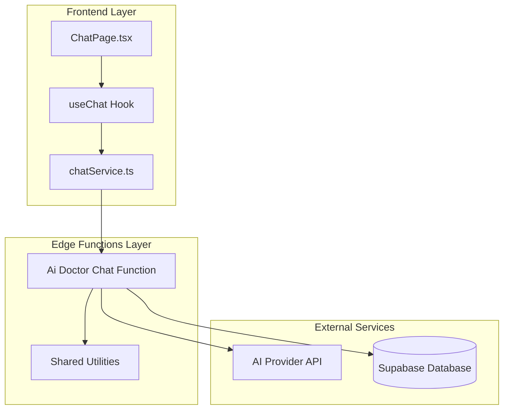
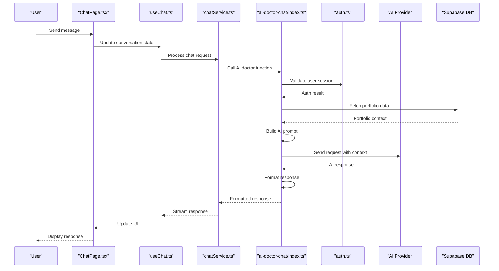
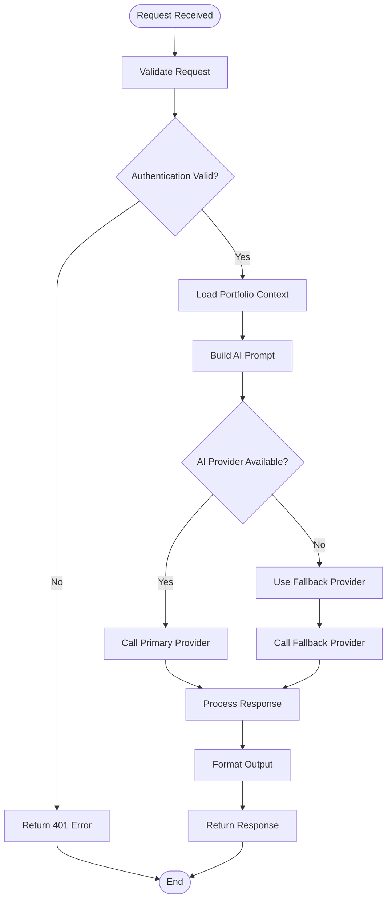
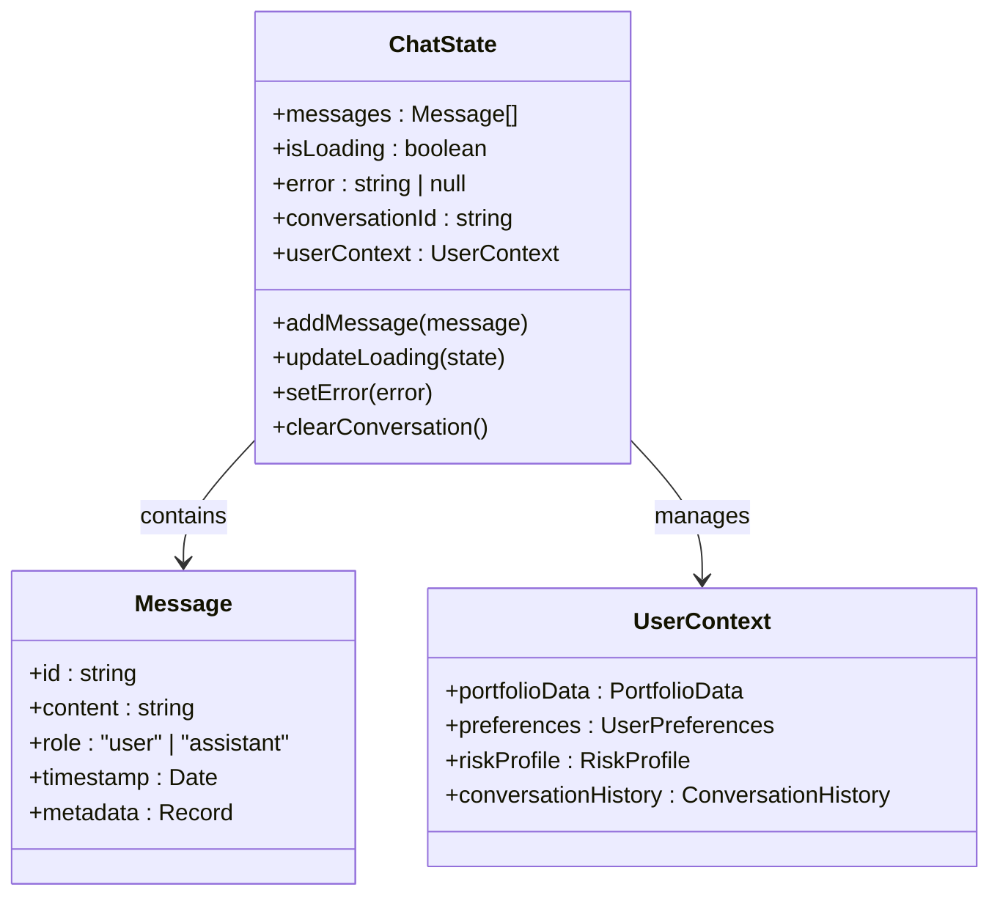
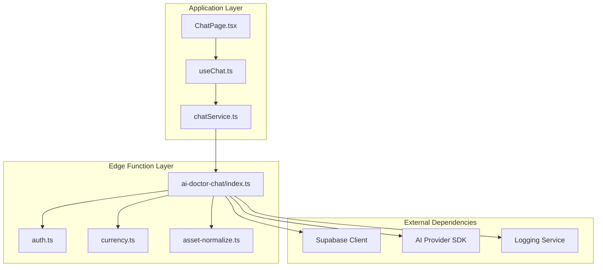

# AI Integration Functions

<cite>
**Referenced Files in This Document**
- [ai-doctor-chat/index.ts](file://supabase/functions/ai-doctor-chat/index.ts)
- [chatService.ts](file://src/services/chatService.ts)
- [useChat.ts](file://src/hooks/useChat.ts)
- [ChatPage.tsx](file://src/pages/desktop/ChatPage.tsx)
- [auth.ts](file://supabase/functions/_shared/auth.ts)
- [currency.ts](file://supabase/functions/_shared/currency.ts)
- [asset-normalize.ts](file://supabase/functions/_shared/asset-normalize.ts)
</cite>

## Table of Contents
1. [Introduction](#introduction)
2. [Project Structure](#project-structure)
3. [Core Components](#core-components)
4. [Architecture Overview](#architecture-overview)
5. [Detailed Component Analysis](#detailed-component-analysis)
6. [Dependency Analysis](#dependency-analysis)
7. [Performance Considerations](#performance-considerations)
8. [Troubleshooting Guide](#troubleshooting-guide)
9. [Safety and Compliance](#safety-and-compliance)
10. [Extensibility Guidelines](#extensibility-guidelines)
11. [Conclusion](#conclusion)

## Introduction

FinSight's AI Integration Functions represent a sophisticated edge computing architecture designed to provide intelligent financial advisory capabilities through natural language processing. The system implements an "AI Doctor" chat interface that analyzes portfolio health, provides personalized recommendations, and delivers actionable financial insights while maintaining strict security and compliance standards.

The AI integration leverages Supabase Edge Functions as the primary execution environment, enabling serverless computation close to users while ensuring secure handling of sensitive financial data. The implementation follows modern patterns for prompt engineering, context management, and response formatting specifically tailored for financial advice scenarios.

## Project Structure

The AI integration is distributed across multiple layers:

**Diagram sources**
- [ChatPage.tsx](file://src/pages/desktop/ChatPage.tsx)
- [useChat.ts](file://src/hooks/useChat.ts)
- [chatService.ts](file://src/services/chatService.ts)
- [ai-doctor-chat/index.ts](file://supabase/functions/ai-doctor-chat/index.ts)

**Section sources**
- [ChatPage.tsx](file://src/pages/desktop/ChatPage.tsx)
- [useChat.ts](file://src/hooks/useChat.ts)
- [chatService.ts](file://src/services/chatService.ts)
- [ai-doctor-chat/index.ts](file://supabase/functions/ai-doctor-chat/index.ts)

## Core Components

### AI Doctor Chat Function

The core AI doctor chat function serves as the central orchestrator for all AI-powered interactions. It handles request validation, context assembly, prompt generation, and response formatting while implementing robust error handling and fallback mechanisms.

Key responsibilities include:
- Authentication and authorization verification
- Portfolio data retrieval and normalization
- Context-aware prompt construction
- Multi-provider AI service integration
- Response sanitization and formatting
- Rate limiting and quota management

### Frontend Chat Interface

The frontend implementation provides a real-time chat experience with streaming responses, conversation history management, and responsive UI components designed for financial analysis workflows.

### Shared Utilities

Common utilities handle authentication validation, currency conversion, asset normalization, and other cross-cutting concerns required by multiple AI functions.

**Section sources**
- [ai-doctor-chat/index.ts](file://supabase/functions/ai-doctor-chat/index.ts)
- [chatService.ts](file://src/services/chatService.ts)
- [useChat.ts](file://src/hooks/useChat.ts)
- [auth.ts](file://supabase/functions/_shared/auth.ts)
- [currency.ts](file://supabase/functions/_shared/currency.ts)
- [asset-normalize.ts](file://supabase/functions/_shared/asset-normalize.ts)

## Architecture Overview

The AI integration follows a layered architecture pattern with clear separation of concerns:

**Diagram sources**
- [ChatPage.tsx](file://src/pages/desktop/ChatPage.tsx)
- [useChat.ts](file://src/hooks/useChat.ts)
- [chatService.ts](file://src/services/chatService.ts)
- [ai-doctor-chat/index.ts](file://supabase/functions/ai-doctor-chat/index.ts)
- [auth.ts](file://supabase/functions/_shared/auth.ts)

## Detailed Component Analysis

### AI Doctor Chat Implementation

The AI doctor chat function implements a sophisticated orchestration layer that manages the complete lifecycle of AI-powered financial advice requests.

#### Request Processing Flow

**Diagram sources**
- [ai-doctor-chat/index.ts](file://supabase/functions/ai-doctor-chat/index.ts)

#### Key Implementation Patterns

**Prompt Engineering Strategy**: The system uses dynamic prompt construction that adapts to user context, portfolio composition, and conversation history. Prompts are structured to ensure consistent output formats suitable for financial analysis.

**Context Management**: Rich contextual information including portfolio holdings, performance metrics, risk profiles, and user preferences are seamlessly integrated into AI requests without exposing sensitive data.

**Response Formatting**: All AI responses are processed through a formatting pipeline that ensures consistency, safety, and readability while maintaining the conversational nature of the interaction.

**Section sources**
- [ai-doctor-chat/index.ts](file://supabase/functions/ai-doctor-chat/index.ts)

### Frontend Chat Integration

The frontend implementation provides a seamless chat experience with advanced features for financial analysis workflows.

#### State Management Architecture

**Diagram sources**
- [useChat.ts](file://src/hooks/useChat.ts)

#### Real-time Communication

The chat interface implements WebSocket-based real-time communication for streaming AI responses, providing immediate feedback during complex financial analysis queries.

**Section sources**
- [useChat.ts](file://src/hooks/useChat.ts)
- [ChatPage.tsx](file://src/pages/desktop/ChatPage.tsx)

### Service Layer Abstraction

The chat service layer provides a clean abstraction over the AI doctor chat function, handling request serialization, response parsing, and error management.

#### API Contract Definition

The service layer defines a strict contract between frontend and backend components, ensuring type safety and consistent behavior across different deployment environments.

**Section sources**
- [chatService.ts](file://src/services/chatService.ts)

## Dependency Analysis

The AI integration exhibits a well-structured dependency hierarchy with clear separation between business logic and infrastructure concerns:

**Diagram sources**
- [ChatPage.tsx](file://src/pages/desktop/ChatPage.tsx)
- [useChat.ts](file://src/hooks/useChat.ts)
- [chatService.ts](file://src/services/chatService.ts)
- [ai-doctor-chat/index.ts](file://supabase/functions/ai-doctor-chat/index.ts)
- [auth.ts](file://supabase/functions/_shared/auth.ts)
- [currency.ts](file://supabase/functions/_shared/currency.ts)
- [asset-normalize.ts](file://supabase/functions/_shared/asset-normalize.ts)

### Coupling Analysis

The system demonstrates low coupling between components through well-defined interfaces and clear separation of concerns. Each module has specific responsibilities with minimal overlap, facilitating maintainability and testability.

### External Dependencies

The integration relies on several external services:
- **AI Provider APIs**: Multiple providers for redundancy and cost optimization
- **Supabase Database**: For portfolio data and conversation persistence
- **Authentication Service**: For user session validation
- **Logging Infrastructure**: For monitoring and debugging

**Section sources**
- [ai-doctor-chat/index.ts](file://supabase/functions/ai-doctor-chat/index.ts)
- [auth.ts](file://supabase/functions/_shared/auth.ts)

## Performance Considerations

### Caching Strategies

The AI integration implements multi-level caching to optimize response times and reduce API costs:

- **Conversation Context Caching**: Recent conversation contexts are cached to avoid redundant data fetching
- **Portfolio Data Caching**: Portfolio snapshots are cached with appropriate TTL values
- **Response Caching**: Common query patterns benefit from response caching when appropriate

### Streaming Responses

Real-time streaming of AI responses improves user experience by providing immediate feedback during complex financial analysis queries.

### Resource Optimization

Edge functions are optimized for cold start performance through lazy loading of dependencies and efficient resource utilization patterns.

## Troubleshooting Guide

### Common Issues and Solutions

**Authentication Failures**: Verify user session validity and check for proper token propagation through the request chain.

**AI Provider Timeouts**: Implement retry logic with exponential backoff and fallback provider switching.

**Context Overflow**: Monitor conversation length and implement context window management to prevent exceeding AI provider limits.

**Rate Limiting**: Handle rate limit errors gracefully with appropriate user feedback and retry strategies.

### Monitoring and Logging

Comprehensive logging captures request/response cycles, performance metrics, and error conditions for effective troubleshooting and monitoring.

**Section sources**
- [ai-doctor-chat/index.ts](file://supabase/functions/ai-doctor-chat/index.ts)

## Safety and Compliance

### Content Filtering

The AI integration implements multiple layers of content filtering to ensure responsible AI usage:

- **Input Validation**: Sanitize and validate all user inputs before processing
- **Output Filtering**: Filter AI responses for inappropriate or harmful content
- **Financial Advice Disclaimers**: Include mandatory disclaimers about investment advice limitations

### Data Privacy

Sensitive financial data is handled according to privacy best practices:
- **Data Minimization**: Only necessary data is included in AI prompts
- **Encryption**: All data transmission is encrypted in transit and at rest
- **Audit Trails**: Comprehensive logging of AI interactions for compliance purposes

### Responsible AI Usage

The system adheres to responsible AI principles:
- **Transparency**: Clear indication when AI is generating responses
- **Human Oversight**: Mechanisms for human review of critical financial advice
- **Bias Mitigation**: Regular auditing of AI outputs for potential biases

## Extensibility Guidelines

### Adding New AI Providers

To integrate additional AI providers:

1. **Implement Provider Interface**: Create a new provider adapter following the established interface
2. **Configure Credentials**: Add provider-specific configuration and secret management
3. **Update Fallback Logic**: Modify provider selection and fallback mechanisms
4. **Test Integration**: Thoroughly test the new provider with various input scenarios

### Extending Chat Capabilities

For adding new chat features:

1. **Define New Intent Types**: Extend the intent recognition system
2. **Create Specialized Handlers**: Implement handlers for new conversation types
3. **Update UI Components**: Modify frontend components to support new interaction patterns
4. **Add Analytics**: Track usage and effectiveness of new features

### Custom Prompt Templates

The system supports customizable prompt templates for different use cases:

- **Portfolio Analysis**: Specialized prompts for investment portfolio evaluation
- **Risk Assessment**: Prompts focused on risk analysis and mitigation strategies
- **Market Insights**: Market-focused prompts for trend analysis and opportunities

**Section sources**
- [ai-doctor-chat/index.ts](file://supabase/functions/ai-doctor-chat/index.ts)

## Conclusion

The FinSight AI Integration Functions represent a mature, production-ready implementation of AI-powered financial advisory capabilities. The architecture successfully balances functionality, security, and performance while maintaining extensibility for future enhancements.

Key strengths include:
- **Robust Security**: Comprehensive authentication and authorization mechanisms
- **High Availability**: Multi-provider AI integration with automatic failover
- **Excellent UX**: Real-time streaming responses with rich context awareness
- **Maintainable Codebase**: Clear separation of concerns and well-documented interfaces

The system provides a solid foundation for delivering intelligent financial advice while maintaining the highest standards of security, privacy, and responsible AI usage. Future enhancements can build upon this architecture to incorporate additional AI capabilities and expand the range of financial advisory services offered.