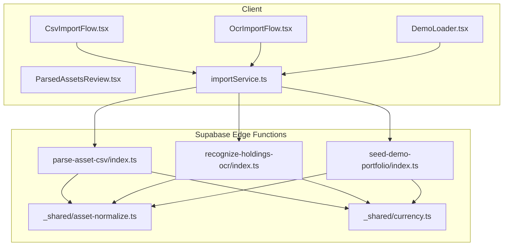
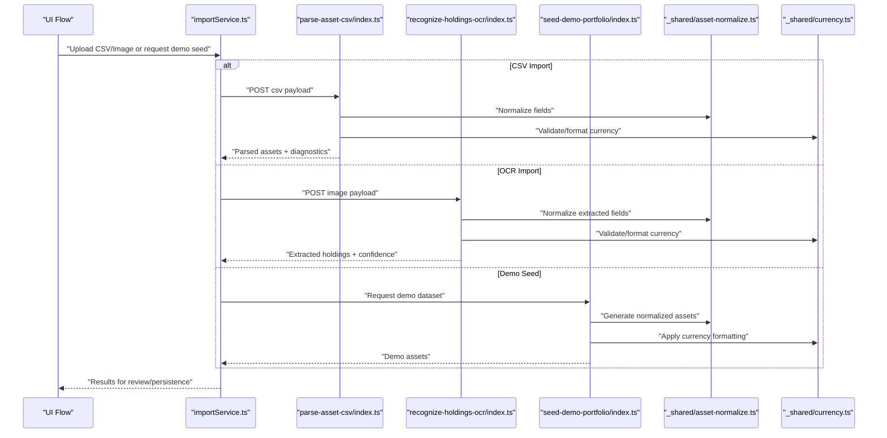
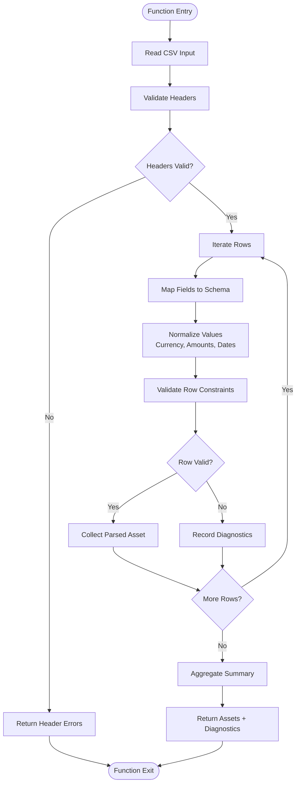
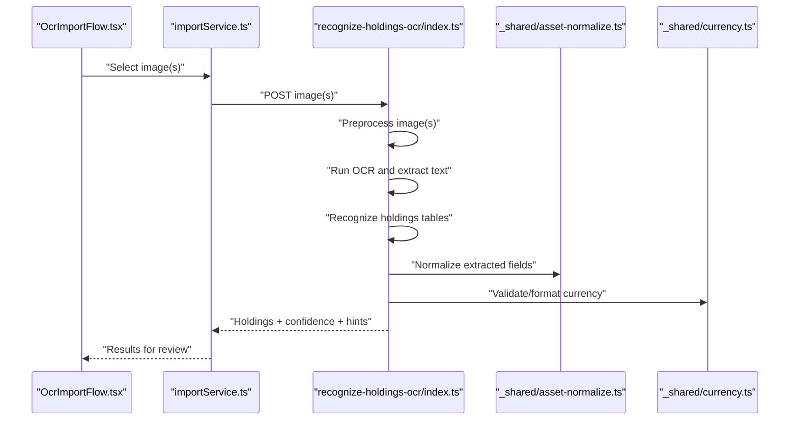
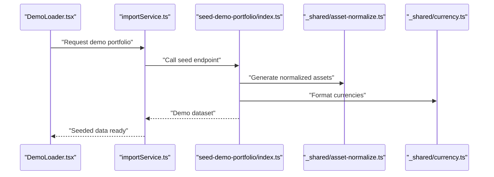
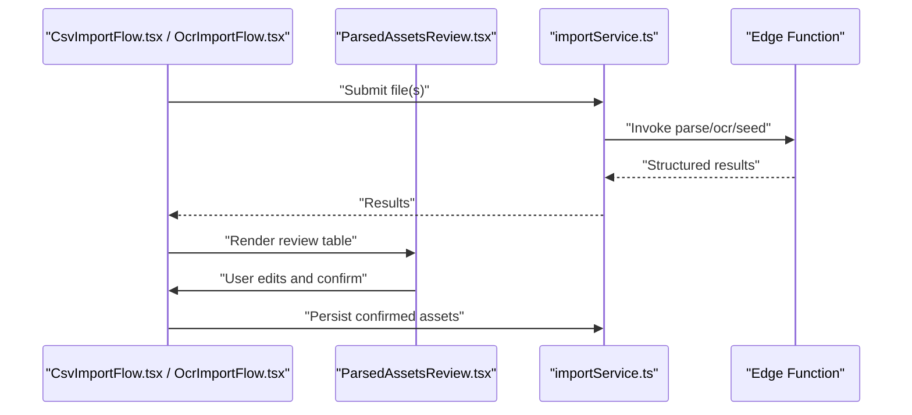
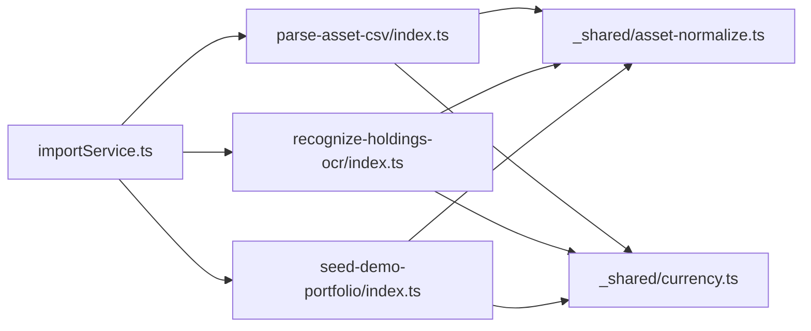

# Data Processing Functions

<cite>
**Referenced Files in This Document**
- [parse-asset-csv/index.ts](file://supabase/functions/parse-asset-csv/index.ts)
- [recognize-holdings-ocr/index.ts](file://supabase/functions/recognize-holdings-ocr/index.ts)
- [seed-demo-portfolio/index.ts](file://supabase/functions/seed-demo-portfolio/index.ts)
- [_shared/asset-normalize.ts](file://supabase/functions/_shared/asset-normalize.ts)
- [_shared/currency.ts](file://supabase/functions/_shared/currency.ts)
- [importService.ts](file://src/services/importService.ts)
- [CsvImportFlow.tsx](file://src/components/desktop/import/CsvImportFlow.tsx)
- [OcrImportFlow.tsx](file://src/components/desktop/import/OcrImportFlow.tsx)
- [DemoLoader.tsx](file://src/components/desktop/import/DemoLoader.tsx)
- [ParsedAssetsReview.tsx](file://src/components/desktop/import/ParsedAssetsReview.tsx)
</cite>

## Table of Contents
1. [Introduction](#introduction)
2. [Project Structure](#project-structure)
3. [Core Components](#core-components)
4. [Architecture Overview](#architecture-overview)
5. [Detailed Component Analysis](#detailed-component-analysis)
6. [Dependency Analysis](#dependency-analysis)
7. [Performance Considerations](#performance-considerations)
8. [Troubleshooting Guide](#troubleshooting-guide)
9. [Conclusion](#conclusion)

## Introduction
This document explains the data processing edge functions in FinSight with a focus on:
- CSV parsing for financial assets, including format validation, field mapping, and error handling
- OCR processing for financial documents, image recognition workflows, and extraction patterns
- Demo portfolio seeding functionality and test data generation
- Practical examples of file upload handling, batch processing, and transformation pipelines
- Performance optimization for large datasets, memory management, and timeout handling
- Troubleshooting guides for common parsing errors and OCR failures

The goal is to provide both high-level architecture understanding and code-level details for developers integrating or extending these capabilities.

## Project Structure
FinSight implements data processing via Supabase Edge Functions and client-side flows:
- Edge Functions:
  - parse-asset-csv: Parses uploaded CSV files into normalized asset records
  - recognize-holdings-ocr: Accepts images, runs OCR, and returns structured holdings
  - seed-demo-portfolio: Seeds demo portfolios for quick onboarding
  - Shared utilities: asset normalization and currency helpers
- Client-Side Flows:
  - Import services orchestrate uploads and call edge functions
  - UI flows guide users through CSV import, OCR import, review, and demo seeding

**Diagram sources**
- [CsvImportFlow.tsx](file://src/components/desktop/import/CsvImportFlow.tsx)
- [OcrImportFlow.tsx](file://src/components/desktop/import/OcrImportFlow.tsx)
- [DemoLoader.tsx](file://src/components/desktop/import/DemoLoader.tsx)
- [ParsedAssetsReview.tsx](file://src/components/desktop/import/ParsedAssetsReview.tsx)
- [importService.ts](file://src/services/importService.ts)
- [parse-asset-csv/index.ts](file://supabase/functions/parse-asset-csv/index.ts)
- [recognize-holdings-ocr/index.ts](file://supabase/functions/recognize-holdings-ocr/index.ts)
- [seed-demo-portfolio/index.ts](file://supabase/functions/seed-demo-portfolio/index.ts)
- [_shared/asset-normalize.ts](file://supabase/functions/_shared/asset-normalize.ts)
- [_shared/currency.ts](file://supabase/functions/_shared/currency.ts)

**Section sources**
- [parse-asset-csv/index.ts](file://supabase/functions/parse-asset-csv/index.ts)
- [recognize-holdings-ocr/index.ts](file://supabase/functions/recognize-holdings-ocr/index.ts)
- [seed-demo-portfolio/index.ts](file://supabase/functions/seed-demo-portfolio/index.ts)
- [_shared/asset-normalize.ts](file://supabase/functions/_shared/asset-normalize.ts)
- [_shared/currency.ts](file://supabase/functions/_shared/currency.ts)
- [importService.ts](file://src/services/importService.ts)
- [CsvImportFlow.tsx](file://src/components/desktop/import/CsvImportFlow.tsx)
- [OcrImportFlow.tsx](file://src/components/desktop/import/OcrImportFlow.tsx)
- [DemoLoader.tsx](file://src/components/desktop/import/DemoLoader.tsx)
- [ParsedAssetsReview.tsx](file://src/components/desktop/import/ParsedAssetsReview.tsx)

## Core Components
- CSV Parsing Edge Function:
  - Validates CSV headers and rows
  - Maps fields to canonical asset schema
  - Normalizes values (currency, amounts, dates)
  - Returns structured results with row-level diagnostics
- OCR Edge Function:
  - Accepts image payloads
  - Performs OCR and extracts holdings tables
  - Applies normalization and validation
  - Returns parsed items with confidence and error hints
- Demo Portfolio Seeder:
  - Generates synthetic but realistic portfolio data
  - Uses shared normalization and currency utilities
  - Provides deterministic seeds for testing and demos
- Shared Utilities:
  - Asset normalization: standardizes types, units, and identifiers
  - Currency helpers: validates codes, formats amounts, and handles conversions where applicable

**Section sources**
- [parse-asset-csv/index.ts](file://supabase/functions/parse-asset-csv/index.ts)
- [recognize-holdings-ocr/index.ts](file://supabase/functions/recognize-holdings-ocr/index.ts)
- [seed-demo-portfolio/index.ts](file://supabase/functions/seed-demo-portfolio/index.ts)
- [_shared/asset-normalize.ts](file://supabase/functions/_shared/asset-normalize.ts)
- [_shared/currency.ts](file://supabase/functions/_shared/currency.ts)

## Architecture Overview
The data processing pipeline integrates client flows with serverless edge functions:
- Client initiates import via UI flows
- Service layer prepares payloads and calls appropriate edge function
- Edge functions validate, transform, and normalize data using shared modules
- Results are returned to the client for review and persistence

**Diagram sources**
- [importService.ts](file://src/services/importService.ts)
- [parse-asset-csv/index.ts](file://supabase/functions/parse-asset-csv/index.ts)
- [recognize-holdings-ocr/index.ts](file://supabase/functions/recognize-holdings-ocr/index.ts)
- [seed-demo-portfolio/index.ts](file://supabase/functions/seed-demo-portfolio/index.ts)
- [_shared/asset-normalize.ts](file://supabase/functions/_shared/asset-normalize.ts)
- [_shared/currency.ts](file://supabase/functions/_shared/currency.ts)

## Detailed Component Analysis

### CSV Parsing Implementation
Responsibilities:
- Format validation: header checks, delimiter detection, row length consistency
- Field mapping: map source columns to canonical asset fields
- Error handling: per-row diagnostics, aggregate summary, partial success semantics
- Normalization: currency codes, numeric parsing, date parsing, type coercion

Processing logic overview:

Key implementation references:
- CSV parsing entry point and flow control
- Shared normalization and currency utilities used during mapping and validation

**Diagram sources**
- [parse-asset-csv/index.ts](file://supabase/functions/parse-asset-csv/index.ts)
- [_shared/asset-normalize.ts](file://supabase/functions/_shared/asset-normalize.ts)
- [_shared/currency.ts](file://supabase/functions/_shared/currency.ts)

**Section sources**
- [parse-asset-csv/index.ts](file://supabase/functions/parse-asset-csv/index.ts)
- [_shared/asset-normalize.ts](file://supabase/functions/_shared/asset-normalize.ts)
- [_shared/currency.ts](file://supabase/functions/_shared/currency.ts)

### OCR Processing for Financial Documents
Responsibilities:
- Image ingestion and preprocessing
- OCR execution and text extraction
- Table/field recognition for holdings
- Post-processing: normalization, validation, confidence scoring
- Error reporting with actionable hints

Workflow overview:

Practical notes:
- Batch multiple images when supported by the service layer
- Surface confidence scores and hints to guide user corrections
- Use shared normalization to ensure consistent output across sources

**Diagram sources**
- [OcrImportFlow.tsx](file://src/components/desktop/import/OcrImportFlow.tsx)
- [importService.ts](file://src/services/importService.ts)
- [recognize-holdings-ocr/index.ts](file://supabase/functions/recognize-holdings-ocr/index.ts)
- [_shared/asset-normalize.ts](file://supabase/functions/_shared/asset-normalize.ts)
- [_shared/currency.ts](file://supabase/functions/_shared/currency.ts)

**Section sources**
- [recognize-holdings-ocr/index.ts](file://supabase/functions/recognize-holdings-ocr/index.ts)
- [OcrImportFlow.tsx](file://src/components/desktop/import/OcrImportFlow.tsx)
- [importService.ts](file://src/services/importService.ts)
- [_shared/asset-normalize.ts](file://supabase/functions/_shared/asset-normalize.ts)
- [_shared/currency.ts](file://supabase/functions/_shared/currency.ts)

### Demo Portfolio Seeding and Test Data Generation
Responsibilities:
- Generate realistic synthetic holdings and account metadata
- Apply normalization and currency formatting consistently
- Provide deterministic seeds for reproducible tests and demos

Typical usage:
- Trigger from UI to populate sample data quickly
- Use in automated tests to validate dashboards and reports

**Diagram sources**
- [DemoLoader.tsx](file://src/components/desktop/import/DemoLoader.tsx)
- [importService.ts](file://src/services/importService.ts)
- [seed-demo-portfolio/index.ts](file://supabase/functions/seed-demo-portfolio/index.ts)
- [_shared/asset-normalize.ts](file://supabase/functions/_shared/asset-normalize.ts)
- [_shared/currency.ts](file://supabase/functions/_shared/currency.ts)

**Section sources**
- [seed-demo-portfolio/index.ts](file://supabase/functions/seed-demo-portfolio/index.ts)
- [DemoLoader.tsx](file://src/components/desktop/import/DemoLoader.tsx)
- [importService.ts](file://src/services/importService.ts)
- [_shared/asset-normalize.ts](file://supabase/functions/_shared/asset-normalize.ts)
- [_shared/currency.ts](file://supabase/functions/_shared/currency.ts)

### File Upload Handling and Review
Client responsibilities:
- Capture files from user input
- Prepare multipart/form-data or JSON payloads
- Call appropriate edge function via service layer
- Present results for review and correction

Review workflow:

**Diagram sources**
- [CsvImportFlow.tsx](file://src/components/desktop/import/CsvImportFlow.tsx)
- [OcrImportFlow.tsx](file://src/components/desktop/import/OcrImportFlow.tsx)
- [ParsedAssetsReview.tsx](file://src/components/desktop/import/ParsedAssetsReview.tsx)
- [importService.ts](file://src/services/importService.ts)

**Section sources**
- [CsvImportFlow.tsx](file://src/components/desktop/import/CsvImportFlow.tsx)
- [OcrImportFlow.tsx](file://src/components/desktop/import/OcrImportFlow.tsx)
- [ParsedAssetsReview.tsx](file://src/components/desktop/import/ParsedAssetsReview.tsx)
- [importService.ts](file://src/services/importService.ts)

## Dependency Analysis
Shared dependencies:
- Asset normalization module used by all data processing functions
- Currency utilities for validation and formatting
- Client service layer orchestrating calls to edge functions

**Diagram sources**
- [parse-asset-csv/index.ts](file://supabase/functions/parse-asset-csv/index.ts)
- [recognize-holdings-ocr/index.ts](file://supabase/functions/recognize-holdings-ocr/index.ts)
- [seed-demo-portfolio/index.ts](file://supabase/functions/seed-demo-portfolio/index.ts)
- [_shared/asset-normalize.ts](file://supabase/functions/_shared/asset-normalize.ts)
- [_shared/currency.ts](file://supabase/functions/_shared/currency.ts)
- [importService.ts](file://src/services/importService.ts)

**Section sources**
- [parse-asset-csv/index.ts](file://supabase/functions/parse-asset-csv/index.ts)
- [recognize-holdings-ocr/index.ts](file://supabase/functions/recognize-holdings-ocr/index.ts)
- [seed-demo-portfolio/index.ts](file://supabase/functions/seed-demo-portfolio/index.ts)
- [_shared/asset-normalize.ts](file://supabase/functions/_shared/asset-normalize.ts)
- [_shared/currency.ts](file://supabase/functions/_shared/currency.ts)
- [importService.ts](file://src/services/importService.ts)

## Performance Considerations
- Streaming and chunking:
  - For large CSVs, process rows incrementally to avoid loading entire files into memory
  - For OCR, consider resizing/compressing images before upload
- Batch processing:
  - Group small batches to reduce overhead while keeping payloads manageable
- Timeouts:
  - Set reasonable timeouts for long-running operations; return partial results with diagnostics when possible
- Memory management:
  - Avoid retaining large intermediate structures; release references after normalization
- Concurrency:
  - Limit concurrent requests to prevent resource exhaustion at the edge
- Caching:
  - Cache FX rates and lookup tables if used within processing functions

[No sources needed since this section provides general guidance]

## Troubleshooting Guide
Common CSV parsing issues:
- Invalid or missing headers: check header names and expected order
- Malformed rows: verify delimiters, quoting, and column counts
- Numeric parsing errors: inspect amount formats, separators, and negative signs
- Date parsing errors: ensure consistent date formats and timezones
- Currency mismatches: validate ISO codes and localized symbols

Common OCR issues:
- Poor image quality: recommend higher resolution, better lighting, and straightened scans
- Unrecognized tables: suggest reformatting or providing clearer tabular layouts
- Low confidence outputs: prompt users to review and correct fields
- Language/script support: ensure OCR model supports document language

Operational tips:
- Inspect diagnostics returned by parsing functions to pinpoint problematic rows
- Use demo seeding to validate end-to-end flows without real data
- Log and surface actionable hints to users for faster remediation

**Section sources**
- [parse-asset-csv/index.ts](file://supabase/functions/parse-asset-csv/index.ts)
- [recognize-holdings-ocr/index.ts](file://supabase/functions/recognize-holdings-ocr/index.ts)

## Conclusion
FinSight’s data processing functions provide robust, reusable pipelines for CSV parsing, OCR-based holdings extraction, and demo portfolio seeding. By leveraging shared normalization and currency utilities, the system ensures consistent data shapes and reliable transformations. The client flows integrate seamlessly with edge functions to deliver an intuitive import experience, while performance and troubleshooting strategies help maintain reliability at scale.