# Edge Functions Development

<cite>
**Referenced Files in This Document**
- [supabase/functions/_shared/auth.ts](file://supabase/functions/_shared/auth.ts)
- [supabase/functions/_shared/currency.ts](file://supabase/functions/_shared/currency.ts)
- [supabase/functions/_shared/asset-normalize.ts](file://supabase/functions/_shared/asset-normalize.ts)
- [supabase/functions/parse-asset-csv/index.ts](file://supabase/functions/parse-asset-csv/index.ts)
- [supabase/functions/recognize-holdings-ocr/index.ts](file://supabase/functions/recognize-holdings-ocr/index.ts)
- [supabase/functions/get-fx-rates/index.ts](file://supabase/functions/get-fx-rates/index.ts)
- [supabase/functions/compute-xray-report/index.ts](file://supabase/functions/compute-xray-report/index.ts)
- [supabase/functions/ai-doctor-chat/index.ts](file://supabase/functions/ai-doctor-chat/index.ts)
- [supabase/functions/create-shared-report/index.ts](file://supabase/functions/create-shared-report/index.ts)
- [supabase/functions/read-shared-report/index.ts](file://supabase/functions/read-shared-report/index.ts)
- [supabase/functions/run-stress-test/index.ts](file://supabase/functions/run-stress-test/index.ts)
- [supabase/functions/s3-pre-sign-url/index.ts](file://supabase/functions/s3-pre-sign-url/index.ts)
- [supabase/functions/seed-demo-portfolio/index.ts](file://supabase/functions/seed-demo-portfolio/index.ts)
- [src/services/importService.ts](file://src/services/importService.ts)
- [src/services/fxService.ts](file://src/services/fxService.ts)
- [src/services/chatService.ts](file://src/services/chatService.ts)
- [src/services/xrayService.ts](file://src/services/xrayService.ts)
- [src/hooks/useFxRates.ts](file://src/hooks/useFxRates.ts)
- [src/lib/currency.ts](file://src/lib/currency.ts)
</cite>

## Table of Contents
1. [Introduction](#introduction)
2. [Project Structure](#project-structure)
3. [Core Components](#core-components)
4. [Architecture Overview](#architecture-overview)
5. [Detailed Component Analysis](#detailed-component-analysis)
6. [Dependency Analysis](#dependency-analysis)
7. [Performance Considerations](#performance-considerations)
8. [Troubleshooting Guide](#troubleshooting-guide)
9. [Conclusion](#conclusion)
10. [Appendices](#appendices)

## Introduction
This document explains how to develop and operate Edge Functions for FinSight, focusing on function structure, request/response handling, authentication patterns, data processing (CSV parsing, OCR, financial calculations), error handling, logging, debugging, deployment, versioning, performance optimization, security, and testing strategies. It provides practical examples for portfolio analysis, currency rate fetching, and AI-powered chat features.

## Project Structure
FinSight organizes serverless logic under supabase/functions with shared utilities in a _shared directory. The frontend calls these functions via service modules and hooks that encapsulate HTTP interactions and error handling.

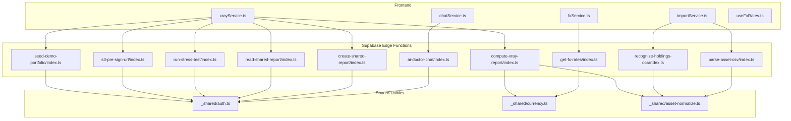

**Diagram sources**
- [src/services/importService.ts](file://src/services/importService.ts)
- [src/services/fxService.ts](file://src/services/fxService.ts)
- [src/services/chatService.ts](file://src/services/chatService.ts)
- [src/services/xrayService.ts](file://src/services/xrayService.ts)
- [supabase/functions/parse-asset-csv/index.ts](file://supabase/functions/parse-asset-csv/index.ts)
- [supabase/functions/recognize-holdings-ocr/index.ts](file://supabase/functions/recognize-holdings-ocr/index.ts)
- [supabase/functions/get-fx-rates/index.ts](file://supabase/functions/get-fx-rates/index.ts)
- [supabase/functions/compute-xray-report/index.ts](file://supabase/functions/compute-xray-report/index.ts)
- [supabase/functions/ai-doctor-chat/index.ts](file://supabase/functions/ai-doctor-chat/index.ts)
- [supabase/functions/create-shared-report/index.ts](file://supabase/functions/create-shared-report/index.ts)
- [supabase/functions/read-shared-report/index.ts](file://supabase/functions/read-shared-report/index.ts)
- [supabase/functions/run-stress-test/index.ts](file://supabase/functions/run-stress-test/index.ts)
- [supabase/functions/s3-pre-sign-url/index.ts](file://supabase/functions/s3-pre-sign-url/index.ts)
- [supabase/functions/seed-demo-portfolio/index.ts](file://supabase/functions/seed-demo-portfolio/index.ts)
- [supabase/functions/_shared/auth.ts](file://supabase/functions/_shared/auth.ts)
- [supabase/functions/_shared/currency.ts](file://supabase/functions/_shared/currency.ts)
- [supabase/functions/_shared/asset-normalize.ts](file://supabase/functions/_shared/asset-normalize.ts)

**Section sources**
- [src/services/importService.ts](file://src/services/importService.ts)
- [src/services/fxService.ts](file://src/services/fxService.ts)
- [src/services/chatService.ts](file://src/services/chatService.ts)
- [src/services/xrayService.ts](file://src/services/xrayService.ts)
- [supabase/functions/_shared/auth.ts](file://supabase/functions/_shared/auth.ts)
- [supabase/functions/_shared/currency.ts](file://supabase/functions/_shared/currency.ts)
- [supabase/functions/_shared/asset-normalize.ts](file://supabase/functions/_shared/asset-normalize.ts)

## Core Components
- Authentication middleware: Centralized validation and user context extraction used by most functions.
- Currency utilities: Normalization and conversion helpers for FX rates and currency codes.
- Asset normalization: Standardizes asset records across import flows.
- Function entry points: Each Edge Function exposes a single handler that validates input, performs work, and returns structured JSON responses.

Key responsibilities:
- parse-asset-csv: Ingest CSV payloads, validate rows, normalize assets, and return parsed results.
- recognize-holdings-ocr: Accept image or PDF, run OCR, extract holdings, and normalize into assets.
- get-fx-rates: Fetch and cache exchange rates from external APIs; expose stable endpoints.
- compute-xray-report: Aggregate portfolio data, compute risk metrics, and return report objects.
- ai-doctor-chat: Stream or process prompts through an AI provider and return chat responses.
- create/read-shared-report: Manage shareable report artifacts with access control.
- run-stress-test: Execute load scenarios and return performance metrics.
- s3-pre-sign-url: Generate secure upload/download URLs for large assets.
- seed-demo-portfolio: Populate sample data for development and demos.

**Section sources**
- [supabase/functions/_shared/auth.ts](file://supabase/functions/_shared/auth.ts)
- [supabase/functions/_shared/currency.ts](file://supabase/functions/_shared/currency.ts)
- [supabase/functions/_shared/asset-normalize.ts](file://supabase/functions/_shared/asset-normalize.ts)
- [supabase/functions/parse-asset-csv/index.ts](file://supabase/functions/parse-asset-csv/index.ts)
- [supabase/functions/recognize-holdings-ocr/index.ts](file://supabase/functions/recognize-holdings-ocr/index.ts)
- [supabase/functions/get-fx-rates/index.ts](file://supabase/functions/get-fx-rates/index.ts)
- [supabase/functions/compute-xray-report/index.ts](file://supabase/functions/compute-xray-report/index.ts)
- [supabase/functions/ai-doctor-chat/index.ts](file://supabase/functions/ai-doctor-chat/index.ts)
- [supabase/functions/create-shared-report/index.ts](file://supabase/functions/create-shared-report/index.ts)
- [supabase/functions/read-shared-report/index.ts](file://supabase/functions/read-shared-report/index.ts)
- [supabase/functions/run-stress-test/index.ts](file://supabase/functions/run-stress-test/index.ts)
- [supabase/functions/s3-pre-sign-url/index.ts](file://supabase/functions/s3-pre-sign-url/index.ts)
- [supabase/functions/seed-demo-portfolio/index.ts](file://supabase/functions/seed-demo-portfolio/index.ts)

## Architecture Overview
The system follows a clear separation between client services and serverless functions. Client services handle HTTP requests, retries, timeouts, and error mapping. Functions focus on business logic, data transformation, and integration with external services. Shared utilities ensure consistency across functions.

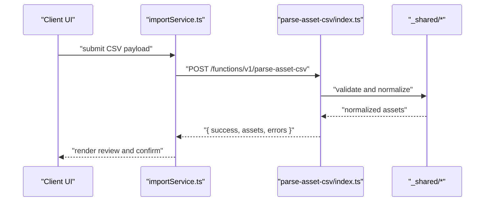

**Diagram sources**
- [src/services/importService.ts](file://src/services/importService.ts)
- [supabase/functions/parse-asset-csv/index.ts](file://supabase/functions/parse-asset-csv/index.ts)
- [supabase/functions/_shared/asset-normalize.ts](file://supabase/functions/_shared/asset-normalize.ts)

## Detailed Component Analysis

### Authentication Pattern
Most functions rely on a shared auth helper to verify the caller’s identity and attach user context. Typical flow:
- Extract token from headers
- Validate signature and claims
- Attach user ID and roles to request context
- Enforce per-function authorization checks

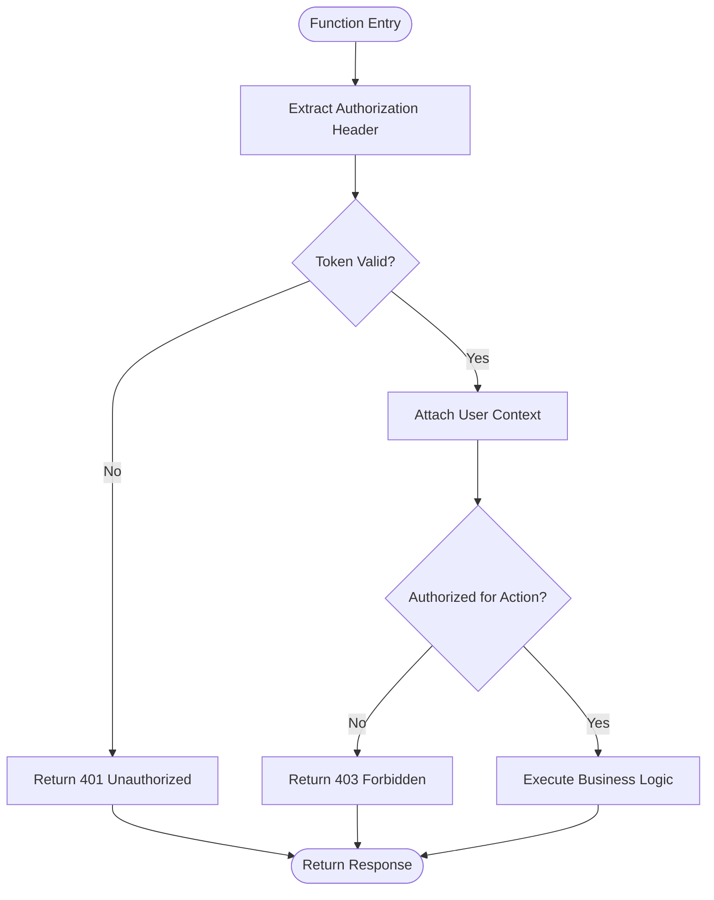

**Diagram sources**
- [supabase/functions/_shared/auth.ts](file://supabase/functions/_shared/auth.ts)

**Section sources**
- [supabase/functions/_shared/auth.ts](file://supabase/functions/_shared/auth.ts)

### CSV Parsing Flow
The CSV parser normalizes rows, validates fields, and returns both successful assets and row-level errors for review.

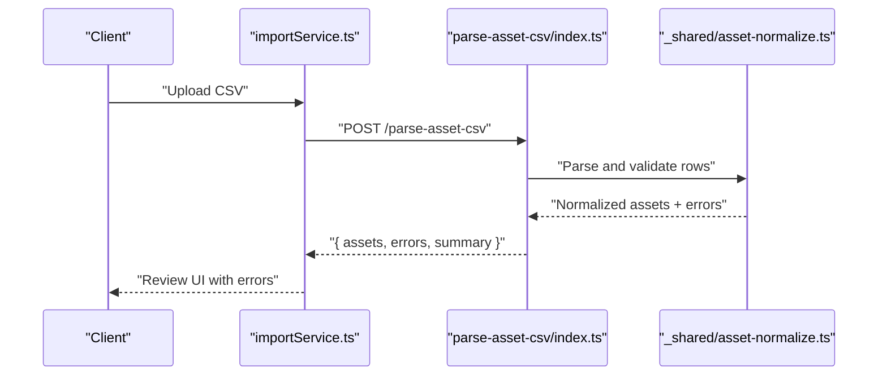

**Diagram sources**
- [src/services/importService.ts](file://src/services/importService.ts)
- [supabase/functions/parse-asset-csv/index.ts](file://supabase/functions/parse-asset-csv/index.ts)
- [supabase/functions/_shared/asset-normalize.ts](file://supabase/functions/_shared/asset-normalize.ts)

**Section sources**
- [src/services/importService.ts](file://src/services/importService.ts)
- [supabase/functions/parse-asset-csv/index.ts](file://supabase/functions/parse-asset-csv/index.ts)
- [supabase/functions/_shared/asset-normalize.ts](file://supabase/functions/_shared/asset-normalize.ts)

### OCR Holdings Recognition
OCR ingestion accepts images/PDFs, extracts text, identifies holdings, and maps them to normalized assets.

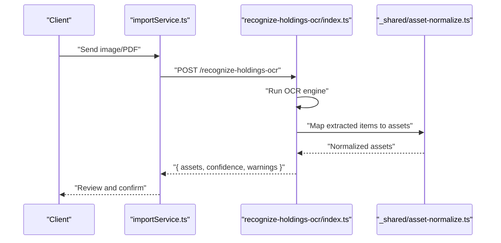

**Diagram sources**
- [src/services/importService.ts](file://src/services/importService.ts)
- [supabase/functions/recognize-holdings-ocr/index.ts](file://supabase/functions/recognize-holdings-ocr/index.ts)
- [supabase/functions/_shared/asset-normalize.ts](file://supabase/functions/_shared/asset-normalize.ts)

**Section sources**
- [src/services/importService.ts](file://src/services/importService.ts)
- [supabase/functions/recognize-holdings-ocr/index.ts](file://supabase/functions/recognize-holdings-ocr/index.ts)
- [supabase/functions/_shared/asset-normalize.ts](file://supabase/functions/_shared/asset-normalize.ts)

### Currency Rate Fetching
FX rates are fetched from external providers, cached where possible, and returned in a consistent format.

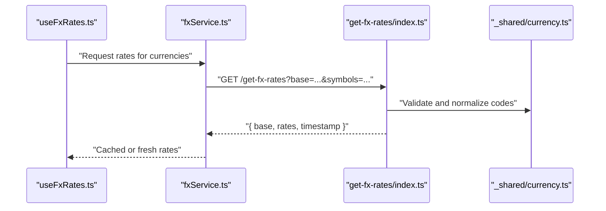

**Diagram sources**
- [src/hooks/useFxRates.ts](file://src/hooks/useFxRates.ts)
- [src/services/fxService.ts](file://src/services/fxService.ts)
- [supabase/functions/get-fx-rates/index.ts](file://supabase/functions/get-fx-rates/index.ts)
- [supabase/functions/_shared/currency.ts](file://supabase/functions/_shared/currency.ts)

**Section sources**
- [src/hooks/useFxRates.ts](file://src/hooks/useFxRates.ts)
- [src/services/fxService.ts](file://src/services/fxService.ts)
- [supabase/functions/get-fx-rates/index.ts](file://supabase/functions/get-fx-rates/index.ts)
- [supabase/functions/_shared/currency.ts](file://supabase/functions/_shared/currency.ts)

### Portfolio X-Ray Report
X-ray computation aggregates holdings, applies FX normalization, and calculates risk metrics.

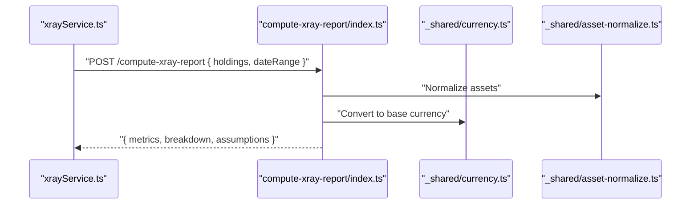

**Diagram sources**
- [src/services/xrayService.ts](file://src/services/xrayService.ts)
- [supabase/functions/compute-xray-report/index.ts](file://supabase/functions/compute-xray-report/index.ts)
- [supabase/functions/_shared/currency.ts](file://supabase/functions/_shared/currency.ts)
- [supabase/functions/_shared/asset-normalize.ts](file://supabase/functions/_shared/asset-normalize.ts)

**Section sources**
- [src/services/xrayService.ts](file://src/services/xrayService.ts)
- [supabase/functions/compute-xray-report/index.ts](file://supabase/functions/compute-xray-report/index.ts)
- [supabase/functions/_shared/currency.ts](file://supabase/functions/_shared/currency.ts)
- [supabase/functions/_shared/asset-normalize.ts](file://supabase/functions/_shared/asset-normalize.ts)

### AI-Powered Chat
Chat endpoints integrate with AI providers, stream responses when supported, and enforce authentication.

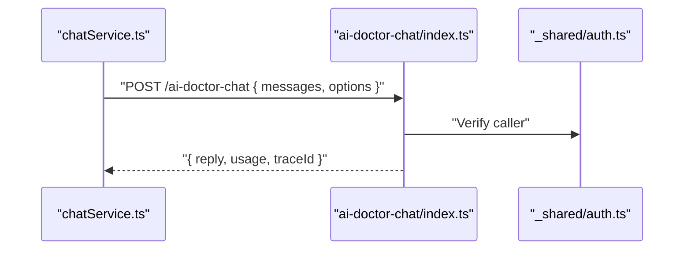

**Diagram sources**
- [src/services/chatService.ts](file://src/services/chatService.ts)
- [supabase/functions/ai-doctor-chat/index.ts](file://supabase/functions/ai-doctor-chat/index.ts)
- [supabase/functions/_shared/auth.ts](file://supabase/functions/_shared/auth.ts)

**Section sources**
- [src/services/chatService.ts](file://src/services/chatService.ts)
- [supabase/functions/ai-doctor-chat/index.ts](file://supabase/functions/ai-doctor-chat/index.ts)
- [supabase/functions/_shared/auth.ts](file://supabase/functions/_shared/auth.ts)

### Shared Reports
Create and read shared reports with access control and optional signing.

```mermaid
sequenceDiagram
participant Svc as "xrayService.ts"
participant Create as "create-shared-report/index.ts"
participant Read as "read-shared-report/index.ts"
participant Auth as "_shared/auth.ts"
Svc->>Create : "POST /create-shared-report { data }"
Create->>Auth : "Authorize writer"
Create-->>Svc : "{ reportId, url }"
Svc->>Read : "GET /read-shared-report?id=..."
Read->>Auth : "Authorize reader"
Read-->>Svc : "{ report }"
```

**Diagram sources**
- [src/services/xrayService.ts](file://src/services/xrayService.ts)
- [supabase/functions/create-shared-report/index.ts](file://supabase/functions/create-shared-report/index.ts)
- [supabase/functions/read-shared-report/index.ts](file://supabase/functions/read-shared-report/index.ts)
- [supabase/functions/_shared/auth.ts](file://supabase/functions/_shared/auth.ts)

**Section sources**
- [src/services/xrayService.ts](file://src/services/xrayService.ts)
- [supabase/functions/create-shared-report/index.ts](file://supabase/functions/create-shared-report/index.ts)
- [supabase/functions/read-shared-report/index.ts](file://supabase/functions/read-shared-report/index.ts)
- [supabase/functions/_shared/auth.ts](file://supabase/functions/_shared/auth.ts)

### Stress Testing
Stress test endpoint executes load scenarios and returns metrics for performance evaluation.

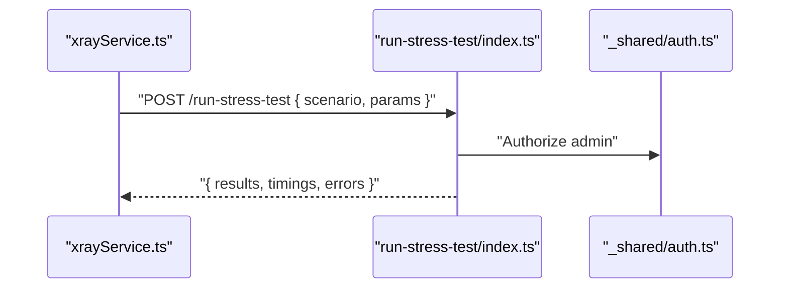

**Diagram sources**
- [src/services/xrayService.ts](file://src/services/xrayService.ts)
- [supabase/functions/run-stress-test/index.ts](file://supabase/functions/run-stress-test/index.ts)
- [supabase/functions/_shared/auth.ts](file://supabase/functions/_shared/auth.ts)

**Section sources**
- [src/services/xrayService.ts](file://src/services/xrayService.ts)
- [supabase/functions/run-stress-test/index.ts](file://supabase/functions/run-stress-test/index.ts)
- [supabase/functions/_shared/auth.ts](file://supabase/functions/_shared/auth.ts)

### S3 Pre-Sign URL
Generate secure temporary URLs for uploading/downloading large files.

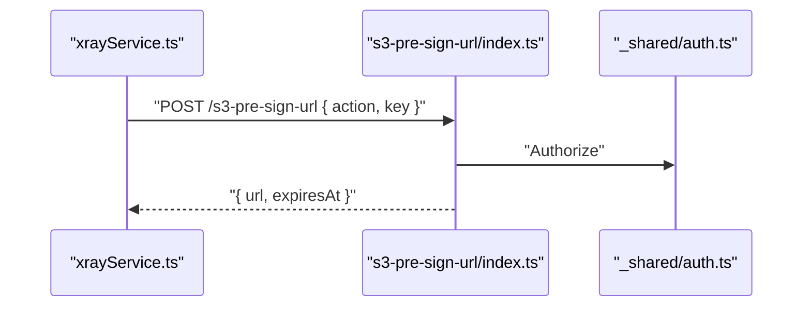

**Diagram sources**
- [src/services/xrayService.ts](file://src/services/xrayService.ts)
- [supabase/functions/s3-pre-sign-url/index.ts](file://supabase/functions/s3-pre-sign-url/index.ts)
- [supabase/functions/_shared/auth.ts](file://supabase/functions/_shared/auth.ts)

**Section sources**
- [src/services/xrayService.ts](file://src/services/xrayService.ts)
- [supabase/functions/s3-pre-sign-url/index.ts](file://supabase/functions/s3-pre-sign-url/index.ts)
- [supabase/functions/_shared/auth.ts](file://supabase/functions/_shared/auth.ts)

### Seed Demo Portfolio
Populates sample data for quick setup and demonstrations.

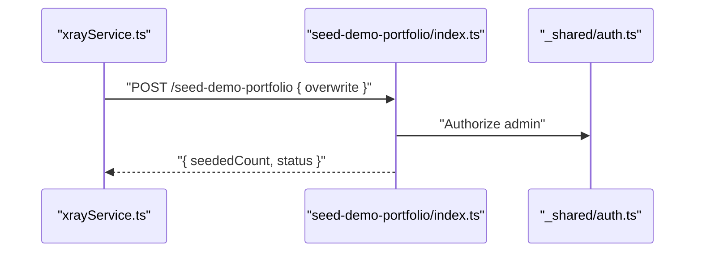

**Diagram sources**
- [src/services/xrayService.ts](file://src/services/xrayService.ts)
- [supabase/functions/seed-demo-portfolio/index.ts](file://supabase/functions/seed-demo-portfolio/index.ts)
- [supabase/functions/_shared/auth.ts](file://supabase/functions/_shared/auth.ts)

**Section sources**
- [src/services/xrayService.ts](file://src/services/xrayService.ts)
- [supabase/functions/seed-demo-portfolio/index.ts](file://supabase/functions/seed-demo-portfolio/index.ts)
- [supabase/functions/_shared/auth.ts](file://supabase/functions/_shared/auth.ts)

## Dependency Analysis
Functions depend on shared utilities for consistent behavior. Client services abstract HTTP details and provide typed interfaces.

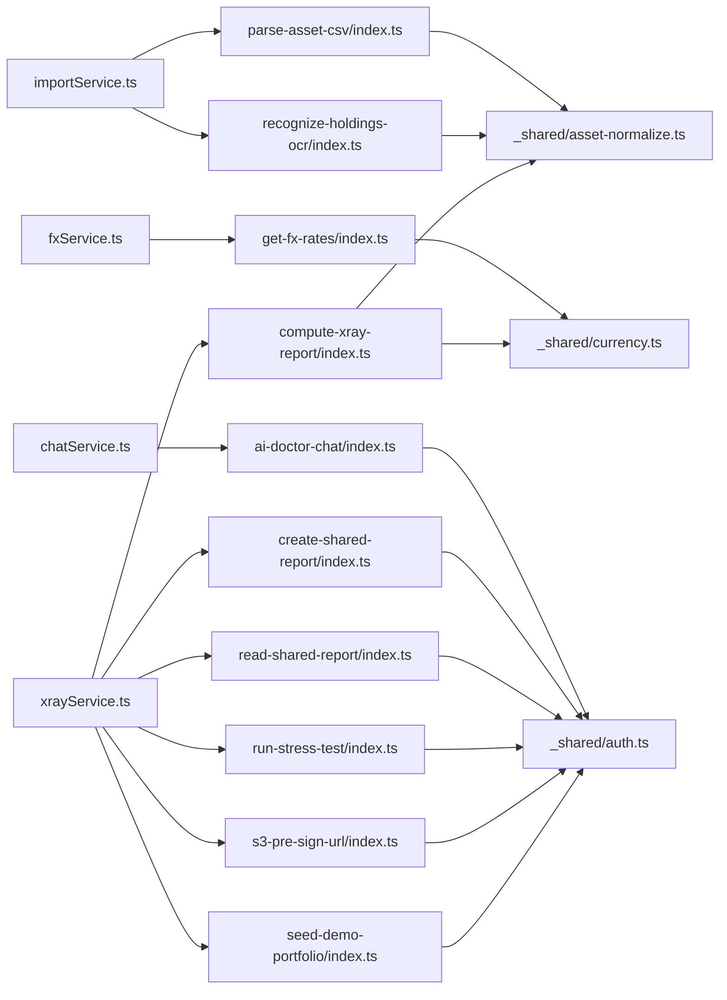

**Diagram sources**
- [src/services/importService.ts](file://src/services/importService.ts)
- [src/services/fxService.ts](file://src/services/fxService.ts)
- [src/services/chatService.ts](file://src/services/chatService.ts)
- [src/services/xrayService.ts](file://src/services/xrayService.ts)
- [supabase/functions/parse-asset-csv/index.ts](file://supabase/functions/parse-asset-csv/index.ts)
- [supabase/functions/recognize-holdings-ocr/index.ts](file://supabase/functions/recognize-holdings-ocr/index.ts)
- [supabase/functions/get-fx-rates/index.ts](file://supabase/functions/get-fx-rates/index.ts)
- [supabase/functions/compute-xray-report/index.ts](file://supabase/functions/compute-xray-report/index.ts)
- [supabase/functions/ai-doctor-chat/index.ts](file://supabase/functions/ai-doctor-chat/index.ts)
- [supabase/functions/create-shared-report/index.ts](file://supabase/functions/create-shared-report/index.ts)
- [supabase/functions/read-shared-report/index.ts](file://supabase/functions/read-shared-report/index.ts)
- [supabase/functions/run-stress-test/index.ts](file://supabase/functions/run-stress-test/index.ts)
- [supabase/functions/s3-pre-sign-url/index.ts](file://supabase/functions/s3-pre-sign-url/index.ts)
- [supabase/functions/seed-demo-portfolio/index.ts](file://supabase/functions/seed-demo-portfolio/index.ts)
- [supabase/functions/_shared/auth.ts](file://supabase/functions/_shared/auth.ts)
- [supabase/functions/_shared/currency.ts](file://supabase/functions/_shared/currency.ts)
- [supabase/functions/_shared/asset-normalize.ts](file://supabase/functions/_shared/asset-normalize.ts)

**Section sources**
- [src/services/importService.ts](file://src/services/importService.ts)
- [src/services/fxService.ts](file://src/services/fxService.ts)
- [src/services/chatService.ts](file://src/services/chatService.ts)
- [src/services/xrayService.ts](file://src/services/xrayService.ts)
- [supabase/functions/_shared/auth.ts](file://supabase/functions/_shared/auth.ts)
- [supabase/functions/_shared/currency.ts](file://supabase/functions/_shared/currency.ts)
- [supabase/functions/_shared/asset-normalize.ts](file://supabase/functions/_shared/asset-normalize.ts)

## Performance Considerations
- Cache FX rates at the edge to reduce external API calls and latency.
- Use streaming for AI chat responses to improve perceived responsiveness.
- Batch operations where possible (e.g., multiple asset imports).
- Minimize payload sizes by compressing large inputs and returning only necessary fields.
- Implement timeouts and retries with exponential backoff for external dependencies.
- Profile hot paths using timing logs and metrics to identify bottlenecks.

[No sources needed since this section provides general guidance]

## Troubleshooting Guide
Common issues and resolutions:
- Authentication failures: Verify token presence, validity, and permissions. Check error codes and logs for unauthorized or forbidden responses.
- CSV parsing errors: Inspect row-level errors and schema mismatches. Ensure consistent column names and formats.
- OCR accuracy: Review confidence scores and warnings; adjust preprocessing or model parameters.
- FX rate fetch failures: Handle network errors and fallback to cached values; log provider responses.
- Large file uploads: Use pre-signed URLs and chunked uploads; monitor storage quotas.

Debugging techniques:
- Add structured logging with correlation IDs for request tracing.
- Enable verbose logs in development and redact sensitive data.
- Use local emulation tools to test functions offline.
- Instrument client services with retry and timeout diagnostics.

**Section sources**
- [supabase/functions/_shared/auth.ts](file://supabase/functions/_shared/auth.ts)
- [supabase/functions/parse-asset-csv/index.ts](file://supabase/functions/parse-asset-csv/index.ts)
- [supabase/functions/recognize-holdings-ocr/index.ts](file://supabase/functions/recognize-holdings-ocr/index.ts)
- [supabase/functions/get-fx-rates/index.ts](file://supabase/functions/get-fx-rates/index.ts)
- [supabase/functions/s3-pre-sign-url/index.ts](file://supabase/functions/s3-pre-sign-url/index.ts)

## Conclusion
FinSight’s Edge Functions follow a modular, secure, and efficient architecture. Shared utilities standardize authentication, currency handling, and asset normalization. Client services encapsulate HTTP concerns, while functions focus on domain logic. By applying robust error handling, logging, caching, and security practices, the system delivers reliable performance for portfolio analysis, FX rates, and AI-driven features.

[No sources needed since this section summarizes without analyzing specific files]

## Appendices

### Request/Response Patterns
- All functions return structured JSON with consistent fields: success flag, data payload, and error details.
- Errors include codes, messages, and optional trace identifiers for debugging.
- Pagination and filtering are applied where applicable to manage large datasets.

### Security Guidelines
- Input validation: Validate types, ranges, and formats before processing.
- Rate limiting: Enforce per-user and global limits to prevent abuse.
- Access control: Use role-based checks and least privilege principles.
- Secrets management: Store tokens and keys securely; avoid hardcoding.
- Data protection: Sanitize inputs, escape outputs, and minimize sensitive data exposure.

### Deployment and Versioning
- Deploy functions incrementally and use feature flags for gradual rollouts.
- Maintain backward compatibility for API contracts; deprecate fields gracefully.
- Tag releases and track changes in migrations and function versions.
- Monitor deployments with health checks and rollback strategies.

### Testing Strategies
- Local testing: Use Supabase CLI to emulate functions and mock external services.
- Unit tests: Cover parsing, normalization, and calculation logic.
- Integration tests: Validate end-to-end flows with test fixtures.
- Load tests: Simulate traffic spikes and measure latency and throughput.

[No sources needed since this section provides general guidance]