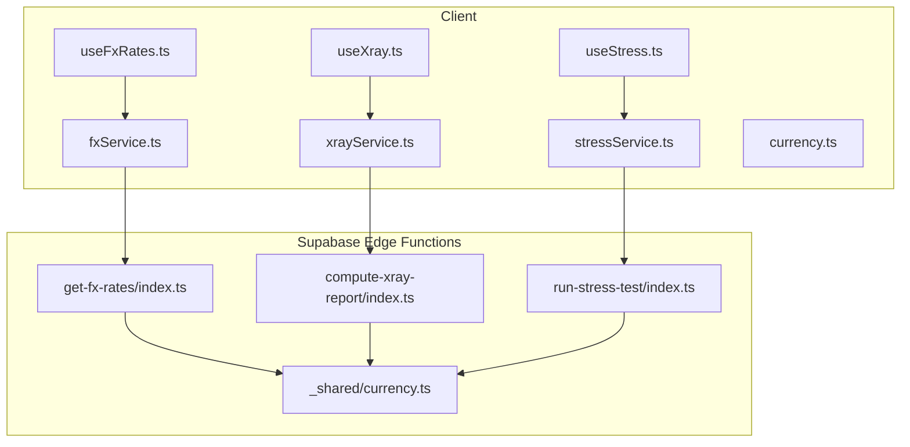
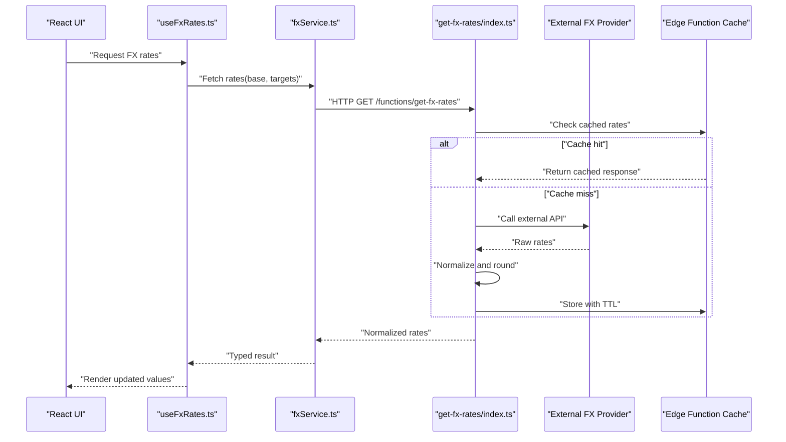
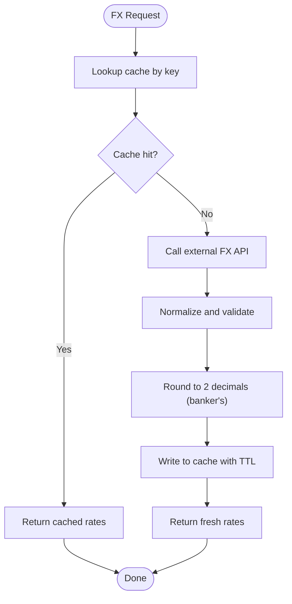
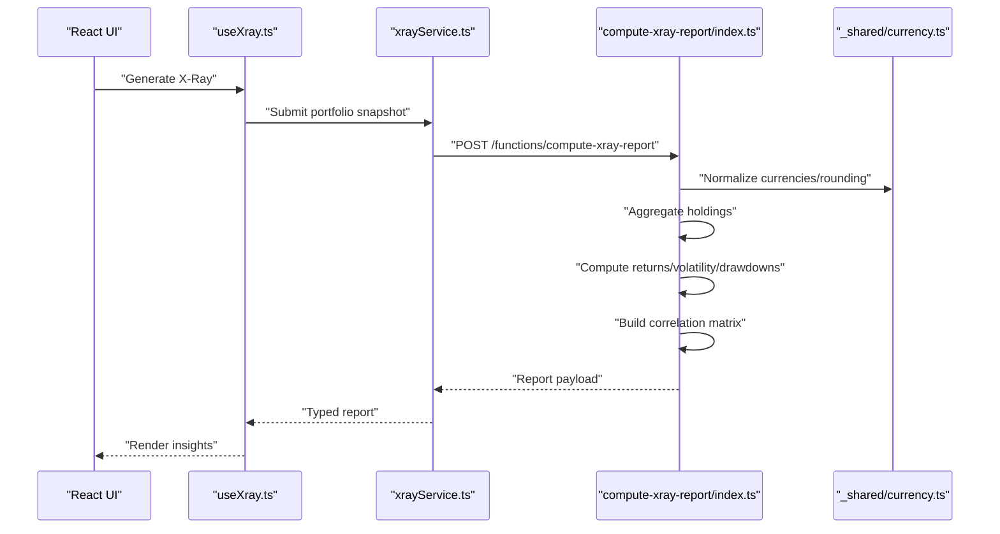
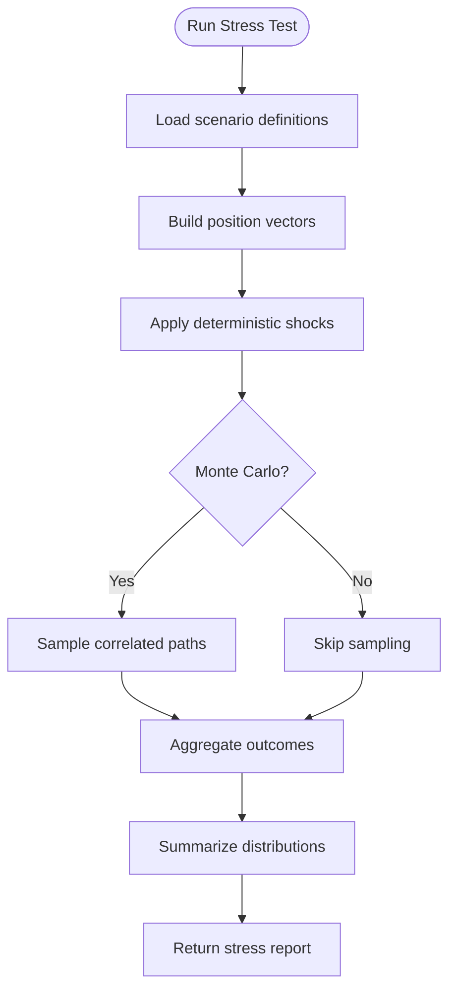
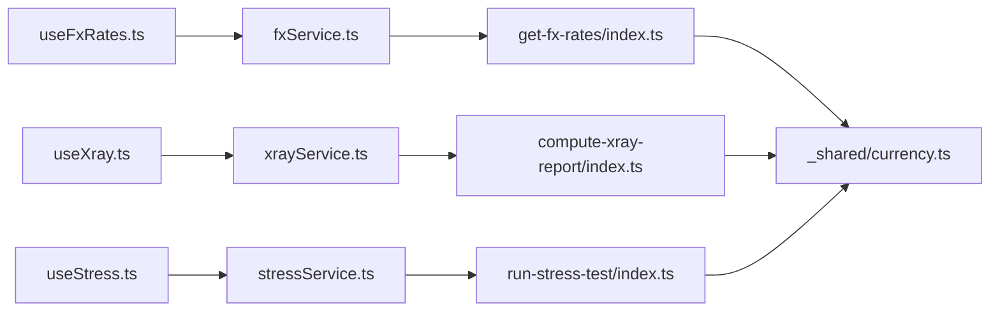

# Financial Computation Functions

<cite>
**Referenced Files in This Document**
- [get-fx-rates/index.ts](file://supabase/functions/get-fx-rates/index.ts)
- [compute-xray-report/index.ts](file://supabase/functions/compute-xray-report/index.ts)
- [run-stress-test/index.ts](file://supabase/functions/run-stress-test/index.ts)
- [_shared/currency.ts](file://supabase/functions/_shared/currency.ts)
- [useFxRates.ts](file://src/hooks/useFxRates.ts)
- [fxService.ts](file://src/services/fxService.ts)
- [currency.ts](file://src/lib/currency.ts)
- [useXray.ts](file://src/hooks/useXray.ts)
- [xrayService.ts](file://src/services/xrayService.ts)
- [useStress.ts](file://src/hooks/useStress.ts)
- [stressService.ts](file://src/services/stressService.ts)
</cite>

## Table of Contents
1. [Introduction](#introduction)
2. [Project Structure](#project-structure)
3. [Core Components](#core-components)
4. [Architecture Overview](#architecture-overview)
5. [Detailed Component Analysis](#detailed-component-analysis)
6. [Dependency Analysis](#dependency-analysis)
7. [Performance Considerations](#performance-considerations)
8. [Troubleshooting Guide](#troubleshooting-guide)
9. [Conclusion](#conclusion)
10. [Appendices](#appendices)

## Introduction
This document explains the financial computation edge functions in FinSight with a focus on:
- Real-time currency exchange rate fetching from external APIs, caching strategies, and rate limiting
- X-Ray report generation algorithms, portfolio analysis calculations, and risk assessment computations
- Stress testing engine implementation, scenario simulation, and performance impact analysis
- Examples of financial calculations, data aggregation, and report generation
- Precision handling for financial data, calculation accuracy, and computational efficiency
- Guidelines for extending financial models and adding new analysis types

The goal is to provide both high-level architecture understanding and code-level details for developers integrating or extending these capabilities.

## Project Structure
FinSight implements financial computations primarily as Supabase Edge Functions (serverless), with client-side hooks and services coordinating requests and UI state. The key files are:
- Currency exchange rates: get-fx-rates edge function, shared currency utilities, and client integration
- X-Ray reports: compute-xray-report edge function and client hooks/services
- Stress testing: run-stress-test edge function and client hooks/services

**Diagram sources**
- [useFxRates.ts](file://src/hooks/useFxRates.ts)
- [fxService.ts](file://src/services/fxService.ts)
- [useXray.ts](file://src/hooks/useXray.ts)
- [xrayService.ts](file://src/services/xrayService.ts)
- [useStress.ts](file://src/hooks/useStress.ts)
- [stressService.ts](file://src/services/stressService.ts)
- [get-fx-rates/index.ts](file://supabase/functions/get-fx-rates/index.ts)
- [compute-xray-report/index.ts](file://supabase/functions/compute-xray-report/index.ts)
- [run-stress-test/index.ts](file://supabase/functions/run-stress-test/index.ts)
- [_shared/currency.ts](file://supabase/functions/_shared/currency.ts)

**Section sources**
- [get-fx-rates/index.ts](file://supabase/functions/get-fx-rates/index.ts)
- [compute-xray-report/index.ts](file://supabase/functions/compute-xray-report/index.ts)
- [run-stress-test/index.ts](file://supabase/functions/run-stress-test/index.ts)
- [_shared/currency.ts](file://supabase/functions/_shared/currency.ts)
- [useFxRates.ts](file://src/hooks/useFxRates.ts)
- [fxService.ts](file://src/services/fxService.ts)
- [useXray.ts](file://src/hooks/useXray.ts)
- [xrayService.ts](file://src/services/xrayService.ts)
- [useStress.ts](file://src/hooks/useStress.ts)
- [stressService.ts](file://src/services/stressService.ts)
- [currency.ts](file://src/lib/currency.ts)

## Core Components
- Currency Exchange Rate Service
  - Purpose: Fetch real-time FX rates from external providers, cache results, and enforce rate limits.
  - Key responsibilities:
    - Request external API endpoints for live rates
    - Cache responses with TTL-based invalidation
    - Apply rate limiting to avoid provider throttling
    - Normalize currencies and handle precision consistently
- X-Ray Report Engine
  - Purpose: Generate comprehensive portfolio insights including asset allocation, performance metrics, and risk indicators.
  - Key responsibilities:
    - Aggregate holdings across accounts and assets
    - Compute returns, volatility, drawdowns, and correlation matrices
    - Produce structured report payloads for client rendering
- Stress Testing Engine
  - Purpose: Simulate adverse market scenarios and quantify portfolio impact.
  - Key responsibilities:
    - Define and apply shock parameters to asset classes
    - Run Monte Carlo or deterministic simulations
    - Summarize distributional outcomes and tail risks

**Section sources**
- [get-fx-rates/index.ts](file://supabase/functions/get-fx-rates/index.ts)
- [compute-xray-report/index.ts](file://supabase/functions/compute-xray-report/index.ts)
- [run-stress-test/index.ts](file://supabase/functions/run-stress-test/index.ts)
- [_shared/currency.ts](file://supabase/functions/_shared/currency.ts)

## Architecture Overview
The system separates concerns between client orchestration and server-side computation:
- Client hooks manage request lifecycle, caching, and UI updates
- Services encapsulate HTTP calls and payload shaping
- Edge functions perform heavy computations and integrate with external APIs
- Shared utilities standardize currency normalization and precision handling

**Diagram sources**
- [useFxRates.ts](file://src/hooks/useFxRates.ts)
- [fxService.ts](file://src/services/fxService.ts)
- [get-fx-rates/index.ts](file://supabase/functions/get-fx-rates/index.ts)

## Detailed Component Analysis

### Currency Exchange Rates: Real-Time Fetching, Caching, and Rate Limiting
- External API Integration
  - The edge function calls an external FX provider and normalizes outputs into a consistent structure.
  - It supports base/target pairs and returns only requested conversions to minimize payload size.
- Caching Strategy
  - Responses are cached with time-to-live (TTL). Subsequent requests within the TTL window return cached data.
  - Cache keys incorporate base currency, target list, and any provider-specific parameters to ensure correctness.
- Rate Limiting
  - The function enforces per-interval limits to prevent overuse of the external API.
  - Backoff and retry policies can be applied when encountering transient errors or throttling.
- Precision Handling
  - All monetary values are rounded to two decimal places using banker’s rounding to reduce bias.
  - Intermediate calculations use higher precision to avoid cumulative rounding errors.

**Diagram sources**
- [get-fx-rates/index.ts](file://supabase/functions/get-fx-rates/index.ts)
- [_shared/currency.ts](file://supabase/functions/_shared/currency.ts)

**Section sources**
- [get-fx-rates/index.ts](file://supabase/functions/get-fx-rates/index.ts)
- [_shared/currency.ts](file://supabase/functions/_shared/currency.ts)
- [useFxRates.ts](file://src/hooks/useFxRates.ts)
- [fxService.ts](file://src/services/fxService.ts)
- [currency.ts](file://src/lib/currency.ts)

### X-Ray Report Generation: Algorithms, Portfolio Analysis, and Risk Assessment
- Data Aggregation
  - Holdings are aggregated by asset class, sector, geography, and currency exposure.
  - Time-series inputs are aligned to common dates and normalized for missing data points.
- Performance Metrics
  - Returns computed using time-weighted and money-weighted methods where applicable.
  - Volatility calculated via annualized standard deviation; Sharpe ratio derived using risk-free proxy.
- Risk Indicators
  - Drawdowns computed from peak-to-trough declines.
  - Correlation matrix built across asset classes to inform diversification analysis.
- Output Structure
  - Reports include summary statistics, breakdowns, charts-ready arrays, and metadata for versioning.

**Diagram sources**
- [useXray.ts](file://src/hooks/useXray.ts)
- [xrayService.ts](file://src/services/xrayService.ts)
- [compute-xray-report/index.ts](file://supabase/functions/compute-xray-report/index.ts)
- [_shared/currency.ts](file://supabase/functions/_shared/currency.ts)

**Section sources**
- [compute-xray-report/index.ts](file://supabase/functions/compute-xray-report/index.ts)
- [_shared/currency.ts](file://supabase/functions/_shared/currency.ts)
- [useXray.ts](file://src/hooks/useXray.ts)
- [xrayService.ts](file://src/services/xrayService.ts)

### Stress Testing Engine: Scenario Simulation and Impact Analysis
- Scenario Definition
  - Scenarios specify shocks per asset class or factor (e.g., equity -20%, rates +150bps).
  - Historical and hypothetical scenarios can be composed and weighted.
- Simulation Methods
  - Deterministic shocks applied to current positions for immediate impact.
  - Monte Carlo sampling for probabilistic outcomes with configurable confidence levels.
- Outputs
  - Distribution summaries (mean, median, percentiles), worst-case loss, and recovery estimates.
  - Breakdown by asset class and sensitivity drivers.

**Diagram sources**
- [run-stress-test/index.ts](file://supabase/functions/run-stress-test/index.ts)
- [_shared/currency.ts](file://supabase/functions/_shared/currency.ts)

**Section sources**
- [run-stress-test/index.ts](file://supabase/functions/run-stress-test/index.ts)
- [_shared/currency.ts](file://supabase/functions/_shared/currency.ts)
- [useStress.ts](file://src/hooks/useStress.ts)
- [stressService.ts](file://src/services/stressService.ts)

## Dependency Analysis
The following diagram shows how client components depend on services and edge functions, and how shared utilities are reused across computations.

**Diagram sources**
- [useFxRates.ts](file://src/hooks/useFxRates.ts)
- [fxService.ts](file://src/services/fxService.ts)
- [get-fx-rates/index.ts](file://supabase/functions/get-fx-rates/index.ts)
- [useXray.ts](file://src/hooks/useXray.ts)
- [xrayService.ts](file://src/services/xrayService.ts)
- [compute-xray-report/index.ts](file://supabase/functions/compute-xray-report/index.ts)
- [useStress.ts](file://src/hooks/useStress.ts)
- [stressService.ts](file://src/services/stressService.ts)
- [run-stress-test/index.ts](file://supabase/functions/run-stress-test/index.ts)
- [_shared/currency.ts](file://supabase/functions/_shared/currency.ts)

**Section sources**
- [useFxRates.ts](file://src/hooks/useFxRates.ts)
- [fxService.ts](file://src/services/fxService.ts)
- [get-fx-rates/index.ts](file://supabase/functions/get-fx-rates/index.ts)
- [useXray.ts](file://src/hooks/useXray.ts)
- [xrayService.ts](file://src/services/xrayService.ts)
- [compute-xray-report/index.ts](file://supabase/functions/compute-xray-report/index.ts)
- [useStress.ts](file://src/hooks/useStress.ts)
- [stressService.ts](file://src/services/stressService.ts)
- [run-stress-test/index.ts](file://supabase/functions/run-stress-test/index.ts)
- [_shared/currency.ts](file://supabase/functions/_shared/currency.ts)

## Performance Considerations
- Caching and TTL
  - Use short TTLs for FX rates to balance freshness and cost.
  - Prefer cache-first strategies on the client side to reduce network calls.
- Batch Requests
  - Aggregate multiple currency conversions into single requests to minimize overhead.
- Computational Efficiency
  - Vectorize operations for large portfolios; avoid nested loops where possible.
  - Precompute static inputs (e.g., correlation matrices) and invalidate only when underlying data changes.
- Precision vs. Speed
  - Maintain higher internal precision during intermediate steps; round only at output boundaries.
- Concurrency Limits
  - Respect provider rate limits and implement exponential backoff with jitter.

[No sources needed since this section provides general guidance]

## Troubleshooting Guide
- FX Rate Failures
  - Validate provider availability and credentials.
  - Inspect cache keys and TTL configuration if stale data appears.
  - Review rate limit headers and adjust intervals accordingly.
- X-Ray Report Errors
  - Ensure all required fields exist in portfolio snapshots.
  - Verify date alignment and handle missing periods gracefully.
  - Confirm rounding rules and currency normalization are applied consistently.
- Stress Test Issues
  - Check scenario parameter ranges and correlation assumptions.
  - Monitor memory usage for large Monte Carlo runs; consider chunking iterations.
  - Validate input distributions and seed reproducibility for debugging.

**Section sources**
- [get-fx-rates/index.ts](file://supabase/functions/get-fx-rates/index.ts)
- [compute-xray-report/index.ts](file://supabase/functions/compute-xray-report/index.ts)
- [run-stress-test/index.ts](file://supabase/functions/run-stress-test/index.ts)
- [_shared/currency.ts](file://supabase/functions/_shared/currency.ts)

## Conclusion
FinSight’s financial computation layer combines robust edge functions with efficient client orchestration to deliver accurate, timely insights. By leveraging caching, rate limiting, and precise numerical handling, the system balances performance and reliability. The modular design enables easy extension of models and addition of new analyses while maintaining consistency across currency normalization and reporting formats.

[No sources needed since this section summarizes without analyzing specific files]

## Appendices

### Examples of Financial Calculations
- Currency Conversion
  - Convert multi-currency holdings to a base currency using normalized rates.
  - Apply consistent rounding to two decimals after conversion.
- Portfolio Metrics
  - Compute daily returns, aggregate to monthly/annual figures, and derive volatility.
  - Calculate maximum drawdown and recovery time from historical series.
- Risk Assessment
  - Build correlation matrices across asset classes and compute marginal contributions to risk.
  - Estimate Value-at-Risk and Conditional VaR under specified confidence levels.
- Report Generation
  - Assemble structured JSON with sections for summary, allocations, performance, and risk.
  - Include metadata such as timestamps, model versions, and data sources.

[No sources needed since this section provides general guidance]

### Guidelines for Extending Financial Models
- Add New Asset Classes
  - Extend classification mappings and update correlation assumptions.
  - Introduce appropriate shock profiles for stress scenarios.
- Implement New Analytics
  - Create dedicated edge functions for specialized computations.
  - Standardize input/output schemas and reuse shared currency utilities.
- Improve Precision and Accuracy
  - Adopt fixed-point arithmetic libraries where necessary.
  - Document rounding policies and validation rules clearly.
- Enhance Observability
  - Log key metrics (latency, cache hits, error rates) without sensitive data.
  - Instrument performance counters for long-running simulations.

[No sources needed since this section provides general guidance]