# Function Architecture & Patterns

<cite>
**Referenced Files in This Document**
- [auth.ts](file://supabase/functions/_shared/auth.ts)
- [currency.ts](file://supabase/functions/_shared/currency.ts)
- [asset-normalize.ts](file://supabase/functions/_shared/asset-normalize.ts)
- [index.ts (get-fx-rates)](file://supabase/functions/get-fx-rates/index.ts)
- [index.ts (parse-asset-csv)](file://supabase/functions/parse-asset-csv/index.ts)
- [index.ts (recognize-holdings-ocr)](file://supabase/functions/recognize-holdings-ocr/index.ts)
- [index.ts (create-shared-report)](file://supabase/functions/create-shared-report/index.ts)
- [index.ts (read-shared-report)](file://supabase/functions/read-shared-report/index.ts)
- [index.ts (ai-doctor-chat)](file://supabase/functions/ai-doctor-chat/index.ts)
- [index.ts (compute-xray-report)](file://supabase/functions/compute-xray-report/index.ts)
- [index.ts (run-stress-test)](file://supabase/functions/run-stress-test/index.ts)
- [index.ts (s3-pre-sign-url)](file://supabase/functions/s3-pre-sign-url/index.ts)
- [index.ts (seed-demo-portfolio)](file://supabase/functions/seed-demo-portfolio/index.ts)
</cite>

## Table of Contents
1. [Introduction](#introduction)
2. [Project Structure](#project-structure)
3. [Core Components](#core-components)
4. [Architecture Overview](#architecture-overview)
5. [Detailed Component Analysis](#detailed-component-analysis)
6. [Dependency Analysis](#dependency-analysis)
7. [Performance Considerations](#performance-considerations)
8. [Troubleshooting Guide](#troubleshooting-guide)
9. [Conclusion](#conclusion)

## Introduction
This document explains the Edge Functions architecture and development patterns used in FinSight. It focuses on shared utilities, authentication middleware patterns, common function templates, request/response handling conventions, error propagation strategies, logging implementation, and security patterns such as input sanitization and access control. The goal is to provide a consistent, secure, and maintainable approach for building new edge functions that integrate with Supabase services and external APIs.

## Project Structure
FinSight organizes its serverless endpoints under supabase/functions. Each function is a directory containing an index.ts entry point. Shared logic is centralized under supabase/functions/_shared to avoid duplication across functions.

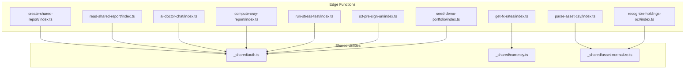

**Diagram sources**
- [index.ts (get-fx-rates)](file://supabase/functions/get-fx-rates/index.ts)
- [index.ts (parse-asset-csv)](file://supabase/functions/parse-asset-csv/index.ts)
- [index.ts (recognize-holdings-ocr)](file://supabase/functions/recognize-holdings-ocr/index.ts)
- [index.ts (create-shared-report)](file://supabase/functions/create-shared-report/index.ts)
- [index.ts (read-shared-report)](file://supabase/functions/read-shared-report/index.ts)
- [index.ts (ai-doctor-chat)](file://supabase/functions/ai-doctor-chat/index.ts)
- [index.ts (compute-xray-report)](file://supabase/functions/compute-xray-report/index.ts)
- [index.ts (run-stress-test)](file://supabase/functions/run-stress-test/index.ts)
- [index.ts (s3-pre-sign-url)](file://supabase/functions/s3-pre-sign-url/index.ts)
- [index.ts (seed-demo-portfolio)](file://supabase/functions/seed-demo-portfolio/index.ts)
- [auth.ts](file://supabase/functions/_shared/auth.ts)
- [currency.ts](file://supabase/functions/_shared/currency.ts)
- [asset-normalize.ts](file://supabase/functions/_shared/asset-normalize.ts)

**Section sources**
- [auth.ts](file://supabase/functions/_shared/auth.ts)
- [currency.ts](file://supabase/functions/_shared/currency.ts)
- [asset-normalize.ts](file://supabase/functions/_shared/asset-normalize.ts)
- [index.ts (get-fx-rates)](file://supabase/functions/get-fx-rates/index.ts)
- [index.ts (parse-asset-csv)](file://supabase/functions/parse-asset-csv/index.ts)
- [index.ts (recognize-holdings-ocr)](file://supabase/functions/recognize-holdings-ocr/index.ts)
- [index.ts (create-shared-report)](file://supabase/functions/create-shared-report/index.ts)
- [index.ts (read-shared-report)](file://supabase/functions/read-shared-report/index.ts)
- [index.ts (ai-doctor-chat)](file://supabase/functions/ai-doctor-chat/index.ts)
- [index.ts (compute-xray-report)](file://supabase/functions/compute-xray-report/index.ts)
- [index.ts (run-stress-test)](file://supabase/functions/run-stress-test/index.ts)
- [index.ts (s3-pre-sign-url)](file://supabase/functions/s3-pre-sign-url/index.ts)
- [index.ts (seed-demo-portfolio)](file://supabase/functions/seed-demo-portfolio/index.ts)

## Core Components
The shared modules encapsulate cross-cutting concerns:

- Authentication and authorization helpers: validate Supabase JWT claims, enforce user context, and provide typed session objects.
- Currency conversion utilities: normalize currency codes, fetch or cache exchange rates, and convert amounts between currencies.
- Asset normalization functions: standardize asset records from various import formats into a canonical schema.

These components are imported by individual functions to ensure consistent behavior, reduce duplication, and centralize security and data validation logic.

**Section sources**
- [auth.ts](file://supabase/functions/_shared/auth.ts)
- [currency.ts](file://supabase/functions/_shared/currency.ts)
- [asset-normalize.ts](file://supabase/functions/_shared/asset-normalize.ts)

## Architecture Overview
Each edge function follows a uniform pattern:
- Parse and validate the incoming request body and headers.
- Authenticate and authorize using shared auth helpers.
- Execute business logic using shared utilities.
- Return standardized JSON responses with appropriate status codes.
- Propagate errors consistently with structured messages.

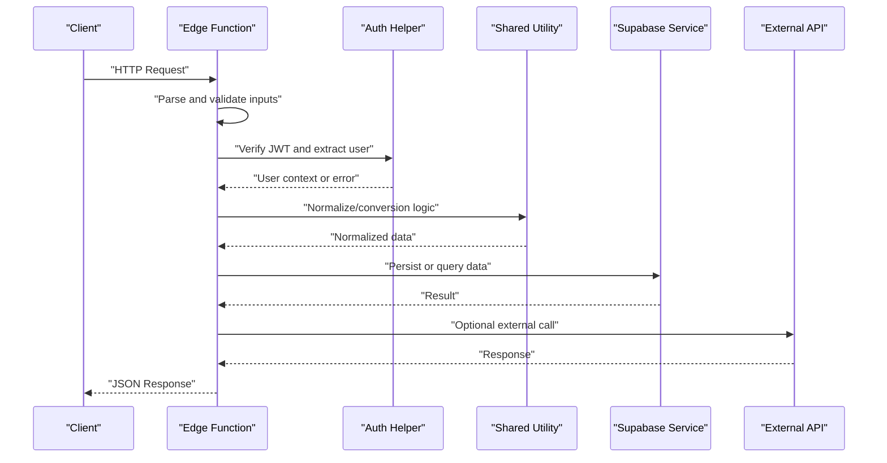

[No sources needed since this diagram shows conceptual workflow, not actual code structure]

## Detailed Component Analysis

### Shared Authentication Module
Purpose:
- Validate Supabase JWT tokens.
- Extract user identity and roles.
- Enforce access policies per function scope.

Key responsibilities:
- Token verification and decoding.
- User context creation.
- Authorization checks for protected routes.

Security considerations:
- Reject invalid or expired tokens early.
- Fail closed when required claims are missing.
- Avoid leaking sensitive claims in logs.

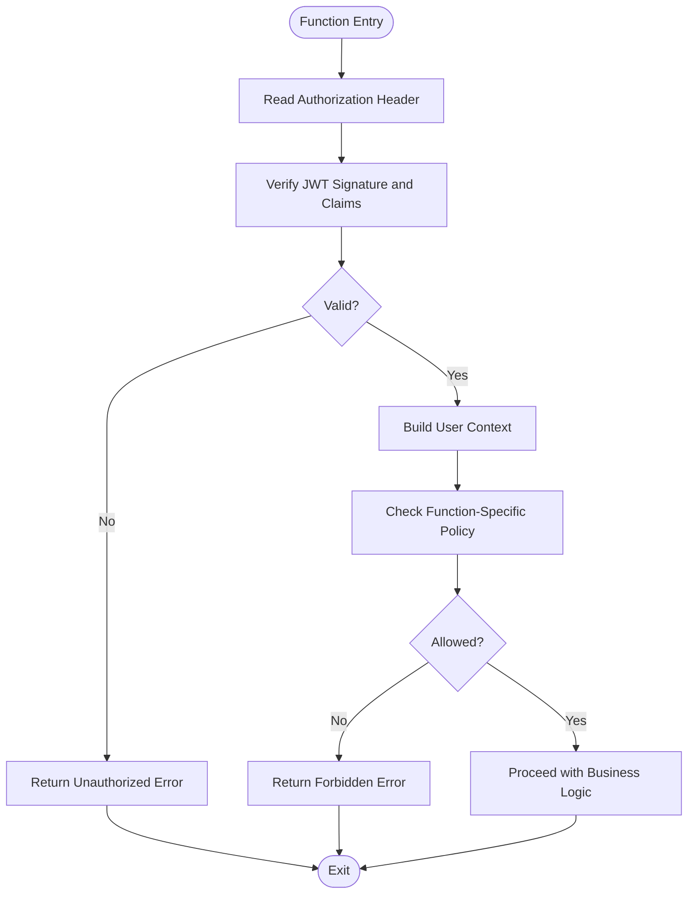

**Diagram sources**
- [auth.ts](file://supabase/functions/_shared/auth.ts)

**Section sources**
- [auth.ts](file://supabase/functions/_shared/auth.ts)

### Currency Conversion Utilities
Purpose:
- Normalize ISO currency codes.
- Fetch exchange rates from external providers.
- Convert amounts between currencies deterministically.

Key responsibilities:
- Input validation for currency codes and amounts.
- Rate retrieval and caching strategy.
- Rounding and precision handling.

Error handling:
- Distinguish between network failures and invalid inputs.
- Provide actionable error messages.

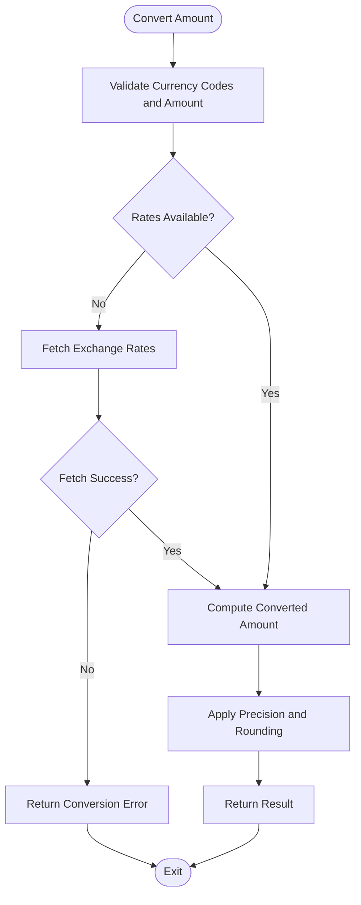

**Diagram sources**
- [currency.ts](file://supabase/functions/_shared/currency.ts)

**Section sources**
- [currency.ts](file://supabase/functions/_shared/currency.ts)

### Asset Normalization Functions
Purpose:
- Standardize heterogeneous asset imports (CSV, OCR, manual forms).
- Map diverse field names to a canonical asset schema.
- Ensure required fields and valid types before persistence.

Key responsibilities:
- Field mapping and transformation.
- Type coercion and validation.
- Deduplication and conflict resolution hints.

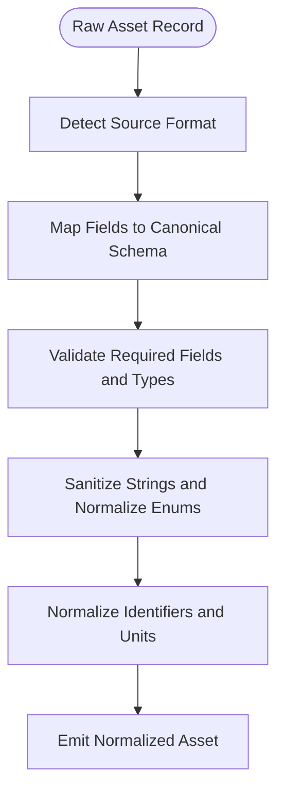

**Diagram sources**
- [asset-normalize.ts](file://supabase/functions/_shared/asset-normalize.ts)

**Section sources**
- [asset-normalize.ts](file://supabase/functions/_shared/asset-normalize.ts)

### Example Function Templates

#### Get FX Rates
Responsibilities:
- Accept optional base currency and date parameters.
- Use currency utilities to retrieve and return normalized rates.
- Cache results where appropriate.

Request/Response:
- Query parameters validated against allowed values.
- Returns a JSON object with rate entries keyed by currency code.

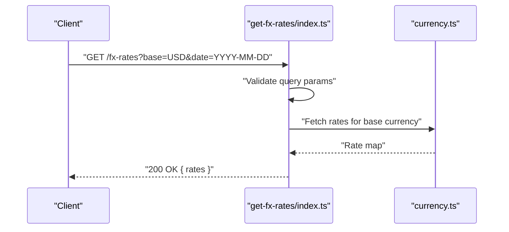

**Diagram sources**
- [index.ts (get-fx-rates)](file://supabase/functions/get-fx-rates/index.ts)
- [currency.ts](file://supabase/functions/_shared/currency.ts)

**Section sources**
- [index.ts (get-fx-rates)](file://supabase/functions/get-fx-rates/index.ts)
- [currency.ts](file://supabase/functions/_shared/currency.ts)

#### Parse Asset CSV
Responsibilities:
- Accept CSV payload.
- Parse rows and normalize each record using asset utilities.
- Return summary and normalized assets.

Input validation:
- Enforce maximum file size and supported MIME type.
- Validate header presence and row counts.

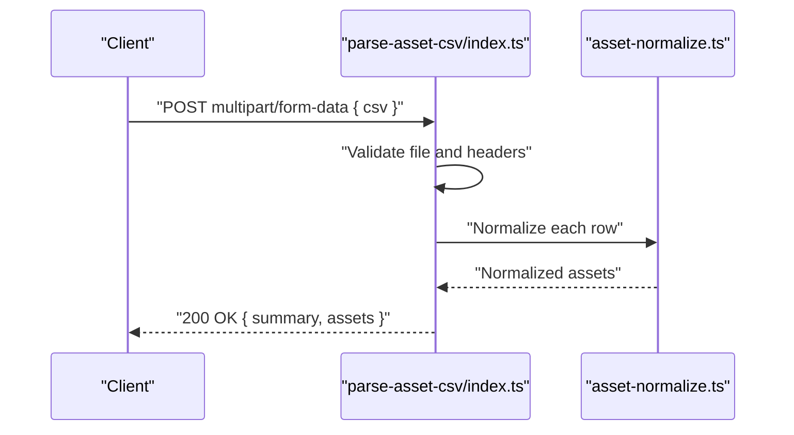

**Diagram sources**
- [index.ts (parse-asset-csv)](file://supabase/functions/parse-asset-csv/index.ts)
- [asset-normalize.ts](file://supabase/functions/_shared/asset-normalize.ts)

**Section sources**
- [index.ts (parse-asset-csv)](file://supabase/functions/parse-asset-csv/index.ts)
- [asset-normalize.ts](file://supabase/functions/_shared/asset-normalize.ts)

#### Recognize Holdings via OCR
Responsibilities:
- Accept image upload.
- Process with OCR service.
- Extract holdings and normalize them.

Access control:
- Require authenticated user context.
- Limit processing to authorized portfolios if applicable.

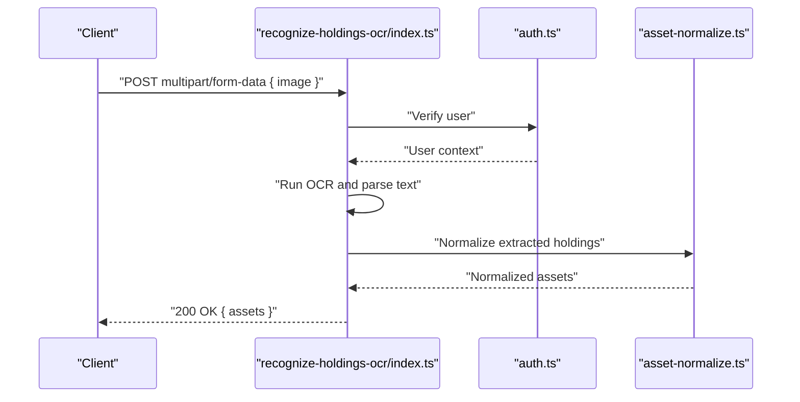

**Diagram sources**
- [index.ts (recognize-holdings-ocr)](file://supabase/functions/recognize-holdings-ocr/index.ts)
- [auth.ts](file://supabase/functions/_shared/auth.ts)
- [asset-normalize.ts](file://supabase/functions/_shared/asset-normalize.ts)

**Section sources**
- [index.ts (recognize-holdings-ocr)](file://supabase/functions/recognize-holdings-ocr/index.ts)
- [auth.ts](file://supabase/functions/_shared/auth.ts)
- [asset-normalize.ts](file://supabase/functions/_shared/asset-normalize.ts)

#### Create Shared Report
Responsibilities:
- Create a shareable report link tied to user’s portfolio.
- Enforce ownership or explicit sharing permissions.

Access control:
- Validate user owns the report or has permission to create it.

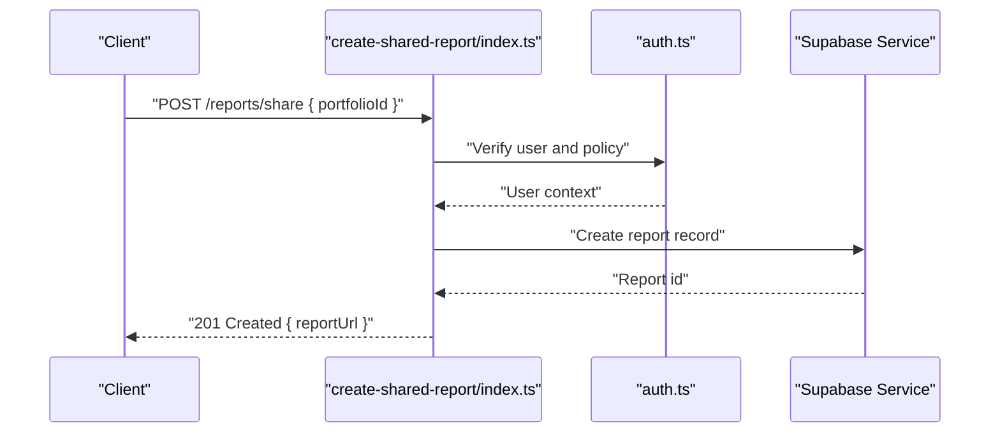

**Diagram sources**
- [index.ts (create-shared-report)](file://supabase/functions/create-shared-report/index.ts)
- [auth.ts](file://supabase/functions/_shared/auth.ts)

**Section sources**
- [index.ts (create-shared-report)](file://supabase/functions/create-shared-report/index.ts)
- [auth.ts](file://supabase/functions/_shared/auth.ts)

#### Read Shared Report
Responsibilities:
- Retrieve report by public identifier.
- Optionally enforce read-only access controls.

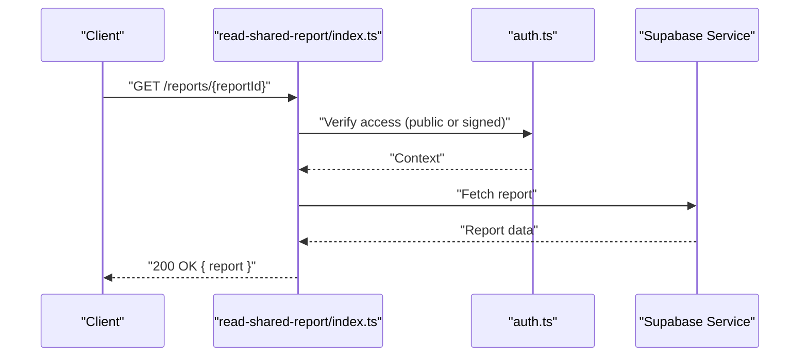

**Diagram sources**
- [index.ts (read-shared-report)](file://supabase/functions/read-shared-report/index.ts)
- [auth.ts](file://supabase/functions/_shared/auth.ts)

**Section sources**
- [index.ts (read-shared-report)](file://supabase/functions/read-shared-report/index.ts)
- [auth.ts](file://supabase/functions/_shared/auth.ts)

#### AI Doctor Chat
Responsibilities:
- Handle chat requests with user context.
- Integrate with LLM provider securely.
- Sanitize prompts and redact sensitive data.

Security:
- Validate message length and content.
- Log only non-sensitive metadata.

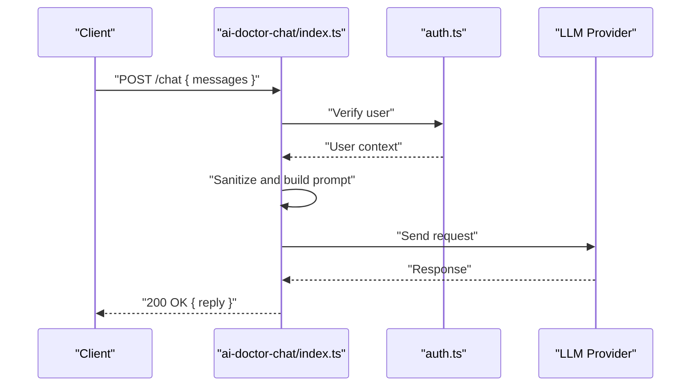

**Diagram sources**
- [index.ts (ai-doctor-chat)](file://supabase/functions/ai-doctor-chat/index.ts)
- [auth.ts](file://supabase/functions/_shared/auth.ts)

**Section sources**
- [index.ts (ai-doctor-chat)](file://supabase/functions/ai-doctor-chat/index.ts)
- [auth.ts](file://supabase/functions/_shared/auth.ts)

#### Compute X-Ray Report
Responsibilities:
- Aggregate analytics and compute risk metrics.
- Use normalized assets and currency conversions.

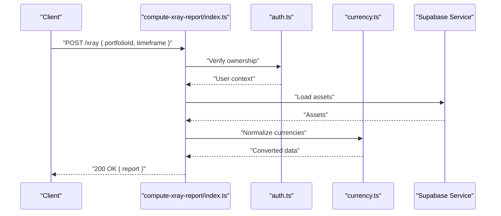

**Diagram sources**
- [index.ts (compute-xray-report)](file://supabase/functions/compute-xray-report/index.ts)
- [auth.ts](file://supabase/functions/_shared/auth.ts)
- [currency.ts](file://supabase/functions/_shared/currency.ts)

**Section sources**
- [index.ts (compute-xray-report)](file://supabase/functions/compute-xray-report/index.ts)
- [auth.ts](file://supabase/functions/_shared/auth.ts)
- [currency.ts](file://supabase/functions/_shared/currency.ts)

#### Run Stress Test
Responsibilities:
- Execute synthetic workloads for performance testing.
- Respect rate limits and quotas.

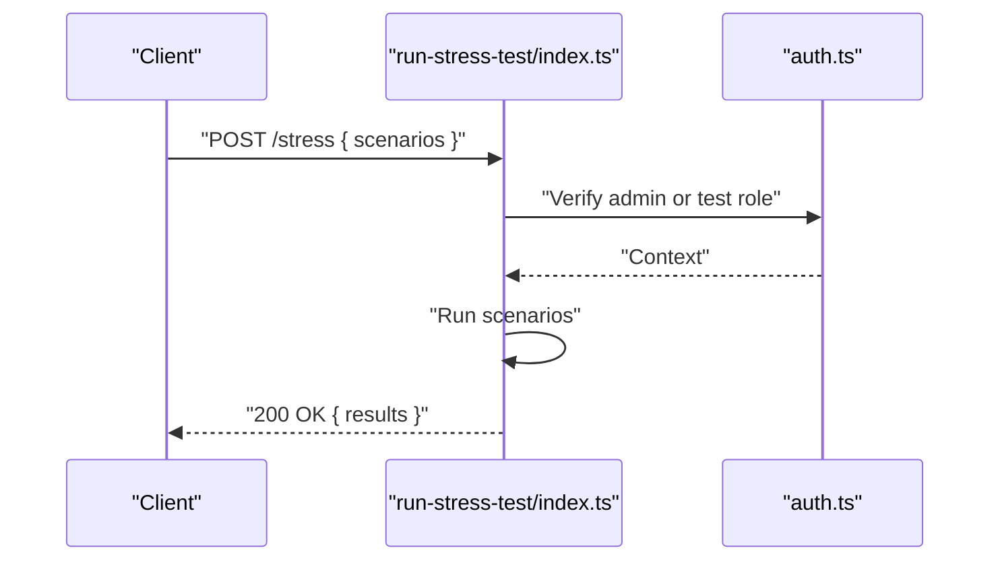

**Diagram sources**
- [index.ts (run-stress-test)](file://supabase/functions/run-stress-test/index.ts)
- [auth.ts](file://supabase/functions/_shared/auth.ts)

**Section sources**
- [index.ts (run-stress-test)](file://supabase/functions/run-stress-test/index.ts)
- [auth.ts](file://supabase/functions/_shared/auth.ts)

#### S3 Pre-Sign URL
Responsibilities:
- Generate time-limited upload URLs for client uploads.
- Enforce bucket and key prefix restrictions.

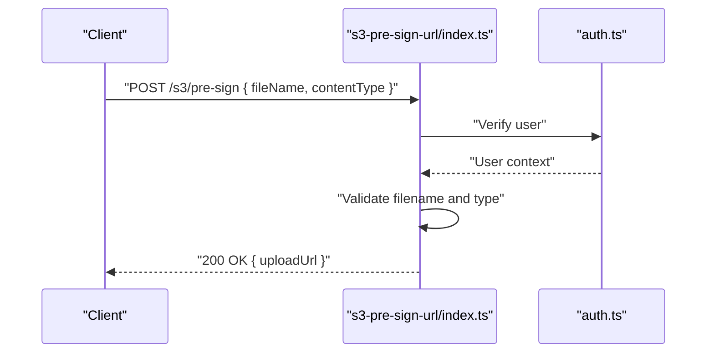

**Diagram sources**
- [index.ts (s3-pre-sign-url)](file://supabase/functions/s3-pre-sign-url/index.ts)
- [auth.ts](file://supabase/functions/_shared/auth.ts)

**Section sources**
- [index.ts (s3-pre-sign-url)](file://supabase/functions/s3-pre-sign-url/index.ts)
- [auth.ts](file://supabase/functions/_shared/auth.ts)

#### Seed Demo Portfolio
Responsibilities:
- Populate sample data for onboarding or demos.
- Ensure idempotency and safe defaults.

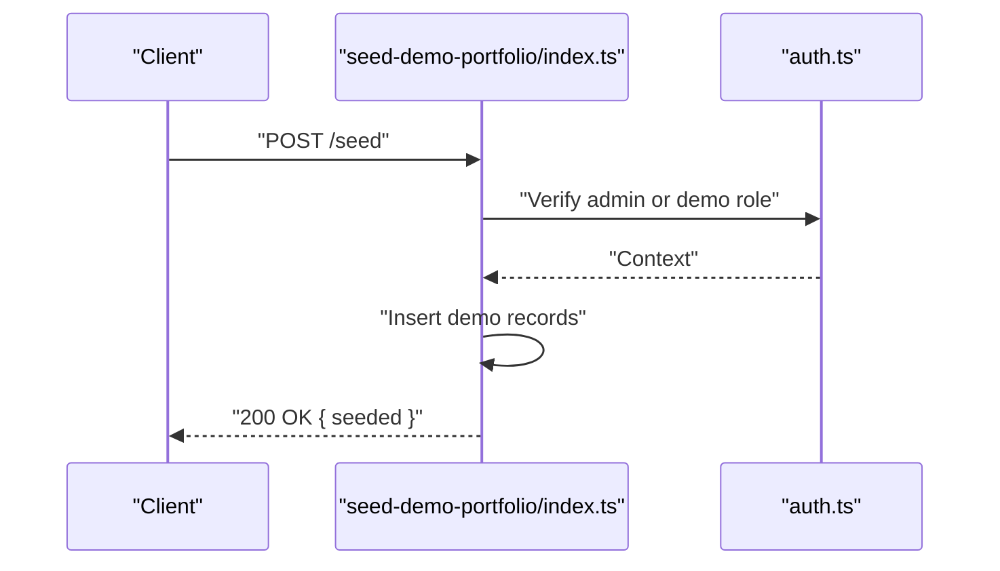

**Diagram sources**
- [index.ts (seed-demo-portfolio)](file://supabase/functions/seed-demo-portfolio/index.ts)
- [auth.ts](file://supabase/functions/_shared/auth.ts)

**Section sources**
- [index.ts (seed-demo-portfolio)](file://supabase/functions/seed-demo-portfolio/index.ts)
- [auth.ts](file://supabase/functions/_shared/auth.ts)

## Dependency Analysis
Functions depend on shared modules for consistency and security. The following diagram highlights direct dependencies:

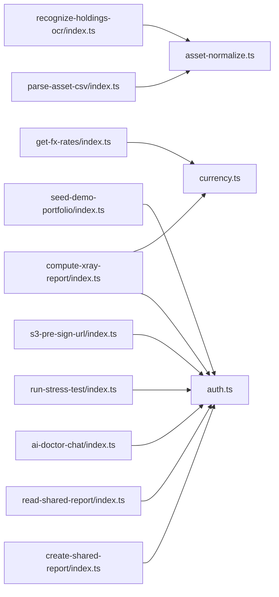

**Diagram sources**
- [index.ts (get-fx-rates)](file://supabase/functions/get-fx-rates/index.ts)
- [index.ts (parse-asset-csv)](file://supabase/functions/parse-asset-csv/index.ts)
- [index.ts (recognize-holdings-ocr)](file://supabase/functions/recognize-holdings-ocr/index.ts)
- [index.ts (create-shared-report)](file://supabase/functions/create-shared-report/index.ts)
- [index.ts (read-shared-report)](file://supabase/functions/read-shared-report/index.ts)
- [index.ts (ai-doctor-chat)](file://supabase/functions/ai-doctor-chat/index.ts)
- [index.ts (compute-xray-report)](file://supabase/functions/compute-xray-report/index.ts)
- [index.ts (run-stress-test)](file://supabase/functions/run-stress-test/index.ts)
- [index.ts (s3-pre-sign-url)](file://supabase/functions/s3-pre-sign-url/index.ts)
- [index.ts (seed-demo-portfolio)](file://supabase/functions/seed-demo-portfolio/index.ts)
- [auth.ts](file://supabase/functions/_shared/auth.ts)
- [currency.ts](file://supabase/functions/_shared/currency.ts)
- [asset-normalize.ts](file://supabase/functions/_shared/asset-normalize.ts)

**Section sources**
- [auth.ts](file://supabase/functions/_shared/auth.ts)
- [currency.ts](file://supabase/functions/_shared/currency.ts)
- [asset-normalize.ts](file://supabase/functions/_shared/asset-normalize.ts)
- [index.ts (get-fx-rates)](file://supabase/functions/get-fx-rates/index.ts)
- [index.ts (parse-asset-csv)](file://supabase/functions/parse-asset-csv/index.ts)
- [index.ts (recognize-holdings-ocr)](file://supabase/functions/recognize-holdings-ocr/index.ts)
- [index.ts (create-shared-report)](file://supabase/functions/create-shared-report/index.ts)
- [index.ts (read-shared-report)](file://supabase/functions/read-shared-report/index.ts)
- [index.ts (ai-doctor-chat)](file://supabase/functions/ai-doctor-chat/index.ts)
- [index.ts (compute-xray-report)](file://supabase/functions/compute-xray-report/index.ts)
- [index.ts (run-stress-test)](file://supabase/functions/run-stress-test/index.ts)
- [index.ts (s3-pre-sign-url)](file://supabase/functions/s3-pre-sign-url/index.ts)
- [index.ts (seed-demo-portfolio)](file://supabase/functions/seed-demo-portfolio/index.ts)

## Performance Considerations
- Minimize cold starts by keeping dependencies lean and avoiding heavy initialization at module load time.
- Cache frequently accessed data (e.g., exchange rates) within function execution boundaries where possible.
- Stream large payloads when feasible and enforce strict size limits to prevent abuse.
- Prefer batch operations and efficient queries to reduce database round-trips.
- Use deterministic rounding and fixed precision arithmetic for financial calculations.

[No sources needed since this section provides general guidance]

## Troubleshooting Guide
Common issues and resolutions:
- Authentication failures: verify JWT validity, correct headers, and environment configuration.
- Invalid inputs: check parameter validation and sanitize strings; return clear error messages.
- External API errors: distinguish transient vs permanent failures and implement retries with backoff.
- Logging pitfalls: avoid logging sensitive data; include correlation IDs for tracing.

Operational tips:
- Centralize error formatting to ensure consistent client responses.
- Add structured logging with timestamps, function name, and request ID.
- Implement health checks for critical dependencies (database, external APIs).

[No sources needed since this section provides general guidance]

## Conclusion
FinSight’s Edge Functions follow a consistent architecture centered around shared utilities for authentication, currency conversion, and asset normalization. By adhering to standardized request/response patterns, robust error propagation, and strong security practices, new functions can be developed quickly while maintaining safety and reliability.

[No sources needed since this section summarizes without analyzing specific files]