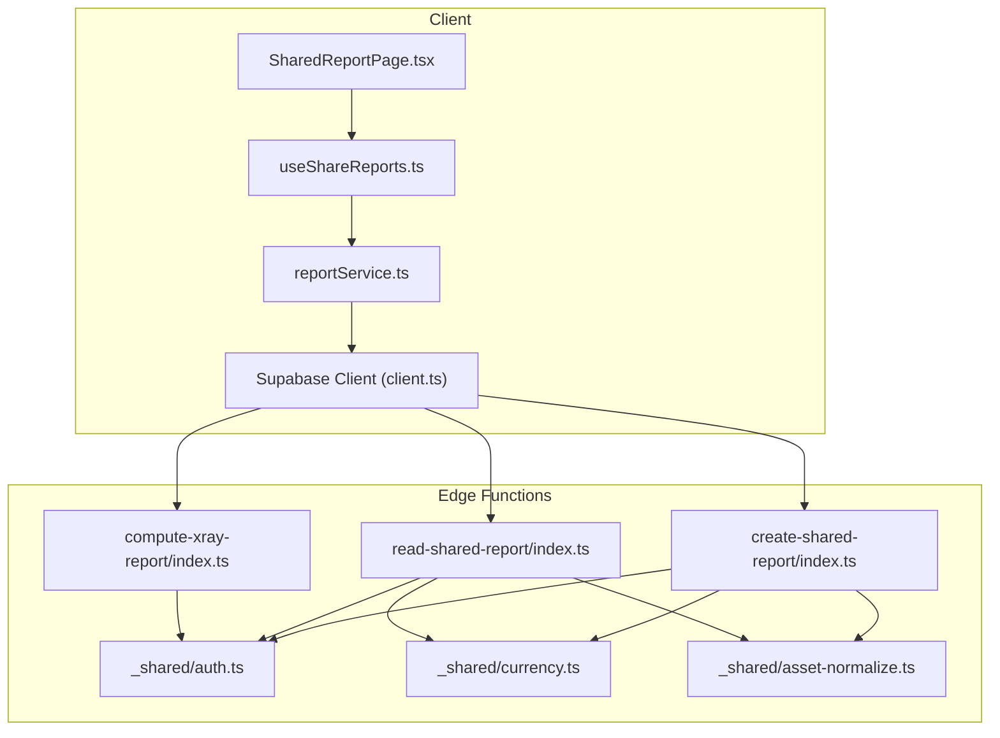
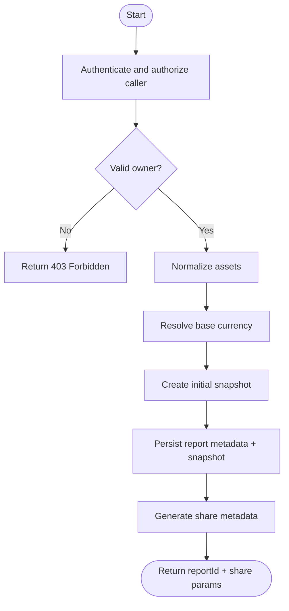
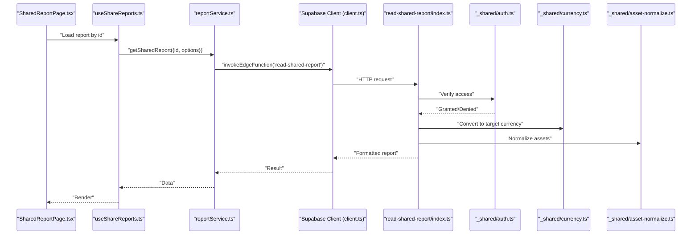
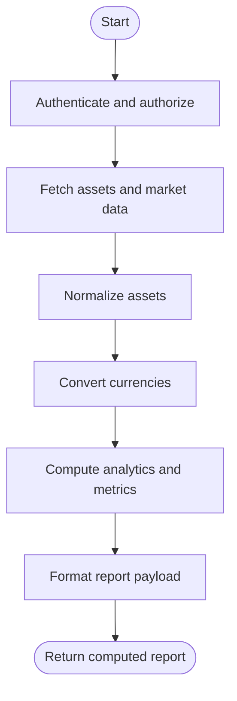
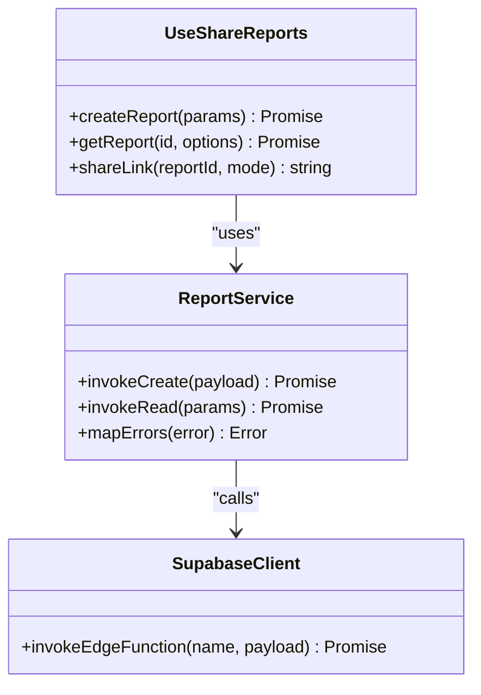
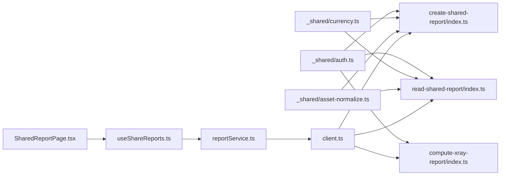

# Report Generation Functions

<cite>
**Referenced Files in This Document**
- [create-shared-report/index.ts](file://supabase/functions/create-shared-report/index.ts)
- [read-shared-report/index.ts](file://supabase/functions/read-shared-report/index.ts)
- [compute-xray-report/index.ts](file://supabase/functions/compute-xray-report/index.ts)
- [_shared/auth.ts](file://supabase/functions/_shared/auth.ts)
- [_shared/currency.ts](file://supabase/functions/_shared/currency.ts)
- [_shared/asset-normalize.ts](file://supabase/functions/_shared/asset-normalize.ts)
- [useShareReports.ts](file://src/hooks/useShareReports.ts)
- [reportService.ts](file://src/services/reportService.ts)
- [SharedReportPage.tsx](file://src/pages/desktop/SharedReportPage.tsx)
- [client.ts](file://src/integrations/supabase/client.ts)
</cite>

## Table of Contents
1. [Introduction](#introduction)
2. [Project Structure](#project-structure)
3. [Core Components](#core-components)
4. [Architecture Overview](#architecture-overview)
5. [Detailed Component Analysis](#detailed-component-analysis)
6. [Dependency Analysis](#dependency-analysis)
7. [Performance Considerations](#performance-considerations)
8. [Troubleshooting Guide](#troubleshooting-guide)
9. [Conclusion](#conclusion)
10. [Appendices](#appendices)

## Introduction
This document explains the report generation edge functions and client-side integration in FinSight. It covers shared report creation, read operations with access control, data aggregation and formatting, export capabilities, versioning and audit trails, template customization, dynamic content generation, sharing mechanisms, security considerations, and guidelines for extending reporting functionality. The goal is to provide both a high-level understanding and actionable guidance for developers building or customizing reports.

## Project Structure
FinSight implements serverless edge functions for secure report operations and a client layer that orchestrates calls, permissions, and UI rendering.



**Diagram sources**
- [SharedReportPage.tsx](file://src/pages/desktop/SharedReportPage.tsx)
- [useShareReports.ts](file://src/hooks/useShareReports.ts)
- [reportService.ts](file://src/services/reportService.ts)
- [client.ts](file://src/integrations/supabase/client.ts)
- [create-shared-report/index.ts](file://supabase/functions/create-shared-report/index.ts)
- [read-shared-report/index.ts](file://supabase/functions/read-shared-report/index.ts)
- [compute-xray-report/index.ts](file://supabase/functions/compute-xray-report/index.ts)
- [_shared/auth.ts](file://supabase/functions/_shared/auth.ts)
- [_shared/currency.ts](file://supabase/functions/_shared/currency.ts)
- [_shared/asset-normalize.ts](file://supabase/functions/_shared/asset-normalize.ts)

**Section sources**
- [SharedReportPage.tsx](file://src/pages/desktop/SharedReportPage.tsx)
- [useShareReports.ts](file://src/hooks/useShareReports.ts)
- [reportService.ts](file://src/services/reportService.ts)
- [client.ts](file://src/integrations/supabase/client.ts)
- [create-shared-report/index.ts](file://supabase/functions/create-shared-report/index.ts)
- [read-shared-report/index.ts](file://supabase/functions/read-shared-report/index.ts)
- [compute-xray-report/index.ts](file://supabase/functions/compute-xray-report/index.ts)
- [_shared/auth.ts](file://supabase/functions/_shared/auth.ts)
- [_shared/currency.ts](file://supabase/functions/_shared/currency.ts)
- [_shared/asset-normalize.ts](file://supabase/functions/_shared/asset-normalize.ts)

## Core Components
- Shared report creation: Edge function to create a shareable report artifact with permission metadata and initial snapshot.
- Shared report reading: Edge function to fetch a report by ID with access control checks and optional currency normalization.
- X-Ray report computation: Edge function to compute derived analytics and render a detailed report view.
- Shared utilities: Authentication helper, currency conversion, and asset normalization used across functions.
- Client hooks and services: React hook and service layer to call edge functions, handle errors, and manage state.
- UI page: Dedicated page to render shared reports and expose sharing controls.

Key responsibilities:
- Enforce authentication and authorization at the edge before any data access.
- Aggregate portfolio data, normalize assets, convert currencies, and format outputs.
- Provide stable identifiers for versioning and auditing.
- Expose safe endpoints for public readers via token-based or record-scoped access.

**Section sources**
- [create-shared-report/index.ts](file://supabase/functions/create-shared-report/index.ts)
- [read-shared-report/index.ts](file://supabase/functions/read-shared-report/index.ts)
- [compute-xray-report/index.ts](file://supabase/functions/compute-xray-report/index.ts)
- [_shared/auth.ts](file://supabase/functions/_shared/auth.ts)
- [_shared/currency.ts](file://supabase/functions/_shared/currency.ts)
- [_shared/asset-normalize.ts](file://supabase/functions/_shared/asset-normalize.ts)
- [useShareReports.ts](file://src/hooks/useShareReports.ts)
- [reportService.ts](file://src/services/reportService.ts)
- [SharedReportPage.tsx](file://src/pages/desktop/SharedReportPage.tsx)

## Architecture Overview
The system follows a clear separation between client orchestration and server-side enforcement:

```mermaid
sequenceDiagram
participant UI as "SharedReportPage.tsx"
participant Hook as "useShareReports.ts"
participant Svc as "reportService.ts"
participant SB as "Supabase Client (client.ts)"
participant Create as "create-shared-report/index.ts"
participant Read as "read-shared-report/index.ts"
participant Auth as "_shared/auth.ts"
participant Cur as "_shared/currency.ts"
participant Norm as "_shared/asset-normalize.ts"
UI->>Hook : "Create report"
Hook->>Svc : "call createSharedReport(params)"
Svc->>SB : "invokeEdgeFunction('create-shared-report', payload)"
SB->>Create : "HTTP request"
Create->>Auth : "verify session/user"
Auth-->>Create : "user context"
Create->>Cur : "normalize currency inputs"
Create->>Norm : "normalize assets"
Create-->>SB : "created report id + snapshot"
SB-->>Svc : "result"
Svc-->>Hook : "success"
Hook-->>UI : "redirect to shared report"
UI->>Hook : "Read shared report"
Hook->>Svc : "call getSharedReport(id)"
Svc->>SB : "invokeEdgeFunction('read-shared-report', {id})"
SB->>Read : "HTTP request"
Read->>Auth : "verify access"
Auth-->>Read : "access granted/denied"
Read->>Cur : "convert to target currency"
Read->>Norm : "normalize assets"
Read-->>SB : "report data"
SB-->>Svc : "result"
Svc-->>Hook : "data"
Hook-->>UI : "render report"
```

**Diagram sources**
- [SharedReportPage.tsx](file://src/pages/desktop/SharedReportPage.tsx)
- [useShareReports.ts](file://src/hooks/useShareReports.ts)
- [reportService.ts](file://src/services/reportService.ts)
- [client.ts](file://src/integrations/supabase/client.ts)
- [create-shared-report/index.ts](file://supabase/functions/create-shared-report/index.ts)
- [read-shared-report/index.ts](file://supabase/functions/read-shared-report/index.ts)
- [_shared/auth.ts](file://supabase/functions/_shared/auth.ts)
- [_shared/currency.ts](file://supabase/functions/_shared/currency.ts)
- [_shared/asset-normalize.ts](file://supabase/functions/_shared/asset-normalize.ts)

## Detailed Component Analysis

### Shared Report Creation Workflow
Purpose:
- Create a new report with an immutable identifier and initial snapshot.
- Attach permission metadata (owner, visibility, collaborators).
- Normalize input assets and currencies before persisting.

Processing logic:
- Authenticate caller and validate ownership.
- Validate and sanitize inputs.
- Normalize assets using shared utility.
- Convert or store base currency information.
- Persist report metadata and snapshot.
- Return report ID and share link parameters.

Security:
- Enforce user identity and ownership at the edge.
- Reject unauthorized requests early.
- Avoid leaking sensitive fields in responses.

Export and collaboration:
- Generate shareable URL parameters based on report ID and access mode.
- Optionally include expiration or role flags for collaborators.



**Diagram sources**
- [create-shared-report/index.ts](file://supabase/functions/create-shared-report/index.ts)
- [_shared/auth.ts](file://supabase/functions/_shared/auth.ts)
- [_shared/asset-normalize.ts](file://supabase/functions/_shared/asset-normalize.ts)
- [_shared/currency.ts](file://supabase/functions/_shared/currency.ts)

**Section sources**
- [create-shared-report/index.ts](file://supabase/functions/create-shared-report/index.ts)
- [_shared/auth.ts](file://supabase/functions/_shared/auth.ts)
- [_shared/asset-normalize.ts](file://supabase/functions/_shared/asset-normalize.ts)
- [_shared/currency.ts](file://supabase/functions/_shared/currency.ts)

### Shared Report Read Operations with Access Control
Purpose:
- Retrieve a report by ID with strict access control.
- Support public reads via tokens or record-scoped permissions.
- Normalize and format output for consistent rendering.

Access control:
- Verify caller identity when authenticated.
- Validate token or permission flags for unauthenticated reads.
- Enforce minimum required fields and mask sensitive data.

Data processing:
- Load report metadata and snapshot.
- Normalize assets and apply currency conversions if requested.
- Format aggregated metrics and charts data.

Versioning and audit:
- Include version identifiers and timestamps.
- Append audit entries for read events (optional).



**Diagram sources**
- [read-shared-report/index.ts](file://supabase/functions/read-shared-report/index.ts)
- [_shared/auth.ts](file://supabase/functions/_shared/auth.ts)
- [_shared/currency.ts](file://supabase/functions/_shared/currency.ts)
- [_shared/asset-normalize.ts](file://supabase/functions/_shared/asset-normalize.ts)
- [useShareReports.ts](file://src/hooks/useShareReports.ts)
- [reportService.ts](file://src/services/reportService.ts)
- [client.ts](file://src/integrations/supabase/client.ts)
- [SharedReportPage.tsx](file://src/pages/desktop/SharedReportPage.tsx)

**Section sources**
- [read-shared-report/index.ts](file://supabase/functions/read-shared-report/index.ts)
- [_shared/auth.ts](file://supabase/functions/_shared/auth.ts)
- [_shared/currency.ts](file://supabase/functions/_shared/currency.ts)
- [_shared/asset-normalize.ts](file://supabase/functions/_shared/asset-normalize.ts)
- [useShareReports.ts](file://src/hooks/useShareReports.ts)
- [reportService.ts](file://src/services/reportService.ts)
- [client.ts](file://src/integrations/supabase/client.ts)
- [SharedReportPage.tsx](file://src/pages/desktop/SharedReportPage.tsx)

### X-Ray Report Computation
Purpose:
- Compute advanced analytics and risk metrics for a portfolio.
- Produce a structured report suitable for visualization and export.

Processing logic:
- Authenticate and authorize the requester.
- Fetch underlying assets and market data.
- Apply normalization and currency conversion.
- Compute derived metrics and aggregate results.
- Return formatted report payload.



**Diagram sources**
- [compute-xray-report/index.ts](file://supabase/functions/compute-xray-report/index.ts)
- [_shared/auth.ts](file://supabase/functions/_shared/auth.ts)
- [_shared/asset-normalize.ts](file://supabase/functions/_shared/asset-normalize.ts)
- [_shared/currency.ts](file://supabase/functions/_shared/currency.ts)

**Section sources**
- [compute-xray-report/index.ts](file://supabase/functions/compute-xray-report/index.ts)
- [_shared/auth.ts](file://supabase/functions/_shared/auth.ts)
- [_shared/asset-normalize.ts](file://supabase/functions/_shared/asset-normalize.ts)
- [_shared/currency.ts](file://supabase/functions/_shared/currency.ts)

### Client Integration: Hooks and Services
Responsibilities:
- Encapsulate edge function invocations.
- Handle loading states, retries, and error mapping.
- Provide typed interfaces for report payloads.
- Manage caching and invalidation strategies.

Usage patterns:
- useShareReports provides hooks for creating and reading shared reports.
- reportService centralizes API calls and parameter validation.
- Supabase client configures edge function invocation.



**Diagram sources**
- [useShareReports.ts](file://src/hooks/useShareReports.ts)
- [reportService.ts](file://src/services/reportService.ts)
- [client.ts](file://src/integrations/supabase/client.ts)

**Section sources**
- [useShareReports.ts](file://src/hooks/useShareReports.ts)
- [reportService.ts](file://src/services/reportService.ts)
- [client.ts](file://src/integrations/supabase/client.ts)

### UI Rendering: Shared Report Page
Responsibilities:
- Display shared report data returned from the read operation.
- Provide sharing controls and copy-to-clipboard actions.
- Handle loading and error states gracefully.
- Render dynamic content based on report type and template.

Integration points:
- Uses hooks to fetch report data.
- Invokes services to refresh or re-export.
- Displays version and audit info when available.

**Section sources**
- [SharedReportPage.tsx](file://src/pages/desktop/SharedReportPage.tsx)
- [useShareReports.ts](file://src/hooks/useShareReports.ts)
- [reportService.ts](file://src/services/reportService.ts)

## Dependency Analysis
Edge functions depend on shared utilities for auth, currency, and asset normalization. The client depends on the Supabase client to invoke these functions.



**Diagram sources**
- [_shared/auth.ts](file://supabase/functions/_shared/auth.ts)
- [_shared/currency.ts](file://supabase/functions/_shared/currency.ts)
- [_shared/asset-normalize.ts](file://supabase/functions/_shared/asset-normalize.ts)
- [create-shared-report/index.ts](file://supabase/functions/create-shared-report/index.ts)
- [read-shared-report/index.ts](file://supabase/functions/read-shared-report/index.ts)
- [compute-xray-report/index.ts](file://supabase/functions/compute-xray-report/index.ts)
- [client.ts](file://src/integrations/supabase/client.ts)
- [reportService.ts](file://src/services/reportService.ts)
- [useShareReports.ts](file://src/hooks/useShareReports.ts)
- [SharedReportPage.tsx](file://src/pages/desktop/SharedReportPage.tsx)

**Section sources**
- [_shared/auth.ts](file://supabase/functions/_shared/auth.ts)
- [_shared/currency.ts](file://supabase/functions/_shared/currency.ts)
- [_shared/asset-normalize.ts](file://supabase/functions/_shared/asset-normalize.ts)
- [create-shared-report/index.ts](file://supabase/functions/create-shared-report/index.ts)
- [read-shared-report/index.ts](file://supabase/functions/read-shared-report/index.ts)
- [compute-xray-report/index.ts](file://supabase/functions/compute-xray-report/index.ts)
- [client.ts](file://src/integrations/supabase/client.ts)
- [reportService.ts](file://src/services/reportService.ts)
- [useShareReports.ts](file://src/hooks/useShareReports.ts)
- [SharedReportPage.tsx](file://src/pages/desktop/SharedReportPage.tsx)

## Performance Considerations
- Prefer server-side normalization and currency conversion to reduce client overhead.
- Cache report snapshots where appropriate; invalidate on updates.
- Paginate large datasets and return only necessary fields for read operations.
- Use minimal payloads for public reads; defer heavy computations to authenticated flows.
- Batch related operations to minimize network round-trips.

[No sources needed since this section provides general guidance]

## Troubleshooting Guide
Common issues and resolutions:
- Authentication failures: Ensure valid session or token is provided; verify edge function auth helper behavior.
- Permission denied: Confirm ownership or collaborator roles; check access flags in share metadata.
- Currency conversion errors: Validate supported currencies and rates availability; fallback to base currency if needed.
- Asset normalization errors: Check asset schema compliance; ensure required fields are present.
- Client invocation errors: Inspect error mapping in the service layer; retry with backoff for transient failures.

Operational tips:
- Log edge function execution times and error codes for diagnostics.
- Include correlation IDs in requests and responses to trace flows.
- Validate inputs on the client before invoking edge functions to fail fast.

**Section sources**
- [_shared/auth.ts](file://supabase/functions/_shared/auth.ts)
- [_shared/currency.ts](file://supabase/functions/_shared/currency.ts)
- [_shared/asset-normalize.ts](file://supabase/functions/_shared/asset-normalize.ts)
- [reportService.ts](file://src/services/reportService.ts)
- [useShareReports.ts](file://src/hooks/useShareReports.ts)

## Conclusion
FinSight’s report generation functions implement a secure, extensible architecture centered on edge functions for authentication, normalization, and formatting. The client layer provides clean abstractions for creating, reading, and sharing reports while maintaining strong access control and auditability. By following the guidelines below, teams can safely extend reporting features and introduce new report types without compromising security or performance.

[No sources needed since this section summarizes without analyzing specific files]

## Appendices

### Security Considerations for Shared Reports
- Always authenticate and authorize at the edge before accessing data.
- Limit publicly accessible fields; avoid returning sensitive details.
- Use short-lived tokens or scoped permissions for unauthenticated reads.
- Enforce rate limiting and input validation on all endpoints.
- Audit access events and maintain immutable logs for compliance.

[No sources needed since this section provides general guidance]

### Guidelines for Custom Report Types and Extensions
- Define a clear report schema with versioning and timestamps.
- Implement a dedicated edge function per report type to isolate concerns.
- Reuse shared utilities for normalization and currency conversion.
- Provide client hooks and services tailored to each report type.
- Add export handlers (PDF, CSV) within the same function or via separate endpoints.
- Integrate template engines for dynamic content generation and branding.
- Test thoroughly with varied inputs and edge cases; add unit tests for normalization and formatting logic.

[No sources needed since this section provides general guidance]